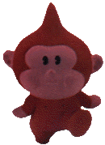


One of the most difficult things about playing an import like Mother 1+2 and not knowing Japanese is trying to keep track of your items. Because of this, certain locations in Mother 2 can be a huge hurdle for many people. Below are some quick guide and other helpful info to help players get through these areas as quickly and painlessly as possible.

  
<UL>
 <LI><A HREF="http://starmen.net/vote/vote.php?id=11026">Giant Step</A></LI>
 <LI><A HREF="http://starmen.net/vote/vote.php?id=11192">Lilliput Steps</A></LI>
 <LI><A HREF="http://starmen.net/vote/vote.php?id=11205">Peaceful Rest Valley</A></LI>
 <LI><A HREF="http://starmen.net/vote/vote.php?id=11436">Monkey Caves</A></LI>
 <LI><A HREF="http://starmen.net/vote/vote.php?id=11437">Recommended Items for Monkey Cave</A></LI>
</UL>

