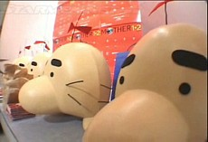
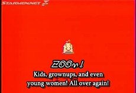
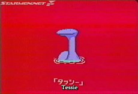
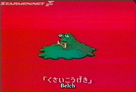
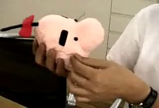
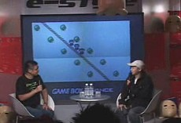
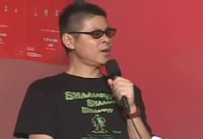


<ul class="pics">
<li>

<h3>MOTHER 1+2 Event Video (Subtitled)</h3>

In June of 2003, an official MOTHER 1+2 event was held in Shibuya, Japan. This video is a nice 10-minute documentary of the festivities there. This is definitely a must-see for any EB fan!

<a href="http://www.youtube.com/watch?v=lKpaKlatg5M">View streaming video</a> <a href="m12event_subbed.avi">Download the AVI</a> (69.7 MB, 9:45)

</li>

<li>

<h3>MOTHER 1+2 Commercial #1</h3>

The first commercial that ran for the compilation featured Mr. Saturn with a quirky message stating that the Mother RPGs were returning to Game Boy Advance. The commercial ended with the surprise announcement that Mother 3 was in development for Game Boy Advance.

<a href="http://www.youtube.com/watch?v=lYbtDeUh-9c">View streaming video</a> <a href="m12com1_subbed.avi">Download the AVI</a> (1.57 MB, 0:16)

</li>

<li>

<h3>MOTHER 1+2 Commercial #2</h3>

The second commercial that ran for the compilation held a greater focus on the memorable characters of Mother 2, but still featured some Mother footage. This time it asked if the Mother games were just weird or moving RPGs. Dr. Saturn pops up in the end.

<a href="http://www.youtube.com/watch?v=uczeXfwPPgk">View streaming video</a> <a href="m12com2_subbed.avi">Download the AVI</a> (2.68 MB, 0:15)

</li>

<li>

<h3>MOTHER 1+2 Commercial #3</h3>

We had no idea there was a third and a fourth commercial for years. But luckily Tomato found a copy of the third one on a tape of random Japanese TV. What luck! This commercial is similar in style to the second commercial.

<a href="http://www.youtube.com/watch?v=zb55SD0PdVU">View streaming video</a> <a href="m12com3_subbed.avi">Download the AVI</a> (3.29 MB, 0:15)

</li>

<li>

<h3>MOTHER 1+2 Commercial #4</h3>

This is a partial video of the fourth Mother 1+2 commercial. Please let us know if you know where we can get the full version! Please!

<a href="http://www.youtube.com/watch?v=l2HEhcN9pfs">View streaming video</a> <a href="m12com4_subbed.avi">Download the AVI</a> (581 KB, 0:05)

</li>

<li>

<h3>Mr. Saturn Art Book Demonstration</h3>

EarthBound series creator Shigesato Itoi demos the <a href="/merchandise/misc/m12artbook.php">Mr. Saturn Art Book</a> and the little <a href="/merchandise/misc/msplushie.php">plushie Mr. Saturn</a> that comes vaccuum-packed inside of it.

<a href="http://www.youtube.com/watch?v=t34JZdgQKJY">View streaming video</a> <a href="doseisan_book2.avi">Download the AVI</a> (996 KB, 1:10)

</li>

<li>

<h3>MOTHER 1+2 Event Raw Footage (Part 1)</h3>

This is raw video from the MOTHER 1+2 event in 2003. This first part consists of Itoi and BOSE just chatting about the games, most of which can be seen in the subtitled video above. This video is unsubbed for now, though.

<a href="http://video.google.com/videoplay?docid=6529346396427523606&hl=en">View streaming video</a> <a href="m12_part1.wmv">Download the WMV</a> (68.1 MB, 16:14)

</li>

<li>

<h3>MOTHER 1+2 Event Raw Footage (Part 2)</h3>

This second part of the MOTHER 1+2 event video consists of questions from the audience. For now, this video is unsubbed.

<a href="http://video.google.com/videoplay?docid=-6068958183584199386&hl=en">View streaming video</a> <a href="m12_part2.wmv">Download the WMV</a> (76.4 MB, 18:13)

</li>

</ul>

