

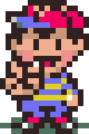

 <a class="picright" href="onett12.png" title="Garbage Picker!">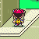</a>  <a class="picright" href="moonside6.png" title="Uh oh">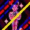</a> 

Ness, a seemingly regular young boy with a tremendous aptitude for PSI, begins his adventure when he is awakened by the sound of an impacting meteorite near his house.  He is then informed of his heroic destiny and potential by Buzz Buzz, an insect-like being from 10 years in the future, who emerged from the object.  Once he is enlightened to his fate, to defeat the Universal Cosmic Destroyer, Giygas, Ness sets out to gain power by channeling the energy of the Earth itself through his “Sanctuaries”.  Along the way, he also assembles the rest of his fellow protagonists, the Chosen Four, and learns the extent of his psychological abilities.  Eventually, Ness acquires all of his Sanctuary locations, and subsequently is thrust into the realm of his mind: Magicant.  After transcending Magicant as well, Ness is finally prepared to take on Giygas.  Traveling thousands of years to the past, Ness and his friends confront Giygas (as well as his right-hand man, Pokey), and ultimately defeat him once and for all.
 

PSI Abilities

<table border="1">
  <tr>
    <th>Offensive</th>
    <th>Healing</th>
    <th>Assist</th>
    <th>Other</th>
  </tr>
  <tr>
    <td>Favorite Thing (αβγΩ)</td>
    <td>Lifeup (αβγΩ)</td>
    <td>Shield (αβ)</td>
    <td>Teleport (αβ)</td>
  </tr>
  <tr>
    <td>Flash (αβγΩ)</td>
    <td>Healing (αβγ)</td>
    <td>Paralysis (αΩ)</td>
    <td></td>
  </tr>
  <tr>
    <td></td>
    <td></td>
    <td>Hypnosis (αΩ)</td>
    <td></td>
  </tr>
</table> 

Written by <a href="http://forum.starmen.net/members/AmateurGamer">AmateurGamer</a>





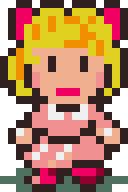

 <a class="picright" href="hhvillage3.png" title="Help Me!">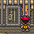</a>  <a class="picright" href="dalaam8.png" title="It's battlin' time">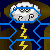</a> 

Paula is the psychic powerhouse of the team but you probably wouldn’t expect that coming from a teenage preschool aide.  Paula is a native of Twoson, the second town on our hero’s journey.  She lives with her Mother and Father in their home that also serves as a day-care for young children known as the Polestar Preschool.  She is very well liked by all of the children there and some even claim they want to be “juuuusst like Paula” when they grow up.  Paula is also quite the celebrity in her hometown.  Because of her psychic prowess she’s the subject of a lot of talk in Twoson and reporters constantly visit her home in the hopes of getting an interview with such a wunderkind. 
 
Although she is quick with a bash from her non-stick fry pan, her real strength lies in her psychokinetic powers.  Paula’s psychic battery is the most one of the most extensive in the game.  For offensive abilities she has three powerful elemental PSIs, fire, freeze and thunder. “Well, if she’s the female magic user than she must have a lot of healing spells right?” NOPE!  Not in EarthBound anyway, we don’t stick to those tired character archetypes.  The only recovery ability she has is PSI magnet that allows her to take away psychic points from enemies and use them herself.  
 
Out of battle, Paula’s psychic abilities are able to help out Ness and co. as well.  She was able to speak to Ness via telepathy during his journey to Twoson in order to let him know where to find her. Another unique ability of hers is the pray command.  When used in battle, a prayer can sometimes turn a hopeless situation into a stunning victory by making an enemy feel strange or by  healing the entire party if you’re lucky. 





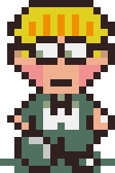

<a class="picright" href="winters.png" title="Jeff...">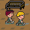</a> <a class="picright" href="winters11.png" title="Hey, it's that guy who gave me life">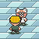</a> <a class="picright" href="threed5.png" title="Damaged Skyrunner">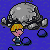</a> <a class="picright" href="fourside8.png" title="Gah!">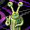</a> 

Jeff Andonuts hails from the northern country of Winters.  The genius son of famed scientist Dr. Andonuts, he spends his days within the stately walls of the Snowwood Boarding School.  That is, until one night he is woken by a telepathic call that urges him to travel south.  Against the wishes of his eccentric roommate Tony he heeds the call and ventures out into the dimly lit forests. 
 
Jeff is a character with hardly any bark, but a lot of bite.  He’s self-admittedly shy, pretty quiet, and doesn’t have any of the psychic abilities of the other party members but he makes up for it with his unparalleled mechanical genius and big guns.  Although he can’t use psychic attacks, he has access to a large number of weapon items that no one else can handle such as bottle rockets, bazookas, HP suckers, and laser guns.  In addition to being able to operate these heavy munitions, Jeff also has the ability to fix certain broken items you will come across during your adventure. These fixed items cannot be purchased in any shops and often have very powerful and unique effects.  Who needs PSI Fire when you have a Death Ray? 
 
During battle Jeff has the exclusive ability to spy on an enemy.  The spy command allows Jeff to determine many of the opponent’s physical statistics (such as offense and defense) as well as any weaknesses it might have to certain PSI attacks. If he’s lucky, Jeff might even find an item the enemy was hiding and immediately add it to his inventory.





<a class="picright" href="dalaam.png" title="Prince Poo">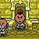</a> <a class="picright" href="dalaam3.png" title="Ninja Bunnies?!">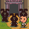</a> <a class="picright" href="dalaam6.png" title="NOOOOOO!!!">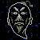</a>  

Our final hero is the esteemed Prince Poo of Dalaam.  He makes his home in the Dalaamese Palace with his master and royal attendants but most of his time is spent performing his arduous Mu training.  Adored by women and respected by men, Poo is the epitome of royal grace and tact and is always willing to lend a hand or a fist to help out.  Poo’s lifelong Mu training has hardened his body and strengthened his mind making him one of the most powerful members of the chosen four.  An impressive blend of martial arts mastery and potent psychic ability, Poo is a welcomed addition to the team. 
 
Poo has a number of interesting attributes that are exclusive to his character when he joins the party.  Since he was raised in an area with very different culinary techniques, Poo doesn’t enjoy western food all that much and therefore only gains a small amount of HP when he eats it.  However, there are a few food items that are especially beneficial to him so don’t worry.  Another exclusive facet is his mysterious power to mirror an enemy during battle.  Supposedly learned during his Mu training, Poo has the ability to take a deep breath and assume the form of an opponent.  During this metamorphosis, Poo is not in control of his own actions and will fight with the ability and strength of his target. 
 
During their quest Poo will demonstrate no less than 27 psychic abilities.  Although he shares some of the same skills as Ness and Paula, he does have a number of attacks that are distinctive such as the Brain Shock ability.  PSI Starstorm is Poo’s ultimate attack however.  The Starstorm is unique in that it is not realized by leveling up like other psychic powers, instead, an elderly man known only as the Star Master will visit the party every so often to pass along this power to Prince Poo.  The final form of this attack is arguably the most powerful in the game rivaled only by Ness’s PSI Rockin’ Omega.


