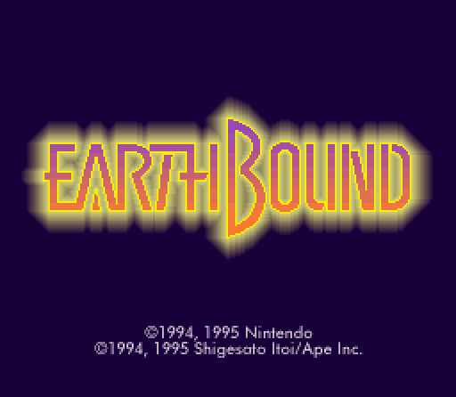
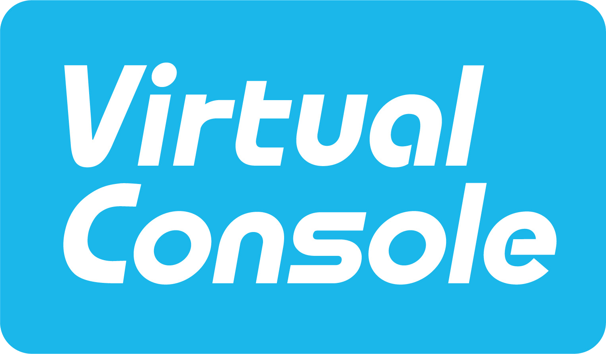
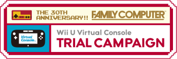
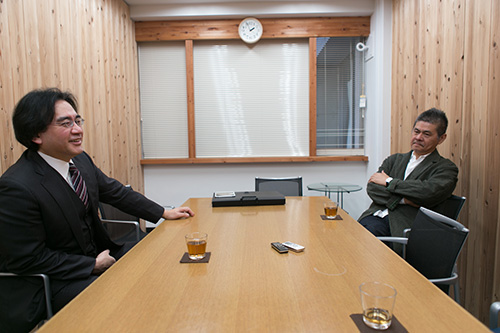



<b><i>At long last, EarthBound is available on the Virtual Console.</i></b>

  

	For fans around the globe, the wait is finally over. The hit Super Nintendo RPG EarthBound, also known as MOTHER 2 in Japan, has finally been released on the Virtual Console on Wii U and New 3DS systems. The game costs $9.99 USD to purchase. Old and new players alike will be able to enjoy EarthBound without having to shell out large amounts of money for rare cartridges or resorting to emulators. In addition to this classic title, the official Player’s Guide that came packaged with the game when it first released is available to view on Nintendo’s website. 

  

<a href="http://earthbound.nintendo.com/">EarthBound’s Official Website</a>  
<a href="http://www.nintendo.com/games/detail/82s5n1dbV4gstayVNhVYtOneSXTIXACS">EarthBound on Nintendo.com</a> 
<a href="https://www.youtube.com/watch?v=vGOEMCG2Ll4">EarthBound Launch Trailer on YouTube</a>




The release of EarthBound on the Virtual Console a journey that spanned the course of multiple years. For the longest time, the re-release and download of the classic Super Nintendo RPG was one that only existed within the dreams of the game’s cult following.

   

<b><i>The logo for the Virtual Console service.</i></b>

  

The demand for EarthBound’s publication on the Virtual Console is as old as the Virtual Console service itself. During E3 2005, <a href="https://www.youtube.com/watch?v=zbvwwlC9BtU">Satoru Iwata teased EarthBound</a> as a downloadable title on the upcoming Wii console, along with Excitebike and Punch-Out. When the Wii was released and the Virtual Console service was made public, however, EarthBound was nowhere to be found within the lists of available software. Despite multiple attempts by the fanbase to make their wishes for a re-release heard to Nintendo, which included <a href="https://starmen.net/ebsiege/">phone calls and written letters to Nintendo headquarters throughout the world</a>, the game remained absent. There was some speculation that certain <a href="http://earthboundcentral.com/2012/07/earthbounds-specific-legal-issues/">copyright issues</a> were holding the game back from being re-released. In any case, EarthBound never received a release in any country during the entirety of the Wii’s lifespan. 




	Shortly before and after the time of the Wii U’s release throughout the world, Shigesato Itoi gradually showed a reawakening interest in MOTHER content through his Internet presence. Iwata brought up during an <a href="http://kotaku.com/5935721/super-marios-boss-doesnt-want-to-overdo-it-with-mr-video-game-and-wont-deceive-you-with-dlc">interview</a> that he had spoken to Itoi about the worldwide interest in the MOTHER series:
  	
	<b>Iwata:</b> [in English]: "Just yesterday, before I left from Japan, I met with Mr. Itoi, who is the creator of the Earthbound series.” [laughs] 
<b>Interviewer:</b> "Oh, I know. Are we ever going to get it?" 
<b>Iwata:</b> "And, yeah, accidentally we were discussing that there are huge fans from Western countries for the Mother series.” [laughs]  

Later, Itoi made a personal thank-you to MOTHER fans and Starmen.net on Twitter. This led up to <a href="https://twitter.com/itoi_shigesato/status/281772533722787840">a tweet by Shigesato Itoi</a> on December 20th, 2012, mentioning that a “MOTHER republication” was in the works. For about a month, fans were left in the dark to speculate about what exactly Itoi was referring to. Rumors started flying around that the MOTHER series would be released on the Virtual Console, republished as a retail 3DS game, or even a brand new game altogether. 

   

<b><i>A promotion for the 30th Anniversary of Famicom.</i></b>

  

Eventually, on January 23rd, 2013, Satoru Iwata announced that the Virtual Console would be returning for Wii U. While the service was set to launch later that spring, Nintendo had immediately begun a trial campaign to honor the 30th Anniversary of their first home console: the Famicom, or the Nintendo Entertainment System outside of Japan. During this time, Wii U owners were offered select titles available to download for a special price of only 30 cents. The trial campaign offered one new game to download per month, and after the 30-day time frame was over, a game returned to its standard price on the Virtual Console.

  
This was the lineup of Virtual Console releases slated for the Japanese market. It seemed that Itoi’s talks of a MOTHER republication had finally come to fruition, as MOTHER 2 was set to arrive in the month of March 2013. It seems the previously mentioned copyright issues had either been overcome or simply turned out to not be a problem at all.

<b>Japan Releases</b>

  

Japan

<table border="1">
  <tr>
    <th>Game</th>
    <th>Console</th>
    <th>Available</th>
  </tr>
  <tr>
    <td>Balloon Fight</td>
    <td>NES</td>
    <td>1/23 - 2/21</td>
  </tr>
  <tr>
    <td>Fire Emblem: Monshō no Nazo</td>
    <td>SNES</td>
    <td>2/20 - 3/21</td>
  </tr>
  <tr>
    <td><b>MOTHER 2</b></td>
    <td>SNES</td>
    <td>3/20 - 4/18</td>
  </tr>
  <tr>
    <td>Kirby's Adventure</td>
    <td>NES</td>
    <td>4/17 - 5/16</td>
  </tr>
  <tr>
    <td>Super Metroid</td>
    <td>SNES</td>
    <td>5/15 - 6/13</td>
  </tr>
  <tr>
    <td>Yoshi</td>
    <td>NES</td>
    <td>6/12 - 7/11</td>
  </tr>
  <tr>
    <td>Donkey Kong</td>
    <td>NES</td>
    <td>7/15 - 8/13</td>
  </tr>
</table> 
  

<b><i>Iwata, left, and Itoi, right, gathered for an interview on MOTHER 2.</i></b>

  

Shortly before MOTHER 2’s re-release in Japan, Satoru Iwata and Shigesato Itoi discussed the game and the series as a whole. Within this interview, Iwata talks about his role within the development of the game, the impact the game made on its players, and Itoi’s role as the creator of the series. The interview was published on Itoi’s website on March 18th, 2013, two days before MOTHER 2 was re-released on the Virtual Console in Japan. Links to the original posting of the interview and English translations have been provided via <a href="http://earthboundcentral.com/2013/03/itoi-iwata-discuss-mother-2-before-virtual-console-release/">EarthBound Central.</a>

  

To further promote the game, Shigesato Itoi himself took to MOTHER 2’s official Miiverse and <a href="http://earthboundcentral.com/itoi-miiverse/">posted several messages</a> there over the course of the following weeks, in which he talked about the game, commented about the food he was eating while making posts, and cracked jokes.




Meanwhile, in the United States and Europe, during the special Virtual Console sales event, a different list of games was provided for thirty cents apiece:

  

<b>North America / Europe Releases</b>
<table border="1">
  <tr>
    <th>Game</th>
    <th>Console</th>
    <th>Available</th>
  </tr>
  <tr>
    <td>Balloon Fight</td>
    <td>NES</td>
    <td>1/23 - 2/21</td>
  </tr>
  <tr>
    <td>F-Zero</td>
    <td>SNES</td>
    <td>2/20 - 3/21</td>
  </tr>
  <tr>
    <td>Punch-Out!!</td>
    <td>NES</td>
    <td>3/20 - 4/18</td>
  </tr>
  <tr>
    <td>Kirby's Adventure</td>
    <td>NES</td>
    <td>4/17 - 5/16</td>
  </tr>
  <tr>
    <td>Super Metroid</td>
    <td>SNES</td>
    <td>5/15 - 6/13</td>
  </tr>
  <tr>
    <td>Yoshi</td>
    <td>NES</td>
    <td>6/12 - 7/11</td>
  </tr>
  <tr>
    <td>Donkey Kong</td>
    <td>NES</td>
    <td>7/15 - 8/13</td>
  </tr>
</table>

  

Needless to say, overseas fans were disappointed in the fact that they were once again missing out a Japan-only release. Rather than sitting by quietly, however, American and European fans took to MOTHER 2’s Miiverse page and made it their mission to make it clear that a worldwide release of the game was something they were still interested in. People posted thousands of drawings and written pleas for EarthBound to finally be released worldwide, and for a while, these requests went without a single response from Nintendo. 

  

<iframe width="560" height="315" src="https://www.youtube.com/embed/c3FAf1HXlZM" frameborder="0"></iframe>

<b><i>Iwata on the April 17, 2013 Nintendo Direct, announcing EarthBound’s release on Virtual Console.</i></b>

  

However, on a Nintendo Direct presentation on April 17, 2013, Satoru Iwata shared news that EarthBound would finally be released in North America and Europe. After mentioning his involvement in the development of the game, Iwata acknowledged the strong presence of overseas fans within the MOTHER 2 Miiverse and confirmed that EarthBound would be available to them by the end of 2013.

  

Eventually, EarthBound was made available for the Virtual Console in North America and Europe on July 18, 2013. The game quickly became <a href="http://www.polygon.com/2013/8/15/4626612/earthbound-was-the-third-bestselling-wii-u-eshop-game-in-the-us-last">a Wii U bestseller</a> during the month of July, taking the #3 spot in the United States, beaten only by <i>New Super Luigi U</i> and <i>Pikmin 3</i> -- a drastic shift from the initial poor sales the game received in America when it was originally released for Super Nintendo. At long last, the cries of unsatisfied EarthBound fans were answered. 

  

The success of EarthBound’s release on Wii U was later succeeded with the announcement of the game’s predecessor, MOTHER, to finally be localized and made available on the eShop. More information about the first installment in this franchise and its Virtual Console release <a href="http://starmen.net/mother1/mothervc/">can be found here!</a>

  

	An exciting new way to play EarthBound was revealed for the New 3DS handheld console on March 3rd, 2016, when it was <a href="https://www.youtube.com/watch?v=arl3ACzJCBI&feature=youtu.be&t=18m20s">revealed during a Nintendo Direct</a> that the device’s more powerful processor would allow it to play Super Nintendo titles. EarthBound was made available on the New 3DS eShop shortly after the presentation, making the game available to a new audience of people who did download the Wii U release prior. As this once obscure classic becomes more well-known to a new group of fans, the popularity of EarthBound defies time and continues to rise. Only time will tell what developments may happen for the franchise in the future.


