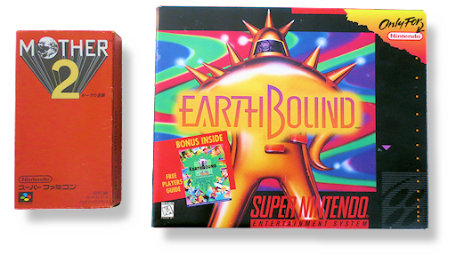
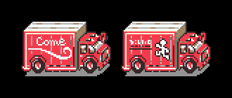
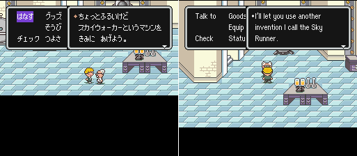
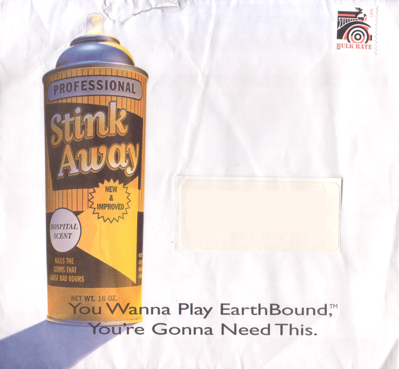
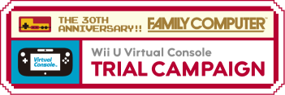
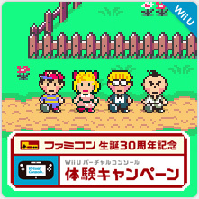



  

Shortly after MOTHER 2’s release in Japan, Nintendo of America began working on an English localization of the game, under the title “EarthBound”. This name had come from the game’s prequel, MOTHER, which was planned to release in English under the name “Earth Bound”. However, due to MOTHER being completed near the end of the NES’ lifespan, they decided against its release, and instead gave the name to its sequel.

  

The majority of the localization work was done by Marcus Lindblom, who had previously only done smaller localizations such as Wario’s Woods, and Masayuki Miura, a Japanese writer who helped Lindblom to make changes to the game’s localization to make it better for English audiences.

  

During the game’s localization, many changes were made for a number of different reasons. A few of the most notable of these include:

  

<b>Graphical Changes:</b>

  

  

Left: Japanese version | Right: English version

  

The localization team made some changes to the graphics to avoid lawsuits. An example is the above picture, where the Japanese version’s truck very closely resembles the <a href="http - //img3.wikia.nocookie.net/__cb20130530125633/logopedia/images/3/37/Coca-Cola-Logo.jpg">Coca-Cola logo.</a>
Other notable examples include:

  

<ul>
<li>The statues from the Japanese version changing from an octopus and a kokeshi (a traditional Japanese wooden doll) to a pencil and eraser, respectively.</li> 
<li>In the Japanese version, the Happy Happyists have an HH on their suit. In the English version, they lose the “HH” from their suit, to remove a reference to the Ku Klux Klan.</li> 
<li>In the original version, Ness is naked while in Magicant. In the localization, he wears pajamas.</li> 
</ul>
  

<b>Text Changes:</b>

  

  

Left: Japanese version | Right: English version

  

Text changes were made throughout the game for various different reasons, including to avoid lawsuits or to make some text make sense for an English player. An example is the above photo. In the Japanese version, the machine is called the “Sky Walker”. In the localization, this was changed to the “Sky Runner” to avoid referencing Star Wars. Other notable references include:

  

<ul>
<li>The statues mentioned in the graphical changes section above are removed by an item. In the Japanese version, the names are a play on words (Tako-keshi [octopus-erasing] Machine and Kokeshi-keshi [wooden doll-erasing] Machine). In the English version, they changed the item names to achieve a similar play on words (Pencil Eraser and Eraser Eraser).</li> 
<li>All references to alcohol were either changed to coffee, or removed altogether.</li> 
<li>References to death were removed (except a single mention during the final battle)</li>
</ul>
  

In about a year, the game’s localization was finished, and EarthBound was released on June 5th, 1995. However, it came packaged with the player’s guide. As such, this bumped up the box’s size, and the game’s price. To get the game to be memorable to convince people to buy, Nintendo of America decided on a unique advertising strategy. They went with…

  

  

EarthBound’s advertising campaign was an interesting one. All of the advertisements featured some kind of joke about bad smells. The game’s slogan was “This game stinks.”

  

There was also a short promo video shown off in video game retailers at the time of the game’s release.
  

<iframe width="560" height="315" src="https://www.youtube.com/embed/AWh3BUyHrLU" frameborder="0" />

  

The reason for this campaign was due to the fact that lots of EarthBound’s promotional material had scratch-n-sniff things, including the player’s guide and a Nintendo Power promotion.

  

(For more on EarthBound’s marketing, <a href="http://earthboundcentral.com/2009/01/earthbounds-marketing-campaign/">check out this page on EarthBound Central.</a>)

  

And so, after that unique campaign, how did EarthBound do? …Not too well. A statement from Miyamato once said,

 

“We had high hopes for Earthbound, the Super NES version, in the US, but it didn’t do well. We even did a TV commercial, thinking, 'Hey… this thing could sell three million copies!' But it didn’t.”

  

Instead, the game sold about 75,000 copies in its first year, much lower than the people who worked on the game were expecting. The remaining copies of the game eventually made their way into bargain bins at stores, and it eventually sold a final total of about 140,000 copies. In addition, critics at the time didn’t give the game very favorable reviews, adding to the game’s commercial failure. The team felt devastated by this.

  

Despite the game’s failure commercially, many of the people who did play it really enjoyed it, and eventually, a fansite was created called EarthBound.Net (eventually becoming Starmen.Net; that’s here!) After the game’s release, fans, mostly from EarthBound.Net, clamored for more EarthBound. Despite their efforts, it didn’t do too much. Then, on April 26th, 1999, Super Smash Bros. released for the Nintendo 64. EarthBound fans were surprised to find that Ness, EarthBound’s protagonist, was an unlockable character in the game.

  

  

As time went by, the community made more petitions and organized different events to try and convince Nintendo to bring more EarthBound to the West. A few examples include…

 

<ul>
<li><a href="http://classic.fobby.net/petition/eb0/">The MOTHER on Game Boy Color petition</a></li> 
<li><a href="http://classic.fobby.net/petition/npsiege/">PK Seige</a></li> 
<li><a href="http://classic.fobby.net/jonk/pkcalln/">PK Call’N</a></li> 
</ul>

  

However, these didn’t seem to do much to Nintendo, and the series remained a Japan-exclusive besides EarthBound. The series did still get shown rarely, like in Super Smash Bros. games, but the series’ actual games never did.

  

(To read more about the Starmen.Net community’s efforts to get the games over here and a bit of history, <a href="http://starmen.net/stonehenge/">check here.</a>)

  

Then unexpectedly, at E3 2005, during the reveal of the Wii, Iwata mentioned EarthBound when discussing the Virtual Console, a brand new feature at the time.

  

<iframe width="560" height="315" src="https://www.youtube.com/embed/zbvwwlC9BtU" frameborder="0" />

  

However, despite this, the game never did show up on the Wii’s Virtual Console. Eventually, fans began to clamor for Nintendo to release it there.

  

Then, on December 20th, 2012, Shigesato Itoi announced <a href="https://twitter.com/itoi_shigesato/status/281772533722787840">on his Twitter</a> that they were working on a “MOTHER republication”. Nobody knew what this could be. Speculation and rumors began. Some people thought it would be a Virtual Console release. Some people thought it might be a 3DS remake. But nobody knew for sure.

  

  

On January 23rd, 2013, Nintendo president Satoru Iwata announced that Virtual Console, like the original Wii, would be coming to their new Wii U console. It wasn’t ready to launch yet, but Nintendo launched a campaign to prepare people for it. Every 30 days, a new game would be available for just 30¢ on the Nintendo eShop. After the 30 period for each game was done, the game would be available for standard price. However, Japan’s lineup was a bit different then other territories; in place of F-Zero, Japan would be able to download the Japan-exclusive
Fire Emblem: Monshō no Nazo. In place of Punch Out!!, Japan would be able to download MOTHER 2.

  

  

However, once fans learned that the other territories’ Virtual Console’s wouldn’t be receiving EarthBound, fans took to <a href="https://miiverse.nintendo.net/">Miiverse,</a> Nintendo’s online community for discussing their games, and posted to the Japanese MOTHER 2 page, to tell them that a worldwide release was still wanted. Despite not hearing anything from Nintendo, fans continued this for about 3 months.

  

Then, on April 17th, 2013, Satoru Iwata announced that EarthBound would be available for the North American and European Virtual Console by the end of the year. He explained that “very passionate fans” told them that they wanted this release through Miiverse, and it was one of the reasons why they decided to release it on the Virtual Console.

  

<iframe width="560" height="315" src="https://www.youtube.com/embed/c3FAf1HXlZM" frameborder="0" />

  

Then, on July 18th, 2013, after about 20 years since the game’s original release, EarthBound was released on the Virtual Console.

  

It was also released on the New Nintendo 3DS’ Virtual Console on March 3rd, 2016 in Europe and March 24th, 2016 in North America. Hooray!

  

Useful Links: 

<a href="http://earthbound.nintendo.com/">EarthBound's official page</a>  
<a href="http://www.nintendo.com/games/detail/82s5n1dbV4gstayVNhVYtOneSXTIXACS">Wii U eShop page</a>  
<a href="http://www.nintendo.com/games/detail/earthbound-3ds">3DS eShop page</a>


