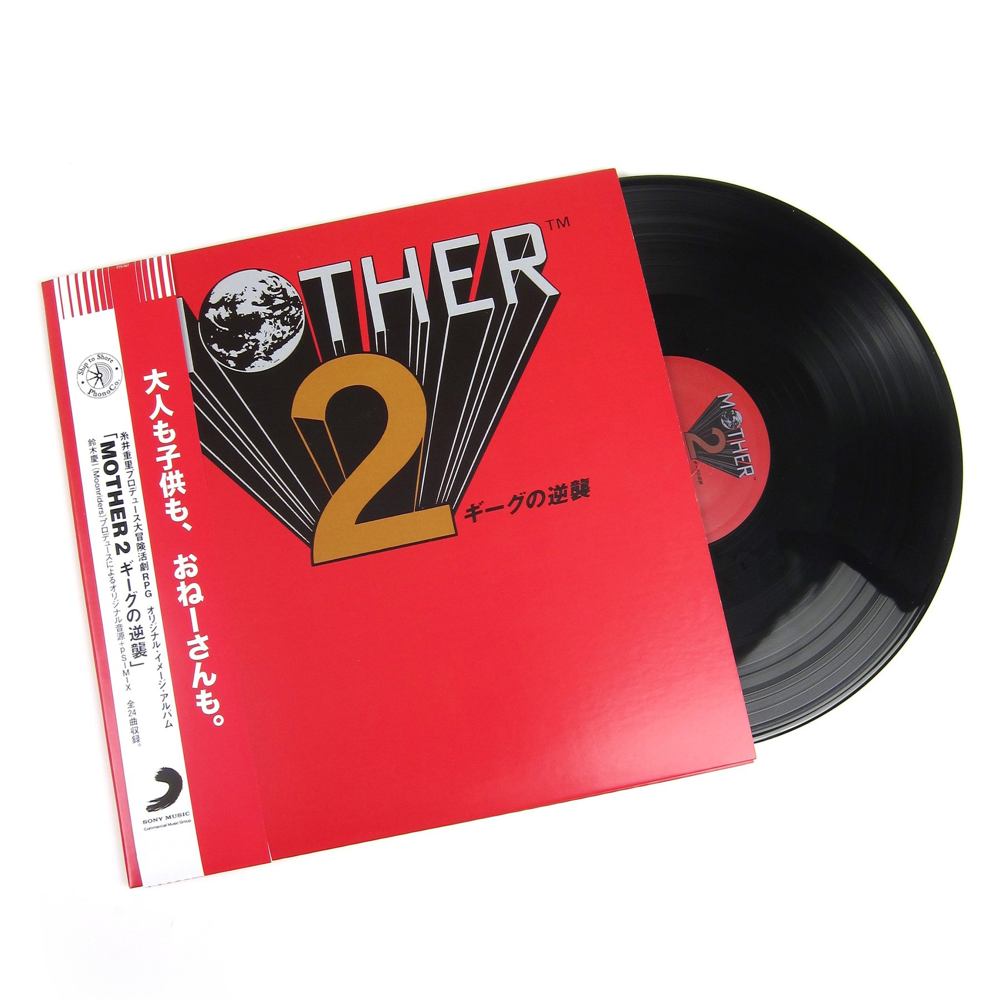
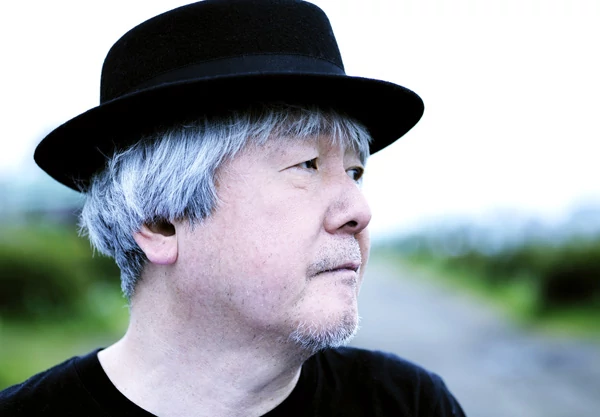
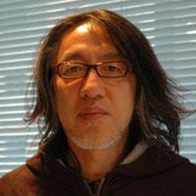
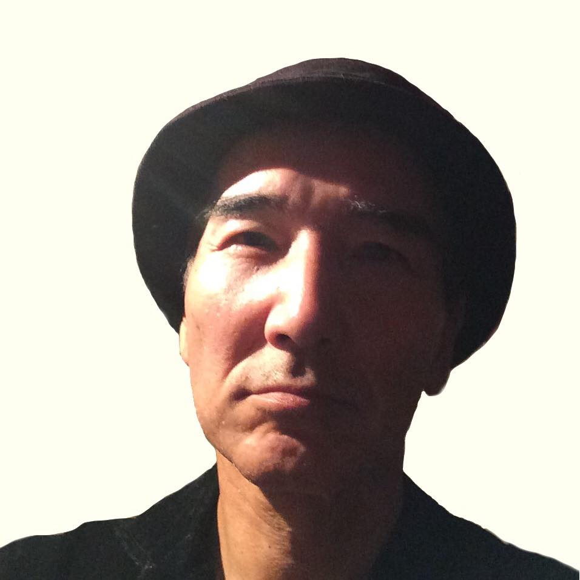
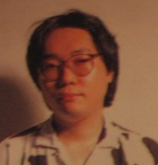



Ask a regular player of EarthBound, or MOTHER 2, what their favorite quality of this decades-old SNES RPG is, and you’re sure to receive a multitude of answers. Some will point to the whimsical and psychedelic graphics featured throughout that treat the eyes. Others may point to the carefree and humorous writing that so boldly twisted the norms of the genre at the time of its release. However, you’ll come to a general consensus among all players that this game’s music is one of its shining qualities. Upon listening to some of the game’s tunes, it’s easy to see why this game’s songs are remembered so fondly. With bizarre yet catchy instrumentation, experimental methods used within its compositions, and a wide varieties of different sorts of songs, MOTHER 2’s soundtrack is simply unique in a way that pairs it with the other special traits that this game possesses.

  

Like all the works found within MOTHER 2, there was a team of dedicated, hard-working individuals behind the creation of the game’s music. Perhaps their names are not as widely recognized as other famed figures from the game’s development, such as Shigesato Itoi and Satoru Iwata. Here, you will be introduced to the musicians of MOTHER 2.





Keiichi Suzuki, born on August 28, 1951 in Tokyo, Japan, is certainly no stranger to musical affairs. His history in the field extends far beyond the realm of video game compositions. In his twenties, Suzuki showed the world his talent through a band called the Moonriders, of which he was a singer and the occasional leader. His brother even co-starred alongside him on the bass! In addition, Suzuki has composed soundtracks for films, further increasing his presence in different forms of media. On the topic of film, Suzuki also has had involvement in acting, having appeared in several different Japanese movies. 
   
	Suzuki first worked with Nintendo with MOTHER for the Famicom, which is also known as MOTHER 2 Beginnings outside of Japan. Along with Hirokazu “Hip” Tanaka, the two worked together to create all of the game’s music tracks. Nintendo, satisfied with their previous works, brought both musicians back on board to compose music for MOTHER 2, along with two assistant composers as well.
   
	Fun fact: Suzuki is responsible for some of the voice clips within MOTHER 2 as well! He created the recordings used for Giygas’ breathing during the final battle. Additionally, Suzuki is responsible for the impactful “I miss you” line from the song that plays during the credits sequence, Smiles and Tears.
 





Hirokazu Tanaka, popularly recognized by his nickname “Hip”, is perhaps one of Nintendo’s more well-known composers. Born on December 13, 1957, in Kyoto, Japan, Tanaka had music thrust upon him at a young age. His mother, a schoolteacher, assigned him to piano lessons, and the young Tanaka aspired to create a band of his own as early as elementary school. While he did form his first band in middle school, it seemed that his claim to fame would not be live performances, but in the world of video games instead. After graduating with a degree in electronic engineering, he snagged a job at Nintendo as a sound designer… and thus, a large list of franchises he’s been involved in was born. This includes Mario, Metroid, Kid Icarus, and, of course, MOTHER.
   
	Tanaka was one of the two musicians initially assigned to compose for the first MOTHER game along with Suzuki. After the first game’s success, Tanaka returned to compose for MOTHER 2 along with Suzuki and two assistant composers. Tanaka eventually resigned from Nintendo in 1999 before taking new employment at Creatures, Inc., famously known for their development of the Pokemon franchise. He eventually rose to become the president of the company, a position he still retains to this day.
 





Kanazu was born on January 27, 1960, in Kamakura, Japan. First graduating from Yokosuka High School and then from Ochanomizu Art College, Kanazu aimed for a career involving music. Before he worked with Suzuki in MOTHER 2, he also had some level of participation in the Moonriders band -- he actually played percussion for them during the band’s tenth anniversary. 
   
	Suzuki and Kanazu’s paths would cross again with the development of MOTHER 2. Kanazu was tasked by Nintendo to assist the two composers from the previously acclaimed MOTHER in created the music for the game’s sequel. Despite his work, Suzuki and Tanaka seemed to have taken the lion’s share of the recognition for the game’s music. Kanazu, along with fellow assistant composer Ueno, both appear on a separate listing within the credits from the main musicians.
 





Ueno, who still lives in his hometown of Nerima, Tokyo, continues to have a large online presence. His website contains a long lists of his many works. This includes not only works with software, but with CDs, merchandise, and books. Ueno’s most common works as of recent include his involvement in a multitude of different guidebooks for various Nintendo games. He can also be found on his Twitter account, often posting pictures of his cherished pet birds.
   
	Kanazu and Tanaka were brought in to work on MOTHER 2 along with returning composers Suzuki and Tanaka. However, none of these four returned for MOTHER 3. That game was composed exclusively by Shogo Sakai. Nevertheless, despite the eventual replacement of the four musicians of MOTHER 2, their legacy lives on in the hearts of gamers, not only in Japan, but all around the globe.


