
In the year 199X, a boy named Ness awakens to a meteorite crash in Onett. In the excitement that follows, his neighbour Pokey Minch loses his younger brother Picky somewhere. While helping Pokey find him, Ness encounters an insect-like being called Buzz Buzz, hailing from ten years in the future, who warns him about an alien threat known as Giygas -- and establishes that Ness, with the help of two other boys and a girl, is the only one who can stop him.

  

Even after Buzz Buzz’s premature death at the hands of Larna Minch, Pokey’s mother, Ness continues to follow his directions, collecting the Melodies from the eight Sanctuaries over the course of his adventure. Soon, he comes to face not only the local gang, but even the police force.

  

Not long afterwards, Ness rescues a girl named Paula from the Happy Happyism Religious Group, which had been influenced by a mysterious statue. She, lives in Twoson, and, like him, is capable of using PSI. Sharing the same belief as Buzz Buzz, she joins Ness on his quest, and the two, in return for a favour, are given a bus ride to the next town, Threed, by the famous band Runaway Five.

  

The town, however, is overrun by zombies -- and the two are captured. Owing to a telepathic call for help from Paula, however, a young genius named Jeff hailing from Winters in the north comes to their rescue using the Sky Runner, an invention of his father, Dr. Andonuts. He joins them as well, and together, they rid the town of the zombies, as well as a monster named Master Belch.

  

They make their way to Fourside, a large city with a powerful mayor named Geldegarde Monotoli, who is being influenced by the Mani Mani Statue, and thus cooperating with the aliens. Paula is kidnapped in the process, but Ness and Jeff locate and destroy the statue, clearing its influence. Monotoli apologizes, and tells Ness, Paula and Jeff that he had been asked to stop them from going to Summers or reaching a certain pyramid.

  

Knowing that it would be in the worst interests of the aliens, the party, on the contrary, decides to go to Summers. Although Monotoli offers his helicopter, Pokey intervenes, escaping with it. Instead, owing to a sudden epiphany from Paula, they return to Threed, and, using the Sky Runner, go to Summers.

  

Here, Ness falls into a dream upon eating some Magic Cake offered to them. In his dream, he sees Prince Poo of Dalaam go through the daunting Mu Trial -- and successfully clearing it. Understanding his role in the prophecy, Poo Teleports to Summers and adds his martial and psychic strength to Ness’s cause.

  

Poo, interpreting some hieroglyphs in the Scaraba Cultural Museum of Summers, provides insight into their next course of action. The party takes a boat ride to Scaraba, defeating the dreaded Kraken on the way. Solving the puzzle, they enter the pyramid and find the Hawk Eye. As they exit the pyramid, the Star Master arrives, and Poo leaves with him to learn the powerful PK Starstorm technique.

  

Ness, Paula and Jeff meet Brick Road, a man who had merged himself with a dungeon with Dr. Andonuts’s help. The Dungeon Man lends them a submarine, which they use to travel to the Deep Darkness, a deep swamp. The Hawk Eye dispels the darkness, allowing the party to forge ahead. As they cross the swamp, they encounter Master Belch, now back as Master Barf, but Poo arrives to defeat him with PK Starstorm.

  

The party complete again, they find a village deep in the swamp, inhabited by the Tendas -- a very shy tribe. In addition, they receive the troubling news of their friend Apple Kid, having disappeared while in Dr. Andonuts’s laboratory. Returning to Winters, the party enters the Stonehenge Base of the aliens, where the aliens are keeping their friends, including Apple Kid and Dr. Andonuts, captive. Defeating the Starman Deluxe, they manage to free their friends.

  

Giving the Tenda chief a book designed to help the tribe overcome its shyness, the party gains their favour, and is let into Lumine Hall, another Sanctuary. Reaching the end, fall through a hole into the Lost Underworld, where dinosaurs roam free even now. Here, a talking rock informs Ness of the sheer magnitude of what he is to do, asserting that his destiny is not only his, but that of the entire universe.

  

After Ness finally collects all eight of the Melodies, he finds himself in the world of his own mind: Magicant. Traversing this different world, he comes face to face with his Nightmare -- the dark aspect of who he is. Overcoming this negative side of himself allows him to absorb the power of the Earth itself from the eight Sanctuaries. As he does so, Magicant vanishes, and Ness wakes up with the inexplicable knowledge that they must head to Saturn Valley.

  

Teleporting to Saturn Valley, they find the Phase Distorter -- a machine designed to track down Giygas -- near completion, and only lacking the metal Zexonyte that can only be extracted from a meteorite. Travelling to Onett, Ness finds the town invaded by aliens, all the townspeople and even Ness’s mother and sister trapped in their homes. With no way to stop this but to defeat Giygas, the party reaches the meteorite, and brings the piece to Dr. Andonuts.

  

Using the Phase Distorter, the party then travels to the Lost Underworld. However, it soon becomes apparent that Giygas has also traveled back in time -- something lifeforms cannot survive. This leaves the party with no option but to have their consciousnesses transferred to robotic bodies, which allows them to travel to the past.

  

Fighting through Giygas’s forces, the party finally faces him and Pokey in battle. Despite how much their power has grown, it becomes evident that it is impossible to overcome Giygas through power. Seeing no other option, Paula begins to pray, calling out to their friends and family. They, in turn, pray for the safety of the four, their prayers harming Giygas. With the player themselves being touched by Paula’s call for help, they defeat Giygas with a prayer of their own. With Giygas’s defeat, Pokey escapes to another time.

  

Although their robotic bodies are destroyed in the process, the spirits of Ness and his friends travel through time, back into their original bodies. With their adventure finally over, they part ways, Poo leaving for Dalaam, and Jeff deciding to stay with his father. Paula asks Ness to escort her home.    



  &nbsp; <b>I.a. Buzz Buzz’s Warning</b>

  

The story begins in Onett, a small town in Eagleland, in the year 199X.

  

A loud noise awakens Ness. Upon reaching the top of the hill to investigate, he is informed that it was caused by a meteorite. Upon returning home, Ness goes back to sleep, only to be reawakened by another noise -- Pokey knocking on the door. Claiming that he took his younger brother Picky to look at the meteorite but ended up separated from him, he convinces Ness to help him find Picky.

  

As the two head home after finding Picky, they are interrupted by an insect-like being named Buzz Buzz. He, claiming to have come from ten years in the future, informs Ness and his party of an alien threat -- Giygas. He explains that, in the future he came from, Giygas has already succeeded, but also asserts that this eventuality could be prevented if action were to be taken in the present. Referring to two legends, he asserts that Ness is one of the ones chosen to stop Giygas.

  

The group returns to Pokey’s house, fighting off the Starman Junior -- an assassin hired by Giygas to eliminate Buzz Buzz -- on the way. Aloysius Minch, Pokey and Picky’s father, punishes his sons, angry at them for being outside this late. Lardna, their mother, in addition, mistakes Buzz Buzz for a dung beetle, and strikes him down.

  

Fatally wounded, Buzz Buzz imparts the knowledge Ness requires to locate the eight Sanctuaries and join forces with the power of the Earth itself. Giving him the Sound Stone, an item to record the melodies from the Sanctuaries, he passes away.

  

 <b>Notes:</b>

 - Ness may choose to take King, his dog, with himself while searching for Picky. If he does so, King will get frightened and run back home upon approaching the meteorite, leaving the party.

  

 - Speaking to Lier X. Aggerate after meeting Buzz Buzz will result in him asking Ness to visit him alone later, claiming that he has something to show to Ness privately.

  

  &nbsp; <b>I.b. The Sharks</b>

  

By the time Ness leaves Pokey’s house, dawn would have broken. Although the town has countless different people speaking of a variety of subjects, a common topic turns out to be the Sharks -- and the Fresh Breeze Movement attempting to stop their “bad influences” on the children of Onett. This, coupled with the police force’s apparent inaction against the Sharks and rumors surrounding Frank’s knowledge of Giant Step, makes it a favorable idea for Ness to take matters into his own hands.

  

Defeating any Sharks in the way and confronting Frank himself behind the Onett arcade, Ness manages to defeat both him and Frankystein Mark III, a robot he created. Recognizing Ness’s strength, Frank tells him all he knows of the Giant Step, but also warns him about the monster guarding it.

  

 <b>Notes:</b>

 - At this point, Ness can visit Lier X. Aggerate at his home. He will reveal that he has managed to excavate a statue, but will be defensive of it to the point of regarding Ness with some animosity. His subtle change in behavior, as well as his possession of the statue, becomes relevant as the story progresses. 

  

  &nbsp; <b>I.c. Your Sanctuary: Giant Step</b>

  

Mayor Pirkle recognizes Ness, and, following an exaggerated description of him dealing with the Sharks, gives him the key to the shack. This allows Ness to access the cave leading to the Giant Step. Upon fighting his way to the top, however, he is informed by the Sanctuary Guardian -- the Titanic Ant -- that it owns the Sanctuary, and is challenged to a battle for its sake.

  

Defeating the Titanic Ant grants Ness access the Giant Step. His Sound Stone records the melody from the Sanctuary, and he seems to catch the glimpse of a small, cute puppy -- King when he was younger.

  
  

  &nbsp; <b>I.d. The Onett Police Force</b>

  

Upon Ness leaving the Giant Step cave, he will be approached by a policeman, who reprimands Ness for entering the cave despite it being a restricted area, with the mayor having already established that he would not be taking any responsibility. The policeman tells Ness to come to the police station.

  

There, upon Ness’s insistence to proceed to Twoson on his quest, Captain Strong of the police force challenges Ness to defeat five of his finest men. Upon Ness defeating them all, however -- barring one that refuses to fight -- Captain Strong challenges Ness himself. Finding no more success, he has no choice but to open the path to Twoson.

  
  

  &nbsp; <b>II.a. Paula’s Kidnapping</b>

  

There are rumors abound in Twoson that Paula, a girl famous for possessing some kind of “magical power”, has been kidnapped. Visiting her home reveals that her parents were not aware of the situation -- and causes her father to panic. He states that Paula knew that Ness was coming, and asserts that Everdred may know something.

  

Visiting Everdred at the Burglin Park prompts him to confirm these rumors following a brief battle with Ness. He states that Paula has been taken across Peaceful Rest Valley, and that she may be used for a human sacrifice. He urges Ness to hurry and rescue Paula, asking him to return with her should he succeed.

  

Paula is not the only talk of the town, however -- the inventors Apple Kid and Orange Kid are also well-known across Twoson. They will offer to let Ness invest in their inventions -- and although Orange Kid is the more popular of the two by far, Apple Kid is the one whose inventions will pay off later.

  

 <b>Notes:</b>

 - Resting at a hotel will result in Paula telepathically contacting Ness in his dreams, already knowing about him.. She asks for help, although she is not certain as to where she is.

  
  

 - The battle with Everdred is optional. In addition, the Japanese version reveals that the cabin in Peaceful Rest Valley where Paula is being held actually belongs to Everdred, and has been rented off -- possibly why he is well-informed about the situation.

  

 - Visiting Lier X. Aggerate at this point reveals that he has sold off the statue to a man due to being “affected by the man’s mania”.

  

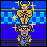  &nbsp; <b>II.b. Happy Happy Village</b>

  

Crossing the dangerous Peaceful Rest Valley with some help from Apple Kid’s new Pencil Eraser, Ness arrives at Happy Happy Village. As the name suggests, it has been entirely taken over by the Happy Happy Religious Group, which preaches peace and happiness while claiming that painting the world blue is the path to ensuring them.

  

Ness goes through a tunnel to find Paula being held prisoner inside a mountain cabin. She warns Ness about Mr. Carpainter’s power to control lightning -- and gives him the Franklin Badge for his protection. As Ness leaves the cabin, Pokey reveals himself to be with the Happy-Happyism cult, and sends some enemies after Ness.

  

Ness eventually manages to make his way to Mr. Carpainter himself. His Franklin Badge reflecting Carpainter’s electrical attacks, he manages to snap the man to his senses. Mr. Carpainter claims that the statue had been influencing him, and promises to make amends, giving Ness the key to Paula’s cabin. Pokey, on the other hand, despite initially claiming that he wants to be friends with Ness again, continues to work against him.

  

 <b>Notes:</b>

 - Although Mr. Carpainter reveals the statue’s name -- the Mani Mani Statue -- in EarthBound, he does not do so in MOTHER 2.

  

 - Because, until very recently, the Mani Mani Statue had been in Lier X. Aggerate’s possession, Happy-Happyism, at least in this iteration under the influence of the statue, has to have started only shortly before Ness came to Twoson. As such, it lasted very briefly.

  

 - The second Sanctuary, Lilliput Steps, can be accessed at any point since coming to the village.

  

  &nbsp; <b>II.c. The Runaway Five</b>

  

With Ness freeing Paula, the two return to Twoson to great fanfare from the children of the Polestar Preschool. Paula is reunited with her parents, and after exchanging both encouragement and reassurance with them, she joins Ness for the journey, confident that they would save the world.

  

Outside, the two are informed that Everdred is looking for them. Visiting Everdred in the Burglin Park results in him handing them a generous gift of 10,000 dollars, which they use in order to pay off the Runaway Five’s debt to Poochyfud, the Chaos Theater owner.

  

Following their last show at the Chaos Theater, the Runaway Five, in gratitude, offer to let Ness and Paula ride their tour bus to Threed. Due to it playing loud music, the ghosts inhabiting the tunnel are repelled, and fail to stop the bus from reaching Threed.

  
  

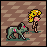  &nbsp; <b>III.a. Threed, Zombie Central</b>

  

Upon reaching Threed, it quickly becomes clear that the town is very genuinely threatened by zombies and ghosts, with a group inside a brightly-lit tent trying to figure out a way to get rid of them. An investigation of the graveyard leads to a mysterious encounter with a pair of zombies who do not let Ness and Paula pass.

  

Following a suspicious woman into a strangely desolate hotel, Ness and Paula walk right into a trap -- they are ambushed and captured by the zombies. With Ness and Paula trapped in an underground room, she decides to call for help from a friend they have never met, but one who is destined to join them.

  
  

  &nbsp; <b>III.b. Winters</b>

  

Hearing Paula’s call in his dreams, young genius Jeff wakes up to the prospect of adventure. With some help from Maxwell and his good friend Tony, he manages to sneak his way out of the Snow Wood Boarding House. He soon befriends the Bubble Monkey, and the two manage to get Tessie, a cryptid, to ferry them across Lake Tess.

  

Heading past a dungeon set up by a man named Brick Road, Jeff gets to not only see the mysterious Stonehenge for himself, but also encounter a few Cave Boys. But his true destination is his father’s laboratory -- meeting Dr. Andonuts for the first time in ten years, Jeff uses his father’s Sky Runner to make his way to Threed to help Ness and Paula.

  

 <b>Notes:</b>

 - Even at this point, it is perfectly possible to access the aliens’ base at Stonehenge, indicating that the aliens have already started preparing for their invasion of Winters. Of course, due to the Eraser Statue blocking the way, it is impossible to go deep inside the dungeon.

  

  &nbsp; <b>III.c. Zombie Paper</b>

  

Jeff’s Bad Key Machine is enough to let the party escape from the underground room. Making their way to Threed, they hear rumors about a living tent at the southern outskirts of the town. Managing to destroy it, they obtain what it had been concealing -- Fly Honey, apparently loved by the zombie leader.

  

Soon afterwards, Apple Kid calls up Ness to inform him about his latest invention -- Zombie Paper, a device designed to attract and trap zombies. Following a quick delivery of the item, the party sets it up in the tent at the center of the town. By the next morning, the zombies flock in there, only to be rendered unable to move. With them out of the way, the party finally manages to access the tunnel past the Threed graveyard, going through to reach the Grapefruit Falls.

  
  

  &nbsp; <b>III.d. Saturn Valley</b>

  

Just past the Grapefruit Falls, Ness and his friends arrive at Saturn Valley, home to some strange but good-natured people. Although they offer unconditional hospitality, it is clear that the zombie leader is taking advantage of their lack of aggression and skill with mechanical operations. Gathering clues from the Mr. Saturns, Ness and his friends enter the secret base behind the waterfall.

With their possession of Master Belch’s favorite Fly Honey acting as a rite of passage, Ness and his friends make their way through to the zombie leader himself. Despite his strength, his incredible weakness to Fly Honey leaves him vulnerable, and the party manages to overwhelm him. With the enslaved Mr. Saturns free, the party re-emerges in Saturn Valley, and rests up with the hot spring and an uplifting cup of coffee.

  

 <b>Notes:</b>

 - The third Sanctuary, <b>Milky Well</b>, is accessible at this point, but does not have to be completed immediately to continue with the story. 

  

 - The Coffee Break, in addition, is entirely optional. However, it should be noted that while the speaker speaks in first-person in EarthBound, no self-reference is made in MOTHER 2.

  

 - There are subtle changes from MOTHER 2 to EarthBound that are nonetheless important to the plot.  While the Slimy Little Pile that mentions Giygas states his full and precise name in EarthBound, it is barely aware of Giygas in MOTHER 2, not even certain of his name.
 
  

 - In addition, while Master Belch is vague about the prophecy in EarthBound, stating that a boy is said to defeat Giygas, he addresses Ness, and specifically Ness, with regard to the prophecy in MOTHER 2. This means that the aliens had likely already pinpointed and identified Ness as being the boy mentioned in the prophecy, even at this relatively early point in his journey.

  

  &nbsp; <b>IV.a. The Dusty Dunes</b>

  

The party is warmly welcomed back in Threed, the town finally rid of its zombie problems, and the group is free to proceed to the Dusty Dunes Desert. Although the traffic jam on the road forces them to take a detour, traversing through the desert itself, the three cross it to arrive at Fourside. On the way, they share some of their food with Gerardo Montague, a miner trying to find gold in the desert

  

Fourside, as the big city, might seem overwhelming in a good way, but it has its fair share of rumors going around. Between the Department Store being closed with an ominous message and Pokey having made it to a high-ranking position again, something is going on. And the Runaway Five have managed to get themselves in a debt trap once again, the manager claiming that nothing short of gold would be enough to pay it off.

  

Returning to the desert, Ness and his friends help out in the mining operation by clearing the mines of enemies. As a token of gratitude, they are given an excavated diamond, which they use to pay off the Runaway Five’s debt.

  
  

  &nbsp; <b>IV.b. Moonside</b>

  

The Department Store open again, the party investigates it, only for Paula to be kidnapped as the lights go out. Ness and Jeff make it to the top, where they encounter an alien. Although they emerge victorious, it quickly becomes clear that Geldegarde Monotoli, the mayor, has something to do with the situation.

  

Following a rumor of Monotoli frequenting Jackie’s Cafe, Ness and Jeff stumble upon Everdred. He informs them that Monotoli is in possession of the Mani Mani Statue, having stolen it from Everdred. Following his instructions, the two check behind the counter of Jackie’s Cafe… and end up in the world of Moonside.

  

Although they can hardly make sense of the situation, the two somehow manage to make their way to the Mani Mani Statue itself. Engaging it in battle, they destroy the statue, revealing Moonside to have been nothing but an illusion created by it. The Mani Mani Statue had been an illusion-creating device.

  
  

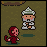  &nbsp; <b>IV.c. Monkey Caves</b>

  

As soon as Ness and Jeff emerge from Moonside, they get a call from Apple Kid, who describes his newest invention -- a Trout Yogurt dispenser -- with a note of importance. A summons from Talah Rama in the desert, the negligence of an Escargo Express delivery man, as well as an incentive from a maid working in the Monotoli building makes it clear that the two have to go back to the Dusty Dunes.

  

Going through the monkey caves by pleasing all the monkeys in the way, the two speak to Talah Rama, who gives them the Yogurt Dispenser. With some cryptic words, he bids them farewell.

  

 <b>Notes:</b>

 - Talah Rama is the first to reference all four main party members with regard to their destiny, and, therefore, is the first to refer to Poo, despite him having not joined the party at this point.

  

 - The monkey in Talah Rama’s room will teach Ness Teleport α if spoken to.

  

  &nbsp; <b>IV.d. Monotoli Building</b>

  

Back in Fourside, Electra, Pokey’s maid, takes the yogurt dispenser, and, in turn, makes the upper floors of the building accessible for Ness and Jeff. Fighting their way through the robots patrolling the area, they, with some help from the Runaway Five, manage to make it to Monotoli. 

  

Monotoli, now free of the statue’s influence, apologizes for his actions. As Paula rejoins the party, he informs Ness’s party that he was supposed to stop Ness and his friends from going to Summers and visiting a certain pyramid. On the contrary, he advises the party to do so, given that it would be in poor interest for the aliens. 

  

He offers his helicopter to take them there, but Pokey gets away with it. Although left with no apparent means to go to Summers, Paula telepathically senses that the party would find a new lead in Threed. As the party heads out of the Monotoli Building, Ness gets yet another call from Apple Kid; he is going to meet Dr. Andonuts to collaborate and create a machine called the Phase Distorter to track down Giygas.

  

 <b>Notes:</b>

 - Monotoli hearing about Giygas during his periodic checks of the statue indicates a direct link between the aliens and the Mani Mani Statue, a fact that is not previously established.

  

  &nbsp; <b>V.a. To Summers</b>

  

The Runaway Five give Ness and his friends a bus ride back to Threed. Heading to the underground room where Ness and Paula had been held, they discover the Sky Runner, put together by the townspeople in appreciation of the trio’s efforts. Jeff manages to finish final repairs, and the Sky Runner, as programmed, brings them to Winters.

  

The party heads the Sanctuary Jeff had encountered on his first trip through the area. Defeating “Shrooom!”, the Sanctuary Guardian, they gain access to the Rainy Circle and record its melody, Ness wistfully catching a whiff of steak for a moment. By the time they return, Dr. Andonuts has modified the Sky Runner to take the party to Summers. The Sky Runner crashes in the process, but they arrive at Summers nonetheless.

  

 <b>Notes:</b>

 - From this point in the game, a Cave Boy named Big Foot resides in Dr. Andonuts’s laboratory, selling various items. While EarthBound has Dr. Andonuts referring to Big Foot as his co-worker, he makes no such reference in MOTHER 2.

  

  &nbsp; <b>V.b. Magic Cake</b>

  

Although Scaraba promises pyramids, getting there is an issue: due to the Kraken roaming the sea, all but one sailor refuse to sail. This one sailor, although willing, is unhappy due to his wife no longer making Magic Cake. Getting the number to the Stoic Club, the party meets her inside, and she agrees to make them a Magic Cake with the last of her ingredients. For some reason, however, eating this cake causes Ness to suddenly dream of a faraway place.

  
  

  &nbsp; <b>V.c. Poo’s Trial</b>

  

Ness dreams of Dalaam in the far east. Prince Poo of Dalaam, following the words of Yi-Si-Qi, his master, makes his way to the Place of Emptiness in order to begin his Mu Trial. He is confronted by the spirit of his ancestor, who takes Poo’s limbs and senses away. However, Poo’s continuing, unbroken determination and consent lead to him prevailing in the Trial, revealing the ordeal to have been in his mind.

  

Poo returns to Yi-Si-Qi, who, impressed and proud of Poo’s success, informs him of his destiny of joining Ness. Teleporting to Summers, Poo immediately surrenders himself to Ness, offering his unconditional services to their cause.

  
  

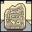  &nbsp; <b>V.d. The Hieroglyphs</b>

  

The party examines the Scaraba Cultural Musuem in Summers for clues, allowed inside upon the payment of a ruby from Poo. Poo reads the hieroglyphs, the message further cementing the need to go to Scaraba. While leaving the museum, the phone rings, with a cryptic and boastful message from Mr. Spoon. Returning to Fourside, the party meets Mr. Spoon, who, in exchange for them getting an autograph from Venus, shows them his discovery.

  

It is an entrance to the sewers, Mr. Spoon warning the party of the giant rat inhabiting it. But in its depths, Ness and his friends find the Sanctuary of <b>Magnet Hill</b>. They collect the Carrot Key nearby, which they need to enter the Sanctuary Poo had sighted in Dalaam: the <b>Pink Cloud</b>.

  

 <b>Notes:</b>

 - The hieroglyphs clearly point towards the aliens. The mention of the invaders being reborn and attacking again from time to time either implies that the aliens have attacked Earth in the past, even before the events of EarthBound Beginnings, or that Giygas’s own forces have been attacking from different times in the past, an ability they exhibit later in the game.

  

 - Magnet Hill and Pink Cloud, like Lilliput Steps and Milky Well, do not have to be completed immediately.

  

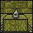  &nbsp; <b>VI.a. The Hawk Eye</b>

  

The sailor in Summers satisfied with his wife leaving the Stoic Club, the party sets sail for Scaraba, defeating the Kraken on the way. Near Scaraba is the pyramid they had been looking for. Using the hints from their hieroglyph copy, Ness and his friends solve the puzzle and enter the pyramid.

  

Inside, they find the Hawk Eye mentioned in the hieroglyphs as the only way to pierce the darkness. As they exit the pyramid, they are awaited by the Star Master, who offers to teach Poo the powerful PK Starstorm. Acknowledging its usefulness to their cause, Poo leaves to train with the Star Master, the other three left to proceed by themselves.

  
  

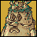  &nbsp; <b>VI.b. The Dungeon Man</b>

  

Nearby, Ness and his friends meet a man who tells them about a tower to the north-west, and gives them the key to unlock it. As the party finds and enters it, however, it soon becomes clear that this is a dungeon of Brick Road’s creation -- or rather, Brick Road, with the help of Dr. Andonuts, has combined himself with a dungeon.

  

The Dungeon Man accompanies the party briefly, but gets stuck in a group of trees, forcing the party to go on without him. Coming across more information regarding the Deep Darkness, they take a yellow submarine from the Dungeon Man’s vehicle collection in order to reach the great swamp.

  

 <b>Notes:</b>

 - The Dungeon Man is, in practice, a human and dungeon chimera, pointing towards Dr. Andonuts’s central role in creating the chimeras in MOTHER 3.

  

  &nbsp; <b>VI.c. Deep Darkness</b>

  

As the name implies, the swamp is dark -- while there is a small camp in the better-lit parts of the area, the Deep Darkness is largely uncharted because of the pitch black darkness. The Hawk Eye, however, lights up the area, allowing Ness and his friends to continue. Slogging their way to the end, the party encounters Master Belch once again, now back as Master Barf.

  

As they battle him, however, Poo returns to the party, swooping down from the sky and using his newly mastered PK Starstorm α to defeat Master Barf. Finally reaching the end of the swamp, the party arrives at the Tenda Village. Although the Tendas themselves are too shy to be of much help, they receive news on a book designed to cure this shyness -- along with Apple Kid being captured.

  
  

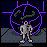  &nbsp; <b>VI.d. Stonehenge Base</b>

  

Returning to Winters, the party uses Apple Kid’s new invention, the Eraser Eraser, to eliminate the eraser statue blocking their way into Stonehenge Base. They fight through the large alien stronghold, and eventually come to face the Starman Deluxe. Upon its defeat, the base stops functioning, freeing Dr. Andonuts, Apple Kid, Tony, and a Mr. Saturn, among others who had been captured by the aliens.

  

This incident allows Dr. Andonuts and Apple Kid to meet a Mr. Saturn, and the three head to Saturn Valley in order to work on the Phase Distorter.

  

 <b>Notes:</b>

 - The Starman Deluxe’s dialogue is the first instance of the Apple of Enlightenment being directly referenced, and the prophecy being attributed to it.

  

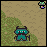  &nbsp; <b>VII.a. Tenda Village</b>

  

Following Apple Kid’s directions, the party returns to Onett. In the Library, they find the book “Overcoming Shyness”. In the Tenda Village, the party presents it to the Tenda chief, who reads the book to the rest of the Tendas, allowing them to overcome their shyness. As a token of their appreciation, they give Ness and his friends some Tendakraut.

  

No longer shy, one of the Tendas removes the boulder blocking their way, and the party continues into another Sanctuary: <b>Lumine Hall</b>.

  

 <b>Notes:</b>

 - During the tea break, the narration states that Giygas is growing afraid of Ness, possibly the reason Giygas retreats to the past.

  

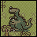  &nbsp; <b>VII.b. Lost Underworld</b>

  

As the party defeats the Sanctuary Guardian, Ness and his friends access the eponymous Lumine Hall, witnessing Ness’s thoughts being written out on the wall. Advancing, they fall down a hole -- and into the Lost Underworld spoken of in the hieroglyphs.

  

The Tendakraut catches the attention of the Tenda tribe living down here, warmly welcoming the party. Amongst the Tendas is a talking rock that tells Ness the locations of all the Sanctuaries, and emphasizes the importance of his journey -- which is slowly coming to an end.

  

 <b>Notes:</b>

 - A small portion of the Cave of the Past is accessible at this point. However, nothing in the story points towards this, and visiting it does not trigger any event at this point. When it does become relevant later in the game, a different portion of the Cave of the Past is visited.

  

 - Although the role of the power of the Earth in defeating Giygas is unclear, given that Paula’s Pray command is what achieves this in the end, the talking rock states, in MOTHER 2, that defeating Giygas without accessing all the power spots of the Earth would be impossible.

  

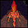  &nbsp; <b>VII.c. Your Sanctuary: Fire Spring</b>

  

Having collected the Melodies from the other seven Sanctuaries, Ness and his friends venture into the last: the Fire Spring, a cavern rife with lava. Fighting its way to the end, the party encounters the Sanctuary Guardian: the Carbon Dog. Even after it transforms into the Diamond Dog, however, they emerge victorious.

  

Ness collects the final Melody, even as he has the feeling of being watched by himself as a baby. His Sound Stone then plays the unified Eight Melodies -- and he falls into a dream, entering the world of his own mind.

  

 <b>Notes:</b>

 - Although Fire Spring is the last Sanctuary to become accessible, it is not necessary for it to be the last to have its Melody collected. Aside from the Fire Spring, Ness can obtain his final Melody and therefore access Magicant from Lilliput Steps, Milky Well, Magnet Hill (by skipping its Melody for later while collecting the Carrot Key) or Pink Cloud.

  

  &nbsp; <b>VII.d. Your World: Magicant</b>

  

Ness sees his home as it was years ago, when he was a newborn, and King a puppy. He listens to his parents conversing over him, speaking of his name, as well as their hopes for how he grows up to be.

  

He then finds himself in a very different world that changes colors depending on his interactions and emotions. He explores memories from years ago, of his family, of his childhood friends, and even of Pokey and the enemies he has defeated. The Star Master guides him through the maze of beauty, kindness, sorrow and hatred, telling him that an evil side of him also exists, and directing him to the Sea of Eden.

  

Ness travels through the Sea of Eden, encountering his own Nightmare at the end. He defeats it despite it claiming it impossible, and obtains the power of the Earth from the Sanctuaries. Ness senses that returning to Saturn Valley would reveal their next course of action, and after he does so, Magicant disappears.

  

 <b>Notes:</b>

 - Ness’s psychic powers, even at birth, are alluded to by him moving a bottle simply by pointing at it.

  

 - Optionally, Ness can get a Flying Man -- which claims to be a personification of Ness’s courage -- to join him for the duration of Magicant, or until it dies in battle.

  

 - In MOTHER 2, it is specifically mentioned that the Apple of Wisdom is a prophecy-telling machine in Giygas’s possession. The Apple of Enlightenment is not attached to these details in the case of the localized version.

  

 - Although Ness seldom has any direct dialogue, his thoughts can be interpreted to a great degree from Magicant.

  

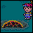  &nbsp; <b>VIII.a. The Meteorite</b>

  

As Ness and his party Teleports to Saturn Valley, they are greeted by a nigh-complete Phase Distorter. It, however, requires a metal known as Zexonyte to function properly, with the understanding that this incredibly rare element can only be synthesized from a meteorite piece.

  

Remembering the meteorite that had fallen near Onett, Ness and his friends return there, only to find it overrun by aliens, the streets empty, the townspeople having barred their houses. Ness’s mother is the only one willing to let them in and encourage them. As the four reach the meteorite, they break off a piece, and head back to Saturn Valley.

  
  

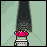  &nbsp; <b>VIII.b. The Cave of the Past</b>

  

With the Phase Distorter ready the next day, Ness and his friends use it to travel to a cave in the Lost Underworld. There, the Star Master appears before them and helps Poo realize PK Starstorm Ω as one last power to help them in their endeavor. Soon, however, they find a dead end.

  

Suddenly, Dr. Andonuts, Apple Kid and a Mr. Saturn appear there in the Phase Distorter III, explaining that Giygas is attacking from the precise location, but from the past. To combat him, Ness and his friends would have to travel through time -- but life forms cannot survive time travel. It would require their consciousnesses to be transferred into robotic bodies, with no guarantee of them being able to return to their original bodies.

  

Even with this understanding, they determine to do what is needed. Following the operation, they travel back in time, only to find the Cave of the Past filled with Giygas’s forces. Forcing their way through, they reach Giygas’s lair, finally at the point of battling Giygas himself.

  
  

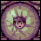  &nbsp; <b>VIII.c. Giygas</b>

  

Giygas’s lair is a web of mechanical tube-like structures, Giygas himself enclosed within the Devil’s Machine. As the party approaches him, the Devil’s Machine seems to adopt the appearance of Ness, and Pokey arrives to taunt the party about the prospect of standing against Giygas -- as well as the sheer odds.

  

Although any attacks on Giygas are reflected back at the party, they manage to bring down Pokey. As a last resort, even admitting that he is terrified, Pokey turns off the Devil’s Machine and reveals Giygas’s true form -- an incomprehensible being whose power is so incredible that he is unable to control it or think rationally anymore.

  

Despite their party’s best efforts, as Pokey observes, Ness and his friends make no headway against Giygas, with it being increasingly clear that Giygas is far beyond being defeated by any force. Ultimately, the party has no choice but to stand its ground, with Paula Praying.

  

She reaches out to their friends, families, and even the player themselves. They reciprocate, an act that renders Giygas’s defenses unstable, and inflicts progressively increasing damage on him. With the player praying for the safety of Ness and his friends, Giygas is finally defeated.

  

 <b>Notes:</b>

 - Pokey mentions Telepathy while taunting the party, subtly and unwittingly alluding to the Pray command’s importance towards defeating Giygas.

  

  &nbsp; <b>The End…?</b>

  

The robots of Ness and his friends lay broken, but, miraculously, they manage to return to their real bodies back on Saturn Valley, even traveling through time and space. Their journey finally over, and the Earth safe, they say their farewells, Poo returning to watch over Dalaam and Jeff deciding to stay with his father for some time. Paula, meanwhile, asks Ness to escort her home.

  

Almost everyone Ness and his friends have met have something to say. With the world free of Giygas’s influence, they settle back into life and sometimes express their gratitude, Ness’s father saying that he would do his best to be home for Ness’s birthday the next week. On this positive note, he returns home to a photo-album his mother shows him, chronicling his journey.

  

That night, however, there is an oddly familiar knock on the door at night. Investigating it reveals Picky, who has come to deliver a letter from Pokey to Ness. 

  

In the letter, Pokey taunts Ness one last time.              

