
<b>Update: For a more thorough description in layman's terms, see this article on EarthBound Central: <a href="http://earthboundcentral.com/2011/05/earthbounds-copy-protection/">EarthBound's Copy Protection</a></b>

  
Most game companies these days put checks in their games to thwart -- or at least curb -- software pirates from illegally distributing and selling their work. This includes the MOTHER 2 and EarthBound games. Here is a brief look at the measures the programmers took to prevent piracy of these games and how we came to figure them out.

  
 
<b><u>Multiple ROM Versions:</u></b> 
It's common for game companies to release slightly different versions of games without telling anyone. These different versions often fix rare bugs and glitches, and because of this, different versions of game ROMs aren't uncommon.
  
There appeared to be at least two different versions of the EarthBound ROM, but nobody really knew <i>how</i> they were different, until early 2007. It was discovered that one version actually had its anti-piracy measures crippled, meaning that version was looked at by pirates and hacked to keep the game from realizing it was pirated. The other version appeared to be a clean dump of an EarthBound cart. There may be other versions of clean EarthBound ROMs, but so far we don't have any details on that possibility.

  
 
<b><u>The Actual Anti-Piracy Measures:</u></b> 
Forum user Goplat looked at the differences between the two ROMs, and found that the files differed by only a few bytes here and there. These spots were where the anti-piracy code was. So, by looking at the clean ROM, he could see what those snippets of code did:
<ul>
 <li>A subroutine at address $C0A11C is the first line of defense against pirates, being called upon startup. It first checks to make sure that there's only 8 kilobytes of SRAM, the part of memory used to hold saved games. Cartridge copiers have more, so if it detects that, the game displays a screen that says, "It is a serious crime to copy video games."</li>

   
 <li>Both games also check which kind of PPU the SNES has - if it's a PAL type (used mainly by European game systems), they display the following screen:  
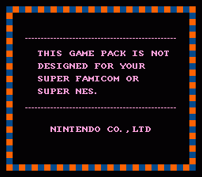
</li>

   
 <li>Movement Script 1 calls a subroutine at $C1FFD3, which takes a checksum of the code at $C0A11C-$C0A150. If anything in that memory range has been altered, a non-zero value is stored to $7EB539, and the script will then bring up a copyright infringement screen. This screen differs between MOTHER 2 and EarthBound.  
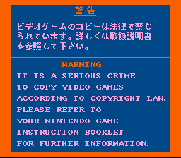 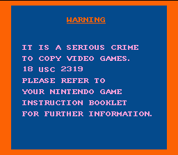
</li>

   
 <li>At $C0281A there's a check to see if $7EB539 is zero. If it isn't, random enemies appear MUCH more often. This was probably an attempt to make the game unenjoyable. Here are screenshots of just how many enemies will show up:  

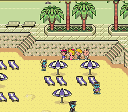 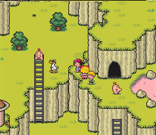 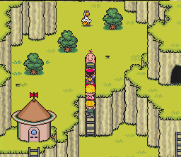 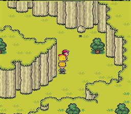 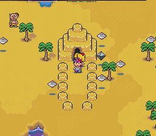 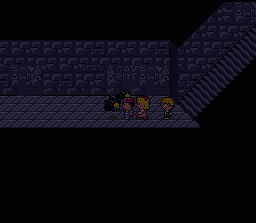 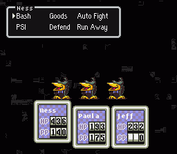  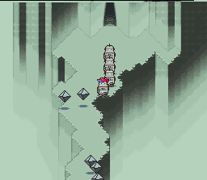 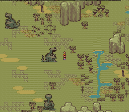 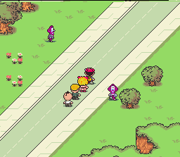 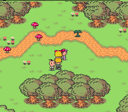 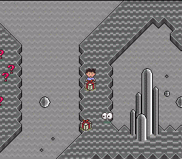 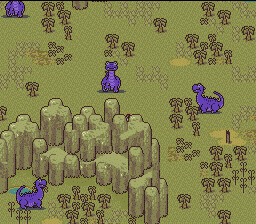 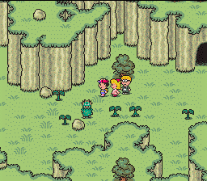
</li>

   
 <li>At $C08391 is another SRAM checker. We're not sure when it's called, or what the game does if it detects more than 8 kilobytes. It's called from six different places though, so it probably happens at various events throughout the game, much like how the piracy checks on EarthBound Zero worked.</li>

   
 <li>At $C3FDC5 is another checksum routine that goes through $C0A11C-$C0A150. This one is called after Pokey turns off the Devil's Machine. If any data in that range has been changed, the checksum fails, the game deletes all your saved games (seriously) and then it crashes/freezes up. Neat. You can see it in action here:  
<youtube src="BmyoV1bkXNI" />
</li>
</ul>

 
<b><u>This is so cool! I wanna try it out!</u></b> 
If you want to try this stuff out yourself, use the following code in the cheat section of your favorite emulator:  

<b>C3FDDAD0</b>

 
Or if you have a Game Genie, the code is:  

<b>2DE2-546E</b>

 
<b>CAUTION!</b> If you decide to try out these codes, make a backup of your .srm file! That's the file that has your save games!

