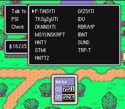



  
The easiest way to access this very cool debug menu is with the following three Game Genie Codes:

  

<h3>DD6C-71F9  6D6C-7199  A96C-71B9</h3>

 

(These codes have been verified to work on original hardware with a Game Genie.)   

Once you've added these codes, go to Ness' items and "Use" his ATM Card. Doing so will call up the debug menu! Just be sure not to do something crazy like remove Ness from your party or get rid of the ATM card, or else you're stuck.

  
More details about this menu will come eventually, but for now, see <a href="http://classic.starmen.net/mother2/tips/debug.php">this</a> to understand what everything on the menu does.

