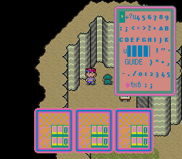
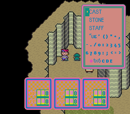
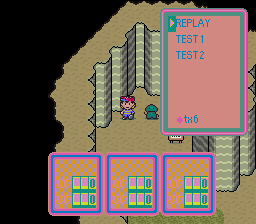
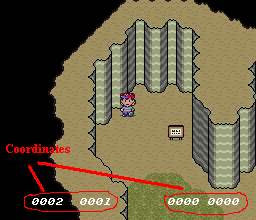
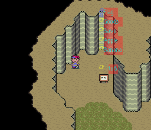
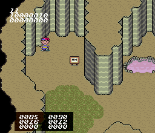
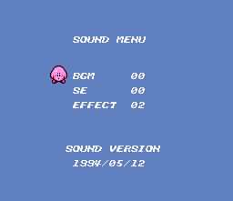



 
This second debug menu in EarthBound has actually been known about <a href="http://hijola.starmen.net/articles/debug.html">for a very long time</a>. We just never had any idea how to access it or what exactly it did. But then thanks to Cabbage, <a href="http://oldforum.starmen.net/cgi-bin/ultimatebb.cgi?ubb=get_topic;f=8;t=000350">we finally got access to it</a> in early 2003.

  
This debug menu looks like it was used by a team at HAL (hence the Kirby sprite) that worked a lot on the map and walking around part of the programming. The other debug menu seems like it was meant for people testing the text, the text parsing system, events, and other things that are handled by the game's text.



<b>Caution! This debug menu is (ironically) extremely buggy! Use caution!</b>

  
The easiest way to access this debug menu is with three Game Genie codes:  

<b>6B88-54D4  3188-5404  3E88-5464</b>

 
Or, if you're more technically inclined, use a hex editor, go to address BBB8, and change the bytes "<b>D8 B7 C0</b>" to "<b>89 E6 EF</b>".

  
Once you've done one of these two things, start up the game!



The different controls for various parts of the debug menu are:

<ul>
 <li> <b>A</b> – Turns the screen black for a second. The Ness image is placed wherever you moved the invisible sprite.</li>

   
 <li><b>B</b> – Brings up the Talk menu, etc., as it would in the game. Do whatever you want, but as soon as you exit it, the game will freeze. If you go right in front of someone with your aiming correct and press B to bring up the menu, and then press A to talk to them, it will bring up their text, but the game will freeze afterward.</li>

   
 <li><b>Y</b> – This is the most interesting part of the "View Map" option. It pulls up a special menu, which is described in great detail below.</li>

   
 <li><b>X</b> – Nothing</li>

   
 <li><b>L</b> – Nothing</li>

   
 <li><b>R</b> – Nothing</li>
</ul>



Selecting the "Game" option on the debug menu will begin the game like normal. So this is sort of like the "exit the debug menu" option.



<ul class="pics">
<li>

<h3>PAGE #1</h3>

<b>Flag</b> - Controls what event flags are turned on and off.

<b>Goods</b> - Gives you any items you want. Consult PK Hack for a list.

<b>Save</b> - Saves your game and whatever you've done here.

<b>Apple</b> - Brings up the other debug menu.

<b>Banana</b> - Switches from View Map mode to Game mode.

<b>tx6</b> - Takes you to the next page of the menu.

</li>

<li>

<h3>PAGE #2</h3>

<b>TV</b> - Unknown. Usually leads to the game freezing.

<b>Event</b> - Unknown. Is buggy for now.

<b>Warp</b> - Warps you to the Happy Happy headquarters. Buggy.

<b>Tea</b> - Lets you watch the tea scene.

<b>6?K –</b> - Leads back to Page #1.

</li>

<li>

<h3>PAGE #3</h3>

<b>+?u456789:;&lt;=&gt;?*ABCEDFGHIJKu|| || || || | !". –</b> - Leads back to Page #1.

<b>GUIDE  )**,-./012345 –</b> - Shows the town maps. Press down to cycle through them.

</li>

<li>

<h3>PAGE #4</h3>

<b>CAST</b> - Unknown. Acts strange, but so far does nothing.

<b>STONE</b> - Shows the cast of characters. No music, and freezes when done.

<b>STAFF</b> - Displays the Sound Stone screen. Doesn't freeze afterward!

<b>"ue' ()**,-./0123456789:;&lt;=&gt;</b> – Rolls the staff credits.

</li>

<li>

<h3>PAGE #5</h3>

<b>REPLAY</b> - Unknown. Exits menu and freezes.

<b>TEST 1</b> - Unknown. Goes through Paula's prayer text.

<b>TEST 2</b> - Causes some very strange stuff. Try it at least once!

</li>

</ul>



<ul class="pics">
<li>

Even though it may sound like you can change a bunch of stuff with the characters here, you really can't. It's about the same as View Map, but with one difference: you can see the character's game coordinates. As you move along, the little numbers change. That's all.
  
Also, the keys are the exact same as in View Map, but this time the menu options are inside a clear menu.

</li>
</ul>



<ul class="pics">
<li>

This one is like an exact clone of the View Map Mode one, except, this time, the menu is transparent.

</li>
</ul>



No info.



<ul class="pics">
<li>

Like View Map, but this time you see all sorts of coordinate data. Testers and developers used this to fine-tune position-based events and the like.

</li>
</ul>



<ul class="pics">
<li>

Lets you listen to any music, sound effect, or music effect in the game. A list of music and sound effects can be found <a href="/pkhack/pk_docs/muzak.txt">here</a>.

</li>
</ul>



Thanks go to Cabbage for figuring out how to access this debug menu, NLA for compiling most of this information, and the PK Hack community for being cool and helpful.

