
Only the ultimate MOTHER 2/EB fans know this stuff... so learn it! There'll be a test on it at the end of the semester!

<ul>
 <li>Two players can play the game together! Just plug in two controllers! It's not that useful or anything, but it's neat!</li>

   
 <li>Press the R button while riding the bike to ring the bell! It's surprising how often this goes unnoticed.</li>

   
 <li>MOTHER 2 / EarthBound can be played entirely with one hand. The L button is a shortcut for Check/Talk/Accept, and the Select button acts the same as the B button. To bring up the main menu outside, press Select and then L.</li>

   
 <li>The mysterious <a href="voices.png">"M.D. Seeger"</a>, who is credited with the rock guitar on the gas station screen right before the main title screen, is none other than Shigeru Miyamoto himself. But weirdest of all, apparently Miyamoto might not even realize that he had been made into this mysterious foreign guitarist.</li>

   
 <li>When you finish typing your names and hit OK, a tiny clip saying, "OK desu ka?" ("OK?") plays. This is Shigesato Itoi's voice, and apparently the sound designers added this in at the last second, without Mr. Itoi's knowledge. The clip was also recorded when Mr. Itoi didn't realize he was being recorded, so he was very surprised when he eventually heard it in-game.</li>

   
 <li>At the naming screen, if you press the Start button instead of choosing "OK", it'll play a different sound instead of "OK desu ka?".</li>

   
 <li>At the very beginning of the game, when it's night outside, you can see the traveling entertainers by the shack. Sometimes you might have to be patient, but they're there!</li>

   
 <li>Although it takes hacking to see it for yourself, Captain Strong and the orange guy in glasses don't say anything if you talk to them when they're standing around the meteorite at night. They weren't given any text to say.</li>

   
 <li>Itoi wasn't responsible for Moonside's creation. That was one of the locations where he let his assistants have free reign. The art director Kouichi Ooyama made some interesting artwork for it, an assistant writer Akihito Toda had a good idea to go along with it and wrote some pretty unusual lines of dialogue, and game musician Hirokazu Tanaka created some music that fit with their work.</li>

   
 <li>Itoi revealed that he used a certain episode of his childhood as the basis for Giygas' character. Apparently, when Itoi was a boy, he accidentally walked into the wrong movie at a movie theater. In the movie, he saw a woman getting raped near a river (note: his memory was wrong; it wasn't a rape). The images he saw were like "direct attacks to his brain". He was so shocked that when he returned home, he stayed silent and worried his parents. He says that he used those strong feelings of fear and shock as the basis for Giygas' character and dialogue.
   
 <b>HOWEVER</b>, this story has evolved into a big, unstoppable Internet rumor. The movie Itoi saw was <b>NOT</b> a porno movie. It was simply a mystery movie intended for more mature audiences. The movie was called "The Military Policeman and the Dismembered Beauty". Here is a description of the film:

  

<table width="95%" bgcolor="#111111" cellpadding="5" cellspacing="5"><tr><td valign="top" width="160">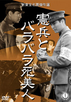</td>
<td valign="top" align="left">The year is 1937, and it has been six months since the Sendai Infantry left for Manchuria. The rotted corpse of a young woman is found at the bottom of a well, but her face and limbs are gone. The military police begin an investigation and search fervently for the person responsible, but they can't even determine the victim's identity, much less find any clues. However, the incident is made public when newspapers give wide coverage to the story, so Staff Sergeant Kosaka is dispatched from Tokyo to solve the case. Eventually, General Tsunekichi is taken into custody by local infantrymen because of the testimony of another unit, but the spirit of the dead woman appears before Staff Sergeant Kosaka, who continues to investigate on his own...
  
This is the first work in Shin-Toho's cult-hit "Military Policeman" series. The detective drama setup, combined with the sinister portrayals of corpses being chopped up and people being whipped while hung upside down, has a maniacal charm distinctive to Japanese cinema.</td></tr></table>

 
This is <b>NOT</b> a porno movie. But it's clearly a movie children should not see. With Giygas' character and text, Itoi tried to bring the same feelings he felt as a kid to the player.

For a detailed English summary of this movie that includes pics, <a href="http://tomato.fobby.net/?p=257">see this</a>.</li>
</ul>



At the eastern edge of Threed is an old man with a hat. He's always there when the town is filled with zombies and other baddies, but he disappears after you defeat Master Belch. Where does he go? Was he with the zombies? Did he die?

  
The truth is that his disappearance is a bug. He was supposed to stay in Threed even after Belch is beaten. But because of a tiny oversight, he disappears. And he actually has new text to say after you beat Belch. Using the awesome powers of ROM hacking, we've "unbugged" him to get some screenshots of what he says!

  

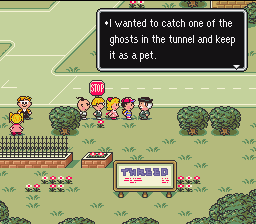 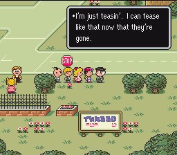




There's yet another guy missing in Threed! They must've been in a hurry when making this section of the game, or maybe things just got lost in the shuffle between developers. This particular character is supposed to appear before or after a certain event in the game, but that event never happens or used to happen but was cut out at some point. Because of this, the guy never appears in Threed. Most likely, he was meant to appear sometime after defeating Master Belch.

  
In any case, this guy claiming to be a detective was supposed to appear in northeastern Threed, near the hint shop. His text is actually pretty important to the story, as it explains how the Mani Mani statue got from Happy Happy Village to Fourside.

  
Again, using the power of hacking, we were able to get some screenshots of this missing character.

  

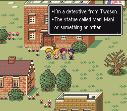 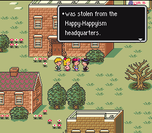 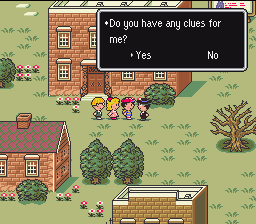

  

 <table border="0">
    <tr>
       <td align="center" valign="top">
          If you answer yes: 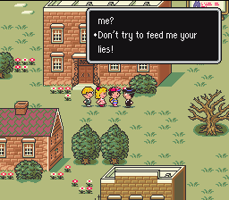
       </td>
       <td align="center" valign="top">
          If you answer no: 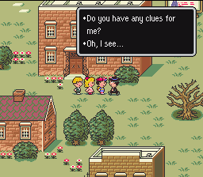
       </td>
    </tr>
 </table>




<ul class="pics">
<li>
<a class="picleft">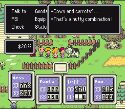</a>
<h3>COWS AND CARROTS</h3>

Try to use the Carrot Key on the cow in Happy Happy Village, and you get this wacky little line!

</li>

<li>
<a class="picleft">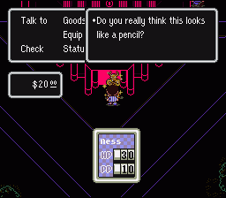</a>
<h3>MANI MANI IS NOT A PENCIL</h3>

If you try to use the Pencil Eraser on the Mani Mani statue in Moonside, you get this little gem. This picture was taken after doing a little bit of hacking, because the next pictures required it...

</li>

<li>
<a class="picleft">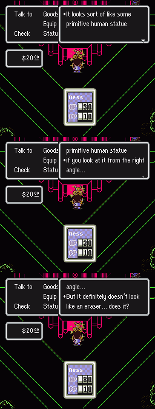</a>
<h3>MANI MANI IS NOT AN ERASER</h3>

This is only possible to see via hacking, since you don't get the Eraser Eraser until well after Moonside. But for some reason, this text actually exists. If you try to use the Eraser Eraser on the Mani Mani statue in Moonside, you get this funny bit of text.

</li>

<li>
<a class="picleft">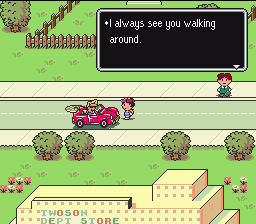</a>
<h3>A TALKATIVE DRIVER</h3>

In northern Twoson there is a guy driving a red convertible. A lot of people miss this. But strangest of all, you can actually talk to the driver!

</li>

<li>
<a class="picleft">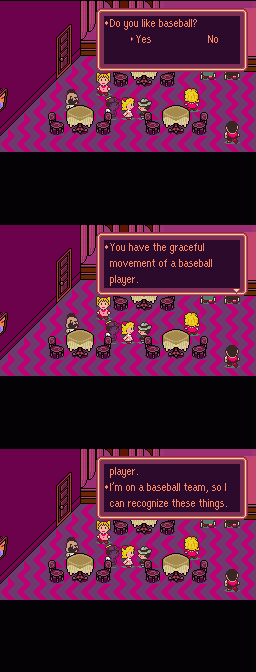</a>
<h3>HITTIN' ON THE LADIES</h3>

If you talk to the guy with the gray hat in Chaos Theater with Ness dead (or diamondized, though that's not really possible at that point in the game) and say yes to his question, he'll deliver this small bit of rare text.  Actually, a few people in Twoson will say new things if Ness is dead and Paula is alive.

</li>

</ul>



Deep within EarthBound's programming and data are some snippets of text that appear to never be used or referenced. Here is some of it.

  
 

<h3>MUSIC CLUB / BAND NAME TEXT:</h3>
This text is never used in the game, but it's located in the part of the program where all the hospital sign text is. Very strange.
<blockquote>@(&lt;Members needed&gt;Popular Music Club. 
@Those who have a guitar, bass or drums, apply now. 
@Caracas Cathedral, Napalm wound, Minky Cadillac, 
@Sun Bunnies, the Creeps, 
@Run Around TownKinky Kids, Bjork, 
@Takashi Hosokawa or Horenso. 
@We welcome anyone who likes to listen to these bands. 
@Only serious, mature fans need apply. 
@Please contact Lou.</blockquote>

  
<h3>SCARABA LADY:</h3>
This text is never used, but it's located with all the other Scaraba NPC text. That, and the content of this lady's text, makes it somewhat clear that there was supposed to be another NPC walking around Scaraba but the programmers forgot to fully implement her. Oh well.
<blockquote>@In the pyramid there's hidden treasure. 
@My husband was looking for it. 
@Before he found it... he slipped on a banana peel. 
@...So he gave up the search.</blockquote>

  
<h3>SCARABA PERSON:</h3>
It looks like this text was meant to be said by someone near the pyramid if you didn't check the hieroglyphs in Summers. It's not clear if he was in Scaraba or down by the pyramid, though.
<blockquote>@You need to be able to read hieroglyphs to solve the mystery of the Pyramid. @...I couldn't solve it, although I read it. @Didn't you read the hieroglyphs at the museum in Summers? &nbsp;&nbsp;&nbsp;&nbsp;&nbsp;&nbsp;&nbsp;&nbsp;Yes &nbsp;&nbsp;&nbsp;&nbsp; No  

<b>If you say yes:</b> @Then, you should be able to solve the mystery somehow. 
<b>If you say no:</b> @Well, that means that you must go back, read it and then come back here.</blockquote>


