
These sprites were first discovered by people on this site in the Summer of 2000 when Tomato wrote his EB Sprite Viewer and Editor.  There have been many questions about why these sprites were never used in the game, so we've listed all the sprites here along with some insight as to where and when they might have been used.  

<table width="100%" cellpadding="0" border="1">
  <tr>
    <td bgcolor="white">
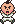
</td>
    <td valign="top">
      <u><b>Poo Jumping:</b></u>
        
All of the other Chosen Four characters have this animation, but Poo is the only one who doesn't actually use it. Ness and Paula jump during their name screen animation, and Jeff jumps over the fence when he's escaping from his school. The developers probably created this sprite just in case they needed it somewhere.</td>
  </tr>

  <tr>
    <td bgcolor="white">
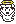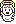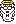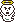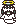
</td>
    <td valign="top">
      <u><b>New Ghosts:</b></u>
        
Here are four variations of the Chosen Four's original ghost sprites and one completely new one featuring Everdred.  The variations of the Chosen Four's ghost sprites are exactly like the regular jumping sprites, except for the transparency, ghostly trail, and halo; so they could just be jumping. Maybe at some point there were supposed to be obstacles you could jump over in the game, similar to A Link to the Past's small fences. That would explain why every Chosen Four member has a jumping sprite.  As for Everdred, there have been many debates on whether or not he actually died, and it seems that this sprite proves that he did.  Or perhaps Everdred was supposed to join your party at some point.  The theories are endless on this one.</td>
  </tr>

  <tr>
    <td bgcolor="white">
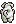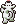
</td>
    <td valign="top">
      <u><b>King Climbing:</b></u>
        
Here we see four sprites of King where you can obviously tell he's supposed to be climbing a rope or a ladder.  This would suggest two things: either King was supposed to stay with you longer in the game, or that Ness' original travels through Onett were supposed to include something to climb.  However, it could be neither and those sprites may have just been created just in case they needed to be used.  
We decided to use the Walk-Through-Walls trick test this theory out, but it looks like these four sprites aren't active: <a href="wtw1.png">screenshot 1</a>, <a href="wtw2.png">screenshot 2</a>.</td>
  </tr>

  <tr>
    <td bgcolor="white">
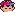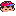
</td>
    <td valign="top">
      <u><b>Ness Sleeping With His Cap On:</b></u>
        
Since there are no "sleeping" sprites for the other characters, these sprites were probably meant to be used in special sequences early in the game; possibly waking up from Paula's psychic calls.  Or maybe Ness was intended to be asleep when he first arrived in Magicant in Mother 2 (because he is completely naked except for his cap while in Magicant in Mother 2).</td>
  </tr>

  <tr>
    <td bgcolor="white">
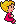
</td>
    <td valign="top">
      <u><b>Ness' Mom Sitting Down:</b></u>
        
This was probably made in case the game developers wanted Ness' mom to be sitting down while at home rather than walking around in random directions.</td>
  </tr>

  <tr>
    <td bgcolor="white">
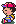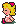
</td>
    <td valign="top">
      <u><b>Ness and Paula Sitting with Eyes Closed:</b></u>
        
Since there is no Jeff or Poo equivalent these sprites, they were probably meant to be used in an event before Threed. They possibly could have been used when they woke up in the cemetery.</td>
  </tr>

  <tr>
    <td bgcolor="white">
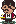
</td>
    <td valign="top">
      <u><b>Jackie Looking to the Side:</b></u>
        
This sprite was probably meant to be used when you talk to Jackie from the side, but it isn't used for some reason.</td>
  </tr>

  <tr>
    <td bgcolor="white">
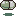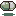
</td>
    <td valign="top">
      <u><b>Capsule:</b></u>
        
This looks exactly like the capsule containing Starman Jr. in Mother 1. This is found among the enemy-out-of-battle sprites, so it was probably supposed to be used as an alternative to the odd octahedrons used to represent enemies in the last areas of the game. It could also have been used as the out-of-battle sprite of either Starman Jr. or Starman Deluxe.</td>
  </tr>

  <tr>
    <td bgcolor="white">

</td>
    <td valign="top">
      <u><b>Question Bubble:</b></u>
        
Probably just an asset they put in there in case they needed one, and it turned out they didn't.</td>
  </tr>

  <tr>
    <td bgcolor="white">
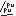
</td>
    <td valign="top">
      <u><b>"Pu pu":</b></u>
        
"Puu Puu" (fart noise) is the sound the Mr. Saturns make in Japanese.  Perhaps this sprite was to appear in Saturn Valley while the Mr. Saturns were walking around.</td>
  </tr>

  <tr>
    <td bgcolor="white">
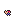
</td>
    <td valign="top">
      <u><b>Tiny Posing Ness:</b></u>
        
Obviously, there was supposed to be a photo spot somewhere in the Lost Underworld.</td>
  </tr>

  <tr>
    <td bgcolor="white">
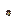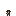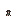
</td>
    <td valign="top">
      <u><b>Tiny Photographer:</b></u>
        
Judging by the above sprite, these are most likely tiny versions of the Photographer to be used in the Lost Underworld.</td>
  </tr>

  <tr>
    <td bgcolor="white">
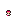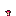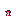
</td>
    <td valign="top">
      <u><b>Tiny Delivery Guy:</b></u>
        
These appear to be tiny versions of either the Escargo Express or the Mach Pizza deliver guy to be used in the Lost Underworld.</td>
  </tr>

  <tr>
    <td bgcolor="white">
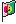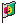
</td>
    <td valign="top">
      <u><b>Flag:</b></u>
        
This was probably made to be used as decoration somewhere, though it doesn't seem to fit anywhere in the game.</td>
  </tr>

  <tr>
    <td bgcolor="white">

</td>
    <td valign="top">
      <u><b>Beating Heart:</b></u>
        
Maybe some romance sequences were planned, but didn't make it in.</td>
  </tr>

  <tr>
    <td bgcolor="white">
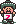
</td>
    <td valign="top">
      <u><b>Sanchez Brother Cheering:</b></u>
        
This sprite was obviously supposed to be used when you won something.</td>
  </tr>
</table>

