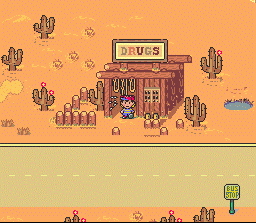
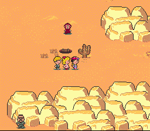
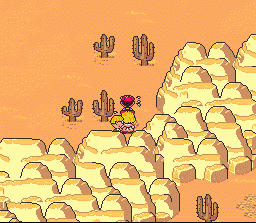
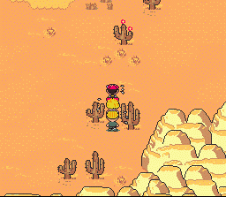
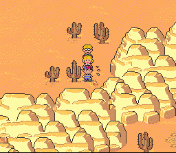
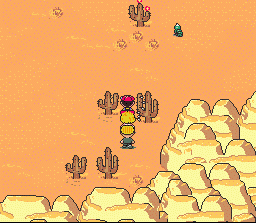
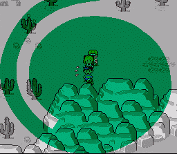
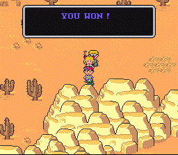


<i>The following is a great method on getting HUGE and quick amounts of
      EXP. while in Dusty Dunes Desert.  This was taken off of the EBFGP
      Board by someone known as MagicCakeIsGood.
      This is a great tip.  It's very detailed, and it seems to work for
      everyone that's tried it. For example, he was able to gain over 30
      levels in about 3 hours!  That's pretty impressive. It is kind of long
      however, so you may want to print it out.  So, if you want to try
      something new in EarthBound, check this out!</i>
      

Pictures have been generously provided by BC.

      So, as someone had eluded to, I did search for and fight Criminal
      Caterpillars for those three hours. Although I never even knew that
      they existed until my sixth time through the game, I have now developed
      a method for finding CC's with more ease than deciding what the name of
      your dog will be. This information that I am releasing to you is
      straight from me, tried and true tested, but I must tell you that the
      fun from the game might be wasted since your levels for your characters
      will be so outstandingly high after just two hours that no challenge
      will be left in the game and not many forces will be able to overtake
      you for many game playing hours to come. But... this is so frickin'
      cool, you gotta try it at least once. Not only that, but this can give
      your characters a little boost just before fighting the five hole mole
      masters, making that particularly tough site a little easier.
      

      Before I begin, I must tell you that I must describe the situation from
      memory and tell you what to do without my game or a Player's Guide in
      front of me, so things might be a little weirdly-described and maybe a
      little off, but I know what I need to know... and so will you...
      

 
      Okay, Dusty Dunes Desert, the home of the Criminal Caterpillar. From
      the Drugstore in DDD, go north past the store, the Mole Playing Rough,
      and take a right to the east after the rock wall that runs horizontally.

 
      Follow this wall to the east past the hole to Tala Ramah and continue
      following the wall, past a couple of cacti, and stop when the
      horizontal rock wall takes a drastic northern turn. 

 
Get to know this
      area, as it will be your ground for catching the elusive and rare
      Criminal Caterpillar. There are a couple of cacti near the turn, a
      couple of cacti to the north of you, which continue growing to the
      east, and the rock wall bends to the east, eventualy leading you to the
      mine and Gerardo and George Montague's shack.
      

      This area is home to many creatures along with the CC. Cute 'Lil UFOs,
      the Crested Booka, the Smilin' Sphere (avoid at all costs, please),
      Desert Wolves, some ox-like creature (which I never fought in the area,
      but to the east), and Skelpions are abound. All will try to attack you
      in any matter possible, and most will tap your PSI reserves to mend and
      defend yourselves. I find that the more enemies on-screen, the less of
      a chance that you find a CC in this area, but they can still be found
      quite easily with them on the corner of the field of vision. However,
      because these voracious enemies will be amassing in great numbers
      against you, scrolling them away is a very effective way to rid them
      from your sight. The experience points you chase away may be greatly
      missed, but the finding of just one CC will rid you of any bad feelings
      of losing a couple of Skelpions' worth of exp.
      

 
      Okay, now the way to find these little buggers. Stand between the cacti
      closest to the rock wall before the large northerly rise of the rock
      wall. There should be two cacti arranged in front of you that you'll be
      passing between to the north. To the north of those (off-screen) are
      two more cacti, but not arranged to walk through. Don't ever walk up as
      far as the unarranged cacti; you won't need to unless you're chasing a
      CC.
      

 
      The method I used for three hours was to start Ness walking from the
      two cacti set wide enough to walk through near the rock wall north to
      where he's standing between the other two cacti set wide enough to
      stand between just a mere couple of inces on your TV screen. That's
      all! 

 

This method is repeated as many times as needed until a CC is
      spotted to your right just above the rock wall that has just begun to
      move to the east again after the northern turn. If you're semi-lucky, a
      green wiggly worm will be doing loops and may begin running from you.
      That is the nature of a criminal; run. 

 
This enemy is very strong if you
      fight it face to face, but if you catch this enemy running away from
      you, you gain over 30,000 exp. in one simple green-swirly free battle
      (divided by how many characters you have alive at the time of battle)!

 
      The trick is to make the CC run into some immovable object to force him
      to stop running away, halting him in his tracks, leaving his back
      exposed to you. Fighting him head-on will result in him casting Fire
      alpha on you non-stop every turn, and maybe (maybe!) only one character
      of yours can withstand two fire alphas without keeling over at level 30,
      so MAKE SURE you fight him with his back turned. This is very simple,
      though. When the CC begins to run away from you, you can move in one of
      two directions: north or south. North is much more recommended, and
      I'll tell you why. If you move to the north, the CC will try to get
      away from you by moving to the south. To your south is the endless rock
      wall, and the CC will be stopped from running from you, leaving his
      back open to you. From there, make sure that you just walk directly
      into his back and PSSHHWWAAHH!, you've got 10,000 exp for Ness, Paula,
      and Jeff. You can also move to the south to force him to move to the
      north, but that should ONLY be done to push a CC into a cactus that you
      know is there in front of him. Since there are very few cacti to the
      north directly in front of you, you might be following this CC until
      you hit the shore of the water a very long way away from where you first
      saw the CC, most likely resulting in twelve more battles than you had
      anticipated or needed. I say, move to the north to force him to the
      south.

 
      Okay, no CC's showing? Walk away for a bit and try again. I know that
      there have been times where I felt like nothing was going to ever come
      again, like I had lost my touch and no more CC's were going to come out
      in that spot. I walked away, walked back after a short ten seconds, and
      the next time I tried I got three CC's in three attempts. Sometimes
      searching works, but sometimes I felt like I needed to just see a
      different place for a bit. Call Mom. See Dad. Rest in the Drugstore if
      you need PP (I always love it when the game says Jeff has no PP). Just
      don't ever give up looking for them.

      

      Two things about this. Number one, if you're looking for the highest
      amount of money you've ever seen, this won't be the way. I fought lots
      of CC's, but when I went in to talk to dad after three hours, I had
      built up maybe $8,000. I believe that was the money I had gained
      fighting the other desert creatures, and fighting CC's will give you
      virtually no money whatsoever.
      

      Second. I've never tried this on any other game than my own, so I don't
      know if this will work on your cart/R*M. I don't know if there are hot
      spots for enemies like in Parasite Eve, but I know this is my spot for
      finding CC's. Also, in my game, there's a place in the cave in
      Happy-Happy Village where the second "Your Sanctuary" is where a Magic
      Butterfly appears nearly every time I walk through there, but I don't
      know if that little butterfly and that hot spot is in EVERY GAME. I
      report what I see and do, not knowing what may or may not happen in
      anyone else's game. I apologize if this CC hot spot does not exist in
      your game and I have led you on, but I share with the world for all of
      mankind, not just you. Be happy for everyone else in the world who do
      have it.

