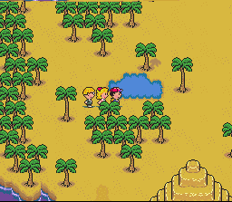
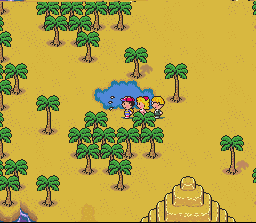
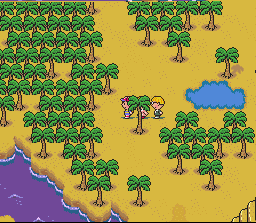
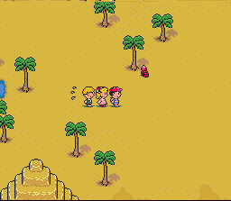
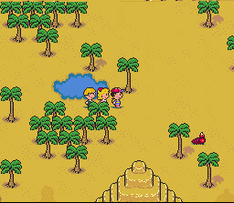
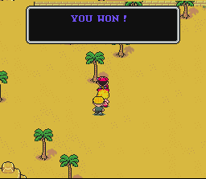


<i>Following is a method similar to the Dusty Dunes Trick, a trick to get tons of EXP. with very little effort.  

My thanks go to MegaFoppo, whose method I (Tomato) refined. There might be even an easier way to get Master Criminal Worms to appear, so if you do, make sure to let us know!</i>  

If you're looking for tons of experience and you want it fast, head to Scaraba. South of the town, you may encounter that criminal mastermind, the Master Criminal Worm. Guessing by his name, you'd think he'd be hiding and hard to find. Well, I found a way to make him appear almost at will, and this is good, because he gives a TON of experience. What's better, since he always runs away from you, 99% of the time you'll get a free green-swirly victory and instant EXP!  

Here's how you do it. South of the town, there is a small pool of water and a lot of palm trees. Walk just below the water. Walk as far left as you can, then turn around and walk right until you get into the big open clearing. If you don't see the MCW, try this again. Eventually he'll appear!  

The tricky part is trying to make him run into something so you can catch up to him without encountering any other enemies. The only advice I can give is that you try to make him run northward, since there are very few obstacles to the south. Twice I chased a MCW all the way to the river south of the pyramid. Obviously, you don't want to do that.  

Oh, here are some pics if you're interested in this trick. Thanks, sKaNkPiT!   

  

- Tomato

