
<a href="newBox_Art_-_front.jpg" title="EarthBound Box - Front">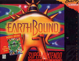</a> 
<a href="newBox_Art_-_back.jpg" title="EarthBound Box - Back">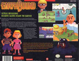</a> 
 
<a href="ebCart.jpg" title="EarthBound Cart">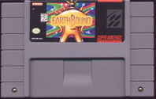</a> 




<a href="clay_slug_.png" title="Attack Slug">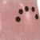</a>

<a href="clay_brickroad_.png" title="Brick Road">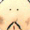</a>

<a href="clay_chosenfour.png" title="Chosen Four">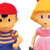</a>
<a href="clay_csnake.png" title="Coil Snake">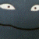</a>

<a href="clay_egoorb_.png" title="Ego Orb">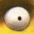</a>

<a href="clay_king_.png" title="King">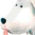</a>
<a href="clay_lierx_.png" title="Lier X. Aggerate">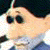</a>

<a href="clay_madtaxi_.png" title="Mad Taxi">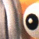</a>
<a href="clay_belch_.png" title="Master Belch">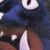</a>

<a href="clay_mook.png" title="Mook Senior">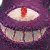</a>

<a href="clay_m2ness.png" title="Ness (MOTHER 2)">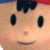</a>

<a href="clay_hippie.png" title="New Age Retro Hippie">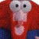</a>

<a href="clay_paula.png" title="Paula">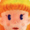</a>

<a href="clay_pokey.png" title="Pokey">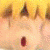</a>

<a href="clay_m2poo.png" title="Poo (MOTHER 2)">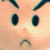</a>
<a href="clay_runawaydog.jpg" title="Runaway Dog">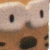</a>

<a href="clay_scrow.png" title="Spiteful Crow">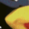</a>

<a href="clay_tsprout.png" title="Trillionage Sprout">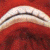</a>

  
<a href="EarlyM2Paulaclaymodel.png" title="Early Mother 2 Paula Clay Model">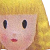</a><a href="http://starmen.net/vote/vote.php?id=27988">Old Paula Model</a> (courtesy of BottleRocket)







In June 2003 the <a href="/merchandise/misc/m12artbook.php">MOTHER 1+2 Art Book</a> was published to go along with the release of MOTHER 1+2 for the Game Boy Advance. This book contains many concept sketches and pictures from the early stages of MOTHER 2's production and locations such as Dalaam and Winters can be viewed here as they once existed in the minds of the game developers.  It is interesting to compare the concepts with that which was ultimately included in the game as some of the sketches are very different.
<ul class="pics">
	<li>
		<a href="conceptart/ab_brickroad.jpg">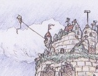</a>
		<h3>Dungeon Man</h3>
		
A closeup of the top of Brick Road’s Dungeon Man.  It looks as if an entire fortress was meant to be built on top of his head at one point!  Also, we can see that the environment is very different than the desert of Scaraba where he is found in the game.

	</li>
	<li>
		<a href="conceptart/ab_dalaam1.jpg">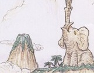</a>
		<h3>Dalaam 1</h3>
		
Instead of clouds, Dalaam may have been perched atop a giant rockform elephant.  And is that Poo meditating up there?
	
	</li>
	<li>
		<a href="conceptart/ab_dalaam2.jpg">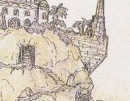</a>
		<h3>Dalaam 2</h3>
		
Another early concept of Dalaam.  This looks more like the actual kingdom with its tiered design.  It's interesting to note that there seems to be a similar mountain top settlement in the background of this sketch.
	
	</li>
	<li>
		<a href="conceptart/ab_lab.jpg">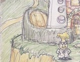</a>
		<h3>Dr. Andonuts's Lab</h3>
		
An early idea for Dr. Andonuts's lab.  Looking much more outlandish than its final version, the words "Mad Scientist" are actually written around the door.  Perhaps the rocket in the background was meant to be the first Sky Runner.
	
	</li>
	<li>
		<a href="conceptart/ab_nesshouse.jpg">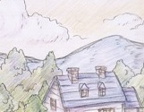</a>
		<h3>Ness's House</h3>
		
A simple sketch of Ness's house and the mountains behind it.
	
	</li>
	<li>
		<a href="conceptart/ab_saturnvalley.jpg">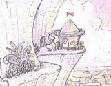</a>
		<h3>Saturn Valley</h3>
		
A view from the top of Saturn Valley.  In the background we can see the hot springs and a number of Saturn homes, even a Mr. Saturn UFO!
	
	</li>
	<li>
		<a href="conceptart/ab_stonehenge.jpg">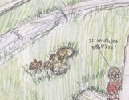</a>
		<h3>Stonehenge</h3>
		
A sketch of Jeff inspecting Stonehenge.  There’s no snow around, so it seems as though the rock formation was not initially meant to be located in winters.  This is the second sketch in which we see Jeff with a bicycle which suggests that he may have been slated for a much more involved solo adventure at some point.
	
	</li>
	<li>
		<a href="conceptart/ab_underworld.jpg">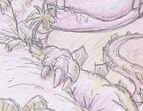</a>
		<h3>The Lost Underworld</h3>
		
A picture of The Lost Underworld from a ground-level view.  Although an early concept sketch, the designs for the Chomposaur and Wetnosaur enemies remained practically unchanged.
	
	</li>
	<li>
		<a href="conceptart/ab_winters1.jpg">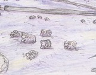</a>
		<h3>Winters 1</h3>
		
It seems that Winters may have, at one time, been a farming village instead of the densely forested area we know from the game.  The livestock in this sketch appear to be much less “gruff” as well.
	
	</li>
	<li>
		<a href="conceptart/ab_winters2.jpg">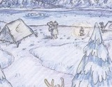</a>
		<h3>Winters 2</h3>
		
A much more familiar Winters scene.  Jeff, now depicted in his classic green suit, comes upon a campsite near the lake with Bubble Monkey in tow.
	
	</li>
	<li>
		<a href="conceptart/ab_winters3.jpg">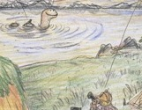</a>
		<h3>Lake Tess</h3>
		
In this sketch we can see Jeff riding on the back of Tessie (spelled Tassy) out on the lake being observed by a Tessie watcher.  Once again, there is no snow so this area may not have originally been in Winters.
	
	</li>
	<li>
		<a href="conceptart/ab_winters4.jpg">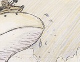</a>
		<h3>Tessie</h3>
		
Jeff meets Tessie in a different way in this scene.  It seems as though Jeff was riding in a small boat when Tessie came and surfaced right beneath him!  No sign of Bubble Monkey here so this could have been the original idea for that part of the game.
	
	</li>
</ul>

Remember kids, if you would like more information on the <a href="/merchandise/misc/m12artbook.php">MOTHER 1+2 Art Book</a>  or ways to get some of your very own MOTHER 2 publications, head on over to our great <a href="/merchandise/">merchandise</a> secion.  Also, a big thank you to Jonk for providing the scans.


