
Prepare yourself for an RPG adventure full of smiles and tears, EarthBound! 
 

<a href="war.png" title="The War Against Giygas">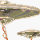</a>
<a href="intro1.PNG" title="Naming Ness">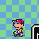</a>
<a href="intro2.PNG" title="Naming Paula">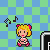</a>
<a href="intro3.PNG" title="Naming Jeff">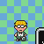</a>
<a href="intro4.PNG" title="Naming Poo">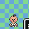</a>
<a href="intro5.PNG" title="Naming the Dog">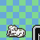</a>
<a href="intro6.PNG" title="Favorite Food">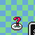</a>
<a href="intro7.PNG" title="Favorite Thing">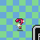</a>
<a href="intro8.PNG" title="The Naming Screen">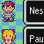</a>



A small suburban town located in the northern hills of Eagleland made famous for their... police road blocks.  Onett is the hometown of our hero Ness, as well as where our adventure begins.  Attractions include an extensive library, the stately town hall, and the occasional falling meteor carrying a bee from ten years in the future.  

<a href="pokeyhill.png" title="Pokey">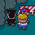</a>
<a href="meteorlight.png" title="A Messanger">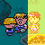</a>
<a href="fightjunior.png" title="Invader from the Future">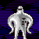</a>
<a href="onett4.png" title="Fuzzy Pickles">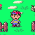</a>
<a href="onett.png" title="Mothers understand...">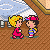</a>
<a href="onett2.png" title="A library is a nice place...">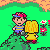</a>
<a href="onett3.png" title="...to learn about EarthBound!">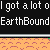</a>
<a href="onett5.png" title="All the info is there">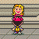</a>
<a href="onett6.png" title="Tracy">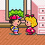</a>
<a href="onett7.png" title="Tracy gives a cookie">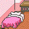</a>
<a href="onett8.png" title="Spiteful Crow">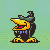</a>
<a href="onett15.png" title="Secret entrance!">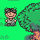</a>
<a href="onett9.png" title="Pogo Punk">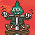</a>
<a href="onett10.png" title="Get out of here!">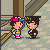</a>
<a href="onett11.png" title="Busting his butt...">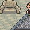</a>
<a href="onett16.png" title="You did the work so I don't have to">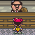</a>
<a href="onett12.png" title="Garbage picker!">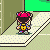</a>
<a href="onett13.png" title="Where IS the X-button?">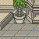</a>

<a href="onett17.png" title="Bustin' in">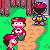</a>
<a href="onett18.png" title="Is this a joke?">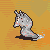</a>
<a href="onett19.png" title="*gulp*">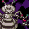</a>
<a href="onett20.png" title="Ahh, so peaceful">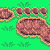</a>
<a href="onett21.png" title="I'm a what?">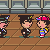</a>
<a href="onett22.png" title="Stay right there!">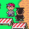</a>
<a href="onett23.png" title="Cops are weird">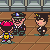</a>
<a href="onett24.png" title="Ness sticks it to the man!">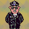</a>
<a href="onett26.png" title="Come with me">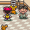</a>



They got their name because they weren't first.  See a show at the Chaos Theater or visit the spacious Twoson Department Store.  Need some fresh air? Then be sure to check out the outdoor market at Burglin Park for all your ruler and banana purchasing needs.  <a href="twosonmap.png" title="Twoson">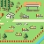</a>

<a href="twoson2.png" title="Yes! Get it off!">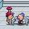</a>
<a href="twoson3.png" title="Where is Paula?">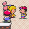</a>
<a href="twoson4.png" title="Take cover!">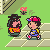</a>
<a href="twoson5.png" title="Aaaahh, they're following me!">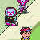</a>
<a href="twoson6.png" title="You need a bath">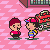</a>
<a href="twoson8.png" title="My baby's back!">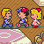</a>
<a href="twoson9.png" title="Here, have some money">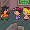</a>
<a href="twoson10.png" title="Come to our show!">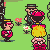</a>
<a href="twoson11.png" title="Posing as Ness' sister">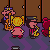</a>
<a href="twoson12.png" title="Let's blow this popsicle stand!">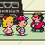</a>



Nestled at the far end of Peaceful Rest Valley, this quaint village has been overrun by a crazed,  blue-worshiping cult!  Hopefully our man Ness can step in to quell these paintbrush weilding madmen and save the day.  <a href="twoson7.png" title="What is the world coming to?">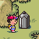</a>
<a href="prv.png" title="A tree?!">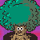</a>
<a href="prv2.png" title="Those annoying robots!">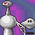</a>




Home to the year-round circus, Threed should definitely be a destination for children of all ages.  Unfortunately there's no fun for our heroes as the town has recently become infested with ghosts and zombies making any path of escape nearly imposible!  They're going to need some help with this one.   




The small snow covered village that Jeff calls home.  In addition to the prestigious Snow Wood Boarding School, Winters features the mysterious rock arrangement of Stonehenge as well as Lake Tess where the legendary sea beast Tessie is said to live.  




After treking through the tunnels behind Threed, the most skilled adventurers will come upon a strange village inhabited by even stranger villagers.  And if it wasn't bizzare enough already, many of these villagers have been captured, forced to work in a factory headed by sentient piles of barf.  




The DDD is a sweltering desert that spans the distance between Threed and Fourside.  The adventure gets even hotter than the sand when our party travels beneath the dunes to defeat a quintet of giant moles that have taken up residence in a gold miner's cave.  




Welcome to the big city!  Be sure to catch one of the Toppolla Theater's famous live shows or maybe take some time to visit the Fourside Dinosaur Museum.  Be careful though, get too nosey and you might find yourself transported to the neon nightmare of Moonside.  




Summers, the world's more expenisive tourist location.  There are many attractions to visit here as you stroll down the beachside strip including a cultural museum and a geode-musing philosophers club.  If you're feeling adventurous, head East to the port town of Toto and sail across the ocean.  Watch out for the Kraken though!  




Perched atop the clouds themselves, the eastern kingdom of Dalaam is where our fourth hero resides.  After completing his excruciating "mu" training, Prince Poo is called on to aid our party.  




Across the sea from Toto awaits the desert city of Scaraba.  Adventurers and tourists alike should not pass up the opportunity to vist the pyramids south of the city.  The Sphinx holds the key to unlocking their secrets. When you finish your business there, stop by the Deep Darkness. Who knows, there may be a village hidden in the mucky swamp.  




Deep below the Earth's surface exists a land in which huge dinosaurs roam free, rocks talk, and multicolered gysers burst up from the ground, this is The Lost Underworld.  Adventurers able to make it this far should have their sights set on the volcanic caves of Fire Springs.  


