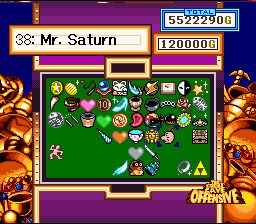
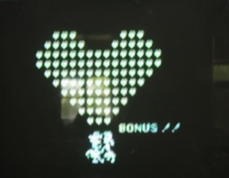
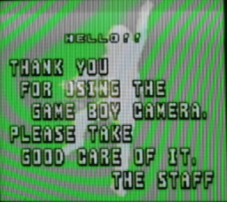
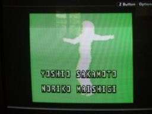
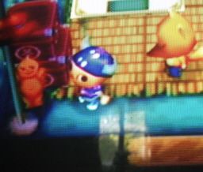


Over time, various games and other things have made references to the Mother series. Conversely, the Mother series has made references to many other things. This page chronicles these interesting tidbits of info. Let us know if you discover any more!

Credit for most if not all of this page goes to Dragonair and Tomato



Those silly people at HAL made a Mr. Saturn the 38th treasure in the minigame "The Great Cave Offensive."
  

  
Also, it is possible that Kirby's Yo-Yo power is a tip of the hat to the yo-yos used as weapons in EarthBound, especially since the hat Kirby wears to represent the power is a duplicate of Ness's.



The makers of the world's wackiest digital camera tunenapped some EarthBound (or arguably Mother 1)music. Over the true credits, you can hear the music played at EB's file select screen. To access the true credits, you must reach the goal in the Run!Run!Run! minigame with a time of under 22 seconds. (This requires mucho button-mashing prowess.) Now, press the START button on the main menu. Select the "credits" planet (where the dancing guy used to be). After watching the little cutscene, the credits start up and you get to hear the superb tune in four-channel glory.
  
<LI><A HREF="eb_gbcamera.mp3">Download the MP3! (1.3 MB)</A></LI>
  




In this game, the Rugby Shirt bears a striking resemblance to the one worn by Ness.
  

  
Also, the character Crazy Redd has a doll in his tent that looks remarkably like the "Doll" enemy in EarthBound Zero.
  


