
This is one of the earliest looks we have of MOTHER 2. It was shortly after this that the game was reprogrammed from scratch with the help of HAL Labs and especially Satoru Iwata. Because this was printed before the game was redone, it's one of our very few glimpses into the game as it looked before it was nearly canceled, <a href="http://youtube.com/watch?v=VLLTijc0sNE">this video</a> being our only other major source for old stuff. What's funny, though, is that this article says the game's release date will be in January 1993 and will be 12 megabits. In actuality, it was almost two years later than that and twice as big.
  
Anyway, some of the main things that stand out in this article are:
<ul>
<li>Ness doesn't have his backpack</li>
<li>The weird-looking bus station, and the layout of the map around it</li>
<li>The bus stop graphic</li>
<li>The outside of Ness' house looks odd, and it shows Ness with King in his yard during the day. The mailbox is also missing</li>
<li>Lots of out-of-place characters in Onett. A trash can is also out of place</li>
<li>Two ladies in the burger shop, both are standing on something</li>
<li>The HP/PP box looks odd</li>
<li>There's a really weird-looking guy in Toto (the area east of Summers)</li>
<li>Some more out-of-place characters and trash can by the Onett drugstore</li>
<li>A weird-looking guy in front of the Chaos Theater. The theater itself also looks odd</li>
<li>An early version of Dalaam. Apparently it was meant to be a snowy place. The palace also looks pretty weird</li>
<li>And probably more stuff</li>
</ul>
Lots of neat stuff, so check it out!
  
<a href="SuperFamicom_005/000.jpg">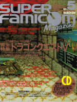</a> 
<a href="SuperFamicom_005/070.jpg">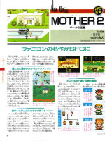</a> 
<a href="SuperFamicom_005/071.jpg">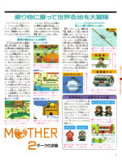</a> 



Just a 2-page preview of some of the wacky characters and enemies players can expect in MOTHER 2. There's a weird screenshot with zombie-filled Threed in the daytime. That same screenshot gets used later on, in the game's official advertising. How odd.
  
<a href="Famitsu_19940429/000.jpg">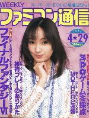</a> 
<a href="Famitsu_19940429/182.jpg">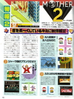</a> 
<a href="Famitsu_19940429/183.jpg">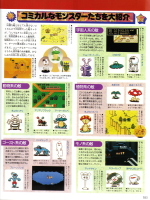</a>



A quick blurb in the rumors section about the game not being delayed anymore, and a two-page preview. The main thing that stands out as being odd in the screenshots is one shot of the Mach Pizza lady delivering a pizza to Ness in front of his house, when he's all alone and still in Onett. Strange. There are other little things out of the ordinary, too.
  
 
<a href="Famitsu_19940603/093.jpg">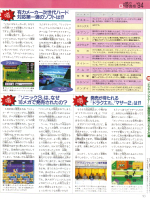</a> 
<a href="Famitsu_19940603/178.jpg">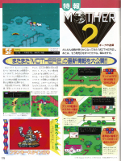</a> 
<a href="Famitsu_19940603/179.jpg">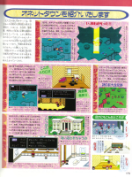</a>




This issue has a very in-depth interview with series creator Shigesato Itoi. We don't have a translation of the interview yet, but right off the bat he answers some big questions we fans have had for years. If only we had found this stuff earlier!
  
Here are the main important things he says in the beginning of the interview.
<ul>
<li>The subtitle of MOTHER 2, "Giegue/Gyiyg/Giygas Strikes Back", is meant to make it obvious what to expect as the final boss of the game.</li>
<li>Giegue/Gyiyg/Giygas didn't die at the end of the first game, and because of the subtitle of this game, it's obvious he's at the end of this game too.</li>
<li>The player names the main character of MOTHER 2, so it's entirely up to the player to decide if he's the same person as MOTHER 1's main character. If you want them to be the same, then they're the same. If you don't want them to be the same, they don't have to. His suggestion seems to be to think of them as the same, though.</li>
</ul>

<a href="Famitsu_19940619/000.jpg">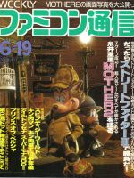</a> 
<a href="Famitsu_19940619/149.jpg">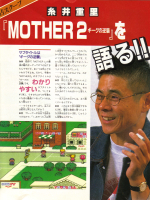</a> 
<a href="Famitsu_19940619/150.jpg">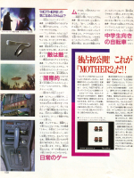</a> 
<a href="Famitsu_19940619/151.jpg">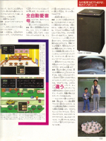</a> 
<a href="Famitsu_19940619/152.jpg">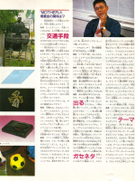</a> 
<a href="Famitsu_19940619/153.jpg">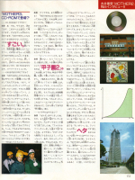</a>



This has a 2-page preview of MOTHER 2, focusing mostly on the Happy Happy Village part of the game. The game's expected release also seems to have been pushed back 2 months.
  
The main strange things that stand out in the screenshots are a present box near the cabin and the fact that Ness got so far into the Happy Happy headquarters without having any of the cultists move aside.
  
<a href="Famitsu_19940624/000.jpg">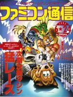</a> 
<a href="Famitsu_19940624/176.jpg">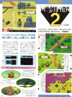</a> 




Just a one-page preview here, mostly focusing on Saturn Valley stuff. The game's release date is now set at a more definite August 27, 1994.
  
<a href="Famitsu_19940715/000.jpg">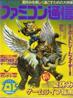</a> 
<a href="Famitsu_19940715/170.jpg">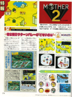</a>



With MOTHER 2's release just around the corner, the game gets mentioned in various parts of the magazine, and a more in-depth walkthrough/preview of the game begins here. At the end of the magazine is a MOTHER 2 ad featuring Takuya Kimura of SMAP.
  
 
<a href="Famitsu_19940729/102.jpg">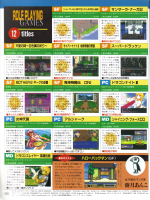</a> 
<a href="Famitsu_19940729/107.jpg">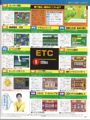</a> 
<a href="Famitsu_19940729/194.jpg">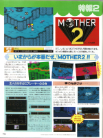</a> 
<a href="Famitsu_19940729/195.jpg">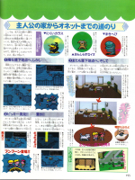</a> 




This issue contains a 3-page walkthrough/preview of MOTHER 2. Nothing seems out of the ordinary. The back cover also has a MOTHER 2 advertisement.
  
<a href="Famitsu_19940805/000.jpg">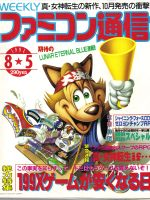</a> 
<a href="Famitsu_19940805/018.jpg">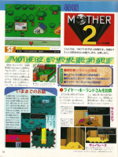</a> 
<a href="Famitsu_19940805/019.jpg">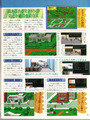</a> 
<a href="Famitsu_19940805/020.jpg">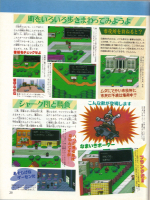</a> 
<a href="Famitsu_19940805/999.jpg">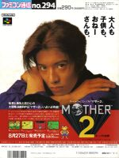</a>



This issue features a much more detailed walkthrough, starting from the very beginning of the game. It even goes so far as to explain what buttons do what. At the end of the magazine is another MOTHER 2 advertisement.
  
<a href="Famitsu_19940812/000.jpg">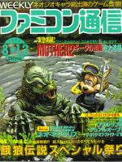</a> 
<a href="Famitsu_19940812/021.jpg">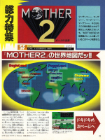</a> 
 
<a href="Famitsu_19940812/023.jpg">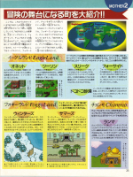</a> 
<a href="Famitsu_19940812/024.jpg">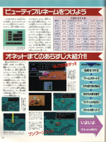</a> 
 
<a href="Famitsu_19940812/026.jpg">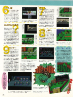</a> 
<a href="Famitsu_19940812/027.jpg">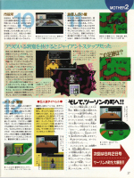</a> 
<a href="Famitsu_19940812/999.jpg">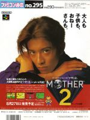</a> 



This issue features some more preview-like content, as well as a page about things in Twoson. There's another MOTHER 2 ad at the end of the magazine, but this one is slightly different from the previous ones.
  
<a href="Famitsu_19940819/000.jpg">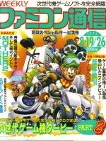</a> 
<a href="Famitsu_19940819/018.jpg">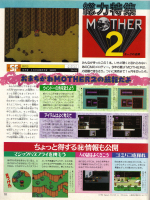</a> 
<a href="Famitsu_19940819/019.jpg">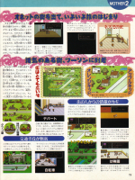</a> 
<a href="Famitsu_19940819/020.jpg">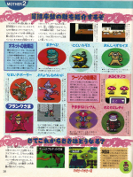</a> 




Now that MOTHER 2 has finally been released, some nice content makes its way into this issue!
  
First up is a 3-page interview with Shigesato Itoi concerning MOTHER 2. There's a lot of interesting info in here. Until we get a translation of it, here are some of the more interesting points:
<ul>
<li>The game took 5 years, way longer than expected, and at many times, Itoi felt like the project was doomed.</li>
<li>Even random kids would bug him and ask him when MOTHER 2 is finally going to come out. That's how long it took, and how anticipated the game was.</li>
<li>MOTHER 1 took 3 megabits of space, and the plan was for MOTHER 2 to be 8 megabits. Then it moved to 12 megabits. Eventually, it was pushed to 24 megabits, which was a huge amount at the time.</li>
<li>One of the toughest things was making the diagonal map stuff work and look nice. It required a LOT of craftsmanship and a lot of time.</li>
<li>The music guys went crazy and made so much music that before long, just the music itself took up 8 megabits of space! Itoi says it would've been about 2 CDs worth of music. But he's really proud of the music, and doesn't want anyone to complain about it now that so much has been put into it.</li>
<li>Itoi refers to the battle backgrounds jokingly as a "video drug". This is noteworthy because the dummied-out Video Relaxant item in EarthBound was originally known as "Video Drug" in MOTHER 2, even though the item was dummied out in that game, too. So apparently that's what "Video Relaxant" refers to: the battle backgrounds.</li>
<li>The battle backgrounds were all made by one guy, who Itoi says was a real background graphics geek. The guy spent two years doing nothing but working on the backgrounds! He says he thinks there are about 200 different ones.</li>
<li>Itoi mentions that after finishing MOTHER 1, he wanted part of MOTHER 2 to be so that you travel between stars/planets, not just between places on one planet. But that would've made the story more cliche-like, he admits. He decided against it after only 3 or 4 months of mulling it over.</li>
<li>His favorite town was Summers for a long while, but now it's Threek/Threed, as it's full of memories.</li>
<li>Itoi doesn't like the idea of having overworld maps with icons for towns. He wanted his games to have no distinction between the towns and the outside world, so he tried hard to make things unique inside each town.</li>
<li>Itoi's original idea for the HP boxes was to have them be like pachinko balls, and each time you get hit, a bunch of the balls drop off the screen. It sounds like they even had that system implemented for a while. But the idea wouldn't work so well when a character gets really high HP, so he eventually hit upon the idea of the rolling counter, like the ones you see in cars. He had decided to use the rolling meter thing 4 years before this interview.</li>
<li>The game is mostly written in kana because that's closest to how people talk.</li>
<li>The bicycle had "tank controls" at first, but Itoi had a hard time controlling it, so they eventually fixed it to have the controls we're used to now.</li>
<li>Itoi asked his staff to come up with MOTHER 2 default names, but in the end, nothing really good was suggested, so he made most of them up himself.</li>
<li>Itoi mentions that the player's name also appears in MOTHER 2, and that it also plays a bigger role in the game than you might think.</li>
<li>Itoi feels that games are straying away from people, particularly girls (hence the game's slogan), so he wanted to try to make a game that would convince them to come back. He doesn't want people to go overboard with games though, so he also hopes kids will go out and experience new things too.</li>
<li>The interviewer asks about MOTHER 3. Itoi says it'll probably take about two years, and that it could possibly be on the next generation system.</li>
<li>Shigeru Miyamoto was very happy with MOTHER 2, and it was the first RPG he ever completed.</li>
<li>Itoi mentions that many of the characters in the game are based on people in real life, though he refused to give any specifics. At the very least, the miners in the desert are based off of some Japanese construction company executives (TOMATO NOTE: I'm guessing these guys accompanied Itoi on his gold mine adventure).</li>
</ul>
After the interview is a four-page walkthrough that picks up from Twoson. Later in the magazine is a 2-page comic featuring Paula and Ness. Paula's a jerk and uses her psychic powers to annoy Ness. At the end of the magazine is another ad for MOTHER 2.
  
<a href="Famitsu_19940902/000.jpg">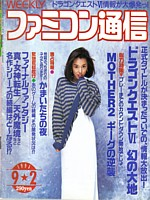</a> 
<a href="Famitsu_19940902/021.jpg">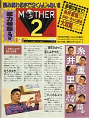</a> 
<a href="Famitsu_19940902/022.jpg">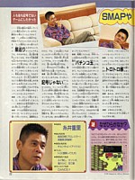</a> 
<a href="Famitsu_19940902/023.jpg">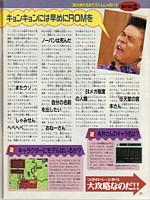</a> 
<a href="Famitsu_19940902/024.jpg">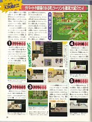</a> 
<a href="Famitsu_19940902/025.jpg">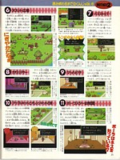</a> 
<a href="Famitsu_19940902/026.jpg">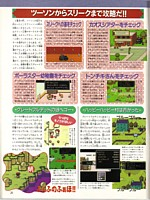</a> 
<a href="Famitsu_19940902/027.jpg">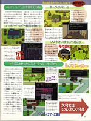</a> 
 
<a href="Famitsu_19940902/071.jpg">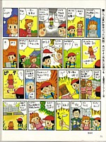</a> 
<a href="Famitsu_19940902/999.jpg">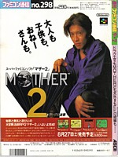</a> 



The highlight here is a two-page interview with APE programmer Kouji Malta and HAL programmer Satoru Iwata, both of whom were the main programmers for MOTHER 2. The main things mentioned in this interview are:
<ul>
<li>APE had more people working on MOTHER 2 than HAL. It sounds like HAL mostly handled the overall programming, while APE handled the data aspect of things, such as working on maps and text.</li>
<li>Every other week, people from APE would go to HAL and do "work retreats" to get lots of work done on the game. It was to the point that the meeting room in HAL's building almost seemed like a branch office of APE. Also, you can see Mt. Fuji from HAL's building, and from that room.</li>
<li>It was nice working in such a pretty environment, though working out there made day-to-day life a little more inconvenient.</li>
<li>Itoi would often go to visit the guys at HAL, and people in restaurants in the area would be shocked to see him nonchalantly dining there with them.</li>
<li>The game had been fully finished four months before the interview. They used that extra time to add in extra little things, such as the slot machine brothers. Everyone on the staff played through the game and suggested little things that would make the game better.</li>
<li>Making the bicycle work was REALLY hard, but they did it anyway. Despite the fact that you barely get a chance to use it in the game. In such situations, most programmers would say, "Forget it!" but Iwata says that the programmers at APE would always answer such big requests with, "We can do that!"</li>
<li>One of the most difficult programming issues was the delivery man system. Malta explains how they needed to have the delivery man find a path to the character, as having the delivery man walk through obstacles wasn't very good. Years later, PK Hackers would be awed by how this works. <a href="http://pkhack.fobby.net/misc/delivery/">See here</a>.</li>
<li>But after the delivery guy delivers the stuff, he runs off at full speed without care for any obstacles. They found that funny.</li>
</ul>
After this, there's a 16-page walkthrough from Onett to Threed. Again, there's a MOTHER 2 ad on the back cover of the magazine.
  
<a href="Famitsu_19940909/000.jpg">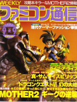</a> 
 
 
 
 
 
 
 
 
 
 
 
 
 
 
 
 
 
 
 




This issue has some interesting stuff. Coolest of all is the one-page article about the MOTHER 2 pre-release party. Everyone involved with the game's production attended. Speeches and jokes were made. Playable versions of the game were on hand for members of the press to try out. Even the clay models were there on display!
  
Elsewhere in this issue was a 7-page walkthrough from Threed to the Dusty Dunes Desert. Later on is a big 2-page advertisement by ASCII saying they're going to be releasing a book in October that will make MOTHER 2 even more enjoyable. There's also a quick mention of MOTHER 1 in a gaming timeline. Later, there's a full-page article about the MOTHER 2 commercials. At the time of the article's writing, only two had been made (or aired), though in the end, three were made. Apparently, Itoi personally wanted Takuya Kimura of SMAP to be the guy advertising MOTHER 2.
  
And again, the back cover of the magazine has a MOTHER 2 ad featuring Kimura.
  
 
 
 
 
 
 
 
 
 
 
 
 
 
 



This apparently was a special mini-guidebook that came as an insert in a magazine. It's not clear what magazine it came from. If anyone knows for sure, let us know!
  
 
 
 
 
 
 
 
 
 
 
 
 
 
 
 
 



In this issue, MOTHER 2 hits the top of the TOP 30 charts, and also gets very high marks by the magazine's reviewers. All four reviewers also recommend this as THE game to get this week. There's also another 2-page ASCII ad, another ASCII preview/ad for some game-related manga stuff that will feature MOTHER 2, another ASCII ad for a mini-magazine that will feature lots of MOTHER 2 stuff, a weird comic involving a girl dressing up as a New Age Retro Hippie, and a page of something called the MOTHER 2 Times, which talks about some mysteries found between theOnett and Twoson parts of the game, such as, "How does the Hint Guy make a living" and "Where the heck is my dad, and what is he doing?"
  
 
 
 
 
 
 
 
 
 
 
 




The MOTHER 2 content in these issues decrease as time goes on. In this issue, we see that MOTHER 2 is #2 in the Weekly Top 30. An article makes a quick mention of MOTHER 2 as an example of a popular RPG. Lastly, there is another edition of the MOTHER 2 Times.
  
 
 
 
 



This issue has some odd content. First is an odd interview/article about how MOTHER 2 surpasses MOTHER 1 in some ways, but is inferior in others. Immediately following it is an article praising MOTHER 2. Later in the magazine is a 2-page comic featuring Ness, Paula, and Jeff as Mr. Saturns. Then there's an ad for the <a href="http://starmen.net/merchandise/guides/treasure.php">MOTHER 2 Treasure Chest of Secrets</a>. This is apparently what the earlier black ASCII ads were talking about. Then there's another edition of the MOTHER 2 Times. Much later is an ad for a game store, where this week's special bargain is MOTHER 2 at about 2/3 the normal price. Lastly, there are two pages of MOTHER 2 tips and tricks.
  
 
 
 
 
 
 
 
 
 
 



This issue has a lot of stuff, surprisingly.
  
First is a full-page interview with MOTHER and MOTHER 2 composer Keiichi Suzuki. These are the main points made in the interview.
<ul>
<li>A MOTHER 2 CD is planned for release in November.</li>
<li>The biggest difference between working on MOTHER 1 and MOTHER 2 was that the Super Famicom gave him much more freedom to make what he wanted. In MOTHER 1, they were limited to three notes at any one time, and he couldn't use the sounds he wanted. With MOTHER 2, he could have 8 notes at any time, and the sound quality was much better. So for MOTHER 2, writing music wasn't much different from how he writes normal music.</li>
<li>He would write music on a synthesizer, then sit down with programmers and work with them until it worked in-game.</li>
<li>Suzuki says he wrote the music that plays when you're walking around. Also, including all the music that was left out of the game, he thinks he composed 100 different music pieces in all for MOTHER 2.</li>
<li>His favorite tune is the bicycle music. He had actually composed it long before MOTHER 2, but it fit so well that he used it.</li>
<li>The key word the musicians used as the theme for their music was "John Lennon", because he sung about love a lot, and that same feeling of love is in MOTHER 2's story.</li>
<li>Aside from the music, Suzuki also offered his suggestions for the game's story, but he doesn't remember what all he said, as the entire game took five years to make. Also, Suzuki's voice is in the game somewhere, and he asks readers to try to find it.</li>
</ul>
Elsewhere in this issue, MOTHER 2 gets a quick reader review. There's also another MOTHER 2 Times, a weird 2-page comic of Police Detective Mr. Saturn, another ad for MOTHER 2 Treasure Chest of Secrets, a 2-page comic that has a Ness cameo, and two pages of more MOTHER 2 tips and tricks.
  
 
 
 
 
 
 
 
 
 
 
 

