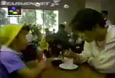
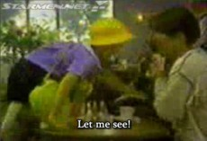
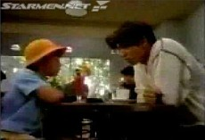
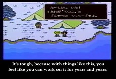
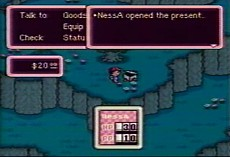
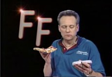
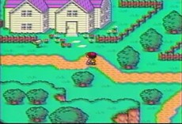
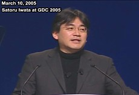
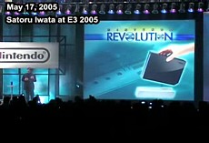


<ul class="pics">
<li>

<h3>MOTHER 2 Commercial #1</h3>

Kimura Takuya of SMAP and some kid named Hiroshi are freaked out when everyone at a coffee shop start chanting, "MOTHER 2! MOTHER 2!"

<a href="http://www.youtube.com/watch?v=ogDi1o2xleU">View streaming video</a> <a href="m2com1_subbed.avi">Download the AVI</a> (3.8 MB, 0:29)

</li>

<li>

<h3>MOTHER 2 Commercial #2</h3>

Hiroshi freaks out when Kimura shows him his copy of MOTHER 2.

<a href="http://www.youtube.com/watch?v=RysaSk6-W_8">View streaming video</a> <a href="m2com2_subbed.avi">Download the AVI</a> (4.2 MB, 0:29)

</li>

<li>

<h3>MOTHER 2 Commercial #3</h3>

Kimura and Hiroshi are scared that everyone around them is talking about MOTHER 2.

<a href="http://www.youtube.com/watch?v=Jteef43NAjw">View streaming video</a> <a href="m2com3_subbed.avi">Download the AVI</a> (5.5 MB, 0:29)

</li>

<li>

<h3>MOTHER 2 Preview (1992)</h3>

EarthBound series creator Shigesato Itoi shows off parts of MOTHER 2 years before it was released. This video is important - <a href="mother2video.txt">read why here</a>. If you're an EarthBound fan, this is a must-see!

<a href="http://www.youtube.com/watch?v=VLLTijc0sNE">View streaming video</a> <a href="m2itoi_ver1.avi">Download the AVI</a> (20.6 MB, 2:32)

</li>

<li>

<h3>EarthBound Promo Video</h3>

Contrary to popular belief, this was <b>not</b> a TV commercial! It was played on special video kiosks that some stores had back in the day. They would play through videos in a set order, but you could press a button to see any video at any time. There were other game promos on these kiosks - and they were likely just as poor in quality.

<a href="http://www.youtube.com/watch?v=AWh3BUyHrLU">View streaming video</a> <a href="earthboundcm.asf">Download the ASF</a> (5.5 MB, 0:45)

</li>

<li>

<h3>EarthBound Video #1</h3>

Rumor has it this video was played on cruise ships. Was it? Who knows. This does seem more like a promotional video than a review, so it could be true. But for now just consider it some weird video.

<a href="http://www.youtube.com/watch?v=lQYsEzSaZkg">View streaming video</a> <a href="ebcruise1.avi">Download the AVI</a> (9.5 MB, 1:52)

</li>

<li>

<h3>EarthBound Video #2</h3>

<b>ENDING SPOILERS!</b>  This is another cruise ship video. But this time, they tell you how to beat the final boss, and then they show the entire credits sequence for some reason. They also make fun of how bad the ending is. OK.

<a href="http://www.youtube.com/watch?v=wZ1-Htk62Ts">View streaming video</a> <a href="ebcruise2.avi">Download the AVI</a> (37.4 MB, 4:56)

</li>

<li>

<h3>Iwata at GDC 2005</h3>

Nintendo president (and main MOTHER 2 programmer) Satoru Iwata gave the keynote address at the 2005 Game Developers Conference. During his speech, he mentions his work on MOTHER 2 and his collaboration with Shigesato Itoi.

<a href="http://www.youtube.com/watch?v=p3UWSm5dKIw">View streaming video</a> <a href="eb_gdc2005.avi">Download the AVI</a> (3.1 MB, 0:31)

</li>

<li>

<h3>Iwata at E3 2005</h3>

Nintendo president Satoru Iwata makes sure to mention EarthBound when he unveils the Virtual Console at E3 2005. You can even hear people in the audience excited at the mention of it. (maybe?) 

<a href="http://www.youtube.com/watch?v=zbvwwlC9BtU">View streaming video</a> <a href="eb_gdc2005.avi">Download the AVI</a> (1.8 MB, 0:19)

</li>

<li>

<h3>EarthBound Coming to the Wii U</h3>

The official EarthBound for Wii U's Virtual Console Announcement. 

<a href="https://www.youtube.com/watch?v=cOZ_U-xUQTo">View streaming video</a> <a href="EarthBound Coming To The Wii U VC.mp4">Download the MP4</a> (9.39MB, 1:10)

</li>

</ul>

