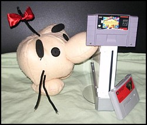


After more than 12 years, EarthBound is given life anew! Huzzah! Thank you, Wii Virtual Console!



Here's how to purchase EarthBound on the Wii Virtual Console.

(list steps) (include video)



Sadly, legal issues arose and a few changes had to be made for this version of EarthBound. Here are the changes that were made:

<ul>
 <li>Zoom butt</li>
 <li>Welcome to roller coaster land</li>
 <li>A cleverly hidden change in the text</li>
</ul>



Nintendo is (or was supposedly planning on) using EarthBound on the Virtual Console as a gauge to see how popular the series is, and how well it can do outside of Japan after all these years. It's common knowledge that the first release on the Super Nintendo didn't do nearly as well as Nintendo had hoped, so this is a very rare second chance we're getting.
  
If the sales of EB on VC don't do really well or don't spike, Nintendo will probably consider the EarthBound series a failure yet again, and all hope for official MOTHER 1 and MOTHER 3 releases will be gone forever. Period.
  
So we can't let that happen! The Smash Bros. series has done a LOT to help spread the word about Ness and EarthBound stuff, but we need to take an active role too. To that end, here's a bunch of stuff you can use/do to spread the word about EarthBound on the Virtual Console.
    
<h2>Help Make EB on the Virtual Console a Success!</h2>
<ul>
<li>Buy EarthBound on the Virtual Console, duh :P</li>
<li>Convince your Wii-owning friends and acquaintances to buy it!</li>
<li>If they can't or don't want to, buy it for them! Give them a Wii points card or use that VC Gift option and say, "Happy early birthday!" or "Happy early Christmas" or whatever! It's not an expensive game, and every extra download helps!</li>
<li>Try to spread the word wherever possible. But NOT to the point of spamming!</li>
<li>We've designed a bunch of posters you can print out and post wherever you want! <a href="http://starmen.net/ebsiege/spreadtheword">Check them out here!</a> Post them at school, game stores (get permission first!), or any public places where you think Wii owners and avid gamers might see them!</li>
<li>We've made lots of banners, forum signature pics, AIM icons, and the like! <a href="http://starmen.net/ebsiege/spreadtheword">Get them here</a> and help get the word out!</li>
<li>And hopefully our friends and contacts at other sites and publications can help us out too? :D</li>
</ul>


