
After finally being able to play MOTHER 3 on the GBA, we noticed that there are many events in the game that appear in screenshots of the canceled MOTHER 3 for the Nintendo 64. This page compares the N64 screenshots to screenshots of the exact same events from MOTHER 3 on GBA.



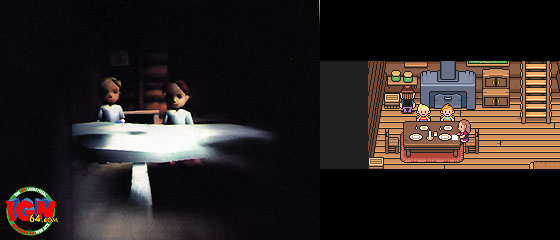 
Lucas and Claus sitting at the dinner table.



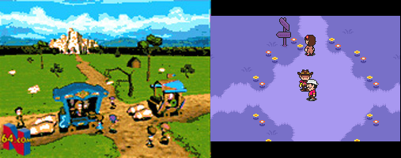 
The village crossroads. You can see Osohe Castle in the background of the N64 pic. The northern path leads to Osohe Castle in GBA MOTHER 3.

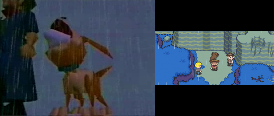 
Boney howling at the cliff.

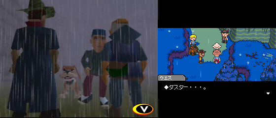 
Wess talking to Duster in the forest while Flint and Boney look on.

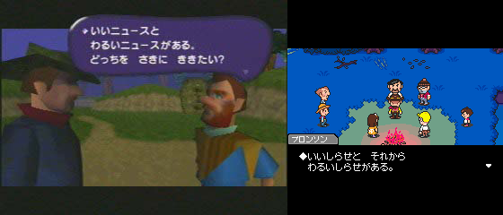 
Flint receiving good and bad news from Bronson.

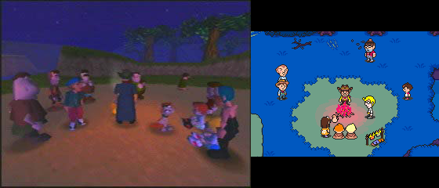 
Flint, Lucas, Claus, Duster, and townspeople around a campfire.

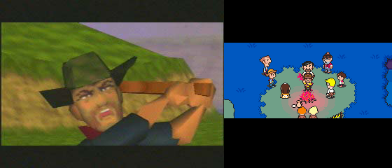 
Flint flying into a rage.

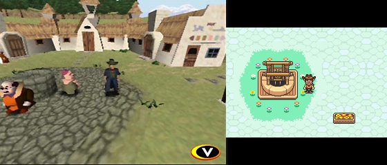 
Flint standing next to the well in the Town Square.

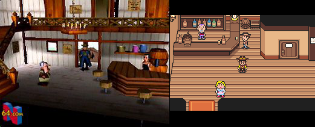 
Flint standing in the inn.

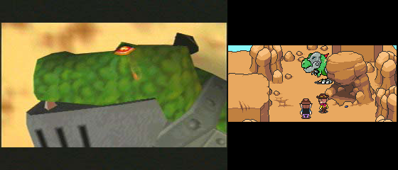 
Mecha-Drago emerging from behind a rock.



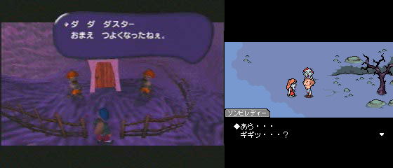 
The zombies talking to Duster in the graveyard.

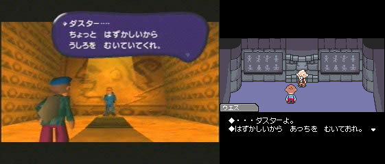 
Wess and Duster in Osohe Castle. Notice that the dialogue is almost exact.

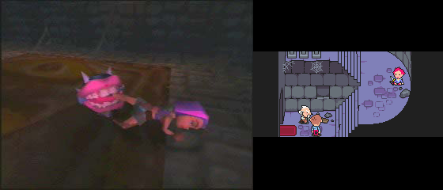 
Kumatora caught in a trap in Osohe Castle.

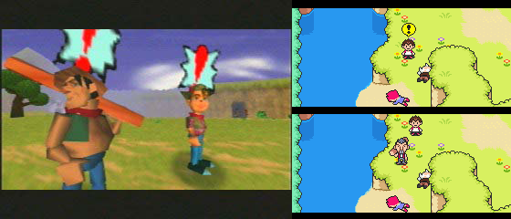 
Lighter and Fuel preparing to rescue Wess and Kumatora. In Mother 3 GBA, Fuel notices them and then runs to get Lighter.



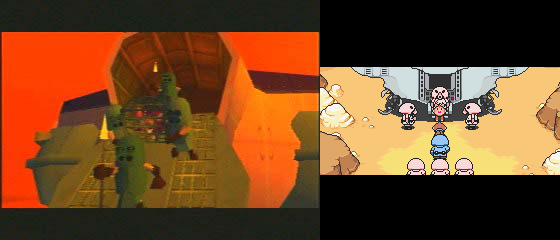 
Salsa and his girlfriend being led out of the Pig Army's ship.

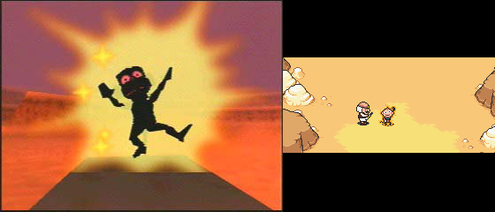 
Yokuba zapping poor Salsa in the desert.

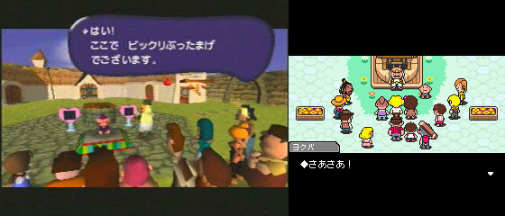 
Yokuba and Salsa convincing a crowd that they need to be "happy."

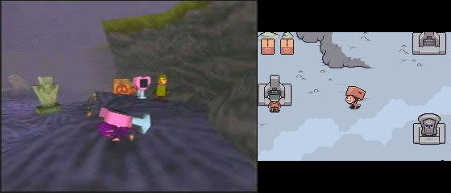 
Salsa carrying the Happiness Boxes out of the graveyard.

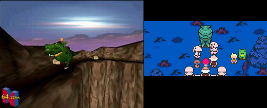 
Lucas with Drago's Kid.



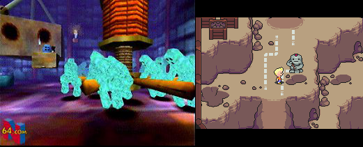 
The clay guys working.

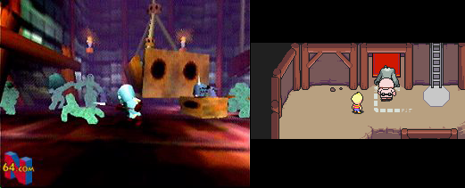 
A tired clay guy being forced away to recharge.

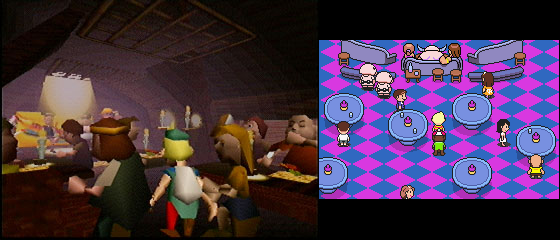 
The lounge area of the Chichiboo Theater.

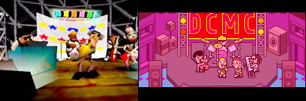 
The DCMC performing.



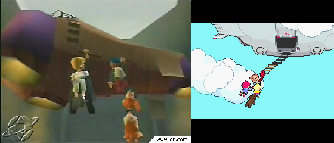 
Lucas, Duster, Kumatora, and Boney escaping on the Pig Army's flying machine. It also looks like Lucas is holding onto Flint in the N64 screenshot and Kumatora appears to be missing.



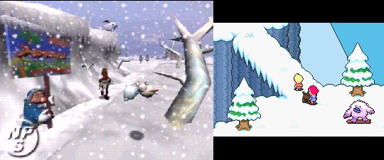 
Lucas, Kumatora, and Boney exploring the snow-capped mountains.



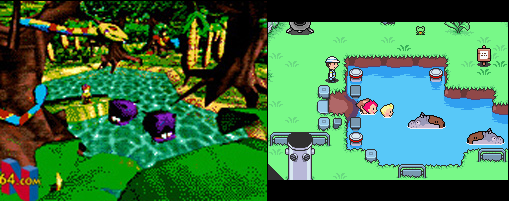 
Lucas and the gang in the jungle room with the hippo monsters.

