
This page is dedicated to the main cast of MOTHER 3. A briefly summary is given of the character's history, though some are a bit more rich than others.

  

Do keep in mind, <b>there are end-game spoilers present on this page</b>, so please be aware before continuing.
  

To find the full chart of the character's PSI info, please take a <a href="http://starmen.net/mother3/game_information/characters/psi.php" >gander here. </a>



<table class="fixed">
    <col width="250px" />
    <col width="1500px" />
  <tr>
    <td>
</td>
    <td>
<b><i>“The younger twin brother. A gentle boy.”</i></b>
  The younger of the twins in Tazmily, Lucas is introduced as a shy, coddled boy in contrast to his brother’s more outgoing nature, having been born and raised in a highly friendly, hospitable and sheltered environment. As a result, he has a reputation for being somewhat soft and prone to crying.
  
Nonetheless, he exhibits real courage throughout the game as he endures the many hardships he encounters -- even the tragedy that strikes his family. He takes up the mantle as the character in the lead starting from Chapter 4, working against the Pigmask army that transforms Tazmily in both appearance and heart.
  
The conflict escalates to one with all of Nowhere Islands and beyond at stake. Along with his friends, he travels all over the islands -- to snowy peaks, across the sea and even into a volcano -- in a desperate race, being one to possess the elusive ability to pull the Needles keeping the Dragon asleep.
  
Although he possesses tremendous PSI potential and can hit hard with his Sticks, Lucas is rarely one to take initiative in battle. Nonetheless, his aptitude in Recovery and Assist PSI makes him an invaluable asset to the team..</td></tr></table>
 

<a href="thumb_lucas1.png" title="Ahh, so peaceful">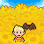</a>
&nbsp; &nbsp;

&nbsp; &nbsp;

&nbsp; &nbsp;




<table class="fixed">
    <col width="250px" />
    <col width="1500px" />
  <tr>
    <td>
</td>
    <td>
<b><i>“The older twin brother. An energetic boy.”</i></b>

  
The older twin brother, Claus is carefree, fun-loving and confident. He seems to have a vivid imagination, and leads one of the more eventful lives in the otherwise peaceful Tazmily. He seems to have a reputation as a troublemaker, not above some mischief  -- but all in good fun, of course.
  
Although Claus is identical to Lucas in face, he is anything but in demeanour. Where Lucas is timid, Claus is brave. Where Lucas is coddled, Claus is independent, even protective. These traits build him up to be a suitable hero for the story of MOTHER 3.
  
His headstrong nature, however, costs him. Following what happened to his mother at the hands of a usually peaceful Drago, Claus sets out to avenge her -- and fails horribly. No one knows what truly happened to him following this incident, and although Flint is convinced that he is still alive, his search for Claus seems futile.
  
Claus, like his brother, possesses the potential for PSI, although the extent of his abilities remains mysterious. He is just as capable at Bashing away, however, and his Bash sounds are similar to those of a sitar -- a detail that should be kept in mind.
</td></tr></table>
 

&nbsp; &nbsp;

&nbsp; &nbsp;

&nbsp; &nbsp;




<table class="fixed">
    <col width="250px" />
    <col width="1500px" />
  <tr>
    <td>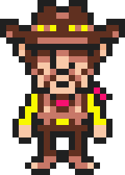
</td>
    <td>
<b><i>“The strong, kind, and dependable father.”</i></b>

  
Father of the twins, Flint is known to be one of the strongest and most reliable men in Tazmily, the very person to go to in moments of crisis. With Tazmily being as peaceful as it is, Flint does not have much to do in that regard, but he is still a helpful, responsible man who loves his family dearly.
  
Beginning with the mysterious fire in the Sunshine Forest, however, he suddenly finds himself in the thick of the situation, in a conflict with mysterious pig-masked people. As the events go downhill, he is left mourning his wife, and then locked into a race against time for the sake of his son.
  
The tragedies leave him broken in some regard, and he seems to drift away from Lucas over time. He, however, remains a pillar of strength of will as much as body, and refuses to believe that Claus is truly gone. He spends his days looking for his missing son, yielding to no one.
  
Flint, unlike his sons, does not wield PSI, but makes up for it with his Brute Force. Capable of boosting his stats as well as landing a particularly devastating blow, Flint is not fussy about his weapon as long as he has something to swing around.
</td></tr></table>
 

&nbsp; &nbsp;

&nbsp; &nbsp;

&nbsp; &nbsp;




<table class="fixed">
    <col width="250px" />
    <col width="1500px" />
  <tr>
    <td>
</td>
    <td>
<b><i>“The brave and smart dog.”</i></b>

  
Boney is a dog, but is considered no less than a member of the family, with his own little house right next to Flint and Hinawa’s. Boney is calm and docile, but this does not keep him from lending a paw to those in need -- throughout the game, he displays a surprising degree of perceptiveness.
  
Boney’s loyalty is what truly makes him stand out, not hesitating to follow Flint and Lucas into the most dangerous of situations. Indeed, Boney accompanies Lucas into nearly every battle in the game, staying by his side through both despair and action.
  
Boney wears his dog collars with pride, even into the heat of battle, and makes up for his lack of raw strength with his incredible swiftness and agility. His powerful sense of smell not only helps pinpoint people and things over the course of the game, but also serves to identify the nature and weaknesses of an enemy in battle.
</td></tr></table>
 

<a href="thumb_boney1.png" title="You got a little something..right there..">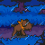</a>
&nbsp; &nbsp;

&nbsp; &nbsp;




<table class="fixed">
    <col width="250px" />
    <col width="1500px" />
  <tr>
    <td>
</td>
    <td>
<b><i>“A strange but nice guy with unexpected skills.”</i></b>

  
Duster seems to be training under his father to be a thief... in a village that has no crime. This appears to have resulted in him becoming a quiet night owl, rendered somewhat obscure compared to his father’s more outspoken nature, but he remains a reliable person who will do all he can to not only help others, but also meet his father’s high expectations.
  
His trains with the understanding that being a thief is a matter of huge responsibility in Tazmily, and with a father as strict as Wess, he does not have any room for holding back. This burden is compounded by the fact that Duster has a slight leg handicap -- not that this keeps him from striking with kicks in battle.
  
Duster, owing to amnesia, ends up separated from his father for three years, over the span of which he displays a surprising degree of talent with the bass, and comes to be known as Lucky of the DCMC. It pains him to leave his bandmates behind when the time comes, but he goes on to become one of Lucas’s closest friends and allies.
  
Duster takes a unique, even artistic approach to battle, utilizing the Thief Tricks he has been trained in, as well as, if given the opportunity, being able to secure positional advantages for the team. The Mystical Thief Tools allow him to do anything from blinding and distracting enemies to putting them to sleep.
</td></tr></table>
 

&nbsp; &nbsp;

&nbsp; &nbsp;

&nbsp; &nbsp;

<a href="thumb_duster4.png" title="Rest in Peace">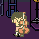</a>




<table class="fixed">
    <col width="250px" />
    <col width="1500px" />
  <tr>
    <td>
</td>
    <td>
<b><i>“A strong, wise, and rather masculine girl.”</i></b>

  
Kumatora fits her name -- which means “bear-tiger” -- to a T. Although referred to as the “Princess” of Osohe Castle, she is unafraid to take risks, eager to take the initiative, and can possess a sharp tongue at times. 
  
Kumatora, as an orphan, was raised by the Magypsies, with them as her only family. Although the mysterious and self-sustained nature of the Magypsies has left her secluded from most of society, having little more than ghosts and spiders for company in the castle, their kindness and confidence in themselves has rubbed off on her. This, perhaps, is what prompts her to empathize with and rescue Salsa.
  
Although she is usually very outspoken, her control over her emotions is exhibited in her taking up the job of a waitress in an attempt to locate the Egg of Light despite her strong disdain towards doing so. It is to the point that Kumatora actively aids Lucas during the race for the Seven Needles, even at the loss of her adoptive family.
  
Fittingly for one raised by the Magypsies, Kumatora’s PSI is exceptionally potent, with power over fire, ice, lightning and even the ground itself. Although she possesses some Recovery PSI, her true strength lies in PSI of the destructive and debilitating nature. She does not shy away from the physical side, either -- she can pack a literal punch.
</td></tr></table>
 

<a href="thumb_humatora1.png" title="You got a little something..right there..">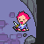</a>
&nbsp; &nbsp;

&nbsp; &nbsp;

&nbsp; &nbsp;




<table class="fixed">
    <col width="250px" />
    <col width="1500px" />
  <tr>
    <td>
</td>
    <td>
<b><i>“A monkey who will endure anything for his girlfriend.”</i></b>

  
Salsa is a monkey captured by the Pigmasks and separated from his girlfriend, with the understanding that any disobedience would put not only him, but also his “love-monkey”, at risk. This, combined with his docile nature, causes Salsa to work with the Pigmasks upon his introduction.
  
Salsa is a unique character in many aspects. Not only is he one of the only two non-human playable party members in the series, he provides an insight to the other side of the story, unwillingly being on the Pigmasks’ side at first. And in an ironic twist, the fact that he is not very powerful means that he has to rely on Fassad, a high-ranking Pigmask Army official, for getting through battles.
  
He exhibits immense fortitude, however, enduring repeated abuse for the sake of his girlfriend. The turning point comes when Kumatora, Wess and Lucas, rescue him, and, following a brief struggle, he manages to go free. He eventually reunites with his girlfriend, but is not one to forget his gratitude; he intervenes at a crucial moment to save Lucas and his party from certain doom.
  
What Salsa lacks in offensive power, he makes up for with his Monkey Tricks, serving to distract or deter foes from attacking. In addition, Salsa exhibits an impressive degree of intelligence, capable of mimicking and countering  any attack.
</td></tr></table>
 

&nbsp; &nbsp;

<a href="thumb_salsa2.png" title="Delivery!">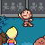</a>
&nbsp; &nbsp;

&nbsp; &nbsp;




<table class="fixed">
    <col width="250px" />
    <col width="1500px" />
  <tr>
    <td>
</td>
    <td>
<b><i>“The beloved mother!”</i></b>

  
Hinawa is the wife of Flint, and the mother of the twins Lucas and Claus. Loved by not only her family, but all of Tazmily, she is known to have a good head on her shoulders. She is firm with her children, but no less caring for that, doing all she can to keep them safe and happy.
  
With her gift of Tazmily gerberas towards the town’s decoration, Hinawa is not far from the conscience of the town. She was originally introduced to Flint by her good friend Lisa, and the two have since then “loved each other so much even the little birds in the forest were jealous”.
  
It all changes when she, along with her children, is attacked by an usually peaceful Drago, and she ends up losing her life trying to ensure that her sons get away. The loss is mourned by all of Tazmily, perhaps the first step towards its transformation from the idealistic society that it initially is. 
  
Nippolyte digs a very fine grave for her -- right next to a patch of sunflowers, her favourite. Hinawa might be gone, but her love for her family is such that even the grave might not stand between them…
</td></tr></table>
 

&nbsp; &nbsp;

&nbsp; &nbsp;




<table class="fixed">
    <col width="250px" />
    <col width="1500px" />
  <tr>
    <td>
</td>
    <td>
<b>Alec</b>

  
Alec, Hinawa’s father, maintains an optimistic point of view even at this age. He can make the best of even the most serious situations -- a lesson that the protagonists would do well to heed considering the events of the game.
  
The game begins at Alec’s home on Mt. Oriander, with Hinawa and her sons having come to visit. A happy reunion turns into a tragedy upon Hinawa’s passing, however, and he joins Flint in the desperate search for Claus. 
  
Usually isolated from the rest of the people, Alec is shown to be familiar with animals -- even those as small as frogs -- and even the Magypsies, a small group of strange but good-natured individuals. 
</td></tr></table>

 

 

<table class="fixed">
    <col width="250px" />
    <col width="1500px" />

<tr>
    <td>
</td>
    <td>
<b>Wess</b>

  
Wess is Duster’s father and teacher in the Thief Arts. He is extremely strict, and would accept nothing but the best from his son. This, however, is not without purpose -- he has been entrusted the great responsibility of guarding the Egg of Light, a burden that he wants to prepare his son for. Underneath, he does care for his son. 
  
Although he is a senior citizen, Wess is genuinely capable of backing up his words. Even at this age, Wess is a master thief, and can hold his own in battle, skilled in the utilisation of both Thunder Bombs and Duster’s socks as ammunition. He joins his son in the effort to reach the Egg of Light in time, and continues to oppose the Pigmasks throughout the game.
</td></tr></table>

 

 

<table class="fixed">
    <col width="250px" />
    <col width="1500px" />

<tr>
    <td>
</td>
    <td>
<b>Lighter</b>

  
Living a ways into the Sunshine Forest, Lighter is a man of more actions than words. Lighter has apparently been a friend of Flint’s since they were children, the two of them sharing a friendly rivalry. Naturally, then, Lighter is one of the most resilient inhabitants of Tazmily, trying to single-handedly deal with the strange fireflies causing the forest fire, and later being one of the few to refuse to get a Happy Box despite the consequences of not doing so. 

</td></tr></table>

 

 

<table class="fixed">
    <col width="250px" />
    <col width="1500px" />

<tr>
    <td>
</td>
    <td>
<b>Fuel</b>

  
Fuel is Lighter’s son, and seems to be well-acquainted with Lucas and Claus, as their fathers had been. Fuel nearly ends up trapped in a burning house near the start of the game -- if not for Flint’s intervention -- but remains optimistic to the end, even after people begin to leave Tazmily for the big city. Fuel is always happy to lend a hand, and eventually starts working part-time at Caroline’s Bakery. 

</td></tr></table>

 

 

<table class="fixed">
    <col width="250px" />
    <col width="1500px" />

<tr>
    <td>
</td>
    <td>
<b>Bronson</b>

  
Bronson is the resident blacksmith of Tazmily, and has the build to match. Only a short way into the game, however, he receives a burden too difficult to carry: that of delivering the news of Hinawa’s passing to Flint and the other people of Tazmily. He, in addition, gives the Drago Fang to Flint, pointing out that no other weapon can harm a Drago. 
  
Bronson is a man who balances hard-work and relaxation. Although he, like most, initially endorses the changes brought about by the Pigmasks, he returns to support the protagonists near the end. 

</td></tr>
</table>

 

 

<table class="fixed">
    <col width="250px" />
    <col width="1500px" />

<tr>
    <td>
</td>
    <td>
<b>Nippolyte</b>

  
Nippolyte is the grave-keeper of Tazmily, watching over the Sunset Cemetery. Naturally, he has the responsibility of digging new graves as needed, a duty he fulfills handsomely upon Hinawa’s passing. Less known is the fact that his house conceals a tunnel leading within Osohe Castle’s walls, and that he tends to a pair of vegetable patches there. 
  
Nippolyte seems to be knowledgeable about Osohe’s lore, but maintains a humble profile, being one of the few people of Tazmily to not welcome the Happy Boxes. Used to Flint’s daily visits to Hinawa’s graves, he passes on Flint’s Courage Badge to Lucas -- an act, that, while simple in its execution, has lasting effects. 

</td></tr>
</table>

 

 

<table class="fixed">
    <col width="250px" />
    <col width="1500px" />

<tr>
    <td>
</td>
    <td>
<b>Abbot & Abbey</b>

  
Abbot and Abbey are the image of a happy couple, their relationship full of love and respect, fitting for a village as friendly as Tazmily. Throughout the game, all the way to the end, the two are happy and together.
  
Although the two simply house potted plants at the beginning of the game, these are eventually, for the most part, replaced by a wide variety of Happy products -- such as the Happy Cooling Box and the Happy Teddy Bear, with a Happy Massage Chair in consideration. Indeed, the two are among the first to endorse the Happy Boxes marketed by Fassad, and grow to be among the largest consumers.

</td></tr>
</table>

 

 

<table class="fixed">
    <col width="250px" />
    <col width="1500px" />

<tr>
    <td>
</td>
    <td>
<b>Angie</b>

  
Abbot and Abbey are the image of a happy couple, their relationship full of love and respect, fitting for a village as friendly as Tazmily. Throughout the game, all the way to the end, the two are happy and together.
  
Although the two simply house potted plants at the beginning of the game, these are eventually, for the most part, replaced by a wide variety of Happy products -- such as the Happy Cooling Box and the Happy Teddy Bear, with a Happy Massage Chair in consideration. Indeed, the two are among the first to endorse the Happy Boxes marketed by Fassad, and grow to be among the largest consumers.

</td></tr>
</table>

 

 

<table class="fixed">
    <col width="250px" />
    <col width="1500px" />

<tr>
    <td>
</td>
    <td>
<b>Bateau</b>

  
Bateau is a quiet young man living near the Cerulean Beach. He exhibits some interest in wood carving, but is best known for the fact that he runs Tazmily’s postal service, initially using pigeons to send messages. He welcomes Tazmily’s transformation, however, comparing sending letters through pigeons to his newfound ease of work.

</td></tr>
</table>

 

 

<table class="fixed">
    <col width="250px" />
    <col width="1500px" />

<tr>
    <td>
</td>
    <td>
<b>Betsy</b>

  
Betsy, along with her husband Jackie, runs Tazmily’s Yado Inn, and is distinctly more outspoken than her husband is. She is naturally hospitable, welcoming anyone in need of a place to stay free of cost. Due to running the Inn, however, she is among the first in Tazmily to be introduced to money, and although the effect is unnoticeable at first, the Yado Inn eventually evolves into the luxurious Hotel Yado.

</td></tr>
</table>

 

 

<table class="fixed">
    <col width="250px" />
    <col width="1500px" />

<tr>
    <td>
</td>
    <td>
<b>Biff</b>

  
Biff, Butch’s brother, unwittingly takes one of the first steps towards the transformation of Tazmily at the hands of the Pigmasks, by taking up Fassad’s offer on the Happy Boxes. Not that he is complaining --  he takes up a job at the factory for free tickets to Club Titiboo.

</td></tr>
</table>

 

 

<table class="fixed">
    <col width="250px" />
    <col width="1500px" />

<tr>
    <td>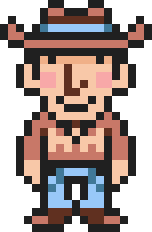
</td>
    <td>
<b>Bob</b>

  
Bob’s expression gives it all away -- he is very relaxed and straightforward, enjoying spending time in the Yado Inn and admitting that he likes to “play the fool” from time to time. This simplistic nature is, to some extent, in contrast to his wife Dona, who is more flamboyant, and is described by him as “a sucker for art”.

</td></tr>
</table>

 

 

<table class="fixed">
    <col width="250px" />
    <col width="1500px" />

<tr>
    <td>
</td>
    <td>
<b>Brenda</b>

  
Jonel’s wife, Brenda can usually be found gossiping with her friends near the centre of the town. She is generally very cheerful, admitting herself that she is not used to gloomy situations, and that she does not know how to react to Hinawa’s passing. Following Tazmily’s transformation, however, she seems to grow more insensitive, openly criticizing Lucas and Flint.

</td></tr>
</table>

 

 

<table class="fixed">
    <col width="250px" />
    <col width="1500px" />

<tr>
    <td>
</td>
    <td>
<b>Bud & Lou</b>

  
Bud and Lou are true companions, never leaving each other’s side, and united by a common passion for comedy. They can be observed practicing their comedy routines in all situations, even serving as a ray of sunshine in times of sadness. These routines generally involve Lou trying to correct Bud’s misconceptions.
  
It is jarring, then, that the two stop practicing their jokes after Tazmily’s transformation, absorbed into factory work like so many others. And it is just as heartwarming when they eventually resume their comedy routines.

</td></tr>
</table>

 

 

<table class="fixed">
    <col width="250px" />
    <col width="1500px" />

<tr>
    <td>
</td>
    <td>
<b>Butch</b>

  
Butch, brother of Biff, takes care of livestock on the patch of open land next to his home. He is characterized by curiosity, even to the point of trying to look at the forest fire. Because of this,by selling his pigs to a stranger despite no concept of currency in Tazmily, Butch becomes the first to be introduced to money -- and he places genuine, then-arbitrary value on it, even accusing Duster of stealing it.

</td>
</tr>
</table>

 

 

<table class="fixed">
    <col width="250px" />
    <col width="1500px" />

<tr>
    <td>
</td>
    <td>
<b>Caroline</b>

  
Caroline, mother of Angie, runs the local bakery at Tazmily, serving everything from nut to egg products. She is initially happy to hand her cooking to anyone who wants, but the developments in Tazmily turn her skill into a source of income. Nonetheless, she retains her pleasant demeanor throughout the story, starting from trying to cheer Flint up with some of the Nut Bread Hinawa and she used to love cooking.
</td>
</tr>
</table>

 

 

<table class="fixed">
    <col width="250px" />
    <col width="1500px" />

<tr>
    <td>
</td>
    <td>
<b>Dona</b>

  
Dona is Bob’s wife, but is distinctly more exuberant in her tastes. She is open to trying new means of recreation, such as swimming and Club Titiboo. In the same vein, she is very fascinated with art, prone to being caught up studying the tiny details -- much to the chagrin of her husband.
</td>
</tr>
</table>

 

 

<table class="fixed">
    <col width="250px" />
    <col width="1500px" />

<tr>
    <td>
</td>
    <td>
<b>Ed</b>

  
Ed’s attire gives the impression of someone responsible, and he may well fit the description. Father of Alle and husband of Nan, Ed is rational and observant, keeping Butch and Ollie from entering Sunshine Forest during the fire at their own risk, and keeping a watch over his home after Scamp passes away.
</td>
</tr>
</table>

 

 

<table class="fixed">
    <col width="250px" />
    <col width="1500px" />

<tr>
    <td>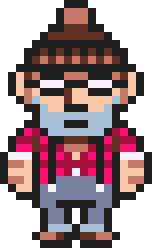
</td>
    <td>
<b>Isaac</b>

  
With Tazmily being as close-knitted as it is initially, Isaac is among the closest to an outlier, preferring to live near the forest. It cannot be denied that he is a resourceful man, always stocked up on Antidotes and medicinal resources, but he only drifts farther and farther away as time passes. He is highly supportive of Fassad, being one of the first to get a Happy Box, and later going on to become a Pigmask. He expresses that he would have no qualms attacking Lucas if he needed to do so as a Pigmask.
</td>
</tr>
</table>

 

 

<table class="fixed">
    <col width="250px" />
    <col width="1500px" />

<tr>
    <td>
</td>
    <td>
<b>Jackie</b>

  
Jackie starts off far from brave, doing little in times of crisis, but is still a hospitable person as the owner of the Yado Inn. It is the transformation of Tazmily that changes him to a very money-minded individual, carefully considering the financial effects of him moving the hotel the big city. He becomes so bent on maintaining the reputation of Hotel Yado that he outright asks Lucas and Duster not to visit anymore.

</td>
</tr>
</table>

 

 

<table class="fixed">
    <col width="250px" />
    <col width="1500px" />

<tr>
    <td>
</td>
    <td>
<b>Jill</b>

  
Wife of Matt and mother of Biff and Butch, Jill might have an unfortunately familiar appearance, and might be commonly seen gossiping with Lisa and Brenda, but these traits do not define her. She is much gentler a person than they imply, greatly saddened by Hinawa’s passing, and baking Nut Cookies in an attempt to cheer everyone up. She seems to be supportive of Fassad, but is seldom, if ever, antagonistic to others.
</td>
</tr>
</table>

 

 

<table class="fixed">
    <col width="250px" />
    <col width="1500px" />

<tr>
    <td>
</td>
    <td>
<b>Jonel</b>

  
Jonel is the husband of Brenda, and is a stickler for tradition, insisting that Flint pray at the Forest Prayer Sanctuary before heading into Sunshine Forest to help with the fire. Although he initially seems to be vaguely poetic, pointing out that having good friends is cause to be happy, he appears to become increasingly self-centered as time passes, suggesting himself that others pay more attention to him.
</td>
</tr>
</table>

 

 

<table class="fixed">
    <col width="250px" />
    <col width="1500px" />

<tr>
    <td>
</td>
    <td>
<b>Lisa</b>

  
Lisa, wife of Thomas, seems to be very familiar with the people of Tazmily even for how close-knit a community it is at the beginning, and her tendency to gossip keeps her up-to-date on news. A close friend of Hinawa’s, Lisa is the one who introduced Flint to her. Although she is not afraid to voice her opinion of others, she generally gives some advice as opposed to solely providing criticism.
</td>
</tr>
</table>

 

 

<table class="fixed">
    <col width="250px" />
    <col width="1500px" />

<tr>
    <td>
</td>
    <td>
<b>Mapson</b>

  
It is in the name -- Mapson, as he acknowledges, is exceedingly map-loving and map-owning. He is clearly very familiar with the geography of Tazmily and the surrounding areas, always willing to help out with locations. He is one of the most consistent characters in this regard, although he is capable of holding a conversation about matters unrelated to maps.
</td>
</tr>
</table>

 

 

<table class="fixed">
    <col width="250px" />
    <col width="1500px" />

<tr>
    <td>
</td>
    <td>
<b>Matt</b>

  
Matt seems to be prone to addictive tendencies, being glued to his Happy Box and having the reputation of drinking often -- at Hinawa’s funeral, he can be observed to be trying to drown his sorrows. He, however, is offended by the assertion and dismisses it as a rumour, claiming that he simply has a lot of hiccups.
</td>
</tr>
</table>

 

 

<table class="fixed">
    <col width="250px" />
    <col width="1500px" />

<tr>
    <td>
</td>
    <td>
<b>Mike</b>

  
Mike thinks rather highly of himself, and is proud of the Nut Cookies he bakes despite admitting that they are “slightly unclean” and “not-very-tasty”. He initially helps out at Thomas’s Bazaar from time to time, but as a senior citizen, he moves into the Old Man’s Paradise upon its construction. He seems to be unsatisfied that his grandchildren Nichol and Richie do not visit him often, and therefore appreciates any who do.
</td>
</tr>
</table>

 

 

<table class="fixed">
    <col width="250px" />
    <col width="1500px" />

<tr>
    <td>
</td>
    <td>
<b>Nan</b>

  
Wife of Ed and mother of Alle, Nan is a kind woman, and optimistically advises Flint to keep faith during the search for Hinawa and the twins. She helps out at the Old Man’s Paradise despite being aware of the low budget invested into it and having to work in less-than-ideal conditions.
</td>
</tr>
</table>

 

 

<table class="fixed">
    <col width="250px" />
    <col width="1500px" />

<tr>
    <td>
</td>
    <td>
<b>Nana</b>

  
Nana is known for being very talkative, and, in result, is largely disliked by the other children -- both being facts that she acknowledges and warns Lucas about. If someone were to give her their time of the day, however, she can turn out to be very observant and contemplative, not only discussing seemingly tiny matters at length, but pointing out subtle details that no one else seems to notice.
</td>
</tr>
</table>

 

 

<table class="fixed">
    <col width="250px" />
    <col width="1500px" />

<tr>
    <td>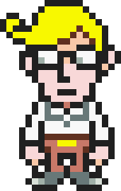
</td>
    <td>
<b>Ollie</b>

  
As the son of Mayor Pusher, Ollie lives in the lap of luxury compared to most others in Tazmily, but this somewhat sheltered life seems to have left him shy and reserved. Despite this, he attempts to reach out to Flint during the latter’s rage, if to little success. He does not seem to hold any grudges towards Flint for the incident, either. His mother has the faith that he will go on to become an important person.

</td>
</tr>
</table>

 

 

<table class="fixed">
    <col width="250px" />
    <col width="1500px" />

<tr>
    <td>
</td>
    <td>
<b>Elmore</b>

  
For a village as peaceful as Tazmily, Elmore has the sharpest tongue. Being the wife of Mayor Pusher grants her luxury and security, which she utilizes to harshly criticize the protagonists under the guise of being more refined. This behavior only escalates as the Pigmasks develop Tazmily over the span of three years, with Elmore outright stating that she hates Lucas’s family. Her demeanor towards her own is very different, however, with her proving to be a doting mother.
</td>
</tr>
</table>

 

 

<table class="fixed">
    <col width="250px" />
    <col width="1500px" />

<tr>
    <td>
</td>
    <td>
<b>Pusher</b>

  
Pusher is the mayor of Tazmily, although, given the lack of money and the fact that everyone shared with each other, the title initially did not hold much water. Upon Tazmily’s transformation, however, this seems to be played straight, his privileges as the mayor showing in his exuberant home and cars. However, he seems much more concerned about his power and property than being of any help, in the administrative sense or otherwise.
</td>
</tr>
</table>

 

 

<table class="fixed">
    <col width="250px" />
    <col width="1500px" />

<tr>
    <td>
</td>
    <td>
<b>Reggie</b>

  
Reggie lives alone in a tepee, and does not seem to interact much with the others. When this quiet man does speak up, however, he proves himself to be optimistic and calm even in the most tense of situations. His words may be few, but they are poignant and meaningful. Entering his tepee reveals more about his personal interests, his home containing artistic creations the kind of which is found nowhere else in Tazmily.

</td>
</tr>
</table>

 

 

<table class="fixed">
    <col width="250px" />
    <col width="1500px" />

<tr>
    <td>
</td>
    <td>
<b>Richie</b>

  
Richie is the daughter of Thomas and Lisa, Although she can usually be found near her home, often interacting with her brother Nichol, she seems to have a desire to explore, expressing that she wants to go to Club Titiboo, and even asking Lucas whether she could come with him. The latter seems to fade out in favour of going to the big city, however.

</td>
</tr>
</table>

 

 

<table class="fixed">
    <col width="250px" />
    <col width="1500px" />

<tr>
    <td>
</td>
    <td>
<b>Nichol</b>

  
Nichol is Thomas and Lisa’s son, and brother of Richie. His attire makes him look smart and mature, and indeed, he does help out at his father’s shop in his stead from time to time. However, even he is prone to moments of childishness, such as mixing up his words or loudly exclaiming how lucky Lucas is to be able to go to Club Titiboo.

</td>
</tr>
</table>

 

 

<table class="fixed">
    <col width="250px" />
    <col width="1500px" />

<tr>
    <td>
</td>
    <td>
<b>Thomas</b>

  
Thomas, husband of Lisa, is quick to alert the rest of the village of problems, coming to Flint at the beginning of the game to ask for help with the fire. He runs the local bazaar at Tazmily, housing all kinds of wares that he is happy to let anyone in need take. Over time, however, his shop becomes more organized, now demanding money and importing high-quality goods from the big city.
</td>
</tr>
</table>

 

 

<table class="fixed">
    <col width="250px" />
    <col width="1500px" />

<tr>
    <td>
</td>
    <td>
<b>Paul</b>

  
Paul, wrapped up in a scarf, states himself to be oversensitive to stimuli such as smoke or cold. He seems to not be very outgoing, commenting that his wife’s desire to visit the amusement park in New Pork City is childish. All the same, it is clear that he loves her, initially refusing a Happy Box on the grounds that his wife Linda is all the happiness he needs.
</td>
</tr>
</table>

 

 

<table class="fixed">
    <col width="250px" />
    <col width="1500px" />

<tr>
    <td>
</td>
    <td>
<b>Linda</b>

  
Linda, wife of Paul, is a kind woman who seems to have been a friend of Hinawa’s. She eventually starts working in the Old Man’s Paradise despite the rate at which volunteers leave, and the unfavourable conditions. Despite this dutifulness, she is fun-loving, her husband describing her as a “kid at heart”.
</td>
</tr>
</table>

 

 

<table class="fixed">
    <col width="250px" />
    <col width="1500px" />

<tr>
    <td>
</td>
    <td>
<b>Scamp</b>

  
Scamp is one of the eldest people in Tazmily, and is bedridden, but his pet parrot, Myrna, and teddy bear, Mr. Beary, keep him company. He is surprisingly well-informed despite his condition, sensing something bad coming to Tazmily. However, he does not live to witness the extent of his accuracy, passing away in the time the Pigmasks transform Tazmily.
</td>
</tr>
</table>

 

 

<table class="fixed">
    <col width="250px" />
    <col width="1500px" />

<tr>
    <td>
</td>
    <td>
<b>Alle</b>

  
Daughter of Ed and Nan, Alle is one of the youngest citizens of Tazmily. It is understandable, then, that she is marked by a keen sense of curiousity, often asking questions or trying to learn about the latest news. This results in her knowing a surprising deal despite her young age.
</td>
</tr>
</table>

 

 

<table class="fixed">
    <col width="250px" />
    <col width="1500px" />

<tr>
    <td>
</td>
    <td>
<b>Tessie</b>

  
Tessie, as someone who works at the Yado Inn, is familiar with taking care of people. She exhibits some medical skill, patching up Flint after he goes through the forest fire to rescue Fuel, and tending to Lighter’s injuries. Tessie invites Lucas to come to New Pork City with them, but later questions whether it truly is what big city life is supposed to feel like.
</td>
</tr>
</table>

 

 

<table class="fixed">
    <col width="250px" />
    <col width="1500px" />

<tr>
    <td>
</td>
    <td>
<b>Sebastian</b>

  
Sebastian works at a prestigious position -- for Mayor Pusher himself. However, as a result, he is busy at all times, to the exclusion of almost everything else, even before Tazmily’s transformation. It is to the point that he himself acknowledges that being the image of a busy person is the extent of his relevance to the story.
</td>
</tr>
</table>

 

 

<table class="fixed">
    <col width="250px" />
    <col width="1500px" />

<tr>
    <td>
</td>
    <td>
<b>Leder</b>

  
Leder is introduced as a character who never speaks -- and is perhaps even mute -- but evokes the curiosity of many. He is notable due to his incredible height, making him perfect for ringing the bell to remind or alert the people of Tazmily.
  

In truth, as is revealed late into the game, Leder knows much more than he lets on. He is not unable to speak -- he simply chooses not to, carrying the burden of the dark secret behind the idealistic society Tazmily was supposed to be. Secrets that were only to be divulged if all other options were exhausted.
  

When the time comes, Leder informs the protagonists of things they probably did not want to know, but have to. As their “leader”, his one and only order is for Lucas to be the one to pass on his heart to the Dark Dragon.
</td>
</tr>
</table>




<table class="fixed">
    <col width="250px" />
    <col width="1500px" />

<tr>
    <td>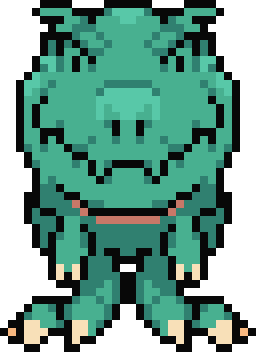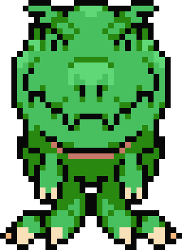 
</td>
    <td>
<b>Drago's</b>

  
The Dragosaurus is much more docile and intelligent than its appearance would indicate. It is to the point that it is safe to leave children around them unsupervised -- they are willing to humour them. Residing around Mt. Oriander, especially on the Drago Plateau, they come by near Alec’s house near the start of the game, much to the delight of Claus and Lucas.
  
Despite this, however, Drago are still extremely tough beings, capable of shrugging off nearly anything, including explosives, without any visible damage, and destroying a tank with a single bound. This, combined with their ability to breathe fire, results in disaster when a Drago goes berserk due to an attempt to turn it into a Chimera -- one that went horribly right.</td>
</tr>
</table>

 

 

<table class="fixed">
    <col width="250px" />
    <col width="1500px" />

<tr>
    <td>
</td>
    <td>
<b>Rope Snake</b>

  
Duster first finds the Rope Snake on sale by a ghost in exchange for a couple of Rotten Eclairs. It quickly proves helpful in all purposes a living rope could serve, but eventually turns out to go beyond that, having a personality of its own. It is proud of its powerful jaw, and although it tries its best, its jaw proving inadequate on more than one occasion hurts it deeply.
</td>
</tr>
</table>

 

 

<table class="fixed">
    <col width="250px" />
    <col width="1500px" />

<tr>
    <td>
</td>
    <td>
<b>Samba</b>

  
Samba is Salsa’s “love-monkey”, but is separated from him by the Pigmask Army, essentially held hostage by them to force Salsa to cooperate. Some time after he regains his freedom thanks to Kumatora, Wess and Lucas, however, the two reunite, and stay with each other through everything, even while inside the Chimera Laboratory.
</td>
</tr>
</table>




<table class="fixed">
    <col width="250px" />
    <col width="1500px" />

<tr>
    <td>
</td>
    <td>
<b>Aeolia</b>

  
Aeolia is one of the Magypsies, guarding the Needle at Osohe Castle. It is at her house that the Magypsies gather for their tea parties, Flint and Alec visiting her during their search for Claus. As it turns out, she is responsible for helping Claus realize his PSI potential -- and as especially powerful PSI technique. She is the first Magypsy to disappear, but does not express any sorrow at the prospect.
</td>
</tr>
</table>

 

 

<table class="fixed">
    <col width="250px" />
    <col width="1500px" />

<tr>
    <td>
</td>
    <td>
<b>Doria</b>

  
Doria is the Magypsy to guard the Needle of Murasaki Forest, concealing it under a lake. Although she might be intimidating due to her appearance, she is just as kind as the other Magypsies, being there to rescue Kumatora after the latter falls from the sky, and empathizing with Flint and Alec’s search for Claus. She is very optimistic, easily impressed.
</td>
</tr>
</table>

 

 

<table class="fixed">
    <col width="250px" />
    <col width="1500px" />

<tr>
    <td>
</td>
    <td>
<b>Lydia</b>

  
Lydia is the Magypsy of Snowcap Mountain, guarding the Needle just outside her home. Although Magypsies, as exhibited in Flint and Alec’s visit to their party, are rather aloof, unconcerned about the matters of humans, Lydia shows kindness in rescuing a Pigmask Captain who has been separated from his group and got stranded in the snow. She has a fondness for snow rabbits.

</td>
</tr>
</table>

 

 

<table class="fixed">
    <col width="250px" />
    <col width="1500px" />

<tr>
    <td>
</td>
    <td>
<b>Phrygia</b>

  
Phrygia guards the Needle of the Fire Mountain, situated near the Saturn Valley. She spends most of her time sleeping, as it would seem, but nonetheless claims herself to be “a little more detail-oriented” than the other Magypsies. To that end, she writes down the locations of the other Needles in a notebook, and gives it to Lucas to help him on his endeavor.
</td>
</tr>
</table>

 

 

<table class="fixed">
    <col width="250px" />
    <col width="1500px" />

<tr>
    <td>
</td>
    <td>
<b>Mixolydia</b>

  
As the Magypsy of Tanetane Island, Mixolydia is the one to snap Lucas and his party out of the hallucinations caused by them, out of necessity, consuming some strange mushrooms. Her Needle is especially heavily-guarded, three golems of her own crafting protecting it with spectacular Barrier Poses and relentless blasts of PSI, including the feared and powerful PK Starstorm.
</td>
</tr>
</table>

 

 

<table class="fixed">
    <col width="250px" />
    <col width="1500px" />

<tr>
    <td>
</td>
    <td>
<b>Ionia</b>

  
The Magypsy of Argilla Pass, Ionia has a love for sour foods such as pickles. Accepting the end of her life like the other Magypsies, she gives the Waters of Time to the party so that they can get past the vines frozen in time blocking the entrance to Chupichupyoi Temple.
  
Ionia has been especially involved in raising Kumatora as an orphan to who she is now, and is also credited with recognizing Lucas’s PSI potential and helping him realize it. Before disappearing, she passes down the powerful PK Starstorm technique to Kumatora, stating that she never intended to teach it to her because of how dangerous it is, but also recognizing the need for its power.</td>
</tr>
</table>





<table class="fixed">
    <col width="250px" />
    <col width="1500px" />

<tr>
    <td>
</td>
    <td>
<b>Item Guy</b>

  
The Item Guy is incredibly faithful, willing to resign himself to keeping the party’s items safe at all times. Aside from this invaluable service, he proves to be very supportive -- an oasis in the desert following Tazmily’s transformation -- encouraging and reassuring the protagonists. He can be found dragging his cart along in even the most unusual of places, even accompanying the party to a snowy peak.
</td>
</tr>
</table>

 

 

<table class="fixed">
    <col width="250px" />
    <col width="1500px" />

<tr>
    <td>
</td>
    <td>
<b>Dr. Andonuts</b>

  
Dr. Andonuts returns from EarthBound, apparently having arrived on the Nowhere Islands across time and space. Although he is very out-of-place among the people of Tazmily, he retains every bit of his scientific skill. This is, unfortunately, channeled by the Pigmask Army to create chimeras and achieve impressive technological feats, until Dr. Andonuts finally meets Lucas and refuses to help the Pigmasks anymore.

</td>
</tr>
</table>




<table class="fixed">
    <col width="250px" />
    <col width="1500px" />

<tr>
    <td>
</td>
    <td>
<b>Pigmask</b>

  
Strange pig-masked people who no one seems to know the precise origins of, and who have access to technology unseen in Tazmily. They turn up one night, setting fire to the forest, and then essentially take over and transform the village, gaining the trust of all but a few. And they do everything in their power to silence those few. Pigmasks come at multiple levels; aside from the standard, Captains, Majors and Colonels are the standard ranks, there is a marine division in the Navy SQUEALs.
  
In truth, as later revealed by Leder, the Pigmasks are ordinary people plucked out of different times, and brainwashed to form an army.</td>
</tr>
</table>

 

 

<table class="fixed">
    <col width="250px" />
    <col width="1500px" />

<tr>
    <td>
</td>
    <td>
<b>Fassad</b>

  
Fassad first shows up as a suspicious peddler, introducing money to Tazmily by offering some to Butch and the Yado Inn. Surprisingly charismatic in his speech, Fassad slowly gains the trust of all but a select few villagers, which gives him free reign to bring around massive changes to the village in the name of “happiness”. He is a Pigmask official of very high rank.
  
The game establishes Fassad as a cruel individual, as exhibited in his abusive treatment of Salsa, and the fact that he does not seem to have any qualms of killing the protagonists. This behaviour even extends to his poor treatment of the Pigmasks working under him.
  
Fassad, however, despite the deadly effectiveness of his plans, falls to his own love for bananas; slipping on a banana peel, he plummets off Thunder Tower, and is reconstructed. As a mechanical chimera, he confronts the party on more than one occasion, and even reveals himself to be able to wield high-level PSI, including PK Starstorm.
  
In truth, Fassad is Locria, the missing Magypsy, and the traitor among them. Having joined forces with Porky, she reveals the secret of the White Ship and the Dark Dragon to Porky, setting much of the plot in motion.</td>
</tr>
</table>

 

 

<table class="fixed">
    <col width="250px" />
    <col width="1500px" />

<tr>
    <td>
</td>
    <td>
<b>Masked Man</b>

  
The commander of the Pigmask Army. The Masked Man appears to still be rather youthful, but this belies his thorough competence. He, aside from Lucas, is the only one capable of using PK Love, and therefore, the only other to be able to pull the Needles. With PK Love and his lightning, he proves to be a highly dangerous foe.
  

Lucas is initially -- and mysteriously -- mistaken to be the Commander by a group of Pigmasks, which serves him and his party well until they are identified. The Masked Man himself, however, proves him to be very distinct -- and eerily silent. He will do everything in his power to reach the Needles before Lucas does… and yet, the Magypsies sense no heart in him.
  

The Masked Man is, in reality, a brainwashed Claus. The Pigmasks having found Claus lying at the bottom of a cliff following his battle with the Mecha-Drago, they realized his ability to use PK Love, and therefore his potential to command the power of the Dark Dragon. They saved him -- but also suppressed his emotions to the point that he unquestionably follows Porky’s orders, no matter the consequences.
  
Even with Porky out of the way, he continues on his mission, fighting Lucas alone in a battle for the final Needle. It takes a sacrifice from his father, as well as his mother’s desperate attempts to reach him, for him to finally come to his senses. With one last bolt of intense lightning, he strikes himself down, and in doing so, he leaves the final Needle to Lucas.</td>
</tr>
</table>

 

 

<table class="fixed">
    <col width="250px" />
    <col width="1500px" />

<tr>
    <td>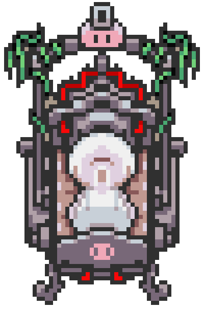
</td>
    <td>
<b>Porky</b>

  
Porky Minch returns from EarthBound, and on a much grander scale than last time. Since his defeat at the hands of Ness and his friends, Porky has utilized his ability to time travel extensively, creating an army, snatching people out of their times, brainwashing them into serving him, and ultimately paying for his actions by being locked out of all other times.
  
Time travel demolishes life, it was said by Dr. Andonuts -- and it has left Porky older and frailer than he can imagine. This only applies to his body, however, his mind left intact, and just as bent on garnering power and using others. Porky is the man behind all the challenges and tragedies the protagonists have had to face.
  
Porky concentrates the entire population of the Nowhere Islands -- time-traveled or not -- into New Pork City, treating it like a game even as he glorifies it as a utopia. And he is intent on going the extra mile -- eliminating everyone who does not like him.
  
Porky remains confident that defeating him is impossible, constantly pointing out the futility of the protagonists’ efforts. But although he can put up a fight, even his machine has its limits. Forced to retreat into the Absolutely Safe Capsule even as he taunts the party one last time, he does not seem to realize his own predicament -- seclusion for all eternity.</td>
</tr>
</table>


