
Thanks to <a href="http://mother-jp.net">mother-jp.net</a> a patent that may be a key in the link between Shigesato Itoi and Brownie Brown was unearthed. In April of 2003, before Mother 1+2 was even announced, this patent was filed. The patent itself involves how a character encounters an enemy and then enters a unique battle system found in Mother 3 where proper timing to the music ensured greater damage in battle.  
<a href="http://www4.ipdl.inpit.go.jp/Tokujitu/tjftermenz.ipdl">Japanese Patent Database</a> 
To access the original patent, use the following data: 
Theme: 2C001 
Publication Date: 20041118 (in both to and from boxes) 
FI/F-term: AA16 
 
The information provided below is a translation provided by the Japanese Patent Office.



Patent Number: JP,2004-321362,A 
Publication Number: 2004-321362 
Date of publication of application: 18.11.2004 
Int.Cl.: A63F 13/00, A63F 13/10 
Application number: 2003-118135 
Date of filing: 23.04.2003 
Applicant: HARU KENKYUSHO:KK, NINTENDO CO LTD 
Inventor: ITOI SHIGESATO, SAKAI SHOGO, INOUE NOBUYUKI, AIKYO MASAKI, IWATA SATOSHI 
 
GAME DEVICE AND GAME PROGRAM 
(57)Abstract: 
PROBLEM TO BE SOLVED: To feed back the controlling ability of a player to the content of a game, and to increase the game property and the amusement property. 
SOLUTION: This game device 12 is constituted in such a manner that a CPU 36 is included, the CPU 36 executes a game process, and a battle screen is displayed on a monitor 34 when a player character meets an enemy character in a game world. In the battle screen, an indication image conforming to a control timing pattern which is recorded to cope with the enemy character is displayed, and at the same time, a BGM in response to the pattern is output from a speaker 34a. The player contrives the control timing by the indication image and the performance of the BGM (the drum part). When the coincidence degree between the control timing of the player and the timing of the pattern is high, damages applied to the enemy character by the player character and an experience value to be acquired are made larger.



[Claim 1] 
The characters in the game world are the game devices which display a battle scene attacked mutually, 
The 1st memory measure that memorizes a parameter for every character which appears in said game world, 
The 2nd memory measure that associates and memorizes an operation timing pattern for timing which should be operated to a player to be shown for said every character, 
An indication image change means to change a display mode of the indication image concerned based on an operation timing pattern related with a character which appears in the battle scene concerned which displays an indication image and is memorized by said 2nd memory measure when said battle scene is displayed, 
An operation detection means which detects operation of a player inputted according to change of said indication image, 
a variation value calculating means which computes a variation value for changing a parameter of a character according to a coincidence degree of operation timing of said player at the time of being detected by said operation detection means, and timing of said operation timing pattern corresponding to the time concerned -- and 
A game device provided with a parameter update means which updates a parameter of a character which has appeared in said battle scene based on a variation value computed by said variation value calculating means. 
[Claim 2] 
Said 2nd memory measure memorizes an operation timing pattern in which difficulty of operation to a player differs for every character, 
The game device according to claim 1 to which said indication image change means changes a display mode of said indication image based on an operation timing pattern related with either of the characters of a side which receives a near character and an attack which attack. 
[Claim 3] 
Said parameter contains a physical strength parameter which determines propriety of battle continuation capability of a character, 
The game device according to claim 1 or 2 which decreases a physical strength parameter of the character concerned so that, as for said parameter update means, a character of a side which receives an attack which has appeared in said battle scene may receive a damage based on a variation value computed by said variation value calculating means. 
[Claim 4] 
The game device according to any one of claims 1 to 3 to which a display mode is changed when said indication image change means carries out a scaling rhythm display and display or display non-display [ of said indication image ] based on an operation timing pattern related with a character which appears in said battle scene. 
[Claim 5] 
The game device according to any one of claims 1 to 4 to which at least a color of said indication image and one side of shape are changed in timing which should make said player based on said operation timing pattern operate said indication image change means. 
[Claim 6] 
It has further a musical piece reproduction means which reproduces composition data for performing BGM in said battle scene, 
Composition data which said 2nd memory measure is used as said operation timing pattern, and is constituted by two or more kinds of parts which are the reproduction objects of said musical piece reproduction means is memorized, 
The game device according to any one of claims 1 to 5 to which said indication image change means changes a display mode of said indication image based on any one part which constitutes said composition data when BGM is performed by said musical piece reproduction means. 
[Claim 7] 
Said parameter contains an ability parameter which determines the high level of combat efficiency of a character, 
The game device according to any one of claims 1 to 6 which updates an ability parameter of a character which said player operates based on a variation value computed by said variation value calculating means when a battle ends said parameter update means. 
[Claim 8] 
Operation timing of said player at the time of said variation value calculating means being detected by said operation detection means, The game device according to any one of claims 1 to 7 which computes a variation value for changing a parameter of a character a lot, so that a coincidence degree with timing of said operation timing pattern corresponding to the time concerned is high. 
[Claim 9] 
It is constituted so that a player may be made to operate said operation timing pattern to two or more timing continuously, 
Whenever operation of a player is detected by said operation detection means, said variation value calculating means Operation timing of said player at the time, The game device according to any one of claims 1 to 8 which computes a variation value for every time concerned according to a coincidence degree with timing of said operation timing pattern corresponding to the time concerned. 
[Claim 10] 
The game device according to claim 9 with which said variation value calculating means computes a variation value so that the degree of coincidence of operation timing of a player detected by said operation detection means and timing of said operation timing pattern may become large gradually, when continuously high. 
[Claim 11] 
Said battle scene makes characters fight by repeating an attack turn and a defense turn by turns. 
The game device according to claim 9 or 10 further provided with a turn exchange means to replace said attack turn and said defense turn when continuous operation of said player is permitted till a time of said degree of coincidence becoming low exceeding a predetermined value and it becomes low exceeding the predetermined value concerned. 
[Claim 12] 
The 3rd memory measure that memorizes operational frequency information which shows the number of times of operational of a player, The game device according to any one of claims 1 to 11 further provided with an end means of operation to terminate operation of said player when a number-of-times reduction means which decreases said number of times of operational according to operation of a player, and said number of times of operational are set to 0. 
[Claim 13] 
The game device according to claim 12 with which the degree of coincidence of operation timing of said player and timing of said operation timing pattern is continuously provided further with a number-of-times increasing means to which said number of times of operational is made to increase when high. 
[Claim 14] 
In order for the characters in the game world to display a battle scene attacked mutually, it is a game program executed by computer of a game device, 
Said computer, 
The 1st memory measure that memorizes a parameter for every character which appears in said game world, 
The 2nd memory measure that associates and memorizes an operation timing pattern for directing timing which should be operated to a player for said every character, 
An indication image change means to change a display mode of the indication image concerned based on an operation timing pattern related with a character which appears in the battle scene concerned which displays an indication image and is memorized by said 2nd memory measure when said battle scene is displayed, 
An operation detection means which detects operation of a player inputted according to change of said indication image, 
a variation value calculating means which computes a variation value for changing a parameter of a character according to coincidence door ** of operation timing of said player at the time of being detected by said operation detection means, and timing of said operation timing pattern corresponding to the time concerned -- and 
A game program operated as a parameter update means which updates a parameter of a character which has appeared in said battle scene based on a variation value computed by said variation value calculating means. 
[Claim 15] 
Said 2nd memory measure memorizes an operation timing pattern in which difficulty of operation to a player differs for every character, 
Based on an operation timing pattern related with either of the characters of a side which receives a near character and an attack which attack, said indication image change means so that a display mode of said indication image may be changed, The game program according to claim 14 as which said computer is operated. 
[Claim 16] 
Said parameter contains a physical strength parameter which determines propriety of battle continuation capability of a character, 
Said parameter update means so that a character of a side which receives an attack which has appeared in said battle scene may receive a damage based on a variation value computed by said variation value calculating means, The game program according to claim 14 or 15 as which said computer is operated so that a physical strength parameter of the character concerned may be decreased. 
[Claim 17] 
Based on an operation timing pattern related with a character which appears in said battle scene, said indication image change means, The game program according to any one of claims 15 to 17 as which said computer is operated so that a display mode may be changed by carrying out a scaling rhythm display and display or display non-display [ of said indication image ]. 
[Claim 18] 
Said indication image change means so that at least a color of said indication image and one side of shape may be changed in timing which said player based on said operation timing pattern should be made to operate, The game program according to any one of claims 14 to 17 as which said computer is operated. 
[Claim 19] 
Said game device is further provided with a musical piece reproduction means which reproduces composition data for performing BGM in said battle scene, 
Composition data which said 2nd memory measure is used as said operation timing pattern, and is constituted by two or more kinds of parts which are the reproduction objects of said musical piece reproduction means is memorized, 
When BGM is performed by said musical piece reproduction means as for said indication image change means, The game program according to any one of claims 14 to 18 as which said computer is operated so that a display mode of said instruction display picture may be changed based on any one part which constitutes said composition data. 
[Claim 20] 
Said parameter contains an ability parameter which determines the high level of combat efficiency of a character, 
Said parameter update means so that an ability parameter of a character which said player operates may be updated based on a variation value computed by said variation value calculating means, when a battle is completed, The game program according to any one of claims 14 to 19 as which said computer is operated. 
[Claim 21] 
Operation timing of said player at the time of said variation value calculating means being detected by said operation detection means, The game program according to any one of claims 14 to 20 as which said computer is operated so that a coincidence degree with timing of said operation timing pattern corresponding to said time is high and a variation value for changing a parameter of a character a lot may be computed. 
[Claim 22] 
It is constituted so that a player may be made to operate said operation timing pattern to two or more timing continuously, 
Whenever operation of a player is detected by said operation detection means, said variation value calculating means Operation timing of said player at the time, The game program according to any one of claims 14 to 21 as which said computer is operated according to a coincidence degree with timing of said operation timing pattern corresponding to the time concerned so that a variation value for every time concerned may be computed. 
[Claim 23] 
The degree of coincidence of operation timing of a player detected by said operation detection means and timing of said operation timing pattern continuously said variation value calculating means When high, The game program according to claim 22 as which said computer is operated so that it may become large gradually and a variation value may be computed. 
[Claim 24] 
Said battle scene makes characters fight by repeating an attack turn and a defense turn by turns. 
Till a time of said coincidence degree becoming low exceeding a predetermined value, The game program according to claim 22 or 23 as which said computer is further operated as a turn exchange means to replace said attack turn and said defense turn when continuous operation of said player is permitted and it becomes low exceeding the predetermined value concerned. 



[Detailed Description of the Invention] 
[0001] 
[Industrial Application] 
Especially this invention relates to the game device and game program which display the battle scene which the characters in for example, the game world attack mutually about a game device and a game program. 
[0002] 
[Description of the Prior Art] 
An example of this conventional kind of game device is indicated by the patent documents 1. In the video game device indicated by these patent documents 1, an attack turn is given by turns between a player character and an enemy character. In the attack turn of a player character, when a player chooses a specific command, it can attack to an enemy character. On the other hand, in the attack turn of an enemy character, an attack according to the kind of the enemy character concerned is delivered to a player character. For example, when the hit points according to the attack concerned were subtracted from HP of an enemy character when the player character attacked the enemy character, and HP was set to zero, the enemy character concerned had disappeared from the screen. 
[0003] 
Other examples of this conventional kind of game device are indicated by the patent documents 2. In the game device indicated by these patent documents 2, the aggressivity of the self-character of a player is displayed by a bar graph called an ATB bar. For example, if an enemy character goes into the attack range range of a self-character, the display of an ATB bar will start and a bar graph will begin to be gradually extended from 0. Although the length of a bar graph is proportional to the lapsed time from ATB bar display start time, if a maximum is reached, it is inelastic in more than it. When the player directed the attack in the self-character, an attack of the aggressivity proportional to the length of the bar graph displayed on the ATB bar was delivered on the enemy character. 
[0004] 
[Patent documents 1] 
Patent No. 2794230 
[Patent documents 2] 
JP,11-179055,A 
[0005] 
[Problem(s) to be Solved by the Invention] 
However, in the case of the former, the attack to an enemy character, . [ whether the hit points beforehand set up by the selected command are given as it is, and ] The hit points produced by multiplying by the rate determined as the hit points concerned by random numbers are only given, the skill (skill) of the attack of a player did not influence aggressivity, and game nature and fun were missing. 
[0006] 
In the case of the latter as well as the case of the former, the aggressivity according to the length of the bar graph displayed on the ATB bar was only given to the enemy character, and it was missing at game nature or fun. 
[0007] 
So, the main purpose of this invention is to provide the game device and game program of a new idea which can reflect the skill of a player in a game. 
[0008] 
[Means for Solving the Problem] 
Claim 1 is a game device which displays a battle scene which the characters in the game world attack mutually. The 1st memory measure this game device remembers a parameter for every character which appears in the game world to be, When the 2nd memory measure and a battle scene which associate and memorize an operation timing pattern for timing which should be operated to a player to be shown for every character are displayed, Based on an operation timing pattern related with a character which appears in the battle scene concerned which displays an indication image and is memorized by the 2nd memory measure, An indication image change means to change a display mode of the indication image concerned, an operation detection means which detects operation of a player inputted according to change of an indication image, According to a coincidence degree of operation timing of a player at the time of being detected by an operation detection means, and timing of an operation timing pattern corresponding to the time concerned, Based on a variation value computed by a variation value calculating means which computes a variation value for changing a parameter of a character, and variation value calculating means, it has a parameter update means which updates a parameter of a character which has appeared in a battle scene. 
[0009] 
Claim 2 is subordinate to claim 1, and the 2nd memory measure, Memorize an operation timing pattern in which difficulty of operation to a player differs for every character, and an indication image change means, A display mode of an indication image is changed based on an operation timing pattern related with either of the characters of a side which receives a near character and an attack which attack. 
[0010] 
Claim 3 is subordinate to claim 1 or claim 2, and a parameter, Propriety of battle continuation capability of a character including a physical strength parameter to decide a parameter update means, A physical strength parameter of the character concerned is decreased so that a character of a side which receives an attack which has appeared in a battle scene may receive a damage based on a variation value computed by variation value calculating means. 
[0011] 
Claim 4 is subordinate to either of claims 1 thru/or 3, and an indication image change means changes a display mode based on an operation timing pattern related with a character which appears in a battle scene by carrying out a scaling rhythm display and display or display non-display [ of the indication image ]. 
[0012] 
Claim 5 is subordinate to either of claims 1 thru/or 4, and an indication image change means changes at least a color of an indication image, and one side of shape in timing which a player based on an operation timing pattern should be made to operate. 
[0013] 
Claim 6 is subordinate to either of claims 1 thru/or 5, have further a musical piece reproduction means which reproduces composition data for performing BGM in a battle scene, and the 2nd memory measure, Memorize composition data which is used as an operation timing pattern and constituted by two or more kinds of parts which are the reproduction objects of a musical piece reproduction means, and an indication image change means, When BGM is performed by a musical piece reproduction means, a display mode of an indication image is changed based on any one part which constitutes composition data. 
[0014] 
Claim 7 is subordinate to either of claims 1 thru/or 6, and a parameter, When a battle ends a parameter update means including an ability parameter which determines the high level of combat efficiency of a character, an ability parameter of a character which a player operates is updated based on a variation value computed by variation value calculating means. 
[0015] 
Claim 8 is subordinate to either of claims 1 thru/or 7, and a variation value calculating means, A variation value for changing a parameter of a character a lot is computed, so that a coincidence degree of operation timing of a player at the time of being detected by an operation detection means and timing of an operation timing pattern corresponding to the time concerned is high. 
[0016] 
Claim 9 is subordinate to either of claims 1 thru/or 8, and an operation timing pattern, Are constituted so that a player may be made to operate it to two or more timing continuously, and a variation value calculating means, According to a coincidence degree of operation timing of a player at the time, and timing of an operation timing pattern corresponding to the time concerned whenever operation of a player is detected by an operation detection means, a variation value for every time concerned is computed. 
[0017] 
Claim 10 is subordinate to claim 9, and a variation value calculating means computes a variation value so that the degree of coincidence of operation timing of a player detected by an operation detection means and timing of an operation timing pattern may become large gradually, when continuously high. 
[0018] 
Claim 11 is subordinate to claim 9 or 10, and a battle scene, When characters are made to fight, continuous operation of a player is permitted till a time of a coincidence degree exceeding a predetermined value and the predetermined value concerned is exceeded by repeating an attack turn and a defense turn by turns, it has further a turn exchange means to replace an attack turn and a defense turn. 
[0019] 
The 3rd memory measure that memorizes operational frequency information which claim 12 is subordinate to either of claims 1 thru/or 11, and shows the number of times of operational of a player, When a number-of-times reduction means which decreases the number of times of operational according to operation of a player, and the number of times of operational are set to 0, it has further an end means of operation to terminate operation of a player. 
[0020] 
Claim 13 is subordinate to claim 12, and continuously, the degree of coincidence of operation timing of a player and timing of an operation timing pattern is further provided with a number-of-times increasing means to which the number of times of operational is made to increase, when high. 
[0021] 
Claim 14 is a game program executed by computer of a game device, in order for the characters in the game world to display a battle scene attacked mutually. The 1st memory measure this game program remembers a parameter for every character which appears a computer in the account game world to be, When the 2nd memory measure and a battle scene which associate and memorize an operation timing pattern for directing timing which should be operated to a player for every character are displayed, Based on an operation timing pattern related with a character which appears in the battle scene concerned which displays an indication image and is memorized by the 2nd memory measure, Operation timing of a player at the time of being detected by indication image change means to change a display mode of the indication image concerned, operation detection means which detects operation of a player inputted according to change of an indication image, and an operation detection means, According to coincidence door ** with timin g of an operation timing pattern corresponding to the time concerned, It is made to function based on a variation value computed by a variation value calculating means which computes a variation value for changing a parameter of a character, and variation value calculating means as a parameter update means which updates a parameter of a character which has appeared in a battle scene.
[0022] 
Claim 15 is subordinate to claim 14, and the 2nd memory measure, Memorize an operation timing pattern in which difficulty of operation to a player differs for every character, and an indication image change means, Based on an operation timing pattern related with either of the characters of a side which receives a near character and an attack which attack, a computer is operated so that a display mode of an indication image may be changed. 
[0023] 
Claim 16 is subordinate to claim 14 or 15, and a parameter, Propriety of battle continuation capability of a character including a physical strength parameter to decide a parameter update means, A computer is operated so that a character of a side which receives an attack which has appeared in a battle scene may receive a damage based on a variation value computed by variation value calculating means, and a physical strength parameter of the character concerned may be decreased. 
[0024] 
Claim 17 is subordinate to claim 15 or 16, and an indication image change means, Based on an operation timing pattern related with a character which appears in a battle scene, by carrying out a scaling rhythm display and display or display non-display [ of the indication image ], a computer is operated so that a display mode may be changed. 
[0025] 
Claim 18 is subordinate to either of claims 14 thru/or 17, and an indication image change means operates a computer so that at least a color of an indication image and one side of shape may be changed in timing which a player based on an operation timing pattern should be made to operate. 
[0026] 
Claim 19 is subordinate to either of claims 14 thru/or 18, and a game device, Have further a musical piece reproduction means which reproduces composition data for performing BGM in a battle scene, and the 2nd memory measure, Memorize composition data which is used as an operation timing pattern and constituted by two or more kinds of parts which are the reproduction objects of a musical piece reproduction means, and an indication image change means, When BGM is performed by a musical piece reproduction means, a computer is operated so that a display mode of an instruction display picture may be changed based on any one part which constitutes composition data. 
[0027] 
Claim 20 is subordinate to either of claims 14 thru/or 19, and a parameter, When a battle ends a parameter update means including an ability parameter which determines the high level of combat efficiency of a character, a computer is operated so that an ability parameter of a character which a player operates may be updated based on a variation value computed by variation value calculating means. 
[0028] 
Claim 21 is subordinate to either of claims 14 thru/or 20, and a variation value calculating means, A computer is operated so that a coincidence degree of operation timing of a player at the time of being detected by an operation detection means and timing of an operation timing pattern corresponding to a time is high, and a variation value for changing a parameter of a character a lot may be computed. 
[0029] 
Claim 22 is subordinate to either of claims 14 thru/or 21, and an operation timing pattern, Are constituted so that a player may be made to operate it to two or more timing continuously, and a variation value calculating means, According to a coincidence degree of operation timing of a player at the time, and timing of an operation timing pattern corresponding to the time concerned whenever operation of a player is detected by an operation detection means, a computer is operated so that a variation value for every time concerned may be computed. 
[0030] 
Claim 23 is subordinate to claim 22, and a variation value calculating means operates a computer so that the degree of coincidence of operation timing of a player detected by an operation detection means and timing of an operation timing pattern may become large gradually and a variation value may be computed, when continuously high. 
[0031] 
Claim 24 is subordinate to claim 22 or 23, and a battle scene, Till a time of making characters fight and a coincidence degree exceeding a predetermined value by repeating an attack turn and a defense turn by turns, Continuous operation of a player is permitted, and when the predetermined value concerned is exceeded, a computer is further operated as a turn exchange means to replace an attack turn and a defense turn. 
[0032] 
[Function] 
A game device of an invention of claim 1 (12: reference number corresponding in the example.) Hereafter, it is the same. The characters in the game world display the battle scene attacked mutually. The 1st memory measure (40) memorizes the parameter for every character which appears in the game world, and, as for the 2nd memory measure (40), the account of character (72, 74) every ********** fears the operation timing pattern for directing the timing which should be operated to a player. When a battle scene (80) is displayed, an indication image change means (36, S11), The display mode of a display image (78) is changed based on the timing pattern related with the character (72, 74) which appears in the battle scene (80) which displays an indication image (78) and is memorized by the 2nd memory measure (40). A player plans timing of operation (attack), seeing this display image (78). Operation of a player is detected by an operation detection means (36, S53). Then, a variation value calculating means (36, S19, S77) computes the variation value for changing the parameter of a character (72, 74) according to the coincidence degree of the operation timing of the player at the time of being detected, and the operation timing pattern corresponding to the time concerned. And a parameter update means (36, S15, S19) updates the parameter of the character (72, 74) which has appeared in a battle scene (80) based on the variation value of the computed parameter. 
[0033] 
In this invention, the parameter of a character can be changed according to the operation timing of a player. 
Therefore, the manipulative capability of a player can be reflected in a game content. 
 
[0034] 
According to claim 2, the 2nd memory measure (40), Memorize the operation timing pattern in which the difficulty of the operation to a player differs in every character (72, 74), and an indication image change means (36, S11), The display mode of an indication image is changed based on the operation timing pattern related with either of the characters (74) of the side which receives the near character (72) and attack to attack. 
[0035] 
In changing the display mode of an indication image based on the operation timing pattern related with the character of the side to attack, For example, a complicated (difficult) operation timing pattern can be related with the strong character of aggressivity, and, on the other hand, a simple (easy) operation timing pattern can be related with the weak character of aggressivity. That is, the size of aggressivity can be determined by the manipulative capability (skill) of a player, and a sense of accomplishment can be given to a player. 
[0036] 
In changing the display mode of an indication image based on the operation timing pattern related with the character of the side which receives an attack, For example, a complicated (difficult) operation timing pattern can be related with a strong character, and, on the other hand, a simple (easy) operation timing pattern can be related with a weak character. That is, it is decided by manipulative capability (skill) of a player whether a character can be pushed down or not. 
[0037] 
According to claim 3, a parameter contains the physical strength parameter which determines the propriety of the battle continuation capability of a character, for example. A parameter update means (36, S15) decreases the physical strength parameter of the character (74) concerned so that the character (74) of the side which receives an attack may receive a damage based on the variation value computed by the variation value calculating means (36, S77). A variation value is computed by the operation timing of a player and this influences the physical strength parameter of the character (78) of the side which receives an attack by it. Thus, the attack effect can be changed according to the manipulative capability of a player, and the idea nature of a game can be raised. 
[0038] 
According to claim 4, an indication image change means (36, S11) carries out a scaling rhythm display and display or display non-display [ of the indication image (78) ] based on the operation timing pattern related with the character (72, 74) which appears in a battle scene (80). That is, since the display mode of a display image (78) changes according to a predetermined rhythm, an effective damage can be given, if it rides on a rhythm and attacks. 
[0039] 
According to claim 5, an indication image change means (36, S41), In the timing which the player based on an operation timing pattern should be made to operate, since at least the color of an indication image (78) and one side of shape are changed, the player can plan timing of operation (attack) easily, if an indication image (78) is seen. 
[0040] 
According to claim 6, a game device (12) is provided with the musical piece reproduction means (34a, 36, 62, S119) which reproduces the composition data for reproducing BGM in a battle scene (80). The 2nd memory measure (40) memorizes the composition data (sound data) which is used as an operation timing pattern and constituted by two or more kinds of parts which are the reproduction objects of a musical piece reproduction means (34a, 36, 62, S119). Based on any at least one part which constitutes composition data, for example, a drum part, an indication image change means (36, S41) changes the display mode of an indication image (78), when BGM is reproduced by the musical piece reproduction means (34a, 36, 62, S119). That is, the player can plan timing of operation easily by it not only seeing an indication image, but hearing the drum part of BGM performed. 
[0041] 
According to claim 7, a parameter contains the ability parameter which determines the high level of the combat efficiency (level) of a character (72, 74). A parameter update means (36, S19) updates the ability parameter of the character (72) which a player operates based on the variation value computed by the variation value calculating means (36, S19), when a battle is completed. That is, since the ability parameter of the character (72) which a player operates is increased based on the variation value computed according to operation timing, the degree of the improvement in a level of a player character can also be changed according to the manipulative capability of a player. Game nature can be made high more. 
[0042] 
According to claim 8, a variation value calculating means (36, S19, S77) computes the variation value to which the parameter of a character (72, 74) is changed a lot, so that the degree of coincidence of operation timing and the timing of an operation timing pattern is high. The ability parameter of the character to attack is made to specifically increase greatly, and the physical strength parameter of the character of the side which receives an attack is decreased greatly. That is, the player can carry out exact operation and can make the operation reflect in the contents of the game as the degree of acquisition of a game goes up. 
[0043] 
According to claim 9, for example an operation timing pattern, Constituted so that a player may be made to operate it to two or more timing continuously, a variation value calculating means (36, S19, S77) computes a variation value each time according to the degree of coincidence of operation timing and the timing of an operation timing pattern. That is, by one attack turn, a multiple-times attack can be delivered, the damage integrated by that cause can be given to the character of the side which receives an attack, and a physical strength parameter can be reduced. An ability parameter can also be made to increase according to the integrated damage. The game deployment to which the manipulative capability of the player responded can be enjoyed. 
[0044] 
as for a variation value calculating means (S36, S19, S77), according to claim 10, the degree of coincidence of operation timing and the timing of an operation timing pattern continues -- time it is high -- being gradual (nonlinear) -- a variation value is computed so that it may become large. That is, the more the manipulative capability of a player is high, the more the damage given to a character can be enlarged. 
[0045] 
According to claim 11, for example, a battle scene (80) makes characters fight by repeating an attack turn and a defense turn by turns. Till the time of the degree of coincidence of operation timing and the timing of an operation timing pattern becoming low exceeding a predetermined value, a turn exchange means (36, S19) permits continuous operation of a player, and when it becomes low exceeding a predetermined value, it replaces an attack turn and a defense turn. For example, when the degree of coincidence becomes low by an attack going wrong etc. exceeding a predetermined value, an attack turn and a defense turn are replaced, but while having succeeded the attack, an attack can be delivered continuously. That is, an attack according to the manipulative capability of the player can be delivered. 
[0046] 
According to claim 12, the 3rd memory measure (40) memorizes the operational frequency information which shows the number of times which can be attacked by one attack turn (operation). A number-of-times reduction means (36, S79) decreases the number of times of operational according to operation of a player. And the end means of operation (36, S81) terminates operation of a player, i.e., an attack turn, when the number of times of operational is set to 0. That is, the number of times of operation (attack) can be restricted. 
[0047] 
The degree of coincidence of the operation timing of a player and the timing of an operation timing pattern makes the number of times of operational a number-of-times increasing means (36, S73) increase continuously according to claim 13, when high. In the high player of manipulative capability, more attacks can be delivered in one attack turn. Thereby, the sense of accomplishment of a player can be increased. 
[0048] 
The manipulative capability of a player can be made to reflect in a game content like claim 1 also in claim 14. 
[0049] 
[Effect of the Invention] 
In this invention, the parameter of a character can be changed according to the operation timing of a player. 
Therefore, the manipulative capability of a player can be reflected in a game content. 
Thereby, game nature and idea nature can be raised. 
[0050] 
The above-mentioned purpose of this invention, the other purposes, the feature, and an advantage will become still clearer from the detailed explanation of the following examples given with reference to drawings. 
[0051] 
[Example] 
With reference to drawing 1, the video game system 10 of this example contains the video game device 12. Although a power supply is given to this video game device 12, this power supply may be a common AC adapter (not shown) in an example. An AC adapter is inserted in a standard wall socket for home use, and changes a household power supply into a low DC voltage signal suitable for driving the video game device 12. As other examples, a battery may be used as a power supply. 
[0052] 
As for the video game device 12, the optical disk drive 16 is formed in the upper bed of the housing 14 including the housing 14 of an abbreviated cube. The optical disk drive 16 is equipped with the optical disc 18 which is an example of an information storage medium which memorized the game program etc. Two or more connectors (an example four) 20 are formed in the front face of the housing 14. These connectors 20 are for connecting the controller 22 to the video game device 12 with the cable 24 formed in the controller 22 in one. 
In this example, a maximum of four controllers 22 are connectable with the video game device 12. 
 
[0053] 
The control means (control) 26 is formed in the upper surface, the undersurface, or the side at the controller 22. The control means 26 contains two analog joysticks, one cross key, two or more button switches, etc., for example. By the inclination quantity and the direction of a stick, one analog joystick is used in order to input the move direction and/or movement speed thru/or movement magnitude, etc. of a player character (a player is an operational animation character by the controller 22). Other analog joysticks control movement of a virtual camera by a slope direction. A cross switch is used in order to replace with an analog joystick and to show the move direction of a player character. A button switch is used in order to direct operation of a player character, or it switches the viewpoint of the virtual camera of a three-dimensional picture, or is used for moving speed regulation of a player character, etc. A button switch controls menu selection, and a pointer or a cursor advance further, for exampl e.
[0054] 
In this example, the controller 22 was connected to the video game device 12 by it and the cable 24 formed in one. However, via other methods (for example, an electric wave or infrared rays), for example, electromagnetic waves, the controller 22 is wireless and may be connected to the video game device 12. Of course, the concrete composition of the control means 26 of the controller 22 is not restricted to the composition of an example, and arbitrary modification is possible for it. For example, at least one analog joystick is good and does not need to be used. A cross switch does not need to be used. 
[0055] 
Under the connector 20 of the front face of the housing 14 of the video game device 12, at least one memory slot (this example two) 28 is formed. The memory card 30 is inserted in this memory slot 28. The memory card 30 carries out loading of the game program etc. which were read from the optical disc 18, and since it memorizes temporarily or the game data (for example, result of a game) of the game played using this game system 10 is saved (save), it is used. 
[0056] 
AV cable connector (not shown) is provided in the rear face of the housing 14 of the video game device 12, and the monitor 34 is connected to the video video game device 12 through the AV cable 32 using the connector. Typically, this monitor 34 is a color television receiver, and the AV cable 32 inputs the video signal from the video game device 12 into the video input terminal of a color television, and it gives an audio signal to an audio input terminal. Therefore, the game image of for example, a three-dimensional (3D) video game is displayed on the screen of the color television (monitor) 34, and game sounds (stereo game sound), such as game music and a sound effect, are outputted from the loudspeaker 34a on either side. 
[0057] 
In this game system 10, in order that a user or a game player may play a game (or other applications), First, and rank second and a player chooses the proper optical disc 18 in which video game (or other applications to play) software is stored, [ a player ] [ the power supply of the game device 12 ] Loading of the optical disc 18 is carried out to the disk drive 16 of the game device 12. It responds and the game device 12 begins to be made to perform a video game or other applications based on the software currently stored in the optical disc 18. A player operates the controller 22, in order to give an input to the game device 12. For example, a game or other applications are started by operating one of the control means 26. By moving other things of the control means 26, an animation character (player character) can be moved in the different direction, or the viewpoint (camera position) of the player in the virtual space (henceforth the "game world") of the game play of three-dimensional (3D) can be changed .
[0058] 
Drawing 2 is a block diagram showing the electric composition of the video game system 10 of the drawing 1 example. The central processing unit (henceforth "CPU") 36 is formed in the video game device 12. This CPU36 is called a computer or a processor and takes charge of overall control of the video game device 12. CPU36 thru/or a computer function as a game processor, and the memory controller 38 is combined with this CPU36 via a bus. The memory controller 38 mainly controls the writing and read-out of the main memory 40 which are combined via a bus under control of CPU36. GPU (Graphics Processing Unit: graphics operation device) 42 is combined with this memory controller 38. 
[0059] 
GPU42 forms a part of drawing means, for example, comprises single chip ASIC, The graphics command (graphics command : illustrating command) from CPU36 is received via the memory controller 38, and the geometry unit 44 and the rendering unit 46 generate a three-dimensional (3D) game image according to the command. That is, the geometry unit 44 is the various characters and object (it comprises two or more polygons.) of a three-dimensional coordinate system. And a polygon performs coordinates data processing, such as rotation which says the polygon flat surface defined by at least three apex coordinates, movement, and modification. The rendering unit 46 performs image generation processing of sticking a texture (Texture : pattern image) on each polygon of various objects. Therefore, 3D image data which should be displayed on a game screen is generated by GPU42 (creation), and the image data is drawn in the frame buffer 48 (memory). 
[0060] 
GPU42 -- illustrating -- in executing a command, GPU42 obtains required data (a primitive or a polygon, a texture, etc.) from the main memory 40 via the memory controller 38. 
[0061] 
The frame buffer 48 is a memory for drawing the image data for one frame of the raster scan monitor 34, for example (accumulation). 
It is rewritten by GPU42 for every frame. 
When the below-mentioned video I/F58 reads the data of the frame buffer 48 via the memory controller 38 and GPU42, 3D game image is displayed on the screen of the monitor 34. 
[0062] 
pixel (memory site or address) number x corresponding to the frame buffer 48 in Z-uffer 50 -- the storage capacity equivalent to the number of bits of the depth data per pixel, [ have and ] The depth information or depth data (Z value) of a dot corresponding to each memory site of the frame buffer 48 is memorized. 
[0063] 
The frame buffer 48 and Z-uffer 50 may be constituted using a part of both main memory 40. 
[0064] 
The memory controller 38 is combined with ARAM54 via DSP(Digital Signal Processor) 52 again. Therefore, the memory controller 38 controls writing and/or read-out of not only the main memory 40 but ARAM54 as a sub memory. 
[0065] 
DSP52 works as a sound processor and generates the audio information corresponding to a sound required for a game, music, or a sound, and using the sound-wave-forms data (not shown) currently written in ARAM54. [ using the sound data (refer to drawing 3) memorized by the main memory 40 ] 
[0066] 
The memory controller 38 is further combined with each interfaces (I/F) 56, 58, 60, 62, and 64 by bus. Controller I/F56 is an interface for the controller 22. 
The manipulate signal or data of the control means 26 of the controller 22 is given to CPU36 through the memory controller 38. 
Video I/F58 accesses the frame buffer 48, reads the image data created by GPU42, and gives a picture signal or image data (digital RGB pixel value) to the monitor 34 via the AV cable 32 (drawing 1). 
[0067] 
External memory I/F60 makes the memory controller 38 coordinate the memory card 30 (drawing 1) inserted in the front face of the game device 12. By it, via the memory controller 38, CPU36 can write data in this memory card 30, or data can be read from the memory card 30. Audio I/F62 receives the audio stream read from the audio information or the optical disc 18 given from DSP52 through the memory controller 38, and gives the audio signal (audio signal) according to them to the loudspeaker 34a of the monitor 34. 
[0068] 
And disk I/F64 combines the disk drive 16 with the memory controller 38, therefore CPU36 controls the disk drive 16. Program data, texture data, etc. which were read from the optical disc 18 by this disk drive 16 are written in the main memory 40 under control of CPU36. 
[0069] 
The memory map of the main memory 40 is shown in drawing 3. The main memory 40 is constituted by the program storage area 402 and the data storage area 404, for example. the game program read from the optical disc 18 to the program storage area 402 -- at once -- or a target memorizes selectively and one by one. This game program is constituted from this example by the game main process program 402a, the operation timing display program 402b, the sound processing program 402c, 402d of operation timing decision programs, etc. 
[0070] 
Processing by these programs is explained in detail later using a flow chart (refer to drawing 11 - drawing 14). 
[0071] 
the data read from the optical disc 18 to the data storage area 404 -- at once -- or selectively and one by one, while a target memorizes, the game data etc. by which it is generated with advance of a game are memorized temporarily. As data, the image data 404a, the parameter data 404b, the operation timing pattern information 404c, the sound data 404d, etc. are memorized in this example. 
[0072] 
Image data, such as a polygon concerning [ the image data 404a ] two or more characters, and the image data in the game world (a battle screen is included.) are memorized. Here, a character means background objects (character), such as a player character, a non player character, an item character, a wall object, or a ground surface object. It is made to move towards desired by a player with a player character, as mentioned above, Or a character like the enemy character which performs operation which a non player character is not based on controller operation of a player, moves in the direction decided by a program by saying the character which can perform desired operation, or is decided by a program is said. An item character means the character of the items (for example, food, money, medicine, arms, etc.) which a player character acquires or possesses in a game. 
[0073] 
The parameter data 404b says the hit points (H.P.) of a player character and an enemy character (non player character), and the digital data about an experience value. As shown in drawing 4, the parameter data 404b is data of the table where the range of each numerical value of HP and an experience value or a numerical value was described corresponding to each character. 
[0074] 
Here, HP is a life of the physical strength parameter which determines the propriety of the battle continuation capability of a character, i.e., a player character, and an enemy character. In a player character, a left-hand side numerical value is a numerical value of the present life, and whenever the battle with an enemy character is completed, it is updated. However, the present life may be increased by acquiring or using a specific item. The numerical value of right-hand side parenthesis writing is the maximum (MAX) of a life, and is changed according to the experience value mentioned later. On the other hand, a life is shown by the range of number at an enemy character. For example, the numerical value of the life about an enemy character is set up within the limits of it according to a random number or the level (experience value) of a player character at every battle (determination). 
[0075] 
An experience value is an ability parameter which determines the high level of the combat efficiency of a character. 
In a player character, it is increased by the value by pushing down an enemy character or acquiring a specific item. 
By an enemy character, when pushed down on a player character, the range of the experience value given to a player character is shown. For example, when a player character pushes down an enemy character, the experience value acquired is determined at every battle within the range of number shown in principle corresponding to the enemy character concerned (setting out). However, in a fixed case, an experience value may be determined exceeding the range. In order to explain these deciding methods in detail later, it will omit here. 
[0076] 
The operation timing pattern information 404c is data about the pattern of operation timing in which it is determined corresponding to each enemy character, and the difficulty of the operation to a player differs in this example. The concrete contents are shown in drawing 5, and the operation timing pattern is assigned corresponding to each of enemy character A, B, and --. As for an operation timing pattern, according to the kind (the pattern 1, the pattern 2, --), the number (timing frame number) and musical piece information on the frame about a rhythm pattern and operation timing are described. 
[0077] 
Here, "the difficulty of operation differs" means that the regularity or irregularity of the degree which a player cannot operate easily, i.e., the operation timing pattern corresponding to each of an enemy character, is different. For example, by a certain enemy character, a rhythm pattern comprises only three rhythm, a rhythm pattern comprises only two rhythm and the rhythm pattern in which three rhythm and two rhythm are intermingled comprises other characters at other enemy characters. That is, the timing or the speed of operation which is specified with a rhythm pattern (specification) and which should be operated differs from its both. 
[0078] 
The rhythm pattern supports the drum part at the time of performing a musical piece (BGM1, BGM2, --). However, it does not need to be limited to this and may be a rhythm pattern corresponding to the part of other musical instruments. According to this rhythm pattern, a screen display (refer to drawing 7 and drawing 8) of the character (indication image) which directs the operation timing (attack timing) of a player is performed. 
[0079] 
A timing frame number is the start timing of the sound which a drum part performs. 
In order to show the optimal operation timing so that it may mention later, it is also the timing to which the display modes (a position, a size, movement, a color, etc.) of an indication image are changed. 
 
[0080] 
In the scene (battle scene) which battles against the enemy character which the player character encountered, musical piece information is the track name or identification information of a musical piece (BGM) outputted from the loudspeaker 34a (performed). BGM is a musical piece constituted by 1 or two or more parts (musical instrument etc.). 
The sound data 404d of this BGM is memorized in the data storage area 404 of the main memory 40 so that it may mention later. 
 
[0081] 
For example, in enemy character A, an operation timing pattern is the pattern 1, a rhythm pattern is one vibrant tune which comprises "a quarter note, a rest, a quarter note, and a rest", and this rhythm is repeated. The timing frame numbers at the time of making one vibrant tune into 120 frames are 1/120 and 61/120. And musical piece information is BGM1. 
[0082] 
In enemy character B, an operation timing pattern is the pattern 2, a rhythm pattern is one vibrant tune which comprises "a quarter note, a quarter note, an eighth note, an eighth note, and a quarter note", and this rhythm is repeated. The timing frame numbers at the time of making one vibrant tune into 120 frames are 1/120, 31/120, 61/120, 76/120, and 91/120. And a musical piece is BGM2. 
[0083] 
Thus, although a different operation timing pattern is assigned according to an enemy character, since the number of enemy characters (kind) is huge, the same pattern may be set up even if it is an enemy character of a different kind. For example, the same pattern is set up in the enemy character which has a comparable experience value. 
[0084] 
The sound data 404d is voice (music, musical piece) data of a sound (sound effect) required for a game, music (BGM), a sound (sound of a character), etc. 
[0085] 
For example, if game processing is performed by the game program written in the main memory 40, a game which makes a mutual character fight can be played by repeating an attack turn and a defense turn by turns between a player character and an enemy character. 
[0086] 
At the game screen 70 shown in drawing 6 (A), the player character 72 moves in a game world (map) top according to operation of a player. The enemy character 74 etc. are displayed on the game screen 70. However, the enemy character 74 is not always displayed, and is displayed according to the position of the player character 72, or is not displayed. 
[0087] 
If the player character 72 encounters the enemy character 74, the game screen (battle screen) 80 as shown in drawing 6 (B) will be displayed. For example, the player character 72 is expressed in a screen lower part as this battle screen 80 with the indicator 76 of HP about the player character 72. On the other hand, the enemy character 74 which the player character 72 encountered is displayed on the middle-of-the-screen upper part. The indication image 78 for directing the operation timing (attack timing) of a player (derivation) is displayed on middle of the screen. 
[0088] 
As drawing 6 (B) shows, the indication image 78 is a circle configuration. 
In the attack turn of the player character 72, it doubles with the rhythm of an operation timing pattern at least, Reciprocation moving (rocking) is carried out so that a semicircle (circle) may be drawn on right and left (it is a pendulum like), and when it comes to the position (the lowest position shown by drawing 7 (B) in this example) which is the timing which a player should operate, a color changes. 
Although it cannot express in a drawing, the indication image 78 changes to red in the lowest position, and only the outline of a circle is displayed in the same color as a background in the other position, for example. 
[0089] 
When the indication image 78 comes to the lowest position by this example, it is made to have changed that color in it, but it may be made to change that shape and may be made to change both a color and shape to the timing which a player should operate. 
[0090] 
That is, when the battle screen 80 as shown in drawing 6 (B) is displayed (battle scene). BGM which the musical piece information on the operation timing pattern assigned according to the enemy character which encountered shows is performed, and according to a rhythm pattern, a rocking indication of the indication image 78 is given so that the indication image 78 may come by timing which a timing frame number shows to the lowest position. In this point, it can also be said that the indication image 78 is moving rhythmically. 
[0091] 
Drawing 7 is an illustration figure showing signs that a rocking indication of the indication image 78 is given, about each of the pattern 1 and the pattern 2. In the pattern 1, as shown in drawing 7 (A), at the 1st frame (1/120) the indication image 78, As it is displayed on the lowest position and shown in drawing 7 (B), it reaches to a left-hand side uppermost position between the 2nd to 31st frame, and returns from the 32nd frame to the lowest position between the 61st frame. That is, it goes and half-comes back to the left-hand side of a circle in 60 frame periods. Then, as shown in drawing 7 (C), it reaches to a right-hand side uppermost position between the 62nd to 91st frame, and returns from the 92nd frame to the lowest position between the 121st frame (the 1st frame). That is, it goes and half-comes back to the right-hand side of a circle in the remaining 60 frame periods, and returns to the state of drawing 7 (A). 
[0092] 
In the pattern 2, as shown in drawing 7 (D), at the 1st frame (1/120) the indication image 78, As it is displayed on the lowest position and shown in drawing 7 (E), it reaches to a left-hand side uppermost position between the 2nd to 16th frame, and returns from the 17th frame to the lowest position between the 31st frame. That is, it goes and half-comes back to the left-hand side of a circle in 30 frame periods. Next, as shown in drawing 7 (F), it reaches to a right-hand side uppermost position between the 32nd to 46th frame, and returns from the 47th frame to the lowest position between the 61st frame. That is, it goes and half-comes back to the right-hand side of a circle in the next 30 frame periods, and returns to the state of drawing 7 (D). Then, as shown in drawing 7 (G), it reaches to a left-hand side uppermost position between the 62nd to 68th frame, and returns from the 69th frame to the lowest position between the 76th frame. That is, it goes and half-comes back to the left-hand side of a circle in continuing 15 frame periods. Next, as shown in drawing 7 (H), from the 77th frame before the 83rd frame is reached to a right-hand side uppermost position, and it returns from the 84th frame to the lowest position before the 91st frame. That is, it goes and half-comes back to the right-hand side of a circle in the next 15 frame periods. Then, it reaches to a left-hand side uppermost position between the 92nd to 106th frame, and returns from the 107th frame to the lowest position 121st (1st frame) in between. That is, it goes and half-comes back to the left-hand side of a circle in the last 30 frame periods. 
[0093] 
When the indication image 78 is indicated by rocking according to the pattern 2, Since the move direction at the time of the end of the indication image 78 according to the pattern 2 concerned turns into for reverse by the oddth and the eventh, Supposing the case where it is shown in drawing 7 (D) - drawing 7 (I) is the oddth of a rocking display of the indication image 78, in the eventh, the move direction of the indication image 78 will be each of drawing 7 (D) - drawing 7 (I), and will turn into for reverse (paired-right-and-left elephant). 
[0094] 
Although drawing 7 (A), drawing 7 (D), drawing 7 (B) and drawing 7 (F), drawing 7 (C), and drawing 7 (I) is put in order, respectively and the pattern 1 and the pattern 2 have shown, it has meant that the time (frame number) when the indication image 78 is displayed on the lowest position is the same. 
[0095] 
That is, a player hears the sound of the drum part of the musical piece (BGM) performed, or looks at the indication image 78, plans offensive (operation) timing, and attacks the enemy character 74. For example, if a player operates the A button when the indication image 78 comes to the lowest position or its neighborhood (in inside of a prescribed range), The damage according to the position can be given to the enemy character 74, and the attack turn of the player character 72 is completed noting that an attack will go wrong (mistake), if the A button is operated with the position (outside of a prescribed range) in which the indication image 78 separated from the lowest position or its neighborhood. 
[0096] 
Drawing 8 (A) is an illustration figure showing the size of the damage according to operation timing. A damage can be given to the enemy character 74 under the condition that an attack will be successful if a player operates the A button when the indication image 78 comes to the lowest position or its neighborhood as shown in this drawing 8 (A). In this example, the aggressivity of the damage, i.e., a player character, given to an enemy character, When timing (operation timing) when a player operates an attack, and the timing (the lowest position representation timing) as which the indication image 78 is displayed on the lowest position are in agreement, it is the maximum, and the damage given to the enemy character 74 becomes small gradually as the degree of coincidence becomes low. If operation timing will exceed a prescribed range (the degree of coincidence is less than three frames at this example) if the degree of coincidence is more than fixed that is, it is an attack mistake and a damage cannot be given to the enemy character 74. 
[0097] 
However, if an attack does not go wrong, a damage can be continuously given in the range which does not exceed the number of times (this example "groove point") which can be attacked by one attack turn. For example, in this example, a start of the attack turn of the player character 72 will set a groove point (groove value) as "100." Although omitted in drawing 3, in a battle scene, this groove value is memorized in the data storage area 404 of the main memory 40, and whenever a player attacks so that it may mention later (operation), it is subtracted according to operation timing. 
[0098] 
Drawing 8 (B) is an illustration figure showing the subtraction value of the groove value according to operation timing. As shown in this drawing 8 (B), when the degree of coincidence of operation timing and display timing is high and it carries out full match in this example, and when only one frame shifts, "10" subtraction of the groove value is carried out. When the two degrees of coincidence of operation timing and display timing shift in this example in a medium case, "20" subtraction of the groove value is carried out. When the degree of coincidence of operation timing and display timing is low, when three frames shifts, "30" subtraction of the groove value is carried out in this example. And when the degree of coincidence of operation timing and display timing is more than fixed (i.e., when an operating range exceeds a prescribed range (before or after full match three frames)), "100" subtraction of the groove value is carried out. 
[0099] 
If a groove value becomes below "0", the attack turn of the player character 72 will be ended and an attack turn and a defense turn will interchange between the enemy characters 74. That is, the attack turn of the enemy character 74 is started and it becomes the defense turn of the player character 72. And an end of the attack turn of the enemy character 74 will start the attack turn of the player character 72 again. Thus, by repeating an attack turn and a defense turn by turns, the player character 72 and the enemy character 74 attack each other, and if the player character 72 pushes down the enemy character 74, a battle scene will be ended. On the contrary, a game will be ended if the enemy character 74 pushes down the player character 72. 
[0100] 
However, in a fixed case, a groove value is added. In this example, continuously, the degree of coincidence of operation timing and display timing has added the groove value, in being high. For example, although "5" - "10" addition of the groove value is carried out, the numerical value added is enlarged as the continuous number of times increases. 
[0101] 
If it is computed whenever a player carries out attack operation once, and that value becomes below "0", the attack turn of the player character 72 will end this groove value. That is, in the high player of manipulative capability, the damage which can attack the comparatively large number of times, therefore is given to the enemy character 74 is serious. On the other hand, in the low player of manipulative capability, there is little number of times of an attack, and the damage given to the enemy character 74 is small. Thus, the number of times of an attack is restricted based on a groove value. 
[0102] 
Since the number of times of an attack is restricted, when the enemy character 74 is attacked continuously, production which increases the damage which it not only integrates the damage according to operation timing, but adds it gradually (nonlinear) according to the number of times is also possible. 
[0103] 
By doing in this way, an offensive command can only be inputted, and the damage which multiplied by the rate determined by a predetermined damage or random number cannot be given to the enemy character 74, but the damage according to the manipulative capability (skill) of the player can be given to the enemy character 74. That is, the skill of a player is reflected in a game content. 
[0104] 
Specifically, CPU36 shown in drawing 2 performs game processing according to the flow chart shown in drawing 9. A start of a game will judge whether the player character 72 encountered the enemy character 74 at Step S1. If the player character 72 will not have encountered the enemy character 74 if it is "NO" at Step S1 that is, it progresses to Step S23 as it is. 
[0105] 
On the other hand, if it is "YES" at Step S1 (i.e., if the player character 72 encounters the enemy character 74), the battle screen 80 as shown in drawing 6 (B) will be expressed as Step S3. In continuing Step S5, it is judged whether it is the attack turn of the player character 72. For example, in the beginning when the battle screen 80 was displayed, whenever an attack is completed until it is started from the attack turn of the player character 72 and a battle usually finishes, an attack turn interchanges between the enemy characters 74. However, it may begin from the attack turn of the enemy character 74 in the battle with the enemy character 74 with the large attribute of "nimbleness." 
[0106] 
If it is "NO" at Step S5 (i.e., if it is the attack turn of the enemy character 74), it will be judged at Step S7 whether the attack of the enemy character 74 was completed. If the attack of the enemy character 74 will not be completed if it is "NO" at Step S7 that is, after performing attack processing of the enemy character 74, it returns to Step S7 by step S9. However, if it is "YES" at Step S7 (i.e., if the attack of the enemy character 74 is completed), between the player character 72 and the enemy character 74, an attack turn and a defense turn will be replaced, it will be got blocked, the attack turn of the player character 72 will be started, and it will progress to Step S11. 
[0107] 
Although the detailed explanation about attack processing of the enemy character 74 is omitted, it opts for the attack of the enemy character 74 beforehand, respectively, and according to a game program, it delivers an attack according to the experience value of the player, and gives a damage to the player character 72, for example. That is, the life (H.P.) of the player character 72 is reduced. However, the enemy character 74 may fail in an attack and, in this case, HP of the player character 72 becomes with the attack turn of a player character, without decreasing. 
[0108] 
On the other hand, at Step S5, if it is "YES" (i.e., if it is the attack turn of the player character 72), at Step S11. The reproduction of BGM and pendulum display start processing (refer to drawing 10) which are mentioned later are performed, operation timing decision processing (refer to drawing 11 and drawing 12) later mentioned at Step S13 is performed, and HP of the enemy character 74 is reduced at Step S15 according to an addition damage. And it is judged at Step S17 whether it is the end of a battle. Specifically, it is judged whether the player character 72 pushed down the enemy character 74. 
[0109] 
If the player character 72 has not pushed down the enemy character if it is "NO" at Step S17 that is, judge that the battle is not completed and at Step S19. Between the player character 72 and the enemy character 74, an attack turn and a defense turn are replaced, it is got blocked, the attack turn of the enemy character 74 is started, and it returns to Step S5. That is, a battle is continued. If it is "YES" at Step S17 (i.e., if the player character 72 has pushed down the enemy character 74), on the other hand, will judge that the battle was completed, and at Step S21. The experience value according to the enemy character 74 is added, the ability parameter, i.e., the experience value, of the player character 72, and it progresses to Step S23. 
[0110] 
As shown in drawing 4, in order to show the experience value of the enemy character 74 in the numerical range, it has determined the experience value to add from the range of the experience value about the enemy character 74 concerned in this example based on the experience value according to an addition damage. However, the experience value according to an addition damage is computed, and it may be made to add this. 
[0111] 
Other game processings are performed in Step S23. When it explains briefly, according to operation of a player, move the player character 72, or, The non player character of enemy character 74 grade is moved, or it is a picture (here) of game space. Sound output processing etc. which output music (BGM), a sound (sound effect), etc. required for image processing (updating) which displays game screens 70 other than a battle screen, display processing of the message which should be displayed according to advance of a game, and a game are performed. However, the sound output processings in other processings are sound output processings other than regeneration of BGM in a battle scene. The backup process of the game data updated one by one according to advance of a game is also performed if needed. A backup process may be performed according to directions of a player, and may be automatically performed according to a predetermined event. 
[0112] 
And in Step S25, it is judged whether it is a game end. If it is "NO" at Step S25 (i.e., if it is not a game end), it will return to Step S1 as it is, and a game will be gone on (continuation). On the other hand, game processing will be ended if it is "YES" at Step S25 (i.e., if it is a game end). 
[0113] 
When it is judged in Step S7 that the attack of the enemy character 74 was completed, have started the attack turn of the player character 72, but. In the attack turn of the enemy character 74, when the enemy character 74 pushes down the player character 72, it becomes a game end (game OBA) and game processing is ended as it is. 
[0114] 
Drawing 10 is a flow chart of reproduction of BGM, and pendulum display start processing (Step S11). CPU36 start of reproduction of BGM and pendulum display start processing will grasp the kind of enemy character 74 at Step S31. That is, the enemy character 74 which the player character 72 encountered is specified. While reading the operation timing pattern information 404c corresponding to the specified enemy character 74 from the data storage area 404 in continuing Step S33, The data (sound data 404d) of BGM which the data of the musical piece information included in the operation timing pattern information 404c concerned shows is read from the data storage area 404, and reproduction of BGM is started at Step S35 based on the data of BGM. 
[0115] 
In Step S37, the counter (it omits in drawing 2) which counts the frame number for one cycle is reset, and the count of a counter is started at Step S39 according to BGM. For example, a counter is a rise counter which counts one cycle (this example 120 frames), and if it counts to 120 (frame), it will be reset and started. 
[0116] 
And in Step S41, the rocking display of the indication image 78 is started based on the data of the rhythm pattern contained in the operation timing pattern information 404c concerned, and the return of reproduction of BGM and the pendulum display start processing is carried out. As shown in drawing 7, by the pattern 1, a display is started so that the pendulum picture 78 may half-go back and forth every 60 frames, and specifically with the pattern 2, a display is started so that the pendulum picture 78 may half-go back and forth by 30 frames or 15 frames. According to the data of the timing frame number contained in the operation timing pattern information 404c, a rocking display is controlled so that the indication image 78 comes to the lowest position, and the color of the indication image 78 changes to the timing which the timing frame number concerned shows. 
[0117] 
In drawing 10, although it has described that it is processed by processing of Steps S35-S41 according to a time series, since reproduction of BGM and the rocking display of the indication image 78 need to take a synchronization, these processings are performed simultaneously actually. 
[0118] 
Drawing 11 and drawing 12 are the flow charts of timing decision processing (Step S13). If CPU36 starts timing decision processing as shown in drawing 11, in Step S51, offensive operation will be performed according to timing, for example, A in all buttons will be operated by timing, and the manipulate signal will be inputted by the player. In continuing Step S53, the state of the A button is acquired (for example, the data from the controller 22 of the buffer which controller I/F56 does not illustrate is acquired.), and it is judged whether the A button was pushed. That is, it is judged whether the manipulate signal according to operation of the A button was inputted. 
[0119] 
If the A button is not pushed if it is "NO" at Step S53 that is, it returns to Step S51 as it is. On the other hand, if it is "YES" at Step S53 (i.e., if the A button is pushed), at Step S55. The counted value of the counter at the time of the A button being pushed is acquired, that is, operation timing is acquired, at Step S57, the timing value (data of a frame number) memorized by the operation timing pattern information 404c is acquired, that is, display timing is acquired. 
[0120] 
In continuing Step S59, the difference of the counted value and the timing value which were acquired is computed, and a coincidence degree is detected. And it is judged at Step S61 whether both values are in a prescribed range. In this example, it is judged whether the counted value which centered on the timing value (identical features) and acquired it is less than three frames before and after a timing value. If it is "NO" at Step S61, when the difference of the counted value and the timing value which were got blocked and acquired can be over three frames, it judges that both values cannot be found in a prescribed range, "100" subtraction of the group value is carried out at Step S75, and it progresses to Step S81 shown in drawing 12. 
[0121] 
If the difference of the counted value and the timing value which were got blocked and acquired on the other hand when it was "YES" at Step S61 is three or less frames, it will judge that both values are in a prescribed range, and it will be judged at Step S63 whether it is a smash hit. Here, a smash hit means the attack at the time of both the values of counted value and a timing value being thoroughly in agreement, and filling predetermined probability. Predetermined probability is determined by the formula or random number which the designer and programmer of the game concerned set up beforehand. 
[0122] 
If it is "YES" at Step S63 (i.e., if it is a smash hit), it is a showy effect at Step S65. 
(EFFECT OF THE INVENTION) is directed and it progresses to Step S71. For example, change the color of the battle screen 80, and a luminosity, or while changing battle 80 itself, it enlarges [ sound / (sound effect) / which is outputted when a damage is given to the enemy character 74 in the case of an attack ], or it is made to change in Step S65. In changing a sound, a single sound is outputted by a chord or it enlarges the surround ingredient of a sound, for example. 
[0123] 
On the other hand, if it is "NO" at Step S63 (i.e., if it is not a smash hit), the usual effect will be directed at Step S67. That is, sound effects, such as the usual battle screen 80 and an attack, are outputted, without directing a showy effect. In continuing Step S69, it is judged whether both values were in agreement. That is, it is judged whether the acquired counted value and a timing value were in agreement. If both values are not in agreement if it is "NO" at Step S69 that is, it progresses to Step S77 shown in drawing 12 as it is. On the other hand, if it is "YES" at Step S69 (i.e., if both values are in agreement), it will progress to Step S71. 
[0124] 
In Step S71, it is judged whether that both values were in agreement continued. If it is "NO" at Step S71 and will not get blocked and continue, it progresses to Step S75. On the other hand, if it is "YES" at Step S71 and will get blocked and continue, as mentioned [ Step S73 ] above, after increasing a groove value, it will progress to Step S77. 
[0125] 
The damage according to a coincidence degree is integrated in Step S77. For example, a damage high when a coincidence degree is high is integrated, and a low damage is integrated when a coincidence degree is low. When the degree of coincidence is continuously high, a still higher damage is integrated. 
[0126] 
When it is a smash hit, it may be made to integrate a still more serious damage than the case where counted value and a timing value are in agreement, although the damage integrated according to the degree of coincidence is determined in this example. 
[0127] 
In continuing Step S79, a groove value is subtracted according to a coincidence degree. Since a groove value is increased when a coincidence degree is continuously high as mentioned above, the subtraction amount of a groove value becomes small. Or when a coincidence degree is continuously high, it is the same even if it is made to make a subtraction amount small, without making a groove value increase. Or when a coincidence degree is continuously high, while making a groove value increase, it may be made to make a subtraction amount small. 
[0128] 
And in Step S81, it is judged whether a groove value is "0." Strictly, it is judged whether a groove value is below "0." If it is "NO" at Step S81 (i.e., if a groove value is larger than "0"), it will judge that the number of times of an attack in the attack turn concerned remains, and will return to Step S51 shown in drawing 11. On the other hand, if it is "YES" at Step S81 (i.e., if a groove value is below "0"), it will judge that the number of times of an attack in the attack turn concerned does not remain, and the return of the operation timing decision processing will be carried out. 
[0129] 
While giving the damage according to the operation timing of the player to an enemy character in the scene where a player character and an enemy character battle according to this example, Since the experience value according to the operation timing concerned is acquired, the manipulative capability of a player can be made to reflect in a game content. That is, game nature and idea nature can be raised. 
[0130] 
Although this example explained only the video game device connected to a monitor, it cannot be overemphasized that a monitor can apply to a portable telephone provided with the game device, the portable game device, and game functions which are provided in one etc. 
[0131] 
Although BGM according to an enemy character was performed, it may be made to perform only a drum part at a battle scene in this example. 
[0132] 
Although it is made to have changed the display mode of the indication image based on the rhythm of a drum part, it may be made to change a display mode in this example based on a timing frame number. In this case, it is not necessary to memorize the data of a rhythm pattern at the operation timing pattern information 404c. 
[0133] 
While always performing one vibrant tune of a rhythm pattern by 120 frames, it is made to have changed the display mode of the indication image in this example further again, but it may be made to change a frame number according to the level (experience value) of a player character. In the attack turn of a player character, when the degree of coincidence is continuously high, changing a frame number gradually is also considered. For example, when the level of a player character is expensive, or when the degree of coincidence is continuously high, what performs one vibrant tune with a frame number (for example, 60 frames) smaller than 120 frames can be considered. However, when the degree of coincidence becomes high continuously, it may be made to lessen a frame number gradually. 
[0134] 
In this example, although it was made to indicate the indication image 78 by rocking, a display mode should not be limited to this. 
[0135] 
For example, as shown in drawing 13 (A), reciprocation moving of the indication image 78 can be carried out on a straight line, and it can also be directed to make an attack operate it in the position which a triangle seal shows. As shown in drawing 13 (B), an indication image can be moved only to one way on a straight line, and it can also be directed to make an attack operate it in the position which a triangle seal shows. In this case, if the indication image 78 is moved to a left end from a right end, the indication image 78 will be displayed again at a right end, and this will be repeated. 
[0136] 
However, in drawing 13 (A) and drawing 13 (B), an indication image is moved and the color of an indication image changes in this position so that the timing by which an indication image comes right above a triangle seal, and the timing which a timing frame number shows may be in agreement. 
[0137] 
An attack can be made to operate it, when the circular motion of the indication image 78 is carried out and it comes to the lowest position, as shown in drawing 13 (C). In this case, the circular motion of the indication image is carried out so that it may come by timing which a timing frame number shows to the lowest position. However, it is not necessary to limit the position which shows operation timing to the lowest position, and they may be other specific positions like an uppermost position. Also in this case, it is the same that a color changes in the position which shows operation timing. 
[0138] 
Although the moving display of the indication image 78 is carried out and it was made to direct operation timing in drawing 13 (A) - drawing 13 (C) like the indication image 78 shown in this example, like drawing 13 (D), the shape (size) of the indication image 78 can be changed and operation timing can also be directed. For example, in drawing 13 (D), the indication image 78 is a circle configuration and the circle concerned is displayed greatly gradually. And an attack can also be made to operate it when a circle becomes the largest. In this case, if a circle changes a lot, the smallest circle is displayed, and timing can be taken when the shape of a circle changes to small -> size. It may be made to change the color of the outline of a circle in the position of operation timing also in this case. the shape of a circle -- change in fossete size -- not but, it may become large or may be made to become small. In this case, offensive operation can be directed, when a circle becomes the largest, or when a circle becomes the smallest. 
[0139] 
although a graphic display is omitted, the timing to which a player should operate the indication image 78 as shown in the above-mentioned example by blinking by a position (display/-- non-display) can also be directed. In this case, to display the indication image 78, and, other than this, what is necessary is made just to carry out non-display [ of the indication image 78 ] to the timing which a timing frame number shows then at it. 
[0140] 
Although a graphic display is omitted, it may be made to direct operation timing to a player only by the enemy character 74, as it changes the enemy character 74 and gives the function of the indication image 78 to the enemy character 74. 
[0141] 
Since the video game system 10 of other examples is the same as an above-mentioned example except having set up the operation timing pattern information 404c for every player character, the duplicate explanation is omitted. 
[0142] 
As shown in drawing 14, in other examples, the operation timing pattern is assigned corresponding to the player characters A and B and each of --. Since the contents of the operation timing pattern are the same as the above-mentioned example showed, detailed explanation is omitted here. 
[0143] 
In other examples, the pattern in which operation timing patterns differ according to levels (rank), such as aggressivity (difficulty of operation) of a player character, is set up. That is, when the low player character of a rank is chosen, the player can operate an attack according to a comparatively easy operation timing pattern. On the other hand, when the high player character of a rank is chosen, the player can operate an attack according to a comparatively difficult (it is complicated) timing pattern. 
[0144] 
Therefore, in the case of other examples, it is possible not only operation timing but to make a production to which the size of the damage given to the enemy character 74 and the size of an experience value to acquire are changed according to the difficulty of an operation timing pattern. 
[0145] 
Since concrete processing of CPU36 in other examples is almost the same as the processing explained using the flow chart shown in drawing 9 - drawing 12 in the above-mentioned example, detailed explanation is omitted. 
[0146] 
In the reproduction of BGM and pendulum display start processing (Step S11) which were shown in drawing 10, Step S31 differs from an above-mentioned example, The kind of player character is grasped (specific), and it is Step S33, and is the point which has read the operation timing pattern information 404c corresponding to the specified player character, and the data of BGM. 
[0147] 
Also in other examples, like an above-mentioned example, the manipulative capability of a player can be made to be able to reflect in a game content, and game nature can be raised. 
[Brief Description of the Drawings] 
[Drawing 1]It is an illustration figure showing an example of the game system of this invention. 
[Drawing 2]It is a block diagram showing the electric composition of the video game device shown in the drawing 1 example. 
[Drawing 3]It is an illustration figure showing the memory map of the main memory shown in drawing 2. 
[Drawing 4]It is an illustration figure showing the contents of the parameter data shown in drawing 3. 
[Drawing 5]It is an illustration figure showing the contents of the operation timing pattern information shown in drawing 3. 
[Drawing 6]It is an illustration figure showing an example of the game screen (battle screen) displayed on the monitor shown in the drawing 1 example. 
[Drawing 7]It is an illustration figure showing an example of the rocking operation of the indication image displayed in the battle screen shown in drawing 6. 
[Drawing 8]It is an illustration figure showing the size of the damage according to the operation timing to the rocking operation of the indication image displayed in the battle screen shown in drawing 6. 
[Drawing 9]It is a flow chart showing the game processing of CPU shown in drawing 2. 
[Drawing 10]It is a flow chart showing the reproduction of BGM of CPU and pendulum picture start processing which are shown in drawing 2. 
[Drawing 11]It is a flow chart showing a part of operation timing decision processing of CPU shown in drawing 2. 
[Drawing 12]It is a flow chart showing a part of other operation timing decision processings of CPU shown in drawing 2. 
[Drawing 13]Drawing 6 It is an illustration figure showing other examples of the indication image displayed in the shown battle screen. 
[Drawing 14]It is an illustration figure showing the contents of the operation timing pattern information memorized by the main memory in other examples of this invention. 
[Description of Notations] 
10 -- Game system 
12 -- Video game device 
18 -- Optical disc 
22 -- Controller 
34 -- Monitor 
34a -- Loudspeaker 
36 -- CPU 
38 -- Memory controller 
40 -- Main memory 
42 -- GPU 
54 -- ARAM 
62 -- Audio I/F 



[Industrial Application] 
Especially this invention relates to the game device and game program which display the battle scene which the characters in for example, the game world attack mutually about a game device and a game program. 
[0002]



[Description of the Prior Art] 
An example of this conventional kind of game device is indicated by the patent documents 1. In the video game device indicated by these patent documents 1, an attack turn is given by turns between a player character and an enemy character. In the attack turn of a player character, when a player chooses a specific command, it can attack to an enemy character. On the other hand, in the attack turn of an enemy character, an attack according to the kind of the enemy character concerned is delivered to a player character. For example, when the hit points according to the attack concerned were subtracted from HP of an enemy character when the player character attacked the enemy character, and HP was set to zero, the enemy character concerned had disappeared from the screen. 
[0003] 
Other examples of this conventional kind of game device are indicated by the patent documents 2. In the game device indicated by these patent documents 2, the aggressivity of the self-character of a player is displayed by a bar graph called an ATB bar. For example, if an enemy character goes into the attack range range of a self-character, the display of an ATB bar will start and a bar graph will begin to be gradually extended from 0. Although the length of a bar graph is proportional to the lapsed time from ATB bar display start time, if a maximum is reached, it is inelastic in more than it. When the player directed the attack in the self-character, an attack of the aggressivity proportional to the length of the bar graph displayed on the ATB bar was delivered on the enemy character. 
[0004] 
[Patent documents 1] 
Patent No. 2794230 
[Patent documents 2] 
JP,11-179055,A 
[0005] 



[Effect of the Invention] 
In this invention, the parameter of a character can be changed according to the operation timing of a player. 
Therefore, the manipulative capability of a player can be reflected in a game content.
Thereby, game nature and idea nature can be raised. 
[0050] 
The above-mentioned purpose of this invention, the other purposes, the feature, and an advantage will become still clearer from the detailed explanation of the following examples given with reference to drawings. 
[0051] 
(EFFECT OF THE INVENTION) is directed and it progresses to Step S71. For example, change the color of the battle screen 80, and a luminosity, or while changing battle 80 itself, it enlarges [ sound / (sound effect) / which is outputted when a damage is given to the enemy character 74 in the case of an attack ], or it is made to change in Step S65. In changing a sound, a single sound is outputted by a chord or it enlarges the surround ingredient of a sound, for example. 
[0123] 
On the other hand, if it is "NO" at Step S63 (i.e., if it is not a smash hit), the usual effect will be directed at Step S67. That is, sound effects, such as the usual battle screen 80 and an attack, are outputted, without directing a showy effect. In continuing Step S69, it is judged whether both values were in agreement. That is, it is judged whether the acquired counted value and a timing value were in agreement. If both values are not in agreement if it is "NO" at Step S69 that is, it progresses to Step S77 shown in drawing 12 as it is. On the other hand, if it is "YES" at Step S69 (i.e., if both values are in agreement), it will progress to Step S71. 
[0124] 
In Step S71, it is judged whether that both values were in agreement continued. If it is "NO" at Step S71 and will not get blocked and continue, it progresses to Step S75. On the other hand, if it is "YES" at Step S71 and will get blocked and continue, as mentioned [ Step S73 ] above, after increasing a groove value, it will progress to Step S77. 
[0125] 
The damage according to a coincidence degree is integrated in Step S77. For example, a damage high when a coincidence degree is high is integrated, and a low damage is integrated when a coincidence degree is low. When the degree of coincidence is continuously high, a still higher damage is integrated. 
[0126] 
When it is a smash hit, it may be made to integrate a still more serious damage than the case where counted value and a timing value are in agreement, although the damage integrated according to the degree of coincidence is determined in this example. 
[0127] 
In continuing Step S79, a groove value is subtracted according to a coincidence degree. Since a groove value is increased when a coincidence degree is continuously high as mentioned above, the subtraction amount of a groove value becomes small. Or when a coincidence degree is continuously high, it is the same even if it is made to make a subtraction amount small, without making a groove value increase. Or when a coincidence degree is continuously high, while making a groove value increase, it may be made to make a subtraction amount small. 
[0128] 
And in Step S81, it is judged whether a groove value is "0." Strictly, it is judged whether a groove value is below "0." If it is "NO" at Step S81 (i.e., if a groove value is larger than "0"), it will judge that the number of times of an attack in the attack turn concerned remains, and will return to Step S51 shown in drawing 11. On the other hand, if it is "YES" at Step S81 (i.e., if a groove value is below "0"), it will judge that the number of times of an attack in the attack turn concerned does not remain, and the return of the operation timing decision processing will be carried out. 
[0129] 
While giving the damage according to the operation timing of the player to an enemy character in the scene where a player character and an enemy character battle according to this example, Since the experience value according to the operation timing concerned is acquired, the manipulative capability of a player can be made to reflect in a game content. That is, game nature and idea nature can be raised. 
[0130] 
Although this example explained only the video game device connected to a monitor, it cannot be overemphasized that a monitor can apply to a portable telephone provided with the game device, the portable game device, and game functions which are provided in one etc. 
[0131] 
Although BGM according to an enemy character was performed, it may be made to perform only a drum part at a battle scene in this example. 
[0132] 
Although it is made to have changed the display mode of the indication image based on the rhythm of a drum part, it may be made to change a display mode in this example based on a timing frame number. In this case, it is not necessary to memorize the data of a rhythm pattern at the operation timing pattern information 404c. 
[0133] 
While always performing one vibrant tune of a rhythm pattern by 120 frames, it is made to have changed the display mode of the indication image in this example further again, but it may be made to change a frame number according to the level (experience value) of a player character. In the attack turn of a player character, when the degree of coincidence is continuously high, changing a frame number gradually is also considered. For example, when the level of a player character is expensive, or when the degree of coincidence is continuously high, what performs one vibrant tune with a frame number (for example, 60 frames) smaller than 120 frames can be considered. However, when the degree of coincidence becomes high continuously, it may be made to lessen a frame number gradually. 
[0134] 
In this example, although it was made to indicate the indication image 78 by rocking, a display mode should not be limited to this. 
[0135] 
For example, as shown in drawing 13 (A), reciprocation moving of the indication image 78 can be carried out on a straight line, and it can also be directed to make an attack operate it in the position which a triangle seal shows. As shown in drawing 13 (B), an indication image can be moved only to one way on a straight line, and it can also be directed to make an attack operate it in the position which a triangle seal shows. In this case, if the indication image 78 is moved to a left end from a right end, the indication image 78 will be displayed again at a right end, and this will be repeated. 
[0136] 
However, in drawing 13 (A) and drawing 13 (B), an indication image is moved and the color of an indication image changes in this position so that the timing by which an indication image comes right above a triangle seal, and the timing which a timing frame number shows may be in agreement. 
[0137] 
An attack can be made to operate it, when the circular motion of the indication image 78 is carried out and it comes to the lowest position, as shown in drawing 13 (C). In this case, the circular motion of the indication image is carried out so that it may come by timing which a timing frame number shows to the lowest position. However, it is not necessary to limit the position which shows operation timing to the lowest position, and they may be other specific positions like an uppermost position. Also in this case, it is the same that a color changes in the position which shows operation timing. 
[0138] 
Although the moving display of the indication image 78 is carried out and it was made to direct operation timing in drawing 13 (A) - drawing 13 (C) like the indication image 78 shown in this example, like drawing 13 (D), the shape (size) of the indication image 78 can be changed and operation timing can also be directed. For example, in drawing 13 (D), the indication image 78 is a circle configuration and the circle concerned is displayed greatly gradually. And an attack can also be made to operate it when a circle becomes the largest. In this case, if a circle changes a lot, the smallest circle is displayed, and timing can be taken when the shape of a circle changes to small -> size. It may be made to change the color of the outline of a circle in the position of operation timing also in this case. the shape of a circle -- change in fossete size -- not but, it may become large or may be made to become small. In this case, offensive operation can be directed, when a circle becomes the largest, or when a circle becomes the smallest. 
[0139] 
although a graphic display is omitted, the timing to which a player should operate the indication image 78 as shown in the above-mentioned example by blinking by a position (display/-- non-display) can also be directed. In this case, to display the indication image 78, and, other than this, what is necessary is made just to carry out non-display [ of the indication image 78 ] to the timing which a timing frame number shows then at it. 
[0140] 
Although a graphic display is omitted, it may be made to direct operation timing to a player only by the enemy character 74, as it changes the enemy character 74 and gives the function of the indication image 78 to the enemy character 74. 
[0141] 
Since the video game system 10 of other examples is the same as an above-mentioned example except having set up the operation timing pattern information 404c for every player character, the duplicate explanation is omitted. 
[0142] 
As shown in drawing 14, in other examples, the operation timing pattern is assigned corresponding to the player characters A and B and each of --. Since the contents of the operation timing pattern are the same as the above-mentioned example showed, detailed explanation is omitted here. 
[0143] 
In other examples, the pattern in which operation timing patterns differ according to levels (rank), such as aggressivity (difficulty of operation) of a player character, is set up. That is, when the low player character of a rank is chosen, the player can operate an attack according to a comparatively easy operation timing pattern. On the other hand, when the high player character of a rank is chosen, the player can operate an attack according to a comparatively difficult (it is complicated) timing pattern. 
[0144] 
Therefore, in the case of other examples, it is possible not only operation timing but to make a production to which the size of the damage given to the enemy character 74 and the size of an experience value to acquire are changed according to the difficulty of an operation timing pattern. 
[0145] 
Since concrete processing of CPU36 in other examples is almost the same as the processing explained using the flow chart shown in drawing 9 - drawing 12 in the above-mentioned example, detailed explanation is omitted. 
[0146] 
In the reproduction of BGM and pendulum display start processing (Step S11) which were shown in drawing 10, Step S31 differs from an above-mentioned example, The kind of player character is grasped (specific), and it is Step S33, and is the point which has read the operation timing pattern information 404c corresponding to the specified player character, and the data of BGM. 
[0147] 
Also in other examples, like an above-mentioned example, the manipulative capability of a player can be made to be able to reflect in a game content, and game nature can be raised.



[Problem(s) to be Solved by the Invention] 
However, in the case of the former, the attack to an enemy character, . [ whether the hit points beforehand set up by the selected command are given as it is, and ] The hit points produced by multiplying by the rate determined as the hit points concerned by random numbers are only given, the skill (skill) of the attack of a player did not influence aggressivity, and game nature and fun were missing. 
[0006] 
In the case of the latter as well as the case of the former, the aggressivity according to the length of the bar graph displayed on the ATB bar was only given to the enemy character, and it was missing at game nature or fun. 
[0007] 
So, the main purpose of this invention is to provide the game device and game program of a new idea which can reflect the skill of a player in a game. 
[0008] 



[Means for Solving the Problem] 
Claim 1 is a game device which displays a battle scene which the characters in the game world attack mutually. The 1st memory measure this game device remembers a parameter for every character which appears in the game world to be, When the 2nd memory measure and a battle scene which associate and memorize an operation timing pattern for timing which should be operated to a player to be shown for every character are displayed, Based on an operation timing pattern related with a character which appears in the battle scene concerned which displays an indication image and is memorized by the 2nd memory measure, An indication image change means to change a display mode of the indication image concerned, an operation detection means which detects operation of a player inputted according to change of an indication image, According to a coincidence degree of operation timing of a player at the time of being detected by an operation detection means, and timing of an operation timing pattern corresponding to the time concerned, Based on a variation value computed by a variation value calculating means which computes a variation value for changing a parameter of a character, and variation value calculating means, it has a parameter update means which updates a parameter of a character which has appeared in a battle scene. 
[0009] 
Claim 2 is subordinate to claim 1, and the 2nd memory measure, Memorize an operation timing pattern in which difficulty of operation to a player differs for every character, and an indication image change means, A display mode of an indication image is changed based on an operation timing pattern related with either of the characters of a side which receives a near character and an attack which attack. 
[0010] 
Claim 3 is subordinate to claim 1 or claim 2, and a parameter, Propriety of battle continuation capability of a character including a physical strength parameter to decide a parameter update means, A physical strength parameter of the character concerned is decreased so that a character of a side which receives an attack which has appeared in a battle scene may receive a damage based on a variation value computed by variation value calculating means. 
[0011] 
Claim 4 is subordinate to either of claims 1 thru/or 3, and an indication image change means changes a display mode based on an operation timing pattern related with a character which appears in a battle scene by carrying out a scaling rhythm display and display or display non-display [ of the indication image ]. 
[0012] 
Claim 5 is subordinate to either of claims 1 thru/or 4, and an indication image change means changes at least a color of an indication image, and one side of shape in timing which a player based on an operation timing pattern should be made to operate. 
[0013] 
Claim 6 is subordinate to either of claims 1 thru/or 5, have further a musical piece reproduction means which reproduces composition data for performing BGM in a battle scene, and the 2nd memory measure, Memorize composition data which is used as an operation timing pattern and constituted by two or more kinds of parts which are the reproduction objects of a musical piece reproduction means, and an indication image change means, When BGM is performed by a musical piece reproduction means, a display mode of an indication image is changed based on any one part which constitutes composition data. 
[0014] 
Claim 7 is subordinate to either of claims 1 thru/or 6, and a parameter, When a battle ends a parameter update means including an ability parameter which determines the high level of combat efficiency of a character, an ability parameter of a character which a player operates is updated based on a variation value computed by variation value calculating means. 
[0015] 
Claim 8 is subordinate to either of claims 1 thru/or 7, and a variation value calculating means, A variation value for changing a parameter of a character a lot is computed, so that a coincidence degree of operation timing of a player at the time of being detected by an operation detection means and timing of an operation timing pattern corresponding to the time concerned is high. 
[0016] 
Claim 9 is subordinate to either of claims 1 thru/or 8, and an operation timing pattern, Are constituted so that a player may be made to operate it to two or more timing continuously, and a variation value calculating means, According to a coincidence degree of operation timing of a player at the time, and timing of an operation timing pattern corresponding to the time concerned whenever operation of a player is detected by an operation detection means, a variation value for every time concerned is computed. 
[0017] 
Claim 10 is subordinate to claim 9, and a variation value calculating means computes a variation value so that the degree of coincidence of operation timing of a player detected by an operation detection means and timing of an operation timing pattern may become large gradually, when continuously high. 
[0018] 
Claim 11 is subordinate to claim 9 or 10, and a battle scene, When characters are made to fight, continuous operation of a player is permitted till a time of a coincidence degree exceeding a predetermined value and the predetermined value concerned is exceeded by repeating an attack turn and a defense turn by turns, it has further a turn exchange means to replace an attack turn and a defense turn. 
[0019] 
The 3rd memory measure that memorizes operational frequency information which claim 12 is subordinate to either of claims 1 thru/or 11, and shows the number of times of operational of a player, When a number-of-times reduction means which decreases the number of times of operational according to operation of a player, and the number of times of operational are set to 0, it has further an end means of operation to terminate operation of a player. 
[0020] 
Claim 13 is subordinate to claim 12, and continuously, the degree of coincidence of operation timing of a player and timing of an operation timing pattern is further provided with a number-of-times increasing means to which the number of times of operational is made to increase, when high. 
[0021] 
Claim 14 is a game program executed by computer of a game device, in order for the characters in the game world to display a battle scene attacked mutually. The 1st memory measure this game program remembers a parameter for every character which appears a computer in the account game world to be, When the 2nd memory measure and a battle scene which associate and memorize an operation timing pattern for directing timing which should be operated to a player for every character are displayed, Based on an operation timing pattern related with a character which appears in the battle scene concerned which displays an indication image and is memorized by the 2nd memory measure, Operation timing of a player at the time of being detected by indication image change means to change a display mode of the indication image concerned, operation detection means which detects operation of a player inputted according to change of an indication image, and an operation detection means, According to coincidence door ** with timing of an operation timing pattern corresponding to the time concerned, It is made to function based on a variation value computed by a variation value calculating means which computes a variation value for changing a parameter of a character, and variation value calculating means as a parameter update means which updates a parameter of a character which has appeared in a battle scene. 
[0022] 
Claim 15 is subordinate to claim 14, and the 2nd memory measure, Memorize an operation timing pattern in which difficulty of operation to a player differs for every character, and an indication image change means, Based on an operation timing pattern related with either of the characters of a side which receives a near character and an attack which attack, a computer is operated so that a display mode of an indication image may be changed. 
[0023] 
Claim 16 is subordinate to claim 14 or 15, and a parameter, Propriety of battle continuation capability of a character including a physical strength parameter to decide a parameter update means, A computer is operated so that a character of a side which receives an attack which has appeared in a battle scene may receive a damage based on a variation value computed by variation value calculating means, and a physical strength parameter of the character concerned may be decreased. 
[0024] 
Claim 17 is subordinate to claim 15 or 16, and an indication image change means, Based on an operation timing pattern related with a character which appears in a battle scene, by carrying out a scaling rhythm display and display or display non-display [ of the indication image ], a computer is operated so that a display mode may be changed. 
[0025] 
Claim 18 is subordinate to either of claims 14 thru/or 17, and an indication image change means operates a computer so that at least a color of an indication image and one side of shape may be changed in timing which a player based on an operation timing pattern should be made to operate. 
[0026] 
Claim 19 is subordinate to either of claims 14 thru/or 18, and a game device, Have further a musical piece reproduction means which reproduces composition data for performing BGM in a battle scene, and the 2nd memory measure, Memorize composition data which is used as an operation timing pattern and constituted by two or more kinds of parts which are the reproduction objects of a musical piece reproduction means, and an indication image change means, When BGM is performed by a musical piece reproduction means, a computer is operated so that a display mode of an instruction display picture may be changed based on any one part which constitutes composition data. 
[0027] 
Claim 20 is subordinate to either of claims 14 thru/or 19, and a parameter, When a battle ends a parameter update means including an ability parameter which determines the high level of combat efficiency of a character, a computer is operated so that an ability parameter of a character which a player operates may be updated based on a variation value computed by variation value calculating means. 
[0028] 
Claim 21 is subordinate to either of claims 14 thru/or 20, and a variation value calculating means, A computer is operated so that a coincidence degree of operation timing of a player at the time of being detected by an operation detection means and timing of an operation timing pattern corresponding to a time is high, and a variation value for changing a parameter of a character a lot may be computed. 
[0029] 
Claim 22 is subordinate to either of claims 14 thru/or 21, and an operation timing pattern, Are constituted so that a player may be made to operate it to two or more timing continuously, and a variation value calculating means, According to a coincidence degree of operation timing of a player at the time, and timing of an operation timing pattern corresponding to the time concerned whenever operation of a player is detected by an operation detection means, a computer is operated so that a variation value for every time concerned may be computed. 
[0030] 
Claim 23 is subordinate to claim 22, and a variation value calculating means operates a computer so that the degree of coincidence of operation timing of a player detected by an operation detection means and timing of an operation timing pattern may become large gradually and a variation value may be computed, when continuously high. 
[0031] 
Claim 24 is subordinate to claim 22 or 23, and a battle scene, Till a time of making characters fight and a coincidence degree exceeding a predetermined value by repeating an attack turn and a defense turn by turns, Continuous operation of a player is permitted, and when the predetermined value concerned is exceeded, a computer is further operated as a turn exchange means to replace an attack turn and a defense turn. 
[0032]



[Function] 
A game device of an invention of claim 1 (12: reference number corresponding in the example.) Hereafter, it is the same. The characters in the game world display the battle scene attacked mutually. The 1st memory measure (40) memorizes the parameter for every character which appears in the game world, and, as for the 2nd memory measure (40), the account of character (72, 74) every ********** fears the operation timing pattern for directing the timing which should be operated to a player. When a battle scene (80) is displayed, an indication image change means (36, S11), The display mode of a display image (78) is changed based on the timing pattern related with the character (72, 74) which appears in the battle scene (80) which displays an indication image (78) and is memorized by the 2nd memory measure (40). A player plans timing of operation (attack), seeing this display image (78). Operation of a player is detected by an operation detection means (36, S53). Then, a variation value calculating means (36, S19, S77) computes the variation value for changing the parameter of a character (72, 74) according to the coincidence degree of the operation timing of the player at the time of being detected, and the operation timing pattern corresponding to the time concerned. And a parameter update means (36, S15, S19) updates the parameter of the character (72, 74) which has appeared in a battle scene (80) based on the variation value of the computed parameter. 
[0033] 
In this invention, the parameter of a character can be changed according to the operation timing of a player. 
Therefore, the manipulative capability of a player can be reflected in a game content. 
 
[0034] 
According to claim 2, the 2nd memory measure (40), Memorize the operation timing pattern in which the difficulty of the operation to a player differs in every character (72, 74), and an indication image change means (36, S11), The display mode of an indication image is changed based on the operation timing pattern related with either of the characters (74) of the side which receives the near character (72) and attack to attack. 
[0035] 
In changing the display mode of an indication image based on the operation timing pattern related with the character of the side to attack, For example, a complicated (difficult) operation timing pattern can be related with the strong character of aggressivity, and, on the other hand, a simple (easy) operation timing pattern can be related with the weak character of aggressivity. That is, the size of aggressivity can be determined by the manipulative capability (skill) of a player, and a sense of accomplishment can be given to a player. 
[0036] 
In changing the display mode of an indication image based on the operation timing pattern related with the character of the side which receives an attack, For example, a complicated (difficult) operation timing pattern can be related with a strong character, and, on the other hand, a simple (easy) operation timing pattern can be related with a weak character. That is, it is decided by manipulative capability (skill) of a player whether a character can be pushed down or not. 
[0037] 
According to claim 3, a parameter contains the physical strength parameter which determines the propriety of the battle continuation capability of a character, for example. A parameter update means (36, S15) decreases the physical strength parameter of the character (74) concerned so that the character (74) of the side which receives an attack may receive a damage based on the variation value computed by the variation value calculating means (36, S77). A variation value is computed by the operation timing of a player and this influences the physical strength parameter of the character (78) of the side which receives an attack by it. Thus, the attack effect can be changed according to the manipulative capability of a player, and the idea nature of a game can be raised. 
[0038] 
According to claim 4, an indication image change means (36, S11) carries out a scaling rhythm display and display or display non-display [ of the indication image (78) ] based on the operation timing pattern related with the character (72, 74) which appears in a battle scene (80). That is, since the display mode of a display image (78) changes according to a predetermined rhythm, an effective damage can be given, if it rides on a rhythm and attacks. 
[0039] 
According to claim 5, an indication image change means (36, S41), In the timing which the player based on an operation timing pattern should be made to operate, since at least the color of an indication image (78) and one side of shape are changed, the player can plan timing of operation (attack) easily, if an indication image (78) is seen. 
[0040] 
According to claim 6, a game device (12) is provided with the musical piece reproduction means (34a, 36, 62, S119) which reproduces the composition data for reproducing BGM in a battle scene (80). The 2nd memory measure (40) memorizes the composition data (sound data) which is used as an operation timing pattern and constituted by two or more kinds of parts which are the reproduction objects of a musical piece reproduction means (34a, 36, 62, S119). Based on any at least one part which constitutes composition data, for example, a drum part, an indication image change means (36, S41) changes the display mode of an indication image (78), when BGM is reproduced by the musical piece reproduction means (34a, 36, 62, S119). That is, the player can plan timing of operation easily by it not only seeing an indication image, but hearing the drum part of BGM performed. 
[0041] 
According to claim 7, a parameter contains the ability parameter which determines the high level of the combat efficiency (level) of a character (72, 74). A parameter update means (36, S19) updates the ability parameter of the character (72) which a player operates based on the variation value computed by the variation value calculating means (36, S19), when a battle is completed. That is, since the ability parameter of the character (72) which a player operates is increased based on the variation value computed according to operation timing, the degree of the improvement in a level of a player character can also be changed according to the manipulative capability of a player. Game nature can be made high more. 
[0042] 
According to claim 8, a variation value calculating means (36, S19, S77) computes the variation value to which the parameter of a character (72, 74) is changed a lot, so that the degree of coincidence of operation timing and the timing of an operation timing pattern is high. The ability parameter of the character to attack is made to specifically increase greatly, and the physical strength parameter of the character of the side which receives an attack is decreased greatly. That is, the player can carry out exact operation and can make the operation reflect in the contents of the game as the degree of acquisition of a game goes up. 
[0043] 
According to claim 9, for example an operation timing pattern, Constituted so that a player may be made to operate it to two or more timing continuously, a variation value calculating means (36, S19, S77) computes a variation value each time according to the degree of coincidence of operation timing and the timing of an operation timing pattern. That is, by one attack turn, a multiple-times attack can be delivered, the damage integrated by that cause can be given to the character of the side which receives an attack, and a physical strength parameter can be reduced. An ability parameter can also be made to increase according to the integrated damage. The game deployment to which the manipulative capability of the player responded can be enjoyed. 
[0044] 
as for a variation value calculating means (S36, S19, S77), according to claim 10, the degree of coincidence of operation timing and the timing of an operation timing pattern continues -- time it is high -- being gradual (nonlinear) -- a variation value is computed so that it may become large. That is, the more the manipulative capability of a player is high, the more the damage given to a character can be enlarged. 
[0045] 
According to claim 11, for example, a battle scene (80) makes characters fight by repeating an attack turn and a defense turn by turns. Till the time of the degree of coincidence of operation timing and the timing of an operation timing pattern becoming low exceeding a predetermined value, a turn exchange means (36, S19) permits continuous operation of a player, and when it becomes low exceeding a predetermined value, it replaces an attack turn and a defense turn. For example, when the degree of coincidence becomes low by an attack going wrong etc. exceeding a predetermined value, an attack turn and a defense turn are replaced, but while having succeeded the attack, an attack can be delivered continuously. That is, an attack according to the manipulative capability of the player can be delivered. 
[0046] 
According to claim 12, the 3rd memory measure (40) memorizes the operational frequency information which shows the number of times which can be attacked by one attack turn (operation). A number-of-times reduction means (36, S79) decreases the number of times of operational according to operation of a player. And the end means of operation (36, S81) terminates operation of a player, i.e., an attack turn, when the number of times of operational is set to 0. That is, the number of times of operation (attack) can be restricted. 
[0047] 
The degree of coincidence of the operation timing of a player and the timing of an operation timing pattern makes the number of times of operational a number-of-times increasing means (36, S73) increase continuously according to claim 13, when high. In the high player of manipulative capability, more attacks can be delivered in one attack turn. Thereby, the sense of accomplishment of a player can be increased. 
[0048] 
The manipulative capability of a player can be made to reflect in a game content like claim 1 also in claim 14. 
[0049] 



[Example] 
With reference to drawing 1, the video game system 10 of this example contains the video game device 12. Although a power supply is given to this video game device 12, this power supply may be a common AC adapter (not shown) in an example. An AC adapter is inserted in a standard wall socket for home use, and changes a household power supply into a low DC voltage signal suitable for driving the video game device 12. As other examples, a battery may be used as a power supply. 
[0052] 
As for the video game device 12, the optical disk drive 16 is formed in the upper bed of the housing 14 including the housing 14 of an abbreviated cube. The optical disk drive 16 is equipped with the optical disc 18 which is an example of an information storage medium which memorized the game program etc. Two or more connectors (an example four) 20 are formed in the front face of the housing 14. These connectors 20 are for connecting the controller 22 to the video game device 12 with the cable 24 formed in the controller 22 in one.
In this example, a maximum of four controllers 22 are connectable with the video game device 12. 
 
[0053] 
The control means (control) 26 is formed in the upper surface, the undersurface, or the side at the controller 22. The control means 26 contains two analog joysticks, one cross key, two or more button switches, etc., for example. By the inclination quantity and the direction of a stick, one analog joystick is used in order to input the move direction and/or movement speed thru/or movement magnitude, etc. of a player character (a player is an operational animation character by the controller 22). Other analog joysticks control movement of a virtual camera by a slope direction. A cross switch is used in order to replace with an analog joystick and to show the move direction of a player character. A button switch is used in order to direct operation of a player character, or it switches the viewpoint of the virtual camera of a three-dimensional picture, or is used for moving speed regulation of a player character, etc. A button switch controls menu selection, and a pointer or a cursor advance further, for example. 
[0054] 
In this example, the controller 22 was connected to the video game device 12 by it and the cable 24 formed in one. However, via other methods (for example, an electric wave or infrared rays), for example, electromagnetic waves, the controller 22 is wireless and may be connected to the video game device 12. Of course, the concrete composition of the control means 26 of the controller 22 is not restricted to the composition of an example, and arbitrary modification is possible for it. For example, at least one analog joystick is good and does not need to be used. A cross switch does not need to be used. 
[0055] 
Under the connector 20 of the front face of the housing 14 of the video game device 12, at least one memory slot (this example two) 28 is formed. The memory card 30 is inserted in this memory slot 28. The memory card 30 carries out loading of the game program etc. which were read from the optical disc 18, and since it memorizes temporarily or the game data (for example, result of a game) of the game played using this game system 10 is saved (save), it is used. 
[0056] 
AV cable connector (not shown) is provided in the rear face of the housing 14 of the video game device 12, and the monitor 34 is connected to the video video game device 12 through the AV cable 32 using the connector. Typically, this monitor 34 is a color television receiver, and the AV cable 32 inputs the video signal from the video game device 12 into the video input terminal of a color television, and it gives an audio signal to an audio input terminal. Therefore, the game image of for example, a three-dimensional (3D) video game is displayed on the screen of the color television (monitor) 34, and game sounds (stereo game sound), such as game music and a sound effect, are outputted from the loudspeaker 34a on either side. 
[0057] 
In this game system 10, in order that a user or a game player may play a game (or other applications), First, and rank second and a player chooses the proper optical disc 18 in which video game (or other applications to play) software is stored, [ a player ] [ the power supply of the game device 12 ] Loading of the optical disc 18 is carried out to the disk drive 16 of the game device 12. It responds and the game device 12 begins to be made to perform a video game or other applications based on the software currently stored in the optical disc 18. A player operates the controller 22, in order to give an input to the game device 12. For example, a game or other applications are started by operating one of the control means 26. By moving other things of the control means 26, an animation character (player character) can be moved in the different direction, or the viewpoint (camera position) of the player in the virtual space (henceforth the "game world") of the game play of three-dimensional (3D) can be changed. 
[0058] 
Drawing 2 is a block diagram showing the electric composition of the video game system 10 of the drawing 1 example. The central processing unit (henceforth "CPU") 36 is formed in the video game device 12. This CPU36 is called a computer or a processor and takes charge of overall control of the video game device 12. CPU36 thru/or a computer function as a game processor, and the memory controller 38 is combined with this CPU36 via a bus. The memory controller 38 mainly controls the writing and read-out of the main memory 40 which are combined via a bus under control of CPU36. GPU (Graphics Processing Unit: graphics operation device) 42 is combined with this memory controller 38. 
[0059] 
GPU42 forms a part of drawing means, for example, comprises single chip ASIC, The graphics command (graphics command : illustrating command) from CPU36 is received via the memory controller 38, and the geometry unit 44 and the rendering unit 46 generate a three-dimensional (3D) game image according to the command. That is, the geometry unit 44 is the various characters and object (it comprises two or more polygons.) of a three-dimensional coordinate system. And a polygon performs coordinates data processing, such as rotation which says the polygon flat surface defined by at least three apex coordinates, movement, and modification. The rendering unit 46 performs image generation processing of sticking a texture (Texture : pattern image) on each polygon of various objects. Therefore, 3D image data which should be displayed on a game screen is generated by GPU42 (creation), and the image data is drawn in the frame buffer 48 (memory). 
[0060] 
GPU42 -- illustrating -- in executing a command, GPU42 obtains required data (a primitive or a polygon, a texture, etc.) from the main memory 40 via the memory controller 38. 
[0061] 
The frame buffer 48 is a memory for drawing the image data for one frame of the raster scan monitor 34, for example (accumulation). 
It is rewritten by GPU42 for every frame. 
When the below-mentioned video I/F58 reads the data of the frame buffer 48 via the memory controller 38 and GPU42, 3D game image is displayed on the screen of the monitor 34. 
[0062] 
pixel (memory site or address) number x corresponding to the frame buffer 48 in Z-uffer 50 -- the storage capacity equivalent to the number of bits of the depth data per pixel, [ have and ] The depth information or depth data (Z value) of a dot corresponding to each memory site of the frame buffer 48 is memorized. 
[0063] 
The frame buffer 48 and Z-uffer 50 may be constituted using a part of both main memory 40. 
[0064] 
The memory controller 38 is combined with ARAM54 via DSP(Digital Signal Processor) 52 again. Therefore, the memory controller 38 controls writing and/or read-out of not only the main memory 40 but ARAM54 as a sub memory. 
[0065] 
DSP52 works as a sound processor and generates the audio information corresponding to a sound required for a game, music, or a sound, and using the sound-wave-forms data (not shown) currently written in ARAM54. [ using the sound data (refer to drawing 3) memorized by the main memory 40 ] 
[0066] 
The memory controller 38 is further combined with each interfaces (I/F) 56, 58, 60, 62, and 64 by bus. Controller I/F56 is an interface for the controller 22.
The manipulate signal or data of the control means 26 of the controller 22 is given to CPU36 through the memory controller 38. 
Video I/F58 accesses the frame buffer 48, reads the image data created by GPU42, and gives a picture signal or image data (digital RGB pixel value) to the monitor 34 via the AV cable 32 (drawing 1). 
[0067] 
External memory I/F60 makes the memory controller 38 coordinate the memory card 30 (drawing 1) inserted in the front face of the game device 12. By it, via the memory controller 38, CPU36 can write data in this memory card 30, or data can be read from the memory card 30. Audio I/F62 receives the audio stream read from the audio information or the optical disc 18 given from DSP52 through the memory controller 38, and gives the audio signal (audio signal) according to them to the loudspeaker 34a of the monitor 34. 
[0068] 
And disk I/F64 combines the disk drive 16 with the memory controller 38, therefore CPU36 controls the disk drive 16. Program data, texture data, etc. which were read from the optical disc 18 by this disk drive 16 are written in the main memory 40 under control of CPU36. 
[0069] 
The memory map of the main memory 40 is shown in drawing 3. The main memory 40 is constituted by the program storage area 402 and the data storage area 404, for example. the game program read from the optical disc 18 to the program storage area 402 -- at once -- or a target memorizes selectively and one by one. This game program is constituted from this example by the game main process program 402a, the operation timing display program 402b, the sound processing program 402c, 402d of operation timing decision programs, etc. 
[0070] 
Processing by these programs is explained in detail later using a flow chart (refer to drawing 11 - drawing 14). 
[0071] 
the data read from the optical disc 18 to the data storage area 404 -- at once -- or selectively and one by one, while a target memorizes, the game data etc. by which it is generated with advance of a game are memorized temporarily. As data, the image data 404a, the parameter data 404b, the operation timing pattern information 404c, the sound data 404d, etc. are memorized in this example. 
[0072] 
Image data, such as a polygon concerning [ the image data 404a ] two or more characters, and the image data in the game world (a battle screen is included.) are memorized. Here, a character means background objects (character), such as a player character, a non player character, an item character, a wall object, or a ground surface object. It is made to move towards desired by a player with a player character, as mentioned above, Or a character like the enemy character which performs operation which a non player character is not based on controller operation of a player, moves in the direction decided by a program by saying the character which can perform desired operation, or is decided by a program is said. An item character means the character of the items (for example, food, money, medicine, arms, etc.) which a player character acquires or possesses in a game. 
[0073] 
The parameter data 404b says the hit points (H.P.) of a player character and an enemy character (non player character), and the digital data about an experience value. As shown in drawing 4, the parameter data 404b is data of the table where the range of each numerical value of HP and an experience value or a numerical value was described corresponding to each character. 
[0074] 
Here, HP is a life of the physical strength parameter which determines the propriety of the battle continuation capability of a character, i.e., a player character, and an enemy character. In a player character, a left-hand side numerical value is a numerical value of the present life, and whenever the battle with an enemy character is completed, it is updated. However, the present life may be increased by acquiring or using a specific item. The numerical value of right-hand side parenthesis writing is the maximum (MAX) of a life, and is changed according to the experience value mentioned later. On the other hand, a life is shown by the range of number at an enemy character. For example, the numerical value of the life about an enemy character is set up within the limits of it according to a random number or the level (experience value) of a player character at every battle (determination). 
[0075] 
An experience value is an ability parameter which determines the high level of the combat efficiency of a character. 
In a player character, it is increased by the value by pushing down an enemy character or acquiring a specific item. 
By an enemy character, when pushed down on a player character, the range of the experience value given to a player character is shown. For example, when a player character pushes down an enemy character, the experience value acquired is determined at every battle within the range of number shown in principle corresponding to the enemy character concerned (setting out). However, in a fixed case, an experience value may be determined exceeding the range. In order to explain these deciding methods in detail later, it will omit here. 
[0076] 
The operation timing pattern information 404c is data about the pattern of operation timing in which it is determined corresponding to each enemy character, and the difficulty of the operation to a player differs in this example. The concrete contents are shown in drawing 5, and the operation timing pattern is assigned corresponding to each of enemy character A, B, and --. As for an operation timing pattern, according to the kind (the pattern 1, the pattern 2, --), the number (timing frame number) and musical piece information on the frame about a rhythm pattern and operation timing are described. 
[0077] 
Here, "the difficulty of operation differs" means that the regularity or irregularity of the degree which a player cannot operate easily, i.e., the operation timing pattern corresponding to each of an enemy character, is different. For example, by a certain enemy character, a rhythm pattern comprises only three rhythm, a rhythm pattern comprises only two rhythm and the rhythm pattern in which three rhythm and two rhythm are intermingled comprises other characters at other enemy characters. That is, the timing or the speed of operation which is specified with a rhythm pattern (specification) and which should be operated differs from its both. 
[0078] 
The rhythm pattern supports the drum part at the time of performing a musical piece (BGM1, BGM2, --). However, it does not need to be limited to this and may be a rhythm pattern corresponding to the part of other musical instruments. According to this rhythm pattern, a screen display (refer to drawing 7 and drawing 8) of the character (indication image) which directs the operation timing (attack timing) of a player is performed. 
[0079] 
A timing frame number is the start timing of the sound which a drum part performs. 
In order to show the optimal operation timing so that it may mention later, it is also the timing to which the display modes (a position, a size, movement, a color, etc.) of an indication image are changed. 
 
[0080] 
In the scene (battle scene) which battles against the enemy character which the player character encountered, musical piece information is the track name or identification information of a musical piece (BGM) outputted from the loudspeaker 34a (performed). BGM is a musical piece constituted by 1 or two or more parts (musical instrument etc.). 
The sound data 404d of this BGM is memorized in the data storage area 404 of the main memory 40 so that it may mention later. 
 
[0081] 
For example, in enemy character A, an operation timing pattern is the pattern 1, a rhythm pattern is one vibrant tune which comprises "a quarter note, a rest, a quarter note, and a rest", and this rhythm is repeated. The timing frame numbers at the time of making one vibrant tune into 120 frames are 1/120 and 61/120. And musical piece information is BGM1. 
[0082] 
In enemy character B, an operation timing pattern is the pattern 2, a rhythm pattern is one vibrant tune which comprises "a quarter note, a quarter note, an eighth note, an eighth note, and a quarter note", and this rhythm is repeated. The timing frame numbers at the time of making one vibrant tune into 120 frames are 1/120, 31/120, 61/120, 76/120, and 91/120. And a musical piece is BGM2. 
[0083] 
Thus, although a different operation timing pattern is assigned according to an enemy character, since the number of enemy characters (kind) is huge, the same pattern may be set up even if it is an enemy character of a different kind. For example, the same pattern is set up in the enemy character which has a comparable experience value. 
[0084] 
The sound data 404d is voice (music, musical piece) data of a sound (sound effect) required for a game, music (BGM), a sound (sound of a character), etc. 
[0085] 
For example, if game processing is performed by the game program written in the main memory 40, a game which makes a mutual character fight can be played by repeating an attack turn and a defense turn by turns between a player character and an enemy character. 
[0086] 
At the game screen 70 shown in drawing 6 (A), the player character 72 moves in a game world (map) top according to operation of a player. The enemy character 74 etc. are displayed on the game screen 70. However, the enemy character 74 is not always displayed, and is displayed according to the position of the player character 72, or is not displayed. 
[0087] 
If the player character 72 encounters the enemy character 74, the game screen (battle screen) 80 as shown in drawing 6 (B) will be displayed. For example, the player character 72 is expressed in a screen lower part as this battle screen 80 with the indicator 76 of HP about the player character 72. On the other hand, the enemy character 74 which the player character 72 encountered is displayed on the middle-of-the-screen upper part. The indication image 78 for directing the operation timing (attack timing) of a player (derivation) is displayed on middle of the screen. 
[0088] 
As drawing 6 (B) shows, the indication image 78 is a circle configuration. 
In the attack turn of the player character 72, it doubles with the rhythm of an operation timing pattern at least, Reciprocation moving (rocking) is carried out so that a semicircle (circle) may be drawn on right and left (it is a pendulum like), and when it comes to the position (the lowest position shown by drawing 7 (B) in this example) which is the timing which a player should operate, a color changes. 
Although it cannot express in a drawing, the indication image 78 changes to red in the lowest position, and only the outline of a circle is displayed in the same color as a background in the other position, for example. 
[0089] 
When the indication image 78 comes to the lowest position by this example, it is made to have changed that color in it, but it may be made to change that shape and may be made to change both a color and shape to the timing which a player should operate. 
[0090] 
That is, when the battle screen 80 as shown in drawing 6 (B) is displayed (battle scene). BGM which the musical piece information on the operation timing pattern assigned according to the enemy character which encountered shows is performed, and according to a rhythm pattern, a rocking indication of the indication image 78 is given so that the indication image 78 may come by timing which a timing frame number shows to the lowest position. In this point, it can also be said that the indication image 78 is moving rhythmically. 
[0091] 
Drawing 7 is an illustration figure showing signs that a rocking indication of the indication image 78 is given, about each of the pattern 1 and the pattern 2. In the pattern 1, as shown in drawing 7 (A), at the 1st frame (1/120) the indication image 78, As it is displayed on the lowest position and shown in drawing 7 (B), it reaches to a left-hand side uppermost position between the 2nd to 31st frame, and returns from the 32nd frame to the lowest position between the 61st frame. That is, it goes and half-comes back to the left-hand side of a circle in 60 frame periods. Then, as shown in drawing 7 (C), it reaches to a right-hand side uppermost position between the 62nd to 91st frame, and returns from the 92nd frame to the lowest position between the 121st frame (the 1st frame). That is, it goes and half-comes back to the right-hand side of a circle in the remaining 60 frame periods, and returns to the state of drawing 7 (A). 
[0092] 
In the pattern 2, as shown in drawing 7 (D), at the 1st frame (1/120) the indication image 78, As it is displayed on the lowest position and shown in drawing 7 (E), it reaches to a left-hand side uppermost position between the 2nd to 16th frame, and returns from the 17th frame to the lowest position between the 31st frame. That is, it goes and half-comes back to the left-hand side of a circle in 30 frame periods. Next, as shown in drawing 7 (F), it reaches to a right-hand side uppermost position between the 32nd to 46th frame, and returns from the 47th frame to the lowest position between the 61st frame. That is, it goes and half-comes back to the right-hand side of a circle in the next 30 frame periods, and returns to the state of drawing 7 (D). Then, as shown in drawing 7 (G), it reaches to a left-hand side uppermost position between the 62nd to 68th frame, and returns from the 69th frame to the lowest position between the 76th frame. That is, it goes and half-comes back to the left-hand side of a circle in continuing 15 frame periods. Next, as shown in drawing 7 (H), from the 77th frame before the 83rd frame is reached to a right-hand side uppermost position, and it returns from the 84th frame to the lowest position before the 91st frame. That is, it goes and half-comes back to the right-hand side of a circle in the next 15 frame periods. Then, it reaches to a left-hand side uppermost position between the 92nd to 106th frame, and returns from the 107th frame to the lowest position 121st (1st frame) in between. That is, it goes and half-comes back to the left-hand side of a circle in the last 30 frame periods. 
[0093] 
When the indication image 78 is indicated by rocking according to the pattern 2, Since the move direction at the time of the end of the indication image 78 according to the pattern 2 concerned turns into for reverse by the oddth and the eventh, Supposing the case where it is shown in drawing 7 (D) - drawing 7 (I) is the oddth of a rocking display of the indication image 78, in the eventh, the move direction of the indication image 78 will be each of drawing 7 (D) - drawing 7 (I), and will turn into for reverse (paired-right-and-left elephant). 
[0094] 
Although drawing 7 (A), drawing 7 (D), drawing 7 (B) and drawing 7 (F), drawing 7 (C), and drawing 7 (I) is put in order, respectively and the pattern 1 and the pattern 2 have shown, it has meant that the time (frame number) when the indication image 78 is displayed on the lowest position is the same. 
[0095] 
That is, a player hears the sound of the drum part of the musical piece (BGM) performed, or looks at the indication image 78, plans offensive (operation) timing, and attacks the enemy character 74. For example, if a player operates the A button when the indication image 78 comes to the lowest position or its neighborhood (in inside of a prescribed range), The damage according to the position can be given to the enemy character 74, and the attack turn of the player character 72 is completed noting that an attack will go wrong (mistake), if the A button is operated with the position (outside of a prescribed range) in which the indication image 78 separated from the lowest position or its neighborhood. 
[0096] 
Drawing 8 (A) is an illustration figure showing the size of the damage according to operation timing. A damage can be given to the enemy character 74 under the condition that an attack will be successful if a player operates the A button when the indication image 78 comes to the lowest position or its neighborhood as shown in this drawing 8 (A). In this example, the aggressivity of the damage, i.e., a player character, given to an enemy character, When timing (operation timing) when a player operates an attack, and the timing (the lowest position representation timing) as which the indication image 78 is displayed on the lowest position are in agreement, it is the maximum, and the damage given to the enemy character 74 becomes small gradually as the degree of coincidence becomes low. If operation timing will exceed a prescribed range (the degree of coincidence is less than three frames at this example) if the degree of coincidence is more than fixed that is, it is an attack mistake and a damage cannot be given to the enemy character 74. 
[0097] 
However, if an attack does not go wrong, a damage can be continuously given in the range which does not exceed the number of times (this example "groove point") which can be attacked by one attack turn. For example, in this example, a start of the attack turn of the player character 72 will set a groove point (groove value) as "100." Although omitted in drawing 3, in a battle scene, this groove value is memorized in the data storage area 404 of the main memory 40, and whenever a player attacks so that it may mention later (operation), it is subtracted according to operation timing. 
[0098] 
Drawing 8 (B) is an illustration figure showing the subtraction value of the groove value according to operation timing. As shown in this drawing 8 (B), when the degree of coincidence of operation timing and display timing is high and it carries out full match in this example, and when only one frame shifts, "10" subtraction of the groove value is carried out. When the two degrees of coincidence of operation timing and display timing shift in this example in a medium case, "20" subtraction of the groove value is carried out. When the degree of coincidence of operation timing and display timing is low, when three frames shifts, "30" subtraction of the groove value is carried out in this example. And when the degree of coincidence of operation timing and display timing is more than fixed (i.e., when an operating range exceeds a prescribed range (before or after full match three frames)), "100" subtraction of the groove value is carried out. 
[0099] 
If a groove value becomes below "0", the attack turn of the player character 72 will be ended and an attack turn and a defense turn will interchange between the enemy characters 74. That is, the attack turn of the enemy character 74 is started and it becomes the defense turn of the player character 72. And an end of the attack turn of the enemy character 74 will start the attack turn of the player character 72 again. Thus, by repeating an attack turn and a defense turn by turns, the player character 72 and the enemy character 74 attack each other, and if the player character 72 pushes down the enemy character 74, a battle scene will be ended. On the contrary, a game will be ended if the enemy character 74 pushes down the player character 72. 
[0100] 
However, in a fixed case, a groove value is added. In this example, continuously, the degree of coincidence of operation timing and display timing has added the groove value, in being high. For example, although "5" - "10" addition of the groove value is carried out, the numerical value added is enlarged as the continuous number of times increases. 
[0101] 
If it is computed whenever a player carries out attack operation once, and that value becomes below "0", the attack turn of the player character 72 will end this groove value. That is, in the high player of manipulative capability, the damage which can attack the comparatively large number of times, therefore is given to the enemy character 74 is serious. On the other hand, in the low player of manipulative capability, there is little number of times of an attack, and the damage given to the enemy character 74 is small. Thus, the number of times of an attack is restricted based on a groove value. 
[0102] 
Since the number of times of an attack is restricted, when the enemy character 74 is attacked continuously, production which increases the damage which it not only integrates the damage according to operation timing, but adds it gradually (nonlinear) according to the number of times is also possible. 
[0103] 
By doing in this way, an offensive command can only be inputted, and the damage which multiplied by the rate determined by a predetermined damage or random number cannot be given to the enemy character 74, but the damage according to the manipulative capability (skill) of the player can be given to the enemy character 74. That is, the skill of a player is reflected in a game content. 
[0104] 
Specifically, CPU36 shown in drawing 2 performs game processing according to the flow chart shown in drawing 9. A start of a game will judge whether the player character 72 encountered the enemy character 74 at Step S1. If the player character 72 will not have encountered the enemy character 74 if it is "NO" at Step S1 that is, it progresses to Step S23 as it is. 
[0105] 
On the other hand, if it is "YES" at Step S1 (i.e., if the player character 72 encounters the enemy character 74), the battle screen 80 as shown in drawing 6 (B) will be expressed as Step S3. In continuing Step S5, it is judged whether it is the attack turn of the player character 72. For example, in the beginning when the battle screen 80 was displayed, whenever an attack is completed until it is started from the attack turn of the player character 72 and a battle usually finishes, an attack turn interchanges between the enemy characters 74. However, it may begin from the attack turn of the enemy character 74 in the battle with the enemy character 74 with the large attribute of "nimbleness." 
[0106] 
If it is "NO" at Step S5 (i.e., if it is the attack turn of the enemy character 74), it will be judged at Step S7 whether the attack of the enemy character 74 was completed. If the attack of the enemy character 74 will not be completed if it is "NO" at Step S7 that is, after performing attack processing of the enemy character 74, it returns to Step S7 by step S9. However, if it is "YES" at Step S7 (i.e., if the attack of the enemy character 74 is completed), between the player character 72 and the enemy character 74, an attack turn and a defense turn will be replaced, it will be got blocked, the attack turn of the player character 72 will be started, and it will progress to Step S11. 
[0107] 
Although the detailed explanation about attack processing of the enemy character 74 is omitted, it opts for the attack of the enemy character 74 beforehand, respectively, and according to a game program, it delivers an attack according to the experience value of the player, and gives a damage to the player character 72, for example. That is, the life (H.P.) of the player character 72 is reduced. However, the enemy character 74 may fail in an attack and, in this case, HP of the player character 72 becomes with the attack turn of a player character, without decreasing. 
[0108] 
On the other hand, at Step S5, if it is "YES" (i.e., if it is the attack turn of the player character 72), at Step S11. The reproduction of BGM and pendulum display start processing (refer to drawing 10) which are mentioned later are performed, operation timing decision processing (refer to drawing 11 and drawing 12) later mentioned at Step S13 is performed, and HP of the enemy character 74 is reduced at Step S15 according to an addition damage. And it is judged at Step S17 whether it is the end of a battle. Specifically, it is judged whether the player character 72 pushed down the enemy character 74. 
[0109] 
If the player character 72 has not pushed down the enemy character if it is "NO" at Step S17 that is, judge that the battle is not completed and at Step S19. Between the player character 72 and the enemy character 74, an attack turn and a defense turn are replaced, it is got blocked, the attack turn of the enemy character 74 is started, and it returns to Step S5. That is, a battle is continued. If it is "YES" at Step S17 (i.e., if the player character 72 has pushed down the enemy character 74), on the other hand, will judge that the battle was completed, and at Step S21. The experience value according to the enemy character 74 is added, the ability parameter, i.e., the experience value, of the player character 72, and it progresses to Step S23. 
[0110] 
As shown in drawing 4, in order to show the experience value of the enemy character 74 in the numerical range, it has determined the experience value to add from the range of the experience value about the enemy character 74 concerned in this example based on the experience value according to an addition damage. However, the experience value according to an addition damage is computed, and it may be made to add this. 
[0111] 
Other game processings are performed in Step S23. When it explains briefly, according to operation of a player, move the player character 72, or, The non player character of enemy character 74 grade is moved, or it is a picture (here) of game space. Sound output processing etc. which output music (BGM), a sound (sound effect), etc. required for image processing (updating) which displays game screens 70 other than a battle screen, display processing of the message which should be displayed according to advance of a game, and a game are performed. However, the sound output processings in other processings are sound output processings other than regeneration of BGM in a battle scene. The backup process of the game data updated one by one according to advance of a game is also performed if needed. A backup process may be performed according to directions of a player, and may be automatically performed according to a predetermined event. 
[0112] 
And in Step S25, it is judged whether it is a game end. If it is "NO" at Step S25 (i.e., if it is not a game end), it will return to Step S1 as it is, and a game will be gone on (continuation). On the other hand, game processing will be ended if it is "YES" at Step S25 (i.e., if it is a game end). 
[0113] 
When it is judged in Step S7 that the attack of the enemy character 74 was completed, have started the attack turn of the player character 72, but. In the attack turn of the enemy character 74, when the enemy character 74 pushes down the player character 72, it becomes a game end (game OBA) and game processing is ended as it is. 
[0114] 
Drawing 10 is a flow chart of reproduction of BGM, and pendulum display start processing (Step S11). CPU36 start of reproduction of BGM and pendulum display start processing will grasp the kind of enemy character 74 at Step S31. That is, the enemy character 74 which the player character 72 encountered is specified. While reading the operation timing pattern information 404c corresponding to the specified enemy character 74 from the data storage area 404 in continuing Step S33, The data (sound data 404d) of BGM which the data of the musical piece information included in the operation timing pattern information 404c concerned shows is read from the data storage area 404, and reproduction of BGM is started at Step S35 based on the data of BGM. 
[0115] 
In Step S37, the counter (it omits in drawing 2) which counts the frame number for one cycle is reset, and the count of a counter is started at Step S39 according to BGM. For example, a counter is a rise counter which counts one cycle (this example 120 frames), and if it counts to 120 (frame), it will be reset and started. 
[0116] 
And in Step S41, the rocking display of the indication image 78 is started based on the data of the rhythm pattern contained in the operation timing pattern information 404c concerned, and the return of reproduction of BGM and the pendulum display start processing is carried out. As shown in drawing 7, by the pattern 1, a display is started so that the pendulum picture 78 may half-go back and forth every 60 frames, and specifically with the pattern 2, a display is started so that the pendulum picture 78 may half-go back and forth by 30 frames or 15 frames. According to the data of the timing frame number contained in the operation timing pattern information 404c, a rocking display is controlled so that the indication image 78 comes to the lowest position, and the color of the indication image 78 changes to the timing which the timing frame number concerned shows. 
[0117] 
In drawing 10, although it has described that it is processed by processing of Steps S35-S41 according to a time series, since reproduction of BGM and the rocking display of the indication image 78 need to take a synchronization, these processings are performed simultaneously actually. 
[0118] 
Drawing 11 and drawing 12 are the flow charts of timing decision processing (Step S13). If CPU36 starts timing decision processing as shown in drawing 11, in Step S51, offensive operation will be performed according to timing, for example, A in all buttons will be operated by timing, and the manipulate signal will be inputted by the player. In continuing Step S53, the state of the A button is acquired (for example, the data from the controller 22 of the buffer which controller I/F56 does not illustrate is acquired.), and it is judged whether the A button was pushed. That is, it is judged whether the manipulate signal according to operation of the A button was inputted. 
[0119] 
If the A button is not pushed if it is "NO" at Step S53 that is, it returns to Step S51 as it is. On the other hand, if it is "YES" at Step S53 (i.e., if the A button is pushed), at Step S55. The counted value of the counter at the time of the A button being pushed is acquired, that is, operation timing is acquired, at Step S57, the timing value (data of a frame number) memorized by the operation timing pattern information 404c is acquired, that is, display timing is acquired. 
[0120] 
In continuing Step S59, the difference of the counted value and the timing value which were acquired is computed, and a coincidence degree is detected. And it is judged at Step S61 whether both values are in a prescribed range. In this example, it is judged whether the counted value which centered on the timing value (identical features) and acquired it is less than three frames before and after a timing value. If it is "NO" at Step S61, when the difference of the counted value and the timing value which were got blocked and acquired can be over three frames, it judges that both values cannot be found in a prescribed range, "100" subtraction of the group value is carried out at Step S75, and it progresses to Step S81 shown in drawing 12. 
[0121] 
If the difference of the counted value and the timing value which were got blocked and acquired on the other hand when it was "YES" at Step S61 is three or less frames, it will judge that both values are in a prescribed range, and it will be judged at Step S63 whether it is a smash hit. Here, a smash hit means the attack at the time of both the values of counted value and a timing value being thoroughly in agreement, and filling predetermined probability. Predetermined probability is determined by the formula or random number which the designer and programmer of the game concerned set up beforehand. 
[0122] 
If it is "YES" at Step S63 (i.e., if it is a smash hit), it is a showy effect at Step S65.



[Brief Description of the Drawings] 
[Drawing 1]It is an illustration figure showing an example of the game system of this invention. 
[Drawing 2]It is a block diagram showing the electric composition of the video game device shown in the drawing 1 example. 
[Drawing 3]It is an illustration figure showing the memory map of the main memory shown in drawing 2. 
[Drawing 4]It is an illustration figure showing the contents of the parameter data shown in drawing 3. 
[Drawing 5]It is an illustration figure showing the contents of the operation timing pattern information shown in drawing 3. 
[Drawing 6]It is an illustration figure showing an example of the game screen (battle screen) displayed on the monitor shown in the drawing 1 example. 
[Drawing 7]It is an illustration figure showing an example of the rocking operation of the indication image displayed in the battle screen shown in drawing 6. 
[Drawing 8]It is an illustration figure showing the size of the damage according to the operation timing to the rocking operation of the indication image displayed in the battle screen shown in drawing 6. 
[Drawing 9]It is a flow chart showing the game processing of CPU shown in drawing 2. 
[Drawing 10]It is a flow chart showing the reproduction of BGM of CPU and pendulum picture start processing which are shown in drawing 2. 
[Drawing 11]It is a flow chart showing a part of operation timing decision processing of CPU shown in drawing 2. 
[Drawing 12]It is a flow chart showing a part of other operation timing decision processings of CPU shown in drawing 2. 
[Drawing 13]Drawing 6 It is an illustration figure showing other examples of the indication image displayed in the shown battle screen. 
[Drawing 14]It is an illustration figure showing the contents of the operation timing pattern information memorized by the main memory in other examples of this invention. 
[Description of Notations] 
10 -- Game system 
12 -- Video game device 
18 -- Optical disc 
22 -- Controller 
34 -- Monitor 
34a -- Loudspeaker 
36 -- CPU 
38 -- Memory controller 
40 -- Main memory 
42 -- GPU 
54 -- ARAM 
62 -- Audio I/F 



[Representative Drawing] 
  
[Drawing 1] 
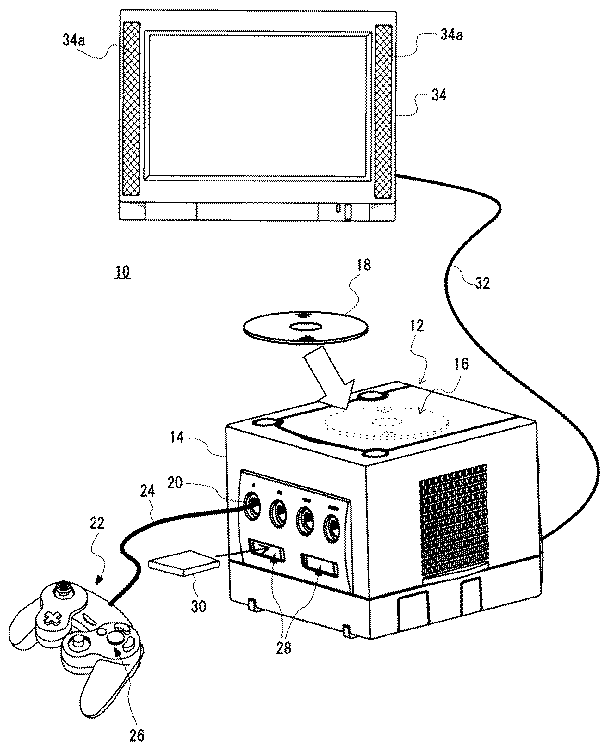  
[Drawing 2] 
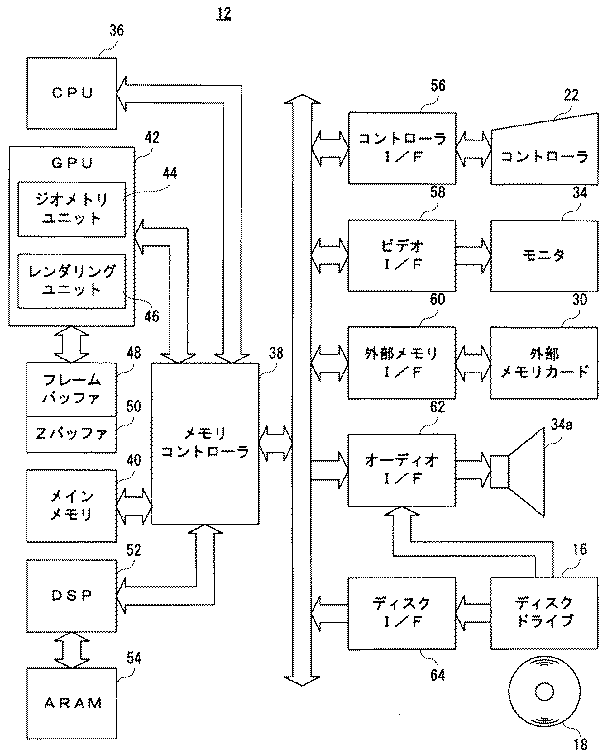  
[Drawing 3] 
  
[Drawing 4] 
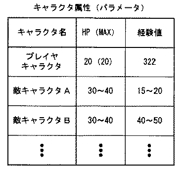  
[Drawing 5] 
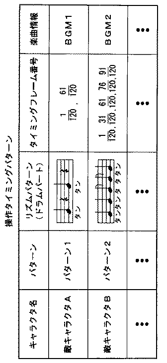  
[Drawing 6] 
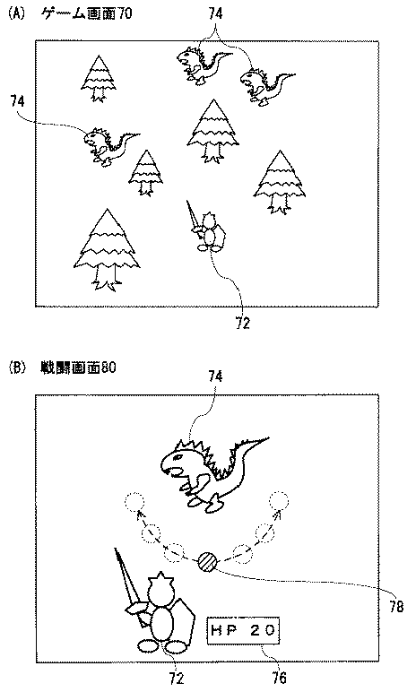  
[Drawing 7] 
  
[Drawing 8] 
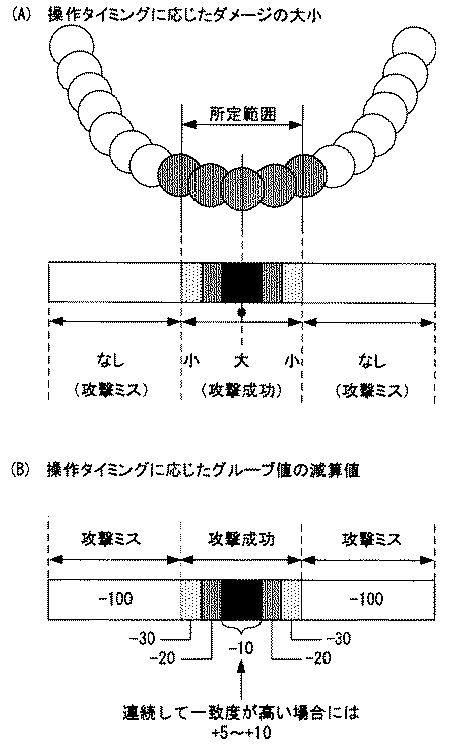  
[Drawing 9] 
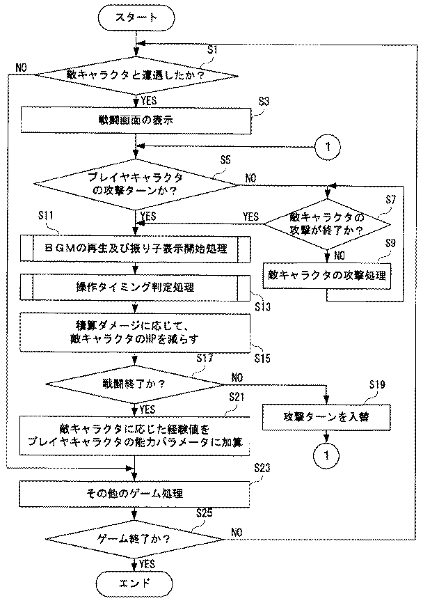  
[Drawing 10] 
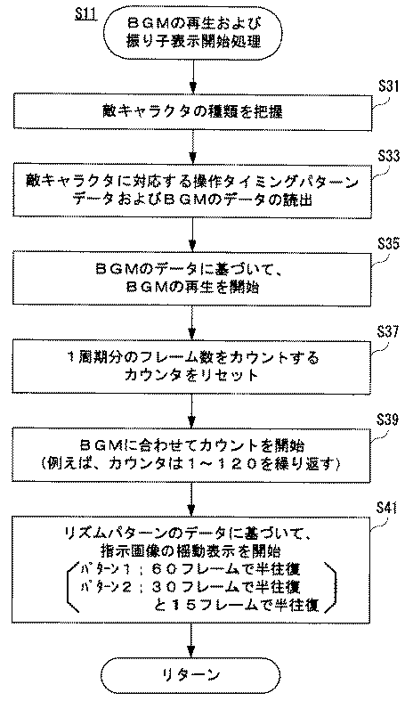  
[Drawing 11] 
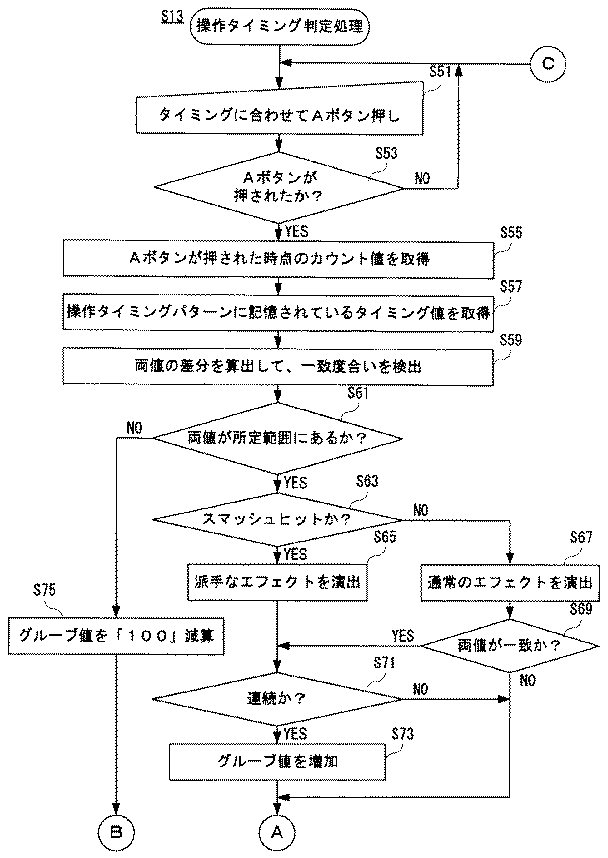  
[Drawing 12] 
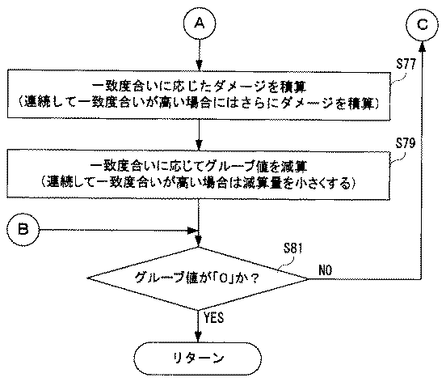  
[Drawing 13] 
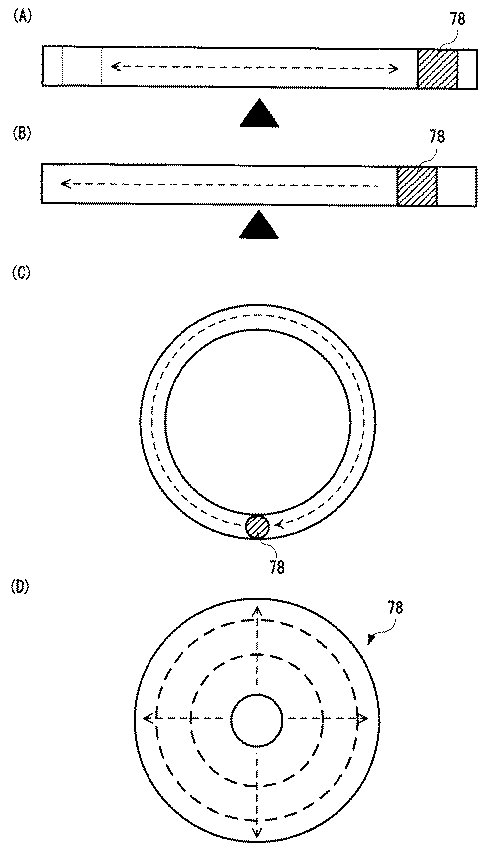  
[Drawing 14] 
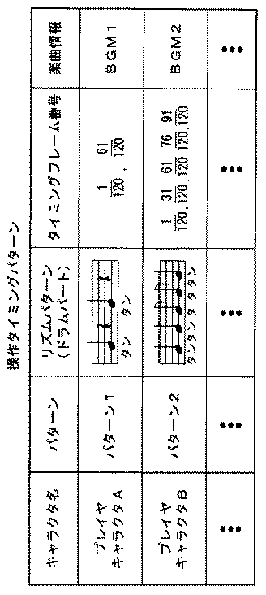  

