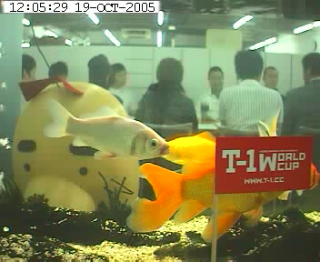


It began one mid-October day. From the back of the room, where it had been sitting since around the time of Mother 1+2's release, a Mr. Saturn figure appeared in front of the fish-cam set up on Shigesato Itoi's website. Is it a sign or mere coincidence that it happens to be moved during the same period of time as the announcements on Itoi's website? That has yet to be decided. What is clear, however, is that Mr. Saturn is meant to be seen. 
 
Usually, there is not much to behold save for a few goldfish swimming to and fro across the tank positioned at the head of the webcam's viewpoint. But the focal point as of late seems to point the beloved character of Mother 2/Earthbound. His presence become more acknowleged when the next day he was positioned to stare directly at the camera. 
 
He remained at his vantage point for approximately one week until he was taken away to make room for a bouquet of flowers. Some pumpkins were added a couple of days later, which soon became Jack-O-Lanterns for Halloween. But they, too, soon disappeared and left the fish by themselves. Was this the end of Mr. Saturn on the webcam? 
 
The answer is no! He made his return after Halloween with some warmers draped over his head. Could this possibly mean that Mother 3 info is coming this winter? The answer has yet to reveal itself!



<a href="webcamSaturn01.jpg">01</a> <a href="webcamSaturn02.jpg">02</a> <a href="webcamSaturn03.jpg">03</a> <a href="webcamSaturn04.jpg">04</a> <a href="webcamSaturn05.jpg">05</a> <a href="webcamSaturn06.jpg">06</a> <a href="webcamSaturn07.jpg">07</a> <a href="webcamSaturn08.jpg">08</a> <a href="webcamSaturn09.jpg">09</a> <a href="webcamSaturn10.jpg">10</a> 
<a href="webcamSaturn11.jpg">11</a> <a href="webcamSaturn12.jpg">12</a> <a href="webcamSaturn13.jpg">13</a> <a href="webcamSaturn14.jpg">14</a> <a href="webcamSaturn15.jpg">15</a> <a href="webcamSaturn16.jpg">16</a> <a href="webcamSaturn17.jpg">17</a> <a href="webcamSaturn18.jpg">18</a> <a href="webcamSaturn19.jpg">19</a> <a href="webcamSaturn20.jpg">20</a> 
<a href="webcamSaturn21.jpg">21</a> <a href="webcamSaturn22.jpg">22</a> <a href="webcamSaturn23.jpg">23</a> <a href="webcamSaturn24.jpg">24</a>



<a href="http://www.1101.com/otama/index.html">Webcam main page</a> 
<a href="http://www.1101.com/otama/auto.html">Auto-updating Webcam feed</a> 
<a href="http://www.1101.com/IMAGES/fullsize.jpg">Latest Webcam shot</a> 

