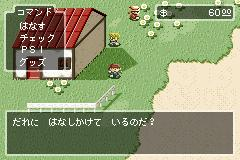
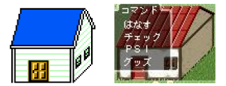
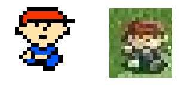
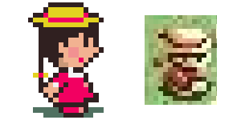
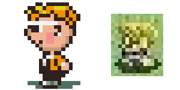


<ul class="pics">
<li>

<h3>The Screenshot</h3>
  

During November of 2004, a mysterious screenshot appeared on the Japanese side of the Internet. The screenshot bore a striking resemblance to the previous two MOTHER(EarthBound) games, especially the first.  The menu was basically a replication of MOTHER's. There were many other specific similarities. It is unknown where this screenshot originated. It is thought to be some sort of hoax or fan-made game, but its source was never verified.

</li>

<li>

<h3>The House</h3>
  

The building is very similar to buildings found in MOTHER, though the angle is slightly different. 

</li>

<li>

<h3>Main Character</h3>
  

The supposed main character from the screenshot looks very similar to Ninten, the main character of MOTHER.

</li>

<li>

<h3>The Girl</h3>
  

This girl looks very much like the girl picking mushrooms in Peaceful Rest Valley in MOTHER 2(EarthBound).

</li>

<li>

<h3>The Boy</h3>
  

The kid with glasses looks like this NPC from Earthbound(MOTHER 2) that appears in a few different locations.

</li>
</ul>

