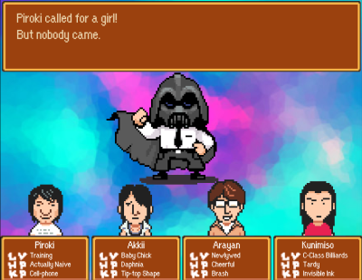



Shortly after Shigesato Itoi wrote about going to Kichijoji, where Brownie Brown is located, to work on "it" a flash animation appeared on Brownie Brown's website that featured a very Mother/Earthbound-like battle sequence. Four of Brownie Brown's staff members, in the likenesses of the chosen four, battled the N-Dude, a caped villain in a Darth Vader helmet. Memorable lines from Mother 2's battles were used and in the end, it featured a Game Over screen like Mother 2's where a spotlight shines over the collapsed main character.  
The battle animation is featured on the fifth page in a section of Brownie Brown's website simply titled "Project B." Numerous pages of project B refer to the Nintendo DS as well as Magical Vacation DS ~The Greatest Hypnotist~.  
This little animation got the attention of Edge Magazine, which featured a blurb about it that also mentioned starmen.net.



<a href="project5_jap.swf" target="_blank">Original animation</a> from Brownie Brown's Project B section - Thanks to <a href="http://forum.starmen.net/?t=usrinfo&amp;amp;id=4569" target="_blank">torankusu</a> 
<a href="projectb_eng_2.swf" target="_blank">Translated animation</a> - BIG thanks to <a href="http://forum.starmen.net/?t=usrinfo&amp;id=288">tomato</a> for translating it and <a href="http://forum.starmen.net/?t=usrinfo&amp;amp;id=4569" target="_blank">torankusu</a> for implementing it into the flash 
<a href="http://br2.co.jp/brownie/project/index.htm" target="_blank">Brownie Brown's Project B</a> section 
<a href="http://br2.co.jp/" target="blank">Brownie Brown's</a> homepage 
<a href="edgescan.jpg">Mention in Edge Magazine</a>

