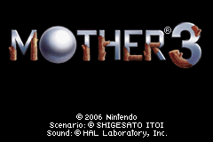



	  
	<table>
		<tr>
			<td class="label">Title:</td>
			<td>MOTHER 3 (JP)</td>
		</tr>
		<tr>
			<td class="label">System:</td>
			<td>Game Boy Advance</td>
		</tr>
		<tr>
			<td class="label">Genre:</td>
			<td>RPG</td>
		</tr>
		<tr>
			<td class="label">Release:</td>
			<td>April 20, 2006 (JP)</td>
		</tr>
		<tr>
			<td class="label">Rating:</td>
			<td>All Ages (JP)</td>
		</tr>
		<tr>
			<td class="label">Price:</td>
			<td>¥4800 (Regular Version) ¥18,000 (Deluxe Box)</td>
		</tr>
		<tr>
			<td class="label">Publisher:</td>
			<td>Nintendo</td>
		</tr>
		<tr>
			<td class="label">Developer:</td>
			<td>HAL Laboratories / Nintendo</td>
		</tr>
		<tr>
			<td class="label">Slogan:</td>
			<td>"Strange, funny, and heartrending." (JP)</td>
		</tr>
	</table>

MOTHER 3, the follow up to the fan-favorite RPG EarthBound(MOTHER 2) and third in the MOTHER series, is an RPG that breaks the mold used by the two previous games in the series. You won't find an imitation of America in this game, but you will find many familiar themes, a wonderfully written diaglogue, a unique cast of characters, a new rhythm-based battle system, and a gripping story described by MOTHER series creator Shigesato Itoi as Strange, funny, & heartrending. By the time you finish MOTHER 3 you will laugh, you will cry, and you won't want it to end.
  
Set in the Nowhere Islands, you start off this adventure on a remote island in an unusually utopian town called Tazmily. The people are friendly. Everyone knows each other. It's a lifestyle that many people can only dream of. But that dream slowly turns into a nightmare when one day explosions set the forest ablaze and the animals become more aggressive. From that on day things are never quite the same in Tazmily. The story unwinds and only becomes more intense as your party progresses through the ever-evolving environment.
  
Many new elements are intruced in this iteration of the series:
<ul>
<li>Multiple parties at different points in the story</li>
<li>Party diversity from a cowboy to a monkey to a tomboy princess</li>
<li>PSI will first be learned through key story events</li>
<li>Tell your memories to frogs you meet on your quest to save</li>
<li>In battle, increase your damage by unleashing a combo by pushing the A button to the beat</li>
<li>A rock band with a strong following</li>
<li>An army of soldiers in pig masks</li>
</ul>
Elements returning from the previous game:
<ul>
<li>Turn-based battles</li>
<li>Laugh-out-loud humor</li>
<li>Familiar foods as recovery items</li>
<li>Nostalgic character designs, though heavily updated to utilize the capabilites of the Game Boy Advance</li>
<li>An unbelievable amount of surprises!</li>
</ul>
MOTHER 3 began its development in the mid-90s. A sign posted in the town of Fourside in EarthBound stated that a meeting was in progress for a sequel. It was more than likely a joke at the time, but there was news of a game in the works slated for the Nintendo 64DD not too long after EarthBound's release. A video and playable demo were unveiled in 1999 at Nintendo's Spaceworld Event. A few screenshots, the demo footage, and two music samples are all that we ever got to see of that unreleased version of the game. It was cancelled due to development problems.
  
Shigesato Itoi shelved the game, but he didn't abandon the project. When commercials for the Game Boy Advance compilation MOTHER 1+2 started airing in Japan in the summer of 2003 they also included a teaser message stating that a new MOTHER game was in the works for Game Boy Advance. News about the game was slim until the fall of 2005 when Itoi started posting about travelling to work on a project on his website. The place he was going to was the location of development team Brownie Brown. Shortly thereafter Itoi opened a website for the Game Boy Advance version of MOTHER 3 and gave an estimate of the release for the summer of 2006.
  
The website, updated weekly, gave glimpses of the game and showed an RPG reminiscent of EarthBound, but clearly a fresh new title. The main character, Lucas, looked eerily similar to Ness, but everything and everyone else seemed completely new. Certain characters unveiled, such as Flint, showed that this game had something in common with the abandoned Nintendo 64 title. It was clear, through comparisons of screenshots, that much had changed in the time since the cancellation of the old title and the development of the new. Exactly how much was changed may never be known.
  
MOTHER 3 was basically the last hurrah in the Game Boy Advance's life in Japan. The DS was already released, so Nintendo's focus was changing. In that shift, MOTHER 3's localization chances diminished. The poor sales of EarthBound didn't help the situation either. Although the game sold fairly well in Japan and received excellent reviews, Nintendo has shown little interest in releasing the game outside of Japan.
  
MOTHER 3 content in Super Smash Bros. Brawl has shown us that Nintendo acknowledges the series, but the removal of the EarthBound demo which was featured in the Japanese version doesn't paint a bright future for the series. In the mean time, a team of dedicated fans have made it their mission to get a professional quality translation of MOTHER 3 to English-speaking gamers denied the privilege of playing this wonderful game. <a href="http://mother3.fobby.net/">The translation patch</a>, released on October 17, 2008 is currently the only way fans outside of Japan can fully enjoy the game without the assistance of a translation guide. Though the chances may be very slim, if Nintendo does decide to officially give us the game we are waiting for, we will willingly discontinue the distribution of the translation patch.
  
<i>Please note that for legal reasons, Starmen.Net does not distribute the MOTHER 3 ROM.</i>




<ul><li><a href="http://mother3.fobby.net"><b><u>MOTHER 3 Fan Translation Patch - Play MOTHER 3 in English!</u></b></a></li>

  <li><a href="http://walkthrough.starmen.net/mother3/">Starmen.Net MOTHER 3 Walkthrough</a> - Currently only through part of Chapter 2.</li>

  <li><a href="http://chasmang.googlepages.com/non-japaneseplayer%27sguidetomother3">Non-Japanese Player's Guide to MOTHER 3</a> - Explains how to play the game if you don't speak Japanese.</li>

  <li><a href="http://m3world.fobby.net/">World of MOTHER 3</a> - Similar to the guide above. Helpful if you don't know Japanese.</li>

  <li><a href="http://starmen.net/forum/?t=msg&th=22820">Tomato's Spoiler-Free Walkthrough</a></li> - A very bare-bones walkthrough. Also available on the Starmen.Net walkthrough.

  <li><a href="http://www.gamefaqs.com/portable/gbadvance/file/914622/42740">A Story Translation on GameFAQs</a> - By Spookychee - VERY good guide.</li>

</ul>



<table1 />
Section maintainer: 
<table2 />
<a href="https://forum.starmen.net/members/CerealQueen">CerealQueen</a> 
<table3 />

