
<a href="CH0/m3_LucasSleeping.png" title="Lucas is sleeping at Alec's House">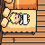</a>
<a href="CH0/m3_TalkingChicken.png" title="You can talk to all kinds of animals">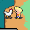</a>
<a href="CH0/m3_MemoryFrog.png" title="Frogs will record your memories, so you can resume your progress">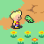</a>
<a href="CH0/m3_BButton.png" title="Try to imagine a thing called a B Button">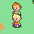</a>
<a href="CH0/m3_GentleDrago.png" title="Despite their appearance, Dragos are gentle creatures">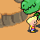</a>
<a href="CH0/m3_FirstBattle.png" title="Your first battle will be against an overconfident mole cricket">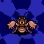</a>
<a href="CH0/m3_Omelets.png" title="Who wants Omelets?">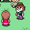</a>
<a href="CH0/m3_HeyYou.png" title="Sometimes the characters will give you direct advice">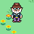</a>
<a href="CH0/m3_DearFlint.png" title="Hinawa sends a Letter to Flint">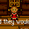</a>




<a href="CH1/m3_MysteriousPigmasks.png" title="A strange group of soldiers in Pig Masks have showed up in Sunshine Forest">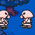</a>
<a href="CH1/m3_BrokenDoorknob.png" title="The doorknob seems to have broken off of this door">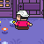</a>

<a href="CH1/m3_Map.png" title="You can check the map by pressing R">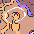</a>
<a href="CH1/m3_Sparrow.png" title="Humans aren't the only ones with helpful advice - chatting up sparrows will yield lots of useful info">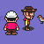</a>
<a href="CH1/m3_SmokyForest.png" title="Sunshine Forest is filling with smoke...and strange creatures">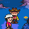</a>
<a href="CH1/m3_ForestSprings.png" title="A dip in the hot springs will restore that lost HP">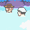</a>
<a href="CH1/m3_Fireflies.png" title="These are definitely not your average firfly - they're setting fire to everything">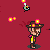</a>
<a href="CH1/m3_FireAttack.png" title="Fireflies will even set fire to you if you're not careful" >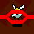</a>

<a href="CH1/m3_FuelInTrouble.png" title="Oh, no! Fuel is trapped in that burning house">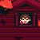</a>
<a href="CH1/m3_SneakYam.png" title="If you're lucky, you can sneak up on an enemy and attack it while its back is turned">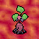</a>
<a href="CH1/m3_Rain.png" title="An ominous rain falls on Tazmily">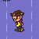</a>
<a href="CH1/m3_Boney.png" title="Boney joins up with Flint">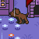</a>
<a href="CH1/m3_Antidotes.png" title="The people of Tazmily will gladly share what they have with their neighbors">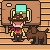</a>
<a href="CH1/m3_SnakePair.png" title="If given the chance, many foes will attack in groups">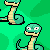</a>
<a href="CH1/m3_ClawMarks.png" title="What kind of a creature could have caused all this damage?">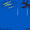</a>
<a href="CH1/m3_BoneySense.png" title="Boney senses something up above">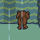</a>
<a href="CH1/m3_WallStaple.png" title="Boney senses something up above" >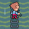</a>
<a href="CH1/m3_Caribou.png" title="What are those Pigmasks doing to that caribou?">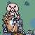</a>
<a href="CH1/m3_OpenSea.png" title="The sea is so clear during the day">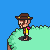</a>
<a href="CH1/m3_Nutbread.png" title="You can trade nuts you find for Nut Bread and Cookies">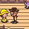</a>
<a href="CH1/m3_Cows.png" title="All kinds of wildlife can be found in Tazmily - try talking to all of them">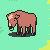</a>
<a href="CH1/m3_EXP.png" title="The experience you gain in battle will help you grow stronger">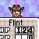</a>
<a href="CH1/m3_SootDumpling.png" title="Some enemies are rarer encounters than others">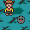</a>
<a href="CH1/m3_Surprised.png" title="If you're not careful, an enemy may catch you off guard">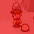</a>
<a href="CH1/m3_Alec.png" title="Alec will lend a hand to Flint, though he isn't much help in battle">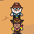</a>
<a href="CH1/m3_10combo.png" title="Tap the A button to the beat of the music to rack up a damaging combo in battle">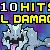</a>
<a href="CH1/m3_ShellHouse.png" title="This house looks kind of familiar, doesn't it?">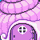</a>
<a href="CH1/m3_Magypsies.png" title="The Magypsies are a strange bunch - They posses PSI abilities">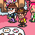</a>

<a href="CH1/m3_PigCraft.png" title="The pigmasks fly away in a strange vessel">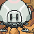</a>

<a href="CH1/m3_discovery.png" title="What have we here...?">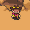</a>




<a href="CH2/m3_ItsTime.png" title="Wess sends Duster on a mission">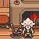</a>
<a href="CH2/m3_ThiefItems.png" title="Duster uses some unique items to aid him in battle">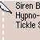</a>
<a href="CH2/m3_Bridge.png" title="Tazmily is very quiet at night">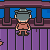</a>
<a href="CH2/m3_PeddlerMonkey.png" title="Duster bumps into a peculiar peddler and his monkey">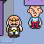</a>
<a href="CH2/m3_Money.png" title="Up until now, Tazmily has run without money, but Butch has just come into contact with a large sack full">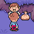</a>
<a href="CH2/m3_PigDropping.png" title="An aircraft is dropping something onto Osohe Castle">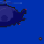</a>
<a href="CH2/m3_Zombies.png" title="Zombies are emerging from six feet under and surrounding Duster">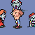</a>
<a href="CH2/m3_Nippolyte.png" title="Nippolyte is heading into his shack">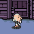</a>
<a href="CH2/m3_Spineless.png" title="Some of your enemies have more bark than bite">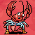</a>
<a href="CH2/m3_DusterCheese.png" title="Duster loves cheese">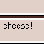</a>

<a href="CH2/m3_WallStapleInside.png" title="Wall Staples can be applied to any wall that looks scalable">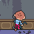</a>


























