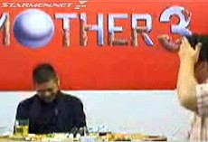
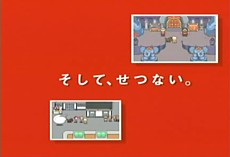
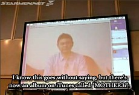


<ul class="pics">
<li>

<h3>MOTHER 3 Commercial #1 (Heartrending)</h3>

<a href="http://www.imdb.com/name/nm0793069/?fr=c2l0ZT1kZnx0dD0xfGZiPXV8cG49MHxrdz0xfHE9S291IFNoaWJhc2FraXxmdD0xfG14PTIwfGxtPTUwMHxjbz0xfGh0bWw9MXxubT0x;fc=1;ft=20">Kou Shibasaki</a> tells how MOTHER 3 affected her in many different ways.

<a href="http://www.youtube.com/watch?v=z8YaKuWLvGs">View streaming video</a> <a href="m3com1_subbed.avi">Download the AVI</a> (1.8 MB, 0:30)

</li>

<li>

<h3>MOTHER 3 Commercial #2 (Villain)</h3>

Kou Shibasaki hints at some of the darker sides of MOTHER 3.

<a href="http://www.youtube.com/watch?v=MJ-j6HLnDv8">View streaming video</a> <a href="m3com2_subbed.avi">Download the AVI</a> (904 KB, 0:15)

</li>

<li>

<h3>MOTHER 3 Commercial #3 (Crying)</h3>

Kou Shibasaki cries just remembering parts of MOTHER 3.

<a href="http://www.youtube.com/watch?v=4BnlFyZcOlo">View streaming video</a> <a href="m3com3_subbed.avi">Download the AVI</a> (970 KB, 0:15)

</li>

<li>

<h3>MOTHER 3 Commercial #4 (Dance)</h3>

Kou Shibasaki takes the good with the bad.

<a href="http://www.youtube.com/watch?v=-ehNvdLZRME">View streaming video</a> <a href="m3com4_subbed.avi">Download the AVI</a> (1.2 MB, 0:14)

</li>

<li>

<h3>MOTHER 3 Commercial #5 (Princess)</h3>

Kou Shibasaki discusses her fondness for MOTHER 3's characters.

<a href="http://www.youtube.com/watch?v=DieCdv-rgMA">View streaming video</a> <a href="m3com5_subbed.avi">Download the AVI</a> (1.1 MB, 0:15)

</li>

<li>

<h3>Live MOTHER 3 Chat</h3>

The day before MOTHER 3 was released, Shigesato Itoi, <a href="http://www.imdb.com/name/nm1097423/filmoyear">Hikaru Ijuin</a>, and <a href="http://en.wikipedia.org/wiki/Kawakami_Hiromi">Hiromi Kawakami</a> sat down to discuss the MOTHER series and MOTHER 3. Most of the time was spent off-topic, however. There are some funny and interesting moments in here, though. It's not subtitled, so view at your own risk.

<a href="http://video.google.com/videoplay?docid=-6283516220137404457&hl=en">View streaming video</a> <a href="1101.asf">Download the ASF</a> (85.9 MB, ~2 hours)

</li>

<li>

<h3>Itoi on MOTHER 4</h3>

During the 2-hour MOTHER 3 chat (see above), EarthBound creator Shigesato Itoi said he won't be making a fourth game in the MOTHER series.

<a href="http://www.youtube.com/watch?v=z9ebFsRCFTc">View streaming video</a> <a href="m3chat_m4talk.avi">Download the AVI</a> (605 KB, 0:10)

</li>

<li>

<h3>MOTHER 3 Promotional Video</h3>

This video was shown in stores before and during MOTHER 3's release in Japan. You can even see it <a href="/merchandise/images/m3poster_store1.jpg">here</a>!

<a href="http://www.youtube.com/watch?v=CCnwBtI3iaY">View streaming video</a> <a href="m3_promo.avi">Download the AVI</a> (2.4 MB, 0:38)

</li>

<li>

<h3>Itoi's MOTHER 3 Video</h3>

This is the video found on Shigesato Itoi's MOTHER 3 site. It's meant to show people what MOTHER 3 is like, and what to expect from it. It's pretty nice, and also showcases plenty of MOTHER 3 music along the way. Naturally, <b>EXPECT SPOILERS!</b>

<a href="http://www.youtube.com/watch?v=kQKe3M6T98M">View streaming video</a> <a href="m3_1101vid.avi">Download the AVI</a> (16.0 MB, 3:21)

</li>

<li>

<h3>Itoi Discusses MOTHER3i</h3>

On Oct. 28, 2006, an official MOTHER 3 & MOTHER3i event took place in Japan. Itoi didn't attend, but he did record a message that was played there.  Thanks to MOTHER Party for a transcription - trying to understand that audio is crazy!

<a href="http://www.youtube.com/watch?v=-gYu1OwFCG0">View streaming video</a> <a href="m3i_itoi.avi">Download the AVI</a> (9.0 MB, 1:39)

</li>

<li>

<h3>Reggie Answers Question about MOTHER 3</h3>

About a week after MOTHER 3 was released in Japan, Reggie was asked about any plans to bring the game to America. His answer is expected, but it also sounds like he didn't know very much about the MOTHER / EB series at the time. Here's hoping he's studied up more since then.

<a href="http://www.youtube.com/watch?v=bmHvEQFkEQg">View streaming video</a> <a href="m3_reggie.avi">Download the AVI</a> (1.6 MB, 0:09)

</li>

</ul>

