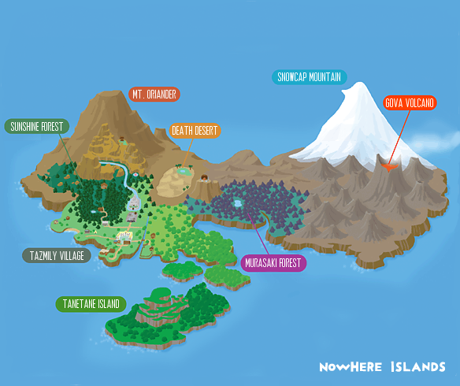






<ul>
<li><a href="http://starmen.net/mother3/walkthroughs/maps/Chapter%201%20Maps/Oriander%20Plateau%20and%20Stomping%20Grounds.png">Oriander Plateau and Stomping Grounds</a></li>
<li><a href="http://starmen.net/mother3/walkthroughs/maps/Chapter%201%20Maps/Tazmily%20Square%20and%20South%20Shore.png">Tazmily Square and South Shore</a></li>
<li><a href="http://starmen.net/mother3/walkthroughs/maps/Chapter%201%20Maps/Cross%20Road.png">Cross Road</a></li>
<li><a href="http://starmen.net/mother3/walkthroughs/maps/Chapter%201%20Maps/Sunshine%20Forest%20(on%20fire).png">Sunshine Forest (on fire)</a></li>
<li><a href="http://starmen.net/mother3/walkthroughs/maps/Chapter%201%20Maps/Forest%20Grotto%20(smoke).png">Isaac's house and Hot Spring (smoke from fire)</a></li>
<li><a href="http://starmen.net/mother3/walkthroughs/maps/Chapter%201%20Maps/Sunshine%20Forest%20(cabin%20destroyed).png">Sunshine Forest (on fire) (cabin destroyed)</a></li>
<li><a href="http://starmen.net/mother3/walkthroughs/maps/Chapter%201%20Maps/Sunshine%20Forest%20(after%20fire).png">Sunshine Forest (after fire)</a></li>
<li><a href="http://starmen.net/mother3/walkthroughs/maps/Chapter%201%20Maps/Oriander%20Cliffs1.png">Oriander Cliffs (before Wall Staple)</a></li>
<li><a href="http://starmen.net/mother3/walkthroughs/maps/Chapter%201%20Maps/Oriander%20Cliffs2.png">Oriander Cliffs (after fallen tree removed)</a></li>
<li><a href="http://starmen.net/mother3/walkthroughs/maps/Chapter%201%20Maps/Sunset%20Cemetary%20and%20Osohe%20Castle.png"> Cemetery and Graveyard</a></li>
<li><a href="http://starmen.net/mother3/walkthroughs/maps/Chapter%201%20Maps/Forest%20Grotto%20and%20Kokori%20Hot%20Spring.png">Isaac's House and Hot Spring</a></li>
<li><a href="http://starmen.net/mother3/walkthroughs/maps/Chapter%201%20Maps/Cerulean%20Beach.png">Cerulean Beach and Jail</a></li>
<li><a href="http://starmen.net/mother3/walkthroughs/maps/Chapter%201%20Maps/East%20Tazmily.png">East Tazmily</a></li>
<li><a
href="http://starmen.net/mother3/walkthroughs/maps/Chapter%201%20Maps/Sunshine%20Valley%20and%20Oriander%20Plateau.png">Sunshine Valley and Alec’s House</a></li>
<li><a href="http://starmen.net/mother3/walkthroughs/maps/Chapter%201%20Maps/Sunshine%20Valley%20and%20Aeolia's%20House.png">Sunshine Valley and Aeolia's House</a></li>
<li><a href="http://starmen.net/mother3/walkthroughs/maps/Chapter%201%20Maps/Murki%20Cave.png">Murki Cave</a></li>
<li><a href="http://starmen.net/mother3/walkthroughs/maps/Chapter%201%20Maps/Cave%20Passage.png">Cave Passage</a></li>
<li><a href="http://starmen.net/mother3/walkthroughs/maps/Chapter%201%20Maps/Oriander%20Canyon%20and%20Drago%20Plateau.png">Drago Plateau</a></li>
</ul>



<ul>
<li><a href="http://starmen.net/mother3/walkthroughs/maps/Chapter%202%20Maps/Sunset%20Cemetary%20and%20Osohe%20Castle2.png">Sunset Cemetery and Osohe Castle (before Pigmasks)</a></li>
<li><a href="http://starmen.net/mother3/walkthroughs/maps/Chapter%202%20Maps/Osohe%20Tunnel.png">Osohe Tunnel</a></li>
<li><a href="http://starmen.net/mother3/walkthroughs/maps/Chapter%202%20Maps/Balcony%20Entrance.png">Balcony Entrance</a></li>
<li><a href="http://starmen.net/mother3/walkthroughs/maps/Chapter%202%20Maps/First%20Floor.png">1st Floor</a></li>
<li><a href="http://starmen.net/mother3/walkthroughs/maps/Chapter%202%20Maps/Osohe%20Cellar1.png">Osohe Cellar</a></li>
<li><a href="http://starmen.net/mother3/walkthroughs/maps/Chapter%202%20Maps/Second%20Floor.png">2nd Floor (before Pigmasks)</a></li>
<li><a href="http://starmen.net/mother3/walkthroughs/maps/Chapter%202%20Maps/Third%20Floor.png">3rd Floor</a></li>
<li><a href="http://starmen.net/mother3/walkthroughs/maps/Chapter%202%20Maps/Fourth%20Floor.png">4th Floor</a></li>
<li><a href="http://starmen.net/mother3/walkthroughs/maps/Chapter%202%20Maps/Cross%20Road2.png">Cross Road (after Pigmasks)</a></li>
<li><a href="http://starmen.net/mother3/walkthroughs/maps/Chapter%202%20Maps/Sunset%20Cemetary%20and%20Osohe%20Castle3.png">Sunset Cemetery and Osohe Castle (after Pigmasks</a></li>
<li><a href="http://starmen.net/mother3/walkthroughs/maps/Chapter%202%20Maps/Second%20Floor--after%20Pigmasks.png">2nd floor (after Pigmasks)</a></li>
<li><a href="http://starmen.net/mother3/walkthroughs/maps/Chapter%202%20Maps/Fifth--Sixth--Seventh%20Floor.png">5th, 6th and 7th floors</a></li>
<li><a href="http://starmen.net/mother3/walkthroughs/maps/Chapter%202%20Maps/Eighth--Ninth%20Floor.png">8th and 9th floors</a></li>
<li><a href="http://starmen.net/mother3/walkthroughs/maps/Chapter%202%20Maps/Falling_extra.png">Map used in the falling scene</a></li>
</ul>



<ul>
<li><a href="http://starmen.net/mother3/walkthroughs/maps/Chapter%203%20Maps/Death%20Desert_complete.png">Death Desert</a></li>
<li><a href="http://starmen.net/mother3/walkthroughs/maps/Chapter%203%20Maps/Underground%20Passage.png">Underground Passage</a></li>
<li><a href="http://starmen.net/mother3/walkthroughs/maps/Chapter%203%20Maps/Underground%20Tunnel.png">Underground Tunnel</a></li>
<li><a href="http://starmen.net/mother3/walkthroughs/maps/Chapter%203%20Maps/Osohe%20Crypt_before%20lever.png">Osohe Crypt (before pulling lever)</a></li>
<li><a href="http://starmen.net/mother3/walkthroughs/maps/Chapter%203%20Maps/Osohe%20Crypt_lever%20pulled.png">Osohe Crypt (after pulling lever)</a></li>
</ul>



<ul>
<li><a href="http://starmen.net/mother3/walkthroughs/maps/Chapter%204%20Maps/Tazmily%20Village%20and%20South%20Shore_modern.png">Tazmily Village and South Shore (modern)</a></li>
<li><a href="http://starmen.net/mother3/walkthroughs/maps/Chapter%204%20Maps/Tazmily%20Village_modern_interiors.png">Tazmily Village (modern) (interiors)</a></li>
<li><a href="http://starmen.net/mother3/walkthroughs/maps/Chapter%204%20Maps/Cerulean%20Beach_modern.png">Cerulean Beach (modern)</a></li>
<li><a href="http://starmen.net/mother3/walkthroughs/maps/Chapter%204%20Maps/Cerulean%20Beach_modern_interiors.png">Cerulean Beach (modern) (interiors)</a></li>
<li><a href="http://starmen.net/mother3/walkthroughs/maps/Chapter%204%20Maps/East%20Tazmily_Training%20Grounds.png">East Tazmily Training Grounds</a></li>
<li><a href="http://starmen.net/mother3/walkthroughs/maps/Chapter%204%20Maps/Training%20Grounds_interior.png">Training Grounds Interior</a></li>
<li><a href="http://starmen.net/mother3/walkthroughs/maps/Chapter%204%20Maps/Eighth--Ninth%20Floor.png">Osohe Castle 8th & 9th Floors</a></li>
<li><a href="http://starmen.net/mother3/walkthroughs/maps/Chapter%204%20Maps/Forest%20Grotto%20and%20Kokori%20Hot%20Spring_modern.png">Forest Grotto and Kokori Hot Spring (modern)</a></li>
<li><a href="http://starmen.net/mother3/walkthroughs/maps/Chapter%204%20Maps/Sunshine%20Forest_modern.png">Sunshine Forest (modern)</a></li>
<li><a href="http://starmen.net/mother3/walkthroughs/maps/Chapter%204%20Maps/Isaac's%20house.png">Isaac's House</a></li>
<li><a href="http://starmen.net/mother3/walkthroughs/maps/Chapter%204%20Maps/Lighter's%20house_inprogress.png">Lighter's House</a></li>
<li><a href="http://starmen.net/mother3/walkthroughs/maps/Chapter%204%20Maps/Sunshine%20Valley%20and%20Oriander%20Plateau_house%20destroyed.png">Sunshine Valley and Oriander Plateau (Alec's house destroyed)</a></li>
<li><a href="http://starmen.net/mother3/walkthroughs/maps/Chapter%204%20Maps/Cross%20Road%20Station%20and%20Sunset%20Cemetary.png">Cross Road Station and Sunset Cemetary</a></li>
<li><a href="http://starmen.net/mother3/walkthroughs/maps/Chapter%204%20Maps/Train%20Tunnel_West%20End.png">Train Tunnel West</a></li>
<li><a href="http://starmen.net/mother3/walkthroughs/maps/Chapter%204%20Maps/Butterfly%20Springs.png">Butterfly Springs</a></li>
<li><a href="http://starmen.net/mother3/walkthroughs/maps/Chapter%204%20Maps/Train%20Tunnel_East%20End.png">Train Tunnel East</a></li>
<li><a href="http://starmen.net/mother3/walkthroughs/maps/Chapter%204%20Maps/East%20End%20Station%20and%20Clayman%20Factory%20Grounds.png">East End Station and Clayman Factory Grounds</a></li>
<li><a href="http://starmen.net/mother3/walkthroughs/maps/Chapter%204%20Maps/Factory%20Level.png">Factory Level</a></li>
<li><a href="http://starmen.net/mother3/walkthroughs/maps/Chapter%204%20Maps/Clay%20Mines.png">Clay Mines</a></li>
<li><a href="http://starmen.net/mother3/walkthroughs/maps/Chapter%204%20Maps/Titiboo%20Ropeway%20and%20Forest%20Waterfall.png">Titiboo Ropeway and Forest Waterfall</a></li>
<li><a href="http://starmen.net/mother3/walkthroughs/maps/Chapter%204%20Maps/Chimera%20Lab.png">Chimera Lab</a></li>
<li><a href="http://starmen.net/mother3/walkthroughs/maps/Chapter%204%20Maps/Club%20Titiboo_outside.png">Club Titiboo Outside</a></li>
<li><a href="http://starmen.net/mother3/walkthroughs/maps/Chapter%204%20Maps/Club%20Titiboo_inside.png">Club Titiboo Inside</a></li>
<li><a href="http://starmen.net/mother3/walkthroughs/maps/Chapter%204%20Maps/Titiboo%20Tunnel.png">Titiboo Tunnel</a></li>
<li><a href="http://starmen.net/mother3/walkthroughs/maps/Chapter%204%20Maps/Club%20Titiboo_backstage.png">Club Titiboo Backstage</a></li>
<li><a href="http://starmen.net/mother3/walkthroughs/maps/Chapter%204%20Maps/Club%20Titiboo_attic.png">Club Titiboo Attic</a></li>
</ul>



<ul>
<li><a href="http://starmen.net/mother3/walkthroughs/maps/Chapter%205%20Maps/Forest%20Waterfall.png">Forest Waterfall</a></li>
<li><a href="http://starmen.net/mother3/walkthroughs/maps/Chapter%205%20Maps/Unknown%20Valley.png">Unknown Valley</a></li>
<li><a href="http://starmen.net/mother3/walkthroughs/maps/Chapter%205%20Maps/Pothole%20Cavern.png">Pothole Cavern</a></li>
<li><a href="http://starmen.net/mother3/walkthroughs/maps/Chapter%205%20Maps/Thunder%20Warehouse_interior.png">Warehouse Interior</a></li>
<li><a href="http://starmen.net/mother3/walkthroughs/maps/Chapter%205%20Maps/Pork%20Highway%20System_South.png">Pork Highway System South</a></li>
<li><a href="http://starmen.net/mother3/walkthroughs/maps/Chapter%205%20Maps/Pork%20Highway%20System_West.png">Pork Highway System West</a></li>
<li><a href="http://starmen.net/mother3/walkthroughs/maps/Chapter%205%20Maps/Pork%20Highway%20System_North.png">Pork Highway System North</a></li>
<li><a href="http://starmen.net/mother3/walkthroughs/maps/Chapter%205%20Maps/Highway%20Cafe_interior.png">Highway Cafe Interior</a></li>
<li><a href="http://starmen.net/mother3/walkthroughs/maps/Chapter%205%20Maps/Pork%20Highway%20System_East.png">Pork Highway System East</a></li>
<li><a href="http://starmen.net/mother3/walkthroughs/maps/Chapter%205%20Maps/Thunder%20Tower_interiors.png">Thunder Tower Interiors</a></li>
<li><a href="http://starmen.net/mother3/walkthroughs/maps/Chapter%205%20Maps/Tower%20Scaffolding%20and%20Playroom.png">Tower Scaffolding and Playroom</a></li>
<li><a href="http://starmen.net/mother3/walkthroughs/maps/Chapter%205%20Maps/Electric%20Platforms%20and%20Generator%20Room.png">Electric Platforms and Generator Room</a></li>
<li><a href="http://starmen.net/mother3/walkthroughs/maps/Chapter%205%20Maps/Tower%20Apex.png">Tower Apex</a></li>
</ul>



<ul>
<li><a href="http://starmen.net/mother3/walkthroughs/maps/Chapter%206%20Maps/Chapter%206%20Sunflower%20Fields.png">Sunflower Fields</a></li>
</ul>



<ul>
<li><a href="http://starmen.net/mother3/walkthroughs/maps/Chapter%207%20Maps/Retirement%20Home.png">Retirement Home</a></li>
<li><a href="http://starmen.net/mother3/walkthroughs/maps/Chapter%207%20Maps/Osohe%20Catacombs.png">Osohe Catacombs</a></li>
<li><a href="http://starmen.net/mother3/walkthroughs/maps/Chapter%207%20Maps/Osohe%20Courtyard.png">Osohe Courtyard</a></li>
<li><a href="http://starmen.net/mother3/walkthroughs/maps/Chapter%207%20Maps/Osohe%20Crypt.png">Osohe Crypt</a></li>
<li><a href="http://starmen.net/mother3/walkthroughs/maps/Chapter%207%20Maps/Chimera%20Lab.png">Chimera Lab</a></li>
<li><a href="http://starmen.net/mother3/walkthroughs/maps/Chapter%207%20Maps/Chimera%20Lab_first%20floor.png">Chimera Lab First Floor</a></li>
<li><a href="http://starmen.net/mother3/walkthroughs/maps/Chapter%207%20Maps/Chimera%20Lab_lower%20level.png">Chimera Lab Lower Level</a></li>
<li><a href="http://starmen.net/mother3/walkthroughs/maps/Chapter%207%20Maps/Chimera%20Lab_second%20floor.png">Chimera Lab Second Floor</a></li>
<li><a href="http://starmen.net/mother3/walkthroughs/maps/Chapter%207%20Maps/Chimera%20Lab_third%20floor.png">Chimera Lab Third Floor</a></li>
<li><a href="http://starmen.net/mother3/walkthroughs/maps/Chapter%207%20Maps/Doria's%20House.png">Doria's House</a></li>
<li><a href="http://starmen.net/mother3/walkthroughs/maps/Chapter%207%20Maps/Doria's%20House_interior.png">Doria's House (interior)</a></li>
<li><a href="http://starmen.net/mother3/walkthroughs/maps/Chapter%207%20Maps/Doria's%20House_needle%20removed.png">Doria's House (needle removed)</a></li>
<li><a href="http://starmen.net/mother3/walkthroughs/maps/Chapter%207%20Maps/Mole%20Cricket%20Hole_complete.png">Mole Cricket Hole</a></li>
<li><a href="http://starmen.net/mother3/walkthroughs/maps/Chapter%207%20Maps/Snowcap%20Sanctuary.png">Snowcap Mountain</a></li>
<li><a href="http://starmen.net/mother3/walkthroughs/maps/Chapter%207%20Maps/Lydia's%20House_interior.png">Lydia's House (interior)</a></li>
<li><a href="http://starmen.net/mother3/walkthroughs/maps/Chapter%207%20Maps/Snowcap%20Mountain%20Slopes.png">Snowcap Mountain Slopes</a></li>
<li><a href="http://starmen.net/mother3/walkthroughs/maps/Chapter%207%20Maps/Saturn%20Valley.png">Saturn Valley</a></li>
<li><a href="http://starmen.net/mother3/walkthroughs/maps/Chapter%207%20Maps/Saturn%20Valley_interiors.png">Saturn Valley (interior)</a></li>
<li><a href="http://starmen.net/mother3/walkthroughs/maps/Chapter%207%20Maps/Gova%20Sanctuary%20and%20Volcano%20Gorge.png">Gova Sanctuary and Volcano Gorge</a></li>
<li><a href="http://starmen.net/mother3/walkthroughs/maps/Chapter%207%20Maps/Phrygia's%20House_interior.png">Phrygia's House (interior)</a></li>
<li><a href="http://starmen.net/mother3/walkthroughs/maps/Chapter%207%20Maps/Gova%20Volcano%20Crater.png">Gova Volcano Crater</a></li>
<li><a href="http://starmen.net/mother3/walkthroughs/maps/Chapter%207%20Maps/Cerlean%20Sea%20Floor_North%20Shoreline.png">Cerulean Seafloor (North Shoreline)</a></li>
<li><a href="http://starmen.net/mother3/walkthroughs/maps/Chapter%207%20Maps/Cerulean%20Sea%20Floor_North%20Seabed%20and%20Central%20Abyss.png">Cerulean Seafloor (North Seabed and Central Abyss)</a></li>
<li><a href="http://starmen.net/mother3/walkthroughs/maps/Chapter%207%20Maps/Cerulean%20Sea%20Floor_South%20Seabed.png">Cerulean Seafloor (South Seabed)</a></li>
<li><a href="http://starmen.net/mother3/walkthroughs/maps/Chapter%207%20Maps/Cerulean%20Sea%20Floor_South%20Shoreline.png">Cerulean Seafloor (South Shoreline)</a></li>
<li><a href="http://starmen.net/mother3/walkthroughs/maps/Chapter%207%20Maps/Tanetane%20Jungle_real.png">Tanetane Jungle</a></li>
<li><a href="http://starmen.net/mother3/walkthroughs/maps/Chapter%207%20Maps/Tanetane%20Jungle_mushrooms.png">Tanetane Jungle (mega high!)</a></li>
<li><a href="http://starmen.net/mother3/walkthroughs/maps/Chapter%207%20Maps/Mixolydia's%20House_interior.png">Mixolydia's House (interior)</a></li>
<li><a href="http://starmen.net/mother3/walkthroughs/maps/Chapter%207%20Maps/Tanetane%20Cavern%20and%20Tanetane%20Bluffs.png">Tanetane Cavern and Tanetane Bluffs</a></li>
<li><a href="http://starmen.net/mother3/walkthroughs/maps/Chapter%207%20Maps/Argilla%20Pass%20and%20Sunshine%20Valley.png">Argilla Pass and Sunshine Valley</a></li>
<li><a href="http://starmen.net/mother3/walkthroughs/maps/Chapter%207%20Maps/Argilla%20Cliffs%20and%20Argilla%20Hot%20Springs.png">Argilla Cliffs and Argilla Hot Springs</a></li>
<li><a href="http://starmen.net/mother3/walkthroughs/maps/Chapter%207%20Maps/Outland%20Dungeon.png">Outland Dungeon</a></li>
<li><a href="http://starmen.net/mother3/walkthroughs/maps/Chapter%207%20Maps/Argilla%20Sanctuary%20and%20Chupichupyoi%20Temple.png">Argilla Sanctuary and Chupichupyoi Temple</a></li>
<li><a href="http://starmen.net/mother3/walkthroughs/maps/Chapter%207%20Maps/Ionia's%20House_interior.png">Ionia's House (interior)</a></li>
<li><a href="http://starmen.net/mother3/walkthroughs/maps/Chapter%207%20Maps/Chupichupyoi%20Temple_interior.png">Chupichupyoi Temple (interior)</a></li>
</ul>



<ul>
<li><a href="http://starmen.net/mother3/walkthroughs/maps/Chapter%208%20Maps/Chupichupyoi%20Temple%20and%20King%20P%20Limo.png">Chupichupyoi Temple and  King P. Limo</a></li>
<li><a href="http://starmen.net/mother3/walkthroughs/maps/Chapter%208%20Maps/New%20Pork%20City.png">New Pork City</a></li>
<li><a href="http://starmen.net/mother3/walkthroughs/maps/Chapter%208%20Maps/Beauty%20and%20Tasty%20Shop_interior.png">Beauty and Tasty Shop (interior)</a></li>
<li><a href="http://starmen.net/mother3/walkthroughs/maps/Chapter%208%20Maps/New%20Pork%20Theater.png">New Pork Theater</a></li>
<li><a href="http://starmen.net/mother3/walkthroughs/maps/Chapter%208%20Maps/New%20Pork%20Arcade_interior.png">New Pork Arcade (interior)</a></li>
<li><a href="http://starmen.net/mother3/walkthroughs/maps/Chapter%208%20Maps/New%20Pork%20Sewers.png">New Pork Sewers</a></li>
<li><a href="http://starmen.net/mother3/walkthroughs/maps/Chapter%208%20Maps/Pork%20Tower%20Lobby.png">Pork Tower Lobby</a></li>
<li><a href="http://starmen.net/mother3/walkthroughs/maps/Chapter%208%20Maps/DCMC%20theater%20level.png">DCMC Theater level</a></li>
<li><a href="http://starmen.net/mother3/walkthroughs/maps/Chapter%208%20Maps/Hippo%20Spa.png">Hippo Spa</a></li>
<li><a href="http://starmen.net/mother3/walkthroughs/maps/Chapter%208%20Maps/Harem%20Suite.png">Harem Suite</a></li>
<li><a href="http://starmen.net/mother3/walkthroughs/maps/Chapter%208%20Maps/Bathrooms_complete.png">The Bathrooms</a></li>
<li><a href="http://starmen.net/mother3/walkthroughs/maps/Chapter%208%20Maps/Desert%20Shell.png">Desert Shell</a></li>
<li><a href="http://starmen.net/mother3/walkthroughs/maps/Chapter%208%20Maps/Locria's%20House.png">Locria's House</a></li>
<li><a href="http://starmen.net/mother3/walkthroughs/maps/Chapter%208%20Maps/Building%20Site%201.png">Building Site Part 1</a></li>
<li><a href="http://starmen.net/mother3/walkthroughs/maps/Chapter%208%20Maps/Building%20Site%202.png">Building Site Part 2</a></li>
<li><a href="http://starmen.net/mother3/walkthroughs/maps/Chapter%208%20Maps/Laboratory.png">Laboratory</a></li>
<li><a href="http://starmen.net/mother3/walkthroughs/maps/Chapter%208%20Maps/Game%20Show%20Part%201.png">Game Show Part 1</a></li>
<li><a href="http://starmen.net/mother3/walkthroughs/maps/Chapter%208%20Maps/Game%20Show%20Part%202.png">Game Show Part 2</a></li>
<li><a href="http://starmen.net/mother3/walkthroughs/maps/Chapter%208%20Maps/Game%20Show%20Part%203.png">Game Show Part 3</a></li>
<li><a href="http://starmen.net/mother3/walkthroughs/maps/Chapter%208%20Maps/Porky's%20Sanctum.png">Porky's Sanctum</a></li>
<li><a href="http://starmen.net/mother3/walkthroughs/maps/Chapter%208%20Maps/Museum%20Ride.png">Museum Ride</a></li>
<li><a href="http://starmen.net/mother3/walkthroughs/maps/Chapter%208%20Maps/Porky's%20Hall.png">Porky's Hall</a></li>
<li><a href="http://starmen.net/mother3/walkthroughs/maps/Chapter%208%20Maps/Descending%20Shaft.png">Descending Shaft</a></li>
<li><a href="http://starmen.net/mother3/walkthroughs/maps/Chapter%208%20Maps/Cave%20of%20the%20Future.png">Cave of the Future</a></li>
<li><a href="http://starmen.net/mother3/walkthroughs/maps/Chapter%208%20Maps/The%20Final%20Needle.png">The Final Needle</a></li>
</ul>



<a href="../../maps/m3_maps.zip">Complete Maps</a> - This .zip file contains all of MOTHER 3's Maps

