
This is the <b>Hacker's Gallery</b>, a showcase of the capabilities and mystical ninja powers that PK Hack and CoilSnake are host to.  We offer our solemn guarantee that these are legitimate screenshots and not something stolen from the old Flukes section.  :D  Given enough creativity and familiarity with the tools available, any PK Hacker is capable of making changes like this to the EarthBound engine.




<table>
	<tr valign="top">
		<td width="300">
		
<a href="pk_pixx/gallery/gal_0.png" target="_blank">
		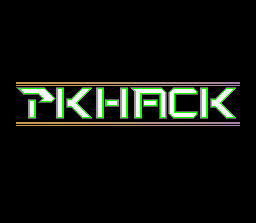</a> 
		It all starts off with a first impression.  Use PK Hack tools to customize the title screens and company logos.   
		

		</td>

		<td width="300">
		
<a href="pk_pixx/gallery/gal_1.png" target="_blank">
		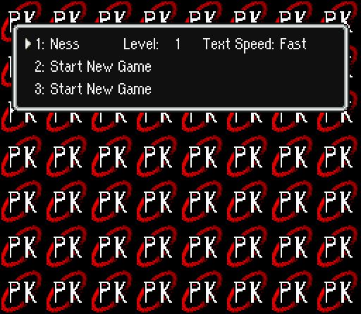</a> 
		The file selection screens can also be changed to suit the theme of your hack and keep things fresh.    
		

		</td>
	</tr>

	<tr valign="top">
		<td width="300">
		
<a href="pk_pixx/gallery/gal_2.png" target="_blank">
		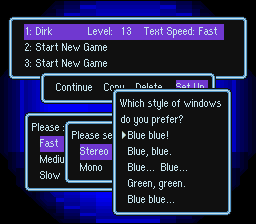</a> 
		In addition to that, you can change the color and design of the text windows.   
		

		</td>

		<td width="300">
		
<a href="pk_pixx/gallery/gal_3.png" target="_blank">
		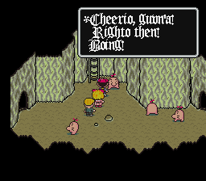</a> 
		And as if that weren't enough, you can customize the in-game fonts as you see fit.   
		

		</td>
	</tr>

	<tr valign="top">
		<td width="300">
		
<a href="pk_pixx/gallery/gal_4.png" target="_blank">
		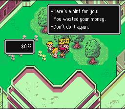</a> 
		With the game's text editing capabilities, you can change any dialogue present in the game to whatever you like.   
		

		</td>

		<td width="300">
		
<a href="pk_pixx/gallery/gal_5.png" target="_blank">
		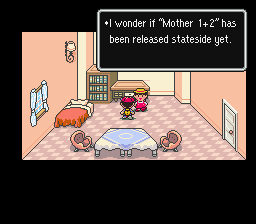</a> 
		Now your NPCs can ask the burning questions we all want the answers to, or at least get updated to the present decade.   
		

		</td>
	</tr>

	<tr valign="top">
		<td width="300">
		
<a href="pk_pixx/gallery/gal_6.png" target="_blank">
		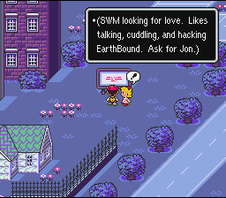</a> 
		In addition to regular dialogue, EarthBound's incredibly rich Control Code programming language will let you script events in many ways, and make your characters react to their environment.   
		

		</td>

		<td width="300">
		
<a href="pk_pixx/gallery/gal_7.png" target="_blank">
		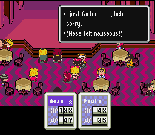</a> 
		Control Code programming can also have effects on your characters' health and status, from leveling them up to killing them outright.   
		

		</td>
	</tr>

	<tr valign="top">
		<td width="300">
		
<a href="pk_pixx/gallery/gal_8.png" target="_blank">
		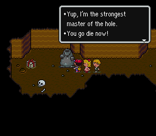</a> 
		Of course, in spite of the wide range of capabilities that CC programming has, it can be fun to just play around with text and make goofy stuff.   
		

		</td>

		<td width="300">
		
<a href="pk_pixx/gallery/gal_9.png" target="_blank">
		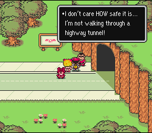</a> 
		...Though it can also be nice to occasionally have a voice of reason somewhere in there.   
		

		</td>
	</tr>

	<tr valign="top">
		<td width="300">
		
<a href="pk_pixx/gallery/gal_10.png" target="_blank">
		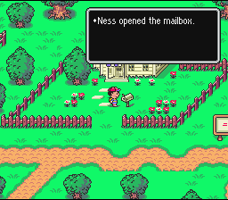</a> 
		Bear in mind you aren't limited to making new dialogue for pre-existing characters and objects only.   
		

		</td>

		<td width="300">
		
<a href="pk_pixx/gallery/gal_11.png" target="_blank">
		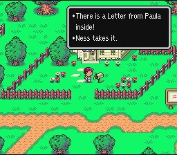</a> 
		There are a variety of ways you can use the text systems, including the creation of entirely new NPC objects - including item boxes such as this mailbox.   
		

		</td>
	</tr>

	<tr valign="top">
		<td width="300">
		
<a href="pk_pixx/gallery/gal_12.png" target="_blank">
		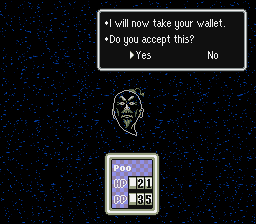</a> 
		With sufficient practice, you'll be able to script complex events and let the player's choices affect the outcome of the game, or the fullness of their billfold.   
		

		</td>

		<td width="300">
		
<a href="pk_pixx/gallery/gal_13.png" target="_blank">
		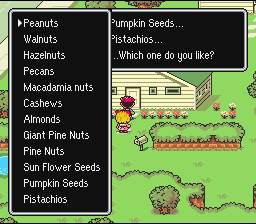</a> 
		As you can no doubt see, the game's engine can handle more flexibility than you might have imagined.   
		

		</td>
	</tr>

	<tr valign="top">
		<td width="300">
		
<a href="pk_pixx/gallery/gal_14.png" target="_blank">
		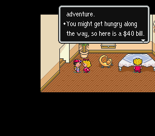</a> 
		New items can also be made for your players to find, buy, and use.  They can be as useful or as bizarre as you like.   
		

		</td>

		<td width="300">
		
<a href="pk_pixx/gallery/gal_15.png" target="_blank">
		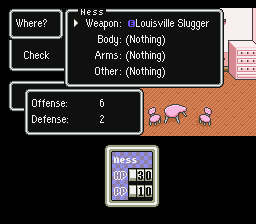</a> 
		Special item names can be an excellent way to add some unique flavor to your game.   
		

		</td>
	</tr>

	<tr valign="top">
		<td width="300">
		
<a href="pk_pixx/gallery/gal_16.png" target="_blank">
		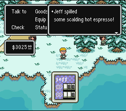</a> 
		Each item can be programmed with a specific action, which includes each and every attack that enemies can use in the game.   
		

		</td>

		<td width="300">
		
<a href="pk_pixx/gallery/gal_17.png" target="_blank">
		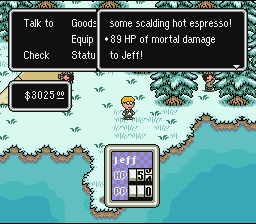</a> 
		You can come up with some unique situations playing around with the actions, but be careful and bear in mind the health and welfare of your poor characters.  ;)   
		

		</td>
	</tr>

	<tr valign="top">
		<td width="300">
		
<a href="pk_pixx/gallery/gal_18.png" target="_blank">
		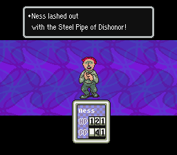</a> 
		Of course, most attack-type actions are quite safe to use in a battle situation.   
		

		</td>

		<td width="300">
		
<a href="pk_pixx/gallery/gal_19.png" target="_blank">
		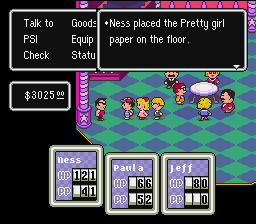</a> 
		Beyond battle uses, many items can have other purposes, such as forwarding the plot.   
		

		</td>
	</tr>

	<tr valign="top">
		<td width="300">
		
<a href="pk_pixx/gallery/gal_20.png" target="_blank">
		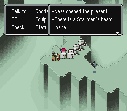</a> 
		Of course, plenty of items can just be there to be cool.  Makes more sense for that to be there than a baseball bat, if you ask me.   
		

		</td>

		<td width="300">
		
<a href="pk_pixx/gallery/gal_21.png" target="_blank">
		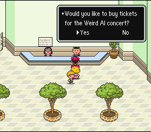</a> 
		Items aren't the only thing that spending money can get you, either.   
		

		</td>
	</tr>

	<tr valign="top">
		<td width="300">
		
<a href="pk_pixx/gallery/gal_22.png" target="_blank">
		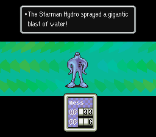</a> 
		And if that wasn't enough for you, enemies are greatly customizable as well.  You can take a pre-existing enemy and revamp it with new colors and actions...   
		

		</td>

		<td width="300">
		
<a href="pk_pixx/gallery/gal_23.png" target="_blank">
		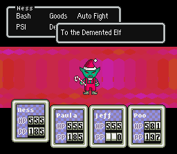</a> 
		...Create an all new enemy with hand-drawn graphics and totally unique attacks...   
		

		</td>
	</tr>

	<tr valign="top">
		<td width="300">
		
<a href="pk_pixx/gallery/gal_24.png" target="_blank">
		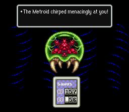</a> 
		...Or import a classic baddie from outside the EarthBound continuum.  A dose of PSI Freeze and a Multi-Bottle Rocket oughta take care of business there.  :D   
		

		</td>

		<td width="300">
		
<a href="pk_pixx/gallery/gal_25.png" target="_blank">
		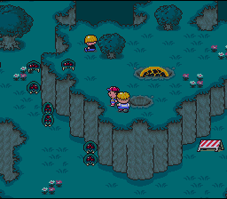</a> 
		The appearance and behavior of enemies in groups is handled almost automatically.  All you have to do is describe which of your evil goons hang out together and the game takes care of the dirty work.   
		

		</td>
	</tr>

	<tr valign="top">
		<td width="300">
		
<a href="pk_pixx/gallery/gal_26.png" target="_blank">
		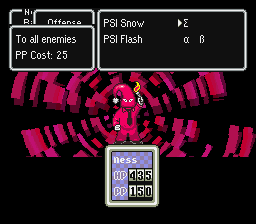</a> 
		Enemies aren't the only ones who can have revamped attacks, mind you.   
		

		</td>

		<td width="300">
		
<a href="pk_pixx/gallery/gal_27.png" target="_blank">
		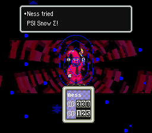</a> 
		PSI spells can use any battle action in the game, just like items - AND you can change their animations to match!   
		

		</td>
	</tr>

	<tr valign="top">
		<td width="300">
		
 
		You can also fully edit the graphics for characters and objects throughout EarthBound.  This is a real subtle change, but the implications are astounding.   
		

		</td>

		<td width="300">
		
<a href="pk_pixx/gallery/gal_29.png" target="_blank">
		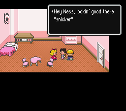</a> 
		Sometimes a little sprite change is as good a reason for a plot as any.   
		

		</td>
	</tr>

	<tr valign="top">
		<td width="300">
		
<a href="pk_pixx/gallery/gal_30.png" target="_blank">
		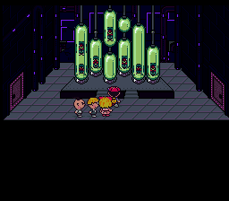</a> 
		(As if you didn't see this one coming.)   
		

		</td>

		<td width="300">
		
<a href="pk_pixx/gallery/gal_31.png" target="_blank">
		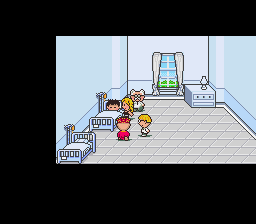</a> 
		But just changing sprites isn't the end!  You can also use PK Hack tools to make new NPCs and put them in altogether new places.   
		

		</td>
	</tr>

	<tr valign="top">
		<td width="300">
		
<a href="pk_pixx/gallery/gal_32.png" target="_blank">
		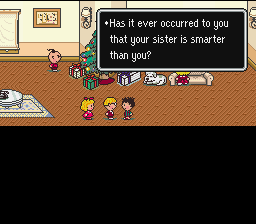</a> 
		And, but of course, all new NPCs are entitled to fresh, snarky dialogue.   
		

		</td>

		<td width="300">
		
<a href="pk_pixx/gallery/gal_33.png" target="_blank">
		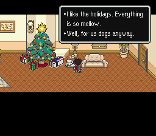</a> 
		Bet you can't tell that the tree and the presents are composed of no fewer than seven individual sprites.  That's just plain impressive.   
		

		</td>
	</tr>

	<tr valign="top">
		<td width="300">
		
<a href="pk_pixx/gallery/gal_34.png" target="_blank">
		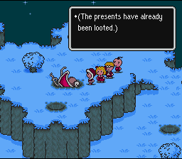</a> 
		Good sprite work can add a ton of flavor to a hack.  But why stop there when you can change the map itself directly?   
		

		</td>

		<td width="300">
		
<a href="pk_pixx/gallery/gal_35.png" target="_blank">
		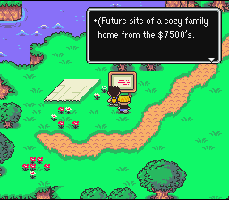</a> 
		Signs, doorways, and actual graphics tiles are all integrated together in the expansive mess we call the map.  The map serves as the stage for your enemy encounters, your NPCs, and all the dialogue in the game, so it's pretty important.   
		

		</td>
	</tr>

	<tr valign="top">
		<td width="300">
		
<a href="pk_pixx/gallery/gal_36.png" target="_blank">
		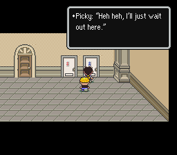</a> 
		Even doorways can also be used to trigger dialogue and effects.   
		

		</td>

		<td width="300">
		
<a href="pk_pixx/gallery/gal_37.png" target="_blank">
		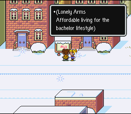</a> 
		Of course, nothing beats a randomly-placed sign for a good one-liner.  :D   
		

		</td>
	</tr>

	<tr valign="top">
		<td width="300">
		
<a href="pk_pixx/gallery/gal_38.png" target="_blank">
		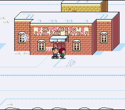</a> 
		Whatever you're trying to make in a map, with a little tweaking, the original tilesets probably have exactly the thing to suit your needs.   
		

		</td>

		<td width="300">
		
<a href="pk_pixx/gallery/gal_39x.png" target="_blank">
		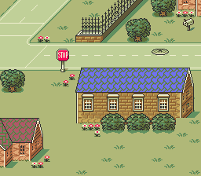</a> 
		Don't believe me?  Click this seemingly-familiar image and see for yourself.  Don't say I didn't warn you, though!   
		

		</td>
	</tr>

	<tr valign="top">
		<td width="300">
		
<a href="pk_pixx/gallery/gal_40.png" target="_blank">
		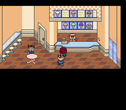</a> 
		And, just like everything else you can get your hands on, map graphics can be changed to suit your whims.   
		

		</td>

		<td width="300">
		
<a href="pk_pixx/gallery/gal_41.png" target="_blank">
		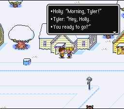</a> 
		You have to bring all these different aspects together - text, map, graphics, etc. - to make a finished, polished product.  Events driving the plot along are a crucial component of any RPG.   
		

		</td>
	</tr>

	<tr valign="top">
		<td width="300">
		
<a href="pk_pixx/gallery/gal_42.png" target="_blank">
		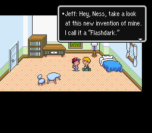</a> 
		Control Codes strike again!  Even the maps are not spared their fury.   
		

		</td>

		<td width="300">
		
<a href="pk_pixx/gallery/gal_43.png" target="_blank">
		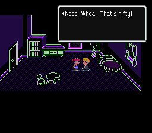</a> 
		Jeff (or, as his legions of adoring fangirls know him, DJ SkyRunner) is a big player in Winters' underground rave scene.   
		

		</td>
	</tr>

	<tr valign="top">
		<td width="300">
		
<a href="pk_pixx/gallery/gal_44.png" target="_blank">
		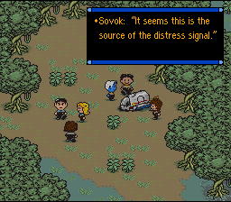</a> 
		Soon, you may be able to go beyond the constraints of EarthBound itself and explore new worlds and new genres, to seek out new plots and fresh gaming ideas, to boldly g-- er, I mean, to turn into a giant dork.   But that's okay, we don't mind.  ;)   
		

		</td>

		<td width="300">
		
<a href="pk_pixx/gallery/gal_45.png" target="_blank">
		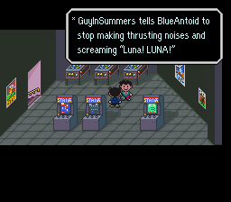</a> 
		Of course, if all you want to do is dredge up old IRC quotes to humiliate your friends, that's okay too.  Your call.   
		

		</td>
	</tr>
</table>




Are you interested in submitting a screenshot to the Gallery?  Send it to us using the Starmen.Net submissions page, and the PK Hack Staff will review it.  If we deem it front-page-worthy material, your picture will be added to the Gallery along with a credit in your name!  
<b>PK Hack Gallery Contributors:</b><ul>
<li>Blue Antoid</li>
<li>Michael_Cayer</li>
<li>GuyInSummers</li>
<li>AnyoneEB</li>
<li>Gau</li>
<li>JeffMan</li></ul>

