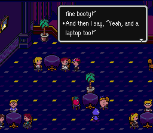
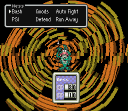
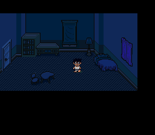
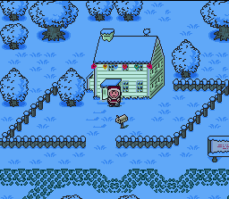
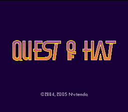


This is it: the premier collection of EarthBound hacks on the Internet.  Funny games, serious games, and just plain oddball games - whatever your tastes, we've got you covered.  ...What?  There aren't that many here?  Well, that's just because people haven't really MADE that many.  All the more reason to make one of your own to get put up here!  Send your hacks to us using the Starmen.Net submissions page, or post it on the message board.  A PK Hack staffer will upload it to the site and we'll all be nice and happy!  Please be sure to include both the size of the needed ROM in megabits, plus a brief description (about one paragraph will do), as this makes life much easier for everyone involved.



Radiation has written a <a href="http://starmen.net/pkhack/pk_docs/ips.txt">handy guide</a> on how to use IPS patches. If you've read it and you're still having problems playing hacks, pop over to the <a href="http://forum.starmen.net/?t=msg&th=17047">Troubleshooting Topic</a> on the forums, or drop by our <a href="http://pkhack.fobby.net/irc.php">IRC channel</a>.




<b>By Mr. Accident 
<a href="hack/ebdecade.zip">Download</a></b> (163 KB, .zip compressed) - 32 Megabits 

This hack was made for EB Funktastic Gameplay in the summer of 2005. It commemorates ten years of EarthBoundy goodness with a rockin' Starmen.Net party in Onett's Town Hall. Chill with Reid, Tomato, and a bunch of other wacky SM.Netters as you investigate undercurrents of intrigue and sidequestyness!   





<b>By Radiation  
<a href="http://starmen.net/pkhack/pk_hacks/arnswinterquest.zip">Download</a></b> (355 KB, .zip compressed) - 48 Megabits 

In the words of its creator, "[Arn's Winter Quest] has been a labor of love for me for two months, and rivals those hacks such as Hat Quest and EarthBound 2.5: Electric Boogaloo Joint Jive. It has a lot of fun inside jokes, an incoherent story, and all new battle graphics. This hack is basically linear Dragon Warrior with a bunch of humor thrown in, so if you like fighting and you like funny and you like very hard viewtiful fun time hacks, then don't play this hack because it'll satisfy your cravings and your head will probably explode."

Arn's Winter Quest: Gway Edition is a game. Like most EarthBound hacks, you walk along a fairly linear path, level up along the way, and enjoy a story that is vaguely funny. There's not anything particularly interesting to note, except for a couple things. Allow me to put them into a list, because I love lists so much. And yes, I did marry them.

1. Fun! AWQ: GE doesn't make you have fun in the way that you marvel at the amazing amount of work that went into it: it makes you have fun because it crams in down your throat. Arn's adventure repeatedly pokes fun at itself, and never lets the Irony or Pun fall below fatal levels. If you hate incoherency and fast-paced speech that you can't even read, then you'll hate this game. That's not the only reason to hate it, though...!

2. This is a palette switch. AWQ: GE fights with heavy artillery weapons such as orginality and atom bombs. The game's path definitely has places from EarthBound, but you're thrown around so much you really have no idea where you're going to go next. Will you be tossed into the fire springs, or into Scaraba? We decide! I guarantee that the only places that lead into places you're expecting are Magicant and that one pyramid. But it's a palette switch, so it's okay.

3. When's the boss gonna die? ... YOU GAVE THE SECOND BOSS 1600 HP!? The third reason to love or hate this game is that it has a blistering difficulty level. I literally mean that. This game will cause you to break out in blisters on your hands due to the raw amount of times you will fight the same boss and he will hit you with an auto-kill. I've never been to hell, but I'm sure if I ever go there it will have a new name: Arn's Winter Quest: Not Funny Edition. And it will be made by Gau. And all the enemies will be drawn by GuyInSummers.

They will be colored by Joe the Talking Toilet.

4. Hey, where's my sofa? The fourth reason to give me all your money is that I just stole all of the appliances in your house. Even your cat. Especially your cat.

  
The official forum topic for discussing this hack can be found <a href="http://forum.starmen.net/?t=msg&th=19435">here</a>.





<b>By ROFISH 
<a href="hack/ebbattler0_5.zip">Download</a></b> (5.57 KB, .zip compressed) - 24 Megabits 

This classic hack matches you up gladiator-style against a slew of EarthBoundy opponents.  It's an enjoyable new twist on our old favorite.  It may seem dated now, but at the time it was made, it was one of the most innovative hacks ever made.  Watch out for ROFISH, too - he'll put the hurt on you!   




<b>By Tomato, Michael_Cayer 
<a href="hack/ebngplus2.zip">Download</a></b> (2.58 KB, .zip compressed) - 24 Megabits 

Taking a page from Chrono Trigger, this patch allows you - upon finishing the game - to start from the beginning with all of your items, stats, and PSI intact! In this enhanced version, all events are reset, eliminating the event-glitch problems in the original. As a result, however, you will not be able to Teleport to places you have not been yet.  Even with this limitation, you'll be able to cut a swath through your enemies quicker than ever before.   




<b>By Blue Antoid 
<a href="hack/jonbound.zip">Download</a></b> (155 KB, .zip compressed) - 32 Megabits 

Blue Antoid's seminal, acclaimed, n00btastic work.  It's the first full-length hack of EB, though it came before any sort of map or compressed graphics editing.  It was also pretty much made up on the spot, with no real plan - just an accumulation of random ideas and plot threads gleaned from a forum topic, and tied together with minty dental floss.  It generally follows the EarthBound story line (if not the plot) in a "new" scenario with new characters and enemies.  (Most people hail JonBound as the Holy Grail of EB hacking, but Blue Antoid really hopes a newcomer will arrive and blow it away.  Problem is he's been waiting since 2001!)   





<b>By EB_Girl <a href="hack/giftman.zip">Download</a></b> (266 KB, .zip compressed) - 32 Megabits 

Trouble strikes on the eve of EB No Matsuri! Ness and his friends must team up to save the world from an evil menace that would destroy the holiday spirit and do away with strawberry tofu forever! :O  This hack was the winning entry of the 2003 Hexmas Hackfest, and as such it's full of EarthBoundy, Christmassy goodness.  Makes you hungry for candy canes and kicking Elves.  :D   





<b>By Mr. Tenda 
<a href="hack/hq0.9.0.8.zip">Download</a></b>(252 KB, .zip compressed) - 48 Megabits 

A mini-sequel to EarthBound, starring Mr. Saturn and Jeff.  Short but sweet, Hat Quest is one of the most advanced hacks released to date.  It's also the first finalized hack to make liberal use of map editing, advanced event-based changes, and a bevy of other recent discoveries.  This game was made with classic puzzle adventure games in mind, so expect a lot of old-school LucasArts-style action.   


