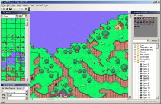
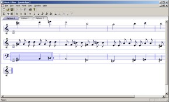
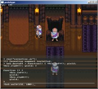


This is my projects page, where I put information about all the various crap I'm working on for one reason or another.

<!-- This is blatantly in violation of standards -->





   <a href="">Project page</a>

This is the latest and greatest incarnation of the Map Editor, rebuilt from the ground up to replace the vast network of duct tape and chewing gum that was holding together the code base for the older 4.x releases.

Eventually, Map Editor SP should encompass far more than just map editing, bringing together many different resource types in one integrated environment. Module export/import features will provide a more "building block"-style approach to hack making, and hopefully provide greater integration with JHack as well.

<a href="http://starmen.net/pkhack/pk_junk/mapeditor_sp_beta.exe">Beta download</a>





<a href="">Project Page</a>

The goal of this project is to provide a graphical frontend-type application for Goplat's awesome music editor.

<a href="http://starmen.net/pkhack/pk_junk/mused_alpha4+src.rar">Current beta download</a>





<a href="">Project Page</a>

<i>Evermore</i> is a JavaScript-driven game engine that provides all the basic functionality needed to construct a 2D SNES-style role-playing game. Features include multi-layered map support with parallax, a fully-featured sound system with a built-in SPC700 emulator, and actor management and scripting with cooperative multitasking.

<i>Evermore</i> is named after <i>Secret of Evermore</i>, which was for various reasons the inspiration for this project. Currently, it is available only in a rudimentary prototype version, but progress should hopefully be steady.

<a href="http://starmen.net/pkhack/pk_junk/evermore_prototype.rar">Prototype download</a>


