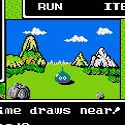
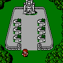
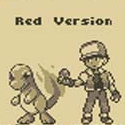
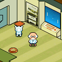
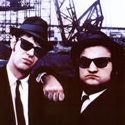
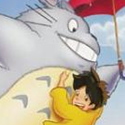


This page is a work in progress and is nowhere near being complete. Please be patient.



The MOTHER/EarthBound RPG series is full of many unique elements that define the series. There is, however, a great deal of inspiration from previous titles, as well as influence on upcoming games. Here are some games that you might want to check out if you can't get enough EarthBound-related goodness in your life!
   

<ul class="pics">
	<li>
		
		<h3>Dragon Quest/Dragon Warrior (NES - 1989)</h3>
		
This is the video game that inspired Itoi to make the MOTHER
 series.
	
	</li>
	<li>
		
		<h3>Final Fantasy (NES - 1990)</h3>
		
The first Final Fantasy will seem slightly similar to the original MOTHER. In the game, the daughter of the King was kidnapped by the Dark Knight Garland. What begins as an act of heroism by four youths evolves into an adventure to save the world from a demon known as Chaos. This is very similar to EarthBound with the young main characters and their attempts to rid the world of the evil Giygas. Also, in both games, your party has to travel to the past to accomplish this goal.
	
	</li>
	<li>
		
		<h3>StarTropics (NES - 1990)</h3>
		
EarthBound and StarTropics are very similar. For one, the main character is an ordinary boy named Mike Jones. He's a baseball player, and fights monsters using yo-yos, bats, and other bizzare weapons. In StarTropics, Mike receieves a letter from his uncle, Dr. Steve Jones. The doctor lives on an island called C-Island and invites you to visit. However, once you arrive, you learn that he was abducted by aliens. And so, your quest to find your uncle begins.  In the sequel, Mike also learns psychic powers and travels through time to save the world.
	
	</li>
	<li>
		
		<h3>Pok&eacute;mon Red/Blue/Yellow Version (Gameboy - 1998)</h3>
		
Pok&eacute;mon is made by Creatures, Inc. and Game Freak. Before Creatures, Inc. was known by that name, they were known as Ape, a company credited for programming MOTHER. Your character is a kid who's rival is his neighbor. This rival will run into the main character many times during his quest to become a Pok&eacute;mon Master. If you enjoyed EarthBound, then you should pick up the older, Gameboy installments in this series. The similarities are everywhere.
	
	</li>
	<li>
		
		<h3>Contact (Nintendo DS - 2006)</h3>
		
Shortly before this game was announced, <a href="http://starmen.net/mother3/mysteriouscountdown/">a strange countdown page</a> with a Dr. Andonuts-esque character made everyone wonder if it was actually a new EarthBound game. Unfortunately, it turned out to be a DS game called Contact, but because of that initial mixup, everyone in the gaming industry started to compare Contact with EarthBound. It's quirky, but that's where the similarities end. Still, it's worth checking out.
	
	</li>
</ul>
 



EarthBound is not limited to just games, it gets inspiration from many classic movies, and it even inspires new movies. It is always great to see something in a movie and relate it to a game you love, so go ahead and check these films out!

<ul class="pics">
	<li>
		
		<h3>The Blues Brothers (1980)</h3>
		
Do not be alarmed if the people shown to the left look like Lucky and Gorgeous from the Runaway Five. Itoi based the characters off of those two men, Jake and Elwood. This movie is full of humor similar to EarthBound. It follows two men on a musical mission from God to save a nun. This film contains multiple high-action car chases, hilarious lines, and even Neo-Nazis. If you want a great comedic experience similar to EarthBound, then watch this movie.
	
	</li>
	<li>
		
		<h3>My Neighbor Totoro (1988)</h3>
		
Shigesato Itoi played the voice of Prof. Kusakabe, the father of the two young girls, Mei and Satsuki. Itoi has done work with famed anime director Hayao Miyazaki on many occasions since.
	
	</li>
</ul>

