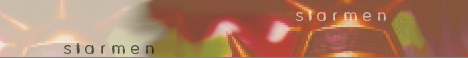
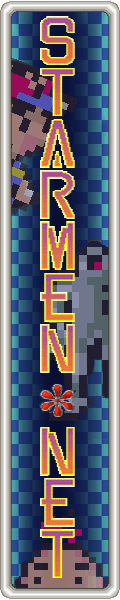
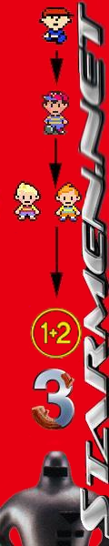
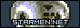
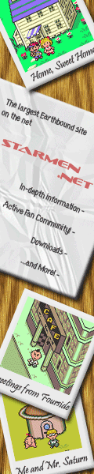
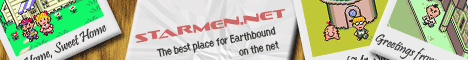



After the Starmen.net Banner Contest 2006, we have obtained many new, incredible banners for use on websites that are kind enough to use a banner linking to Starmen.net.  Unlike the banner contest held in 2000, this contest was expanded for not only horizontal banners, but also for vertical, button, and micro-style banners, categorized by size, for more than just one winner.

Below are the winners, in Horizontal, Vertical, Button, Micro, and Set categories, and are highly encouraged for use as the banners to use when linking to the site.  At the bottom of this page is a link to a new page with those banners that, unfortunately, didn't place.

Thanks to everyone who participated in our banner contest, it's people like you who keep the community alive and kicking outside of the forums.





1st Place - kakashi0freak 

 
 

2nd Place - RedShadow13 

 
 

3rd Place - Cappucino 





Vertical was, admittedly, the category with the lowest turnout.  The only other banner after these two was also part of a set, and therefore disqualified from this category.

<TABLE WIDTH="50%">
<TR>
<TD WIDTH="25%">1st Place - Cap'n Muffin</TD>
<TD WIDTH="25%">2nd Place - Stevesesy</TD>
</TR>
<TR>
<TD WIDTH="25%">
</TD>
<TD WIDTH="25%"> 
</TD>
</TR>
</TABLE>





1st Place - Firegirl 

 
 

2nd Place - xfisjmg1 

 
 

3rd Place - Cap'n Crunch 





1st Place - Mr. Spoon 

 
 

2nd Place - Sonic65 

 
 

3rd Place - Radiation 





Sets are made for the full immersion of bannerness on a website, so a consistent theme can be made.  If you want to use all sizes on your website, nstead of using four random banners that look nothing alike, these make great alternatives.  

<table align="center">
<tr>
<td colspan="3" align="center">
1st Place - atari baby
</td>
</tr>
<tr align="center">
<td align="center" rowspan="2" width="300">

</td>
<td align="center" valign="middle" colspan="2" width="300">
</td>
</tr>
<tr>
<td align="center" valign="middle" width="300">

</td>
<td align="center" valign="middle" width="300">
</td>
</tr>
</table>
  

<table align="center">
<tr>
<td colspan="3" align="center">
2nd Place - PBalfredo
</td>
</tr>
<tr align="center">
<td align="center" rowspan="2" width="300">

</td>
<td align="center" valign="middle" colspan="2" width="300">
</td>
</tr>
<tr>
<td align="center" valign="middle" width="300">

</td>
<td align="center" valign="middle" width="300">
</td>
</tr>
</table>
  

<table align="center">
<tr>
<td colspan="3" align="center">
3rd Place - BluePanda
</td>
</tr>
<tr align="center">
<td align="center" rowspan="2" width="300">

</td>
<td align="center" valign="middle" colspan="2" width="300">
</td>
</tr>
<tr>
<td align="center" valign="middle" width="300">

</td>
<td align="center" valign="middle" width="300">
</td>
</tr>
</table>





For those that didn't place, we'll always have a shrine for you here on <a href="./../../nonplacers.html">this page</a>.


