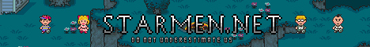
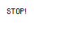
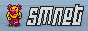
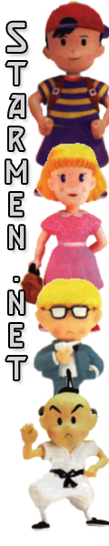
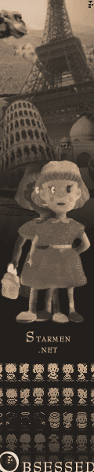
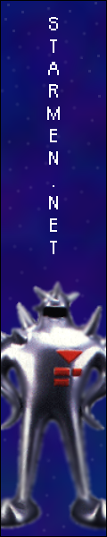
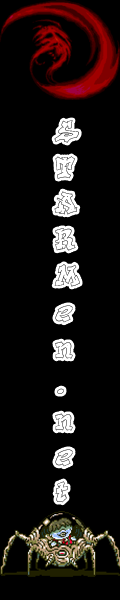



Click <a href="./index.html">here</a> to be taken back to the main banner page.

Though there were many, and quite hard to choose from for the winners, there have to be some banners that don't place, and although we don't choose to encourage using these banners on your website, it's just as nice to let you know these people also tried as hard as any other entrant.  Thanks again to all of you, you help make the community what it is.





JeffMan 

KidBond 

Sonic 65 

Spam_Man 

xfisjmg1 





The Vertical category had the least turnout with only two applicable banners.  By default, all entries placed.





Steam 





Emperor Bambi 

Firegirl 





<table align="center">
<tr>
<td colspan="3" align="center">
Ambivalentiowa
</td>
</tr>
<tr align="center">
<td align="center" rowspan="2" width="300">

</td>
<td align="center" valign="middle" colspan="2" width="300">
</td>
</tr>
<tr>
<td align="center" valign="middle" width="300">

</td>
<td align="center" valign="middle" width="300">
</td>
</tr>
</table>
  

<table align="center">
<tr>
<td colspan="3" align="center">
Bjeatles
</td>
</tr>
<tr align="center">
<td align="center" rowspan="2" width="300">

</td>
<td align="center" valign="middle" colspan="2" width="300">
</td>
</tr>
<tr>
<td align="center" valign="middle" width="300">

</td>
<td align="center" valign="middle" width="300">
</td>
</tr>
</table>
  

<table align="center">
<tr>
<td colspan="3" align="center">
LeChimp
</td>
</tr>
<tr align="center">
<td align="center" rowspan="2" width="300">

</td>
<td align="center" valign="middle" colspan="2" width="300">
</td>
</tr>
<tr>
<td align="center" valign="middle" width="300">

</td>
<td align="center" valign="middle" width="300">
</td>
</tr>
</table>
  

<table align="center">
<tr>
<td colspan="3" align="center">
Spam_Man
</td>
</tr>
<tr align="center">
<td align="center" rowspan="2" width="300">

</td>
<td align="center" valign="middle" colspan="2" width="300">
</td>
</tr>
<tr>
<td align="center" valign="middle" width="300">

</td>
<td align="center" valign="middle" width="300">
</td>
</tr>
</table>
  


