

Starmen.Net has been noticed by the gaming media countless times. Even though this site is about an old game, our content and our community's unrelenting devotion to EarthBound manages to turn a lot of heads.  
If you're not up to sifting through the whole pile, here are some of the best/most interesting media mentions we've received:

<ul style="float: left;">
<li><a href="#egm203">EGM #203 (2006)</a></li>
<li><a href="#egm158">EGM #158 (2002)</a></li>
<li><a href="#egm135">EGM #135 (2000)</a></li>
<li><a href="#egm124">EGM #124 (1999)</a></li>
</ul>
<ul style="float: left;">
<li><a href="#1upshow">The 1Up Show Video (2006)</a> - Featuring our Arts Album</li>
<li><a href="#gamingHacks">Gaming Hacks (2004)</a> - Featuring PK Hack</li>
<li><a href="#slashdot0903">Slashdot (2003)</a> - Featuring Mother 3 Petition</li>
<li><a href="#1up">1Up.com</a> - Stories/blogs about EarthBound & fans</li>
</ul>
 



<a class="picright" href="image/IGN-Retroremix-091706.png">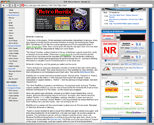</a>

In 2006, <a href="http://ign.com">IGN</a> began writing up a series of articles called the Retro Remix in anticipation of the Wii's Virtual Console. <a href="http://wii.ign.com/articles/726/726279p1.html">Retro Remix: Round 25: EarthBound</a> was focused on our beloved game, an excellent writeup by editor Lucas Thomas. A few excerpts:

"Nintendo is listening, and the games you select are the sound.
  
There's at least one religiously dedicated collective of hardcore fans who will be taking advantage of this reality ... They are the EarthBound fans.
  
The campaign to get you and your friends to give the quirky, crazy, cult-fanatical EarthBound experience a try will be kicking into high gear soon, driven by the members of communities like <a href="http://starmen.net">Starmen.net</a>. They'll ask you to give your dollars in support of the cause. In exchange, you'll get a game unlike any you've ever played before."

<a href="#top" class="backtotop">Back to Top</a>



<a class="picleft" href="image/edge-m3-june06.jpg">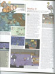</a>

<a href="http://www.edge-online.co.uk/">Edge Magazine</a>, a European gaming mag, did a full-page article on Mother 3in June 2006 (issue 166). Although they didn't mention Starmen.Net directly, they might as well have as they reference our <a href="http://starmen.net/petition/mother3">Mother 3 Petition</a>. Here are a few choice quotes:

 "The discovery of a fully-translated internal-use cart of [...]<i>EarthBound Zero</i> fuelled in series fans the perception of a near vendetta by Nintendo to shield them from creator Shigesato Itoi's work.   A 700-page fan-prepared petition proved powerless to prevent the N64 sequel's eventual cancellation." 

<a href="#top" class="backtotop">Back to Top</a>



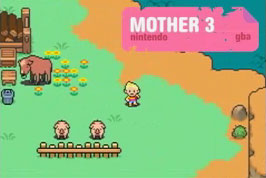
On May 5, 2006, <a href="http://1up.com">1up.com</a> did a <a href="http://media.1up.com/flat/News/Videos/3150382_broad.html">Pre-E3 show featuring Mother 3</a> (you can search for it at <a href="http://the1upshow.1up.com">http://the1upshow.1up.com</a>). About 21 minutes into the show, they began a feature on Mother 3, which is (of course) great news. Part of the way through the feature, they started talking about Starmen.Net, with our URL on the screen. Wow!   After poking fun at our "bloodlust" (we like  <em>brains</em>, get it right) they switched to an interview where <a href="http://www.1up.com/do/my1Up?publicUserId=5379721">Jeremy Parish</a> was, <em>much</em> to our surprise, holding our <a href="http://classic.starmen.net/petition/mother3/pictures#artalbum">Art Album</a>. Who saw that coming? We thought it died along with Video-Fenky.

It's great to know that not only is our Art Album in good hands, but those hands are willing to dole out some much-needed exposure for the site. 1up is huge, and Parish, even though he likes to poke fun at us, is definitely our new best buddy.

 
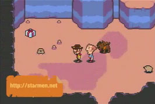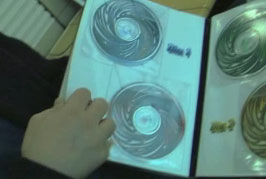
 
<a href="#top" class="backtotop">Back to Top</a>




<a class="picright" href="image/EGMMay06article.jpg">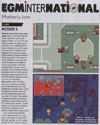</a>

Thanks to toader and pfresh for informing us about EGM's latest mention of Starmen.Net in their May 2006 (issue 203) edition. In a Mother 3 article called '<a href="image/EGMMay06article.jpg">Motherly Love</a>', EGM talks about the pending release of Mother 3. They also say:

 " Yet now, much to the delight of the <em>EarthBound</em> maniacs at fansite starmen.net and elsewhere, the project's been resurrected for the Game Boy Advance... " 

<a href="#top" class="backtotop">Back to Top</a>



<a class="picright" href="image/digg-M3Release-042006.png">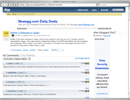</a> 

Our second story submitted to <a href="http://digg.com">Digg</a>, titled "<a href="http://digg.com/gaming_news/Mother_3_Released_in_Japan">Mother 3 Released in Japan</a>" also hit the main page, but for a much briefer period of time, which explains the lower Digg count on this one. 

 
<a href="#top" class="backtotop">Back to Top</a>



<a class="picleft" href="image/Slashdot-M3Done-013006.png">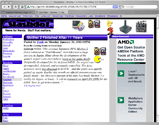</a>

<a href="http://slashdot.org">Slashdot</a> once again posted an article about Starmen.Net and Mother 3 titled "<a href="http://games.slashdot.org/article.pl?sid=06/01/30/179204">Mother 3 Finished After 11 Years</a>". During this time we were getting so much traffic that even this posting on Slashdot didn't make a huge spike on our graphs. Oh my pork!

 
<a href="#top" class="backtotop">Back to Top</a>



<a class="picleft" href="image/digg-M3Done-012406.png">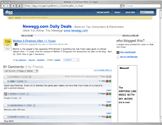</a>

reidman submitted an article to <a href="http://digg.com">Digg</a> titled "<a href="http://digg.com/gaming_news/Mother_3_Finished_After_11_Years">Mother 3 Finished After 11 Years</a>" to announce the completion of Mother 3. It came as only a mild surprise that Digg is host to a <em>lot</em> of EarthBound fans, as the article made it to the front page in a matter of hours. The article got lots of attention, and only slowed down after it passed the 700-digg mark!

 
<a href="#top" class="backtotop">Back to Top</a>




Popular gaming blog <a href="http://joystiq.com">Joystiq</a> has posted a lot of news regarding Mother 3 and Starmen.Net. Too bad their search function sucks! Oh well, here are a few of them:
 
<ul>
<li><a href="http://www.joystiq.com/2006/11/06/mother-3-to-stay-lost-in-translation/">Mother 3 To Stay Lost in Translation</a></li>
<li><a href="http://www.joystiq.com/2005/09/26/is-earthbound-3-in-development/">Is EarthBound 3 In Development?</a> (I don't know, but EarthBound 2 might have been ;)</li>
<li><a href="http://www.joystiq.com/2006/02/14/itoi-releases-mother-3-theme-screenshots/">Itoi Releases Mother 3 Theme, Screenshots</a> linked to <a href="http://starmen.net/mother3/mother3world/">Starmen.Net Mother 3 World</a>, an awesome/unofficial translation of Itoi's website by Tomato and King Darian.</li>
</ul>
<a href="#top" class="backtotop">Back to Top</a>



<a class="picleft" href="http://4colorrebellion.com">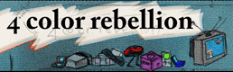</a>

The guys over at <a href="http://www.4colorrebellion.com">4 color rebellion</a> (another popular gaming blog) gave us a lot of press during the release of Mother 3. Here are some of their posts, mostly by an awesome guy named Mitch who has been a Starmen.Net visitor for a looooong time:

 
<ul>
<li><a href="http://www.4colorrebellion.com/archives/2006/05/12/earthbound-2-in-europe-only/">EarthBound 2 in Europe Only?</a> - June 12, 2006</li>
<li><a href="http://www.4colorrebellion.com/archives/2006/04/23/mother-3-what-does-it-mean/">Mother 3 - What Does it Mean?</a> - April 23, 2006</li>
<li><a href="http://www.4colorrebellion.com/archives/2006/04/17/the-last-mother-3-box/">The Last Mother 3 Box</a> - April 17, 2006</li>
<li><a href="http://www.4colorrebellion.com/archives/2005/11/04/mother-3-for-gba/">Mother 3 for GBA</a> - November 4, 2005</li>
</ul>
<a href="#top" class="backtotop">Back to Top</a>




<a href="http://www.kotaku.com/">Kotaku</a> is, you guessed it, another successful gaming blog (see a pattern here?) that has reports on Mother 3 happenings pretty frequently. If you look under their tags for <a href="http://www.kotaku.com/gaming/earthbound/">EarthBound</a> and <a href="http://www.kotaku.com/gaming/mother3">Mother 3</a> you'll see lots of good stories, many of which reference Starmen.Net.

 
<a href="#top" class="backtotop">Back to Top</a>




<a href="http://www.1up.com/do/my1Up?publicUserId=5379721">Jeremy Parish</a>, an editor at <a href="http://1up.com">1up.com</a>, frequently writes about EarthBound and, more specifically, its fanbase here and throughout the web. Below are a few of the stories in which he's spoken about EarthBound and its fans - the Retronauts article is particularly excellent. (As a side note, it should be noted that <a href="/cult">/cult</a> was all it took to get Parish to finally admit his devotion to our cause)

 
<ul>
<li><a href="http://www.1up.com/do/feature?cId=3149536">Retronauts Vol 5: EarthBound</a> - April 13, 2006</li>
<li><a href="http://www.1up.com/do/previewPage?pager.offset=0&cId=3149533">Contact Preview</a> - April 13, 2006</li>
<li><a href="http://www.google.com/search?q=cache:8rDQS5G7OFIJ:www.1up.com/do/blogEntry%3FbId%3D6550351%26publicUserId%3D5379721+jeremy+parish+earthbound&hl=en&gl=us&ct=clnk&cd=1">Mother's going to put all her fears into you</a> - May 12, 2006 (Google cached because someone at 1up doesn't understand the term 'link rot' ;)</li>
</ul>
<a href="#top" class="backtotop">Back to Top</a>



<a class="picleft" href="image/gamingHacks.jpg">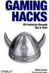</a>
<a class="picright" href="image/gamingHacksArticle.png">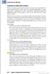</a>

Since around 2001, Starmen.Net's most fanatical and brilliant EarthBound fans have been drawn to <a href="/pkhack">PK Hack</a>. In a nutshell, PK Hack is an entire suite of powerful tools which fans can use to 'hack' EarthBound into...well, pretty much anything. You can insert your own sprites, your own text, your own maps, even your own items and weapons. Wow! 
 
In late 2004, a book named '<a href="http://books.google.ca/books?vid=ISBN0596007140&id=zrqz84QUuSEC&printsec=titlepage&vq=pk+hack&dq=gaming+hacks">Gaming Hacks</a>' appeared, and much to our surprise, had <a href="http://books.google.ca/books?vid=ISBN0596007140&id=zrqz84QUuSEC&pg=PA270&lpg=PA270&vq=pk+hack&dq=gaming+hacks&sig=tB_Y2XWOzgpm0EQbj0qCPfJiLAo&hl=en">a paragraph and a link to PK Hack on page 270</a>! Well-deserved recognition for our hackers. Here's the text of the mention:

 "Wow. The scene, based on the classic SNES game EarthBound, is particularly committed...There's more knowledge here than in many other games combined, so there's plenty to work with." 

<a href="#top" class="backtotop">Back to Top</a>



<a class="picright" href="image/Slashdot-M3Pet-091403.png">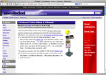</a>

<a href="http://slashdot.org">Slashdot</a> posted a thorough story titled "<a href="http://games.slashdot.org/article.pl?sid=03/09/14/235245">EarthBound Petition Making a Difference?</a>" in which they bring up <a href="http://www.nintendojo.com/infocus/view_item.php?1063562071">Miyamoto's incredible quote</a> about our <a href="http://starmen.net/petition/mother3">Mother 3 Petition</a> and EarthBound fans being solid. They also include a quote from Video-Fenky, the now-defunct webpage of a video game journalist who somehow managed to get his hands on our <a href="http://classic.starmen.net/petition/mother3/pictures#artalbum">Art Album</a>...

 
<a href="#top" class="backtotop">Back to Top</a>



<a class="picleft" href="image/slashdot.gif">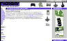</a>

The editors over at <a href="http://games.slashdot.org">Slashdot Games</a> were kind enough to put through a submission titled "<a href="http://games.slashdot.org/article.pl?sid=03/06/21/0133241&tid=207">The Return of EarthBound on GBA</a>". Our hits shot up and we were able to spread a little EarthBound love.

"More info on the games and their currently Japanese-only <a href="http://classic.starmen.net/m123news.php">GameBoy Advance re-release</a> can be found at <a href="http://starmen.net">Starmen.net</a>. Help the site convince Nintendo to release this gem Stateside!"

 
<a href="#top" class="backtotop">Back to Top</a>




<a class="picright" href="image/smnetinegm3.jpg">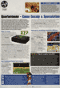</a>

It's EGM, yet again! We're mentioned in Quartermann under "<a href="image/smnetinegm3.jpg">New EarthBound finally Earth-bound</a>" on page 58 of EGM #158. This is our 3rd mention in the magazine, and we're beginning to think that Quartermann has something for us.
  
This time we're mentioned together with speculation of an EarthBound remake for one of Nintendo's new systems, most likely the GBA. This rumor turned out to be true - but, Nintendo also turned out to be as stubborn as ever, and has only released it in Japan.

" ... a new <i>Mother/EarthBound</i> is indeed coming ... The Quartermeister's dough is on an <b><i>EarthBound</i> remake for GBA</b> ... Don't know about <i>EarthBound</i>? The Q suggests you visit www.starmen.net ASAP and read up on this classic gem. Go before I sick Unassuming Local Guy on your sorry arse ... "

 
<a href="#top" class="backtotop">Back to Top</a>



<a class="picright" href="image/ignpetition.jpg">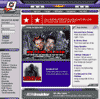</a>

reidman's got the contacts, and he hooked us up with a front page link on IGN Cube to help promote the <a href="http://starmen.net/petition/mother3">Mother 3 Petition</a>. There was no story, just a link titled "Earthbound to GCN Petition" and the words "Help make EB GCN a reality." We received thousands of signatures as soon as the link went up, and they kept coming until the page was updated.

 
<a href="#top" class="backtotop">Back to Top</a>




Yet another magazine! This time we're in WebBound, a quarterly publication that lists the best sites on the web in tons of different categories. Starmen.Net is listed in the section with good fan sites for video games.
  
<a href="image/smnetinwbbig.png">You can see our listing here.</a>

 
<a href="#top" class="backtotop">Back to Top</a>




<a class="picright" href="image/smnetinegm2.jpg">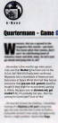</a>

It's EGM again! They must really like us or something. In the October 2000 issue, <a href="image/smnetinegm2.jpg">starmen.net was mentioned in the Quartermann section</a>, which contains game-related rumors and gossip.

We are mentioned near the top of the section where they talk about the cancellation of Mother 3, and how it might not have been cancelled if Nintendo had assurance it wouldn't flop in America:

"Remember a few months ago when yours truly said that <b>Mother 3</b> had been put on the D.O.A. list? Well it's finally been confirmed. Miyamoto told a roundtable of American and Euro press at Space World that had they had an assurace that <b>500,000 U.S. gamers</b> would've bought it they might've reconsidered canning it. Hrmm, hey guys over at <b>starmen.net, get crackin'!</b> Ah, it's probably too late..."

 
<a href="#top" class="backtotop">Back to Top</a>



<a class="picleft" href="image/mag1.jpg">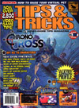</a>
<a class="picright" href="image/smnetintt.jpg">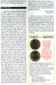</a> 
Tips & Tricks was a popular video gaming magazine, available nationwide at most stores that sold game magazines. Things had been going wrong all summer, but everything started picking up around the time we were mentioned here in the September issue.

Although it was just a very quick mention, and not one by an editor, it was still exciting to be mentioned again in another huge gaming publication. And it did help gain some more signatures for the <a href="http://starmen.net/petition/eb64">EarthBound 64 Petition</a>. We are mentioned in <a href="image/smnetintt.jpg">Svbman's letter about the petition</a> in their letters section. He wrote:

"I want EarthBound 64 released here in the states...If anyone else feels the same way, please visit starmen.net; they have an EarthBound 64 petition you can sign and they are going to send it to Nintendo, bound and very neat-looking. Go sign it!"

 
<a href="#top" class="backtotop">Back to Top</a>




Shigesato Itoi, the creator of EarthBound, runs a personal site at <a href="http://1101.com">1101.com</a> (1101 looks like 'itoi' if you squint). When he announced the cancellation of EarthBound 64 on August 22, 2000, we were shocked. Realizing it was our last hope, and probably the best time to do it, we asked visitors to e-mail him their thoughts on the cancellation, how they felt about his games, etc.

The next day, he mentioned on his site that he had received a huge amount of e-mail since the announcement. Many of them were spiteful, criticizing him and questioning his work. He also mentioned that he had received a large number of e-mails from foreigners, and that although he couldn't understand what a lot of them said, he did understand and was deeply touched by the simple "Thank you" that was written in many of them. Those foreigners were us.

<a href="#top" class="backtotop">Back to Top</a>



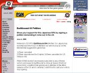

We had been promoting the <a href="http://starmen.net/petition/eb64">EarthBound 64 Petition</a> for several weeks, and had hit a lull in signatures - we only had a few thousand, and our goal was 10,000. reidman, who had made some contacts with some IGN affiliates, managed to contact the people in charge of <a href="http://ign64.ign.com">IGN64</a> by phone and discussed our cause with Matt Cassamassina. The next day we found a news story titled "<a href="http://ign64.ign.com/articles/080/080529p1.html">EarthBound 64 Petition</a>" on IGN64's front page - very awesome.

We received about 5,000 signatures in a matter of a few days thanks to the short story. In addition to the signatures, it brought  a flood of new visitors who would stay on as regulars. Luckily, this time we had a different web host, one who didn't suspend our account because of the sudden burst in traffic.

<a href="#top" class="backtotop">Back to Top</a>



<a class="picleft" href="image/egm124big.jpg">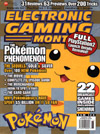</a>
<a class="picright" href="image/egmNOV99.jpg">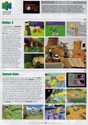</a>

EGM is, and has been for many years, one of the most popular gaming magazines in North America. When we were mentioned in the November 1999 issue, our site was still called 'EarthBound.Net' (it became Starmen.Net in 2000...you can find out more in the <a href="/stonehenge">Stonehenge</a> section).
  
The magazine had a small <a href="image/ebnetinegmbig.jpg">preview of Mother 3/EarthBound 64</a>. In fact, it looks like whoever wrote that article just visited Starmen.Net's Mother 3 section and did their research there. Also included on the page was a small blurb about EarthBound Zero, and how it never came out in America, saying <i>"You can find more information on EarthBound Zero by visiting http://earthbound.net"</i>.
  
We did not expect them to cover EB64, much less EB0. And we certainly didn't expect them to print our URL, so when we found out, things went nuts. A few days after, our web host suspended our account because we had too many visitors coming in. When we finally got back up and running a little while later, we found we had a lot more people who would soon become regulars here.
  
This was our first taste of real fame, but it wasn't our last.

<a href="#top" class="backtotop">Back to Top</a>

