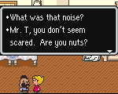


 Starmen.Net has come a long way since its humble beginnings. In fact, the site has become so large that it has become more and more difficult for newcomers to find all the coolest attractions we have to offer. Therefore, we've decided to compile a list of the most unique things on the site, which is what this page is. Read below and see for yourself!



<table><tr><td></td>
<td>Find out all about the group of people behind the Mother and EarthBound series.</td></tr></table>



<table><tr><td></td><td>The game may be canceled, but at Starmen.Net we have compiled what is probably the largest repository of screenshots, videos, and information on EarthBound 64, much of which can't be found anywhere else.  
If, like many of us, you eagerly awaited EB64, you'll feel all kinds of nostalgia when you visit the section <a href="./../eb64">here</a>.</td></tr></table>



<table><tr><td></td>
<td>This database has everything: enemy's possible actions and stats, PSI lists, and so much more.  Look no further for EarthBound data -- this place is the encyclopedia of it all.</td></tr></table>



<table><tr><td></td>
<td>In our Fan Comics section, we have many different <a href="./../comics/series/" target="_blank">comic series</a> to choose from, spanning all of the games and even exploring continuations to the series.  If an epic story isn't your thing, we also have a collection of several <a href="./../comics/byauth/" target="_blank">strips</a> alongside some <a href="./../comics/manga/" target="_blank">translated manga</a> for you to enjoy.</td></tr></table>



<table><tr><td></td>
<td>There are fans bold enough to go out there with camera in hand to film their own skits or stories from EarthBound.  Check out these producers' works and enjoy their mini movies!</td></tr></table>



<table><tr><td></td>
<td>This section is for those shutterbugs out there.  Expect to see real-life lookalikes, cosplays and costumes, and the site's visitors' collection of EarthBound swag.  If a picture's worth a thousand words, you may as well make them EarthBound related, right?</td></tr></table>



<table><tr><td></td>
<td>Flukes are fake screenshots made with sprites from the actual game. Generally, they're made to be comedic. This section is a good place to laugh at people's bad MS Paint skills, too.</td></tr></table>



<table><tr><td></td>
<td>The Starmen.Net Message Board is full of intelligent and interesting people 24 hours a day (heh heh, yeah right). They are delighted to talk about anything -- so long as the discussions follow the rules.  Feel free to drop on by and talk with us!</td></tr></table>



<table><tr><td><imgalphapng width="150" height="150" src="./image/merchandise.png" alt="How did a nice Mr. Saturn like you get onto a CD like this?" /></td>
<td> As Mel Brooks once said, "Merchandising, merchandising! Where the real money from the movie is made!" That mantra also applies to video games. Find out all about what kinds of weird things were made to suck money out of the Mother franchise in our Merchandise section.</td></tr></table>



<table><tr><td></td>
<td> PK Hack is a hacking suite for EarthBound. We supply many different programs to aid those with ambition to create or modify the game of EarthBound itself!  There are many ways to play with the game in the position of programmer, so check out everything you can do or play some of our visitors' games.  Don't take the fun out of EB by cheating though!</td></tr></table>



<table><tr><td><imgalphapng width="150" height="150" src="./image/storepic.png" alt="Our logo! Schweeeeet." /></td>
<td> Buy Starmen.Net related schwag, like shirts, hats, posters, mousepads, even our patented Mugz0rz. Buy now or we'll be forced to say "Hey you guys!" On your second offense of not buying stuff, we send Firegirl to your house to threaten you. Generally, there isn't a third offense.</td></tr></table>



<table><tr><td></td>
<td>Three spirits visit you in the night- the ghosts of Starmen.Net past, present, and future. In the process, you find the true meaning of Christmas. Actually, it's just our meta-site section. Find out the whole story behind how Starmen.Net came to be and where it's going.</td></tr></table>

