

  <a href="#fox">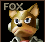</a> <a href="#jigglypuff">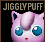</a> <a href="#kirby">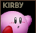</a> <a href="#link">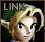</a> 
 
<a href="#luigi">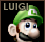</a>   <a href="#pikachu">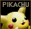</a> <a href="#samus">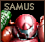</a> <a href="#yoshi">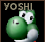</a> 




<table class="fixed" >
    <col width="150px" />
    <col width="1000px" />

    <tr>
        <td>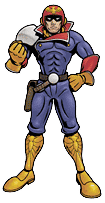</td><td>A regular pilot in the great galactic race F-ZERO Grand Prix, Captain Falcon is skilled at collecting prize money. Much about his past remains hidden in shadow, but it’s clear that many a villain hold a powerful grudge against him.
  
Though his walking speed is quite slow, Captain Falcon has the quickest falling and dashing speeds in the game. He has strong aerial and combo ability, along with a strong finisher. With his endurance, he can be fairly difficult to KO, but he is let vulnerable to edge-guarding, especially with his weak recovery. He also is at a bit of a disadvantage, as he he holds no projectile attack, but his strengths trump his weaknesses and he's considered to be quite a strong character.
  
Works:
<li>F-ZERO (SNES)</li>
<li>F-ZERO X (N64)</li>
</td></tr></table>




<table class="fixed" >
    <col width="150px" />
    <col width="1000px" />

    <tr>
        <td>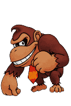</td><td>Donkey Kong and Mario started out as arch-rivals, but they’ve patched things up in recent years. These days DK spends his time searching the jungle for bananas instead of kidnapping beautiful maidens. In the past few years, other members of the Kong family have cashed in on DK’s fame as well, including his favorite nephew, Diddy.
  
With his large size, Donkey Kong can be easy to hit and he does move rather slowly. However, he can use this as an advantage, as he's much harder to knock-out and his bigger demeanor means he can hit... HARD. His attacks can be abused against others to make it difficult to escape his grasp. Unfortunately, DK has very poor cliff recovery and will often fall victim to being out of bounds. In international versions of the game, Donkey Kong did receive an unintentional boost in skills and actually performs much worse in the original Japanese version.
  
Works:
<li>Donkey Kong (NES)</li>
<li>Donkey Kong Country (SNES)</li>

</td></tr></table>




<table class="fixed" >
    <col width="150px" />
    <col width="1000px" />

    <tr>
        <td>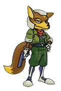</td><td>Following his dead father’s footsteps as the young leader of the Star Fox Team, Fox McCloud’s piloting of the super-high-performance combat ship ARWING for the Lylatian System is still fresh in our memories. His one weakness may be his difficulty earning the trust of his teammates.
  
Fox benefits heavily from being a quick with his walking and dashing, but also falling speed; this also allows him to evade enemy attacks. Many of his moves allow him to perform combo chains, which makes up for his low-powered attacks. He's able to deflect projectiles and his edge-guard game is pretty reliable, not to mention he is able to spike enemies down. However, due to his size and weight, he is also vulnerable to combos and as he doesn't have a solid power move, stages where it's difficult to edge-guard do not work in his favor. Overall, he is one of the strongest characters in the game.
  
Works:

<li>Star Fox (SNES)</li>
<li>Star Fox 64 (N64)</li>

</td></tr></table>



<table class="fixed" >
    <col width="150px" />
    <col width="1000px" />

    <tr>
        <td>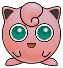</td><td>The Balloon PKMN with the big, round eyes. It sings a soothing melody, sending those that hear it to sleep. When mad, it puffs itself up. As a Balloon PKMN, its body is light, weak, and easy to knock away.
  
With its many low knockback attacks and its lightweight/ float-ability, Jigglypuff has the ability to combo heavyweighters and evade attacks. Though its lightweight makes it easier to KO and it lacks a special recovery, it has decent melee attacks and sports the famous Rest ability. It's a decent fighter, all in all.
  
Works:
<li>Pokémon Blue, Red, & Yellow (GB)</li>

</td></tr></table>



<table class="fixed" >
    <col width="150px" />
    <col width="1000px" />

    <tr>
        <td>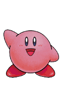</td><td>The 8-inch high Kirby hails from a distant, peaceful star. Like his simplistic appearance, he is an easily-understood character. True to his instincts, Kirby eats when he gets hungry and sleeps as soon as he grows tired. Nevertheless, Kirby remains a formidable opponent. In addition to his distinct flying and swallowing skills, he also has the ability to copy enemy attacks for ever-changing action.
  
Kirby is considered one of the strongest characters in the game. Not only is he quick, his attacks can be quite strong, he has great combo potential, and he has a great edge-guarding advantage. He has powerful aerial attacks, has very good capability to perform combos, and can easily break shields. While his jump allows him a strong recovery, it is however quite linear and his lightweight makes him vulnerable to juggling. Overall, he is a strong character.
  
Works:
<li>Kirby’s Dream Land (GB)</li>
<li>Kirby Super Star (SNES)</li>

</td></tr></table>



<table class="fixed" >
    <col width="150px" />
    <col width="1000px" />

    <tr>
        <td>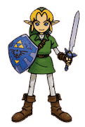</td><td>Link is the valiant boy hero of “Legend of Zelda” series in which he fights against the evil Ganon to recover the Triforce. Though his tools may change with each adventure, his strength and righteousness remain constant. With his trusty sword and a variety of weapons, he takes his adventures head on!
  
Armed with several projectiles and an array of melee attacks, Link has a variety of weapons at his disposal. His recovery is terrible and his lightweight makes him quite easy to pull off combos on. This makes it quite difficult in a match-up, but Link is able to safeguard edges with his bombs and arrows. His slow speed is improved a bit in the PAL version of the game and the Japanese version allows him to pull off far more reliable combos.
  
Works:
<li>The Legend of Zelda: A Link to the Past (SNES)</li>
<li>The Legend of Zelda: Ocarina of Time (N64)</li>

</td></tr></table>



<table class="fixed" >
    <col width="150px" />
    <col width="1000px" />

    <tr>
        <td>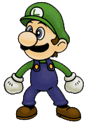</td><td>Though often hidden in his older brother Mario’s shadow, Luigi is, in reality, very popular. Taller than Mario, Luigi also jumps higher. Although he didn’t appear in Super Mario 64, in Mario Kart 64 he performed to the best of his ability. For one who seems to always seems to be in the background, he has many fans who eagerly await his appearance.
  
Luigi is virtually a clone of Mario in terms of attacks, though they were generally weaker. Like Mario, his reach is weak and he's slow, even having some of the worst falling speed and gravity. His offense options are quite limited. Unlike his brother, Luigi can perform the Super Jump Punch, which is a great finisher, but it can be hard to land without combos. His combo game is quite open and versatile, but Luigi is a weak character and is considered to be one of the worst in the game.
  
Works:
<li>Mario Bros. (NES)</li>
<li>Mario Kart 64 (N64)</li>

</td></tr></table>



<table class="fixed" >
    <col width="150px" />
    <col width="1000px" />

    <tr>
        <td>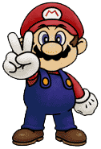</td><td>Although best known as the mustached plumber who battles the Turtle Tribe with his distinct jumping action, this internationally famous hero has also acted as a referee, a driver, and even a doctor! He’s been linked to Princess Peach of the Mushroom Kingdom for years, but to this day their true relationship remains a mystery.
  
Mario is a perfect character for beginners and as an all-rounder character, his skill set is both good is offense and defense. He's pretty quick, has a solid recovery, and is able to pull off a steady stream of aerial combos. His fireball attack also benefits his range and his back-throw can certainly be dangerous. Unfortunately, he does have overall limited range and he is a bit of a linear character. With a bit of skills in each department, however, Mario is still a solid choice.
  
Works:
<li>Super Mario Bros. (NES)</li>
<li>Mario Kart 64 (N64)</li>

</td></tr></table>



<table class="fixed" >
    <col width="150px" />
    <col width="1000px" />

    <tr>
        <td>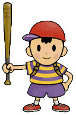</td><td>Ness was a seemingly-average kid from Onett, but in truth, he was destined for much more. When a strange meteorite landed near his hometown, the little boy with psychic powers set out to save the world. Little has been said of Ness’s character, and much remains hidden.
  
Able to double jump cancel, Ness can perform quick aerial and special attacks, allowing him to easily land consistent combos. His lighting attack allows him to perform the most long distance recovery in the game, but it's predictable and is a huge weakness. He has a poor range, so despite his great KO ability, he'll often fail to hit and will fall victim to speedy characters. Ness is considerably stronger in the Japanese release, whereas his abilities were heavily reduced in the international version.
  
Works:
<li>Earthbound (SNES)</li>

</td></tr></table>

 
&nbsp; &nbsp;

&nbsp; &nbsp;

&nbsp; &nbsp;

&nbsp; &nbsp;
 




<table class="fixed" >
    <col width="150px" />
    <col width="1000px" />

    <tr>
        <td>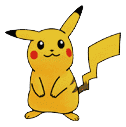</td><td>Pikachu is the star of Pokemon, but don't let those red cheeks fool you! Inside that cute little body is a powerhouse with a <i>shocking</i> amount of potential! There's a reason Ash/Red still choose to stand by this fuzzy buddy.
  
With an outstanding knack for edge-guarding and offstage recovery, Pikachu is already a tough opponent, but it also has moves to rack up combos and powerful ones for easy KO's. Its Quick Attack is unpredictable and even gives Pikachu a few frames of invincibility, which can make all the difference. While susceptible to easy KO's for its lightweight, its benefits strongly outweight its disadvantages and Pikachu is considered to be the best character in the game.
  
Works:
<li>Pokémon (GB)</li>

</td></tr></table>



<table class="fixed" >
    <col width="150px" />
    <col width="1000px" />

    <tr>
        <td>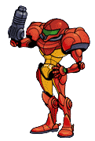</td><td>Samus Aran is the toughest bounty hunter in the galaxy. Using a special suit powered by the technology of the bird people which allows her to execute daring acrobatic feats, Samus pursues the airborne life form, Metroid, throughout the universe.
  
Samus is a heavy-type character who is armed with a strong, but predictable finishing move, the Charge Shot. Despite her weight, she does have a unique floating attribute, which doesn't force her to land as fast; this makes it easier to to avoid combos, but limits her mobility. There's quite a bit lag after her attacks, so if you're going to finish someone off, do so wisely!
  
Works:
<li>Metroid (NES)</li>
<li>Metroid II: The Return of Samus (GB)</li>

</td></tr></table>



<table class="fixed" >
    <col width="150px" />
    <col width="1000px" />

    <tr>
        <td>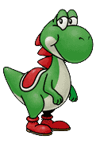</td><td>Yoshi is the friendly dinosaur of Yoshi’s Island. He began as Mario’s partner, but has since built his own identity, and now appears in many games. He uses his unique ability to turn whatever he swallows into an egg as his foremost attack. Yoshis come in a rainbow cloud of colors and are said to have a high IQ from a very early age.
  
Yoshi is equipped with the fastest air speed and his unique egg shield makes him impenetrable to shield stabbing. This allows him to pull off a parry. Jumping midair allows him a type of shield against combos and instead, hit back. Yoshi's medium size and weight does make him easier for light-weight characters for him to combo. His Up special does not offer him a recovery, meaning he must rely on his double jump, but if he flinches on the second jump, he will be unable to save himself. He has a limited range, his grab is slow, but he was buffed considerably in the international release.
  
Works:

<li>Super Mario World 2: Yoshi’s Island (SNES)</li>
<li>Yoshi’s Story (N64)</li>

</td></tr></table>

