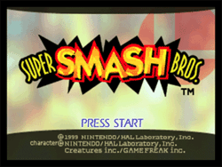
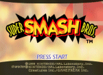
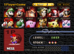
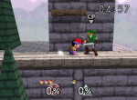



	
	<table valign="top">
		<tr>
			<td class="label">Title:</td>
			<td>Super Smash Bros (US) Nintendo All-Star Dairantou Smash Bros (JP)</td>
		</tr>
		<tr>
			<td class="label">System:</td>
			<td>Nintendo 64 / iQue</td>
		</tr>
		<tr>
			<td class="label">Genre:</td>
			<td>Action/Fighting</td>
		</tr>
		<tr>
			<td class="label">Release:</td>
			<td>April 26, 1999 (US) November 19, 1999 (EU) January 21, 1999 (JP) 2003 (CH)</td>
		</tr>
		<tr>
			<td class="label">Rating:</td>
			<td>E for Everyone (ESRB)</td>
		</tr>
		<tr>
			<td class="label">Price:</td>
			<td>$49.99 (US) ￥5,800 (JP)</td>
		</tr>
		<tr>
			<td class="label">Players:</td>
			<td>1-4</td>
		</tr>
		<tr>
			<td class="label">Publisher:</td>
			<td>Nintendo</td>
		</tr>
		<tr>
			<td class="label">Developer:</td>
			<td>HAL Laboratories</td>
		</tr>
	</table>

Super Smash Brothers! It's the game that kept you busy while forever waiting for a Mother sequel. Released on the N64, this game introduced many a fan to Earthbound and brought us tons of new visitors to contribute to the community. For some reason or another, Nintendo included Ness and some other cool EarthBound references in this game, and here we are. 
 
SSB is a fighting game, but (as with most things from HAL Labs) not typical... it includes Nintendo characters from a wide variety of games. From Samus Aran to Jigglypuff, you can duke it out with an assortment of characters from a variety of Nintendo franchises. You battle your way to the top, gaining secret characters along the way. 
 

But what about Ness, our Earthbound hero? Ness turned out to be one of the best characters in the game (seriously!) - with well rounded moves such as PK Thunder, a smashing bat attack, yo-yo attacks and his unique jump, Ness turned out to be a very formidable foe. He isn't readily accessible, though, but players can earn him as a secret character by beating single player mode on normal with only three stock and without dying. 
 

What really made this game a blast was its multiplayer capabilities. Featuring battles of up to four players, you and your friends could vent all your burning rage together in a battle of the best. The multiplayer action is fun for the family and even the pet goldfish. Or whoever can hold a controller.

 



<b>April 25, 2018:</b>
<ul><li>Characters page was completed and cleaned up. Movesets went through a huge overhaul and are now complete. --CerealQueen</li></ul>

<b>November 7, 2006:</b>
<ul><li>Updated the description and put up a shiny new game statistics box. --reidman</li></ul>

<b>February 25, 2006:</b>
<ul><li>Thumbnailed all the screenshots</li></ul>

<b>August 26th, 2005:</b>
<ul>
<li>Replaced old screenshots with new and better ones</li>
<li>Vital Stats added</li>
<li>Minimal text information changes</li>
</ul>



<table1 />
 Section maintainer:
<table2 />
 <a href="https://forum.starmen.net/members/CerealQueen">CerealQueen</a>
<table3 />

