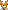
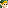
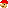



<a href="#captain falcon"> Captain Falcon</a> &nbsp;&nbsp;&nbsp;
<a href="#donkey kong"> Donkey Kong</a> &nbsp;&nbsp;&nbsp;
<a href="#fox"> Fox</a> &nbsp;&nbsp;&nbsp;
<a href="#jigglypuff"> Jigglypuff</a> &nbsp;&nbsp;&nbsp;
<a href="#kirby"> Kirby</a> &nbsp;&nbsp;&nbsp;
<a href="#link"> Link</a> &nbsp;&nbsp;&nbsp;
<a href="#luigi"> Luigi</a> &nbsp;&nbsp;&nbsp;
<a href="#mario"> Mario</a> &nbsp;&nbsp;&nbsp;
<a href="#ness"> Ness</a> &nbsp;&nbsp;&nbsp;
<a href="#pikachu"> Pikachu</a> &nbsp;&nbsp;&nbsp;
<a href="#samus"> Samus</a> &nbsp;&nbsp;&nbsp;
<a href="#yoshi"> Yoshi</a> 




<table border="1">
    <col width="200px" />
    <col width="150px" />
    <col width="100px" />
    <col width="800px" />

  <tr>
    <th>Buttons</th>
    <th>Move</th>
    <th>Damage Percentage</th>
    <th>Description</th>
  </tr>
  <tr>
    <th></th>
    <th>1-2 Kick Combo</th>
    <th>2-3% then 3-4%</th>
    <th>Jab, Knee, a Series of quick punches. These punches do 1% each</th>
  </tr>
  <tr>
    <th>  </th>
    <th>Shoulder Bash</th>
    <th>12%</th>
    <th>this attack has good knockback and can be used to combo heavier characters.</th>
  </tr>
  <tr>
    <th>  </th>
    <th>Straight Kick</th>
    <th>13%</th>
    <th>Like a lot of forwards, this can be angled.</th>
  </tr>
  <tr>
    <th>  </th>
    <th>High Dropkick</th>
    <th>4-9%, then 6-14%</th>
    <th>Puts his leg high and drops it like an axe. This attack is unique because it can hit from behind, and at the start of the move, above Falcon. The move in general has somewhat high lag, though.</th>
  </tr>
  <tr>
    <th>  </th>
    <th>Low Kick</th>
    <th>11%</th>
    <th>Does a quick kick while crouching. Slightly disjointed hitbox but has a high amount of ending lag.</th>
  </tr>
  <tr>
    <th>  </th>
    <th>Mega Fire Kick</th>
    <th>19%</th>
    <th>Does a flaming forward kick. Somewhat resembles his Falcon Kick in terms of special effects. It is slow. But has the best knockback and damage of all his Smashes.</th>
  </tr>
  <tr>
    <th>  </th>
    <th>Shoulder Uppercut</th>
    <th>17%</th>
    <th>Uppercut. Very high hitstun</th>
  </tr>
  <tr>
    <th>  </th>
    <th>Spinning Sweep</th>
    <th>16%</th>
    <th>A “down spin kick”. If the attack connects closer to the body, the opponent will be sent upwards.</th>
  </tr>
  <tr>
    <th>  </th>
    <th>Weak Kick</th>
    <th>16% (Max)</th>
    <th>Progressively Weaker Kick.</th>
</tr>
  <tr>
    <th>    </th>
    <th>Double Kick</th>
    <th>11-22%</th>
    <th>Does two kicks in front for him.</th>
  </tr>
  <tr>
    <th>    </th>
    <th>Flipkick</th>
    <th>16%</th>
    <th>Flips in the air. Wow.</th>
  </tr>
  <tr>
    <th>    </th>
    <th>Downward Kick</th>
    <th>14% </th>
    <th>Air Stomp. Very long duration. This is a meteor smash</th>
  </tr>
  <tr>
    <th>    </th>
    <th>Backward Punch</th>
    <th>16%</th>
    <th>Extends his fist behind him. A basic edgeguarding move with good power and no sweetspot. Strongest back aerial in the game.</th>
  </tr>
  <tr>
    <th></th>
    <th>Falcon Punch!</th>
    <th>24%</th>
    <th> Falcon Pawnch.</th>
  </tr>
  <tr>
    <th>  </th>
    <th>Grab Attack</th>
    <th>20%</th>
    <th>Does a leap into the air. If he grabs an opponent, he launches them diagonally upwards powerfully.If it hits the opponent, it lets Falcon use the move again, otherwise he will become helpless.</th>
  </tr>
  <tr>
    <th>  </th>
    <th>Falcon Kick!</th>
    <th>15%</th>
    <th>Performs a blazing kick while rushing forward. If used in midair, he moves at a diagonal angle down fairly quickly</th>
  </tr>
  <tr>
    <th>  </th>
    <th>Forward Slam</th>
    <th>11%</th>
    <th>Slams the opponent down in front of him. Having very low knockback for a grab.</th>
  </tr>
  <tr>
    <th>  </th>
    <th>Backwards Kick</th>
    <th>16%</th>
    <th>He kicks the opponent back. This throw has much more knockback than his forward throw.</th>
  </tr>
</table>




<table border="1">
    <col width="200px" />
    <col width="150px" />
    <col width="100px" />
    <col width="800px" />

  <tr>
    <th>Buttons</th>
    <th>Move</th>
    <th>Damage Percentage</th>
    <th>Description</th>
  </tr>
  <tr>
    <th></th>
    <th>One-Two Punch</th>
    <th>4%</th>
    <th>The standard punch for DK. You can tap A twice to make it a One-Two punch, but other than this, the attack has no benefits.</th>
  </tr>
  <tr>
    <th>  </th>
    <th>Strong Kick</th>
    <th>12%</th>
    <th>When you run through a stage and tap A, DK will perform a (slow) kick. This can be helpful for knocking an enemy up in the air for other attacks.</th>
  </tr>
  <tr>
    <th>  </th>
    <th>Swining Punch</th>
    <th>12%</th>
    <th>A stronger punch than DK’s standard one. Other than how much damage it produces, the effects are about the same.</th>
  </tr>
  <tr>
    <th>  </th>
    <th>Waving Knock</th>
    <th>13%</th>
    <th>This attack is similar (if not the same) to DK’s aerial Up-attack. In order for the attack to work, an enemy must be above you to inflict damage upon them.</th>
  </tr>
  <tr>
    <th>  </th>
    <th>Crouching Swipe</th>
    <th>8%</th>
    <th>When crouching, DK will swipe his hand at an enemy’s legs. This can be useful for knocking enemies away a bit, but it won’t cause any major damage.</th>
  </tr>
  <tr>
    <th>  </th>
    <th>Giant Slap</th>
    <th>20%</th>
    <th>While this may be one of DK’s slower attacks, it is very powerful and can potentially KO an enemy, if given enough time to do so.</th>
  </tr>
  <tr>
    <th>  </th>
    <th>Hand Clap</th>
    <th>21%</th>
    <th>This attack must be expertly timed, as an enemy has to be just above DK before delivering the blow. If performed correctly, it will knock an enemy upwards, potentially resulting in a KO.</th>
  </tr>
  <tr>
    <th>  </th>
    <th>Spinning Splits</th>
    <th>19%</th>
    <th>This is a very useful attack for DK, as it is both damaging and relatively quick. And not only this, but the attack has full range, damaging enemies to both the left and right of DK.</th>
  </tr>
  <tr>
    <th>  </th>
    <th>Spin</th>
    <th>15%</th>
    <th>DK performs a quick spin in mid-air, resulting in a relatively strong neutral attack.</th>
</tr>
  <tr>
    <th>    </th>
    <th>Spinning Spike</th>
    <th>14%</th>
    <th>This can be described as a “meteor smash” attack, as DK will knock an enemy down towards the ground immediately. If he is out over an edge next to an enemy and performs this attack, the enemy could potentially be sent to the bottom of the stage almost instantly, resulting in a KO.</th>
  </tr>
  <tr>
    <th>    </th>
    <th>Waving Knock</th>
    <th>12%</th>
    <th>This attack is similar (if not the same) to DK’s ground Up-attack. In order for the attack to work, an enemy must be above you to inflict damage upon them.</th>
  </tr>
  <tr>
    <th>    </th>
    <th>Meteor Smash</th>
    <th>13%</th>
    <th>DK will quickly jut his feet down, sending an enemy crashing to the ground. This attack is easier to perform than the Spinning Spike, but it is significantly slower.</th>
  </tr>
  <tr>
    <th>    </th>
    <th>Backwards Kick</th>
    <th>14%</th>
    <th>This can be mistaken for DK’s neutral aerial attack, but it is quite useful for aerial combat even so.</th>
  </tr>
  <tr>
    <th></th>
    <th>Giant Punch</th>
    <th>14-36%</th>
    <th>This is DK’s strongest attack. Because it is a charged attack, the amount of damage you can inflict is dependent on how long you charge the punch. A fully-charged punch could potentially KO an enemy.</th>
  </tr>
  <tr>
    <th>  </th>
    <th>Spinning Kong</th>
    <th>8%</th>
    <th>DK’s spinning attack is more useful for returning to a stage’s platform rather than use in combat. However, it can be useful for preventing an enemy from grabbing an item, if you are quick enough. The height of this attack is nothing substantial, but it can cover great distances across a stage.</th>
  </tr>
  <tr>
    <th>  </th>
    <th>Ground Pound</th>
    <th>10%+4%</th>
    <th>This a great attack to use if you are ever caught in a crossfire between other enemies. All foes within close range will be sent upward, causing a bit of damage. More damage can be continuously inflicted if an enemy cannot get away and falls towards you.</th>
  </tr>
  <tr>
    <th>  </th>
    <th>Trap Throw</th>
    <th>7%+7%</th>
    <th>DK will grab an enemy and place them on his back, causing a little bit of damage. If thrown, the enemy will receive the same amount of damage again.</th>
  </tr>
  <tr>
    <th>  </th>
    <th>Backward Throw</th>
    <th>18%</th>
    <th>This is a much stronger throw than DK’s Trap Throw. It is also much quicker, making it a deadly threat for other enemies.</th>
  </tr>
</table>




<table border="1">
    <col width="200px" />
    <col width="150px" />
    <col width="100px" />
    <col width="800px" />

  <tr>
    <th>Buttons</th>
    <th>Move</th>
    <th>Damage Percentage</th>
    <th>Description</th>
  </tr>
  <tr>
    <th></th>
    <th> 1-2 Punch Combo</th>
    <th>4% (Per Punch) 1% (Kick)</th>
    <th>Super fast attack with two initial punches. If you tap A rhythmically and quickly, you can let loose a nice volley of kicks that can combo into other moves.</th>
  </tr>
  <tr>
    <th>  </th>
    <th>Power Kick</th>
    <th>10%</th>
    <th>Due to the speed of this, you can go into a tilt nicely. Don’t go 
too far with the leap, though!</th>
  </tr>
  <tr>
    <th>  </th>
    <th>Straight Kick</th>
    <th>9%</th>
    <th>Fast and short ranged. A close combat move for sure.</th>
  </tr>
  <tr>
    <th>  </th>
    <th>High Kick</th>
    <th>9%</th>
    <th>The keystone of combo moves. This is the move that will most easily get your opponent in the air, despite its short range.</th>
  </tr>
  <tr>
    <th>  </th>
    <th>Tail Sweep</th>
    <th>12%</th>
    <th>If the opponent’s damage is low enough, this can possibly lead into a smash. Otherwise, it is still a decent move.</th>
  </tr>
  <tr>
    <th>  </th>
    <th>Jumping Double Spin Kick</th>
    <th>17%</th>
    <th>A grade-A, cool looking, KO-ready move</th>
  </tr>
  <tr>
    <th>  </th>
    <th>Flip Kick</th>
    <th>16%</th>
    <th>Basically a stronger version of the up tilt with a little more lag. Great KO power</th>
  </tr>
  <tr>
    <th>  </th>
    <th>Split Kick</th>
    <th>14%</th>
    <th>Great for pesky swarming enemies. Both sides hit at the same time and can set up various combos/KO’s.</th>
  </tr>
  <tr>
    <th>  </th>
    <th>Progressively Weaker Kick</th>
    <th>14%</th>
    <th>Quick with great range!</th>
  </tr>
  <tr>
    <th>    </th>
    <th>Sideways Spinning Kick</th>
    <th>12%</th>
    <th>Familiar to a tilt attack! Good aerial move in general.</th>
  </tr>
  <tr>
    <th>    </th>
    <th>Vertical Flip Attack</th>
    <th>2%, 13%</th>
    <th>For the juggling.</th>
  </tr>
  <tr>
    <th>    </th>
    <th>Diagonal Spinning Kick</th>
    <th>Possible 14%</th>
    <th>Lots of hits here! No real knockback, but a decent set up</th>
  </tr>
  <tr>
    <th>    </th>
    <th>Air Split Kick</th>
    <th>12%</th>
    <th>Gymnastics Fox! This move just looks cool, and it can maybe be used in the occasional edgeguard.</th>
  </tr>
  <tr>
    <th></th>
    <th>Blaster</th>
    <th>5%</th>
    <th>It fires faster in the air, oddly.Really fast. You can reload quickly by jumping right after the initial shot and get 10% damage in lickety split.</th>
  </tr>
  <tr>
    <th>  </th>
    <th>Fire Fox</th>
    <th>12-16%</th>
    <th>Not the best move for attacking, despite its power, due to serious lag and possibility of missing. Great for saves, however.</th>
  </tr>
  <tr>
    <th>  </th>
    <th>Reflector</th>
    <th>3-5%</th>
    <th>Great stunning move! A lot of things you can do with this shield here. If anyone ever throws something at you, you can also deflect it back at them. There is a special move that goes with this, but we’ll go in depth on that later!</th>
  </tr>
  <tr>
    <th>  </th>
    <th>Forward Toss</th>
    <th>12%</th>
    <th>Decent KO power, simple throw</th>
  </tr>
  <tr>
    <th>  </th>
    <th>Roll Throw</th>
    <th>15%</th>
    <th>Not as much KO power, but more damage and it looks cool!</th>
  </tr>
</table>




<table border="1">
    <col width="200px" />
    <col width="150px" />
    <col width="100px" />
    <col width="800px" />

  <tr>
    <th>Buttons</th>
    <th>Move</th>
    <th>Damage Percentage</th>
    <th>Description</th>
  </tr>
  <tr>
    <th></th>
    <th>Punch</th>
    <th>3%</th>
    <th>A pretty wimpy looking punch. Can be used pretty quickly in succession, however.</th>
  </tr>
  <tr>
    <th>  </th>
    <th>Body Slam </th>
    <th>10%</th>
    <th>Rams into the opponent bro-bellybump style. Pretty good throwback, and also reflects Jigglypuff’s gangsta vibe.</th>
  </tr>
  <tr>
    <th>  </th>
    <th>Roundhouse Kick</th>
    <th>8%</th>
    <th>Standard kick.</th>
  </tr>
  <tr>
    <th>  </th>
    <th>Back Kick</th>
    <th>10%</th>
    <th>Showing off Jigglypuff’s creepy contorting abilities, she attacks by swinging her foot backward and over her head to attack all sides. Good move to use while surrounded.</th>
  </tr>
  <tr>
    <th>  </th>
    <th>Low Punch</th>
    <th>10%</th>
    <th>Jigglypuff flattens herself to punch enemies where the sun don’t shine. This attack has slightly better throwback and total attack damage then the Standard Punch.</th>
  </tr>
  <tr>
    <th>  </th>
    <th>Slide Kick</th>
    <th>16%</th>
    <th>A slide kick. It was great throwback, and it’s not too shabby in the damage department, either.</th>
  </tr>
  <tr>
    <th>  </th>
    <th>Headbutt</th>
    <th>18%</th>
    <th>This headbutt looks a lot like Jigglypuff is hugging you. Which is…you know, ironic…because she’s attacking you. So, uh…yeah.</th>
  </tr>
  <tr>
    <th>  </th>
    <th>Split Kick</th>
    <th>16%</th>
    <th>Jigglypuff does a split and kicks on both sides. Great if you’re surrounded, although had it been me doing that move, I’d be in the hospital.</th>
  </tr>
  <tr>
    <th>  </th>
    <th>Air Kick</th>
    <th>14%-down</th>
    <th>A kick in the air. Progressively weakens.</th>
</tr>
  <tr>
    <th>    </th>
    <th>Two-Foot Air Kick</th>
    <th>13%</th>
    <th>An Air Kick with both of it’s cute little feetsies.</th>
  </tr>
  <tr>
    <th>    </th>
    <th>Air Chop</th>
    <th>16%</th>
    <th>This midair karate chop almost looks like its waving. Ohai-ya!</th>
  </tr>
  <tr>
    <th>    </th>
    <th>Drill Kick</th>
    <th>3-30%</th>
    <th>A downward drill kick. It’s actually a really great combo move, especially with Jigglypuff being able to fly.</th>
  </tr>
  <tr>
    <th>    </th>
    <th>Midair Power Punch</th>
    <th>13%</th>
    <th>Same as the neutral B attack, but in midair.</th>
  </tr>
  <tr>
    <th></th>
    <th>Power Punch</th>
    <th>13%</th>
    <th>Now you’re punching with Power! This attack has a really nice throwback, and the damage it gives isn’t too bad, either. It’s also a great move to annoy your friends, because Jigglypuff yells “PUFF!” every time.</th>
  </tr>
  <tr>
    <th>  </th>
    <th>Sing</th>
    <th>—%</th>
    <th>Does no damage, but puts the surrounding enemies to sleep for 5 seconds. Great for getting out of jams or setting up a smash attack. Note that Sing keeps you from attacking for 2 seconds, so try not to miss.</th>
  </tr>
  <tr>
    <th>  </th>
    <th>Sleep</th>
    <th>20%</th>
    <th>Dropping from the sky and landing on a person while doing this move is the only way to deal damage, but when it hits… Oh man, this could easily be the greatest move the little puffball has. The exceptional damage and throwback it gives makes it a brilliant finishing move.</th>
  </tr>
  <tr>
    <th>  </th>
    <th>Upward Throw</th>
    <th>14%</th>
    <th>Jigglypuff grabs the opponent and throws them up into the air.</th>
  </tr>
  <tr>
    <th>  </th>
    <th>Backward Throw</th>
    <th>16%</th>
    <th>After grabbing the enemy, Jigglypuff falls backward and bounces back up while simultaneously throwing the opponent backward.</th>
  </tr>
</table>




<table border="1">
    <col width="200px" />
    <col width="150px" />
    <col width="100px" />
    <col width="800px" />

  <tr>
    <th>Buttons</th>
    <th>Move</th>
    <th>Damage Percentage</th>
    <th>Description</th>
  </tr>
  <tr>
    <th></th>
    <th>Double Jab + Multiple Punches</th>
    <th>4% [2 hit], then 1% [3+ hits]</th>
    <th>Jabs have short range, but the later punches have better reach.</th>
  </tr>
  <tr>
    <th>  </th>
    <th>Slide Tackle</th>
    <th>10%</th>
    <th>It’s a fast move. and also a good combo starter.</th>
  </tr>
  <tr>
    <th>  </th>
    <th>Roundhouse Kick</th>
    <th>10%</th>
    <th>A fast kick that has a short range. Can be trouble when the enemy has a high damage percentage.</th>
  </tr>
  <tr>
    <th>  </th>
    <th>Backward Kick</th>
    <th>14%</th>
    <th>A fast, powerful backward kick that can become a great air combo starter.</th>
  </tr>
  <tr>
    <th>  </th>
    <th>Down Kick</th>
    <th>9%</th>
    <th>A low kick.</th>
  </tr>
  <tr>
    <th>  </th>
    <th>Jump Kick</th>
    <th>17%</th>
    <th>Fast long-range kick with a big hitbox. The second strongest F-Smashes in the game.</th>
  </tr>
  <tr>
    <th>  </th>
    <th>Flip Kick</th>
    <th>16%</th>
    <th>A fast flipkick that can kill most of the characters after 100% damage.</th>
  </tr>
  <tr>
    <th>  </th>
    <th>Spin Kick</th>
    <th>18%</th>
    <th>A fast spin kick that can send enemies flying horizontally.</th>
  </tr>
  <tr>
    <th>  </th>
    <th>Spin Attack</th>
    <th>15%</th>
    <th>Kirby extends arms and legs (feets and hands?) and spins in the air. His entire body becomes a hitbox.</th>
</tr>
  <tr>
    <th>    </th>
    <th>Frontal Drill Kick</th>
    <th>8 hits: 2% 1st-7th kick, 6% 8th kick</th>
    <th>Kirby uses his feets as a drill. Great for continuing an air combo.</th>
  </tr>
  <tr>
    <th>    </th>
    <th>Air Spin</th>
    <th>10%</th>
    <th>An attack with small knockback. Great for air combos and keeping enemies in the air.</th>
  </tr>
  <tr>
    <th>    </th>
    <th>Downward Drill Kick</th>
    <th>10 kicks, 3% each</th>
    <th>Kirby uses his feet as a drill. Can be used as a Spiking attack if the enemy is in the air. When used on a grounded foe, if the move doesn’t finish when Kirby reaches the ground, Kirby will land on the foe with some knockback, making Up Tilt follow-ups impossible, unless the move is L-Canceled or the move finishes just before Kirby lands.</th>
  </tr>
  <tr>
    <th>    </th>
    <th>Back Air Kick</th>
    <th>16%</th>
    <th>Kirby kicks using both is feet. Great for edge-guarding.</th>
  </tr>
  <tr>
    <th></th>
    <th>Inhale</th>
    <th>6% after absorbing an ability; 10% after spitting</th>
    <th>With this move you can either earn your enemy’s Neutral B attack, spit them (though the knockback stays the same no matter what level) or just eat your enemies while they’re trying to recover killing yourself in the process. YAY, SUICIDE!</th>
  </tr>
  <tr>
    <th>  </th>
    <th>Final Cutter</th>
    <th>8% first hit, 3% following 2 hits</th>
    <th>A rising, then descending sword attack that can be used as a spike attack by skilled (and suicidal) players. </th>
  </tr>
  <tr>
    <th>  </th>
    <th>Stone</th>
    <th>20%</th>
    <th>Kirby turns into a stone and quickly falls down. Deals serious damage, and if the enemy is in the verge of dying, it can be your key to victory, or your downfall, if misused.</th>
  </tr>
  <tr>
    <th>  </th>
    <th>High Jump</th>
    <th>13%</th>
    <th>Jumps high in the air, and slams down. </th>
  </tr>
  <tr>
    <th>  </th>
    <th>Suplex</th>
    <th>16%</th>
    <th>Performs a backwards suplex, slamming the opponent behind him. Sends the foe upwards and behind Kirby at an angle.</th>
  </tr>
</table>




<table border="1">
    <col width="200px" />
    <col width="150px" />
    <col width="100px" />
    <col width="800px" />

  <tr>
    <th>Buttons</th>
    <th>Move</th>
    <th>Damage Percentage</th>
    <th>Description</th>
  </tr>
  <tr>
    <th></th>
    <th>Swipe</th>
    <th>5% [1 hit], then 4% [2+ hits]</th>
    <th>A small slice attack.</th>
  </tr>
  <tr>
    <th>  </th>
    <th>Lunging Stab</th>
    <th>6-14%</th>
    <th>Run, lunge, and staaaaaab. Good throwback, especially when enemy damage is high.</th>
  </tr>
  <tr>
    <th>  </th>
    <th>Slice</th>
    <th>18% [1 hit], 14% [2-5 hits], 7% [6+ hits]</th>
    <th>A more powerful slice attack. Pretty good throwback.</th>
  </tr>
  <tr>
    <th>  </th>
    <th>Upper Cut</th>
    <th>10% [1 hit], 8% [2-5 hits], 4%[6+ hits]</th>
    <th>Standard upward slice.</th>
  </tr>
  <tr>
    <th>  </th>
    <th>Leg Slice</th>
    <th>12% [1 hit], 9% [2-3 hits], 5% [4+ hits]</th>
    <th>A low slice attack. Almost always knocks down the opponent.</th>
  </tr>
  <tr>
    <th>  </th>
    <th>Power Slice</th>
    <th>5-20%</th>
    <th>A full swing. On top of being a great muscular workout, this attack has a great throwback.</th>
  </tr>
  <tr>
    <th>  </th>
    <th>3x Upper Cut</th>
    <th>6-22%</th>
    <th>Three quick upward slices. This move has the potential to shoot enemies high up into the air, but only if you land all three slices. Otherwise, you may be doomed to a max of 10%.</th>
  </tr>
  <tr>
    <th>  </th>
    <th>Leg Sweep</th>
    <th>6-16%</th>
    <th><i>Sweep the leg!</i> Of course, it would be a lot more painful considering that you’re using a sword to do it. This move is almost guaranteed to knock an opponent to the ground.</th>
  </tr>
  <tr>
    <th>  </th>
    <th>Aerial Kick</th>
    <th>10% [1 hit], 8% [2-5 hits], 4% [6+ hits]</th>
    <th>A standard aerial kick attack. </th>
</tr>
  <tr>
    <th>    </th>
    <th>Air Slice</th>
    <th>20% [1 hit], 15% [2-3 hits], 8% [4+ hits]</th>
    <th>A strong swing of the sword midair. Good throwback.</th>
  </tr>
  <tr>
    <th>    </th>
    <th>Upward Stab</th>
    <th>16% [1 hit], 12% [2-5 hits], 6% [6+ hits]</th>
    <th>A stab from below. This move has a pretty good throwback, which seems to be a recurring theme in Link’s A Button attacks.</th>
  </tr>
  <tr>
    <th>    </th>
    <th>Pogo Stab</th>
    <th>6-16 per hit%</th>
    <th>A stab from above. This attack is beautiful for chains. Against one foe, this attack can generally chain about 2 times, but with multiple enemies you can make a slightly larger chain.</th>
  </tr>
  <tr>
    <th>    </th>
    <th>Backward Kick</th>
    <th>10% [1 hit], 8% [2-5 hits], 4% [6+ hits]</th>
    <th>Other than the Swipe attack, this is probably Link’s worst move. It’s awkward to try to land deliberately, and the payoff isn’t really worth the effort.</th>
  </tr>
  <tr>
    <th></th>
    <th>Boomerang</th>
    <th>9% [1 hit], 7% [2-5 hits], 5% [6+ hits]</th>
    <th>Ah, the boomerang. This attack is highly maneuverable. Once the boomerang is thrown, it has the opportunity to come back if it misses. If you jump over it on it’s way back, it can potentially hit a person behind you, too.</th>
  </tr>
  <tr>
    <th>  </th>
    <th>Spin Attack</th>
    <th>6-16%</th>
    <th>Link’s ultimate spam move. Although, it seems the game designers realized this; Every attack after the first one is only 6%. It still has an amazing throwback, though, so all in all it’s one of Link’s best moves.</th>
  </tr>
  <tr>
    <th>  </th>
    <th>Bomb</th>
    <th>3-13%</th>
    <th><i>Bombs?</i> This projectile is fantastic when used properly, but can be a double edged sword. If you throw it before it goes off it can hit whoever’s in range, but if you wait to long…boom.</th>
  </tr>
  <tr>
    <th>  </th>
    <th>Forward Hookshot Throw</th>
    <th>4% [1 hit], 11% [2+ hits]</th>
    <th>The use of the Hookshot allows Link to grab foes from far away. Other than that, it’s a pretty standard throw.</th>
  </tr>
  <tr>
    <th>  </th>
    <th>Back Throw</th>
    <th>16% [1 hit], 12% [2+ hits]</th>
    <th>This attack is basically the same as the forward throw, but it does just a bit more damage. It’s only by 2% though, so it doesn’t really make that big of a difference.</th>
  </tr>
</table>




<table border="1">
    <col width="200px" />
    <col width="150px" />
    <col width="100px" />
    <col width="800px" />

  <tr>
    <th>Buttons</th>
    <th>Move</th>
    <th>Damage Percentage</th>
    <th>Description</th>
  </tr>
  <tr>
    <th></th>
    <th>Punch, Kick, Punch combo</th>
    <th>2%, 2%, 4%</th>
    <th>Standard punch, kick, punch.</th>
  </tr>
  <tr>
    <th>  </th>
    <th>Flailing Punches</th>
    <th>2% x5</th>
    <th>Rams into opponents with arms flailing about.</th>
  </tr>
  <tr>
    <th>  </th>
    <th>Roundhouse Kick</th>
    <th>10%</th>
    <th>Standard kick.</th>
  </tr>
  <tr>
    <th>  </th>
    <th>Uppercut</th>
    <th>10%</th>
    <th>Great for when an opponent is directly above you.</th>
  </tr>
  <tr>
    <th>  </th>
    <th>Low Kick</th>
    <th>Varies</th>
    <th>Kick low to the ground.</th>
  </tr>
  <tr>
    <th>  </th>
    <th>Super Punch</th>
    <th>15%</th>
    <th>Decent damage and decent knockback.</th>
  </tr>
  <tr>
    <th>  </th>
    <th>Headbutt</th>
    <th>19%</th>
    <th>Stronger damage, less knockback.</th>
  </tr>
  <tr>
    <th>  </th>
    <th>Breakdance…?</th>
    <th>17%</th>
    <th>Often helps when bombarded with opponents, but may be too slow.</th>
  </tr>
  <tr>
    <th>  </th>
    <th>Progressively Weaker Kick</th>
    <th>14%</th>
    <th>Kick that gets progressively weaker.</th>
</tr>
  <tr>
    <th>    </th>
    <th>Side Drill Kick</th>
    <th>16%</th>
    <th>Like the normal Drill Kick, but to the side and without multiplying damage.</th>
  </tr>
  <tr>
    <th>    </th>
    <th>Flip Kick</th>
    <th>12%</th>
    <th>Flips and kicks.</th>
  </tr>
  <tr>
    <th>    </th>
    <th>Drill Kick</th>
    <th>3% x8</th>
    <th>Drills into opponents 8 rapid, consecutive times.</th>
  </tr>
  <tr>
    <th>    </th>
    <th>Kick Flip</th>
    <th>Varies</th>
    <th>Kicks and Flips.</th>
  </tr>
  <tr>
    <th></th>
    <th>Green Grafity-Defying Fireballs</th>
    <th>7%</th>
    <th>Are green and are not and are not affected by gravity. Decent projectile for Luigi.</th>
  </tr>
  <tr>
    <th>  </th>
    <th>Super Jump Punch</th>
    <th>25%</th>
    <th>Has a chance of doing 1%.</th>
  </tr>
  <tr>
    <th>  </th>
    <th>Luigi Cyclone</th>
    <th>15%</th>
    <th>Rapidly spins. Can be done in air. Very floaty.</th>
  </tr>
  <tr>
    <th>  </th>
    <th>Ring Around</th>
    <th>16%</th>
    <th>***Forward throw.</th>
  </tr>
  <tr>
    <th>  </th>
    <th>Flip</th>
    <th>12%</th>
    <th>***Back throw.</th>
  </tr>
</table>




<table border="1">
    <col width="200px" />
    <col width="150px" />
    <col width="100px" />
    <col width="800px" />

  <tr>
    <th>Buttons</th>
    <th>Move</th>
    <th>Damage Percentage</th>
    <th>Description</th>
  </tr>
  <tr>
    <th></th>
    <th>Jab, Punch, Kick</th>
    <th>2%, 4%, 5%</th>
    <th>Starting with a Jab, which is the best for jabbing than quickly grabbing, Mario then punches and kicks. This is taken strait form Super Mario 64.</th>
  </tr>
  <tr>
    <th>  </th>
    <th>Slide</th>
    <th>12%</th>
    <th>A Slide, with slightly higher-than-average cooldown.</th>
  </tr>
  <tr>
    <th>  </th>
    <th>Roundhouse Kick</th>
    <th>13%</th>
    <th>An okay move for spacing but rarely used due to Mario having better options. Comes out fast with decent range.</th>
  </tr>
  <tr>
    <th>  </th>
    <th>Spin Punch</th>
    <th>10%</th>
    <th>High spin punch, Mario twirls and punches upwards. Above average knockback scaling for a tilt attack, can KO at extremely high percentages. It does have low base knockback, meaning it can easily chain into itself at around moderate percentages, though its ending lag is usually too much at base to low percentages for this to be performed efficiently. Can also combo into aerials.</th>
  </tr>
  <tr>
    <th>  </th>
    <th>Spinkick</th>
    <th>10%</th>
    <th>A sweep with the leg. Not very useful.</th>
  </tr>
  <tr>
    <th>  </th>
    <th>Mega Punch</th>
    <th>17%</th>
    <th>His fist enlarges. Worst of his smashes in terms of knockback.</th>
  </tr>
  <tr>
    <th>  </th>
    <th>Upward Headbutt</th>
    <th>19%</th>
    <th>most powerful and best knockback of all of Mario’s smashes. His whole head becomes a very large disjointed hitbox, and it’s a very powerful vertical finisher, being the strongest up smash in the game (tied with Luigi’s and Jigglypuff’s). Its ending lag and somewhat short range horizontally limits its effectiveness however.</th>
  </tr>
  <tr>
    <th>  </th>
    <th>Breakdance</th>
    <th>17%</th>
    <th>Twirls around on the floor. A good combo breaker.</th>
  </tr>
  <tr>
    <th>  </th>
    <th>Progressively Weaker Kick</th>
    <th>14% (Max)</th>
    <th>Kick that gets progressively weaker.</th>
</tr>
  <tr>
    <th>    </th>
    <th>Forward Spin Kick</th>
    <th>16%</th>
    <th>Last few hitboxes can semi-spike, so it can be used for a gimp. Highly useful against the majority of recoveries in the game</th>
  </tr>
  <tr>
    <th>    </th>
    <th>Flip Kick</th>
    <th>12%</th>
    <th>Knockback direction depends on which angle the foe was hit on. Lower power than most of his moves, but an effective juggling and combo move.</th>
  </tr>
  <tr>
    <th>    </th>
    <th>Spin Kick</th>
    <th>3% (8 hits max)</th>
    <th>A useful meteor smash; Similar to Kirby’s down aerial, it can be used multiple times to ensure that the foe is unable to recover. Can combo into itself and up aerial easily. 24% if all hits connect.</th>
  </tr>
  <tr>
    <th>    </th>
    <th>Backwards Kick</th>
    <th>16%</th>
    <th>Nice edgegaurder, but mediocre in terms of back aerials.</th>
  </tr>
  <tr>
    <th></th>
    <th>Fireball</th>
    <th>7%</th>
    <th>Throws a fireball, which travels forward and loses momentum with each bounce. Because of this, they are best used in the air, and at higher locations. They can be spammed, though with some difficulty (and at a slower rate of fire than Luigi’s), and are a decent approaching tactic. The move can be more efficient when used in the air, falling to meet the enemy at ground level, while still moving, and negating lag. </th>
  </tr>
  <tr>
    <th>  </th>
    <th>Super Jump Punch</th>
    <th>15% (Max)</th>
    <th>Does a jumping uppercut, which causes damage and makes coins fly out of the opponent. Can rack up damage. Mainly used for recovery, with great vertical range and decent horizontal range if aimed forward.</th>
  </tr>
  <tr>
    <th>  </th>
    <th>Mario Tornado</th>
    <th>14% (Max)</th>
    <th>Does a spinning tornado attack, resembling the Spin Jump from Super Mario World. Has set knockback. If the lower segment of the final hitbox lands successfully, the move is a meteor smash. If the B button is pressed repeatedly in midair, Mario will rise upwards.</th>
  </tr>
  <tr>
    <th>  </th>
    <th>Ring Around</th>
    <th>12%</th>
    <th>Spins once before tossing the foe. Very mediocre.</th>
  </tr>
  <tr>
    <th>  </th>
    <th>64 Throw</th>
    <th>16%</th>
    <th>Super Mario 64 throw; grabs opponent by the legs and swings them until release. One of the most powerful back throws in the game, a very reliable finisher.</th>
  </tr>
</table>




<table border="1">
    <col width="200px" />
    <col width="150px" />
    <col width="100px" />
    <col width="800px" />

  <tr>
    <th>Buttons</th>
    <th>Move</th>
    <th>Damage Percentage</th>
    <th>Description</th>
  </tr>
  <tr>
    <th></th>
    <th>One Punch</th>
    <th>2%</th>
    <th>It’s a fairly fast punch. Can be repeated to combo.</th>
  </tr>
  <tr>
    <th>  </th>
    <th>Two-Hand Thrust</th>
    <th>10%</th>
    <th>Thrusts with both hands, usually launching foes it hits.</th>
  </tr>
  <tr>
    <th>  </th>
    <th>Kick</th>
    <th>9%</th>
    <th>He’ll roundhouse kick in front of him, however, there is minor end lag. It can be angled.</th>
  </tr>
  <tr>
    <th>  </th>
    <th>Two-Hand Uppercut</th>
    <th>7%</th>
    <th>An uppercut using both hands, with decent speed and power. Can knock foes upwards. </th>
  </tr>
  <tr>
    <th>  </th>
    <th>Crouching Kick</th>
    <th>7%</th>
    <th>A speedy kick, done while crouching. Can be used to combo or grab.</th>
  </tr>
  <tr>
    <th>  </th>
    <th>Bat SMAAAAAASH</th>
    <th>18%</th>
    <th>With his trademark weapon, the bat, Ness will smash the opponent. If it hits, a sound will be heard. Good speed and range.</th>
  </tr>
  <tr>
    <th>  </th>
    <th>Around the World</th>
    <th>17%</th>
    <th>With his trademark weapon, the bat, Ness will smash the opponent. If it hits, a sound will be heard. Good speed and range.</th>
  </tr>
  <tr>
    <th>  </th>
    <th>Walkin' the Dog</th>
    <th>19%</th>
    <th>Ness uses the yo-yo in a side to side motion. Though it hits very low, it has very long range. In fact, it’s the longest ranging Down-Smash in the game.</th>
  </tr>
  <tr>
    <th>  </th>
    <th>Drop Kick</th>
    <th>14%</th>
    <th>An attack that does a falling kick. It has similar properties as the ground Kick. </th>
</tr>
  <tr>
    <th>    </th>
    <th>Air Lunge</th>
    <th>12%</th>
    <th>Ness will do a two-handed lunge at the opponent, like his Dash Attack. Good for knock-back, and decent damage.</th>
  </tr>
  <tr>
    <th>    </th>
    <th>Upwards Headbutt</th>
    <th>15%</th>
    <th>An upwards headbutt. Good at sending foes upwards.</th>
  </tr>
  <tr>
    <th>    </th>
    <th>Spike Kick</th>
    <th>15%</th>
    <th>A quick, short ranged attack.</th>
  </tr>
  <tr>
    <th>    </th>
    <th>Backwards Thrust</th>
    <th>16%</th>
    <th>Ness thrusts with both feet backwards, easily blasting foes off the stage.</th>
  </tr>
  <tr>
    <th></th>
    <th>PK Fire</th>
    <th>20%</th>
    <th>A short range attack that sends a small fireball in front of Ness.</th>
  </tr>
  <tr>
    <th>  </th>
    <th>PK Thunder</th>
    <th>5%</th>
    <th>A long range attack that can be steered. However, you are frozen in place while using it.</th>
  </tr>
  <tr>
    <th>  </th>
    <th>PK Magnet</th>
    <th>_%</th>
    <th>A shield that dosen’t fade away. Projectiles will heal you while it’s up, but normal attacks will still hit you.</th>
  </tr>
  <tr>
    <th>  </th>
    <th>Psychic Throw</th>
    <th>16%</th>
    <th>The foe is lifted with PSI, then thrown with great power and knockback.</th>
  </tr>
  <tr>
    <th>  </th>
    <th>Backwards Psychic Throw</th>
    <th>12%</th>
    <th>Similar to the Psychic Throw, except backwards, for less damage.</th>
  </tr>
</table>




<table border="1">
    <col width="200px" />
    <col width="150px" />
    <col width="100px" />
    <col width="800px" />

  <tr>
    <th>Buttons</th>
    <th>Move</th>
    <th>Damage Percentage</th>
    <th>Description</th>
  </tr>
  <tr>
    <th></th>
    <th>Headbutt</th>
    <th>2%</th>
    <th>A headbutt attack. Good for just inflicting damage, and it can possibly break a shield if used up against a wall.</th>
  </tr>
  <tr>
    <th>  </th>
    <th>Sliding Headbutt</th>
    <th>8%</th>
    <th>It can have potential for finishing, but it is very laggy.</th>
  </tr>
  <tr>
    <th>  </th>
    <th>Sideways Kick</th>
    <th>10%</th>
    <th>A basic attack for damage.</th>
  </tr>
  <tr>
    <th>  </th>
    <th>Overhead Tail Slap</th>
    <th>8%</th>
    <th>Can combo easily and cause juggling. Best combined with an aerial for awesomeness.</th>
  </tr>
  <tr>
    <th>  </th>
    <th>Tail Sweep</th>
    <th>8%</th>
    <th>Laggy, but can possibly be used in finishing if damage is high enough.</th>
  </tr>
  <tr>
    <th>  </th>
    <th>Thunder Zap</th>
    <th>16%</th>
    <th>GREAT killing move if given the time to start up</th>
  </tr>
  <tr>
    <th>  </th>
    <th>Overhead Tailwhip</th>
    <th>14%</th>
    <th>Great for comboing and starting aerial attacks. Thunder also works very well as a follow up. Also has potential for a kill</th>
  </tr>
  <tr>
    <th>  </th>
    <th>Low Kick</th>
    <th>16% (Front), 14% (Back)</th>
    <th>A sweeping kick. Good knockback and good for being surrounded by opponents</th>
  </tr>
  <tr>
    <th>  </th>
    <th>Neutral Kick</th>
    <th>14% -</th>
    <th>A progressively weaker kick.</th>
  </tr>
  <tr>
    <th>    </th>
    <th>Electric Air Headbutt</th>
    <th>2% per hit, up to 12%</th>
    <th>Lots of hits off this move; perfect for combo-ing</th>
  </tr>
  <tr>
    <th>    </th>
    <th>Tail Spin</th>
    <th>8%</th>
    <th>Can get great knockback if opponent is hit by the sweet spot of the tail!</th>
  </tr>
  <tr>
    <th>    </th>
    <th>Electric Dive Attack</th>
    <th>3% if not in a good zone, 10-12% otherwise</th>
    <th>If lands directly on opponent, can do impressive damage with knockback</th>
  </tr>
  <tr>
    <th>    </th>
    <th>Reverse Kick</th>
    <th>16%</th>
    <th>Great move for damage!</th>
  </tr>
  <tr>
    <th></th>
    <th>Thunder Jolt</th>
    <th>6-9%</th>
    <th>Shoots a little ball of electricity like Mario’s fireball. Gets progressively weaker with spam. The best part is that it can electrocutes the opponent to throw them off guard. You can easily take out ledge-hangers if timed correctly!</th>
  </tr>
  <tr>
    <th>  </th>
    <th>Quick Attack</th>
    <th>—%</th>
    <th>It does no damage, but it is a great two-step save that can go in 2 DIRECTIONS. It will help you out of quite a few jams evasively and save you to boot</th>
  </tr>
  <tr>
    <th>  </th>
    <th>Thunder</th>
    <th>10-16%</th>
    <th>Arguably Pikachu’s strongest move. Can hit any opponent directly above in the air with amazing knockback. If your opponent is on the ground next to you, it can even damage the opponent with an aura effect.</th>
  </tr>
  <tr>
    <th>  </th>
    <th>Flip Attack</th>
    <th>14%</th>
    <th>A nice throw. This is how Pikachu rolls</th>
  </tr>
  <tr>
    <th>  </th>
    <th>Electric Throw</th>
    <th>18%</th>
    <th>With electric power, great power comes as well!</th>
  </tr>

</table>



<table border="1">
    <col width="200px" />
    <col width="150px" />
    <col width="100px" />
    <col width="800px" />

  <tr>
    <th>Buttons</th>
    <th>Move</th>
    <th>Damage Percentage</th>
    <th>Description</th>
  </tr>
  <tr>
    <th></th>
    <th>Punch</th>
    <th>3%</th>
    <th>Standard punch.</th>
  </tr>
  <tr>
    <th>  </th>
    <th>Sliding Ram</th>
    <th>12%</th>
    <th>Rams Samus’s shoulder into opponent. It’s a bit slow, but makes up for it by knocking the opponent to the ground. Also has a chance of finishing.</th>
  </tr>
  <tr>
    <th>  </th>
    <th>Roundhouse Kick</th>
    <th>10%</th>
    <th>Standard kick.</th>
  </tr>
  <tr>
    <th>  </th>
    <th>Downward Kick</th>
    <th>13%</th>
    <th>A boot to the head. It’s a slower kick, but doles out more damage. Chance of knockdown.</th>
  </tr>
  <tr>
    <th>  </th>
    <th>Leg Sweep</th>
    <th>13%</th>
    <th>A sweeping leg kick. Pretty good chance of knockdown, but not quite finishing move material.</th>
  </tr>
  <tr>
    <th>  </th>
    <th>Arm Cannon Jab</th>
    <th>18%</th>
    <th>very painful-looking jab to the gut with Samus’s Arm Cannon. Great for finishing an opponent off.</th>
  </tr>
  <tr>
    <th>  </th>
    <th>Upward Flamethrower</th>
    <th>10%</th>
    <th>Turn your enemies into fried chicken. Note that it will only make contact if the opponent is above you.</th>
  </tr>
  <tr>
    <th>  </th>
    <th>Power Sweep</th>
    <th>16%</th>
    <th>A more powerful leg sweeping kick. While slightly slower than the Leg Sweep, it adds more damage and a father throwback.</th>
  </tr>
  <tr>
    <th>  </th>
    <th>Air Kick</th>
    <th>16%-down</th>
    <th>Standard kick, but in the air. Gets progressively weaker.</th>
</tr>
  <tr>
    <th>    </th>
    <th>Forward Flamethrower</th>
    <th>10%</th>
    <th>Forward Flamethrower</th>
  </tr>
  <tr>
    <th>    </th>
    <th>Upward Drill Kick</th>
    <th>10%</th>
    <th>Kick upward with both your feet while spinning midair. Not too much throwback, but you’ll look really cool doing it.</th>
  </tr>
  <tr>
    <th>    </th>
    <th>Arm Cannon Slam</th>
    <th>14%</th>
    <th>Slap your friends across the face while dropping from midair. With your Arm Cannon. Needless to say, it hurts, and can give some good throwback.</th>
  </tr>
  <tr>
    <th>    </th>
    <th>Beam Shot</th>
    <th>3-26%)</th>
    <th>What the best thing to do midair? Shoot people! If you’ve charged your Charge Beam, it’ll let off however much you charged previously. If you haven’t, expect the wimpiest shot you’ve ever seen.</th>
  </tr>
  <tr>
    <th></th>
    <th>ATTACK</th>
    <th>3-26%</th>
    <th>Charge your beam and fire to use a great finishing move/beastly attack with beautiful throwback. Or, you could not charge and shoot lots of little wimpy ones. Your choice.</th>
  </tr>
  <tr>
    <th>  </th>
    <th>Screw Attack</th>
    <th>3-14%</th>
    <th>Fantastic combo move. If the opponent’s damage is high enough, the full attack can actually be a pretty good finishing move.</th>
  </tr>
  <tr>
    <th>  </th>
    <th>Spider Bomb</th>
    <th>9% per bomb</th>
    <th>Curl up into a little ball and drop bombs. This move can be great in the air, and can best be served in large amounts.</th>
  </tr>
  <tr>
    <th>  </th>
    <th>Forward Swing</th>
    <th>16%</th>
    <th>Grab them with your Grapple Beam, swing and throw them forward. Can be used from a distance, unless you’re the kind who likes grabbing them point blank. </th>
  </tr>
  <tr>
    <th>  </th>
    <th>Backward Swing</th>
    <th>16%</th>
    <th>Same grabbing technique as the Forward Swing, but throw them over your shoulder as if they were a purse or a manbag.</th>
  </tr>
</table>




<table border="1">
    <col width="200px" />
    <col width="150px" />
    <col width="100px" />
    <col width="800px" />

  <tr>
    <th>Buttons</th>
    <th>Move</th>
    <th>Damage Percentage</th>
    <th>Description</th>
  </tr>
  <tr>
    <th></th>
    <th>Kick</th>
    <th>3% first, 5% second</th>
    <th>DA basic kick double kick attack; good for basic damage, and that’s about it.</th>
  </tr>
  <tr>
    <th>  </th>
    <th>Head Ram</th>
    <th>—%</th>
    <th>**desc</th>
  </tr>
  <tr>
    <th>  </th>
    <th>Straight Kick</th>
    <th>13%</th>
    <th>Great forward tilt with beautiful speed. Can set up aerial spikes!</th>
  </tr>
  <tr>
    <th>  </th>
    <th>Upward Headbutt </th>
    <th>11%</th>
    <th>Always knocks the opponent upwards the same distance, a combo starter for sure.</th>
  </tr>
  <tr>
    <th>  </th>
    <th>Tail Sweep</th>
    <th>12%</th>
    <th>Good damage, but should only be used when safe from ending lag.</th>
  </tr>
  <tr>
    <th>  </th>
    <th>Headbutt</th>
    <th>18%</th>
    <th>Good knockback and overall decent attack.</th>
  </tr>
  <tr>
    <th>  </th>
    <th>Leaping Headbutt</th>
    <th>18%</th>
    <th>This guy really likes headbutts, doesn’t he? Surprisingly good horizontal distance.</th>
  </tr>
  <tr>
    <th>  </th>
    <th>Tail Sweep</th>
    <th>14%</th>
    <th>Bad knockback and lag, but it will probably hit the opponent!</th>
  </tr>
  <tr>
    <th>  </th>
    <th>Kick</th>
    <th>14%, lowers to 9%</th>
    <th>Bad knockback, but fast as lightning</th>
</tr>
  <tr>
    <th>    </th>
    <th>Headbutt</th>
    <th>15%</th>
    <th>Speedy with good KO potential</th>
  </tr>
  <tr>
    <th>    </th>
    <th>Tailwhip</th>
    <th>12-15%</th>
    <th>Good combo move! Use this midjump for a cancel and dino-mite potential.</th>
  </tr>
  <tr>
    <th>    </th>
    <th>Flutter kick</th>
    <th>max 56%</th>
    <th>Classic Yoshi move, basically no knockback, but one of potentially the most powerful moves in the game in addition to its shield breaking.</th>
  </tr>
  <tr>
    <th>    </th>
    <th>Double back kick</th>
    <th>12%</th>
    <th>Typical back kick</th>
  </tr>
  <tr>
    <th></th>
    <th>Tongue Grab</th>
    <th>5%</th>
    <th>Traps the opponent for some real beating, does a bit of damage to boot.</th>
  </tr>
  <tr>
    <th>  </th>
    <th>Egg Bomb</th>
    <th>14%</th>
    <th>Where does he acquire these eggs? Control with the stick, tap it to throw it further!</th>
  </tr>
  <tr>
    <th>  </th>
    <th>Downward Torpedo Dive</th>
    <th>18%, 4%</th>
    <th>Falls hitting fast, also the stars on the sides can deal a little bit of damage.</th>
  </tr>
  <tr>
    <th>  </th>
    <th>Headbutt Flip</th>
    <th>9%</th>
    <th>His grab is really bad with alright range, good knockback, but the tradeoff is not worth it.</th>
  </tr>
  <tr>
    <th>  </th>
    <th>Reverse Kick</th>
    <th>12%</th>
    <th>Better knockback than forward, still questionable.</th>
  </tr>
</table>


