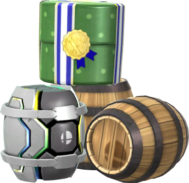
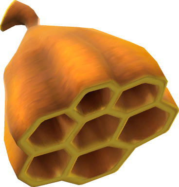
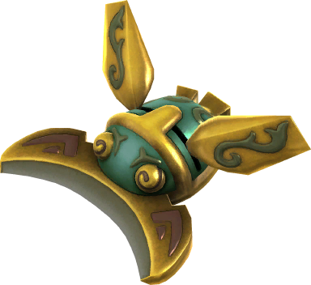
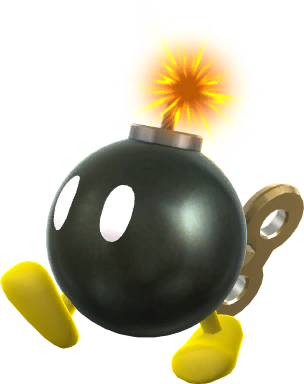


<table class="fixed" border="1">
    <col width="75px" />
    <col width="100px" />
    <col width="1000px" />
  <tr>
    <th>&nbsp;</th>
    <th>Assist Trophy</th>
    <th>Assist Trophies are capsules that contains a random character, which can be from a number of different franchises. The character inside, when summoned, will use their abilities to benefit whoever summoned them through methods such as fighting opponents or healing the summoner. The summoner cannot be damaged by Assist Trophies. </th>
</tr>
  <tr>
    <th>&nbsp;</th>
    <th>Back Shield</th>
    <th>The Back Shield is a shield unique to the Kid Icarus series. When a fighter picks it up, the shield protects them from behind and is in coordination with their movements. The shield lasts for exactly 30 seconds but will be reduced depending on how much damage the shield has taken. Taller characters will receive less protection from the shield because it does not change size depending on the character’s height. Enemies near the shield will be pushed away, slightly.</th>
</tr>
  <tr>
    <th>&nbsp;</th>
    <th>Banana Peel</th>
    <th>The Banana Peel is, as the name states, a banana peel. The Banana Peel can be thrown and players that walk over it will trip and be temporarily stunned. If a player that has slipped on the peel rolls over it, they will slip again. Once a player slips, the peel disappears. The Banana Peel can be used as an offensive strategy since it causes players on the ground to become momentarily paralyzed and open to attack. </th></tr>

  <tr>
    <th></th>
    <th>Barrels</th>
    <th>The Barrel is a large, circular barrel that contains items inside and can take on three different appearances depending on the stage. When a player picks up the Barrel, they will be unable to jump or attack, and also will move very slowly (except for Donkey Kong). The Barrel can be thrown up, forward, or down if the player is in midair. The Barrel will roll when thrown, hit with an attack that won’t destroy it, or if it lands on a slope. The Barrel has a 12.5% chance of exploding upon impact.  Every item can be inside of the Barrel with the exception of: Assist Trophy, Capsule, CD, Crate, Custom Part, Daybreak, Dragoon, Gold, Grass, Master Ball, Party Ball, Peanut, Poké Ball, Smash Coins and Bills, and the Team Healer. </th>
</tr>

  <tr>
    <th></th>
    <th>Beam Sword</th>
    <th>The Beam Sword is a sword with a red glow to it. The weapon has many functions and replaces most of a character’s normal attacks. One thing to note is that the Beam Sword takes over a player’s side smash, and they will swing the sword rather than use their normal attack. Strategies to use with the Beam Sword is to either get up close and personal, since the sword racks up a lot of damage, or stay further away and use the sword’s long range capabilities to keep opponents at bay. This is a list of the damage it can do:</th>
</tr>

  <tr>
    <th></th>
    <th>Beehive</th>
    <th>The Beehive is a beehive that originates from the Animal Crossing games, when the player shakes a tree and a beehive has a chance of falling out. When picked up by a player, the Beehive can be thrown at opponents, which will cause a swarm of bees to attack the opponent. The bees will sting the opponent, and rapidly damage them by causing 2-4% of damage with each sting. The hive itself, when thrown at an opponent, deals around 11% of damage. The bees remain on screen for 10 seconds before disappearing. They will follow their opponent around the stage. If the Beehive does not hit anyone when thrown, the bees will target an opponent at random (if the opponent count is more than 2). The bees cannot be destroyed, reflected, or shielded against, but they can be swallowed through the method of Item-swallowing. A strategy when using this item is to make sure that the hive lands on the opponent when throwing it so they take extra damage, and try to stop their movements so they can’t roll, sidestep, or air-dodge to avoid the bees’ stinging.</th>
</tr>

  <tr>
    <th></th>
    <th>Beetle</th>
    <th>The Beetle is the Legend of Zelda: Skyward Sword’s version of the classic Boomerang item. When picked up and thrown by a player, it will travel in a straight line, in whatever direction it was thrown in, and if it hits an opponent, it will grab onto them and drag them up. The Beetle’s goal is to bring its target to the top of the screen until it surpasses the edge of the stage, which will  instantly KO them. If the opponent has 0-49% of damage, they have the ability to wiggle out of the Beetle’s grab through the use of button mashing. If the opponents percent exceeds 50, it is impossible to escape the grab. The Beetle will bounce off of opponents if they are affected by a Metal Box, Mushroom(s), or Lightning, and if it lands on the ground it will be able to be used again. </th>
</tr>

  <tr>
    <th></th>
    <th>Blast Box</th>
    <th>The Blast Box is a heavy wooden crate with a fire hazard label on the front and back. The Blast Box has 30HP, meaning it will take 30% of damage before being destroyed, and when it does, it explodes and will send victims high into the air. This can KO players at around 30%.  When a player picks up the Blast Box, their movements are slowed down and they lack the ability to jump or attack. When the Blast Box is thrown, it lands only a short distance away. </th>
</tr>

  <tr>
    <th></th>
    <th>Bob-omb</th>
    <th>B0b-ombs are enemies from the Mario series and are living bombs that explode after a short period of time. In game, a Bob-omb will sit still on the ground while unprovoked. After a few seconds, the Bob-omb will start walking around with a fire making its way toward the fuse. When making contact will an opponent fighter or when the fire reaches the fuse, the Bob-omb will explode. This is a list of the damage it can do:</th>
</tr>

  <tr>
    <th></th>
    <th>t</th>
    <th>e</th>
</tr>

  <tr>
    <th></th>
    <th>t</th>
    <th>e</th>
</tr>

  <tr>
    <th></th>
    <th>t</th>
    <th>e</th>
</tr>

  <tr>
    <th></th>
    <th>t</th>
    <th>e</th>
</tr>

  <tr>
    <th></th>
    <th>t</th>
    <th>e</th>
</tr>

  <tr>
    <th></th>
    <th>t</th>
    <th>e</th>
</tr>
</table>

