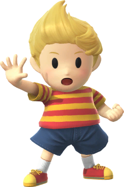
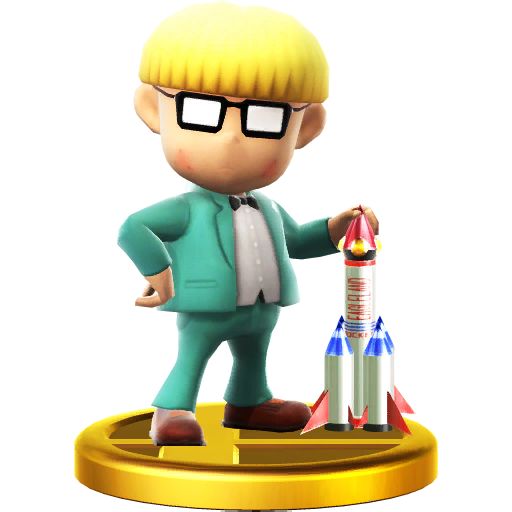
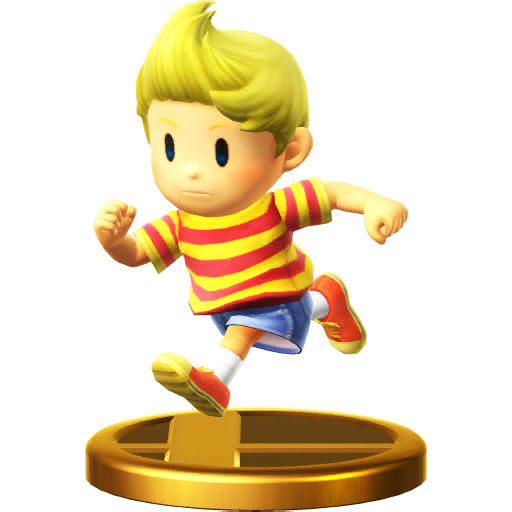






Battle Sounds:  
<table1 />
<a href="Lucas_Appeal_01.wav">Appeal 1-1</a> 
<a href="Lucas_Appeal_01_02.wav">Appeal 1-2</a> 
<a href="Lucas_Appeal_02.wav">Appeal 2-1</a> 
<a href="Lucas_Appeal_02_02.wav">Appeal 2-2</a> 
<a href="Lucas_Appeal_03.wav">Appeal 3-1</a> 
<a href="Lucas_Appeal_03_02.wav">Appeal 3-2</a> 
<a href="Lucas_Appear_01.wav">Appear 1</a> 
<a href="Lucas_Appear_02.wav">Appear 2</a> 
<a href="Lucas_Attack_Air_B01.wav">Attack (Air) B01</a> 
<a href="Lucas_Attack_Air_B02.wav">Attack (Air) B02</a> 
<a href="Lucas_Attack_Air_B03.wav">Attack (Air) B03</a> 
<a href="Lucas_Attack_Air_F01.wav">Attack (Air) F01</a> 
<a href="Lucas_Attack_Air_F02.wav">Attack (Air) F02</a> 
<a href="Lucas_Attack_Air_H01.wav">Attack (Air) H01</a> 
<a href="Lucas_Attack_Air_L01.wav">Attack (Air) L01</a> 
<a href="Lucas_Attack_Air_L02.wav">Attack (Air) L02</a> 
<a href="Lucas_Attack_Air_L03.wav">Attack (Air) L03</a> 
<a href="Lucas_Attack_Air_L04.wav">Attack (Air) L04</a> 
<a href="Lucas_Attack_Air_L05.wav">Attack (Air) L05</a> 
<a href="Lucas_Attack_Air_N01.wav">Attack (Air) N01</a> 
<a href="Lucas_Attack_Air_N02.wav">Attack (Air) N02</a> 
<a href="Lucas_Attack_Dash.wav">Attack Dash</a> 
<a href="Lucas_Attack_Hard_H01.wav">Attack Hard H01</a> 
<a href="Lucas_Attack_Hard_S01.wav">Attack Hard S01</a> 
<a href="Lucas_Catch_01.wav">Catch 01</a> 
<a href="Lucas_Catch_02.wav">Catch 02</a> 
<a href="Lucas_Catch_03.wav">Catch 03</a> 
<a href="Lucas_Dash_Start.wav">Dash (Start)</a> 
<a href="Lucas_Dash_Stop.wav">Dash (Stop)</a> 
<a href="Lucas_Escape.wav">Escape</a> 
<a href="Lucas_Escape_Air.wav">Escape (Air)</a> 
<a href="Lucas_Escape_B.wav">Escape B</a> 
<a href="Lucas_Escape_N.wav">Escape N</a> 
<a href="Lucas_Final_01.wav">Final 01</a> 
<a href="Lucas_Jump_01.wav">Jump 1</a> 
<a href="Lucas_Jump_02.wav">Jump 2</a> 
<a href="Lucas_Jump_03.wav">Jump 3</a> 
<a href="Lucas_Landing_01.wav">Landing 1</a> 
<a href="Lucas_Landing_02.wav">Landing 2</a> 
<a href="Lucas_Landing_03.wav">Landing 3</a> 
<a href="Lucas_PK_Charge.wav">PK Charge</a> 
<a href="Lucas_Rise.wav">Rise</a> 
<a href="Lucas_Smash_H01.wav">Smash H01</a> 
<a href="Lucas_Smash_H02.wav">Smash H02</a> 
<table2 />
<a href="Lucas_Smash_L01.wav">Smash L01</a> 
<a href="Lucas_Smash_L02.wav">Smash L02</a> 
<a href="Lucas_Smash_L03.wav">Smash L03</a> 
<a href="Lucas_Smash_L04.wav">Smash L04</a> 
<a href="Lucas_Smash_S01.wav">Smash S01</a> 
<a href="Lucas_Smash_S02.wav">Smash S02</a> 
<a href="Lucas_Special_H01.wav">Special H01</a> 
<a href="Lucas_Special_H02.wav">Special H02</a> 
<a href="Lucas_Special_H03.wav">Special H03</a> 
<a href="Lucas_Special_H04.wav">Special H04</a> 
<a href="Lucas_Special_L01.wav">Special L01</a> 
<a href="Lucas_Special_L02.wav">Special L02</a> 
<a href="Lucas_Special_N02.wav">Special N02</a> 
<a href="Lucas_Special_N04_l.wav">Special N04 l</a> 
<a href="Lucas_Special_N04_ll.wav">Special N04 ll</a> 
<a href="Lucas_Special_N04_m.wav">Special N04 m</a> 
<a href="Lucas_Special_N04_s.wav">Special N04 s</a> 
<a href="Lucas_Special_N05.wav">Special N05</a> 
<a href="Lucas_Special_N06.wav">Special N06</a> 
<a href="Lucas_Special_S01.wav">Special S01</a> 
<a href="Lucas_Special_S02.wav">Special S02</a> 
<a href="Lucas_Special_S03.wav">Special S03</a> 
<a href="Lucas_Squat.wav">Squat</a> 
<a href="Lucas_Step_Left_l.wav">Step (Left) 1</a> 
<a href="Lucas_Step_Left_m.wav">Step (Left) m</a> 
<a href="Lucas_Step_Left_s.wav">Step (Left) s</a> 
<a href="Lucas_Step_Right_l.wav">Step (Right) l</a> 
<a href="Lucas_Step_Right_m.wav">Step (Right) m</a> 
<a href="Lucas_Step_Right_s.wav">Step (Right) s</a> 
<a href="Lucas_Swing_l.wav">Swing l</a> 
<a href="Lucas_Swing_m.wav">Swing m</a> 
<a href="Lucas_Swing_s.wav">Swing s</a> 
<a href="Lucas_Throw_B01.wav">Throw B01</a> 
<a href="Lucas_Throw_B02.wav">Throw B02</a> 
<a href="Lucas_Throw_F01.wav">Throw F01</a> 
<a href="Lucas_Throw_F02.wav">Throw F02</a> 
<a href="Lucas_Throw_H01.wav">Throw H01</a> 
<a href="Lucas_Throw_H02.wav">Throw H02</a> 
<a href="Lucas_Throw_L01.wav">Throw L01</a> 
<a href="Lucas_Throw_L02.wav">Throw L02</a> 
<a href="Lucas_Win_1.wav">Win 1</a> 
<a href="Lucas_Win_2.wav">Win 2</a> 
<a href="Lucas_Win_3.wav">Win 3/1</a> 
<a href="Lucas_Win_3_02.wav">Win 3/2</a> 
<table3 />

  

Voice:  
<table1 />
<a href="Lucas_Voice_Appeal_01.wav">Appeal 01</a> 
<a href="Lucas_Voice_Appeal_03.wav">Appeal 03</a> 
<a href="Lucas_Voice_Attack_01.wav">Attack 01</a> 
<a href="Lucas_Voice_Attack_02.wav">Attack 02</a> 
<a href="Lucas_Voice_Attack_03.wav">Attack 03</a> 
<a href="Lucas_Voice_Attack_04.wav">Attack 04</a> 
<a href="Lucas_Voice_Attack_05.wav">Attack 05</a> 
<a href="Lucas_Voice_Attack_06.wav">Attack 06</a> 
<a href="Lucas_Voice_Attack_07.wav">Attack 07</a> 
<a href="Lucas_Voice_Cliff_Catch.wav">Catching Cliff</a> 
<a href="Lucas_Voice_Clumsy.wav">Clumsy</a> 
<a href="Lucas_Voice_Damage_01.wav">Damage 01</a> 
<a href="Lucas_Voice_Damage_02.wav">Damage 02</a> 
<a href="Lucas_Voice_Damage_Fly_01.wav">Damage (Fly) 01</a> 
<a href="Lucas_Voice_Damage_Fly_02.wav">Damage (Fly) 02</a> 
<a href="Lucas_Voice_Damage_KO.wav">Damage (KO)</a> 
<a href="Lucas_Voice_Dizzy.wav">Dizzy</a> 
<table2 />
<a href="Lucas_Voice_Heavy_Get.wav">Heavy</a> 
<a href="Lucas_Voice_Jump_01.wav">Jump 01</a> 
<a href="Lucas_Voice_Miss_Foot_01.wav">Misstep 01</a> 
<a href="Lucas_Voice_Miss_Foot_02.wav">Misstep 02</a> 
<a href="Lucas_Voice_Passive.wav">Passive</a> 
<a href="Lucas_Voice_Sleep.wav">Sleep</a> 
<a href="Lucas_Voice_Special_001.wav">Special 01</a> 
<a href="Lucas_Voice_Special_002.wav">Special 02</a> 
<a href="Lucas_Voice_Special_003.wav">Special 03</a> 
<a href="Lucas_Voice_Special_004.wav">Special 04</a> 
<a href="Lucas_Voice_Special_005.wav">Special 05</a> 
<a href="Lucas_Voice_Special_006.wav">Special 06</a> 
<a href="Lucas_Voice_Special_007.wav">Special 07</a> 
<a href="Lucas_Voice_Special_008.wav">Special 08</a> 
<a href="Lucas_Voice_Swim_Up.wav">Swim Up</a> 
<a href="Lucas_Voice_Win_01.wav">Win 01</a> 
<a href="Lucas_Voice_Win_02.wav">Win 02</a> 
<table3 />



<table class="fixed" border="1">
    <col width="150px" />
    <col width="100px" />
    <col width="600px" />
  <tr>
    <th></th>
    <th><b>Jeff</b></th>
    <th>One of the main party members in EarthBound, he attends Snow Wood Boarding School in Winters. Jeff takes after his inventor father, Dr. Andonuts, creating devices in his free time. One of these is the bottle rocket, which fires one large missile and four smaller ones. And sometimes one extra!</th>
</tr>
  <tr>
    <th></th>
    <th>Lucas</th>
    <th>Before adventuring, Lucas was a timid, cautious boy. His journey has made him a stronger person. Maybe he met someone to spend his life with... Hang on—we're moving way too fast! For now, remember that Lucas and Ness are favorites in the hearts of EarthBound fans.</th></tr></table>

