

Listed below are all the trophies on the 3DS version of the 4th installment of Super Smash Bros. 
  
The trophies' names and descriptions are taken from the North American release of the game.  To view the PAL version's page, <a href="http://staff.starmen.net/ssb4/Trophies/index2.php"><b>click here.</b></a>
  

<a href="#animalcrossing">Animal Crossing</a> / <a href="#bayonetta">Bayonetta</a> / <a href="#donkeykong">Donkey Kong</a> / <a href="#duckhunt">Duck Hunt</a> / <a href="#finalfantasy">Final Fantasy</a> / <a href="#fzero">F-Zero</a> / <a href="#kidicarus">Kid Icarus</a> / <a href="#kirby">Kirby</a> / <a href="#megaman">Mega Man</a> / <a href="#metroid">Metroid</a> / <a href="#mother">Mother</a> / <a href="#pacman">PAC-MAN</a> / <a href="#pikmin">Pikmin</a> / <a href="#pokemon">Pokemon</a> / <a href="#punchout">Punch-Out</a> / <a href="#sonicthehedgehog">Sonic the Hedgehog</a> / <a href="#starfox">Star Fox</a> / <a href="#supermario">Super Mario</a> / <a href="#supersmashbros">Super Smash Bros.</a> / <a href="#wario">Wario</a> / <a href="#wiifit">Wii Fit</a> / <a href="#xenobladechronicles">Xenoblade Chronicles</a> / <a href="#yoshisisland">Yoshi's Island</a> / <a href="#other">Other</a>




<table class="fixed" border="1">
    <col width="100px" />
    <col width="100px" />
    <col width="600px" />

  <tr>
    <th></th>
    <th><b>Able Sisters</b></th>
    <th>Able Sisters is a clothing and tailoring shop run by three completely different sisters. The oldest, Sable, quietly sews in the corner. The middle child, Labelle, sells accessories, and the youngest, Mabel, greets customers cheerfully. They fought in the past but have put that behind them!</th>
  </tr>
  <tr>
    <th>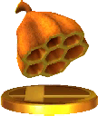</th>
    <th><b>Beehive</b></th>
    <th>An example of fine architecture constructed by insects, these bees are not shy about defending their hard work. Throw this at an enemy to direct their hate at that player. If the bees are after you, you can shake them for a while with some evasive maneuvers, but they'll track you down.</th>
  </tr>
  <tr>
    <th></th>
    <th><b>Blanca</b></th>
    <th>Her smooth face is just like...well, a blank canvas! She used to let people give her a face by drawing on her, but in Animal Crossing: New Leaf, she uses her peculiar face to trick everyone on April Fools' Day. Only a master of disguise like her could mimic other people so convincingly!</th>
  </tr>
  <tr>
    <th>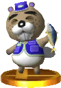</th>
    <th><b>Chip</b></th>
    <th>For some people, fishing is all about the journey, not the destination. For this beaver, it's all about the destination... because the destination means dinner! If you take him a big fish, he'll congratulate you. Then he'll gobble it down like he hasn't eaten in days. It's...erm...quite a sight.</th>
  </tr>
  <tr>
    <th></th>
    <th><b>Copper & Booker</b></th>
    <th>In Animal Crossing: New Leaf, you decide which police officer you'll have in your town based on the type of police station you put up. Will you build the modern police station and hire the brisk, professional Copper? Or perhaps the classic police station and the quiet, nervous Booker?</th>
  </tr>
  <tr>
    <th>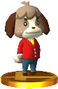</th>
    <th><b>Digby</b></th>
    <th>Isabelle's twin brother, Digby, works at the Happy Home Showcase, but if he needs a quick break, he'll head down to the Roost for a cup of coffee. He takes Blue Mountain, black, no sugar, whereas his sister likes her coffee with a lot of milk and three sugars. For some reason, an order that doesn't include "a lot of milk" sounds more mature.</th>
  </tr>
  <tr>
    <th></th>
    <th><b>DJ KK</b></th>
    <th>"Yo yo yo! Come rock out at Club LOL! Featuring DJ KK every night of the week (except Saturdays)! Listen to the singer- songwriter bust out a foot-stompin' mix of tunes! Don't forget to come on your birthday for a special treat!" ...That advertisement definitely catches the eye.</th>
  </tr>
  <tr>
    <th></th>
    <th><b>Dr. Shrunk</b></th>
    <th>Dr. Shrunk definitely has a...unique look about him. As the owner of Club LOL, a new entertainment venue, he isn't shy about taking the stage. It's too bad his jokes don't always fly. If you want a taste of his humor, take him some treats before the show starts!</th>
  </tr>
  <tr>
    <th>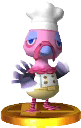</th>
    <th><b>Franklin</b></th>
    <th>The Harvest Festival, understandably, makes Franklin a little nervous. But in Animal Crossing: New Leaf, he's been invited to cook for everyone. He seems to need help gathering ingredients... Could you spare some time to help? Just to be clear, he isn't one of the ingredients!</th>
  </tr>
  <tr>
    <th>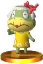</th>
    <th><b>Grams</b></th>
    <th>The eldest turtle on the tropical island, Grams runs the souvenir counter. She'll trade you island-themed goods in exchange for the medals you earned during tours. Among the things she sells are flower-patterned muumuus, but Leila thinks they look best on Grams.</th>
  </tr>
  <tr>
    <th>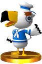</th>
    <th><b>Gulliver</b></th>
    <th>Gulliver is a seagull who is not the best sailor, despite dressing the part. You can usually find him shipwrecked on the beach with a bad case of the forgets. If you help him remember where he was headed, he'll set on his travels once more. In time, you'll get a thank-you souvenir!</th>
  </tr>
  <tr>
    <th>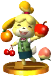</th>
    <th><b>Isabelle</b></th>
    <th>Isabelle is the mayor's highly capable secretary. She can be forgetful sometimes, but you can always count on her for information about the town. She wears her hair up in a bun that makes her look like a shih tzu. Mostly because she is one! She also has a twin brother named Digby.</th>
  </tr>
  <tr>
    <th></th>
    <th><b>Isabelle (Winter Outfit)</b></th>
    <th>The green check she wears in warmer months suits her perfectly, but when the cold hits, her mustard-yellow cardigan is just too stylish for words. It may make you long for the spring months, though. Hot or cold—nothing makes Isabelle feel under the weather!</th>
  </tr>
  <tr>
    <th>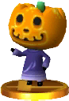</th>
    <th><b>Jack</b></th>
    <th>Jack, the self-proclaimed czar of Halloween, goes around town saying "Trick or treat!" to everyone he meets! In Animal Crossing: New Leaf, you can see him earlier in October too. Seems like he's looking for a few loyal subjects. Don't you worry—it's all in good fun!</th>
  </tr>
  <tr>
    <th></th>
    <th><b>Kapp'n</b></th>
    <th>This turtle ferries you out to the tropical island. In the past he's been seen driving a taxi and a bus, and now he's the captain of a little boat. Or maybe he just wanted to sing his songs— it's only right to be sailing while singing sea shanties, after all!</th>
  </tr>
  <tr>
    <th></th>
    <th><b>Kicks</b></th>
    <th>Crikey! This shoeshine has really come up in the world. He used to work in a faraway city, but now he runs a shoe store with an impressive collection of shoes to choose from. And you can tell from that sharp-looking hat he's wearing that his is a style you can trust.</th>
  </tr>
  <tr>
    <th>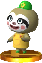</th>
    <th><b>Leif</b></th>
    <th>Although he's a sloth, there's nothing lazy about Leif. He works hard to sell seeds, saplings, and gardening supplies, all while fighting the temptation to dangle from his plants. I wonder if Leif knows how much all his hard work brightens the days of those around him...</th>
  </tr>
  <tr>
    <th>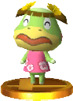</th>
    <th><b>Leila</b></th>
    <th>A young lady turtle who plays at running a shop. She's still learning and will buy almost anything from the island. Her prices are much lower than the recycling shop, and her parents hope that the smiling faces of customers will ease her loneliness. Her dad is Kapp'n, and her mom is Leilani.</th>
  </tr>
  <tr>
    <th>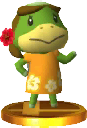</th>
    <th><b>Leilani</b></th>
    <th>If you've had your fill of tropical- island adventures, Kapp'n's wife, Leilani, can arrange your trip home. She'll also happily sign you up for island tours. Her green skin isn't typical for tropical islanders, and that red hibiscus in her hair really suits her.</th>
  </tr>
  <tr>
    <th>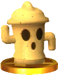</th>
    <th><b>Lloid</b></th>
    <th>Gyroids are a common sight in the Animal Crossing series. In Animal Crossing: New Leaf, a Gyroid named Lloid dons a helmet and collects funds for public works. The Villager makes use of a rocket-powered Lloid for his side special. The farther he flies, the more powerful his attack will be!</th>
  </tr>
  <tr>
    <th>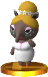</th>
    <th><b>Luna</b></th>
    <th>In some parts of the world it's believed tapirs eat dreams, but this one runs the Dream Suite to share dreams. Once you've given her a Dream Address and lain down, she'll send you off to sleep. Soon you'll find yourself in a town worthy of a dream. Enjoy your adventure!</th>
  </tr>
  <tr>
    <th>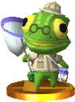</th>
    <th><b>Nat</b></th>
    <th>Bugs are like the cream in his tea, the jam on his scone! This old chameleon tasks you with catching him some bugs—for science, really! That lip smacking was just his excitement for din...er...discovery! Go on—find some delectable specimens, won't you? Points and prizes await!</th>
  </tr>
  <tr>
    <th>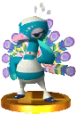</th>
    <th><b>Pavé</b></th>
    <th>Pavé is the Festivale Dancer Extraordinaire! In Animal Crossing: New Leaf, he'll beg—no, DEMAND—you fetch some of those lovely feathers floating around town. If you take him three feathers of the same color, you'll be rewarded with furniture and a dance!</th>
  </tr>
  <tr>
    <th>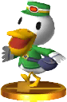</th>
    <th><b>Pete</b></th>
    <th>Delivering the mail keeps Pete very busy. He takes great pride in his work, and he sometimes looks like he's in need of sleep. That isn't because he's working too hard— thinking about his crush on Phyllis keeps him up at night! He doesn't let that stop him from getting to work early, though.</th>
  </tr>
  <tr>
    <th>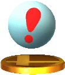</th>
    <th><b>Pitfall</b></th>
    <th>You can plant this in the ground as a trap against your enemies. If they set it off, they'll be rooted in place and at your mercy. If opponents are spending too much time in the air, throwing this at them can send them meteoring down to the ground—or better yet, right off the stage!</th>
  </tr>
  <tr>
    <th>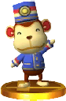</th>
    <th><b>Porter</b></th>
    <th>Some monkeys prefer the monkey bars, but not Porter—his passion is the train station where he works, and he'll make sure you get to where you're going. He can be a little intense sometimes, but he's a decent guy. Oh, and don't worry—you'll get no monkey business from him.</th>
  </tr>
  <tr>
    <th>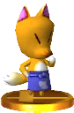</th>
    <th><b>Redd</b></th>
    <th>Redd runs an art gallery...of sorts. He'll try to smooth-talk you into buying his items, but be careful! Occasionally some counterfeit items slip in among the real ones. And by "sometimes" I mean "always." Brushing up on your art history may help you spot the real deal!</th>
  </tr>
  <tr>
    <th></th>
    <th><b>Reese & Cyrus</b></th>
    <th>From their names, you might guess they're a pair of country singers, but actually they run Re-Tail. Reese sells all kinds of secondhand goods, and Cyrus customizes furniture. They may not be singers, but these exuberant alpacas work together in perfect harmony.</th>
  </tr>
  <tr>
    <th></th>
    <th><b>Resetti</b></th>
    <th>Be sure to save your game before you turn it off, or this guy will show up screaming "AAAAAAAARGH!" Sonny Resetti and his favorite brother, Don, keep an eye out for sudden game resets, and they aren't shy about reminding you to save often. Best not to aggravate them needlessly...</th>
  </tr>
  <tr>
    <th>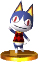</th>
    <th><b>Rover</b></th>
    <th>This kitty is very outgoing, always looking to meet and learn about new people. He'll ask you all sorts of questions the first time you meet. Hopefully you don't respond with random nonsense, since you'll be stuck with your answers. Who wants to live in a town called "AAAAAAA," anyway?</th>
  </tr>
  <tr>
    <th>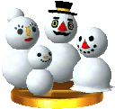</th>
    <th><b>Snowpeople</b></th>
    <th>When winter finally settles in and snow covers the ground, you get the chance to build a new pal. If you keep rolling those snowballs and putting them together, eventually you'll have one of four friends: Snowman, Snowmam, Snowboy, or Snowtyke. Each one has a wintery surprise!</th>
  </tr>
  <tr>
    <th></th>
    <th><b>Timmy & Tommy</b></th>
    <th>These twin brothers operate the Nookling stores. Thanks to Tom Nook's teachings, they are just as talented as he is and run Nookling Junction with such success that it can expand several times. Despite their success, they never forget the core value of good customer service.</th>
  </tr>
  <tr>
    <th></th>
    <th><b>Tom Nook</b></th>
    <th>Currently the owner of Nook's Homes, yes, yes. "Yes, yes" is his favorite catchphrase. Despite all the money he's earned, he'll never lose that down-to-earth charm. With such a friendly demeanor, there's just no way he could be trying to rip you off. So trustworthy, yes, yes!</th>
  </tr>
  <tr>
    <th>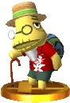</th>
    <th><b>Tortimer</b></th>
    <th>A former mayor who is living out his retirement on a tropical island. He's not a hermit, though, and absolutely loves spending time with anyone who goes to visit his tropical paradise. Everyone could learn from his generous spirit. And that aloha shirt looks great!</th>
  </tr>
  <tr>
    <th></th>
    <th><b>Tortimer Island</b></th>
    <th>Take a ride on Kapp'n's boat to reach this tropical island, home to fish, insects, and fruit you can't find anywhere else. Tortimer's tours are also available here. Eat the fruit on this stage to reduce your damage, but keep an eye out for the occasional bomb in the mix too!</th>
  </tr>
  <tr>
    <th></th>
    <th><b>Villager</b></th>
    <th>An energetic young man from a peaceful town in Animal Crossing, he is eager to make his Smash Bros. debut! His Balloon Trip recovery lets him fly like a character from Balloon Fight. The Villager sets out to answer that age-old question: If a tree falls on the battlefield and foes are beneath it, do they get launched?</th>
  </tr>
  <tr>
    <th></th>
    <th><b>Villager (Alt.)</b></th>
    <th>Just a normal girl living a normal life in a normal town—her special moves, however, are anything but. She can pocket items, projectiles, and even beams, and then pull them out at a moment's notice. Her down special lets her plant a tree, water it, and chop it down. If she leaves the tree standing, she can use the axe against foes.</th>
  </tr>

  <tr>
    <th>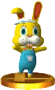</th>
    <th><b>Zipper</b></th>
    <th>This isn't a costume, really! Everyone asks, and the answer is always the same. Please ignore the zipper on the back—that just spoils the magic. This lucky spring fellow appears on Bunny Day, celebrating by asking you to search for bunny eggs. Open up the eggs you find—maybe a prize is inside!</th>
  </tr>
 
</table>



<table class="fixed" border="1">
    <col width="100px" />
    <col width="100px" />
    <col width="600px" />

  <tr>
    <th>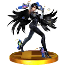</th>
    <th><b>Bayonetta</b></th>
    <th>Bayonetta is one of the last of the near-extinct Umbra Witches clan. She's a master of the Bullet Arts and can use her hair as a conduit to bring forth Infernal Demons. She brings all these skills and more to Smash, where she'll unleash additional damage if you hold the attack button. Damage and distract your foes with this move!</th>
  </tr>
  <tr>
    <th></th>
    <th><b>Bayonetta (Alt.)</b></th>
    <th>If you use Bayonetta's side special in midair, she'll do a diagonal kick upward that goes through platforms. If you press down just before doing the move, it'll turn into a downward attack! Plus, if you hit an enemy in midair, you can use the attack again before you hit the ground–great for combos and recoveries!</th>
  </tr>
  <tr>
    <th></th>
    <th><b>Bayonetta (Original)</b></th>
    <th>This Umbra Witch awakens after hundreds of years without any memories of her past life. Usually Bayonetta spends her days pretending to be a nun to lure out angels, until a witch with the same powers as her starts to slowly bring her memories back. She ends up embroiled in a battle to save the world.</th>
  </tr>
  <tr>
    <th>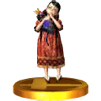</th>
    <th><b>Cereza</b></th>
    <th>A small girl Bayonetta finds wandering the stronghold city of Vigrid with her stuffed toy, Chesire. For some reason, Cereza is convinced Bayonetta is her "mummy" and wants to be just like her. No human should be able to see angels, but somehow Cereza can...</th>
  </tr>
  <tr>
    <th>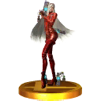</th>
    <th><b>Jeanne</b></th>
    <th>An Umbra Witch and old friend of Bayonetta, Jeanne wears a red bodysuit and uses the Bullet Arts fighting style to wield her four pistols, All 4 One. Jeanne saved Bayonetta from the demon Gomorrah but was mortally wounded and had her soul dragged down to Inferno. Bayonetta succeeded in rescuing her friend and returned her soul to its body.</th>
  </tr>
  <tr>
    <th>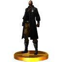</th>
    <th><b>Rodin</b></th>
    <th>This shady figure owns the Gates of Hell bar and runs a side business in mysterious objects and powerful weaponry made from the souls of demons. He's known for being a talented gunsmith and counts Bayonetta as a loyal customer, but it's said that if any human uses his wares, they'll suffer a terrible fate...</th>
  </tr>
</table>



<table class="fixed" border="1">
    <col width="100px" />
    <col width="100px" />
    <col width="600px" />
<tr>
    <th></th>
    <th><b>Candy Kong</b></th>
    <th>It's no surprise she catches the eyes of Donkey Kong and Funky Kong. Just by glancing at them, she makes guys wonder if she likes them. You probably best remember her as the helpful lady who runs Candy's Save Point in Donkey Kong Country.</th>
  </tr>
<tr>
    <th></th>
    <th><b>Cap'n Greenbeard</b></th>
    <th>Lots of vitamin C won't do you much good against the Scurvy Crew. These are some crabby pirates! Even before the Tiki Tak Tribe hypnotized them, these sailors were scary. Just look at that hook! Or that sword! Or that...fork? OK, back to the sword!</th>
  </tr>
<tr>
    <th></th>
    <th><b>Cranky Kong</b></th>
    <th>This old man could teach you a thing or two! Cranky Kong has always been willing to share some words of wisdom, but in Donkey Kong Country: Tropical Freeze, he decides to help directly and brings his cane-swinging style to the field. What a crazy old... Ahem. What a gentleman!</th>
  </tr>  
<tr>
    <th></th>
    <th><b>Diddy Kong</b></th>
    <th>Donkey Kong's trusty partner. He sports his signature look: red hat, red shirt, Rocketbarrel Pack. In Smash Bros., he's incredibly agile. Charge the Rocketbarrel Pack by holding down the button before launch, and you can steer with left and right. Don't forget to drop banana peels—enemies love it!</th>
  </tr>
<tr>
    <th></th>
    <th><b>Diddy Kong (Alt.)</b></th>
    <th>The Banana Peel Diddy throws when you use his down special can be picked up and used against you, so be careful. His Monkey Flip side special is a rolling leap followed by a grab (or a kick if you press the button again midjump). If you grab someone, press the button again to attack or jump off them to go high into the air.</th>
  </tr>
<tr>
    <th></th>
    <th><b>Dixie Kong</b></th>
    <th>Diddy Kong's girlfriend. She loves to adventure with him. Her ponytail isn't just for show—she can use it to swim faster, soar in the sky, and even lift barrels! With hair that does all that, you can bet she takes good care of it!</th>
  </tr>
<tr>
    <th></th>
    <th><b>DK Barrel</b></th>
    <th>Little known fact: the "DK" on a DK Barrel stands for "Donkey Kong"... What? You mean you already knew that? In that case, you must also know that hopeful feeling you get upon seeing one of these in a really tough stage. Break one to release a helpful partner!</th>
  </tr>
<tr>
    <th></th>
    <th><b>Donkey Kong</b></th>
    <th>This king of the jungle really, really loves bananas. His adventures usually start with people stealing his hoard of them. In Smash Bros., he's known for his incredible strength and long reach. Despite his size, he's still pretty quick. He can even jump carrying heavy items! Use this knowledge well.</th>
  </tr>
<tr>
    <th></th>
    <th><b>Donkey Kong (Alt.)</b></th>
    <th>Donkey Kong pulls no punches when it comes to fighting. Or headbutts, as it turns out. His Headbutt special move will bury anyone on the ground who gets hit, leaving them open to some serious damage. If Donkey Kong strikes an airborne foe with this move, they'll go crashing downward.</th>
  </tr>
<tr>
    <th></th>
    <th><b>Expresso</b></th>
    <th>His name is no joke—this bird is fast! Despite his size, Expresso is light as a feather and loves to glide through the air. In fact, he was too light to hurt enemies at first! He got a little stronger in Donkey Kong Land, and now jumping on foes is a piece of cake!</th>
  </tr>
<tr>
    <th></th>
    <th><b>Funky Kong</b></th>
    <th>Has he remodeled his personal jet into a shop? Maybe he thinks it will encourage his items to "fly off the shelves." He claims he ran an airport once... Maybe that's true. Much like his style of conversation, I'm sure it was a pretty funky experience.</th>
  </tr>
<tr>
    <th>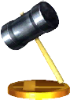</th>
    <th><b>Hammer</b></th>
    <th>Once you grab this hammer, you can't help but keep swinging and swinging. Who needs special moves when you've got a hammer? And forget your second jump—use that time to deliver a second lump! Oh, but the hammerhead isn't attached very well, so watch out if it pops off or something...</th>
  </tr>
<tr>
    <th></th>
    <th><b>Hammerhead</b></th>
    <th>A hammer is just a stick until you add the top. That's where this item comes into play. Sometimes, however, the top comes off. If that happens, just grab this loose part and throw it at your enemies. For some poetic justice, make the guy swinging the hammer handle your first target.</th>
  </tr>
<tr>
    <th>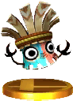</th>
    <th><b>Kalimba</b></th>
    <th>The Tiki Tak Tribe is an evil group of instrumental Tikis from Donkey Kong Country Returns. You first meet Kalimba as he hypnotizes animals with his music. The top of Kalimba Tiki looks a bit like his namesake, an African instrument that is also called a thumb piano.</th>
  </tr>
<tr>
    <th></th>
    <th><b>King K. Rool	</b></th>
    <th>Whereas Mario often squares off against Bowser, Donkey Kong must fight against King K. Rool. He's a big croc with a big attitude...and a tiny crown. He probably could have been Donkey Kong's most trustworthy animal friend. Think he'll ever have a change of heart? Not likely.</th>
  </tr>
<tr>
    <th>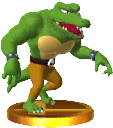</th>
    <th><b>Kritter</b></th>
    <th>Kremlings are King K. Rool's minions from the Donkey Kong series, and they come in both green and blue varieties. Green ones will try to bite you repeatedly, and their last bite hurts the most! Blue ones will swipe at you with their sharp claws. Neither really knocks you back, so it's easy to get hit several times by them.</th>
  </tr>
<tr>
    <th>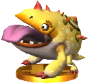</th>
    <th><b>Mugly</b></th>
    <th>Mugly doesn't even peel bananas before eating them! Maybe he gets his yellow skin that way. I'm sure he's a lovable monster when he isn't controlled by evil Tikis. When he charges, his spikes go away—maybe so he can go faster? It definitely exposes his weak spot...</th>
  </tr>
<tr>
    <th></th>
    <th><b>Pauline</b></th>
    <th>Waaay back in 1981, a new action game using barrels and girders hit arcades. That game was Donkey Kong, in which Mario had to rescue Pauline from the title character. Maybe she wanted to look less like Princess Peach—she changed her look in the Game Boy version.</th>
  </tr>
<tr>
    <th></th>
    <th><b>Peanut Popgun</b></th>
    <th>Diddy Kong's special wooden gun, locked and loaded with peanut shots. Power up the peanuts by holding the button, but don't get carried away—an overcharged peanut can explode in the barrel! Charging will improve the range of your shot, so keep an eye on your target as you prepare to fire!</th>
  </tr>
<tr>
    <th></th>
    <th><b>Rambi</b></th>
    <th>A longtime and trustworthy animal friend. Even the king of the jungle, the lion, fears Rambi's might. Mario would love a lift from Rambi, but he is all Donkey Kong's! His impressive horn can defeat enemies and smash walls, and since Donkey Kong Country 2, he can super-dash!</th>
  </tr>
<tr>
    <th></th>
    <th><b>Rocketbarrel Pack</b></th>
    <th>Two barrels modified into jet engines— throw them on and you're airborne! You can charge them up for a bigger, more accurate boost, but be careful while using these. If you get hit while you're powering up on the ground or zipping around the sky, you'll lose all control of this jet pack!</th>
  </tr>
<tr>
    <th>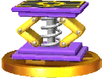</th>
    <th><b>Spring</b></th>
    <th>A strong spring that can send you flying higher than you ever have before. If you throw this down while you're in midair, you'll get a boost and sail even farther into the air! Try to be careful, though, since this spring may fall on its side and end up launching you sideways instead of up.</th>
  </tr>
<tr>
    <th></th>
    <th><b>Squawks</b></th>
    <th>Squawks has filled more roles than most animal friends. Remember when he carried a much-needed light through the caves? Or when he carried the Kongs over danger? Good times, good times... Lately Squawks has helped by letting you know when Puzzle Pieces are near. So helpful!</th>
  </tr>
<tr>
    <th></th>
    <th><b>Squitter</b></th>
    <th>Squitter is one of Donkey Kong's animal friends. It must take him hours to lace up the four pairs of shoes he wears... The spiderwebs he shoots from his mouth can damage enemies, and they also can make platforms to walk on. But can he use them to make shoe racks?</th>
  </tr>
<tr>
    <th></th>
    <th><b>Tiki Buzz</b></th>
    <th>This member of the Tiki Tak Tribe appears in Donkey Kong Country Returns. It'd be really tempting to see what kind of sound that drum-shaped head of his would make. In Smash Run, they do a dive-bomb attack if a fighter passes below. You can bounce off their heads to boost your own jump!</th>
  </tr>
<tr>
    <th></th>
    <th><b>Tutorial Pig</b></th>
    <th>A mysterious pig from Donkey Kong Country Returns, he helps out if you're having trouble. He brings in a blue-tied, silver Donkey Kong to show you how to beat the harder parts. But who is this pig anyway? He actually prefers to go by...Professor Chops!</th>
  </tr>

</table>



<table class="fixed" border="1">
    <col width="100px" />
    <col width="100px" />
    <col width="600px" />
<tr>
    <th></th>
    <th><b>Duck Hunt</b></th>
    <th>You could call these two the stars of the NES 1985 launch title Duck Hunt. The goofy dog would chase down any ducks hit by the Zapper. In Smash Bros., these two work as a team to fight. When a can or a clay pigeon is in play, hit the button again to fire at it. Show your foes how the ducks felt!</th>
  </tr>
<tr>
    <th></th>
    <th><b>Duck Hunt (Alt.)</b></th>
    <th>Duck Jump, an up special, has the charming twosome float up in an adorable fashion. It also makes getting back to the stage much easier. Their side smash can hit up to three times at close range, depending on your shooting skills. By charging up the attack, you can increase the range even further!</th>
  </tr>
<tr>
    <th></th>
    <th><b>Wild Gunmen</b></th>
    <th>A gang of five outlaws from the Wild West, these fellows are quick to brandish their pistols. In fact, the moment they hear "Fire!" they start shooting. A member of the gang will show up whenever Duck Hunt does a down special move. Watch out for the gang's leader—he's quick!</th>
  </tr>
</table>



<table class="fixed" border="1">
    <col width="100px" />
    <col width="100px" />
    <col width="600px" />

  <tr>
    <th></th>
    <th><b>Cloud</b></th>
    <th>The protagonist of FINAL FANTASY VII, Cloud wields the enormous Buster Sword, a memento from his comrad Zack. Once a SOLDIER of Shinra, he now fights as a mercenary against the corporation he originally served. His decision to join AVALANCHE's insurgence, however, will transform his destiny.</th>
  </tr>
  <tr>
    <th></th>
    <th><b>Cloud (Alt.)</b></th>
    <th>Filling the Limit Gauge allows Cloud to perform a Limit Break, supercharging his next special move. His down special becomes Finishing Touch. With a huge swing of his sword, Cloud summons a whirlwind that inflicts only 1% damage, but boasts brutal launch power. Go for a KO while foes' damage is still low!</th>
  </tr>
</table>



<table class="fixed" border="1">
    <col width="100px" />
    <col width="100px" />
    <col width="600px" />
  <tr>
    <th>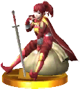</th>
    <th><b>Anna</b></th>
    <th>Anna is a bright, cheerful young merchant, but her true nature is clouded in mystery. She's very fixated on money and is a girl of many talents, but it wasn't until Fire Emblem Awakening that she became a playable character. There's still a lot we don't know about her—she likes to keep everybody guessing.</th>
  </tr>
  <tr>
    <th>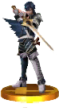</th>
    <th><b>Chrom</b></th>
    <th>Prince of the Halidom of Ylisse and descendant of the Hero-King Marth. He leads a militia force called the Shepherds that protects Ylisse. Though he can get reckless when training—things end up broken—he can be counted on in the heat of battle. He and Robin combine their skills in Robin's Final Smash.</th>
  </tr>
  <tr>
    <th>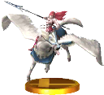</th>
    <th><b>Cordelia</b></th>
    <th>A member of the Ylissean Pegasus Knights. Friends since childhood, Cordelia and Sumia have aged quite differently over time, Sumia's scatterbrained nature contrasting with Cordelia's capable efficiency. She may seem self-assured and ready for anything, but she's tormented by her unrequited feelings for a certain someone...</th>
  </tr>
  <tr>
    <th>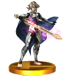</th>
    <th><b>Corrin</b></th>
    <th>Corrin joins the battle from Fire Emblem Fates. Born in Hoshido but kidnapped by Nohr at a young age, Corrin was brought up by Nohrian royalty. Descended from the First Dragons, Corrin has the power to transform into a dragon. In Smash, Corrin can change parts of the body into lance-like hands and feet that have a long reach that deal more damage at the tips.</th>
  </tr>
  <tr>
    <th></th>
    <th><b>Corrin (Alt.)</b></th>
    <th>Corrin's side special, Dragon Lunge, is no normal attack–skewer a surface with a lance-like arm, and it will suspend you in the air. Pin an enemy while doing this, and you can keep them in place and then follow up with a flying kick forward or back or just jump up. You can only thrust the lance once before landing.</th>
  </tr>
  <tr>
    <th>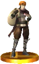</th>
    <th><b>Gaius</b></th>
    <th>Here's a man who really would take candy from a baby. This Ylissean thief is the cool, collected sort, willing to do any kind of job if the price is right. That said, he's got quite a sweet tooth, and keeping up a cool image is really hard if you're always eating lollipops and hoarding sweets. His silly nicknames for people don't help much either...</th>
  </tr>
  <tr>
    <th>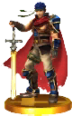</th>
    <th><b>Ike</b></th>
    <th>One of the main characters from the Fire Emblem series. Having fought in the Mad King's War, restored the fallen nation of Crimea, and taken on the Begnion Empire, Ike is rightly called a hero. He has the strength to back the title—one good swing of his blade can launch the heaviest of foes.</th>
  </tr>
  <tr>
    <th></th>
    <th><b>Ike (Alt.)</b></th>
    <th>Ike's side smash is a powerful two-handed sword strike. It's one of the best launch attacks in the entire game, though it will leave you wide open when you use it. For Eruption, one of his specials, you stab the ground and unleash a pillar of fire. Charging for too long will hurt Ike, so be careful!</th>
  </tr>
  <tr>
    <th>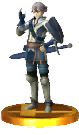</th>
    <th><b>Inigo</b></th>
    <th>A mercenary who traveled back in time to save the past. He may be shy, but he still wants to be a dancer like his mother, Olivia. He won't admit it, though—not even to her! Most people see him as a helpless flirt, but the truth is he talks to women to work through his crippling shyness.</th>
  </tr>
  <tr>
    <th>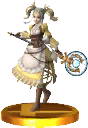</th>
    <th><b>Lissa</b></th>
    <th>The energetic, playful princess of Ylisse. Lissa wanted to become a member of her older brother Chrom's Shepherds, so she trained as hard as she could to be good enough for them. She may seem naive sometimes, and her attempts at sewing and cooking are a bit dubious, but her love for the people of Ylisse shines through.</th>
  </tr>
  <tr>
    <th></th>
    <th><b>Lon'qu</b></th>
    <th>Lon'qu is a skilled swordsman hailing from the northern nation of Regna Ferox. Trauma from his past instilled a fear of being near women, so he has a very brusque attitude when he has to work with them. He is committed to his art and hones his fighting skills constantly. As a peculiar side effect, he's become very good at potato peeling.</th>
  </tr>
  <tr>
    <th>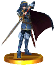</th>
    <th><b>Lucina</b></th>
    <th>Chrom's daughter and the future Princess of Ylisse. When she arrives from a doomed future seeking to prevent it from ever happening, she goes by the name Marth before her identity is revealed. She fights much like her adopted namesake, but more than just the tip of her sword is powerful.</th>
  </tr>
  <tr>
    <th></th>
    <th><b>Lucina (Alt.)</b></th>
    <th>Lucina's moves are much like Marth's, but there are subtle differences. With Marth, you need to try to hit with the tip of his sword, but Lucina's sword is equally powerful all along the blade. Her Shield Breaker move lets her attack opponents and break their shields at the same time. Charge it fully to shatter shields in one hit.</th>
  </tr>
  <tr>
    <th>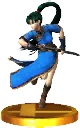</th>
    <th><b>Lyn</b></th>
    <th>Her real name is Lyndis, and she's the last survivor of one of the Sacaen tribes. She's strong and friendly, and her swordsmanship is epic. If you summon her in this game, she'll charge herself up before laying a critical hit on her nearest opponent. Expect a solid strike from her to leave a mark!</th>
  </tr>
  <tr>
    <th>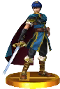</th>
    <th><b>Marth</b></th>
    <th>The first hero from the Fire Emblem series, Marth is the prince of Altea and descendant of the hero Anri. In Smash Bros., he's known as an exceptional swordfighter, swinging his blade with grace. Striking with the tip will maximize the damage dealt. Teach aggressive foes a lesson with his strong Counter move.</th>
  </tr>
  <tr>
    <th></th>
    <th><b>Marth (Alt.)</b></th>
    <th>Marth's side special Dancing Blade is a four-stage attack. Aim and time your strikes carefully! The tip of his sword does the most damage. For his up smash, Justice Sword, he thrusts his blade into the air. You can use it to block attacks from above and launch nearby foes.</th>
  </tr>
  <tr>
    <th>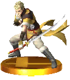</th>
    <th><b>Owain</b></th>
    <th>When Owain first runs into Lissa, he introduces himself as her son from the future and proves his royal heritage with the Brand of the Exalt on his arm. He brings theatrics to battle, referring to his weapons with names he's given them and shouting the names of his special moves as he performs them.</th>
  </tr>
  <tr>
    <th>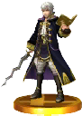</th>
    <th><b>Robin</b></th>
    <th>This is the male Robin, your avatar in Fire Emblem Awakening. The goal of this adventure doesn't change much because of your gender choice, but Robin's marriage options do. In Smash Bros., Robin brings powerful magic and swordplay to bear. He can exhaust his moves, but they'll be restored over time.</th>
  </tr>
  <tr>
    <th></th>
    <th><b>Robin (Alt.)</b></th>
    <th>Robin's magic is powerful, but it has limited uses before needing to recharge. Thunder can be charged in stages, will become Thoron at max charge, and gains damage and speed with its charge. Arcfire creates a flame pillar, perfect for dealing with an edge-clinging foe.	</th>
  </tr>
  <tr>
    <th>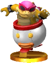</th>
    <th><b>Roy</b></th>
    <th>Roy, the main character of Fire Emblem: The Binding Blade, returns for the first time since Melee! In The Binding Blade, Roy led the troops of Pherae into battle in his ailing father’s stead, and now he brings his speed and talent for short-range combat into this game.</th>
  </tr>
  <tr>
    <th></th>
    <th><b>Roy (Alt.)</b></th>
    <th>His sword, the Sword of Seals, is uniquely powerful at the base of the blade. Flare Blade creates an explosion in front of Roy that can be charged by holding down the button. Take care, though, because at the highest levels of charge, Roy himself will catch fire and take damage! His side special, Double-Edge Dance, changes for each strike after the first depending on whether you hold up or down while attacking.</th>
  </tr>
  <tr>
    <th></th>
    <th><b>Ryoma</b></th>
    <th>The eldest son of the Hoshido royal family and Corrin's brother. A natural swordsman, he tries to embody the honorable spirit of a samurai in all that he does. Ryoma is the wielder of the Raijinto and known to be one of the strongest men in Hoshido. He's also known for never giving up...and occasionally for his reckless actions.</th>
  </tr>
  <tr>
    <th>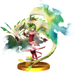</th>
    <th><b>Tiki</b></th>
    <th>Tiki resides in Valm as the Voice of the Divine Dragon. You might be surprised to learn that she is 3,000 years old. As befitting one from the Divine Dragon tribe, she has a very calm demeanor...but every so often, she'll show her youthful spirit.</th>
  </tr>
  <tr>
    <th>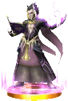</th>
    <th><b>Validar</b></th>
    <th>Validar is the leader of the Grimleal, the religious sect dedicated to the Fell Dragon, Grima. Their goal is to resurrect their fallen master, and Validar himself practices dark magic. In one possible timeline, he uses his own child as a vessel in a spell to resurrect Grima. Fire Emblem Awakening follows a different timeline.</th>
  </tr>
  <tr>
    <th>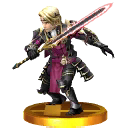</th>
    <th><b>Xander</b></th>
    <th>Xander is the eldest son of the king, and crown prince of Nohr. He's taciturn and quite stubborn, but he views Corrin as true family though they aren't blood relatives. Said to be the strongest and most skilled swordsman in Nohr, Xander wields the divine weapon known as Siegfried.</th>
  </tr>

</table>



<table class="fixed" border="1">
    <col width="100px" />
    <col width="100px" />
    <col width="600px" />
  <tr>
    <th></th>
    <th><b>Blue Falcon</b></th>
    <th>The trademark vehicle of famed bounty hunter Captain Falcon. Both of their names refer to the bird's ability to swoop in and capture its prey—a subtle nod to Captain Falcon's bounty-hunting exploits. The Blue Falcon itself is a well-rounded vehicle, allowing the pilot's talent to really show.</th>
  </tr>
  <tr>
    <th></th>
    <th><b>Captain Falcon</b></th>
    <th>In the F-Zero racing scene, Captain Falcon uses his Blue Falcon to win big. His origin largely a mystery, he's made his way to the Smash Bros. battlefield to prove his worth outside the cockpit. He's got speed and power, and his distinct Falcon Punch leaves a dent. Start it in the air to surprise your foes!</th>
  </tr>
  <tr>
    <th></th>
    <th><b>Captain Falcon (Alt.)</b></th>
    <th>Captain Falcon's default down special, Falcon Kick, is no ordinary kick—it surges forward in a fiery blaze. It's a versatile attack that moves sideways on the ground and diagonally down in the air. His forward air attack, Knee Smash, can send an enemy flying for miles if hit just right.</th>
  </tr>
  <tr>
    <th></th>
    <th><b>Dr. Stewart</b></th>
    <th>Dr. Stewart is a skilled, charismatic surgeon. He became an F-Zero pilot after the sudden, tragic death of his father, who also raced. Using the same machine his father raced with, the Golden Fox, Dr. Stewart employs skill and care to help avoid deadly accidents.</th>
  </tr>
  <tr>
    <th></th>
    <th><b>Falcon Flyer</b></th>
    <th>The treasured ship of the bounty hunter Captain Falcon. Don't get this confused with the Blue Falcon, his F-Zero machine. The nose looks like a falcon, reflecting Captain Falcon's dauntless pursuit of his prey. Beware, bounty heads! Captain Falcon will track you down!</th>
  </tr>
  <tr>
    <th></th>
    <th><b>Fire Stingray</b></th>
    <th>This pink machine isn't quite what you'd expect an intergalactic-bandit gang leader to drive, but Samurai Goroh does it. What a clash of styles. He holds a grudge against Captain Falcon—perhaps he's a bit jealous of the Captain's good looks?</th>
  </tr>
  <tr>
    <th></th>
    <th><b>Golden Fox</b></th>
    <th>Dr. Stewart's father, a scientist, left him the racing machine Golden Fox as his inheritance. This marked the start of Dr. Stewart's racing career. He hopes that, by dominating the racing circuit, he can show the world the quality of his father's work and make him proud.</th>
  </tr>
  <tr>
    <th></th>
    <th><b>Mute City</b></th>
    <th>F-Zero is an interstellar race spread over nine different planets. The Blue Falcon sprints through Mute City, the first circuit in the Knight League. Fighters must do battle as they move between the various racing machines, being careful not to get knocked off and left behind in this high-speed stage.</th>
  </tr>
  <tr>
    <th>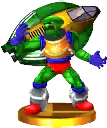</th>
    <th><b>Pico</b></th>
    <th>An ex-soldier from the Poripoto army, he hails from the planet Death Wind. He comes off as aggressive in interviews, and his driving is very similar. I always feel bad for the interviewers! Some say his reckless driving caused a major accident in a race...</th>
  </tr>
  <tr>
    <th></th>
    <th><b>Samurai Goroh</b></th>
    <th>This infamous pilot considers himself to be Captain Falcon's main rival. His racing machine, the Fire Stingray, is incredibly fast. If summoned into battle, he'll head toward the nearest opponent and slash with his katana. He definitely makes a better friend than foe!</th>
  </tr>
  <tr>
    <th></th>
    <th><b>Wild Goose</b></th>
    <th>Pico was given this machine when his commanding officer retired from the military. The Wild Goose trades handling and acceleration for durability— fortunate, since Pico isn't afraid to swap paint with his rivals. Speaking of paint, does it look kinda...duck-like?</th>
  </tr>
</table>



<table class="fixed" border="1">
    <col width="100px" />
    <col width="100px" />
    <col width="600px" />

  <tr>
    <th></th>
    <th><b>Chef</b></th>
    <th>Back in the days of the Game & Watch and the early NES years, there were a lot of games with short and simple titles—and at just four letters and one syllable, Chef is a prime example. It's all about flipping food on a frying pan without dropping any on the floor. Whether any of that food ever actually gets served to customers is a mystery...</th>
  </tr>
  <tr>
    <th></th>
    <th><b>Fire</b></th>
    <th>Many fans of modern handheld games will fondly remember the classic Game & Watch games they played years ago, like the intense challenge of Fire. Save people from a burning building using a trampoline, bouncing them to the waiting ambulance and safety.</th>
  </tr>
  <tr>
    <th></th>
    <th><b>Lion</b></th>
    <th>Back in the day, there were a lot of kids into the Game & Watch series. Quite a few adults as well, honestly. This game was a popular pick, with players controlling two zookeepers as they tried to keep the lions from escaping. The built-in clock was great for keeping track of your time spent playing!</th>
  </tr>
  <tr>
    <th></th>
    <th><b>Mr. Game & Watch</b></th>
    <th>Game & Watch was first released in 1980, making the series the father of the Game Boy and Nintendo DS. Or maybe an older sibling? Anyway...in Smash Bros., Mr. Game & Watch uses distinct retro moves to damage his foes. However, he's only two dimensional, so he's pretty easy to send flying.</th>
  </tr>
  <tr>
    <th></th>
    <th><b>Mr. Game & Watch (Alt.)</b></th>
    <th>Mr. Game & Watch's Oil Panic special catches shots and turns them into oil. After catching three, the bucket will be full and you'll be able to throw oil all over your enemies. Some shots, like Samus's fully powered Charge Shot, will fill the bucket in one go! Throwing the oil you get from a shot like that can KO your foes in a flash!</th>
  </tr>
  <tr>
    <th></th>
    <th><b>Oil Panic</b></th>
    <th>The Game & Watch Multi Screen series is the big, big brother of the Nintendo DS. One classic title was Oil Panic, which puts you in charge of a petrol station that's sprung a leak. As oil drips down on the upper screen, you've got to catch it in buckets on the lower screen or risk an angry customer with a face full of oil!</th>
  </tr>
</table>



<table class="fixed" border="1">
    <col width="100px" />
    <col width="100px" />
    <col width="600px" />
  <tr>
    <th></th>
    <th><b>Arlon the Serene</b></th>
    <th>A suave commander of the Forces of Nature, Arlon resides within the Lunar Sanctum. Compared to Viridi, he is very tall. You could say he has the ear of Viridi, but he has to lean down pretty far to reach it. Despite his refined appearance, Arlon is capable of holding his own in combat.</th>
  </tr>
  <tr>
    <th></th>
    <th><b>Back Shield</b></th>
    <th>This durable, defensive shield comes to Smash Bros. from Kid Icarus: Uprising. If you pick it up, it will attach itself to you, protecting your back from most threats. It won't stop grabs or piercing attacks, however, and it only lasts so long before vanishing.</th>
  </tr>
  <tr>
    <th></th>
    <th><b>Boom Stomper</b></th>
    <th>A giant rock bestowed with the gift of life. It usually stays still—as rocks do—but if it catches sight of you, it'll slowly move after you and try to stomp you into the ground. Its stomping also causes shock waves that will harm any fighters in the vicinity. Its weak point is the little leaf on its head!</th>
  </tr>
  <tr>
    <th></th>
    <th><b>Bumpety Bomb</b></th>
    <th>This pesky bomb has wheels, which means the time-tested strategy of running away doesn't work as well as you'd hope. Be ready for a big blast if this bomb hits zero. Oh, and sometimes the fuse is a little shorter than normal. You'll have to attack from behind to defuse this dangerous foe.</th>
  </tr>
  <tr>
    <th></th>
    <th><b>Centurions</b></th>
    <th>The standard soldiers of Palutena's Army, Centurions make up in loyalty and number for what they lack in power. They have time and again fallen victim to a curse that turns them to stone, but the head of Palutena's guard, Pit, saves them with the use of a stone-breaking mallet.</th>
  </tr>
  <tr>
    <th></th>
    <th><b>Chaos Kin</b></th>
    <th>This malevolent creature thrives on disorder, living in the Chaos Vortex and feeding on souls—even those of divine beings like Palutena. Its totally unpredictable behavior and appearance make it one of the most dangerous things Pit will face in his adventures.</th>
  </tr>
  <tr>
    <th></th>
    <th><b>Chariot Master</b></th>
    <th>A legendary and powerful soldier, he controls the Lightning Chariot. Normally the eyes are the windows to the soul, but the Chariot Master's actual body is long gone, and his eyes burn like the rest of his warrior spirit. He will surrender the Lightning Chariot to a worthy foe.</th>
  </tr>
  <tr>
    <th></th>
    <th><b>Clubberskull</b></th>
    <th>These enormous beasts armed with giant skulls are usually kept locked up, but you can set them free just by attacking them. We should mention, though, that you can't grab or launch them and they're super powerful. What? You already released it? Defeat it, then, and earn lots of stat boosts and prizes!</th>
  </tr>
  <tr>
    <th></th>
    <th><b>Cragalanche, the Mighty</b></th>
    <th>Once a mere stone with a soul, Cragalanche has grown into a mighty warrior for the Forces of Nature. You can trust him with your darkest secrets because he is a rock and can't speak. He needs no words to assure Viridi of his loyalty, though—she can see it in his glowing red eyes.</th>
  </tr>
  <tr>
    <th></th>
    <th><b>Daphne</b></th>
    <th>These flowery foes from the Kid Icarus series may look adorable, but they'll reveal their repulsive faces and scatter mines everywhere if given the chance. The mines have an impressive blast radius and knock-back. Best to blow them up from a distance. Daphnes themselves have very little health.</th>
  </tr>
  <tr>
    <th></th>
    <th><b>Dark Pit</b></th>
    <th>Pit's mysterious, black-clad doppelgänger, Dark Pit. (Some call him Pittoo, but he really doesn't like that.) When he first appears, he immediately goes after both Pit and the Underworld Army. In Smash Bros., he uses moves a lot like Pit's, though both his bow and his Sacred Treasures are different.</th>
  </tr>
  <tr>
    <th></th>
    <th><b>Dark Pit (Alt.)</b></th>
    <th>Dark Pit's Guardian Orbitars special puts up shields of light on either side of you to block attacks, deflect projectiles, and push back any enemies who are too close. You can even use the shields to protect against attacks from above and below. If they take too many hits, though, they'll vanish and become unusable for a while.</th>
  </tr>
  <tr>
    <th></th>
    <th><b>Dark Pit Staff</b></th>
    <th>This weapon may be called a staff, but it actually does better shooting powerful shots at targets at long range. Like Dark Pit, this staff was created by the Mirror of Truth. If Pit were to use it, he'd probably feel lingering echoes of his clone's warped personality.</th>
  </tr>
  <tr>
    <th></th>
    <th><b>Daybreak</b></th>
    <th>A weapon of great and terrible power. The name Daybreak might sound pretty cheerful, but in truth this weapon is destructive enough to doom the world. Unable to be used until all three parts are assembled, it's best to keep this out of your opponent's hands...</th>
  </tr>
  <tr>
    <th></th>
    <th><b>Fiend's Cauldron</b></th>
    <th>A cauldron that can enhance or reduce the intensity of the adventure. Add some hearts to make enemies more challenging, and receive better rewards for defeating them. Be careful, though—if you fail, the cauldron will spill the hearts and you'll lose them. At least the going gets easier!</th>
  </tr>
  <tr>
    <th></th>
    <th><b>Flage</b></th>
    <th>These gelatinous assassins from the Forces of Nature in Kid Icarus: Uprising can disguise themselves so well, it's like they've disappeared. They furiously slash using their long, bladelike arms and then top off their attack with a powerful finishing blow.</th>
  </tr>
  <tr>
    <th></th>
    <th><b>Galactic Fiend Kraken</b></th>
    <th>A colossal cephalopod that travels the dark seas of the galaxy. It can detect the faintest ripples of light even from a great distance. Drawn by the battle with Space Pirates, a Space Kraken also attacks Pit during his adventure. Turn the tables on this sushi-to-be!</th>
  </tr>
  <tr>
    <th></th>
    <th><b>Great Reaper</b></th>
    <th>The Great Reaper stands guard within the Reaper Fortress. One swing of his scythe will send a shiver down anyone's spine. If his piercing, red laser vision strikes Pit, expect a wave of Reapettes to arrive! When he takes enough damage and hunches over, aim for the golden light on his head!</th>
  </tr>
  <tr>
    <th></th>
    <th><b>Guardian Orbitars</b></th>
    <th>Guardian Orbitars are more defensive in nature than other Orbitars. When you fire a charged shot, they will create a shield that protects you and your friends. It's a good thing these float in the air on their own—they're actually ridiculously heavy.</th>
  </tr>
  <tr>
    <th></th>
    <th><b>Hades, Lord of the Underworld</b></th>
    <th>The true ruler of the Underworld, he is so powerful that he easily resurrected Medusa for his own amusement—and to distract his foes. Full of arrogance, he does have a genuine sense of humor, though it mainly serves to conceal his callous disregard for life.</th>
  </tr>
  <tr>
    <th></th>
    <th><b>Killer Eye</b></th>
    <th>A compact, user-friendly turret. Take the name literally—anything in its field of vision will be showered with a storm of bullets. But if you placed it, it'll be your friend! If you didn't, sneak up behind it and grab it to make it yours!</th>
  </tr>
  <tr>
    <th></th>
    <th><b>Lethinium</b></th>
    <th>These petalled pests from Kid Icarus: Uprising are the big guns in the Forces of Nature. If you get close to one in Smash Run, it'll fire a wide beam that even cuts through terrain. However, while firing, it leaves its back totally exposed. Get behind it, and take it out with a special or a smash attack.</th>
  </tr>
  <tr>
    <th></th>
    <th><b>Lurchthorn</b></th>
    <th>Is it a bird? Is it a plane? No, it's...some kind of giant fossilized fish. Lurchthorns fly around, shooting at anyone who strays too close. Each of its segments attacks separately, so the more it has, the more dangerous it is. To get rid of it quickly, take out the head—that'll kill off the entire Lurchthorn in one go!</th>
  </tr>
  <tr>
    <th></th>
    <th><b>Magnus</b></th>
    <th>Magnus is perhaps the mightiest human warrior, and he has weathered countless battles. He seems to prefer working alone, and he can respect the strength of foes like Dark Lord Gaol. However, he seems reluctant—not afraid—to fight Gaol. Is there a connection between these two?</th>
  </tr>
  <tr>
    <th></th>
    <th><b>Mahva</b></th>
    <th>A strange, fishlike thing that shrouds itself in a large, spherical barrier. When it sees one of its allies, it extends the barrier to protect them as well. As you attack the barrier, it'll slowly change color until it finally breaks. That's when the Mahva will try to escape. Finish it off before it does to nab yourself some defense stat boosts!</th>
  </tr>
  <tr>
    <th></th>
    <th><b>Medusa, Queen of the Underworld</b></th>
    <th>Medusa is the goddess of darkness and the leader of the Underworld Army. Although she was defeated in the past, Hades has secretly resurrected her to fight again. Those slithering snakes on her head are really unpleasant. That's got to be the worst bad hair day ever.</th>
  </tr>
  <tr>
    <th></th>
    <th><b>Megonta</b></th>
    <th>You wouldn't think a wood louse would make a very scary enemy, but when it's as big as this... Eek. It attacks by curling into a ball and rolling across the stage. There's no point in hitting its shell—it's solid. Instead, knock it onto its back with a smash attack, and then pummel its stomach while it's trying to right itself.</th>
  </tr>
  <tr>
    <th></th>
    <th><b>Mik</b></th>
    <th>It's easy to sum up a Mik—it's a large- mouthed monster. It serves as one of the Underworld Army's frontline troops, but maybe it would make a better food tester? Miks will eat just about anything, you know, and angels are right at the top of the menu.</th>
  </tr>
  <tr>
    <th></th>
    <th><b>Mimicutie</b></th>
    <th>Hey, look! That treasure chest probably contains stat boosts! Wait, why does it have two legs? Chest, where are you going?! ...Something about this just seems so unfair. Guess the best course of action is to avoid its rapid kicks and defeat it to earn those stat boosts</th>
  </tr>
  <tr>
    <th></th>
    <th><b>Monoeye</b></th>
    <th>These one-eyed monsters are members of the Underworld Army from the Kid Icarus series. In Smash Run, these scouts will usually attack alone and chase fighters. If their eye starts to glow red, they're preparing to fire a projectile. They're really weak, though, so you should have no trouble.</th>
  </tr>
  <tr>
    <th></th>
    <th><b>Nutski</b></th>
    <th>A grunt in the Forces of Nature from Kid Icarus: Uprising. It was created by Viridi when she removed a chestnut from its shell and blessed it. In Smash Run, they move quickly and in difficult-to-predict ways. When fighters get close, they'll flip upside down and fire three seeds.</th>
  </tr>
  <tr>
    <th></th>
    <th><b>Ore Club</b></th>
    <th>A weapon fashioned from minerals found on the mountain of the gods, this club is infused with a soul, giving it an ominous eye in its center. Maybe it's just my imagination, but I think the eye winks at you each time you land a perfect, wall-penetrating shot.</th>
  </tr>
  <tr>
    <th></th>
    <th><b>Orne</b></th>
    <th>This creepy ghost, covered in fire, first appeared in Kid Icarus: Uprising. If it shows up nearby, you'll hear eerie 8-bit music and get chased. Don't even think about fighting it—it's invincible and will instantly KO you if it touches you. Just run!</th>
  </tr>
  <tr>
    <th></th>
    <th><b>Palutena</b></th>
    <th>In Kid Icarus: Uprising, the goddess of light uses telepathy to communicate and grants miracles to support Pit on his adventure. In Smash Bros., she has special moves like Warp and Heavenly Light at her disposal. She's very adaptable—you can customize her into a long- or close-range fighter!</th>
  </tr>
  <tr>
    <th></th>
    <th><b>Palutena (Alt.)</b></th>
    <th>Palutena's Reflect Barrier side special deflects any attacks and projectiles that come at her from the front. Unlike other reflective moves, you can leave this barrier in place and it will keep reflecting. If you really want to ruin someone's day, you can push them over an edge using this move.</th>
  </tr>
  <tr>
    <th></th>
    <th><b>Palutena Bow</b></th>
    <th>A bow crafted by the goddess Palutena herself. It is said that one night, as Palutena was caring for this bow, the moon's light formed a beam and fell upon it, blessing it with power. A legendary weapon like this requires skill and training to wield effectively.</th>
  </tr>
  <tr>
    <th></th>
    <th><b>Phosphora</b></th>
    <th>Phosphora is a young, beautiful, fierce commander of the Forces of Nature. She also has control over electricity, letting her move at shockingly high speed. When I write it out like that, it sounds like she has everything! Well, I did hear she isn't a great singer...</th>
  </tr>
  <tr>
    <th></th>
    <th><b>Pit</b></th>
    <th>Pit is the captain of Palutena's royal guard. Despite the wings on his back, Pit needs the Power of Flight from Palutena in order to truly fly. In Smash Bros., he can still get more air than most, with four jumps and a special move that boosts him higher. He has a new reflect move—it protects both sides!</th>
  </tr>
  <tr>
    <th></th>
    <th><b>Pit (Alt.)</b></th>
    <th>Pit's side special Upperdash Arm delivers an uppercut so strong, it can send foes flying for a KO. If you miss and fall off the stage, Pit's up special can bring him soaring back. Another of Pit's specials is Palutena Bow, which fires arrows Pit can aim even after they've left the bow.</th>
  </tr>
  <tr>
    <th></th>
    <th><b>Pit (Eggplant)</b></th>
    <th>Let's squash a misconception right now— there is nothing worse than being turned into an eggplant. Just lettuce tell you, being hit by an eggplant bomb is humiliating. It leafs you without mushroom to maneuver and also makes you the laughing stalk of your friends.</th>
  </tr>
  <tr>
    <th></th>
    <th><b>Pseudo-Palutena</b></th>
    <th>A creation of Dyntos, the god of the forge, this distorted version of Palutena will attack Pit verbally and physically. Destroying her illusion of beauty only makes her more aggressive. Dyntos puts the real Palutena to sleep during battle, forcing Pit to tackle this creature alone.</th>
  </tr>
  <tr>
    <th></th>
    <th><b>Pyrrhon</b></th>
    <th>A savior from the annals of history! A comic-book hero come to life on the big screen! ...No one can tell if Pyrrhon is serious when he introduces himself. A self-proclaimed sun god, his obsession with the Aurum must be part of Pyrrhon Creed Number 851: know the baddies!</th>
  </tr>
  <tr>
    <th></th>
    <th><b>Reaper</b></th>
    <th>Since he's clearly not planning on doing any gardening, watch out for that scythe! You can tell when one of these has its sights set on you because the music will change and you'll hear a loud scream as it summons its Reapettes. If you always keep your distance and attack from afar, there's no need to fear the Reapers.</th>
  </tr>
  <tr>
    <th></th>
    <th><b>Reset Bomb</b></th>
    <th>Created as a secret weapon of the Forces of Nature, this item possesses devastating power. When it is detonated, it wipes out all signs of human civilization, returning the area to nature. The thick brambles and jungle that are created make the area all but inaccessible to humans.</th>
  </tr>
  <tr>
    <th></th>
    <th><b>Skuttler</b></th>
    <th>Skuttlers make no bones about coming up to you and swinging their clubs right at your face. The bigger the swing, the more it'll hurt. They act tough, and they do have a lot of health, but any strong attack from you will send them tumbling. Their shields are just for show, too. Our advice: throw them or whack them in the back.</th>
  </tr>
  <tr>
    <th></th>
    <th><b>Skuttler Cannoneer</b></th>
    <th>These foot soldiers come in three varieties, which you can tell apart by looking at the color of the cannons they're carrying. The green ones cause explosions, the blue ones' shots go through obstacles, and the red ones fire homing missiles. Occasionally, their cannons will stop working, giving you an opening to attack!</th>
  </tr>
  <tr>
    <th></th>
    <th><b>Skuttler Mage</b></th>
    <th>An Underworld enemy from Kid Icarus: Uprising. This type of Skuttler specializes in magical attacks. In Smash Run, it can attack at close range or grab fighters from long range and do magical damage. Be careful! From magic to cannons to hiding in statues, Skuttlers are quite versatile.</th>
  </tr>
  <tr>
    <th></th>
    <th><b>Souflee</b></th>
    <th>One of the cuter enemies to come from Kid Icarus: Uprising. Knowing Pit's love for all things edible, it's just cruel to disguise an enemy as a cake. See the little cherry on top? That's actually an eye! And nothing delicious would float around and attack in such an annoying, erratic way.</th>
  </tr>
  <tr>
    <th></th>
    <th><b>Space Pirate Ship</b></th>
    <th>This is the spaceship the Space Pirates use to travel the cosmos. It travels from one star to the next, collecting them to use as part of their interstellar power source. If you think this sounds like a romantic adventure, maybe you should consider becoming a Space Pirate!</th>
  </tr>
  <tr>
    <th></th>
    <th><b>Specknose</b></th>
    <th>Let's get one thing straight here—those are tentacles, not hair, hanging under that oversized nose. Specknoses may look goofy, but you should be wary of the dangerous projectiles they can shoot from their nostrils. Ew! I hope those are just regular bombs...</th>
  </tr>
  <tr>
    <th></th>
    <th><b>Thanatos, God of Death</b></th>
    <th>Don't be fooled by Thanatos's childish attitude—he's more dangerous than most clowns. And don't expect smiles from the god of death. He serves as Medusa's second in command and, thanks to his shape-shifting talents, can entertain his master with a decent clown act too.</th>
  </tr>
  <tr>
    <th></th>
    <th><b>Three-Headed Hewdraw</b></th>
    <th>A dragon with three regenerating heads. Each head has its own unique personality, and they are not known for getting along. One head would want to destroy a wall, the second would go around it, and the third would fly over it. All three are plenty happy to devour a meddling angel, though.</th>
  </tr>
  <tr>
    <th></th>
    <th><b>Three Sacred Treasures</b></th>
    <th>The powerful treasures used to defeat Medusa, the Three Sacred Treasures include the Arrow of Light, Wings of Pegasus, and Mirror Shield. That reminds me of a bit of trivia: there are in real life Three Sacred Treasures in Japan, but they are a sword, a mirror, and a jewel.</th>
  </tr>
  <tr>
    <th></th>
    <th><b>Twinbellows the Ferocious</b></th>
    <th>Twinbellows is a flame-engulfed, demonic, doglike beast unleashed by Medusa during her attack on a human city. Its roar heralds a crimson fire that consumes everything in its path. If you hear both heads roaring, prepare yourself—this beast is definitely drawing near.</th>
  </tr>
  <tr>
    <th></th>
    <th><b>Upperdash Arm</b></th>
    <th>Arms are a family of weapons that attach to the user's arm and fire projectiles. This one is outfitted with a disc-shaped device that fires ring shots. As the name implies, its real specialty lies in its powerful melee dash attack. Remember to take it off before a meal, though.</th>
  </tr>
  <tr>
    <th></th>
    <th><b>Viridi, Goddess of Nature</b></th>
    <th>The goddess of nature, she believes it is her duty to return heaven and earth to their pure states, and so she labels humans as contaminants of nature that should be eliminated. She butts heads with human-protecting Palutena but hates soul-stealing Hades even more.</th>
  </tr>
  <tr>
    <th></th>
    <th><b>X Bomb</b></th>
    <th>This bomb will explode shortly after it leaves your hand, expanding outward in an X-shaped blast that tears through anything in its path. Its incredible power can be a lot of fun, but don't get crazy. Blowing up everything is no way to get ahead in life!</th>
  </tr>
  <tr>
    <th></th>
    <th><b>Zuree</b></th>
    <th>The Zuree usually live in the Underworld, but in Kid Icarus, Medusa set them to work guarding the Palace in the Sky. In Smash Bros., they appear as a silvery mist, waiting until they've floated close enough to a fighter before showing themselves and attacking with their sharp claws. That's your cue to fight back!</th>
  </tr>
</table>



<table class="fixed" border="1">
    <col width="100px" />
    <col width="100px" />
    <col width="600px" />
  <tr>
    <th></th>
    <th><b>Bomber</b></th>
    <th>If you think a bit of mystery is the spice of life, you'll be disappointed here. If it looks like a bomb and explodes like a bomb...it's a bomb! A cute bomb, though, I admit. If he falls or bumps into something, he'll explode. With the right timing, you can throw him at enemies and do loads of damage!</th>
  </tr>
  <tr>
    <th></th>
    <th><b>Bonkers</b></th>
    <th>Bonkers looks quite a lot like a gorilla and swings a giant hammer with huge launch potential. If he hits you with his own Hammer Flip attack, it's an instant KO. If that isn't bad enough, he also throws exploding coconuts. Bonkers is seriously out to ruin your day.</th>
  </tr>
  <tr>
    <th></th>
    <th><b>Bronto Burt</b></th>
    <th>These pink, winged enemies come from the Kirby series. In Smash Run, there are three different types floating around: one that flees when a fighter approaches, one that flies sideways, and one that chases fighters. Their spinning attack is weak, but it can cause knock-back if it lands repeatedly.</th>
  </tr>
  <tr>
    <th></th>
    <th><b>Bugzzy</b></th>
    <th>This enemy is a huge wrestling fan—he'll do his best to try out some wrestling moves on his enemies. If Kirby manages to avoid his attacks and swallow him, Kirby can bust out some wrestling moves too. Bugzzy can also release ladybugs to attack, but I think that's against wrestling rules...</th>
  </tr>
  <tr>
    <th></th>
    <th><b>Combo Cannon</b></th>
    <th>This giant cannon is the main weapon of the Battleship Halberd. Any invader will think twice when cannonballs and laser beams are brought to bear. You'll have to be really careful around these weapons, since even the platforms underfoot will try to lift you into the path of the beam. Watch out!</th>
  </tr>
  <tr>
    <th></th>
    <th><b>Dragoon</b></th>
    <th>Collect parts A, B, and C to assemble the legendary Air Ride machine known as the Dragoon. Take careful aim, and then ride it toward your target. A hit will send enemies flying out of the battle. Taking damage before you've collected all the parts can knock them from your grasp, however.</th>
  </tr>
  <tr>
    <th></th>
    <th><b>Gordo</b></th>
    <th>These little guys from the Kirby series look like metal balls with eyes and eight sharp spikes. They can't be defeated, so don't waste your time. Instead, try pushing your enemies onto them! Watch for two different kinds: one moves along a set path, and the other stubbornly sits in place.</th>
  </tr>
  <tr>
    <th></th>
    <th><b>Halberd</b></th>
    <th>Kirby's rival, the masked warrior Meta Knight, constructed this ship to conquer Dream Land. Just in case you forget who owns it, the ship's bow is designed to look like his mask. How is a small guy like Kirby supposed to defeat a battleship?! Maybe he'll find a way inside...</th>
  </tr>
  <tr>
    <th></th>
    <th><b>King Dedede</b></th>
    <th>He calls himself the King of Dream Land, but he doesn't have a lot of interest in ruling. He really loves to eat, so it's no surprise he's a heavyweight fighter. Despite his size and low speed, he can easily recover with his four jumps. His Jet Hammer will leave a mark on everyone he meets.</th>
  </tr>
  <tr>
    <th></th>
    <th><b>King Dedede (Alt.)</b></th>
    <th>For the Gordo Throw side special, King Dedede sends a Gordo bouncing with a hammer strike. It bounces off walls—or sometimes gets stuck in them. After a while it'll disappear. If an enemy hits one, it'll bounce back toward you. Use the special again to whack it back at them!</th>
  </tr>
  <tr>
    <th></th>
    <th><b>Kirby</b></th>
    <th>Round little Kirby lives on the peaceful Planet Popstar, in Dream Land. He can inhale things with his big mouth, either copying their abilities or spitting them out again. In Smash Bros., Kirby can inhale opponents and copy their standard specials. He gets launched easily but recovers well.</th>
  </tr>
  <tr>
    <th></th>
    <th><b>Kirby (Alt.)</b></th>
    <th>Holding the special button and left or right will charge up Kirby's Hammer Flip attack. Charging too long hurts Kirby! The hammer strikes twice in the air, but landing the single blow on the ground is more powerful. Kirby's up special Final Cutter slices up and down, firing a shock wave upon landing.</th>
  </tr>
  <tr>
    <th></th>
    <th><b>Knuckle Joe</b></th>
    <th>A martial-arts master, Knuckle Joe can be inhaled by Kirby and his Fighter ability copied. If you summon him, he'll leap toward the enemy nearest you and unleash his powerful Vulcan Jab attack. He'll then finish off his target with a devastating Smash Punch or Rising Break.</th>
  </tr>
  <tr>
    <th></th>
    <th><b>Maxim Tomato</b></th>
    <th>A tomato marked with a large, black M. This is Kirby's favorite snack, and in the past it has fully restored Kirby's health. The ones that show up in Smash Bros. aren't from the same crop, though, and only heal 50 points of damage. That'll still help you in a fight—unless an enemy eats it first.</th>
  </tr>
  <tr>
    <th></th>
    <th><b>Meta Knight</b></th>
    <th>Kirby's mysterious rival, this masked swordsman appears in several Kirby games. His cape transforms into wings to grant him flight. In Smash Bros., his quick sword skills and aerial agility set him apart. He can jump up to five times in a row, and he has a special move to soar higher.</th>
  </tr>
  <tr>
    <th></th>
    <th><b>Meta Knight (Alt.)</b></th>
    <th>Meta Knight's Dimensional Cape lets you teleport, changing where you'll reappear with directional inputs and attacking by holding the button! His Mach Tornado special can draw in and attack multiple opponents. Rise by pressing the button repeatedly, and press left or right to move.</th>
  </tr>
  <tr>
    <th></th>
    <th><b>Nightmare</b></th>
    <th>This ball of nightmares came from the Fountain of Dreams, taking nightmares to all of Dream Land. King Dedede sealed it away by shattering the Star Rod, but it was revived when the Star Rod was restored by Kirby. In Smash Bros., it hides the stage and the fighters in pure darkness.</th>
  </tr>
  <tr>
    <th></th>
    <th><b>Parasol Waddle Dee</b></th>
    <th>This citizen of Dream Land falls gracefully from the sky clutching a parasol. Waddle Dee itself is fairly harmless, but the parasol can deflect almost anything. Don't hurt yourself accidentally! Also, be careful if one releases its parasol—that floating umbrella can really sting!</th>
  </tr>
  <tr>
    <th></th>
    <th><b>Plasma Kirby</b></th>
    <th>What does the aurora borealis have in common with lightning? Plasma! And what does Plasma Kirby have in common with them? Hrm. Maybe that was too easy... Anyway, Plasma Kirby can build up plasma using the +Control Pad and fire it with the B Button. You can look up more about plasma if you want, but firing plasma is what's important here.</th>
  </tr>
  <tr>
    <th></th>
    <th><b>Plasma Wisp</b></th>
    <th>This glowing enemy from the Kirby series uses plasma to attack. In Smash Bros. it'll float up to a fighter and then fire off energy attacks. There are three different levels to its attack. Level-two attacks can stun you, while level-three attacks do more damage. Keep your eyes peeled for those attacks!</th>
  </tr>
  <tr>
    <th></th>
    <th><b>Shotzo</b></th>
    <th>These cannons from the Kirby series could track Kirby and fire at him. In Smash Bros., there are two different kinds: ones that fire in a set direction and ones that will track and fire at a fighter. Don't waste time attacking these guys, though— it's impossible to defeat them.</th>
  </tr>
  <tr>
    <th></th>
    <th><b>Star Rod</b></th>
    <th>Swung normally, this item will deal a regular physical attack. But if you charge up the blow, it becomes a magic wand that launches stars! The Star Rod is the source of power for the Fountain of Dreams in Kirby's Adventure. Using the rod, Kirby was able to defeat Nightmare.	</th>
  </tr>
  <tr>
    <th></th>
    <th><b>Superspicy Curry</b></th>
    <th>Hope you're a fan of spicy food, because this curry will set your mouth on fire! I'm not kidding—whoever eats this will actually shoot balls of fire from his or her mouth, hurting those who get too close. Water doesn't help with spiciness, so this works underwater too! Too bad there's no milk weapon...</th>
  </tr>
  <tr>
    <th></th>
    <th><b>Tac</b></th>
    <th>This zippy character appears in the Kirby series. In Smash Bros., he'll appear in Smash Run to try to steal your stat boosts from you. How much he steals depends on how much you've improved your stats. If you can catch him, you can get back whatever he stole. Don't give up!</th>
  </tr>
  <tr>
    <th></th>
    <th><b>Waddle Doo</b></th>
    <th>Two big eyelashes for one big eye? You're describing this beam-firing enemy from the Kirby series. This enemy may hop toward a fighter it spots and unleash an energy attack. The attack itself has a short range, but it can happen repeatedly and can stun. Unlike Waddle Dees, these guys will fight!</th>
  </tr>
  <tr>
    <th></th>
    <th><b>Warp Star</b></th>
    <th>A magical transportation device that Kirby has used in the past to get around. Jumping on the Warp Star will send the character high into the sky and then crashing back down to the battlefield. Anyone caught in the path or landing spot will be sent flying, and the rider can aim a bit to the left or right in the air.</th>
  </tr>
  <tr>
    <th></th>
    <th><b>Wheelie</b></th>
    <th>Pop quiz! What do cars have four of, bikes have two of, and this enemy would blend right in with? That's right! Tires! Your prize is...more info! Wheelie likes to charge ahead, and Kirby can ride on top when he's a helper. If Kirby inhales him, he can even turn into a tire!</th>
  </tr>
</table>



<table class="fixed" border="1">
    <col width="100px" />
    <col width="100px" />
    <col width="600px" />
  <tr>
    <th></th>
    <th><b>Adult Link (Ocarina of Time)</b></th>
    <th>The children from Kokiri Forest never seem to grow into adults. Just a young boy, Link is entrusted with a quest by the Great Deku Tree. He leaves the forest and eventually finds the Master Sword in the Temple of Time. When he awakes, he is seven years in the future and an adult!</th>
  </tr>
  <tr>
    <th></th>
    <th><b>Adult Zelda (Ocarina of Time)</b></th>
    <th>Related	In the seven years following Link's disappearance, Hyrule falls under the rule of the evil Ganondorf and Zelda grows into a young woman. To help Link in his quest to find the seven Sages, she takes on the guise of a young man named Sheik. The real identity of this mysterious helper is just one of the surprises awaiting Link.</th>
  </tr>
  <tr>
    <th></th>
    <th><b>Alfonzo</b></th>
    <th>He may look like a pirate on shore leave, but Alfonzo is actually a respected engineer and was known as the greatest swordsman in Hyrule. By the way, did you know he's the grandson of Gonzo from the Phantom Hourglass game? Even their names sound similar!</th>
  </tr>
  <tr>
    <th></th>
    <th><b>Anjean</b></th>
    <th>An ancient wisewoman and guardian of the spirit tower. She is the leader of the Lokomo and was once Byrne's teacher. Anjean provides guidance to the young hero and engineer, Link, as he tries to stop Chancellor Cole's plot to resurrect the Demon King.</th>
  </tr>
  <tr>
    <th></th>
    <th><b>Armored Train</b></th>
    <th>These invincible trains really have it in for Link, even changing course if they need to. The Spirit Train can't outrun them, so the only option is to let loose with Tears of Light and destroy them. When they appear on the Spirit Train stage, they get in the way and change the speed of the train.</th>
  </tr>
  <tr>
    <th></th>
    <th><b>Beetle</b></th>
    <th>A remote-controlled item shaped like a little bug, Link used this item in his adventures to collect far-off items. In Smash Bros., tossed Beetles will fly straight ahead, grab foes, and carry them into the sky. If one grabs you, wiggle with all your might to break free!</th>
  </tr>
  <tr>
    <th></th>
    <th><b>Bombchu</b></th>
    <th>These mouse-shaped bombs crawl on the ground, up walls, and even along ceilings. If you toss one, it will scurry along until it hits an opponent and explodes. They won't blow up you or your friends—so user friendly! They will blow up if struck, though, so be careful.</th>
  </tr>

  <tr>
    <th></th>
    <th><b>Bubble</b></th>
    <th>A skull wreathed in flames. If that wasn't hardcore enough for you, in Brawl they'd leave a curse on anyone who touched them. In Smash Run, the red ones attack with shocks and are weak against ice, and the blue ones attack with ice and are weak against fire. Just keep that in mind when you're taking them on, and you'll be fine.</th>
  </tr>
  <tr>
    <th></th>
    <th><b>Bunny Hood</b></th>
    <th>This hood is beloved by a man with a passion for nature who longed to emulate a long-lost breed of bunny. Wearing this hood, he gained impressive leg power that allowed him to run for days on end. If you don this hood, you'll leave your foes in the dust with enhanced speed and jump power.</th>
  </tr>
  <tr>
    <th></th>
    <th><b>Byrne</b></th>
    <th>A henchman for the evil Chancellor Cole, Byrne defeats Alfonzo and helps separate Zelda's spirit from her body. He isn't evil through and through, but he doesn't show his true colors until the Demon King, Malladus, is nearly resurrected...</th>
  </tr>
  <tr>
    <th></th>
    <th><b>Ciela</b></th>
    <th>A fairy who tags along with Link on his Phantom Hourglass adventure. Ciela is the one who finds Link after he tries to save Tetra and falls into the ocean. The evil being known as Bellum has erased some of Ciela's most important memories.</th>
  </tr>
  <tr>
    <th></th>
    <th><b>Cucco</b></th>
    <th>Why exactly a Cucco flees is anyone's guess. Maybe it knows what will happen when it is attacked and is trying to save you from that boundless rage. Once angered, it will call its flock and attack the last player to hit it. If thrown, whoever it hits will suffer its flock's wrath.</th>
  </tr>
  <tr>
    <th></th>
    <th><b>Cucco</b></th>
    <th>Now here's a creature that's just poultry in motion. It usually minds its own business, but if you attack it, the chickens will come home to roost—by body-slamming you over and over...and over... A pretty fowl tactic if you ask us. It's almost futile to fight back, and eventually they'll lose interest and stop driving you Cucco.</th>
  </tr>
  <tr>
    <th></th>
    <th><b>Darknut</b></th>
    <th>These heavily armored, bulky enemies often seen in the Legend of Zelda series are slow but powerful and can use their swords to block attacks and projectiles. When you're faced with one, you'll need to slowly cut away its armor. Once it's gone, the Darknut will become more agile, but it'll also be more vulnerable!</th>
  </tr>
  <tr>
    <th></th>
    <th><b>Dark Train</b></th>
    <th>Dark Trains barrel down the tracks, blocking the way and threatening the Spirit Train. Link's cannon can stun them with five shots, though. On the Smash stage, they may explode or even leap onto the train. It is possible for fighters to attack and detonate them, creating yet another rail hazard.</th>
  </tr>
  <tr>
    <th></th>
    <th><b>Deku Nuts</b></th>
    <th>After a short wait, or immediately if it gets thrown or hit, these little objects will explode in a burst of light. The flash will daze those too close, stunning them and leaving them open to attacks. It's easy to overlook these, so don't accidentally set one off on yourself!</th>
  </tr>
  <tr>
    <th></th>
    <th><b>Demon King Malladus</b></th>
    <th>More than 100 years ago, the Demon King was defeated by the spirits of good and imprisoned in the Tower of Spirits. Chancellor Cole and Byrne extract Zelda's spirit, planning to use her body to revive Malladus. Can she do anything but watch events unfold?</th>
  </tr>
  <tr>
    <th></th>
    <th><b>Demon Train</b></th>
    <th>A powerful boss that tests Link's skills as a train engineer. The Demon Train isn't afraid to hog the tracks as it battles Link. That face on the front looks oddly familiar, though...and ominous too! I doubt even the bravest train- spotter would stick around for a picture!</th>
  </tr>
  <tr>
    <th></th>
    <th><b>Engineer Link</b></th>
    <th>Link is well known for his green clothing, a look he has sported throughout time. But in Spirit Tracks, he dons a blue uniform with a red cap instead. The cap is decorated with a dove, the symbol of the Royal Engineers. Playing the Song of Birds will call a dove to roost!</th>
  </tr>
  <tr>
    <th></th>
    <th><b>Epona</b></th>
    <th>Epona is a gorgeous, spirited sorrel who allows only two people to ride her: Malon, daughter of the owner of Lon Lon Ranch, and Link. To win Epona's favor, Link must play the song Malon teaches him. Forever after, this lovely song will carry across the wind and summon Epona.</th>
  </tr>
  <tr>
    <th></th>
    <th><b>Fairy Bottle</b></th>
    <th>A bottle that contains a helpful fairy. You can release this fairy to heal 100 points of damage, but only if you have 100% or more. If you don't, you can still throw the bottle... Just don't hit a 100% or more enemy, or they'll be healed instead and you'll feel pretty silly.</th>
  </tr>
  <tr>
    <th></th>
    <th><b>Ganondorf</b></th>
    <th>The King of Evil that awaits Link at the end of most of his adventures. Ganondorf possesses the Triforce of Power. In Smash Bros., he makes up for his low speed with devastating power. The strength of his blows can knock back most opponents. Get close with a dash attack, and pummel your foes!</th>
  </tr>
  <tr>
    <th></th>
    <th><b>Ganondorf (Alt.)</b></th>
    <th>Being the powerhouse that he is, the King of Evil is a great choice for free-for-alls. His Warlock Punch delivers a thunderous, dark-energy-fueled blow from his left hand. Unfortunately, left-handed dark-energy-fueled blows take some time to charge. You can turn to face someone as they cowardly try to hit you from behind.</th>
  </tr>
  <tr>
    <th></th>
    <th><b>Ganondorf (Ocarina of Time)</b></th>
    <th>The Great King of Evil who plots to steal the Triforce from the Sacred Realm and rule Hyrule. When Link reveals the secret entrance to the Sacred Realm, Ganondorf gains entry and acquires the Triforce of Power. With it literally in hand, his only concern is Link and Zelda stopping him.</th>
  </tr>
  <tr>
    <th></th>
    <th><b>Ghirahim</b></th>
    <th>Link encounters Ghirahim repeatedly during his adventure. Extremely confident, he encourages Link to use his title, Lord Ghirahim, when they first meet. Is he truly powerful, or does he use eloquent words to distract you and gain an advantage?</th>
  </tr>
  <tr>
    <th></th>
    <th><b>Gorons</b></th>
    <th>Led by Darunia, the Gorons are a race of rocklike people who live a peaceful life in Goron City, inside Death Mountain. They often enjoy a good roll around, and their diet consists mainly of the gourmet rocks that they mine from Dodongo's Cavern. They also enjoy the music of a certain Kokiri girl.</th>
  </tr>
  <tr>
    <th></th>
    <th><b>Gust Bellows</b></th>
    <th>Unleash gale-force winds upon your foes to blow them far away. Unfortunately, it's just air, so it won't do any damage except maybe mess up their hair. Dropping or throwing it will cause it to spin around, blowing air everywhere. Don't blow yourself outta the fight!</th>
  </tr>
  <tr>
    <th></th>
    <th><b>Heart Container</b></th>
    <th>An important item in the Legend of Zelda series, this item would appear when you beat a boss and increase your life by one when collected. In Smash Bros., grabbing this will heal 100 points of damage. Grab it as it gently floats to the ground!</th>
  </tr>
  <tr>
    <th></th>
    <th><b>Impa (Ocarina of Time)</b></th>
    <th>The headwoman of Kakariko Village and attendant to Princess Zelda. She is also the last remaining member of the Sheikah. Link learns "Zelda's Lullaby" from her, and when he returns seven years later, he finds Impa and awakens her as the Sage of Shadows. Seeing how he has grown, she decides Zelda is in capable hands.</th>
  </tr>
  <tr>
    <th></th>
    <th><b>Like Like</b></th>
    <th>These tube-shaped monsters have been in almost every Legend of Zelda game since the very beginning, and they've developed quite a taste for Link in that time. They'll even take his shield and clothes! You can get them back nowadays, but when Like Likes first appeared, if you didn't take Link's Magical Shield back quickly, they'd consume it!</th>
  </tr>
  <tr>
    <th></th>
    <th><b>Linebeck</b></th>
    <th>A sailor who hunts for the Ghost Ship and its fabled treasure. Islanders speak of him with admiration, but he is more often cowardly and stingy. And he can't even swim! Despite this, he joins Link's ocean venture and finally finds his courage when it's really needed!</th>
  </tr>
  <tr>
    <th></th>
    <th><b>Link</b></th>
    <th>Green clothes? Pointy hat? Yep, it's Link, all right! In this game, his sword and shield make for effective attacking and blocking, and his bow, bombs, and boomerang will spice up any battle. He's even brought his Clawshot for grabbing enemies and edges. Jeez, just how much stuff can Link carry?</th>
  </tr>
  <tr>
    <th></th>
    <th><b>Link (Alt.)</b></th>
    <th>If Link was on a desert island and could only pick one item, it'd be his powerful sword. This weapon is key to his down-air attack, a move with great launching potential and the ability to strike twice. He can also strike twice with his side smash—the second blow deals more damage and launches harder.</th>
  </tr>
  <tr>
    <th></th>
    <th><b>Link (Spirit Tracks)</b></th>
    <th>You might feel sorry for this version of Link, what with him living a life on fixed rails rather than exploring the seas or the skies. But, like the smoke from his train, that feeling will soon disappear when you see that after leaving Aboda Village, the young engineer's quest to restore the Spirit Tracks is filled with adventure.</th>
  </tr>
  <tr>
    <th></th>
    <th><b>Malon</b></th>
    <th>Talon's daughter, Malon, works on their ranch and loves to sing to the animals. When Link proves worthy of Epona, she teaches him "Epona's Song." She is more serious than her father, but a certain source of gossip reveals that she dreams of a knight sweeping her off her feet.</th>
  </tr>
  <tr>
    <th></th>
    <th><b>Midna</b></th>
    <th>Midna is a descendant of the Twili and comes from the Twilight World. She doesn't mind getting a bit bossy with Link, and though she offers to help him, her motives are unclear. Try to ignore her dismissive attitude—maybe she just has trouble showing her true self.</th>
  </tr>
  <tr>
    <th></th>
    <th><b>Octorok</b></th>
    <th>This monster looks kinda like an octopus, but it shoots rocks out of its mouth. They've been around since the very first Legend of Zelda game, and the Octorok from Skyward Sword appears in this version of Smash Bros. They'll hide underground, emerging to fire at nearby fighters. If you're quick, you can run forward and pluck them out.</th>
  </tr>
  <tr>
    <th></th>
    <th><b>Peahat</b></th>
    <th>These flying plants have been in Legend of Zelda games since the very beginning. If they sense a fighter nearby, they'll spawn Peahat Larvae that won't give up the chase. Peahats like to spin rapidly at nearby enemies. If you can defeat one, the rewards will be worth the trouble you went through.</th>
  </tr>
  <tr>
    <th></th>
    <th><b>Phantom</b></th>
    <th>Sturdy guardians of the Tower of Spirits. Anjean says that normally they wouldn't attack anyone with a good heart, but evil spirits have possessed them and made them dangerous. If Link manages to stun one, Princess Zelda will swoop in and...possess it herself?!</th>
  </tr>
  <tr>
    <th></th>
    <th><b>ReDead</b></th>
    <th>These creatures may look like zombies, but ReDeads weren't human to begin with. They appear to be clay monsters fashioned in the shape of humans. They attack Link when he gets too close, the spine-chilling sound they emit difficult to describe. Don't bother—just get rid of them!</th>
  </tr>
  <tr>
    <th></th>
    <th><b>Saria</b></th>
    <th>A Kokiri girl and lifelong friend to Link, she gives him the Fairy Ocarina when he sets out on his quest. She also teaches him a song to remember her by. Long after he has gone, her song continues to echo throughout Kokiri Forest as Saria thinks of her friend.</th>
  </tr>
  <tr>
    <th></th>
    <th><b>Sheik</b></th>
    <th>In The Legend of Zelda: Ocarina of Time, Sheik claimed to be a surviving Sheikah. However, this was just a cunning disguise for Princess Zelda so that she could escape Ganondorf. In Smash Bros., she's the complete opposite of Zelda, striking with fast attacks that can keep an opponent off balance.</th>
  </tr>
  <tr>
    <th></th>
    <th><b>Sheik (Alt.)</b></th>
    <th>Sheik's Burst Grenade side special throws a small grenade that draws in nearby fighters before exploding. Once the button has been released, it'll hop or explode after a time. The down special Bouncing Fish is an attack where Sheik strikes with both heels, falling similarly to the way a fish might flop around.</th>
  </tr>
  <tr>
    <th></th>
    <th><b>Skull Kid</b></th>
    <th>It's said that children who get lost in the forest are turned into these music-loving little monsters. In Smash Bros., you can summon one who's sporting Majora's Mask. It'll move into the background and bring down a world of chaos on the whole stage. Even the fighter who summoned him will be affected, so try to keep a level head!</th>
  </tr>
  <tr>
    <th></th>
    <th><b>Skulltula</b></th>
    <th>These spidery foes from the Legend of Zelda series have skull-like abdomens. In Ocarina of Time, there are 100 Gold Skulltulas to be found in Hyrule's towns and dungeons. Link can collect tokens by defeating them, and a man in Kakariko Village's House of Skulltula will happily trade rewards for the tokens.</th>
  </tr>
  <tr>
    <th></th>
    <th><b>Spirit Train</b></th>
    <th>The Spirit Train from The Legend of Zelda: Spirit Tracks. You'll travel the lovely Forest Land as you fight, but be careful where you're standing—the last car can come uncoupled from time to time. You may see Linebeck III's shop, and Alfonzo drives if Link or Toon Link are busy fighting.</th>
  </tr>
  <tr>
    <th></th>
    <th><b>Stagnox</b></th>
    <th>The fast, heavily armored boss of the Forest Temple, Stagnox isn't your everyday beetle boss. Not only can she fly and attack with her horn, she releases poison gas and exploding larvae! Even if you wanted to take her home, she is gigantic—way too big for any terrarium!</th>
  </tr>
  <tr>
    <th></th>
    <th><b>Stalfos</b></th>
    <th>These powerful enemies from the Legend of Zelda series block attacks with their shields, even while they're attacking, making them very difficult to deal with. However, when their attention is focused in front, they're very vulnerable to attacks from behind...</th>
  </tr>
  <tr>
    <th></th>
    <th><b>Tingle</b></th>
    <th>Never seen without his green bodysuit, it's a wonder this strange little man is single at 35, isn't it? In The Legend of Zelda: The Wind Waker, he was locked up for causing trouble. In Smash Bros., he'll appear on the scene, shout "Kooloo-Limpah!" and unleash all sorts of madness.</th>
  </tr>
  <tr>
    <th></th>
    <th><b>Toon Link</b></th>
    <th>This cartoonish version of Link is how he appeared in The Legend of Zelda: Wind Waker and a few other titles. In Smash Bros., he uses moves much like his older, taller counterpart. His small size gives him extra speed, though, so take advantage of that to send your foes flying.</th>
  </tr>
  <tr>
    <th></th>
    <th><b>Toon Link (Alt.)</b></th>
    <th>Toon Link's Bomb move doesn't deal much damage, but the blast radius is pretty big. His bombs can be thrown in all directions, damaging or distracting your foes. Also, his up special Spin Attack keeps him airborne longer than Link's version. For some launching power, use the side smash attack.</th>
  </tr>
  <tr>
    <th></th>
    <th><b>Twinrova</b></th>
    <th>Koume and Kotake are twins who can merge to form Twinrova. They have about 800 years between them, but as Twinrova they appear young and alluring. It is best to remember that Twinrova possesses the magical powers of both sisters, making her a very dangerous foe, even to herself...</th>
  </tr>
  <tr>
    <th></th>
    <th><b>Young Zelda (Ocarina of Time)</b></th>
    <th>The Princess of Hyrule chosen by the goddesses. Zelda dreams of a darkness descending on Hyrule and tells Link where he must travel next. Fleeing Ganondorf, she gives Link the Ocarina of Time. It is seven long years before he is heard from again...</th>
  </tr>
  <tr>
    <th></th>
    <th><b>Zelda</b></th>
    <th>This is the namesake of the Legend of Zelda games. Her appearance may change, but she always plays an important role. In Smash Bros., she's quick on the draw when it comes to magic, though a bit slow when moving. She has a new move that summons a Phantom to her aid.</th>
  </tr>
  <tr>
    <th></th>
    <th><b>Zelda (Alt.)</b></th>
    <th>Zelda's forward air attack, Lightning Kick, is a valiant kick with a magically charged tip. Striking with just the glowing spot will deal heavy damage and launch your opponent. Din's Fire, her explosive side special, can be guided up and down and has a greater blast if the button is held.</th>
  </tr>
  <tr>
    <th></th>
    <th><b>Zelda (Spirit Tracks)</b></th>
    <th>This Princess Zelda lives a suitably peaceful royal existence in Hyrule Castle. "Existence," however, is relative, and her life gets turned upside down after something awful happens along the way to the Tower of Spirits with Link. What will this spirited young woman do as only a spirit?!</th>
  </tr>
  <tr>
    <th></th>
    <th><b>Zelda's Spirit (Spirit Tracks)</b></th>
    <th>In The Legend of Zelda: Spirit Tracks, Chancellor Cole casts Zelda out of her body, so she agrees to join Link on his quest in her spirit form. On the plus side, Link (and you!) can still see and hear her as you explore temples together. She'll even possess a Phantom or two if it helps Link get the job done!</th>
  </tr>
  <tr>
    <th></th>
    <th><b>Zoras</b></th>
    <th>A race of merfolk who protect Zora's Fountain, they are led by King Zora. They worship a giant fish, Jabu-Jabu, and it is the job of the strong-willed Princess Ruto to tend to him. Unlike some rather hostile Zora in Link's past, these Zora are quite friendly and helpful.</th>
  </tr>

</table>



<table class="fixed" border="1">
    <col width="100px" />
    <col width="100px" />
    <col width="600px" />
  <tr>
    <th></th>
    <th><b>Beat</b></th>
    <th>A bird-shaped support robot created by the genius scientist Dr. Cossack. Beat first appeared in Mega Man 5, where he was available to use only after Mega Man collected all eight plates hidden throughout the game. He flies toward enemies and attacks, making him a trusted ally when facing both regular enemies and bosses.</th>
  </tr>
  <tr>
    <th></th>
    <th><b>Dr. Wily</b></th>
    <th>A mad scientist from the Mega Man series who develops deadly robots to try and take over the world. He's not above stealing the robots made by other scientists and modifying them for his own evil ends, either. Dr. Wily has a tendency to beg for forgiveness when Mega Man inevitably defeats him; those tears don't look all that genuine, honestly...</th>
  </tr>
  <tr>
    <th></th>
    <th><b>Elec Man</b></th>
    <th>A robot created to help manage the power at nuclear plants. He specializes in directing power flow, handling levels of energy that would short out lesser robots. When he is called into battle, he'll zip around while firing his Thunder Beam in all directions. Don't get zapped!</th>
  </tr>
  <tr>
    <th></th>
    <th><b>Energy Tank</b></th>
    <th>These restore Mega Man's health. You can keep any you find and use them from the menu at any time. They first appeared in Mega Man 2. Later titles added items like Mystery Tanks, which also restore weapon power, and Mini E Tanks, which grant you an Energy Tank when you collect four.</th>
  </tr>
  <tr>
    <th></th>
    <th><b>Mega Man</b></th>
    <th>The main hero from Capcom's 1987 action game, Mega Man. He travels from stage to stage, defeating Robot Masters to obtain new weapons. He uses this vast arsenal in Smash Bros. in a variety of ways. Metal Blades, for example, can be fired in eight directions and picked up off the ground!</th>
  </tr>
  <tr>
    <th></th>
    <th><b>Mega Man (Alt.)</b></th>
    <th>Mega Man has more than 10 different weapons at his disposal. His forward air attack, Flame Sword, affects a wide area and doesn't leave much of an opening, making it useful in a variety of situations. His Leaf Shield special spins four leaves around him to deflect projectiles or hurt foes. He can also fire the leaves forward.</th>
  </tr>
  <tr>
    <th></th>
    <th><b>MegaMan.EXE</b></th>
    <th>One of the main characters of the Mega Man Battle Network series. He's a NetNavi—a program with a unique personality stored in his real-world operator Lan Hikari's PET (Personal Terminal). He busts viruses in the virtual world and helps Lan deal with day-to-day issues. He's in Mega Man's Final Smash.</th>
  </tr>
  <tr>
    <th></th>
    <th><b>MegaMan Volnutt</b></th>
    <th>The 14-year-old star of the Mega Man Legends series was found as a baby by Barrell Caskett, a Digger (someone who explores ancient ruins), who then took him in and raised him. He uses a wide array of weapons to fight his foes, the Reaverbots. In Smash Bros., he appears in Mega Man's Final Smash.	</th>
  </tr>
  <tr>
    <th></th>
    <th><b>Mettaur</b></th>
    <th>This enemy comes to Smash Bros. from the Mega Man series, bringing its distinct yellow helmet along with it. Usually hiding under its helmet, every so often a Mettaur will show its face to fire off a few shots. You can't hurt them when they hunker down, but you can grab them...</th>
  </tr>
  <tr>
    <th></th>
    <th><b>Rush Coil</b></th>
    <th>A faithful robotic dog created by Dr. Light, he can transform into vehicles and even fuse with Mega Man. You can use Mega Man's up special to call Rush to your side, bouncing off his built-in spring and flying high into the air. Rush will hang around for a bit, so spring up again if you want!</th>
  </tr>
  <tr>
    <th></th>
    <th><b>Star Force Mega Man</b></th>
    <th>In the Mega Man Star Force series, young Geo Stelar and his alien partner merge to become the powerful fighter Mega Man. They've saved the planet on many occasions, but very few people know this Mega Man's true identity. He appears as part of Mega Man's Final Smash.</th>
  </tr>
  <tr>
    <th></th>
    <th><b>X</b></th>
    <th>The hero of the Mega Man X series is a Reploid—a type of robot with the same thought capacity as a human. Built for combat, his powerful X-Buster is capable of Charge Shots. He also upgrades himself with parts he finds. In Smash Bros., he appears as part of Mega Man's Final Smash.</th>
  </tr>
  <tr>
    <th></th>
    <th><b>Yellow Devil</b></th>
    <th>This massive baddy splits itself into small pieces and flies across the battlefield, striking anyone in the way. Deal damage to it by attacking the eye, or hide behind its body to avoid your foes. Be careful— whoever deals the final blow triggers an enemy-launching explosion!</th>
  </tr>
</table>



<table class="fixed" border="1">
    <col width="100px" />
    <col width="100px" />
    <col width="600px" />
  <tr>
    <th></th>
    <th><b>Dark Samus</b></th>
    <th>This terrifying creature is made of Phazon. Along with regenerative abilities, she can also brainwash her victims and clone herself. Summoned into Smash Bros., she resembles Samus Aran and mimics some of her moves, firing Arm Cannon blasts, launching homing missiles, or even unleashing Phazon.</th>
  </tr>
  <tr>
    <th></th>
    <th><b>Geemer</b></th>
    <th>These creepy crawlers from the Metroid series cling to any surface, even the ceiling. The spikes on their backs are painful to the touch, so be careful around them. In Smash Run they'll travel on the floors or ceilings, so borrow a page from Samus's book and take them out from afar.	</th>
  </tr>
  <tr>
    <th></th>
    <th><b>Kihunter</b></th>
    <th>Creatures hailing from the Metroid series. They start off life as a Zero, growing into this bee-like form. Kihunters prefer to attack with quick dashes and by spitting gobs of acid. Definitely dodge the acid— it stuns you and goes through shields. Defeated Kihunters drop Jump stat boosts.</th>
  </tr>
  <tr>
    <th></th>
    <th><b>Metroid</b></th>
    <th>First discovered on planet SR388, this floating life-form grows by absorbing the energy around it. It is incredibly durable but extremely weak to cold. In Smash Bros., a Metroid will grab a rival by the head and drain energy. If you get grabbed, shake it off by pressing left and right!</th>
  </tr>
  <tr>
    <th></th>
    <th><b>Mother Brain</b></th>
    <th>Hailing from the Metroid series, this evil boss resides on the planet Zebes. When she appears in Smash Bros., she attacks with energy projectiles and a beam from her eye. It's actually possible to defeat her, and for once doing so won't start a self-destruct sequence.</th>
  </tr>
  <tr>
    <th></th>
    <th><b>Reo</b></th>
    <th>These clawed, fly-like enemies from Metroid show up in Smash Run, too. They float in midair, then fly in a U shape when you get close. They're predictable, which makes them easy to outsmart, but stay on your toes anyway—their attacks can send you flying. One way to beat them is to grab and throw them when they buzz near you.</th>
  </tr>
  <tr>
    <th></th>
    <th><b>Samus</b></th>
    <th>Samus Aran has fought her way across a variety of planets in the Metroid series. She wears a Power Suit designed by the Chozo, giving her incredible versatility in a fight. She can wade in, but she favors beams and missiles. A fully charged Charge Shot packs a serious punch!</th>
  </tr>
  <tr>
    <th></th>
    <th><b>Samus (Alt.)</b></th>
    <th>Samus protects herself from overhead enemies with her up smash, Cover Fire, which can land multiple hits on anyone it connects with. Samus also fires a homing missile by holding sideways and pressing the special- attack button or launches a Super Missile by quickly tapping sideways instead.</th>
  </tr>
  <tr>
    <th></th>
    <th><b>Samus (Gravity Suit)</b></th>
    <th>Power Suits aren't known for being good in water, so if you're the aquatic type, what you need is a Gravity Suit. This stylish, glowing suit upgrade not only completely nullifies fluid resistance— making moving underwater a breeze—but also reduces damage and improves your underwater vision. What more could you ask for?</th>
  </tr>
  <tr>
    <th></th>
    <th><b>Samus (Varia Suit)</b></th>
    <th>When most people think of Samus, they think of her wearing the Varia Suit. It not only grants her power far beyond her own physical strength but also can unleash a deadly array of beams from the Arm Cannon. And, in a feature quite unique to the Metroid series, it lets her morph into a ball instead of having to crawl!</th>
  </tr>
  <tr>
    <th></th>
    <th><b>Screw Attack</b></th>
    <th>This handy item grants you the same power as Samus's Screw Attack when you pick it up. With the right timing, you can execute a devastating combo of midair attacks. Be careful, though—some fighters sacrifice the height of their jumps when they're wearing this.</th>
  </tr>
  <tr>
    <th></th>
    <th><b>Zero Suit Samus</b></th>
    <th>Samus is far from helpless when her Power Suit is deactivated. Sure, she loses a lot of the moves and weapons she had access to before, but her Jet Boots pick up the slack! She also has the Paralyzer, a versatile weapon that can shock her rivals or change into a Plasma Whip to grab edges and enemies.</th>
  </tr>
  <tr>
    <th></th>
    <th><b>Zero Suit Samus (Alt.)</b></th>
    <th>Zero Suit Samus's up special Boost Kick involves a series of fast kicks that end with a swift, sideways-launching one. A perfectly executed attack will hit eight times! Her down special Flip Jump can bury a grounded fighter in the dirt. She can kick midflip by pressing the special button.</th>
  </tr>
</table>



<table class="fixed" border="1">
    <col width="100px" />
    <col width="100px" />
    <col width="600px" />
  <tr>
    <th></th>
    <th><b>Devil Car</b></th>
    <th>A fearsome enemy from the Mother series, this car attacks mercilessly, closing in on fighters before trying to hit them as it spins doughnuts. No, these aren't the kind you eat—they're the kind that hurt. Its exhaust fumes can cause paralysis too, so keep your distance until it's between attacks.</th>
  </tr>
  <tr>
    <th></th>
    <th><b>Dungeon Man</b></th>
    <th>Thanks to Dr. Andonuts's genius, the dungeon creator Brickroad was able to become the first man-dungeon hybrid in history, complete with an ATM, pay phone, and hospital. He walks back and forth slowly in the Magicant stage, and his head can serve as a platform to ride on as you fight.</th>
  </tr>
  <tr>
    <th></th>
    <th><b>Flying Man</b></th>
    <th>The Flying Men are a team of five birdmen. Each time a Flying Man appears, he'll help the first person to reach him with Flying Cross Chops and Somersault Kicks. A small memorial stone will be erected for each one defeated. Once all five are gone, they're done fighting forever until the next battle.</th>
  </tr>
  <tr>
    <th></th>
    <th><b>Franklin Badge</b></th>
    <th>While not the most flashy of accessories, the Franklin Badge is actually incredibly useful. When wearing it, any projectiles launched your way will be reflected harmlessly off you. There is no downside, so grab this as soon as it appears. Don't get too confident, though—the bonus doesn't last long.</th>
  </tr>
  <tr>
    <th></th>
    <th><b>Jeff</b></th>
    <th>One of the main party members in EarthBound, he attends Snow Wood Boarding School in Winters. Jeff takes after his inventor father, Dr. Andonuts, creating devices in his free time. One of these is the bottle rocket, which fires one large missile and four smaller ones. And sometimes one extra!</th>
  </tr>
  <tr>
    <th></th>
    <th><b>Lucas</b></th>
    <th>Before adventuring, Lucas was a timid, cautious boy. His journey has made him a stronger person. Maybe he met someone to spend his life with... Hang on—we're moving way too fast! For now, remember that Lucas and Ness are favorites in the hearts of EarthBound fans.</th>
  </tr>
  <tr>
    <th></th>
    <th><b>Lucas</b></th>
    <th>The younger of the twin brothers from Nowhere makes his triumphant return to the game of Smash. Hailing from the Japan-only game Mother 3, Lucas’s specialty is psychic projectile attacks. He can use these PSI attacks to do things like absorb enemy projectiles and deal supernatural damage!</th>
  </tr>
  <tr>
    <th></th>
    <th><b>Lucas (Alt.)</b></th>
    <th>Lucas’s up special PK Thunder can hit enemies multiple times, but if you hit yourself with it, you can then tackle and launch opponents! Lucas’s up smash has the strongest launch power of any fighter’s up smash. The range for this attack is wide, and it’s strongest right after Lucas unleashes the attack.</th>
  </tr>
  <tr>
    <th></th>
    <th><b>Magicant</b></th>
    <th>A magical world in Mother and EarthBound, brought to life by the memories of certain characters. In this game, Magicant is a cloud stage where giant tomatoes, metal octopuses, and even the Sky Runner may appear. Even the hulking Dungeon Man may show up. What an unusual battlefield...</th>
  </tr>
  <tr>
    <th></th>
    <th><b>Mr. Saturn</b></th>
    <th>Mr. Saturns are curious beings that speak their own language. They might not look it, but they're scientific geniuses! In this game, they tend to go for a stroll around the battlefield. Throwing one at an enemy won't do much damage, but Mr. Saturn will take out a shield very easily.</th>
  </tr>
  <tr>
    <th></th>
    <th><b>Ness</b></th>
    <th>Hailing from Onett, a small town in Eagleland, this young boy's ordinary looks hide his psychic powers. Ness fought against the evil Giygas in EarthBound, and in Smash Bros. he unleashes some of the same PSI moves. Watch out for PK Thunder, a guided attack that can also launch Ness like a rocket!</th>
  </tr>
  <tr>
    <th></th>
    <th><b>Ness (Alt.)</b></th>
    <th>Ness may have psychic powers, but that doesn't mean he shies away from getting physical. His side smash packs a real punch if you hit enemies with the end of his bat, and it can even deflect projectiles! His up and down smashes also have a lot of range - Ness can land his strikes with ease!</th>
  </tr>
  <tr>
    <th></th>
    <th><b>Porky Statue</b></th>
    <th>A statue of Porky that Porky ordered built to honor the great exploits of Porky as acknowledged by Porky. It depicts Porky in his carefree childhood days in Onett, a comic book in one hand and a slingshot in the other. Be warned—this statue is also an incredibly tough enemy!</th>
  </tr>
  <tr>
    <th></th>
    <th><b>Sky Runner</b></th>
    <th>A flying machine designed by Dr. Andonuts, it is given to Jeff to travel to Threed. It promptly crash-lands, rendering it temporarily out of service. On the Magicant stage, it can sometimes be seen floating above the clouds before it suddenly zooms back into the sky.</th>
  </tr>
  <tr>
    <th></th>
    <th><b>Starman</b></th>
    <th>These alien henchmen serve Giygas, the chief villain of EarthBound. In Smash Bros., the assist trophy Starman will teleport around and fire off PSI moves like PK Beam γ or PK Beam Ω. You can defeat one summoned by an opponent, but they won't go down without a fight.</th>
  </tr>
</table>



<table class="fixed" border="1">
    <col width="100px" />
    <col width="100px" />
    <col width="600px" />
<tr>
    <th></th>
    <th><b>Blinky</b></th>
    <th>A red ghost that chases after PAC-MAN in the PAC-MAN series. The way he incessantly follows PAC-MAN earned him the nickname Shadow. When you get further in the stage, he also gets a terrifying speed boost! In Smash Bros., he appears in the PAC-MAZE stage and in PAC-MAN's side smash.</th>
  </tr>
<tr>
    <th></th>
    <th><b>Bonus Fruit</b></th>
    <th>All kinds of fruits appear in the original PAC-MAN—along with some other items in later rounds—and they're a great way to rack up a high score. Here, PAC-MAN's standard special lets him throw one of these. Different ones have different movement patterns and launching ability. Press the button again to pick!</th>
  </tr>
<tr>
    <th></th>
    <th><b>Clyde</b></th>
    <th>An orange ghost that doesn't really chase after PAC-MAN all that much in the PAC-MAN series. Instead, he likes to just wander around, doing his own thing. He's also known as Pokey, and in PAC-LAND he appears as a tough and speedy enemy. In Smash Bros., he shows up in the PAC-MAZE stage and in PAC-MAN's down smash.</th>
  </tr>
<tr>
    <th></th>
    <th><b>Fire Hydrant</b></th>
    <th>Fire hydrants appear as obstacles in the game PAC-LAND. Some of them shoot water, and some even reveal items when pushed. In Smash Bros., PAC-MAN's down special puts a fire hydrant under him that shoots water to push foes. Try dropping it on someone returning to the stage!</th>
  </tr>
<tr>
    <th></th>
    <th><b>Ghosts (PAC-MAN)</b></th>
    <th>Each of the four types of ghost in PAC-MAN behaves a bit differently. In Smash Bros., they appear in 8-bit form and move around the stage in their own quirky way, tormenting the fighters. The longer they chase you, the faster they move—and even if you get a Power Pellet and defeat them, they'll be back soon enough!</th>
  </tr><tr>
    <th></th>
    <th><b>Inky</b></th>
    <th>A blue ghost that chases after PAC-MAN in the PAC-MAN series…sometimes. He's also known as Bashful, since he moves around indecisively depending on whether PAC-MAN is nearby. In Smash Bros., he appears in the PAC-MAZE stage and in PAC-MAN's up smash.	</th>
  </tr>
  <tr>
    <th></th>
    <th><b>PAC-MAN</b></th>
    <th>The yellow, circular hero of the game PAC-MAN, which is recognized as the "Most Successful Coin-Operated Arcade Game" by Guinness World Records. In Smash Bros., he uses several moves inspired by the original PAC-MAN. Wakawaka your foes by charging up the Power Pellet move and aiming at them.</th>
  </tr>
  <tr>
    <th></th>
    <th><b>PAC-MAN (Alt.)</b></th>
    <th>PAC-MAN's Fire Hydrant down special pushes opponents away with blasts of water. You can drop the hydrant on top of your opponents to damage them, but they can also attack it to damage you if you're standing on it! His Pac-Jump up special spawns a trampoline he can jump on three times—the third jump is especially high!</th>
  </tr>
<tr>
    <th></th>
    <th><b>PAC-MAZE</b></th>
    <th>A stage where you can collect Pac-Dots and defeat scared ghosts, just like in the original PAC-MAN! Eating enough Pac-Dots will nab you a Power Pellet, which boosts your abilities in all kinds of ways. Attacks in particular get about 1.7 times as strong! If an opponent earns a Power Pellet, you'd better destroy it before they grab it.</th>
  </tr>
<tr>
    <th></th>
    <th><b>Pinky</b></th>
    <th>A pink ghost that strategically targets PAC-MAN in the PAC-MAN series. She's also known as Speedy, as she can anticipate PAC-MAN's moves and get ahead of him quick enough to ambush him. In Smash Bros., she appears in the PAC-MAZE stage and in PAC-MAN's down smash.</th>
  </tr>  
<tr>
    <th></th>
    <th><b>Power Pellet</b></th>
    <th>These round, flashing items are found in all four corners of the stage. When PAC-MAN eats one, the normally fearsome ghosts turn blue and run off; that's PAC-MAN's cue to take them out. In Smash Bros., PAC-MAN eats a Power Pellet with his side special, sending him rushing in the direction he was facing.</th>
  </tr> 
<tr>
    <th></th>
    <th><b>TURN-TO-BLUE</b></th>
    <th>The colorful ghosts in PAC-MAN generally act as pursuers, chasing down the hero as he searches for food. But feed the hero a Power Pellet, and now it's the ghosts' turn to run! They take on this new form as they run for their ghostly lives. In Smash Bros., these scaredy-ghosts will appear in the PAC-MAZE stage if you grab a Power Pellet.</th>
  </tr> 

</table>



<table class="fixed" border="1">
    <col width="100px" />
    <col width="100px" />
    <col width="600px" />
  <tr>
    <th></th>
    <th><b>Alph</b></th>
    <th>Alph is a young explorer who crashed on the planet PNF-404. As the engineer of the S.S. Drake, he feels responsible for finding the missing crew and the ship after the crash. Waking up in a pond, Alph quickly encounters a tiny creature— it's a Pikmin!</th>
  </tr>
  <tr>
    <th></th>
    <th><b>Blue Pikmin</b></th>
    <th>This blue Pikmin walks around with its mouth ajar. At home in the water, they're very helpful when objects are submerged and need retrieving. In Smash Bros., blue Pikmin have defense second only to purple Pikmin. They are also able to do more damage when thrown, so don't be shy about hurling them at foes.</th>
  </tr>
  <tr>
    <th></th>
    <th><b>Bulborb</b></th>
    <th>These creatures from the Pikmin series have snail-like protruding eyes, huge mouths, and really bad tempers. They're known for snapping at fighters and trying to trample them underfoot. If you see one in a group of enemies, you should try to take it out fast—it'll shoot off and bounce around, hitting other enemies as it goes!</th>
  </tr>
  <tr>
    <th></th>
    <th><b>Hocotate Bomb</b></th>
    <th>With the outward appearance of a Hocotate Freight ship, this is actually a bomb in disguise! Arm it by throwing it on the ground, and give it a nudge if you're impatient. It'll fly up into the sky, returning a short time later and exploding. Force your foes into the landing zone!</th>
  </tr>
  <tr>
    <th></th>
    <th><b>Iridescent Glint Beetle</b></th>
    <th>Hope you're not scared of bugs... In Pikmin, these guys drop nectar, but in Smash Run they drop coins instead. They hide, waiting for fighters to get too close...then strike! They're tough to catch, but your reward for success is coins, coins, coins. They'll slink away to sulk after being properly robbed.</th>
  </tr>
  <tr>
    <th></th>
    <th><b>Louie</b></th>
    <th>Louie worked for Hocotate Freight in Pikmin 2. His appetite has gone into overdrive in Pikmin 3. Rescued from a swarm of Scornets by Alph and crew, Louie thanked them the next day by stealing all of the food they'd collected. Maybe he should work on his manners more than getting a meal...</th>
  </tr>
  <tr>
    <th></th>
    <th><b>Olimar</b></th>
    <th>A veteran spaceship pilot for Hocotate Freight, Captain Olimar partners with Pikmin in Smash Bros. to help him in battle. Olimar is much stronger when he's got Pikmin with him, so keep them plucked and good to go. Pikmin abilities are based on their color—learn what each is best at!</th>
  </tr>
  <tr>
    <th></th>
    <th><b>Olimar (Alt.)</b></th>
    <th>Pikmin aren't just good for attacking, you know. For example, when you throw them, they can pick up items on their way back. Only items that aren't very heavy, though! Also, if there's someone charging or shooting at you, a well-timed Pikmin throw can stop them in their tracks!</th>
  </tr>
  <tr>
    <th></th>
    <th><b>Pellets</b></th>
    <th>A crystallized nectar that contains the essence of the Pikmin's home world, these pellets are most often harvested from the plant life of the planet. Each pellet displays a number on its surface, and this number may increase over time. The Onion generates more Pikmin with bigger numbers.</th>
  </tr>
  <tr>
    <th></th>
    <th><b>Purple Pikmin</b></th>
    <th>These purple Pikmin are the strongest, but they're also slower and heavier. In Pikmin, they can be thrown at animals to stun them! In Smash Bros., they're great for attacking and launching, but they've got a pretty short reach. Get close to your foe to make these little ones truly effective!</th>
  </tr>
  <tr>
    <th></th>
    <th><b>Red Pikmin</b></th>
    <th>This Pikmin has a red body and a long, pointy nose. It was the first type of Pikmin Olimar ever met. In Smash Bros., they have the second highest attack power among the Pikmin. Like their fiery color suggests, they can attack with flames and withstand them.</th>
  </tr>
  <tr>
    <th></th>
    <th><b>Rock Pikmin</b></th>
    <th>These Pikmin are made of solid rock, so they can stand up to a lot of attacks and won't get hurt when they get stepped on. They specialize in body blows, dealing a lot of damage when thrown, and they can also break right through glass and crystal. They can't latch on to other creatures, though. But that's OK—nobody's perfect!</th>
  </tr>
  <tr>
    <th></th>
    <th><b>White Pikmin</b></th>
    <th>These tiny, white Pikmin have bright-red eyes. They are the fastest of the Pikmin, perfect for finding and retrieving hidden treasure. In Smash Bros., you can use them to poison your enemies. Since they can fly the farthest of any Pikmin when thrown, use them to poison enemies from afar.</th>
  </tr>
  <tr>
    <th></th>
    <th><b>Winged Pikmin</b></th>
    <th>These pink Pikmin have big, blue eyes and nice wings to help them fly. In Smash Bros., they show up to carry Olimar and friends through the air. However, how high and far they can fly is affected by how many friends they have to carry. More Pikmin will weigh them down.</th>
  </tr>
  <tr>
    <th></th>
    <th><b>Yellow Pikmin</b></th>
    <th>This yellow Pikmin is sporting some pointy things on its head. Maybe those are ears? Hmm... Anyway, yellow Pikmin are immune to electricity and are the lightest Pikmin in the Pikmin series. In Smash Bros., a thrown yellow Pikmin will fly through the air in a nice curve, zapping anyone it comes in contact with.</th>
  </tr>

</table>



<table class="fixed" border="1">
    <col width="100px" />
    <col width="100px" />
    <col width="600px" />
  <tr>
    <th></th>
    <th><b>Abomasnow</b></th>
    <th>A solitary Grass/Ice type, Abomasnow loves to live in the snowy mountains, though it occasionally mingles with people as well. In Smash Bros., it uses a combo of Blizzard and Ice Punch, punishing anyone who gets too close. It can change direction when attacking, so sneaking up on it from behind won't work!</th>
  </tr>
  <tr>
    <th></th>
    <th><b>Arceus</b></th>
    <th>A Pokémon said to have hatched from an egg that appeared from nothing. Newly hatched, it created the world and the sky. Its Gravity attack will bring any fighter in midair crashing down to earth. No ground below you? Looks like you're going to go plummeting off the stage as if you'd been hit by a Meteor Smash!</th>
  </tr>
  <tr>
    <th></th>
    <th><b>Articuno</b></th>
    <th>The air around Articuno is always cool, and it can make snow fall on even the hottest of days. It must be the perfect Pokémon to have around in summer! Then again, do you really want to be the one to use a Legendary bird Pokémon as an ice machine? Let's just think this through for a minute.</th>
  </tr>
  <tr>
    <th></th>
    <th><b>Audino</b></th>
    <th>This Pokémon has huge ears and large feelers that look like stethoscopes. It's easy to guess what it's best at! It can pick up even the faintest of sounds perfectly with its feelers, including the heartbeats of other creatures. It can even tell how far away eggs are from hatching.</th>
  </tr>
  <tr>
    <th></th>
    <th><b>Bellossom</b></th>
    <th>A Grass-type Pokémon, Bellossom evolves from Gloom, losing its secondary Poison type. It also gets smaller. It's most common to find Bellossom in tropical climates, grouped together and dancing. In Smash Bros., the Sweet Scent from Bellossom can put even the most hardened fighters to sleep</th>
  </tr>
  <tr>
    <th></th>
    <th><b>Celebi</b></th>
    <th>This Pokémon has the unique ability to travel through time to the past or future. However, the only times Celebi wants to visit are those of peace, so catching sight of Celebi in one of the beautiful forests it frequents is a good sign indeed. Perhaps it's mankind's responsibility to create the kind of time Celebi would want to visit.</th>
  </tr>
  <tr>
    <th></th>
    <th><b>Chandelure</b></th>
    <th>A Ghost/Fire-type Pokémon that burns its opponents' spirits instead of their bodies. When it attacks, it does so in bursts of three, using moves like Will-O-Wisp and Fire Spin. Try not to use fire-based attacks or items on it, as it will only absorb them and use them to strengthen itself.</th>
  </tr>
  <tr>
    <th></th>
    <th><b>Charizard</b></th>
    <th>The iconic Fire/Flying-type Pokémon. Charizard's scorching breath can melt anything in its path. It soars through the air, seeking only worthy foes to test itself against. In Smash Bros., Charizard unleashes the destructive Flare Blitz special move— a move so strong, it even injures the user!</th>
  </tr>
  <tr>
    <th></th>
    <th><b>Charizard (Alt.)</b></th>
    <th>Charizard's Flamethrower attack can be sustained by holding the button. The flames will gradually die, but a short break will recharge them. Charizard's down special Rock Smash crushes a rock and hits foes with the pieces. Charizard won't flinch while crushing, but others can break the rock...</th>
  </tr>
  <tr>
    <th></th>
    <th><b>Chespin</b></th>
    <th>Chespin, the Spiny Nut Pokémon. This Grass-type Pokémon is one of the Pokémon you can choose when starting a new adventure. The spikes on its head could stop a truck. It can evolve into Quilladin. Its Seed Bomb move will scatter bombs around it that instantly explode.</th>
  </tr>
  <tr>
    <th></th>
    <th><b>Cryogonal</b></th>
    <th>This Ice-type Pokémon uses its ice-crystal chains to capture and freeze its prey to -148 degrees. In Smash Run, it drifts through the air and attacks with Ice Beam. The beam comes in two forms: one that fires in a straight line and one that curves to follow the fighters.</th>
  </tr>
  <tr>
    <th></th>
    <th><b>Darkrai</b></th>
    <th>This Dark-type Pokémon can cause people and other Pokémon to experience nightmares. While it is floating in the air, it tucks its legs in so far, it looks like they vanish! In battle it will use a move called Dark Void, which sucks in surrounding opponents and puts them into a deep sleep.</th>
  </tr>
  <tr>
    <th></th>
    <th><b>Dedenne</b></th>
    <th>This Electric/Fairy-type Pokémon's round shape and antennae-like whiskers make it very distinctive. It has a habit of sticking its tail into sockets to absorb electricity. Its Discharge attack shoots off in four directions, passing through obstacles and stunning any fighters it hits along the way.</th>
  </tr>
  <tr>
    <th></th>
    <th><b>Deoxys</b></th>
    <th>This Psychic-type Pokémon was born from a virus attached to a meteorite. It has four different Formes, but in Smash Bros. only the Attack Forme appears. In battle, it'll soar skyward before unleashing a powerful Hyper Beam attack straight downward from the crystal in its chest.</th>
  </tr>
  <tr>
    <th></th>
    <th><b>Eevee</b></th>
    <th>This Normal-type Pokémon is as adaptable to evolution as they come, with eight evolutions discovered thus far. If you pair that potential with its adorable features, it's no wonder Eevee is so popular! In Smash Bros., Eevee will attack a nearby opponent with Take Down. Sadly, this attack isn't incredibly powerful.</th>
  </tr>
  <tr>
    <th></th>
    <th><b>Electrode</b></th>
    <th>An Electric-type Pokémon that stores energy inside its body. Nicknamed "the Bomb Ball" by some, the slightest shock risks setting this Pokémon off. If you're feeling brave, you can throw Electrode at your foes before it detonates. Handle with care, or it'll go off in your hands instead!</th>
  </tr>
  <tr>
    <th></th>
    <th><b>Emolga</b></th>
    <th>If you heard someone talk about "a cute little rodent Pokémon with electric pouches in its cheeks," you'd probably think they meant Pikachu, but that description would fit Emolga, too! Much like Pikachu, Emolga is more than just a cute face. It glides down from treetops on its cape-like membranes to really shock its foes!</th>
  </tr>
  <tr>
    <th></th>
    <th><b>Entei</b></th>
    <th>One of the three Legendary Pokémon that rose from the ashes of the Burned Tower. It has a distinct white mane running down its back. When brought into battle, it unleashes a powerful Fire Spin attack that pulls in enemies, damages them, and then launches them as the fires peter out. Ouch!</th>
  </tr>
  <tr>
    <th></th>
    <th><b>Fennekin</b></th>
    <th>This Fire-type Pokémon is one of the first partners in Pokémon X and Y. It enjoys eating twigs, emitting hot air from its ears as it munches. Its Incinerate attack may look like small embers when it starts, but when it hits another fighter, the embers burst into a devastating pillar of flame!</th>
  </tr>
  <tr>
    <th></th>
    <th><b>Fletchling</b></th>
    <th>These Normal/Flying-type Pokémon are a popular choice with trainers, thanks to their beautiful voices and friendly personalities. They're found all over the cities of the Kalos region. They are quite territorial, however, and aren't afraid to use Peck on anyone who trespasses.</th>
  </tr>
  <tr>
    <th></th>
    <th><b>Gardevoir</b></th>
    <th>Gardevoir is a Psychic/Fairy-type Pokémon, bearing an elegant appearance that male and female Gardevoir share. In Smash Bros., it uses Reflect to turn back projectiles and items launched toward it. Helpfully, it won't affect any of the shots from the player who summoned it. Take advantage of this!</th>
  </tr>
  <tr>
    <th></th>
    <th><b>Gastly</b></th>
    <th>This Ghost/Poison-type Pokémon is made up of several toxic gases—touching it would be really unpleasant. Instead, try to take it out with projectiles. It's not the fastest enemy in Smash Run, but occasionally it may try to chase down a fighter, so be careful around this gaseous foe.</th>
  </tr>
  <tr>
    <th></th>
    <th><b>Genesect</b></th>
    <th>A Bug/Steel-type Pokémon, Genesect was created from a 300-million-year-old fossil and later altered to carry a giant cannon on its back. The type of Drive inserted into the cannon affects the attack type of its Techno Blast. It will follow up this attack with a long-range laser.</th>
  </tr>
  <tr>
    <th></th>
    <th><b>Giratina</b></th>
    <th>This Ghost/Dragon-type Pokémon is a resident of the Distortion World. When it is given a Griseous Orb, it'll change into its Origin Forme. Its Dragon Breath attack can catch fighters in a powerful, damaging tornado. If you're on the receiving end, be careful it doesn't carry you right off the stage.</th>
  </tr>
  <tr>
    <th></th>
    <th><b>Gogoat</b></th>
    <th>Lots of people in Lumiose City get around by riding on the backs of these Grass-type Pokémon. If you summon one during a fight, it'll run around the stage and charge at your opponents using Take Down. If you like, you can even jump on its back and get a lift around the stage from it!</th>
  </tr>
  <tr>
    <th></th>
    <th><b>Goldeen</b></th>
    <th>This Water-type Pokémon sports a fancy horn on its head. An excellent swimmer, it can literally swim up waterfalls. In the world of Pokémon, this elegant Pokémon has a variety of effective moves in battle. In Smash Bros., however, all it can use is an ineffective Splash attack.</th>
  </tr>
  <tr>
    <th></th>
    <th><b>Greninja</b></th>
    <th>This Water/Dark-type Pokémon is the fully evolved form of Froakie. It's just as fast and dangerous as any other ninja, and the throwing stars it can make out of water can shear metal. In Smash Bros., as well as being a graceful, speedy fighter, it can also use moves like Hydro Pump that let it travel through the air and avoid falling.</th>
  </tr>
  <tr>
    <th></th>
    <th><b>Greninja (Alt.)</b></th>
    <th>Greninja's Substitute down special lets you teleport to dodge attacks and then strike back, making it an effective and hard-to-predict way to counterattack. You can also control where you reappear by inputting directions. When you vanish, sometimes you'll be replaced by a log, other times by a cuddly toy.</th>
  </tr>
  <tr>
    <th></th>
    <th><b>Helioptile</b></th>
    <th>A very timid Pokémon that makes its home in arid deserts. The necktie-like frills on either side of its head can be stretched out to absorb sunlight, which Helioptile then uses to generate electricity. Thanks to this energy source, it can even survive without food. If your phone runs out of battery in the desert, why not ask this guy for help?</th>
  </tr>
  <tr>
    <th></th>
    <th><b>Hitmonlee</b></th>
    <th>Sometimes referred to as the Kick Master, this flexible Fighting-type Pokémon can extend each leg to nearly twice its natural length. It can often be seen rubbing its legs down after a battle. In the original Super Smash Bros., it would shout to get itself pumped up and then launch fighters directly upwards with a powerful kick.</th>
  </tr>
  <tr>
    <th></th>
    <th><b>Inkay</b></th>
    <th>Inkay may look like a Water-type Pokémon, but it's actually a Dark/Psychic type! Once it has reached the proper level, Inkay can evolve into Malamar if you hold the Nintendo 3DS upside down. In Smash Bros., its Topsy-Turvy move will flip anyone who wanders too close upside down. Watch out!</th>
  </tr>
  <tr>
    <th></th>
    <th><b>Ivysaur</b></th>
    <th>Watching your starter Pokémon evolve is an unforgettable experience. For many trainers, that first happened when Bulbasaur became Ivysaur. It might be difficult to say good-bye to cute little Bulbasaur, but before they know it, they'll be saying bye to Ivysaur, too, as it turns into a fully grown Venusaur!</th>
  </tr>
  <tr>
    <th></th>
    <th><b>Jigglypuff</b></th>
    <th>This Normal/Fairy-type Pokémon is best known for its soothing singing, which can put foes to sleep. In Smash Bros., it fights best in the air and can even jump six times in a row. The downside, though, is that Jigglypuff's so light, most opponents could launch it in their sleep!</th>
  </tr>
  <tr>
    <th></th>
    <th><b>Jigglypuff (Alt.)</b></th>
    <th>Jigglypuff's down special Rest sends this Pokémon into a deep sleep that damages and launches any foe it's touching upon napping. They'll even take damage after being hit! It's a pretty challenging move to land, though, and it leaves Jigglypuff wide open to revenge. Be careful when you use it.</th>
  </tr>
  <tr>
    <th></th>
    <th><b>Keldeo</b></th>
    <th>This Water/Fighting-type Pokémon is a lot like a multicolored unicorn. In its Resolute Form, its horn will grow longer and its vision is keener. It is this Form that appears on the battlefields of Smash Bros. Be wary of its Secret Sword attack—Keldeo's charge will send anyone hit flying.</th>
  </tr>
  <tr>
    <th></th>
    <th><b>Koffing</b></th>
    <th>This Poison-type Pokémon's balloon-like body is filled with toxic gases. In Smash Run, it floats over to fighters and expels gas at regular intervals. If the gas touches you, the stats you've worked so hard to build up will drop! Attack while it's deflated to take it down safely, and then help yourself to the many, many items it leaves behind.</th>
  </tr>
  <tr>
    <th></th>
    <th><b>Kyogre</b></th>
    <th>This Water-type Pokémon roughly resembles an orca whale, though its large fins also look a bit like hands. Be wary of its Hydro Pump attack, which is capable of sending you flying off the stage. Even worse, it will chase after you, making it even harder to recover from the attack.</th>
  </tr>
  <tr>
    <th></th>
    <th><b>Kyurem</b></th>
    <th>While this Dragon/Ice-type Pokémon is definitely a Pokémon, some believe it is what remained after Reshiram and Zekrom were split apart. In battle, it will generate incredibly cold energy and then unleash it using Icy Wind. This move will deal constant damage before freezing opponents.</th>
  </tr>
  <tr>
    <th></th>
    <th><b>Latias & Latios</b></th>
    <th>Latias and Latios are Eon Pokémon. Both are Dragon/Psychic-type Pokémon. The red Latias is female, while the blue Latios is male. By folding in their arms, they can fly faster than fighter jets. They combine speed and teamwork when they cross paths to attack fighters with Steel Wing.</th>
  </tr>
  <tr>
    <th></th>
    <th><b>Lucario</b></th>
    <th>A Fighting/Steel-type Pokémon that excels in combat through the reading and manipulation of Aura. As Lucario takes more damage, its attacks grow in strength. At maximum power, Lucario deals triple damage and its Aura Sphere is particularly devastating! Foes won't even know what hit them!</th>
  </tr>
  <tr>
    <th></th>
    <th><b>Lucario (Alt.)</b></th>
    <th>Lucario's up special Extreme Speed will send this Pokémon soaring on the path you choose. Lucario flies farther the more damage it's taken. Lucario makes use of its Aura for the side special Force Palm. At extremely close range, Lucario will grab an enemy first, dealing additional damage.</th>
  </tr>
  <tr>
    <th></th>
    <th><b>Lugia</b></th>
    <th>Despite being a Psychic/Flying-type Pokémon, Lugia sleeps on the ocean floor. Legend says the flapping of Lugia's wings can create storms that last up to 40 days. It's impossible to know for sure, but in Smash Bros., Lugia definitely brings a storm with its Aeroblast attack.</th>
  </tr>
  <tr>
    <th></th>
    <th><b>Magnemite</b></th>
    <th>Instantly recognizable by the horseshoe magnets on either side of its body, this Magnet Pokémon uses electromagnetic waves to nullify gravity and float in midair. The sense of nostalgia it inspires has only been strengthened by the many years that have passed since its debut in the very first Pokémon games.</th>
  </tr>
  <tr>
    <th></th>
    <th><b>Master Ball</b></th>
    <th>These valuable, powerful balls can capture any wild Pokémon. In Smash Bros., hard- to-find Pokémon often pop out of them. You can easily identify a Master Ball by the distinct purple appearance and large M on the top. A Pokémon within a Master Ball may turn the tide of battle.</th>
  </tr>
  <tr>
    <th></th>
    <th><b>Mega Blastoise</b></th>
    <th>Some species of Pokémon living in Kalos have the ability to Mega Evolve, and here's one! Mega Blastoise is a bit bigger than Blastoise, and instead of two cannons on its shell, it has one huge cannon. This may seem like a downgrade, but wait—there are two on its arms! This math is easy: three is better than two.</th>
  </tr>
  <tr>
    <th></th>
    <th><b>Mega Venusaur</b></th>
    <th>With a special type of Mega Stone called Venusaurite, Venusaur can Mega Evolve into Mega Venusaur in the middle of a battle. Not only does Venusaur get a large defense boost when it Mega Evolves, but the plants on its back grow so much, it looks like you're being attacked by a walking jungle. Now, that's got to be intimidating!</th>
  </tr>
  <tr>
    <th></th>
    <th><b>Meloetta</b></th>
    <th>A Normal/Psychic-type Pokémon, Meloetta can change its Forme by using Relic Song. In Smash Bros., Meloetta appears in its Aria Forme, using an attack called Echoed Voice to send waves of sound bouncing around the stage. The more walls and platforms, the harder this is to avoid.</th>
  </tr>
  <tr>
    <th></th>
    <th><b>Meowth</b></th>
    <th>Meowth is a Normal-type, Scratch Cat Pokémon who absolutely loves anything shiny. It's a creature of the night, and it's not unusual to discover a Meowth and a Murkrow fighting over their finds. Meowth's attack Pay Day can deal a ton of damage if an opponent gets caught in it. How purrfect!</th>
  </tr>
  <tr>
    <th></th>
    <th><b>Metagross</b></th>
    <th>A hulking Steel/Psychic Pokémon, Metagross weighs in at around 1,212.5 lb. Even Snorlax isn't that heavy! It uses Earthquake by stomping its powerful legs on the ground, sending nearby fighters flying and burying those who come too close. You'll be safe in the air, so use careful timing to stay that way.</th>
  </tr>
  <tr>
    <th></th>
    <th><b>Mew</b></th>
    <th>Mew is a Pokémon previously thought to be extinct but rediscovered by Dr. Fuji. This Legendary Pokémon doesn't often show itself to humans, so it is considered quite lucky to see one. In Smash Bros., Mew will appear and then use Fly to sail away, leaving behind a gift. Thanks, Mew!</th>
  </tr>
  <tr>
    <th></th>
    <th><b>Mewtwo</b></th>
    <th>Created from modified Mew DNA, Mewtwo was designed to be the ultimate Pokémon. It didn't take on any of Mew's kinder traits and only uses its intelligence to destroy its enemies. Or...so it seems. Perhaps it just feels frightened or even tormented, and that's why it lashes out. Whatever the reason, Mewtwo is not to be messed with.</th>
  </tr>
  <tr>
    <th></th>
    <th><b>Mewtwo</b></th>
    <th>Mewtwo puts its psychic powers to great use in this game. Not only does it have floaty jumps, but its telekinesis gives its attacks extra reach and its throws added power. However, its light body makes it easy to launch, so if you're willing to risk getting in close, it might just be worth it!</th>
  </tr>
  <tr>
    <th></th>
    <th><b>Mewtwo (Alt.)</b></th>
    <th>Mewtwo's Confusion side special not only lets you repel projectiles–it also reflects the damage back on your opponent. Its down special, Disable, stuns an enemy for longer the higher its damage is. As it works by having Mewtwo glaring at its foe, this only works if they make eye contact.</th>
  </tr>
  <tr>
    <th></th>
    <th><b>Milotic</b></th>
    <th>Have you ever noticed how anyone who's seen a Milotic just can't seem to describe how beautiful it is? Words just can't do it justice. Even that says a lot about its appearance, doesn't it? If you really wanted to compliment someone, you could say "You're looking Milotic this fine day!"</th>
  </tr>
  <tr>
    <th></th>
    <th><b>Moltres</b></th>
    <th>This Fire/Flying-type Pokémon is one of three Legendary birds in the Kanto region. It will use Fly when called into a Smash Bros. battle, flapping its orange wings and sending fire out around it. Getting hit hurts and could launch you so far, you'd make Moltres jealous. That isn't a good thing...</th>
  </tr>
  <tr>
    <th></th>
    <th><b>Oshawott</b></th>
    <th>Oshawott carries a little weapon on its stomach known as a scalchop, which can be used to either defend or attack. Its Surf move can knock opponents off the stage, but if you use a reflecting move at just the right moment, you can turn the tide against it!</th>
  </tr>
  <tr>
    <th></th>
    <th><b>Palkia</b></th>
    <th>Stories surround this Legendary Water/ Dragon-type Pokémon, saying that it has control over all of space. Its Spacial Rend attack will tear space and flip the screen upside down. When this happens, the left and right controls of the fighters will become flipped as well.</th>
  </tr>
  <tr>
    <th></th>
    <th><b>Petilil</b></th>
    <th>The leaves on this Grass-type Pokémon's head taste bitter, but eating them is known to refresh a tired body. In Smash Run, it'll disperse purple Sleep Powder over a wide area when it gets close to you. It's easy to get caught off guard by the attack if you're busy fighting other enemies, so if you see a Petilil, take it out as fast as you can.</th>
  </tr>
  <tr>
    <th></th>
    <th><b>Pichu</b></th>
    <th>Professor Elm must have been shocked when he discovered a pre-evolution of Pikachu! These cute baby Pokémon often discharge electricity accidentally when something takes them by surprise. They also play together by using their tails to make sparks fly! It's cute to watch, but it's good training for battle, too.</th>
  </tr>
  <tr>
    <th></th>
    <th><b>Pikachu</b></th>
    <th>Recognized the world over, Pikachu is an Electric-type Pokémon that stores energy in its cheeks for use in battle. In Smash Bros., Pikachu is a well-rounded fighter with speedy, powerful electric attacks. Quick Attack can be used twice in a row if two directions are input, one after another.</th>
  </tr>
  <tr>
    <th></th>
    <th><b>Pikachu (Alt.)</b></th>
    <th>Pikachu's Thunder Jolt fires off a ball of electricity that bounces across the stage, getting weaker as it travels. It does more damage to enemies in the air. The default down special, Thunder, causes a lightning strike that both shocks opponents and turns Pikachu invincible for a split second.	</th>
  </tr>
  <tr>
    <th></th>
    <th><b>Poké Ball</b></th>
    <th>An item used to call out different Pokémon. Which Pokémon emerges is a mystery, but it will aid whoever threw the Poké Ball. Some of the Pokémon contained inside are extremely powerful and will really intensify the battle. It's definitely worth beating your opponents to these!</th>
  </tr>
  <tr>
    <th></th>
    <th><b>Pokémon Trainer</b></th>
    <th>Pop quiz! What do Misty, Brock, Cynthia, Iris, and Ash all have in common? That's right—they're all Pokémon Trainers! This Pokémon Master in the making is the same. Back in Super Smash Bros. Brawl, he fought to be the very best—like no one ever was. To smash them was his real test—to launch them was his cause!</th>
  </tr>
  <tr>
    <th></th>
    <th><b>Pokémon Trainer (Pokémon X & Y)</b></th>
    <th>We suppose it's possible you've missed out up till now, so let us explain: in Pokémon, you set out from your hometown on a Pokémon journey, catching Pokémon and fighting battles with them. In Pokémon X and Pokémon Y, you reach the next town and find yourself embroiled in a tale of... No, wait—no spoilers!</th>
  </tr>
  <tr>
    <th></th>
    <th><b>Porygon-Z</b></th>
    <th>Porygon is an artificial Pokémon created by humans. Given an Up-Grade, it becomes Porygon2. Then another mod turns it into Porygon-Z. You'd think two upgrades would make Porygon-Z the perfect Pokémon, but actually, the Dubious Disc used to make Porygon2 evolve seems to have introduced some bugs. Maybe a patch is in the works?</th>
  </tr>
  <tr>
    <th></th>
    <th><b>Prism Tower</b></th>
    <th>A notable location from Pokémon X and Pokémon Y. The Prism Tower is the symbol of Lumiose City, the metropolis at the heart of the Kalos region. In this game, platforms will take you on a tour around the tower and its surrounding areas, and at night you can marvel at the fabulous illuminations. You may see different Pokémon, as well.</th>
  </tr>
  <tr>
    <th></th>
    <th><b>Professor Sycamore</b></th>
    <th>This charming professor is an eminent Pokémon researcher in the Kalos region. He's dedicated to solving the puzzles of Mega Evolution in Pokémon, but unlike some other busy researchers, he always makes time to keep his hair stylish and his clothes and work space tidy.</th>
  </tr>
  <tr>
    <th></th>
    <th><b>Reshiram</b></th>
    <th>By setting its torch-like tail ablaze, this Pokémon can heat the atmosphere and change the weather. In fact, legend has it that Reshiram's flames are capable of incinerating the world itself, so perhaps the world's continued safety is a sign of its goodwill. Reshiram is said to help those who seek to build a world of truth.</th>
  </tr>
  <tr>
    <th></th>
    <th><b>Shaymin</b></th>
    <th>When in its Land Forme, this Pokémon sports a fetching pink flower. In Sky Forme, it can take to the air with ease. This Legendary Pokémon is hard to find, but it can sense anyone with a grateful heart. This ability is where the name "Gratitude Pokémon" comes from.</th>
  </tr>
  <tr>
    <th></th>
    <th><b>Snivy</b></th>
    <th>Along with Ekans and Onyx, this Pokémon is considered to be a snake Pokémon, even though it has two legs. When it evolves into Serperior, however, it sheds those legs. In Smash Bros., Snivy unleashes Razor Leaf on fighters, sending sharp leaves flying and damaging anything in range.</th>
  </tr>
  <tr>
    <th></th>
    <th><b>Snorlax</b></th>
    <th>This sleepy, Normal-type Pokémon is huge! It eats more than 900 lb. of food every day. Most of the time not spent eating is spent sleeping. That big, round body comes in handy when it's brought onto a Smash Bros. battlefield—the Body Slam attack will send anyone who gets hit flying into the air!</th>
  </tr>
  <tr>
    <th></th>
    <th><b>Spewpa</b></th>
    <th>Spewpa, the Scatterdust Pokémon. This Bug-type Pokémon can harden its body to protect against attacks. If attacked in Smash Bros., it'll bristle up and paralyze its opponent with Stun Spore. However, it won't do anything if you don't attack it. Don't mess with it—it won't mess with you.</th>
  </tr>
  <tr>
    <th></th>
    <th><b>Squirtle</b></th>
    <th>At the start of their Pokémon adventures, many aspiring trainers visit Professor Oak to choose one of three starter Pokémon. Squirtle's always a popular choice, what with it being so gosh-darn adorable. When it's in danger, though, it withdraws into its shell and spits a high-pressure burst of water—a bit less adorable.</th>
  </tr>
  <tr>
    <th></th>
    <th><b>Staryu</b></th>
    <th>This Water-type Pokémon, Staryu, greatly resembles a star. Exposing one to a Water Stone causes it to evolve into Starmie. Another star-shaped Pokémon, Cleffa, exists, but the two don't look all that similar. In Smash Bros., Staryu will attack foes with Swift. Anyone hit will be seeing stars!</th>
  </tr>
  <tr>
    <th></th>
    <th><b>Suicune</b></th>
    <th>A Legendary Pokémon that emerged from the ashes of the Burned Tower, Suicune is a Water-type Pokémon easily identified by its long, purple mane. In battle, it'll head toward a nearby fighter and fire an Aurora Beam all the way to the edge of the screen. If you get hit, you'll be frozen solid!</th>
  </tr>
  <tr>
    <th></th>
    <th><b>Swirlix</b></th>
    <th>Swirlix, a Fairy-type Pokémon, has a serious sweet tooth. However, all those sweets make its fur really sticky. If you trade a Swirlix while it holds Whipped Dream, it'll evolve into a Slurpuff. In Smash Bros., Swirlix likes to use Cotton Spore. Getting hit by this attack will seriously slow you down.</th>
  </tr>
  <tr>
    <th></th>
    <th><b>Sylveon</b></th>
    <th>Sylveon is one of Eevee's various final evolutions. It has a lot of great attacks to use in battle, but it actually seems to be a peace-loving sort of Pokémon. Case in point, it can completely stop the flow of battle by moving its ribbonlike feelers in a way that charms its opponents into not wanting to fight anymore</th>
  </tr>
  <tr>
    <th></th>
    <th><b>Togepi</b></th>
    <th>This Fairy-type Pokémon grows by feeding off the happiness, fun, and kindness of others. It's always filled with joy! In Smash Bros., Togepi uses the unpredictable Metronome move on foes. This move can cause drowsiness, damaging-flower growth, or stage darkness.</th>
  </tr>
  <tr>
    <th></th>
    <th><b>Victini</b></th>
    <th>This Psychic/Fire-type Pokémon shares the limitless energy it creates with others. In Smash Bros., Victini uses Victory Star to power up the fighter that brought it into battle. The fighter won't flinch from damage and will launch foes easier, as well as glow with power. They aren't invincible, though...</th>
  </tr>
  <tr>
    <th></th>
    <th><b>Whimsicott</b></th>
    <th>Ever found a white ball of fluff you couldn't quite explain? That was likely the work of a Whimsicott. Slipping through the tiniest of cracks like the wind, they like to move furniture around and leave little fluff balls all over the place. Though they look like sheep, they're actually Grass types, and their fluff is more like cotton than wool.</th>
  </tr>
  <tr>
    <th></th>
    <th><b>Xerneas</b></th>
    <th>The horns on Xerneas's head give this Fairy-type Pokémon the power to bestow eternal life. It emanates energy with a move called Geomancy that causes all the fighters to glow. As pretty as it is, this makes everyone more easily launchable. Know when to take advantage and when to lay low.</th>
  </tr>
  <tr>
    <th></th>
    <th><b>Yveltal</b></th>
    <th>With its wings spread wide, this Legendary Pokémon looks just like the letter Y. Since its name also starts with the same letter, it's difficult to imagine a more appropriate mascot for Pokémon Y. Apparently, when Yveltal's life comes to an end, it will absorb the life force of all living things— here's to a long and healthy life!</th>
  </tr>
  <tr>
    <th></th>
    <th><b>Zapdos</b></th>
    <th>Gazing up at dark storm clouds gathering in the sky, many children must have once wondered if the Pokémon they saw in the second Pokémon movie was in the clouds. An innocent and childish dream, perhaps... but even today as adults, the sound of thunder might just bring back memories of this Legendary bird Pokémon.</th>
  </tr>
  <tr>
    <th></th>
    <th><b>Zekrom</b></th>
    <th>Zekrom's jet-black body contrasts sharply with the pure white of Reshiram, but the two do have some similarities: both are Legendary Pokémon said to have world- destroying powers. Zekrom's tail acts as a generator that can scorch the world with lightning, but it is said to assist those who wish to build an ideal world.</th>
  </tr>
  <tr>
    <th></th>
    <th><b>Zoroark</b></th>
    <th>This Dark-type Pokémon will protect its home and anyone it cherishes by creating illusions to fluster opponents. When it uses Fury Swipes, it will vanish from view and then suddenly appear next to its targets, launching them upward. It will then finish them off by sending them crashing back down.</th>
  </tr>
</table>



<table class="fixed" border="1">
    <col width="100px" />
    <col width="100px" />
    <col width="600px" />
  <tr>
    <th></th>
    <th><b>Bald Bull</b></th>
    <th>This 36-year-old Turkish boxer is in the prime of his career. He often tries to intimidate his opponent before a match even starts. He'll snort through his nose before charging his foe, a move called the Bull Charge. If he lands this blow, you can be sure Little Mac will hit the mat.</th>
  </tr>
  <tr>
    <th></th>
    <th><b>Doc Louis</b></th>
    <th>Every great boxer needs a capable teacher. Little Mac lucked out with former famous heavyweight Doc Louis. If he's not eating his favorite chocolate bar or making jokes, he's sparring with Little Mac. He'll gladly take a knockout blow from Little Mac if it will help the boxer make it big!</th>
  </tr>
  <tr>
    <th></th>
    <th><b>Glass Joe</b></th>
    <th>It's either very brave or very silly for a boxer to have a name so close to "glass jaw." When this French boxer takes a serious hit, he'll see croissants instead of stars. To his credit, Glass Joe never gives up—he's lost more bouts than most have fought in, and yet he never surrenders.</th>
  </tr>
  <tr>
    <th></th>
    <th><b>Little Mac</b></th>
    <th>This little boxer from the Punch-Out!! series makes up in heart what he lacks in height. He wasn't afraid to take on the boxing champs, and he's not afraid of the Nintendo stars. In Smash Bros., he packs a serious punch. When his KO Meter fills up, wade in and trigger a devastating uppercut.</th>
  </tr>
  <tr>
    <th></th>
    <th><b>Little Mac (Alt.)</b></th>
    <th>No matter his opponent, Little Mac always puts his best fist forward. He enters a charge state before unleashing his Straight Lunge special and can unleash it while charging by pressing the button again. He won't flinch while charging. At max charge, the launching power of this move is scary!</th>
  </tr>
  <tr>
    <th></th>
    <th><b>Mr. Sandman</b></th>
    <th>This American boxer from Philadelphia is known for his speedy punches and brash style. He takes his name from a children's tale about a mythical character who brought sleep to people. When you face him in the ring, make sure you're the one sending him off to dreamland.</th>
  </tr>

</table>



<table class="fixed" border="1">
    <col width="100px" />
    <col width="100px" />
    <col width="600px" />

  <tr>
    <th></th>
    <th><b>R.O.B.</b></th>
    <th>This NES accessory was released in 1985, a groundbreaking system that controlled the robot via a game on the screen. In Smash Bros., R.O.B. has two projectile weapons and can use his rocket base to fly through the air. If you let his Robo Beam charge over time, it'll make for a powerful blast.</th>
  </tr>
  <tr>
    <th></th>
    <th><b>R.O.B. (Alt.)</b></th>
    <th>R.O.B.'s side smash, S3, fires a laser beam that does more damage up close. You can also aim it slightly up or down before firing. His down special Gyro sends a spinning top hurtling forward and can be charged for more damage. You can even dodge while charging!</th>
  </tr>
</table>



<table class="fixed" border="1">
    <col width="100px" />
    <col width="100px" />
    <col width="600px" />  
<tr>
    <th></th>
    <th><b>Amy</b></th>
    <th>Amy has two favorite things in this world: Sonic...and soft-serve ice cream. She might not seem tough—what with her love of ice cream and addiction to fortune-telling— but don't be taken in! The business end of her Piko Piko Hammer will give anyone who underestimates her a massive headache.</th>
  </tr>
  <tr>
    <th></th>
    <th><b>Big</b></th>
    <th>Big the Cat spends most of his days in peace with his best friend, Froggy. But he's no ordinary cat! He enjoys napping, eating, more napping...um... He also likes fishing, which tests his strength. And if Froggy is ever in danger, Big won't even think twice before helping!</th>
  </tr>
  <tr>
    <th></th>
    <th><b>Blaze</b></th>
    <th>A princess charged with guarding the Sol Emeralds, Blaze comes from another dimension. She used to be a bit of a withdrawn loner— it wasn't until she met Sonic and co. that she really opened up. She can brandish fire at will, and she can use the Sol Emeralds to change into Burning Blaze.</th>
  </tr>
  <tr>
    <th></th>
    <th><b>Chao</b></th>
    <th>How can you resist the cute charm of these little guys? Don't you just want to hold them tight and protect them from the dangers of the world? Well, they'd like that too. Since ancient times, if they can't find a safe place to live, they find someone to look after them.</th>
  </tr>
  <tr>
    <th></th>
    <th><b>Charmy</b></th>
    <th>Charmy brings a positive attitude to the Chaotix Detective Agency. To him, work is a blast! He's still a kid, though, and he has a lot to learn. His energetic nature can also annoy Vector. He's been keeping himself busy as a bee ever since he first showed up in Knuckles' Chaotix.</th>
  </tr>
  <tr>
    <th></th>
    <th><b>Cream & Cheese</b></th>
    <th>Sidekick to Amy Rose, Cream the Rabbit is a cute, hardworking friend. She has a Chao named Cheese, and they make a great team. She probably wants to cream the next person who makes a joke about their names, but I can't help but want a cream- cheese bagel when I talk about them...</th>
  </tr>
  <tr>
    <th></th>
    <th><b>Dr. Eggman</b></th>
    <th>Dr. Eggman knows a great deal about robots, which is neat. He also knows how to turn animals INTO robots, which isn't so neat. You'd think a man with an IQ of 300 would stop going up against Sonic, but he keeps on trying, all to build a world around his Eggman Empire.</th>
  </tr>
  <tr>
    <th></th>
    <th><b>Eggrobo</b></th>
    <th>These robots are one of Dr. Eggman's creations from the Sonic the Hedgehog series, where they tend to hover in the air and shoot at Sonic with their laser guns. In this game, they'll deliberately keep their distance while firing both short and long beams at the fighters. Get below them to avoid their fire, and then strike!</th>
  </tr>
  <tr>
    <th></th>
    <th><b>Espio</b></th>
    <th>Espio is a vital member of the Chaotix Detective Agency. He is stoic and disciplined, acting as the voice of reason to Vector and Charmy. Being a chameleon, he can easily conceal himself from enemies...as long as he doesn't sneeze. That may ruin the illusion.</th>
  </tr>
  <tr>
    <th></th>
    <th><b>Jet</b></th>
    <th>Jet the Hawk, a.k.a. the Legendary Wind Master, has a lot of cool stuff going for him besides his name. He's amazing on his Extreme Gear, a flying skateboard. Unfortunately, he's no hero—he leads thieves called the Babylon Rogues, and he can't stand losing to Sonic in anything.</th>
  </tr>
  <tr>
    <th></th>
    <th><b>Knuckles</b></th>
    <th>Knuckles the Echidna is the dedicated guardian of the Master Emerald, rarely leaving his post on the floating Angel Island. His serious, one-track-minded approach puts him at odds with his rival, Sonic, but the two somehow manage to be friends all the same.</th>
  </tr>
  <tr>
    <th></th>
    <th><b>Metal Sonic</b></th>
    <th>This robotic doppelgänger was created by Dr. Eggman as a means to stop Sonic from interfering with his plans, but Metal Sonic's advanced AI chip gave him a mind of his own. At one point he even stole Dr. Eggman's identity and took over his fleet! Naturally, it fell to Sonic to put things right again.</th>
  </tr>
  <tr>
    <th></th>
    <th><b>Omega</b></th>
    <th>E-123 Omega is, as his name implies, the 23rd robot in Dr. Eggman's E-100 series. Designed to be Eggman's secret weapon and contain Shadow the Hedgehog, Omega instead turns rebel and teams up with Shadow to undermine the villain and create chaos.</th>
  </tr>
  <tr>
    <th></th>
    <th><b>Rouge</b></th>
    <th>A treasure hunter with an eye for gems. Though bats are usually very mysterious, Rouge has no problem expressing her strong drive to get what she wants. She's foxy and clever, and even the infamous Dr. Eggman has been fooled by her on occasion.</th>
  </tr>
  <tr>
    <th></th>
    <th><b>Shadow</b></th>
    <th>Engineered to be the ultimate life-form by the brilliant Professor Gerald Robotnik, this black hedgehog appears very much like Sonic. He has a dark side, however. In Smash Bros., he uses Chaos Control to warp space-time, slowing every fighter down except the player who summoned him.</th>
  </tr>
  <tr>
    <th></th>
    <th><b>Silver</b></th>
    <th>Silver the Hedgehog comes from the future— from a world that seems to have been laid to waste. He manipulated space-time to travel to the present where he meets Sonic and friends, and now he's putting his telekinetic talents to use in an effort to save the future world he calls home.</th>
  </tr>
  <tr>
    <th></th>
    <th><b>Sonic the Hedgehog</b></th>
    <th>The main star of the Sonic the Hedgehog series. He's an easygoing hedgehog who blows past the competition with his speed. Seriously, on the ground he's faster than anyone else in Smash Bros. Use this to your advantage, avoiding blows while landing lightning-fast attacks.</th>
  </tr>
  <tr>
    <th></th>
    <th><b>Sonic (Alt.)</b></th>
    <th>Sonic's up special Spring Jump lets him reach great heights by jumping on a spring, becoming invincible for a moment. He can't use any other specials during the jump, but he can attack or dodge. This move's great for returning from a long launch. Other fighters can use the spring, though!</th>
  </tr>
  <tr>
    <th></th>
    <th><b>Tails</b></th>
    <th>This gentle-hearted little fox used to get bullied because of his two tails. Then one day he saw Sonic on West Side Island and decided to join him on his adventures. Now he's an expert mechanic and a partner Sonic can really rely on—he's come a long way since his timid, quiet beginnings!</th>
  </tr>
  <tr>
    <th></th>
    <th><b>Vector</b></th>
    <th>The croc detective, Vector the Crocodile! He leads the Chaotix Detective Agency. Despite his scaly exterior, he has a kind heart, so he is open to doing jobs for free if it means helping out someone who is truly in need. His life would probably make for a really good noir film!</th>
  </tr>

</table>



<table class="fixed" border="1">
    <col width="100px" />
    <col width="100px" />
    <col width="600px" />
  <tr>
    <th></th>
    <th><b>Andrew Oikonny</b></th>
    <th>A former member of mercenary Wolf O'Donnell's commando unit, Star Wolf. As Andross's nephew, he's not shy about throwing his weight around despite being an inexperienced pilot. This chilled his relationship with the rest of the team, and eventually they gave him the boot.</th>
  </tr>
  <tr>
    <th></th>
    <th><b>Andross</b></th>
    <th>A gifted scientist who worked for the Cornerian Defense Force. Banished to the planet Venom for his extreme research methods, he attacked the Lylat System to exact revenge but was defeated by Star Fox. When summoned, he will aid you in battle by spewing polygon slabs from his mouth.</th>
  </tr>
  <tr>
    <th></th>
    <th><b>Andross (True Form)</b></th>
    <th>The true final boss of Star Fox 64, Andross has turned himself into a bioweapon. His face and hands have exploded, revealing a giant brain with eyes that move independently and fire laser beams. When he goes down, he'll self-destruct and try to take Fox with him!</th>
  </tr>
  <tr>
    <th></th>
    <th><b>Arwing</b></th>
    <th>The pride and joy of the Star Fox team—it gets its name from the distinct "A" shape. The adjustable wings give this ship remarkable mobility in all kinds of situations; considering all the dangerous places the Star Fox team goes, you never know when a well-timed barrel roll will save the day.</th>
  </tr>
  <tr>
    <th></th>
    <th><b>Falco</b></th>
    <th>A talented pilot and part of the Star Fox team, Falco can be a bit rough around the edges. He once led his own galactic gang before joining up with Fox. In Smash Bros., his ability to jump high and deal damage in the air makes him a powerful threat, and his thrown Reflector can catch foes by surprise.</th>
  </tr>
  <tr>
    <th></th>
    <th><b>Falco (Alt.)</b></th>
    <th>Falco's Blaster looks identical to Fox's at first, but actually it's quite different! The beams Falco fires deal more damage and cause the victim to flinch, but at a slower rate of fire. Considering Falco's lineage, it's not all that surprising that he can fire faster while airborne.</th>
  </tr>
  <tr>
    <th></th>
    <th><b>Fox</b></th>
    <th>Fox is the leader of the mercenary unit Star Fox, often enlisted to defeat the evil Andross. His piloting skills are top notch, but in Smash Bros. he brings speed and fast attacks to the battle. His Reflector move allows him to turn projectile attacks against his foes, increasing their power for a punishing blow.</th>
  </tr>
  <tr>
    <th></th>
    <th><b>Fox (Alt.)</b></th>
    <th>Fox is at home in the air, and many of his moves, like his up smash, Flip Kick, will send foes up there. It's great for KO'ing a damaged opponent. Another handy move is his up special Fire Fox. The flames that surround Fox deal damage to nearby foes, and you can launch yourself in any direction once charged.</th>
  </tr>
  <tr>
    <th></th>
    <th><b>General Pepper</b></th>
    <th>The Cornerian army's general has a cute and cuddly demeanor—one the members of Star Fox know very well. His gentle nature might have even been his downfall when he let Andross slip by and invade. Still, what do a few mistakes matter when he's got Star Fox to help him save face? Later, Peppy takes his place as general.</th>
  </tr>
  <tr>
    <th></th>
    <th><b>Great Fox</b></th>
    <th>The Great Fox falls into several different starship categories, but we'll spare you the complicated jargon and just call it an assault carrier. Using three plasma engines for smooth warp travel, this ship is essential to the resupplying, maintenance, and recuperation of the Star Fox team.</th>
  </tr>
  <tr>
    <th></th>
    <th><b>James McCloud</b></th>
    <th>Fox's father and the founder of Star Fox. He was betrayed by Pigma Dengar while scouting the planet Venom. James died a hero, caught in Andross's clutches. The F-Zero series also has a racer named James McCloud (also with dashing shades!), but Fox McCloud's dad isn't related to that human.</th>
  </tr>
  <tr>
    <th></th>
    <th><b>Krystal</b></th>
    <th>As befitting her name, Krystal was once imprisoned in a giant crystal. After rescuing her, Fox welcomed her into the team, where her telepathic abilities proved invaluable. She and Fox also became romantically involved. Did her telepathic powers help or hinder that relationship?</th>
  </tr>
  <tr>
    <th></th>
    <th><b>Leon Powalski</b></th>
    <th>Star Wolf's resident sniper. When he finds his mark, he takes them out with—what else?—his long chameleon tongue! ...OK, you got us; he uses a rifle. Maybe. We haven't watched him do it. Anyway, he's a merciless foe you don't want to cross, but if he's with you, he'll never let you down. He's Wolf's most trusted ally.</th>
  </tr>
  <tr>
    <th></th>
    <th><b>Panther Caroso</b></th>
    <th>This Star Wolf pilot's flying skills are as stunning as you'd expect, but the cheesy lines are what you'll really remember. He's constantly flirting with women, and the rose he holds adds an extra touch of swagger. His feelings for Krystal seem genuine, but who knows where that will lead.</th>
  </tr>
  <tr>
    <th></th>
    <th><b>Peppy Hare</b></th>
    <th>A former army officer who's since become a navigator. The instructions he transmits to Fox and co. have proven invaluable time and again. Peppy was part of the team when it was led by Fox's late father, James, and Peppy supported Fox when he took over leadership of Star Fox. Perhaps he knew this was James's last wish.</th>
  </tr>
  <tr>
    <th></th>
    <th><b>Pigma Dengar</b></th>
    <th>Pigma is many things. He's a traitor who betrayed Star Fox and then convinced Wolf to form his own mercenary team, Star Wolf. He's greedy and cowardly, and eventually Wolf kicked him out of the team. He's also got some good traits, though! Like...um... How about...? No, that isn't...</th>
  </tr>
  <tr>
    <th></th>
    <th><b>ROB 64</b></th>
    <th>A robot who assists the Star Fox team, though with statements like "zero percent possibility of success," he's definitely not the team's morale officer. His frank analysis does help the team hone their plans, and with support from him and Peppy, the pilots can stay focused on the fighting.</th>
  </tr>
  <tr>
    <th></th>
    <th><b>Slippy Toad</b></th>
    <th>This mechanic is a valued team member, analyzing enemy shields and spotting mines. That might seem like a job for a calm, cool soldier, but Slippy's more of the frantic, panicky type. This behavior only annoys the Star Wolf team...right? He and Fox are old classmates and good friends.</th>
  </tr>
  <tr>
    <th></th>
    <th><b>Smart Bomb</b></th>
    <th>Attack or throw this bomb if you want to make a big impact on the battle. The explosion just grows and grows, and despite the "smart" name, this bomb will hurt the thrower too! Sometimes you may throw what turns out to be a dud, but don't go hitting it in anger—it'll still go off in your face!</th>
  </tr>
  <tr>
    <th></th>
    <th><b>Wolf O'Donnell</b></th>
    <th>Wolf used to fight in Andross's army, tangling with Star Fox in battle after battle. After Andross's exile, he went his own way and formed a mercenary team called Star Wolf. He and his eternal rival, Fox, have even fought on the same side from time to time...but inevitably, they always meet again as enemies.</th>
  </tr>
  <tr>
    <th></th>
    <th><b>Wolfen</b></th>
    <th>Star Wolf's all-range fighters were designed by an evil scientist (Andross) and a truly shameless mechanic (Pigma). Still, leaving aside the designers' personal qualities, the Wolfen's performance and careful design make it truly stand out. In fact, its turning ability and high-gravity resistance surpass even the Arwing.</th>
  </tr>

</table>



<table class="fixed" border="1">
    <col width="100px" />
    <col width="100px" />
    <col width="600px" />

  <tr>
    <th></th>
    <th><b>Ken</b></th>
    <th>Ken has been Ryu’s number-one rival and best friend since they trained together as children under the same master. In fact, the headband Ryu wears was a gift from Ken! Along with being a very talented martial artist, Ken is also heir to his rich father’s Masters Foundation. But sorry, would-be suitors, Ken’s married and has a son!</th>
  </tr>
  <tr>
    <th></th>
    <th><b>Ryu</b></th>
    <th>Ryu visits from the Street Fighter series! Ryu’s fighting style is based on karate, but he’s mixed in some other martial arts to make his own unique style. In Smash, he will perform either weak or strong attacks depending on if you press or hold down the buttons. His special attacks also have three power levels!</th>
  </tr>
  <tr>
    <th></th>
    <th><b>Ryu (Alt.)</b></th>
    <th>Ryu’s Focus Attack move lets him withstand a blow and then counterattack.The longer you hold it, the longer your enemies will be stunned if you hit them. If it hits a standing enemy, the enemy will become defenseless. When that happens, cancel your Focus Attack and unleash a sick combo!</th>
  </tr>
</table>



<table class="fixed" border="1">
    <col width="100px" />
    <col width="100px" />
    <col width="600px" />
  <tr>
    <th></th>
    <th><b>? Block</b></th>
    <th>How many times do you think you and Mario have punched ? Blocks? What if we added up the numbers for the entire world? If you were walking down the street and suddenly found a ? Block just floating there, would you jump up and punch it like Mario?</th>
  </tr>
  <tr>
    <th></th>
    <th><b>1-Up Mushroom</b></th>
    <th>Eating one of these mushrooms will add another you. "1-Up." Even just saying it aloud feels so right. "Was getting more 1-Ups and increasing the number of us the adventure's ultimate objective?" All the Marios got together and discussed this theory. The end.</th>
  </tr>
  <tr>
    <th></th>
    <th><b>Baby Mario</b></th>
    <th>A baby version of Mario, sans mustache, who first appeared in Yoshi's Island. Still in diapers, he mostly leaves the adventuring to Yoshi unless a Super Star is involved. If that happens, he becomes invincible and runs around with a cape— a little smooth-faced Super Mario!</th>
  </tr>
  <tr>
    <th></th>
    <th><b>Baby Peach</b></th>
    <th>Princess Peach is cute to begin with, and she only gets cuter as a baby. Unlike Princess Peach, Baby Peach is more fond of her pink binky than of conversation. Despite this lack of communication, she makes for a great partner in sporting events!</th>
  </tr>
  <tr>
    <th></th>
    <th><b>Banana Peel</b></th>
    <th>Looks like someone had a nice snack and didn't bother to clean up afterward... As you may suspect, stepping on a banana peel sends you falling to the ground and exposes you to attacks. You can throw these at your opponents too, but please clean up when you're done, all right?</th>
  </tr>
  <tr>
    <th></th>
    <th><b>Banzai Bill</b></th>
    <th>A giant bullet-like menace from the Mario series. In Smash Run, they want nothing more than to blow up on you. If you trick them into crashing, they'll get stuck and blow up soon after. Beware that lethal blast radius! Beat one before it blows up to get a banzai bonanza of stats. Tricky, but well worth the effort!</th>
  </tr>
  <tr>
    <th></th>
    <th><b>Big Goomba</b></th>
    <th>It's a Goomba, only bigger! And much like normal Goombas, the worst they'll do is run at you. Unfortunately, their size actually makes this attack pretty dangerous! They can also stomp to knock you off your feet. They have a lot of health, but they take massive damage from being stomped on, just like a regular Goomba. Fortunate!</th>
  </tr>
  <tr>
    <th></th>
    <th><b>Bill Blaster</b></th>
    <th>Usually a big cannon with a skull on it is a clear sign that it's time to flee. Running away isn't an option in the Super Mario series, though. It may be known as the Bill Blaster, but it can occasionally fire Koopas or Shy Guys instead. Take it out before it's out of ammo for more goodies!</th>
  </tr>
  <tr>
    <th></th>
    <th><b>Blooper</b></th>
    <th>The danger from Bloopers lies in their erratic movement. Many Marios became squid bait after being lulled into a false sense of security by a Blooper's graceful waltz. The lovely music doesn't help. A Big Blooper lives in Super Paper Mario, if you want to hang out with it.</th>
  </tr>
  <tr>
    <th></th>
    <th><b>Blue Shy Guy</b></th>
    <th>These guys are too shy to show you their real faces, so they hide them behind white masks. Some people claim they've seen Shy Guys walking on stilts or even running around on fire! In Smash Run, the blue Shy Guys have better defense than other Shy Guys, but that really isn't saying much...</th>
  </tr>
  <tr>
    <th></th>
    <th><b>Bob-omb</b></th>
    <th>This enemy lacks any kind of subtlety— a fuse on its head, a slowly turning key in the back, and two short legs to carry its little bomb body. You can figure out what happens next. When a Bob-omb starts flashing, you better start running!</th>
  </tr>
  <tr>
    <th></th>
    <th><b>Boo</b></th>
    <th>Don't look so surprised—even some ghosts are shy! It's like a game of Red Light Green Light: your face means stop, and the back of your head means go. So be very careful if you turn your back. Boo also shows up in the Mario Kart series, making your kart invisible to other racers.</th>
  </tr>
  <tr>
    <th></th>
    <th><b>Boomerang</b></th>
    <th>Boomerang Mario would use this item to collect faraway items and defeat distant enemies. In Smash Bros., it can be thrown up, down, left, or right. If you throw it, you can catch it again on the return trip. The boomerang gains power with each throw, so try to keep catching it!</th>
  </tr>
  <tr>
    <th></th>
    <th><b>Boomerang Mario</b></th>
    <th>If you know how the Boomerang Bros. like to fight, they really aren't that tough. But if Mario BECOMES a Boomerang Bro—Boomerang Mario—what then? Will his opponents be stunned by his new moves? At the least, throwing a boomerang makes things more fun!</th>
  </tr>
  <tr>
    <th></th>
    <th><b>Bowser</b></th>
    <th>The archenemy of Mario and the reason Peach spends more time kidnapped than in her own castle. His plans aren't always the best, and occasionally he even finds himself on Mario's side. In Smash Bros., he's a serious heavyweight who laughs off weaker attacks. Hit him hard to send him flying!</th>
  </tr>
  <tr>
    <th></th>
    <th><b>Bowser (Alt.)</b></th>
    <th>Bowser makes good use of his heavy physique with his down special Bowser Bomb, slamming down with his bottom. If he's on the ground, he'll jump into the air before crashing down. Also, he can gain a bit of altitude if you press the special button repeatedly while executing Whirling Fortress, his up special.</th>
  </tr>
  <tr>
    <th></th>
    <th><b>Bowser Jr.</b></th>
    <th>Bowser's beloved, spoiled son sports a bandanna with a large mouth drawn on it. Like his father, Bowser Jr. longs to take Mario down. In Smash Bros., he'll fight from inside his heavily armed Junior Clown Car. The Clown Car takes less damage than Bowser Jr., so mind your positioning.</th>
  </tr>
  <tr>
    <th></th>
    <th><b>Bowser Jr. (Alt.)</b></th>
    <th>The Clown Kart Dash special move turns the Junior Clown Car into a kart. If you change direction while driving it, it'll spin and do more damage. When you use his up special, Bowser Jr. leaps from his Junior Clown Car, dropping it on the foes below.</th>
  </tr>
  <tr>
    <th></th>
    <th><b>Bowser + Standard Kart</b></th>
    <th>Bowser has tricked out his kart exactly like Mario's. With a level playing field, it all comes down to the driver's skill. Well, and luck. And if the driver got a good night's sleep... Only the goddess of victory knows who will win. That's part of the fun of Mario Kart!</th>
  </tr>
  <tr>
    <th></th>
    <th><b>Bullet Bill</b></th>
    <th>When you try to throw this item, you'll instead transform into a Bullet Bill and fly in the direction you were throwing. Anyone in your path will be knocked away. Be careful, though, since you fly fast and can barely steer—not to mention that foes can deflect you. KO them, not yourself!</th>
  </tr>
  <tr>
    <th></th>
    <th><b>Buzzy Beetle</b></th>
    <th>A bothersome enemy protected by a hard shell. Mario's fireballs have no effect on these guys, much to the envy of their Koopa buddies. Buzzy Beetles also like to hang out on ceilings and then rudely drop on Mario as he passes. That sturdy shell gives Mario a major headache!</th>
  </tr>
  <tr>
    <th></th>
    <th><b>Chain Chomp</b></th>
    <th>This beast frequently appears in the Super Mario series, and it is definitely equal parts bark and bite. No surprise it's often chained to something. In Smash Bros., it's connected to a stump in the ground and will lash out at anyone who gets close. Don't even bother trying to teach it manners.</th>
  </tr>
  <tr>
    <th></th>
    <th><b>Cheep Cheep</b></th>
    <th>Those powerful pectoral fins can turn them into a dangerous airborne threat. Besides Mario games, you can find them in the oceans of The Legend of Zelda: Link's Awakening. This critter was also the inspiration for the Cheep Charger in Mario Kart Wii.</th>
  </tr>
  <tr>
    <th></th>
    <th><b>Daisy (Tennis Outfit)</b></th>
    <th>Similar to Peach in how she plays tennis, Daisy also packs a seriously powerful shot. Maybe their choice of colors symbolizes their personalities? They're alike in a lot of ways, but if you could choose just one, would you choose Princess Daisy or Princess Peach?</th>
  </tr>
  <tr>
    <th></th>
    <th><b>Donkey Kong + Barrel Train</b></th>
    <th>This mean machine may look like it was meant for the tracks, but really it was made to soar. That fine wood finish isn't so great in the water, though. I bet more than a few players have fond memories of the Barrel Train and its first driver, Diddy Kong.</th>
  </tr>
  <tr>
    <th></th>
    <th><b>Dr. Mario</b></th>
    <th>In the 1990 puzzle game Dr. Mario, Mario threw on a white coat and decided to take a shot at that whole "medicine" thing. In this game, he's a balanced fighter who can throw Megavitamin capsules and nimbly deflect blows with his Super Sheet. He's not quite as quick as normal Mario, but his attacks deal a bit more damage.</th>
  </tr>
  <tr>
    <th></th>
    <th><b>Dr. Mario (Alt.)</b></th>
    <th>Mario and Dr. Mario are only slightly different. Basically, Dr. Mario is stronger, but his MD slows his speed and lowers his jump. He also has a move Mario doesn't: Dr. Tornado, a down special that can trap opponents before launching them. You can move left and right while doing it and press the button repeatedly to rise into the air.</th>
  </tr>
  <tr>
    <th></th>
    <th><b>Dry Bones</b></th>
    <th>They must have a bone to pick with Mario. No matter how many times he stomps them, these guys put themselves back together again. Can't they just rest in pieces? By the way, have you noticed how nimble they are in Mario Kart? Skeletons must be really aerodynamic or something...</th>
  </tr>
  <tr>
    <th></th>
    <th><b>Fire Bar</b></th>
    <th>A rotating row of fireballs found in the Mario series, most often as a fiery obstacle in Bowser's Castle. In this game, you can swing the fire bar at your enemies! It's a powerful weapon, but as you hit people with it, the fireballs go out, one at a time. And no fire means no fun.</th>
  </tr>
  <tr>
    <th></th>
    <th><b>Fire Flower</b></th>
    <th>This Fire Flower won't transform you like in the Mario series, but it will still let you unleash some fiery damage! Holding down the attack button lets you spew fire at your opponents, dealing constant damage to them. You can also throw it at them, but it just doesn't look as cool that way.</th>
  </tr>
  <tr>
    <th></th>
    <th><b>Flame Chomp</b></th>
    <th>If you thought Chain Chomps were bad, wait till you meet Flame Chomps. They use the flames that make up their tail as ammo, and when they run out, they head straight for you and self-destruct. When you defeat one, it'll explode and take out any enemies nearby, and it'll leave a whole load of stat boosts behind, too.</th>
  </tr>
  <tr>
    <th></th>
    <th><b>Freezie</b></th>
    <th>Use this item to make a game of freeze tag chillingly literal. Once thrown, the first character to touch the Freezie will be frozen solid, turning into an easy target for a beating. If you happen to be on the receiving end, it's time to try and move around quickly to warm yourself up!</th>
  </tr>
  <tr>
    <th></th>
    <th><b>Ghosts</b></th>
    <th>Despite Luigi's crippling fear of...well, everything, Professor E. Gadd ropes him into taking care of some unruly ghosts. Here we have four types: the small, green ones are Greenies, the angry-looking, red ones are Slammers, the thin, blue ones are Hiders, and the big, yellow ones are Gobbers. What appropriate names!</th>
  </tr>
  <tr>
    <th></th>
    <th><b>Golden Hammer</b></th>
    <th>This special hammer is several times stronger than the regular hammer. While wielding it, jumping repeatedly will let you float in the air. It doesn't appear often, so grab it when it does! However, watch out for the squeaky version. It looks like the normal one but is really useless.</th>
  </tr>
  <tr>
    <th></th>
    <th><b>Goomba</b></th>
    <th>Once loyal to the Mushroom Kingdom, the Goombas switched sides when Bowser invaded. Not that it mattered—they weren't really mighty warriors. In Smash Bros., they are equally weak, simply running at you. They must expect to get stomped by now... Don't expect a lot of fanfare for beating one.</th>
  </tr>
  <tr>
    <th></th>
    <th><b>Grass</b></th>
    <th>This special grass first appeared in Super Mario Bros. 2, where plucking it revealed hidden items. It works exactly the same way in Smash Bros.—if you pluck the grass, maybe you'll find a game-changing object! If only cleaning an unkempt lawn would reveal such neat things...</th>
  </tr>
  <tr>
    <th></th>
    <th><b>Green Shell</b></th>
    <th>The green shell of the Koopa Troopas. The launching power of this weapon is incredible in the right hands, but you should be careful; if it hits a wall, it may bounce back toward whoever threw it. If you see it coming back at you, just jump on it to stop it. It's like playing Super Mario Bros.!</th>
  </tr>
  <tr>
    <th></th>
    <th><b>Green Shy Guy</b></th>
    <th>Perhaps the white mask just conceals another, whiter mask beneath? There is no way to know, as these shy fellows will never take them off. In Smash Run, the green Shy Guys can run faster than other Shy Guys. You'll have to be quick to catch them, but you'll be rewarded with Speed stat boosts!</th>
  </tr>
  <tr>
    <th></th>
    <th><b>Hammer Bro</b></th>
    <th>These elite trooper turtles usually appeared in pairs in Super Mario Bros., wearing helmets and chucking hammers at Mario. When summoned, they'll advance on the nearest opponent and lob hammers in a graceful arc. Sometimes they'll throw in a jump to mix things up.</th>
  </tr>
  <tr>
    <th></th>
    <th><b>Hothead</b></th>
    <th>Once thrown, this guy will move across the ground and damage anything—except you—in its path. You can make the Hothead bigger by hitting it with attacks, much to your opponents' dismay. If you make it really big and powerful, it may just carry you to victory!</th>
  </tr>
  <tr>
    <th></th>
    <th><b>Iggy</b></th>
    <th>One of the Koopalings. Iggy wears black-rimmed glasses, has hair that's sort of pineapplish, and is known for being a bit of a prankster. He talks in a cutesy way but laughs like a maniac. Also, he seems to like taming Chain Chomps, and in New Super Mario Bros. 2, he gets a rampaging Chain Chomp to help him take on Mario.</th>
  </tr>
  <tr>
    <th></th>
    <th><b>Kamek</b></th>
    <th>Kamek is a magic-wielding, robed figure usually seen riding on a broomstick in the Mario series. He teleports around the stage, looking for fighters. When he finds one, he'll cast spells at them. If he hits you with one, your stats will drop. That's no good, since you'll need some power to deal with Kamek's high stamina!</th>
  </tr>
  <tr>
    <th></th>
    <th><b>King Bob-omb</b></th>
    <th>The Bob-ombs are soldiers, and King Bob-omb is their general. Not only does he have a magnificent mustache, a shiny crown, and no key in his back, he also has two arms perfect for winding up his Bob-omb troops. Someone has to do that, right?</th>
  </tr>
  <tr>
    <th></th>
    <th><b>King Boo</b></th>
    <th>When the king of the Boos debuted in Luigi's Mansion, anyone who saw him was filled with terror. He has been very popular in Mario Kart and various sports games since then, but don't forget his terrible, ghostly spirit. Face him again in Luigi's Mansion: Dark Moon!</th>
  </tr>
  <tr>
    <th></th>
    <th><b>Koopa Paratroopa (Green)</b></th>
    <th>These green-shelled Paratroopas from the Mario series come in two varieties: ones that jump toward you, and ones that float in the air until they're swatted down. When you stomp or damage one in Smash Run, it'll lose its wings and be transformed back into a normal Koopa Troopa.</th>
  </tr>
  <tr>
    <th></th>
    <th><b>Koopa Paratroopa (Red)</b></th>
    <th>The red-shelled Paratroopa. Many a time Mario has used these flying turtles as a stepping-stone to victory. In Smash Run, they have better agility than their green brethren but are largely similar. If you defeat them, their wings will fall off and they'll become regular Koopa Troopas again.</th>
  </tr>
  <tr>
    <th></th>
    <th><b>Koopa Troopa (Green)</b></th>
    <th>Koopa Troopas are the main representatives of Bowser's army. They are just about as common as Goombas. They know no fear, bravely charging ahead even if it means falling off a cliff or into a hole. They do this in Smash Run as well. Defeating them will reduce them to a shell you can throw.</th>
  </tr>
  <tr>
    <th></th>
    <th><b>Koopa Troopa (Red)</b></th>
    <th>Bowser's go-to foot soldiers. They sport red shells and advance forward, but they have the common sense not to walk off cliffs. During Smash Run, they'll advance toward any fighter they see, attacking with their whole body. These Koopas leave red shells when beaten.</th>
  </tr>
  <tr>
    <th></th>
    <th><b>Lakitu</b></th>
    <th>With his cute little specs and smiling cloud, it's hard not to love Lakitu...until he starts pelting you with Spiny Eggs. This meanie has been tormenting Mario since the very first Super Mario Bros. game, and his mode of attack is no different here. He'll try and hover out of reach, but only by taking him out can you keep the Spiny rain from falling.</th>
  </tr>
  <tr>
    <th></th>
    <th><b>Lakitu + Cloud 9</b></th>
    <th>This cloud kart is basically the bottom half of Lakitu. With its fluffy design and zippy style, Cloud 9 seems like a good match for Yoshi, but can you imagine what it would look like for Wario to drive this? It might just be distracting enough to give you an advantage!</th>
  </tr>
  <tr>
    <th></th>
    <th><b>Lakitu & Spinies</b></th>
    <th>Flying over the battlefield in a cloud, this member of Bowser's forces persistently chases after Mario. He takes a break from throwing Spiny Eggs to do some racing in Mario Kart 7. When summoned, he'll appear as a sprite and toss Spiny Eggs at those fighting below him.</th>
  </tr>
  <tr>
    <th></th>
    <th><b>Larry</b></th>
    <th>The leader of the Koopalings, with aggressive tendencies to match. He's easily recognized by his tall, blue hair. In New Super Mario Bros. Wii, he makes his appearance in World 1. You might think he's tough, with his blue fireballs and shell spins, but his patterns are actually pretty easy to read.</th>
  </tr>
  <tr>
    <th></th>
    <th><b>Lemmy</b></th>
    <th>The smallest and nimblest of the Koopalings, Lemmy is a little rascal with a wacky, childlike look on his face. In New Super Mario Bros. U, he's the boss of World 1 and rides a giant ball while his colorful mohawk sways in the breeze. Don't underestimate him, though—his ball attacks are trickier than they look!</th>
  </tr>
  <tr>
    <th></th>
    <th><b>Lightning</b></th>
    <th>If there is one thing I've learned from Mario Kart, it's that lightning can strike without a cloud in the sky. Picking this up will hit your foes with a character-shrinking blast of lightning, making them really easy to launch into the distance. If you get struck, you'd best run until the fight is fair again.</th>
  </tr>
  <tr>
    <th></th>
    <th><b>Ludwig</b></th>
    <th>The cleverest of the Koopalings, easily recognized by his big tufts of hair. He's got a mature air about him, but he likes to show off and can sound a bit pompous. In New Super Mario Bros. Wii, he's the boss of World 7 and torments Mario by firing homing magic blasts and floating too high in the air to be jumped on.</th>
  </tr>
  <tr>
    <th></th>
    <th><b>Luigi</b></th>
    <th>Luigi recently celebrated his 30th anniversary with the Year of Luigi, but all that attention just made him even more shy and awkward. In Smash Bros., Luigi takes a lot of cues from his brother in fighting style, adding flair to moves like Super Jump Punch. His taunts, however, are truly unique.</th>
  </tr>
  <tr>
    <th></th>
    <th><b>Luigi (Alt.)</b></th>
    <th>Luigi may sulk when his down taunt is used, but his little dejected kick can actually hurt a nearby enemy fighter. It can even trigger a meteor smash! Notice an enemy leisurely hanging from the edge? Run over and pout on the edge—that foe will be the one with something to pout about!</th>
  </tr>
  <tr>
    <th></th>
    <th><b>Luigi (With Poltergust 3000)</b></th>
    <th>Luigi's trusty tool, the Poltergust 3000. This isn't your neighbor's boring, old vacuum—the Poltergust 3000 sucks up ghosts! It also can find them when they are hiding and can blow them around a room! Why doesn't every family own one of these, I wonder...</th>
  </tr>
  <tr>
    <th></th>
    <th><b>Mario</b></th>
    <th>As iconic as iconic gets, this gaming celebrity is known for saving the world from Bowser. He's got amazing jumping skills and makes use of a wide range of transformations. In his free time, he plays too many sports to count. In Smash Bros., he's a well-rounded fighter you can rely on. Say it with me: "It's-a me, Mario!"</th>
  </tr>
  <tr>
    <th></th>
    <th><b>Mario (Alt.)</b></th>
    <th>Super Jump Punch is an up-special move that lets you leap high into the air, carrying any fighters you strike along with you. You'll be invincible for a moment after you launch this attack. The default side-special move, Cape, will flip a fighter around. Keep a foe from returning with this move!</th>
  </tr>
  <tr>
    <th></th>
    <th><b>Mario (Gold Block)</b></th>
    <th>Oh no! Has the karma for smashing all those blocks finally caught up with Mario, and now he's doomed to wear a block on his head forever? Not at all! This Gold Block gives Mario coins whenever he runs and jumps. Cha-ching! Everyone loves getting more coins!</th>
  </tr>
  <tr>
    <th></th>
    <th><b>Mario Golf: World Tour</b></th>
    <th>Looks like Mario is really on his game today! Or he just sent his ball off the course and into the trees—it's hard to tell. Getting a ball out of the rough is part of golf! It adds a bit of adventure to the game, though the undersea course in this world tour probably adds more.</th>
  </tr>
  <tr>
    <th></th>
    <th><b>Mario + Standard Kart</b></th>
    <th>Customizing your ride is part of the fun of Mario Kart 7. Choose the best frame, tires, and glider to make your own dream machine! You can come up with some outlandish combinations, but I think Mario looks best when you keep things simple.</th>
  </tr>
  <tr>
    <th></th>
    <th><b>Mario (With Propeller Box)</b></th>
    <th>Mario with his head in a Propeller Box. He looks like something you'd see in a parade. But wait! That propeller isn't just for show—Mario can use it in the middle of a jump to go even higher. And it'll slow his fall back to the ground too!</th>
  </tr>
  <tr>
    <th></th>
    <th><b>Metal Box</b></th>
    <th>This green box will make you the ultimate defensive character, turning you into solid metal for a short time. You won't flinch from enemy attacks, even in midair, and it is much harder to launch you. On the other hand, you fall like a brick. Getting hit will reduce the duration of this item.</th>
  </tr>
  <tr>
    <th></th>
    <th><b>Morton</b></th>
    <th>The biggest of the Koopalings. Morton stands out due to the three strands of hair on his head and...oh, the big star on his face. He's more brawn than brains, and in New Super Mario Bros. 2, he appears in World 4, where he'll stay glued to the spot until you attack him. Maybe he just can't be bothered to move!</th>
  </tr>
  <tr>
    <th></th>
    <th><b>P Switch</b></th>
    <th>This fun item has been popping up ever since it first appeared in Super Mario Bros. 3. Jumping on it produces coins...reveals hidden doors... The effect is different from game to game. On Golden Plains, the P-Switch will make a ton of blue coins appear. This is a great way to get yourself a large stack!</th>
  </tr>
  <tr>
    <th></th>
    <th><b>Paper Bowser</b></th>
    <th>Bowser's defense team argues that, considering his latent savageness and the promises of wish-granting power, it could only be expected that Bowser would try to grab the Sticker Comet. Who could resist something like that? Bowser was just a victim of circumstance!</th>
  </tr>
  <tr>
    <th></th>
    <th><b>Paper Bowser (Second Form)</b></th>
    <th>The Royal Stickers can grant wishes, both good and bad. One sticker enhanced Bowser's natural greediness and rage, making him so powerful that Mario had to beat him twice in a row—the recycled Bowser even bigger and more powerful than before!</th>
  </tr>
  <tr>
    <th></th>
    <th><b>Paper Gooper Blooper</b></th>
    <th>The culprit behind the poisoning of Wiggler's forest, even this bruiser is thinned down in Paper Mario. Really, he looks more like a dried squid... But don't let this fool you—he's still plenty dangerous. He also spits poisonous ink. Grody.</th>
  </tr>
  <tr>
    <th></th>
    <th><b>Paper Kersti</b></th>
    <th>A sticker fairy who went to the Mushroom Kingdom on the Sticker Comet, she is very strong willed. Though she appears paper thin, her heart runs deep, and she shows herself to be a loyal companion on Mario's quest to help the Mushroom Kingdom by recovering the Royal Stickers.</th>
  </tr>
  <tr>
    <th></th>
    <th><b>Paper Luigi</b></th>
    <th>Paper Luigi is Paper Mario's younger brother. He shows up from time to time during Paper Mario's quest for the Royal Stickers, but he doesn't stick around for long. Such a modest guy... I wonder what he's getting up to now!</th>
  </tr>
  <tr>
    <th></th>
    <th><b>Paper Mario</b></th>
    <th>The paper-thin Mario from the Paper Mario series recently quested for the wish-granting Royal Stickers. These magic stickers are for more than just collecting, though. Mario can use them to change his paper world, and nothing helps him in battle more than a sticker!</th>
  </tr>
  <tr>
    <th></th>
    <th><b>Paper Peach</b></th>
    <th>Usually the Sticker Fest, sponsored by Princess Peach, is held without a problem. However, one year Bowser shows up to steal the Royal Stickers and ends up peeling off with Princess Peach! With your help, Mario must set out to stick things back in their proper place!</th>
  </tr>
  <tr>
    <th></th>
    <th><b>Paper Wiggler</b></th>
    <th>In the world of Paper Mario, even the normally quite round Wiggler becomes paper thin. Something awful happens to him when he runs into Kamek, however. Mario and Kersti are able to help pull him together, but it's not easy to forget what happened to poor Wiggler.</th>
  </tr>
  <tr>
    <th></th>
    <th><b>Paragoomba</b></th>
    <th>In Super Mario Bros., the first enemy Mario encounters is a Goomba. I lost a life to it just seconds after starting! If you add some easily removable wings to that creature, you've got yourself a Paragoomba. Flying mushrooms—that really does just sound nuts.</th>
  </tr>
  <tr>
    <th></th>
    <th><b>Peach</b></th>
    <th>Princess of the Mushroom Kingdom, Peach continues to prove that "powerful" and "cute" are not mutually exclusive. In Smash Bros., Peach uses her dress to float above the fray, suddenly descending and attacking with numerous weapons. A frying pan? Umbrella? TOAD?! Where does she keep it all?</th>
  </tr>
  <tr>
    <th></th>
    <th><b>Peach (Alt.)</b></th>
    <th>Peach may be a princess, but that doesn't mean she shies away from an honest day's work. Her down special Vegetable is basically farm labor, and the fruits...er, vegetables of her work can be thrown. An angry-looking vegetable will do extra damage, too! She can also pull up Bob-ombs, or even a Mr. Saturn!</th>
  </tr>
  <tr>
    <th></th>
    <th><b>Peach + Birthday Girl</b></th>
    <th>Princess Peach, where are you off to with that pink parasol? A day at the beach? More like a day at the races! Her tough and unconventional karts are ready, and she wants to take the checkered flag. Expect to see Peach win and be elegant at the same time.</th>
  </tr>
  <tr>
    <th></th>
    <th><b>Peach (Tennis Outfit)</b></th>
    <th>Peach brings an elegance and grace to tennis that her opponents are hard- pressed to match. Her skills with a racket can put the ball right where she wants it. How she and Baby Peach can play against each other without destroying space-time is the real question.</th>
  </tr>
  <tr>
    <th></th>
    <th><b>Pipe</b></th>
    <th>Sometimes Piranha Plants live in them... That's right! I'm talking about those iconic green pipes. World 7 of Super Mario Bros. 3 was actually called Pipe Land. Jump over pipes! Run along pipes! Enter and exit pipes! ...I'm saying there are a lot of pipes.</th>
  </tr>
  <tr>
    <th></th>
    <th><b>Piranha Plant</b></th>
    <th>These guys aren't so much carnivorous as Mario...nivorous. Ahem. There are lots of varieties, like Frost, Wild Ptooie, Ghost, Prickly, Dino, Bone, Elasto-Piranhas, Stalking, Naval... A helpful mnemonic is "Fireballs with Ground Pounds defeat baddies, even super nasties."</th>
  </tr>
  <tr>
    <th></th>
    <th><b>Poison Mushroom</b></th>
    <th>Becoming giant and looming over your foes is pretty great, yeah? Well, that won't happen if you get this mushroom. It looks a lot like the Super Mushroom, but it's a slightly different color and its face is... unhappy. If you use this mushroom, you'll shrink down and be easy to send flying.</th>
  </tr>
  <tr>
    <th></th>
    <th><b>Pokey</b></th>
    <th>Could easily be mistaken for a cactus, except for the eyes and the mouth, and the way they roll...er, stroll... around the desert with such careful balance. Check out the pretty flowers these guys are sporting in Super Mario Sunshine!</th>
  </tr>
  <tr>
    <th></th>
    <th><b>Polterpup</b></th>
    <th>If you combine a puppy and a ghost, you'll get a cute little Polterpup. They seem to enjoy causing no end of trouble, but I couldn't tell you if they're enemies or just really mischievous. This big guy's a lot bigger than normal—hopefully he just wants to be friends?</th>
  </tr>
  <tr>
    <th></th>
    <th><b>POW Block</b></th>
    <th>This special block first appeared way back in Mario Bros. Hitting it will send enemies flying into the air. You can avoid the shock waves by shielding at the right time or jumping into the air. After being triggered three times, a POW Block will vanish into thin air—don't waste it!</th>
  </tr>
  <tr>
    <th></th>
    <th><b>Professor E. Gadd</b></th>
    <th>The ghosts of Evershade Valley have gone wild under the shadow of the shattered Dark Moon, so Professor E. Gadd of Gadd Science, Inc., asks Luigi to gather the moon's scattered pieces. I say "asks," but Professor Gadd has never really given Luigi a choice...</th>
  </tr>
  <tr>
    <th></th>
    <th><b>Rainbow Road</b></th>
    <th>This beautiful seven-color course is the finale of the Special Cup in Mario Kart 7. Set high above in space, drivers navigate the rings of Saturn and cross craters on the moon. Shy Guys are racing on this course as the fighters compete on and around it, and they have no problem hitting you with their karts.</th>
  </tr>
  <tr>
    <th></th>
    <th><b>Rosalina & Luma</b></th>
    <th>The mysterious Rosalina lives in the Comet Observatory with the Lumas. In Smash Bros., Rosalina and Luma can fight in different places at the same time. If you can trap someone between Rosalina and Luma, you'll be able to unleash incredible damage with their joined attacks!</th>
  </tr>
  <tr>
    <th></th>
    <th><b>Rosalina & Luma (Alt.)</b></th>
    <th>Rosalina can pull in items and projectiles around her with her Gravitational Pull move. Her up special Launch Star is a diagonal jump and, though harmless, it has exceptional range. You also have some control over Rosalina's trajectory when she uses it.</th>
  </tr>
  <tr>
    <th></th>
    <th><b>Roy</b></th>
    <th>This heavy guy is one of the Koopalings and likes throwing his weight around. His pink sunglasses might not make him seem evil, but the speed he can go from slacker to soldier certainly does. In Super Mario Bros. 3, he causes earthquakes to stop Mario in his tracks, all while attacking with blasts of magic. Nasty stuff!</th>
  </tr>
  <tr>
    <th></th>
    <th><b>Shy Guy</b></th>
    <th>What hides behind that smooth, white mask? Shy Guys aren't about to show you, that's for sure. In Smash Run, each color of Shy Guy has different characteristics, and the red ones are the best at attacking. They've learned how to deliver a combo of angry punches if they can get close enough!</th>
  </tr>
  <tr>
    <th></th>
    <th><b>Shy Guy + Standard Kart</b></th>
    <th>Shy Guy makes his debut as a racer in Mario Kart 7 once you win the 150cc Shell Cup. He's a lightweight racer with superb handling. Watch out for the eight Shy Guys racing around the Rainbow Road stage—they'll happily run you over if you get in their way!</th>
  </tr>
  <tr>
    <th></th>
    <th><b>Soccer Ball</b></th>
    <th>A strong attack on a soccer ball will set it on fire, and any enemies hit will go flying from the impact. Depending on how you hit it, the ball will fly in different directions. Luckily, no one has to retrieve it if you send it off the stage—this ball will return to the battlefield for some time.</th>
  </tr>
  <tr>
    <th></th>
    <th><b>Spike Top</b></th>
    <th>These turtles come from the Super Mario series and have one big spike on their backs. Their eyes glow from beneath the edge of their shells, watching you as they approach. In Smash Run, they crawl along walls, floors, and the ceiling. They aren't bothered by projectiles, so you'll have to find other ways to defeat them.</th>
  </tr>
  <tr>
    <th></th>
    <th><b>Spiny</b></th>
    <th>Somebody needs to ask Lakitu just where he gets these spiky-shelled little critters... They start off as Spiny Eggs when he hurls them and then turn into Spinies when they land. They'll immediately head for any fighters in the area. Avoid them or take them out—your choice!</th>
  </tr>
  <tr>
    <th></th>
    <th><b>Spiny Shell</b></th>
    <th>The devastating blue Spiny Shell that normally appears in the Mario Kart series. This shell seeks out the lead racer and ruins his or her day. In Smash Bros., it will hover above one of the fighters before crashing down and exploding. Avoiding the impact can be challenging.</th>
  </tr>
  <tr>
    <th></th>
    <th><b>Statue Mario</b></th>
    <th>Statue Mario is invincible and will be ignored by his enemies. If he transforms in midair, he'll do a nice Thwomp impression but he can't move! Well, unless a moving platform carries him into unlucky enemies. Give it a try in Super Mario 3D Land!</th>
  </tr>
  <tr>
    <th></th>
    <th><b>Super Leaf</b></th>
    <th>Transform into an adorable version of your normal self thanks to some raccoon ears and a fluffy tail. Unfortunately, you won't be able to fly through the air like Tanooki Mario—but you can hover for a bit by wiggling that tail. Hold the jump button while airborne to pull off this cute tactic.</th>
  </tr>
  <tr>
    <th></th>
    <th><b>Super Mushroom</b></th>
    <th>This mysterious mushroom will cause you to grow several times your normal size. Once you've grown, the power of your attacks and your ability to launch your opponents will increase. However, being so large— and such an easy target—may not be so great in a fight with lots of enemies...</th>
  </tr>
  <tr>
    <th></th>
    <th><b>Super Star</b></th>
    <th>You may recognize these star-shaped items as they bounce across the stage. Picking one up will grant you a short period of invincibility. You can't wipe out enemies just by walking into them—like in Mario games—but you can still attack without fear. Your foes will be running scared!</th>
  </tr>
  <tr>
    <th></th>
    <th><b>Tanooki Mario & Kitsune Luigi</b></th>
    <th>If you find a Super Leaf, Mario transforms into Tanooki Mario! His newfound tail works as a weapon and as a propeller to slow his fall. His brother, Luigi, won't turn into a Tanooki, though—he becomes Kitsune Luigi. Wouldn't want to have trouble telling the two apart, would we?</th>
  </tr>
  <tr>
    <th></th>
    <th><b>Thwomp</b></th>
    <th>You can't reason with a Thwomp. If you get close enough to try, it will just drop down to block your path. In fact, you can count on Thwomps to always do exactly that—they've gotten really good at it. A Koopa I know swears they work great as a home-security system...</th>
  </tr>
  <tr>
    <th></th>
    <th><b>Toad</b></th>
    <th>A race of charming mushrooms that dwell in the Mushroom Kingdom, they prefer to be called Toads... Come to think of it, that's an odd name. It's not like they're very good jumpers. Captain Toad can't jump at all! What's that? ToadSTOOLS? ...That makes more sense.</th>
  </tr>
  <tr>
    <th></th>
    <th><b>Waluigi</b></th>
    <th>A crooked mustache and a long, red nose— Waluigi has "villain" written all over him. He considers himself Luigi's rival. He's cunning and quick. When summoned into battle, he'll rush the nearest fighters and stomp them into the ground—then thwack them with his foot or tennis racket!</th>
  </tr>
  <tr>
    <th></th>
    <th><b>Wario + Bruiser</b></th>
    <th>For most racers the finish line is the goal, but if you combine Wario with this bad boy, the game takes on a whole new meaning. And that meaning is to crash into everyone else. Behind the wheel of the Bruiser, Wario turns Mario Kart into a contact sport.</th>
  </tr>
  <tr>
    <th></th>
    <th><b>Wendy</b></th>
    <th>Of all the Koopalings, Wendy's the only girl. She's bold, bossy, big headed, and sees Peach and Daisy as her rivals. Despite her tomboyish nature, she's not afraid to show off her feminine side with a pink bow and heels. In New Super Mario Bros. U, she shows off her graceful ice-skating skills with a spin or two.</th>
  </tr>
  <tr>
    <th></th>
    <th><b>Wiggler</b></th>
    <th>Wigglers move in the funniest way. Their name really suits them, don't you think? Pretty easygoing normally, they get downright angry if you mess with that flower on their head. They move faster, which means only one thing— more wiggling!</th>
  </tr>
  <tr>
    <th></th>
    <th><b>Yellow Shy Guy</b></th>
    <th>Those white masks are just eerie, but it's possible they are better than what actually hides behind them... Anyway, some people claim to have seen tall Shy Guys with longer masks than normal. In Smash Run, yellow Shy Guys are great jumpers, so they'll drop Jump stat boosts when defeated.</th>
  </tr>
  <tr>
    <th></th>
    <th><b>Yoshi + Egg 1</b></th>
    <th>This heartwarming contraption looks more at home in a theme park than a raceway, but don't be fooled—this egg- shaped frame can dive under the sea or soar through the skies with ease! Your opponents will be filled with envy when you break this out in Mario Kart 7.</th>
  </tr>

</table>



<table class="fixed" border="1">
    <col width="100px" />
    <col width="100px" />
    <col width="600px" />
  <tr>
    <th></th>
    <th><b>Assist Trophy</b></th>
    <th>This strange capsule contains a guest character who will aid you in your battle. Who will emerge? Grab it to find out! Maybe it'll be a famous character from a popular game, or perhaps a goofy sidekick here to prove his or her worth. Too bad you can't choose who shows up or control them...</th>
  </tr>
  <tr>
    <th></th>
    <th><b>Barrels</b></th>
    <th>These barrels are crammed full of items, but they're also incredibly tough to break. No baby hits here—attacking too lightly will just send the barrel rolling away, making it a dangerous obstacle for both you and your foes. And if others break the barrel, they'll get the items you wanted!</th>
  </tr>
  <tr>
    <th></th>
    <th><b>Beam Sword</b></th>
    <th>A powerful sword with a blade of pure energy. It isn't the strongest weapon to land on the battlefield, but its shape can change based on how it is used to attack. A forward smash will make the blade especially long. Lash out at your foes from a distance—they can't hit back!	</th>
  </tr>
  <tr>
    <th></th>
    <th><b>Blast Box</b></th>
    <th>A highly flammable box packed full of gunpowder. The player who last threw the box will get credit for any KOs it causes. Setting off the box will result in a massive explosion, and you've only yourself to blame if you blow yourself up. It says DANGER right on the front.</th>
  </tr>
  <tr>
    <th></th>
    <th><b>Bumper</b></th>
    <th>Ah, pinball... What a fun game. And with this item, you can add a bit of pinball wham to the battlefield. Once thrown, this item will bounce anything that comes near it violently away. Just don't get careless and walk into a deployed one yourself, or you'll get bounced too!</th>
  </tr>
  <tr>
    <th></th>
    <th><b>Bytan</b></th>
    <th>These spherical enemies made their first appearance in Super Smash Bros. Brawl. They have a white portion underneath with sharklike teeth and an upper portion with a giant red eye. They attack by rolling straight into you. Try not to leave them alone for too long—they multiply by popping more Bytans out of their eyes!</th>
  </tr>
  <tr>
    <th></th>
    <th><b>Capsule</b></th>
    <th>This tiny capsule can hold one item inside it, no matter how massive that one item may be. How does it do that? No idea! But all you have to do to get the prize is break the capsule. It's possible for these things to explode, so it's best to break it against walls or opponents. They won't be upset. Maybe.</th>
  </tr>
  <tr>
    <th></th>
    <th><b>Crates</b></th>
    <th>Throw or attack this crate to bust it open and get the goodies hidden inside. The crate may look different based on the stage you're battling on, but the items inside won't change. Sometimes these things can explode, however, so it's best to be very crateful around them...</th>
  </tr>
  <tr>
    <th></th>
    <th><b>Crazy Hand</b></th>
    <th>The erratic Crazy Hand embodies destruction in the Smash Bros. universe. You can see madness in the way he moves and the attacks he unleashes. Pairing up with Master Hand makes him an especially dangerous foe. Be ready for an intense battle when their laughter fills the air.</th>
  </tr>
  <tr>
    <th></th>
    <th><b>Custom Part</b></th>
    <th>The white bags with the little wrenches on the front contain custom items you can use to give your fighters that extra "oomph." Maybe you'll find a new special move inside for one of the fighters, or a hat or outfit for your Mii Fighter. Either way, open all the treasure chests you see and defeat lots of enemies in Smash Run to get them!</th>
  </tr>
  <tr>
    <th></th>
    <th><b>Drill</b></th>
    <th>This may look like a handy hand-to-hand weapon, but the steel bit actually fires like a bullet. You only get one shot, but if that shot hits enemies, it will drill into them, doing continuous damage and carrying them back. Don't forget to throw the base at them afterward, adding insult to injury!</th>
  </tr>
  <tr>
    <th></th>
    <th><b>Fighting Mii Team</b></th>
    <th>These weak fighters show up in droves in Multi-Man Smash. There are Brawler, Swordfighter, and Gunner types. Since they're based on the Mii characters saved on your Nintendo 3DS system or Wii U console, you could end up battling friends and family! Don't get soft—just take them out! Almost any attack does the trick.</th>
  </tr>
  <tr>
    <th></th>
    <th><b>Food</b></th>
    <th>Pick up food and eat it to restore health. There are 28 kinds of food in all, including bread, which heals 10 damage, roast chicken which heals 15, and so on. The fancier the food, the more damage it will heal. Keep and eye out for Party Balls-they may drop a whole buffet for you to nom.</th>
  </tr>
  <tr>
    <th></th>
    <th><b>Gamyga</b></th>
    <th>These tall, tower-like things first showed up as enemies in Super Smash Bros. Brawl. The head is really the main part of its body, with the other four components acting as bases. You could always take the head out first, but if you are height challenged, you can attack the bases first.</th>
  </tr>
  <tr>
    <th></th>
    <th><b>Generator</b></th>
    <th>This mysterious, formless entity appears only as a strange spiral in the air, spitting out enemies—mostly mites—and making life difficult for any fighters unlucky enough to deal with them! The faster you defeat them, the more stat boosts they're likely to drop, so hurry up!</th>
  </tr>
  <tr>
    <th></th>
    <th><b>Glice</b></th>
    <th>A rotating enemy that likes to follow the terrain. The blue one is called Glice. It'll release a blast of icy damage if fighters wander too close, freezing them if they are caught in it. Quickly wiggle around to break free. Use fire attacks against it—it has a weakness to them!	</th>
  </tr>
  <tr>
    <th></th>
    <th><b>Glire</b></th>
    <th>This rotating enemy will follow the terrain. The red one is called Glire. Should a fighter come too close, a blast of fire will erupt from Glire, damaging nearby foes. Glire has high stamina compared to Glice and Glunder, but it's very slow. It's especially vulnerable to ice attacks!</th>
  </tr>
  <tr>
    <th></th>
    <th><b>Glunder</b></th>
    <th>This rotating enemy likes to follow the terrain. The yellow one is called Glunder. Whenever a fighter gets too close, it'll release a blast of lightning. One hit isn't too bad, but taking several will really leave you hurting. Best to try to take this thing out from a safe distance.</th>
  </tr>
  <tr>
    <th></th>
    <th><b>Gold (Classic)</b></th>
    <th>You'll find these coins as you move through Classic mode. As you might guess, the most valuable of the three types are the gold ones. Your opponents gain strength as you progress, but stronger opponents also drop more gold. You can then use gold to up the intensity, giving you even stronger foes! It's a wonderful golden cycle!</th>
  </tr>
  <tr>
    <th></th>
    <th><b>Gold (Smash Run)</b></th>
    <th>In Smash Run, defeating an enemy or opening a treasure chest might net you some gold. The coins come in three varieties: gold—the most valuable— then silver, then bronze. You can use them in the game for things like buying trophies or placing bets in Spectator mode. Just choose your bets wisely!</th>
  </tr>
  <tr>
    <th></th>
    <th><b>Gooey Bomb</b></th>
    <th>This one is incredibly sticky, clinging to anyone or anything it touches before exploding. If you happen to be the "anyone," you can hand it off by passing or touching one of your foes—time to get real friendly! If there isn't anyone around, you'd better spend the next few seconds wisely...</th>
  </tr>
  <tr>
    <th></th>
    <th><b>Home-Run Bat</b></th>
    <th>Combine this black bat with a forward smash to try for a home run, using an opponent as the ball! Unfortunately, the reach on the bat is not all that impressive, so it takes some real skill to line up a hit. Keep your chin up, though—the loud "KREEENG" of a hit makes it all worthwhile.</th>
  </tr>
  <tr>
    <th></th>
    <th><b>Master Core</b></th>
    <th>This sinister being will appear from Master Hand. A bunch of black objects, called "Swarm," will gather and mimic a variety of shapes, changing its attack pattern with each new form. After taking enough damage, it will reveal even more forms. Defeat the Swarm's forms to reveal its true core.</th>
  </tr>
  <tr>
    <th></th>
    <th><b>Master Hand</b></th>
    <th>The mysterious Master Hand is the source of creation in the Smash Bros. universe. He appears in Final Destination when all other rivals are defeated. He fights with a diverse move set and only grows stronger if you make him angry. If you know when to fight and when to dodge, you'll take him down!</th>
  </tr>
  <tr>
    <th></th>
    <th><b>Mii Brawler</b></th>
    <th>This fighter is based on a player's Mii. It excels at fighting with punches and kicks. This type of Mii is very agile, blending attacks with movement to get the battle flowing. It has superior dash and jump compared to other types. Stay close and keep whaling on foes—you'll KO them in no time!</th>
  </tr>
  <tr>
    <th></th>
    <th><b>Mii Brawler (Alt.)</b></th>
    <th>Shot Put is the only projectile attack a Mii Brawler can have. It drops quickly and only bounces a tiny bit. Try using it on foes hanging off an edge to knock them off. The down special Head-On Assault can bury enemies in the ground. It also sends the Mii Brawler downward—don't KO yourself, too!</th>
  </tr>
  <tr>
    <th></th>
    <th><b>Mii Gunner</b></th>
    <th>A Mii sporting a blaster arm, this fighter is a great choice for those who prefer to fight the battle from a distance. The Mii Gunner has a lot of special projectile moves available, so pick your favorites and use them when needed. Don't forget about standard and smash attacks!</th>
  </tr>
  <tr>
    <th></th>
    <th><b>Mii Gunner (Alt.)</b></th>
    <th>One of the Mii Gunner's side specials is Stealth Burst. The missile blends in, making it tough to see. Plus, you can control when it explodes, so it's handy for surprise attacks! You could also use Absorbing Vortex to absorb damage done to you by energy weapons. This is one fighter with a lot of tricks up its sleeve!</th>
  </tr>
  <tr>
    <th></th>
    <th><b>Mii Swordfighter</b></th>
    <th>This fighter is based on a player's Mii and favors a sword in battle. Enjoy the extra reach the sword offers, but remember that it takes a bit longer for strikes to reach your opponent as a result. Customize your Mii with chargeable moves, counters, or projectile attacks.</th>
  </tr>
  <tr>
    <th></th>
    <th><b>Mii Swordfighter (Alt.)</b></th>
    <th>One of the Mii Swordfighter side specials actually uses a throwing disc called a chakram! How quickly you press your desired direction controls how fast and far the chakram flies and how much damage it does. Several other moves, like Skyward Slash Dash, also work in this manner.</th>
  </tr>
  <tr>
    <th></th>
    <th><b>Mites</b></th>
    <th>These foes are part of the Subspace Army from Super Smash Bros. Brawl. They're paper thin and can easily escape a fighter's grasp. If you get too close, they'll jump-kick, but by themselves they don't pose much of a threat. Getting caught by a group of them, though, can mean some serious pain.</th>
  </tr>
  <tr>
    <th></th>
    <th><b>Motion-Sensor Bomb</b></th>
    <th>A tiny bomb that explodes in a big blast when it detects movement. Stick it to the walls, floor, or ceiling, and wait for it to arm. Long-range weapons can destroy it, but only if your opponents remember it's there. Don't forget yourself, though, or it'll be you caught in the explosion!</th>
  </tr>
  <tr>
    <th></th>
    <th><b>Party Ball</b></th>
    <th>A celebratory ball, filled with irrisitible treasures just begging to be released. Once thrown, it floats into the air and releases its prizes. It could be a variety of awesome items, but you should be careful-sometimes the Party Ball is stuffed with Bob-ombs. How rude!</th>
  </tr>
  <tr>
    <th></th>
    <th><b>Poppant</b></th>
    <th>These enemies first appeared as part of the Subspace Army in Super Smash Bros. Brawl. They're known for storing a lot of items and food. They're also painfully shy, fleeing the moment they see a fighter, dropping items as they go. Catch them quick for some serious rewards!</th>
  </tr>
  <tr>
    <th></th>
    <th><b>Power</b></th>
    <th>In Smash Run, you'll sometimes see a yellow bag emblazoned with a question mark. Enemies occasionally drop them when defeated, or you can pick them up in treasure chests. Inside you'll find custom goodies, but you'll have to wait until the end of the run to find out what you've picked up!</th>
  </tr>
  <tr>
    <th></th>
    <th><b>Ray Gun</b></th>
    <th>Grab one of these to instantly feel like you're fighting battles of the future! With the right timing, the rapid-fire green lasers can juggle fighters in the air, and they have the range to push foes off the stage. Unfortunately, even future weapons only have so much ammo. Make each shot count!</th>
  </tr>
  <tr>
    <th></th>
    <th><b>Rolling Crates</b></th>
    <th>A normal-looking box, this one actually has wheels on the bottom. Just give the box a little nudge—its own weight will turn it into a rolling weapon. It's possible to ride on top of it, but you certainly aren't traveling in style. Be sure to stop the box or jump off before it hits something!</th>
  </tr>
  <tr>
    <th></th>
    <th><b>Roturret</b></th>
    <th>This enemy from the Subspace Army in Super Smash Bros. Brawl hangs in the air and fires at fighters with its two cannons. The last of the three pairs of shots it fires has much higher launching capabilities, so watch out! Hitting it between the two cannons can disrupt its firing—or even completely destroy it!</th>
  </tr>
  <tr>
    <th></th>
    <th><b>Sandbag</b></th>
    <th>This little guy makes a great sparring partner. No, really! In Home-Run Contest you'll send it flying, and in normal battles it has a habit of dropping items when you lay into it. Sandbag seems pretty content with being your punching bag, so it'd almost be mean not to go all out on it.</th>
  </tr>
  <tr>
    <th></th>
    <th><b>Smash Ball</b></th>
    <th>This item can truly turn the tide of battle. Once broken open, a character's Final Smash will be unlocked. If your opponent collects this, you'd better brace yourself for a powerful special move. This item is pretty durable and floats around the stage, so timing and positioning are key.</th>
  </tr>
  <tr>
    <th></th>
    <th><b>Smoke Ball</b></th>
    <th>Ack! It's hard to see through all the smoke this ball lets off. You can throw this around a stage, obscuring the view, or stick it to opponents and really annoy them. The smoke itself doesn't do any damage, but there's definitely an advantage to concealing the battlefield.</th>
  </tr>
  <tr>
    <th></th>
    <th><b>Stat Boosts</b></th>
    <th>Stat boosts are items that appear when you defeat enemies during Smash Run. You can also just find them lying around or hidden in treasure chests. There are six types of stat boosts that each affect a different stat, and the bigger the icon, the bigger the boost. Look for the star-shaped stat boosts, too—they boost all your stats at once!</th>
  </tr>
  <tr>
    <th></th>
    <th><b>Team Healer</b></th>
    <th>An item exclusive to team battles. If you throw it at injured teammates, it will reduce the damage they've taken so far. It can be used against your foes as well, dealing a little bit of damage, but it can sometimes heal them, too. That's the last thing you want!</th>
  </tr>
  <tr>
    <th></th>
    <th><b>Timer</b></th>
    <th>Grabbing this will make time flow at a different pace around you. Everyone else will slow down, letting you grab all the items and get in some blows. Sometimes, though, this item backfires and slows you down too. Worst case, it may actually slow ONLY you. That's not so great...</th>
  </tr>

</table>



<table class="fixed" border="1">
    <col width="100px" />
    <col width="100px" />
    <col width="600px" />
  <tr>
    <th></th>
    <th><b>Ashley</b></th>
    <th>This young witch-in-training lives in a haunted mansion in Diamond City. She's shy and quick to anger, but secretly she wants more friends. When she appears on the battlefield, she will summon a damaging zone of darkness around her. The zone causes a variety of effects, none of them good.</th>
  </tr>
  <tr>
    <th></th>
    <th><b>Kat & Ana</b></th>
    <th>These ninja twin sisters of the Iga Clan attend Diamond City Kindergarten. The high-tech katanas they carry, made by Dr. Crygor, are like an extension of their own bodies. They strike at incredible speed with devastating attacks. By the way, Kat is the one with pink hair.</th>
  </tr>
  <tr>
    <th></th>
    <th><b>Wario</b></th>
    <th>A living embodiment of gross, this villain hates Mario and loves money. He claims to have known Mario since childhood, but who can tell if that's true? In Smash Bros., he's a seriously agile heavyweight fighter. He can store up his trademark Wario Waft for explosive results. Did I mention he's gross?</th>
  </tr>
  <tr>
    <th></th>
    <th><b>Wario (Alt.)</b></th>
    <th>With his Chomp special, Wario can wolf down almost anything! Hold the button, and he'll keep his mouth open. Also, if you gobble up healing items, they'll work better! When using his Wario Bike side special, you can jump off, pick it up, and throw it. If you take one thing away from this, it's JUMP OFF. Don't ride off the stage.</th>
  </tr>
  <tr>
    <th></th>
    <th><b>Wario Bike</b></th>
    <th>A ridiculously powerful motorcycle designed for Wario by Dr. Crygor, this mean machine sports wide handles and raised pedals to accommodate Wario's unique dimensions. Summoned into battle as his side special attack, even Wario can have trouble keeping this thing upright at times.</th>
  </tr>

</table>



<table class="fixed" border="1">
    <col width="100px" />
    <col width="100px" />
    <col width="600px" />
  <tr>
    <th></th>
    <th><b>Arm & Leg Lift</b></th>
    <th>Starting from a crouched position, extend one leg back and the opposite arm forward, and hold. This is a strength exercise that firms up the abdominal and back muscles nicely. It's also the Wii Fit Trainer's down smash. Combine it with a lunge attack to send an opponent sailing sideways.</th>
  </tr>
  <tr>
    <th></th>
    <th><b>Bridge</b></th>
    <th>A yoga pose where you lie supine on the floor, lifting your hips while keeping your shoulders and arms flat. This pose helps to strengthen your whole torso. The Wii Fit Trainer can perform this as a down tilt attack, using the knees to strike at opponents and send them flying.</th>
  </tr>
  <tr>
    <th></th>
    <th><b>Dancer</b></th>
    <th>Stand on your right leg and extend your right hand, all while grabbing your raised left leg with your left hand. Arch your back like a bow to correct your posture. This is the Wii Fit Trainer's forward tilt attack, sending rear opponents flying upward and those in front flying forward.</th>
  </tr>
  <tr>
    <th></th>
    <th><b>Gate</b></th>
    <th>First, kneel on your right knee while raising your right arm above your head. Then extend your left arm and leg out to the left and lean in that direction. This pose will strengthen the abdomen and tighten the waist. The Wii Fit Trainer strikes both above and forward with this move, but it takes a while to recover from.</th>
  </tr>
  <tr>
    <th></th>
    <th><b>Jackknife</b></th>
    <th>Lie flat on your back and raise your arms and legs to form a V. This exercise is more challenging than a regular sit-up, but it's great for maintaining flexibility and working the abdominal muscles. The Wii Fit Trainer uses this pose to attack in the air, hitting opponents twice before launching them upward.</th>
  </tr>
  <tr>
    <th></th>
    <th><b>Super Hoop</b></th>
    <th>In this aerobic exercise, you sway your hips to keep the hoops from hitting the ground. Multiple hoops ups the challenge! This exercise is a good workout and helps align the pelvis. The Wii Fit Trainer can recover well with this up special attack, but it doesn't do much to foes.</th>
  </tr>
  <tr>
    <th></th>
    <th><b>Tree</b></th>
    <th>A simple yoga pose that is known to better your balance and posture, all it requires is standing on one leg and stretching your arms upward. Squatting low and then extending the arms will protect the Wii Fit Trainer from damage for a time and also increase the power of your yoga blows!</th>
  </tr>
  <tr>
    <th></th>
    <th><b>Warrior</b></th>
    <th>The Wii Fit Trainer assumes a forward lunge, extending one arm forward and one back at shoulder level. This pose builds powerful thigh muscles and realigns the hips. With a devastating, strong forward smash, the Wii Fit Trainer can send opponents flying in both directions!</th>
  </tr>
  <tr>
    <th></th>
    <th><b>Wii Fit Trainer</b></th>
    <th>The female trainer who helps you in the Wii Fit series. She favors a fighting style composed of yoga poses. This makes her a capable close-quarters fighter, but she has ranged attacks as well. She also has a move called Deep Breathing, which can heal you and increase attack power if timed right.</th>
  </tr>
  <tr>
    <th></th>
    <th><b>Wii Fit Trainer (Alt.)</b></th>
    <th>The male trainer from the Wii Fit series, his neutral special Sun Salutation charges up a ball of light that, when launched, will heal him a bit. His Jackknife pose is excellent for toning the abdominal muscles, but in Smash Bros. the Wii Fit Trainer uses it as an air attack. Timed right, the attack can hit twice!</th>
  </tr>
</table>



<table class="fixed" border="1">
    <col width="100px" />
    <col width="100px" />
    <col width="600px" />
  <tr>
    <th></th>
    <th><b>Dunban</b></th>
    <th>Dunban was hailed as a hero when he stopped the Mechon invasion of Bionis with the Monado. However, it cost him the use of his right arm. He's always looking out for others, and Shulk sees him as an older brother. In Shulk's Final Smash, Dunban, Riki, and Shulk team up to overwhelm the enemy!</th>
  </tr>
  <tr>
    <th></th>
    <th><b>Riki</b></th>
    <th>A Nopon from Frontier Village in Xenoblade Chronicles. Despite appearances, this year's legendary Heropon is actually a middle-aged father of 11. If you summon him in this game, he'll use Arts to knock over your foes, freeze them, and even send them to sleep. Riki can also heal you, but if he does, he'll heal everyone else too!</th>
  </tr>
  <tr>
    <th></th>
    <th><b>Shulk</b></th>
    <th>In Xenoblade Chronicles, this young lad's colony is attacked by the Mechon, so he and his friends set off to take them down. In Smash Bros., his Monado Arts let him change his specialization during battle. You can choose to boost a stat—his jump or attack, for example—but other stats might drop as a result, so choose wisely.</th>
  </tr>
  <tr>
    <th></th>
    <th><b>Shulk (Alt.)</b></th>
    <th>Shulk's up special Air Slash is an upward slash done during a jump. Press the button again quickly to launch opponents sideways. His side special Back Slash, on the other hand, is a downward swing with a very wide range, though using it leaves Shulk wide open. Try hitting foes from behind with this!</th>
  </tr>

</table>



<table class="fixed" border="1">
    <col width="100px" />
    <col width="100px" />
    <col width="600px" />
  <tr>
    <th></th>
    <th><b>Fly Guy</b></th>
    <th>This enemy from the Yoshi's Island series is basically a Shy Guy with a propeller on its head. It hauls items with it as it flies, so chase it down to claim a reward. Usually it's just food, but sometimes one will have some better prizes. You could say these ones are...pretty fly for a Shy Guy. No? Never mind.</th>
  </tr>
  <tr>
    <th></th>
    <th><b>Yoshi</b></th>
    <th>As dependable a partner as one could hope for, Yoshi often aids Mario in his adventures. Yoshi can swallow just about anything and make an egg of it instantly. He's got some serious airborne power, making launching opponents skyward and then following up with more attacks a wise choice.</th>
  </tr>
  <tr>
    <th></th>
    <th><b>Yoshi (Alt.)</b></th>
    <th>Yoshi's up special move Egg Throw is a projectile attack that travels farther the longer the button is held. Yoshi will also rise a bit if this move is used in midair. The side special Egg Roll turns Yoshi into a rolling, damaging egg. Yoshi won't roll off an edge if no directions are pressed.</th>
  </tr>
  <tr>
    <th></th>
    <th><b>Yoshi's New Island</b></th>
    <th>One day, Baby Mario came floating down from the sky, dropped by the stork carrying him. But what happened to Baby Luigi? Does this whole affair sound familiar? Looks like it's up to the Yoshi clan to help Baby Mario out! It won't be easy, though—not with Baby Bowser involved.	</th>
  </tr>
</table>



<table class="fixed" border="1">
    <col width="100px" />
    <col width="100px" />
    <col width="600px" />
  <tr>
    <th></th>
    <th><b>Athletes</b></th>
    <th>In Nintendo Pocket Football Club, these young athletes' careers are in your hands. As their manager, you decide their training regime and guide them through intense matches against the many teams standing in their way. Who knows—if they put their best foot forward, maybe one day they'll win the prestigious World Club Classic!</th>
  </tr>
  <tr>
    <th></th>
    <th><b>Barbara</b></th>
    <th>As the manager of a slightly dubious talent agency, Barbara's always looking for people who want to join a band. She'll even teach you to play—whether you ask her or not. It's best to let her think she's taking advantage of you, even if she really isn't. Her hidden theme music really illustrates the contrast of darkness and light in her soul...or something.</th>
  </tr>
  <tr>
    <th></th>
    <th><b>Bacura</b></th>
    <th>These panels are enemies from the arcade game Xevious. In this game, multiple panels will appear on-screen at once, dropping down on fighters from above and passing through the terrain. Like in Xevious, they can't be defeated, so all that's left to do is dodge around them or get out of there in a hurry!</th>
  </tr>
  <tr>
    <th></th>
    <th><b>Beagle</b></th>
    <th>Hunting wild rabbits used to be a popular sport in England, and the beagle, an active and playful breed, was a popular companion for it. Perhaps sleeping beagles nowadays dream of chasing rabbits like their ancestors. You can choose this breed in Golden Retriever & New Friends.</th>
  </tr>
  <tr>
    <th></th>
    <th><b>Boss Galaga</b></th>
    <th>A boss enemy from Galaga. When thrown, it will spiral skyward and hang out for a time and then descend and pull in fighters with a tractor beam. If you get caught, try to escape by wiggling around as best you can. Unfortunately, there is no bonus fighter for defeating this enemy...</th>
  </tr>
  <tr>
    <th></th>
    <th><b>Calico</b></th>
    <th>Once you and your puppy have bonded in Nintendogs + Cats, you can get a kitten from the kennel, too! The standard kittens come in varieties, like tiger striped or calico. On that subject, did you know that less than one percent of calicos are born male? They're like Gerudo of the cat world!	</th>
  </tr>
  <tr>
    <th></th>
    <th><b>Chibi-Robo & Chibi-Tot</b></th>
    <th>Chibi-Robo, from the not-too-distant future, travels back in time to collect NostalJunk. Use your Nintendo 3DS system's cameras to take pictures of real objects, and send them to the museum. Life's pretty good as a Chibi-Robo...until your battery runs out.</th>
  </tr>
  <tr>
    <th></th>
    <th><b>Color TV-Game 15</b></th>
    <th>Nintendo released this video-game console way back in 1977. You could play 15 different games, inspired by sports like tennis and hockey. In Smash Bros., paddles will appear on the left and right sides of the stage. You can hit the ball, but avoid touching the paddles at all cost!</th>
  </tr>
  <tr>
    <th></th>
    <th><b>Dark Emperor</b></th>
    <th>This enemy brings chaos to the battlefield, employing three different attack patterns. He'll use magic to help—or hinder—fighters depending on their color. He will also smash platforms with a localized earthquake. Last, he'll directly strike fighters. Wait a sec... What a cheater—he's invincible when he's in the background!</th>
  </tr>
  <tr>
    <th></th>
    <th><b>Demon King Arzodius</b></th>
    <th>The final boss on the top floor of Monster Manor. Once a simple researcher who lost his beloved daughter, he made a desperate attempt to bring her back but was possessed by the terrible spirit he summoned. He has since kidnapped countless people, perhaps hoping that one of them might set him free.</th>
  </tr>
  <tr>
    <th></th>
    <th><b>Devil</b></th>
    <th>A devil who holds absolute authority in Devil World. When he appears, he'll fly into the sky as a bat and then transform into his devil form. He'll then begin to point frantically in different directions, scrolling the stage where he points. You're...not really helping things, buddy.</th>
  </tr>
  <tr>
    <th></th>
    <th><b>Diamond Golem</b></th>
    <th>An enemy from Find Mii whose body is made from solid diamond. Obviously, a simple sword won't do a whole lot of damage to it. It will improve its physical defenses even more with magic, but your own magic attacks can break through that diamond body! Defeat this foe to save the princess!</th>
  </tr>
  <tr>
    <th></th>
    <th><b>Dillon</b></th>
    <th>Only one armadillo can save the village from a Grock invasion, and that's Dillon, a.k.a. the Red Flash. With his trusty claws and roll attacks, he'll take them out one by one. If you summon him to the battle, he'll launch a devastating roll attack and follow it up with his ultimate technique, Arma-Charge, to send foes flying!</th>
  </tr>
  <tr>
    <th></th>
    <th><b>Dr. Kawashima</b></th>
    <th>Dr. Ryuta Kawashima is the neuroscientist behind the Brain Age series. In this game, he sends numbers from 1 to 9 flying onto the screen to crash into one another. If two colliding numbers add up to 10 or more, they'll explode. If the two numbers total 10 exactly, the explosion will be even more impressive!</th>
  </tr>
  <tr>
    <th></th>
    <th><b>Dr. Wright</b></th>
    <th>This hardworking assistant is the most trustworthy partner a mayor could ask for. If trouble strikes your city, he'll be right there to offer advice. In Smash Bros., he'll attack by constructing a building in the middle of the battlefield. It's tough to aim but can launch your foes.</th>
  </tr>
  <tr>
    <th></th>
    <th><b>Eddy</b></th>
    <th>Eddy is a water spirit on a journey to save the Rainbow Spirits trapped inside picture books. Tilting your Nintendo 3DS left or right will move this water spirit through the many puzzles he must face. Just like normal water, Eddy can transform into ice or steam. Go with the flow to save the day!</th>
  </tr>
  <tr>
    <th></th>
    <th><b>Excitebike</b></th>
    <th>Released in 1985, Excitebike was one of the original launch titles for the NES in North America. A happy return to this racing classic, Excitebike: World Rally, was released in 2009 on the Wii. Racers use a variety of techniques in courses set all over the world. You can even make your own tracks!</th>
  </tr>
  <tr>
    <th></th>
    <th><b>Fossil Fighters (Heroes)</b></th>
    <th>Jura and Tria are dinosaur-loving kids, as well as fossil fighters. However, their adventures don't end at simply digging up fossils. Sometimes they meet and battle people they'll never forget. They also have a strange connection to Nibbles... What draws Nibbles to them?</th>
  </tr>
  <tr>
    <th></th>
    <th><b>Gallo, Boone & Nomad</b></th>
    <th>Dillon's back to protect the frontier from rock monsters for a second time, and he's not alone! Joined by the lizard and professional assassin, Gallo, the rugged bear mercenary, Boone, and the rifle-wielding pirate squid, Nomad... This gang can handle anything that comes their way!</th>
  </tr>
  <tr>
    <th></th>
    <th><b>Ghosts (Find Mii)</b></th>
    <th>Ghosts that appear in the Find Mii game in StreetPass Mii Plaza. In Smash Bros., these ghosts have their own shields to ward off attacks. They try to keep their distance, but that doesn't mean you can ignore them— they'll often use their shields to protect other enemies. Hit from behind to defeat these pests.</th>
  </tr>
  <tr>
    <th></th>
    <th><b>Gold Bone</b></th>
    <th>A giant golden robot from Mii Force. It fires half-moon homing shots from its eyes, barrages of smaller shots from its nose, and a gigantic laser from its chest. What's more, it can fire its hands as rockets to perform a variety of nasty attacks—certainly not the easiest foe the Mii Force has ever faced!</th>
  </tr>
  <tr>
    <th></th>
    <th><b>Golden</b></th>
    <th>One of the luxury interiors available in Tomodachi Life, yours to own for the low, low cost of $20,000! What could make you feel more like a celebrity than a room coated in gold? All the gold coins on display absolutely scream "I'm rich and famous!" Your friends will be so jealous.</th>
  </tr>
  <tr>
    <th></th>
    <th><b>Golden Retriever</b></th>
    <th>This large breed was originally from Scotland and was used to hunt waterfowl. They're smart but way too friendly to make good guard dogs. They come in a variety of shades, but all members of the breed share the golden color. This breed is included in Golden Retriever & New Friends.</th>
  </tr>
  <tr>
    <th></th>
    <th><b>Goligan</b></th>
    <th>The creator of the world, Culdra, once predicted that the world would end thanks to an evil called Geminigh. Goligan is a magic staff designed to stop Geminigh's evil schemes. He has a face and talks A LOT for a staff. He seeks a skilled Cepter who can use cards. That's where you come in.</th>
  </tr>
  <tr>
    <th></th>
    <th><b>Guardian</b></th>
    <th>The blue King Prana, a deity with the power of flight. The green King Leo, a majestic lion god who rules earth and sky. The purple King Croco, an all-knowing reptilian deity. Xolo and the Guardians travel a world of puzzles to recover stolen hearts from Koruptal, god of destruction.</th>
  </tr>
  <tr>
    <th></th>
    <th><b>Ice Climbers</b></th>
    <th>This pair of adventurers starred in an action game released in 1985. Popo wears blue, and Nana wears red. The goal of their adventure was to reach the top of the mountain, collecting vegetables and defeating animals along the way. Grabbing the condor earned them a nice bonus too!</th>
  </tr>
  <tr>
    <th></th>
    <th><b>Infantry & Tanks</b></th>
    <th>Two units from the Advance Wars series, infantry are best for capturing bases and tanks for fighting the enemy. If summoned, these two form up on the player who activated them. Don't underestimate them just 'cause they're pixels—the infantry's gun and tank's cannon are formidable.</th>
  </tr>
  <tr>
    <th></th>
    <th><b>Inkling</b></th>
    <th>Meet the Inklings, a mysterious race of beings that can transform into squid at will! They like to octopi their time with frantic, multicolored turf wars, and they won’t miss out on any oppor-tuna-ty to get to the top. And we wouldn’t go so far as to call them cod’s gift to fashion, but check out that fresh style!</th>
  </tr>
  <tr>
    <th></th>
    <th><b>Inuji Darumeshi</b></th>
    <th>Inuji used to be a professional baseball player, but these days he's the owner of the Darumeshi Sports Shop. In order to keep his shop alive, this mutt started selling baseball video games. There are 10 games in all, and bold customers can go in and haggle for a better price.</th>
  </tr>
  <tr>
    <th></th>
    <th><b>Iris Archwell</b></th>
    <th>A ghostly curse has made all the rooms and hallways of the old mansion disappear! You are an investigating detective who gathers pieces from the Mii characters, slowly restoring the vanished rooms and halls. Iris Archwell is your trusted assistant and will help you on your quest.</th>
  </tr>
  <tr>
    <th></th>
    <th><b>Jack Russell Terrier</b></th>
    <th>This breed originated in England and is especially good at chasing foxes. With no foxes in the living room, though, it'll chase toys instead. Terriers are tough, athletic, and curious—a perfect fit for someone who is the same! You can choose this breed in Toy Poodle & New Friends.</th>
  </tr>
  <tr>
    <th></th>
    <th><b>Karate Joe</b></th>
    <th>Has there ever been a cry more manly than the "Uh!" that appears at the start of every Karate Joe stage? It's like he digs deep down inside himself, reveals his spirit with that "Uh!" of power...and then directs that energy into smashing flowerpots, bulbs, and exploding barrels. Karate Joe knows no fear!</th>
  </tr>
  <tr>
    <th></th>
    <th><b>King Roy</b></th>
    <th>The king has been kidnapped! Use the formee you create to explore dungeons and beat the icky bosses to save him! Of course, you could always just go on a nice, little stroll with your formee instead. (The king might not like that so much, though.)</th>
  </tr>
  <tr>
    <th></th>
    <th><b>Lip's Stick</b></th>
    <th>With this wand in hand, a simple flick of the wrist will sprout a flower from a character's head. If you keep on flicking, the flower grows larger. The bigger the flower, the more nutrients it craves, dealing more and more damage to the host. Shake it off by running around real fast!</th>
  </tr>
  <tr>
    <th></th>
    <th><b>Mallo</b></th>
    <th>Build yourself a path to the goal by pushing and pulling the blocks of the Pushmo in the playground. This sounds like a perfect job for a little sumo wrestler! Mallo pushes and pulls all day anyway, so he should be great at this! Help him learn some new skills on his way to the goal.</th>
  </tr>
  <tr>
    <th></th>
    <th><b>Maya</b></th>
    <th>The diary of faces. They say that a woman dressed all in black takes the faces of those who get trapped in the diary, robbing them of their faces and their lives! AHHHHH! Ahem. Sorry. Anyway...Maya has been trapped inside, and you must use the Camera Obscura (Nintendo 3DS Camera) to solve the mystery!</th>
  </tr>
  <tr>
    <th></th>
    <th><b>Michaela</b></th>
    <th>Manager of Mira Luna, the most fashionable boutique in town. When she's not showing off her styling skills, she's helping with Fashion Contests so the city's boutique owners can showcase their flair. Yep, this chic stylista is always busy, busy, busy! When does she sleep?!</th>
  </tr>
  <tr>
    <th></th>
    <th><b>Mii Apartments</b></th>
    <th>This apartment complex is located in the middle of the island—so convenient! But wait. Why even leave when there's so much fun stuff to do inside? More importantly, what's up with the girl in 301 and the guy in 105? I'm sure someone around here wants to gossip...</th>
  </tr>
  <tr>
    <th></th>
    <th><b>Mii Force Captain</b></th>
    <th>The Mii Force Captain resolved to stop the Gold Bone Gang, but his "force" is only him and the Mii Force Squad Leader! However, you can buff up your team by using StreetPass. Follow the captain's instructions to defeat those silly space pirates.</th>
  </tr>
  <tr>
    <th></th>
    <th><b>Mr. Mendel & Ms. Blossom</b></th>
    <th>Mr. Mendel comes from the Florafield Gardening Club to support players. The friendly Ms. Blossom works behind the counter at Flower Power. Both of these florists are so elegant and peaceful, it wouldn't be surprising if a butterfly mistakenly landed on one of them!</th>
  </tr>
  <tr>
    <th></th>
    <th><b>Nintendog</b></th>
    <th>This is one of the many adorable dogs you can care for in Nintendogs + Cats. It's hard for them to wag their little tails, but they make up for it with that cute face. In Smash Bros., they want to get right up in your face, blocking your view of the battle. They just want to be loved!</th>
  </tr>
  <tr>
    <th></th>
    <th><b>Nintendoji</b></th>
    <th>Nintendoji is the name of a game that was given out to 2012 gold and platinum Club Nintendo members in Japan. In the game, Nintendoji is also the name of the young man who is trying to save a country on the brink of destruction.</th>
  </tr>
  <tr>
    <th></th>
    <th><b>Polar Bear</b></th>
    <th>This free-spirited polar bear usually just wanders around aimlessly, but sometimes he likes to shake things up a bit. Literally! He'll jump in the air and then land hard, causing a huge earthquake that makes the whole screen shake and does damage to anyone on the ground. He's not keen on heat, though, so hit him with fire attacks!</th>
  </tr>
  <tr>
    <th></th>
    <th><b>Pooka</b></th>
    <th>These little monsters from the Dig Dug series like to jump around and throw themselves into people. They'll burrow through the ground to protect themselves from attacks as they approach. If you do manage to hit one, it'll puff up, growing with each attack until it explodes. Try hitting enemies with its explosion!</th>
  </tr>
  <tr>
    <th></th>
    <th><b>Prince of Sablé</b></th>
    <th>A naive but kind prince in the Game Boy title Kaeru no Tame ni Kane wa Naru. He sets off on a journey to the Mille-Feuille Kingdom to rescue the kidnapped Princess Tiramisu. If you summon him in this game, he'll turn into either a frog or a snake. When a foe gets close, he'll kick up a cloud of white smoke and go on the offensive.</th>
  </tr>
  <tr>
    <th></th>
    <th><b>Reaper General</b></th>
    <th>A scythe-wielding enemy from Find Mii. Its curse gas will prevent heroes from attacking, instead sending them home without acting. It can also revive its partner, the Marauding Mummy, with magic—over and over and over. The key to victory is to defeat the Reaper General first!</th>
  </tr>
  <tr>
    <th></th>
    <th><b>Rocket Belt</b></th>
    <th>This item is basically two jet engines with a belt connecting them. If you pick it up, you'll be able to soar through the air. It has a limited amount of fuel, but it can recharge when you're on the ground. It's especially helpful for returning to the stage when you've been launched.</th>
  </tr>
  <tr>
    <th></th>
    <th><b>Rusty Slugger</b></th>
    <th>A retired professional baseball player, Rusty Slugger spends his days as the owner and operator of Rusty Slugger's Sports Shack. He keeps his business running by selling baseball video games. There are 10 games in the store, and rumor has it his prices are a bit flexible...</th>
  </tr>
  <tr>
    <th></th>
    <th><b>Saki Amamiya</b></th>
    <th>The main character of Sin and Punishment, he is often mistaken for a girl because of his...interesting...hairstyle. Resurrected by the blood of Achi, he has gained superhuman powers. When summoned, he'll target the closest opponents and unleash his powerful gunsword.</th>
  </tr>
  <tr>
    <th></th>
    <th><b>Sakura Samurai</b></th>
    <th>Inside an ancient sakura tree there lived Princess Cherry Blossom, a goddess with a light that protected her country. One day, however, she got kidnapped, and the world fell into war. The young boy, upon hearing this tale, sets off to rescue the princess. Will his sword skills save the day?</th>
  </tr>
  <tr>
    <th></th>
    <th><b>Sheriff</b></th>
    <th>This arcade game was released in 1979 in Japan. The game used an eight-direction joystick and a switch to control the title character. In Smash Bros., the sheriff will appear in his original glory and fire in eight directions. The bullets are tough to dodge, and they pack a serious punch.</th>
  </tr>
  <tr>
    <th></th>
    <th><b>Shiba Inu</b></th>
    <th>The Shiba is one of the oldest breeds in the world. These Japanese dogs can be very loyal, and in the past their agility and active nature proved useful to their owners on hunting trips. You can look after and train one of these dogs in Golden Retriever & New Friends.</th>
  </tr>
  <tr>
    <th></th>
    <th><b>Sneaky Spirits</b></th>
    <th>Skinny white ghosts that travel with a smirk on their face. They move like they do in Rhythm Heaven, popping up and down in rhythm before trying to run away. If you manage to defeat one, you'll earn a star-shaped stat boost that improves all of your stats. Time your attacks and keep them from escaping.</th>
  </tr>
  <tr>
    <th></th>
    <th><b>Special Flag</b></th>
    <th>This item appeared as a hidden object in the 1983 arcade game Xevious. Picking one up would give you an extra life. In Smash Bros., it shows up for you to grab during battles. It may seem like nothing is happening, but holding it high will earn you an extra stock in a stock battle or a KO in a timed battle.</th>
  </tr>
  <tr>
    <th></th>
    <th><b>Starfy</b></th>
    <th>Starfy is the absentminded prince of the Pufftop Kingdom, and the hero of The Legendary Starfy. Is he a star? A starfish? His commitment to helping you when summoned is obvious, even if his species isn't. He'll use a Star Spin attack, which isn't all that powerful. It's the thought that counts!</th>
  </tr>
  <tr>
    <th></th>
    <th><b>Steel Diver</b></th>
    <th>This weapon is modeled after the ND-03 Blue Shark, a balanced submarine that appears in Steel Diver. It fires small, torpedo-shaped projectiles that pick up speed as they travel horizontally. Don't dismiss them based on their size—these tiny shots pack a punch!	</th>
  </tr>  
  <tr>
    <th></th>
    <th><b>Steel Diver</b></th>
    <th>The little brown sub is known as the Manatee. It's agile and equipped with vertical-launch torpedoes to attack enemies above. The Blue Shark handles very well. Finally, the Serpent, a large, stealthy sub, is hard to control but well rounded. Take your pick, and dive into a 3D ocean battle.</th>
  </tr>
<tr>
    <th></th>
    <th><b>Super Scope</b></th>
    <th>The wireless weapon from the SNES era can be used kind of like a bazooka in battle. Press the attack button rapidly to spray shots, or hold it down to charge up a powerful blast. The weapon's ammo won't last forever, however, so try not to get caught without juice left in your batteries.</th>
  </tr>
  <tr>
    <th></th>
    <th><b>Takamaru</b></th>
    <th>The main character of The Mysterious Murasame Castle. In this game, he dashes and jumps straight to the nearest opponent and shows off his swift sword skills. If he's got a bit of distance, he uses his special ninja techniques, based on the rook and the bishop in Japanese chess, to send projectiles spinning through the air.</th>
  </tr>
  <tr>
    <th></th>
    <th><b>Tempo</b></th>
    <th>Having once saved the land, Master Woodwin is now teaching the rhythmic ways to this plucky lad from the Nintendo 3DS title HarmoKnight. However, when the Noizoids attack, trying to fill Melodia with cacophony, Tempo sets out with his rabbit friend Tappy to disrupt the rhythm of their evil plans.</th>
  </tr>
  <tr>
    <th></th>
    <th><b>The Chorus Kids</b></th>
    <th>There are few games with as many charming characters as the Rhythm Heaven series. Take those groovy Love Lizards, for example. Birds could learn a thing or two from them. And what about the Chorus Kids? They look adorable with their little bowties, but things get odd when they open their mouths...</th>
  </tr>  
  <tr>
    <th></th>
    <th><b>The Emperor</b></th>
    <th>Emperor Fynalle, the last monarch you must face in Warrior's Way. With his golden helm and vast military forces, he challenges you to all-out war. Each round will pit all of your forces against his. Secure victory, and you'll claim the world (and the Emperor's Crown) as your own!</th>
  </tr>
  <tr>
    <th></th>
    <th><b>Toy Poodle</b></th>
    <th>Those adorable eyes and curly hair may remind people of teddy bears more easily than dogs. But unlike a stuffed animal, these dogs are active and love to play. One reason the dogs are so popular is that they are quite easy to train. They appear in Toy Poodle & New Friends.</th>
  </tr>
  <tr>
    <th></th>
    <th><b>Unira</b></th>
    <th>What a cute little creature! You just want to... Oh, wait—those spikes aren't just for show! Once thrown or attacked, its spikes extend out and hurt anyone but the character who threw it. Attacking it again can make the spikes retract, so you could even throw it back at the original owner.</th>
  </tr>
  <tr>
    <th></th>
    <th><b>Wentworth</b></th>
    <th>This kind butler to the monarch of a remote kingdom has a single dream: to see his monarch become ruler of the whole world! He'll give advice as best he can, but it's up to you, the previously mentioned monarch, to assemble an army of a hundred...no, a thousand...no, several hundred thousand!</th>
  </tr>
</table>

