

Listed below are all the trophies on the Wii U version of the 4th installment of Super Smash Bros. 
  
The trophies' names and descriptions are taken from the North American release of the game.  To view the PAL version's page, <a href="http://staff.starmen.net/ssb4/Trophies/index2.php"><b>click here.</b></a>
  

<a href="#animalcrossing">Animal Crossing</a> / <a href="#bayonetta">Bayonetta</a> / <a href="#donkeykong">Donkey Kong</a> / <a href="#duckhunt">Duck Hunt</a> / <a href="#finalfantasy">Final Fantasy</a> / <a href="#fzero">F-Zero</a> / <a href="#kidicarus">Kid Icarus</a> / <a href="#kirby">Kirby</a> / <a href="#megaman">Mega Man</a> / <a href="#metroid">Metroid</a> / <a href="#mother">Mother</a> / <a href="#pacman">PAC-MAN</a> / <a href="#pikmin">Pikmin</a> / <a href="#pokemon">Pokemon</a> / <a href="#punchout">Punch-Out</a> / <a href="#sonicthehedgehog">Sonic the Hedgehog</a> / <a href="#starfox">Star Fox</a> / <a href="#supermario">Super Mario</a> / <a href="#supersmashbros">Super Smash Bros.</a> / <a href="#wario">Wario</a> / <a href="#wiifit">Wii Fit</a> / <a href="#xenobladechronicles">Xenoblade Chronicles</a> / <a href="#yoshisisland">Yoshi's Island</a> / <a href="#other">Other</a>




<table class="fixed" border="1">
    <col width="150px" />
    <col width="100px" />
    <col width="800px" />

  <tr>
    <th></th>
    <th><b>Able Sisters</b></th>
    <th>Able Sisters is a clothing and tailoring shop run by three completely different sisters. The oldest, Sable, quietly sews in the corner. The middle child, Labelle, sells accessories, and the youngest, Mabel, greets customers cheerfully. They fought in the past but have put that behind them!</th>
  </tr>
  <tr>
    <th></th>
    <th><b>Beehive</b></th>
    <th>An example of fine architecture constructed by insects, these bees are not shy about defending their hard work. Throw this at an enemy to direct their hate at that player. If the bees are after you, you can shake them for a while with some evasive maneuvers, but they'll track you down.</th>
  </tr>
  <tr>
    <th></th>
    <th><b>Blathers</b></th>
    <th>Blathers knows all there is to know about fossils, which is probably why he is in charge of the town museum. He also knows about fish and art, but he seems a bit squeamish when it comes to bugs. It has something to do with childhood trauma. Regardless, if you pop by during the day, you'll catch him napping.</th>
  </tr>
  <tr>
    <th></th>
    <th><b>Brewster</b></th>
    <th>If you stop in the Roost, you'll spot Brewster behind the counter, ready to serve you a cup of his original blend. You know you're a regular when Brewster becomes slightly more talkative. Never too aloof, never too familiar, he's as comfy to have around as a pigeon-milk latte.</th>
  </tr>
  <tr>
    <th></th>
    <th><b>Bus to the City</b></th>
    <th>The bus that takes you into the city in Animal Crossing: City Folk. It's free 24/7 and driven by a certain someone you might recognize (you might have also seen him driving a boat or a taxi). Take the bus anytime to see places like the theatre and the art gallery, and try visiting at night to see some places that are usually closed.</th>
  </tr>
  <tr>
    <th></th>
    <th><b>Celeste</b></th>
    <th>Celeste works in the town museum, where you can find her dozing during the day. You can't really be mad about that, though- she is an owl, after all. Most residents will let her sleep, knowing that she'll wake up promptly if she's needed. What could she be dreaming about?</th>
  </tr>
  <tr>
    <th></th>
    <th><b>Don</b></th>
    <th>Don and Sonny Resetti run the Reset Surveillance Center. They keep a careful eye out for players who might be resetting their games without saving. As Don likes to say, "Resettin' ain't good. So don't do it!" If Sonny is the brother who catches you, you'll hear a lot more than that!</th>
  </tr>
  <tr>
    <th></th>
    <th><b>Dream Home</b></th>
    <th>If you're wanting to buy a house in Animal Crossing, Tom Nook is always happy to help. And it looks like he's expanding his business to Smash Bros, too. If you activate the Villager's Final Smash, Nook will rush in and build a house for you right then and there! One small, very minor difference between this house and ones in the original game? This one explodes.</th>
</tr>
  <tr>
    <th></th>
    <th><b>Dr. Shrunk</b></th>
    <th>Dr. Shrunk definitely has a...unique look about him. As the owner of Club LOL, a new entertainment venue, he isn't shy about taking the stage. It's too bad his jokes don't always fly. If you want a taste of his humor, take him some treats before the show starts!</th>
  </tr>
  <tr>
    <th></th>
    <th><b>Frillard</b></th>
    <th>Ready for a real thrill? Frillard is getting up there in years and doesn't appear on stage all that often, but if you're lucky enough to catch one of his shows, you're in for a real treat! Frillard will spread that frill and show you emotion in motion. Dr. Shrunk is a student of his, but that frill gag is one only the master can do.</th>
  </tr>
  <tr>
    <th></th>
    <th><b>Gracie</b></th>
    <th>Gracie is a celebrity fashion designer who is really pretty critical of others. She'll happily let you know if your current look is hip or hippy, if you ask her. Aside from style reviews, she also runs her own little boutique, which she feels is a sanctuary from all the awful style choices.</th>
  </tr>
  <tr>
    <th></th>
    <th><b>Harriet</b></th>
    <th>Sometimes the only thing you need to turn your day around is a nice haircut. If you visit Shampoodle, Harriet will quiz you a bit and, before you can say "sugar," you'll have a brand-new, perfect hairstyle. In Animal Crossing: City Folk, she offers a makeover that leaves you looking like a Mii!</th>
  </tr>
  <tr>
    <th></th>
    <th><b>Isabelle</b></th>
    <th>Isabelle is the mayor's highly capable secretary. She can be forgetful sometimes, but you can always count on her for information about the town. She wears her hair up in a bun that makes her look like a shih tzu. Mostly because she is one! She also has a twin brother named Digby.</th>
  </tr>
  <tr>
    <th></th>
    <th><b>Jingle</b></th>
    <th>Happy Toy Day! (If it's not Toy Day, then... happy other-time-of-the-year!) Jingle's a festive reindeer who stops by once a year. If you happen to be dressed as Santa and have a bit of free time on your hands, why not help him out? Just imagine the looks on your neighbors' faces when they get a present personally delivered by Santa!</th>
  </tr>
  <tr>
    <th></th>
    <th><b>Joan</b></th>
    <th>Joan has been in the business of selling turnips for about 60 years now, and she'll happily explain the basics when you talk to her. Taking the risk is entirely up to you, though. If you take the plunge, you'll want to check the prices often. It doesn't hurt to ask your friends about their prices too.</th>
  </tr>
  <tr>
    <th></th>
    <th><b>Katie</b></th>
    <th>After playing with a friend, you may spot a crying, lost little kitten in your town. Thankfully, she knows where her mommy should be waiting. If you offer to take her there, she'll do her best to follow behind. You'll help out this poor kitten, won't you?</th>
  </tr>
  <tr>
    <th></th>
    <th><b>Katrina</b></th>
    <th>Keeeeeeeeeee hamo-ata... Keeee haaaaaamo-atata... Every so often, Katrina will set up her tent to reveal your future and the path to avoid disaster (for a small fee, of course). She bases her predictions on your birthday, so we hope you entered it correctly!</th>
  </tr>
  <tr>
    <th></th>
    <th><b>Kicks</b></th>
    <th>Crikey! This shoeshine has really come up in the world. He used to work in a faraway city, but now he runs a shoe store with an impressive collection of shoes to choose from. And you can tell from that sharp-looking hat he's wearing that his is a style you can trust.</th>
  </tr>
  <tr>
    <th></th>
    <th><b>K.K. Slider</b></th>
    <th>His fans can't wait for Saturday evenings. Why? Because K.K. Slider performs live! The crowd goes wild when K.K. Slider plays some of his greatest hits, like K.K. Samba, K.K. Waltz, and K.K. Stroll, on his acoustic guitar. He sometimes even takes request! Other days, you can find him spinning tunes at Club LOL as a DJ.'</th>
  </tr>
  <tr>
    <th></th>
    <th><b>Lloid</b></th>
    <th>Gyroids are a common sight in the Animal Crossing series. In Animal Crossing: New Leaf, a Gyroid named Lloid dons a helmet and collects funds for public works. The Villager makes use of a rocket-powered Lloid for his side special. The farther he flies, the more powerful his attack will be!</th>
</tr>
  <tr>
    <th></th>
    <th><b>Lyle</b></th>
    <th>Lyle has filled a lot of roles over the years, but in Animal Crossing: New Leaf, he's taken on management of the Happy Home Academy. Drop by to chat, or ask and he'll tell you how the HHA ranks your home. This is a new kind of job for Lyle... You could say he's turned a new leaf!</th>
  </tr>
  <tr>
    <th></th>
    <th><b>Pascal</b></th>
    <th>"People say there are always other fish in the sea, but, maaan, there are giant squids in there too." That's Pascal, ever the marine philosopher. He appears when a scallop is found, dispensing his philosophical thoughts and trading furniture for the scallop.</th>
  </tr>
  <tr>
    <th></th>
    <th><b>Phineas</b></th>
    <th>Phineas can sometimes be found by the fountain in the big city, usually on sunny days. He's a prize man who has fun things for everyone: round balloons, bunny balloons, spinning pinwheels, and bubble wands. So many great things! What does he ask for in return? Just a smile is all.</th>
  </tr>
  <tr>
    <th></th>
    <th><b>Phyllis & Pelly</b></th>
    <th>The pelican sisters work at the Post Office. Phyllis has a pink color to her, and she handles the night shifts. Pelly is white and works during the day. Pelly has a crush on Pete the delivery boy, but Pete has feelings for Phyllis. Awkward! They won't let it distract them from their jobs, though.</th>
  </tr>
  <tr>
    <th></th>
    <th><b>Pitfall</b></th>
    <th>You can plant this in the ground as a trap against your enemies. If they set it off, they'll be rooted in place and at your mercy. If opponents are spending too much time in the air, throwing this at them can send them meteoring down to the ground—or better yet, right off the stage!</th>
</tr>
  <tr>
    <th></th>
    <th><b>Redd</b></th>
    <th>Redd runs an art gallery...of sorts. He'll try to smooth-talk you into buying his items, but be careful! Occasionally some counterfeit items slip in among the real ones. And by "sometimes" I mean "always." Brushing up on your art history may help you spot the real deal!</th>
  </tr>
  <tr>
    <th></th>
    <th><b>Resetti</b></th>
    <th>Be sure to save your game before you turn it off, or this guy will show up screaming "AAAAAAAARGH!" Sonny Resetti and his favorite brother, Don, keep an eye out for sudden game resets, and they aren't shy about reminding you to save often. Best not to aggravate them needlessly...</th>
  </tr>
  <tr>
    <th></th>
    <th><b>Rover</b></th>
    <th>This kitty is very outgoing, always looking to meet and learn about new people. He'll ask you all sorts of questions the first time you meet. Hopefully you don't respond with random nonsense, since you'll be stuck with your answers. Who wants to live in a town called "AAAAAAA," anyway?</th>
  </tr>
  <tr>
    <th></th>
    <th><b>Saharah</b></th>
    <th>Traveling from a faraway land comes the wandering salescamel, Saharah. She's got wallpaper to paper your walls with and carpets to pet your cars with. That's kind of odd, actually... Maybe it's a tradition where she comes from? Either way, she brings many unique things with her when she visits.</th>
  </tr>
  <tr>
    <th></th>
    <th><b>Serena</b></th>
    <th>If you throw an axe into the fountain, POOF, Serena appears. Ever hear that "Honesty is the best policy"? Well, with Serena, that's not always the case. In fact, if she's giving you a life lesson at all, it's that dealing with unpredictable people can be... unpredictable! Who knew throwing an axe into a fountain would turn out to be so educational?</th>
  </tr>
  <tr>
    <th></th>
    <th><b>Timmy & Tommy</b></th>
    <th>These twin brothers operate the Nookling stores. Thanks to Tom Nook's teachings, they are just as talented as he is and run Nookling Junction with such success that it can expand several times. Despite their success, they never forget the core value of good customer service.</th>
</tr>
  <tr>
    <th></th>
    <th><b>Tom Nook</b></th>
    <th>The owner of Nookington's, yes, yes. "Yes, yes" is his favorite catchphrase. Despite all the money he's earned, he'll never lose that down-to-earth charm. With such a friendly demeanor, there's just no way he could be trying to rip you off. So trustworthy, yes, yes!</th>
</tr>
  <tr>
    <th></th>
    <th><b>Town and City</b></th>
    <th>Get a bird's-eye view of the town and city from Animal Crossing: City Folk as you fight on a platform overhead. Your Wii U console's clock dictates the time of day and which animals and places appear. Don't get too distracted by all that, though, because the platform itself is pretty simple-perfect for a battle of skill!</th>
  </tr>
  <tr>
    <th></th>
    <th>Villager</th>
    <th>This energetic young man from a peaceful town in the Animal Crossing series is eager to make his Smash Bros. debut! His Balloon Trip recovery lets him fly like a character from Balloon Fight. The Villager sets out to answer that age-old question: If a tree falls on the battlefield and foes are beneath it, do they get launched?</th></tr>

  <tr>
    <th></th>
    <th>Villager (Alt.)</th>
    <th>Just a normal girl living a normal life in a normal town—her special moves, however, are anything but. She can pocket items, projectiles, and even beams, and then pull them out at a moment's notice. Her down special lets her plant a tree, water it, and chop it down. If she leaves the tree standing, she can use the axe against foes.</th></tr>

  <tr>
    <th></th>
    <th><b>Wendell</b></th>
    <th>Wendell is a wandering artist with a healthy appetite. He may be a walrus, but his tastes extend well beyond fish! In Animal Crosing: New Leaf, he only appears in dreams when the player uses the Dream Suite. He doesn't seem to be too hungry, but it is a dream- he's probably happily eating in the waking world!</th>
  </tr>
  <tr>
    <th></th>
    <th><b>Wisp</b></th>
    <th>Cute li'l Wisp is first met when he shyly asks for your help in collecting five spirits before the sun rises. Who would have thought the simple bug net would be able to catch them? Cool! When you next meet him, in Animal Crossing: City Folk, he becomes a lamp spirit that's scared of ghosts. Don't judge him! Ghosts are scary!</th>
  </tr>
</table>



<table class="fixed" border="1">
    <col width="150px" />
    <col width="100px" />
    <col width="600px" />
  <tr>
    <th></th>
    <th><b>Bayonetta</b></th>
    <th>Bayonetta is one of the last of the near-extinct Umbra Witches clan. She's a master of the Bullet Arts and can use her hair as a conduit to bring forth Infernal Demons. She brings all these skills and more to Smash, where she'll unleash additional damage if you hold the attack button. Damage and distract your foes with this move!</th>
  </tr>
  <tr>
    <th></th>
    <th><b>Bayonetta (Alt.)</b></th>
    <th>If you use Bayonetta's side special in midair, she'll do a diagonal kick upward that goes through platforms. If you press down just before doing the move, it'll turn into a downward attack! Plus, if you hit an enemy in midair, you can use the attack again before you hit the ground–great for combos and recoveries!</th>
  </tr>
  <tr>
    <th></th>
    <th><b>Bayonetta (Original)</b></th>
    <th>This Umbra Witch awakens after hundreds of years without any memories of her past life. Usually Bayonetta spends her days pretending to be a nun to lure out angels, until a witch with the same powers as her starts to slowly bring her memories back. She ends up embroiled in a battle to save the world.</th>
  </tr>
  <tr>
    <th></th>
    <th><b>Cereza</b></th>
    <th>A small girl Bayonetta finds wandering the stronghold city of Vigrid with her stuffed toy, Chesire. For some reason, Cereza is convinced Bayonetta is her "mummy" and wants to be just like her. No human should be able to see angels, but somehow Cereza can...</th>
  </tr>
  <tr>
    <th></th>
    <th><b>Infernal Climax</b></th>
    <th>Before her Final Smash, Bayonetta encounters Witch Time, during which she can attack the enemy to fill her magic gauge. If it fills up, she summons the demon Gomorrah, who chomps down on the unfortunate foe! Keep pressing the button during Gomorrah's attack to increase damage. If it hits 100% the enemy will be instantly KO'd!</th>
  </tr>
  <tr>
    <th></th>
    <th><b>Jeanne</b></th>
    <th>An Umbra Witch and old friend of Bayonetta, Jeanne wears a red bodysuit and uses the Bullet Arts fighting style to wield her four pistols, All 4 One. Jeanne saved Bayonetta from the demon Gomorrah but was mortally wounded and had her soul dragged down to Inferno. Bayonetta succeeded in rescuing her friend and returned her soul to its body.</th>
  </tr>
  <tr>
    <th></th>
    <th><b>Rodin</b></th>
    <th>This shady figure owns the Gates of Hell bar and runs a side business in mysterious objects and powerful weaponry made from the souls of demons. He's known for being a talented gunsmith and counts Bayonetta as a loyal customer, but it's said that if any human uses his wares, they'll suffer a terrible fate...</th>
  </tr>
</table>



<table class="fixed" border="1">
    <col width="150px" />
    <col width="100px" />
    <col width="600px" />
 <tr>
    <th></th>
    <th><b>Candy Kong</b></th>
    <th>It's no surprise she catches the eyes of Donkey Kong and Funky Kong. Just by glancing at them, she makes guys wonder if she likes them. You probably best remember her as the helpful lady who runs Candy's Save Point in Donkey Kong Country.</th>
  </tr>
 <tr>
    <th></th>
    <th><b>Colonel Pluck</b></th>
    <th>Stomp all night, stomp all day. Colonel Pluck has been hypnotized by the Tiki Tak Tribe to mash bananas with his Stompybot 3000. Looks like they're creating new tribe members with the resulting juice. Hopefully they're peeling those bananas... Nothing worse than leftover peel in a banana smoothie.</th>
  </tr>
 <tr>
    <th></th>
    <th><b>Cranky Kong</b></th>
    <th>This old man could teach you a thing or two! Cranky Kong has always been willing to share some words of wisdom, but in Donkey Kong Country: Tropical Freeze, he decides to help directly and brings his cane-swinging style to the field. What a crazy old... Ahem. What a gentleman!</th>
  </tr>
  <tr>
    <th></th>
    <th><b>Diddy Kong</b></th>
    <th>Donkey Kong's trusty partner. He sports his signature look: red hat, red shirt, Rocketbarrel Pack. In Smash Bros., he's incredibly agile. Charge the Rocketbarrel Pack by holding down the button before launch, and you can steer with left and right. Don't forget to drop banana peels—enemies love it!</th>
  </tr>
  <tr>
    <th></th>
    <th><b>Diddy Kong (Alt.)</b></th>
    <th>The Banana Peel Diddy throws when you use his down special can be picked up and used against you, so be careful. His Monkey Flip side special is a rolling leap followed by a grab (or a kick if you press the button again midjump). If you grab someone, press the button again to attack or jump off them to go high into the air.</th>
  </tr>
 <tr>
    <th></th>
    <th><b>Dixie Kong</b></th>
    <th>Diddy Kong's girlfriend. She loves to adventure with him. Her ponytail isn't just for show—she can use it to swim faster, soar in the sky, and even lift barrels! With hair that does all that, you can bet she takes good care of it!</th>
  </tr>
 <tr>
    <th></th>
    <th><b>DK Barrel</b></th>
    <th>Little known fact: the "DK" on a DK Barrel stands for "Donkey Kong"... What? You mean you already knew that? In that case, you must also know that hopeful feeling you get upon seeing one of these in a really tough stage. Break one to release a helpful partner!</th>
  </tr>
  <tr>
    <th></th>
    <th><b>Donkey Kong</b></th>
    <th>This king of the jungle really, really loves bananas. His adventures usually start with people stealing his hoard of them. In Smash Bros., he's known for his incredible strength and long reach. Despite his size, he's still pretty quick. He can even jump carrying heavy items! Use this knowledge well.</th>
  </tr>
  <tr>
    <th></th>
    <th><b>Donkey Kong (Alt.)</b></th>
    <th>Donkey Kong pulls no punches when it comes to fighting. Or headbutts, as it turns out. His Headbutt special move will bury anyone on the ground who gets hit, leaving them open to some serious damage. If Donkey Kong strikes an airborne foe with this move, they'll go crashing downward.''</th>
  </tr>
 <tr>
    <th></th>
    <th><b>Enguarde</b></th>
    <th>If you combine this swordsman of the sea with the king of the jungle, you'll get an aquatic duo no enemy can hope to overcome. Like Rambi the Rhinoceros, Enguarde can dash to blast through foes. Does that mean we should call him the Rhino of the Sea? Or maybe Rambi is the Swordfish of the Shores? Hmmm...</th>
  </tr>
 <tr>
    <th></th>
    <th><b>Fish Poker Pops</b></th>
    <th>These walrus-like foes from Donkey Kong Country: Tropical Freeze have horned helmets and puffer-fish-stick weapons that make it tough to even get close to them. Wait for them to lift their sticks, and then use rolling attacks. After three of those, they'll go down. Alternatively, use Cranky Kong's Cane Bounce to bash them in the head.</th>
  </tr>
 <tr>
    <th></th>
    <th><b>Funky Kong</b></th>
    <th>Has he remodeled his personal jet into a shop? Maybe he thinks it will encourage his items to "fly off the shelves." He claims he ran an airport once... Maybe that's true. Much like his style of conversation, I'm sure it was a pretty funky experience.</th>
  </tr>
 <tr>
    <th></th>
    <th><b>Hammer</b></th>
    <th>Once you grab this hammer, you can't help but keep swinging and swinging. Who needs special moves when you've got a hammer? And forget your second jump—use that time to deliver a second lump! Oh, but the hammerhead isn't attached very well, so watch out if it pops off or something...</th>
  </tr>
 <tr>
    <th></th>
    <th><b>Hammerhead</b></th>
    <th>A hammer is just a stick until you add the top. That's where this item comes into play. Sometimes, however, the top comes off. If that happens, just grab this loose part and throw it at your enemies. For some poetic justice, make the guy swinging the hammer handle your first target.</th>
  </tr>
 <tr>
    <th></th>
    <th><b>King K. Rool</b></th>
    <th>Whereas Mario often squares off against Bowser, Donkey Kong must fight against King K. Rool. He's a big croc with a big attitude...and a tiny crown. He probably could have been Donkey Kong's most trustworthy animal friend. Think he'll ever have a change of heart? Not likely.</th>
  </tr>
  <tr>
    <th></th>
    <th><b>Konga Beat</b></th>
    <th>In this Final Smash, DK drums on a set of bongos, just like in the Donkey Konga games. Press the attack button in rhythm with the circles to boost the attack's range and power. Enemy attacks won't affect you, but you can't move, either. Auto-scrolling stages will slow down but won't stop-don't get too carried away in the beat!</th>
  </tr>
 <tr>
    <th></th>
    <th><b>Krazy Kalimba</b></th>
    <th>The Tiki Tak Tribe is an evil group of instrumental Tikis from Donkey Kong Country Returns. You first meet Kalimba as he hypnotizes animals with his music. The top of Kalimba Tiki looks a bit like his namesake, an African instrument that is also called a thumb piano.</th>
  </tr>
 <tr>
    <th></th>
    <th><b>Kritter</b></th>
    <th>These enemies are part of King K. Rool's Kremling gang in the Donkey Kong series. Depending on their color, they move and attack in different ways. Sadly for them, Donkey Kong has a tendency to take them out before they even know what's going on. On a separate note, you can actually play as a Kritter in Donkey Kong Barrel Blast!</th>
  </tr>
 <tr>
    <th></th>
    <th><b>Lanky Kong</b></th>
    <th>The comical Lanky made his debut in Donkey Kong 64. It's fun to watch him take out enemies with his long arms. His special ability Orangstand lets him walk on his hands, making steep slopes an easy task. When items are just out of reach, it's a good thing Lanky is so...humerus.</th>
  </tr>
 <tr>
    <th></th>
    <th><b>Mole Miner Max</b></th>
    <th>The Mole Train travels through the Cave area. It's generally a hardworking train, but Banjo Tiki sends it speeding down the track. Chase after it using the separated carts, all while dodging the pickaxes thrown by the hypnotized Mole Miners. Defeat those critters when you get a chance!</th>
  </tr>
 <tr>
    <th></th>
    <th><b>Pauline</b></th>
    <th>Waaay back in 1981, a new action game using barrels and girders hit arcades. That game was Donkey Kong, in which Mario had to rescue Pauline from the title character. Maybe she wanted to look less like Princess Peach—she changed her look in the Game Boy version.</th>
  </tr>
 <tr>
    <th></th>
    <th><b>Peanut Popgun</b></th>
    <th>Diddy Kong's special wooden gun, locked and loaded with peanut shots. Power up the peanuts by holding the button, but don't get carried away—an overcharged peanut can explode in the barrel! Charging will improve the range of your shot, so keep an eye on your target as you prepare to fire!</th>
  </tr>
 <tr>
    <th></th>
    <th><b>Pointy Tuck</b></th>
    <th>These penguin-like foes from Donkey Kong Country: Tropical Freeze make up just part of the Snowmad army. The big horns on their helmets will make you think twice about jumping on them, and if they spot you, they'll charge at you with their spears. Slapping the ground stuns them, though. Take that chance to roll them into oblivion!</th>
  </tr>
 <tr>
    <th></th>
    <th><b>Pompy, the Presumptuous</b></th>
    <th>This large sea lion from Donkey Kong Country: Tropical Freeze is one of the Snowmad higher-ups...not to mention the ringleader of his own circus! DK and friends tussle with him in Lost Mangroves, where he attacks by sliding along the ground, leaping through the air, and generally showing off his circus skills.</th>
  </tr>
 <tr>
    <th></th>
    <th><b>Rocketbarrel Barrage</b></th>
    <th>Diddy Kong's Final Smash is an attack on all fronts! Diddy takes to the air with his Barrel Jet, tackling opponents as he fires explosive shots from his Peanut Popguns. His Final Smash is nearing its end when he begins flashing, so get as close to your foes as you can-the Barrel Jet will explode at the end of this Final Smash!</th>
  </tr>
 <tr>
    <th></th>
    <th><b>Rocketbarrel Pack</b></th>
    <th>Two barrels modified into jet engines— throw them on and you're airborne! You can charge them up for a bigger, more accurate boost, but be careful while using these. If you get hit while you're powering up on the ground or zipping around the sky, you'll lose all control of this jet pack!</th>
  </tr>
 <tr>
    <th></th>
    <th><b>Snowmad Ship</b></th>
    <th>While sailing the world in search of new lands, the Snowmads discover Donkey Kong Island. Viking-like thugs that they are, they freeze the whole island and take over. This small boat here is one of the vessels manned by minions. Lord Fredrik's ship, however, is MUCH bigger. Of course, it had to be--he's the Snowmad King, after all!</th>
  </tr>
 <tr>
    <th></th>
    <th><b>Spring</b></th>
    <th>A strong spring that can send you flying higher than you ever have before. If you throw this down while you're in midair, you'll get a boost and sail even farther into the air! Try to be careful, though, since this spring may fall on its side and end up launching you sideways instead of up.</th>
  </tr>
 <tr>
    <th></th>
    <th><b>Stu</b></th>
    <th>In the Ruins area, Gong Tiki puts a mysterious egg into a golden cauldron and then jumps in after it. Five seconds later, the newly hatched chick breaks holes for its wings and legs and takes to the air. When Stu chucks bombs from his cauldron, pick them up and return the explosives to him. It's only fair, right?</th>
  </tr>
 <tr>
    <th></th>
    <th><b>Thugly</b></th>
    <th>Thugly charges at you after being hypnotized by Xylophone Tiki. The weak spot on his back is well protected by an opposite-of-a-weak-spot shell. When he comes to an abrupt halt, the shell will flip forward. At last, the time to strike! Thugly should really get some bungee cords or something to hold that in place.</th>
  </tr>
 <tr>
    <th></th>
    <th><b>Tiki Tong</b></th>
    <th>In the scorching hot lava of the Volcano area, Tiki Tong waits for Donkey Kong to arrive. It may look like he's enjoying a nice banana snack, but really he's just preparing his next attack: spitting banana juice on the Tikis! That's gross. Gotta get over how nasty that is, though, as the soaked Tikis join with Tiki Tong to attick- I mean attack!</th>
  </tr>
 <tr>
    <th></th>
    <th><b>Tiny Kong</b></th>
    <th>Debuting as a small member of the Kongs, she can shrink even smaller with Mini Monkey. Unfortunately, she hasn't put as much effort into mastering flying with her ponytails as Dixie has. Remember: these Kongs are trained professionals and perform stunts under Nintendo supervision. Don't try flying with your ponytails at home!</th>
  </tr>
 <tr>
    <th></th>
    <th><b>Tutorial Pig</b></th>
    <th>A mysterious pig from Donkey Kong Country Returns, he helps out if you're having trouble. He brings in a blue-tied, silver Donkey Kong to show you how to beat the harder parts. But who is this pig anyway? He actually prefers to go by...Professor Chops!</th>
  </tr>
 <tr>
    <th></th>
    <th><b>Winky</b></th>
    <th>The Kongs have all kinds of animal friends. Mammal friends, fish friends, bird friends. Winky is a frog. He defeats those pesky Zingers by bouncing on top of them. You might worry about falling off that slippery back of his, but all concern will wash away as you are hopping through the skies.</th>
  </tr>
 <tr>
    <th></th>
    <th><b>Wrinkly Kong</b></th>
    <th>Wrinkly Kong first appears in Donkey Kong Country 2, where she manages the Kong Kollege. Even Kaptain K. Rool was one of her students at one time! Sadly, Wrinkly has become a spirit by the time she's seen in Donkey Kong 64. She doesn't let her ghostly form keep her from sharing advice, though.</th>
  </tr>
 <tr>
    <th></th>
    <th><b>Zinger</b></th>
    <th>It'd be a ton of fun to ride on a Zinger, flying high up into the sky. Too bad they're covered in spikes and not all that friendly to begin with. Zingers come in different colors, with the yellow ones flying up and down and the red ones flying in circles. We don't want to spoil it, so you'll have to play to find out what the others do!</th>
  </tr>
</table>



<table class="fixed" border="1">
    <col width="150px" />
    <col width="100px" />
    <col width="600px" />
  <tr>
    <th></th>
    <th><b>Can</b></th>
    <th>Empty cans just like this appeared in the NES game Hogan's Alley. In the Trick Shot mode, you got points depending on which area you knocked them into. In Smash Bros., Duck Hunt's default standard special sends a can flying in an arc. It'll explode if it hits an opponent, or you can press the special button again to shoot at it.</th>
  </tr>
  <tr>
    <th></th>
    <th><b>Clay Pigeon</b></th>
    <th>A small, white disc used as a target in the Clay Shooting mode in Duck Hunt. In Smash Bros., Duck Hunt's default side special launches a clay pigeon through the air. It doesn't do much damage if it hits, but you can press the button again to shoot at it. The first two shots will narrowly miss, but you know what they say: "third time's a charm!"</th>
  </tr>
  <tr>
    <th></th>
    <th><b>Dog</b></th>
    <th>In the NES game Duck Hunt, the dog is your trusty hunting partner. He scares the ducks and then picks up the ones you hit. If you don't hit any, though, he'll laugh at you. So much for man's best friend... In the Duck Hunt stage in this game, he'll occasionally pop up in his 8-bit glory and let you use him as a platform!</th>
  </tr>
  <tr>
    <th></th>
    <th><b>Duck</b></th>
    <th>In the classic NES game Duck Hunt, you hunt, er...ducks. The dog flushes them into the air, and then you aim and fire. Taking down ducks gets you points in the Duck Hunt stage in this game too. It has no effect on the battle, but the alternative Duck Hunt action might be a refreshing change from constantly punching your friends in the face.</th>
  </tr>
  <tr>
    <th></th>
    <th><b>Duck Hunt</b></th>
    <th>You could call these two the stars of the NES 1985 launch title Duck Hunt. The goofy dog would chase down any ducks hit by the Zapper. In Smash Bros., these two work as a team to fight. When a can or a clay pigeon is in play, hit the button again to fire at it. Show your foes how the ducks felt!</th>
  </tr>
  <tr>
    <th></th>
    <th><b>Duck Hunt (Alt.)</b></th>
    <th>Duck Jump, an up special, has the charming twosome float up in the adorable fashion. It also makes getting back to the stage much easier. Their side smash can hit up to three times at close range, depending on your shooting skills. By charging up the attack, you can increase the range even farther!</th>
  </tr>
  <tr>
    <th></th>
    <th><b>NES Zapper Posse</b></th>
    <th>In this Final Smash, three games from the Light Gun Series team up: Duck Hunt, Hogan's Alley, and Wild Gunman. A flock of ducks fly by, warping anyone they hit to the Wild West. There, a posse of gunmen will use foes for target practice! If the ducks don't hit anyone, though, nothing happens besides some birds passing through.</th>
  </tr>
  <tr>
    <th></th>
    <th><b>Wild Gunmen</b></th>
    <th>A gang of five outlaws from the Wild West, these fellows are quick to brandish their pistols. In fact, the moment they hear "Fire!" they start shooting. A member of the gang will show up whenever Duck Hunt does a down special move. Watch out for the gang's leader—he's quick!</th>
  </tr>
</table>



<table class="fixed" border="1">
    <col width="150px" />
    <col width="100px" />
    <col width="600px" />
  <tr>
    <th></th>
    <th><b>Cloud</b></th>
    <th>The protagonist of FINAL FANTASY VII, Cloud wields the enormous Buster Sword, a memento from his comrad Zack. Once a SOLDIER of Shinra, he now fights as a mercenary against the corporation he originally served. His decision to join AVALANCHE's insurgence, however, will transform his destiny.</th>
  </tr>
  <tr>
    <th></th>
    <th><b>Cloud (Alt.)</b></th>
    <th>Filling the Limit Gauge allows Cloud to perform a Limit Break, supercharging his next special move. His down special becomes Finishing Touch. With a huge swing of his sword, Cloud summons a whirlwind that inflicts only 1% damage, but boasts brutal launch power. Go for a KO while foes' damage is still low!</th>
  </tr>

  <tr>
    <th>  </th>
    <th><b>Omnislash</b></th>
    <th>Filling the Limit Gauge allows Cloud to perform a Limit Break, supercharging his next special move. His down special becomes Finishing Touch. With a huge swing of his sword, Cloud summons a whirlwind that inflicts only 1% damage, but boasts brutal launch power. Go for a KO while foes' damage is still low!</th>
  </tr>
</table>



<table class="fixed" border="1">
    <col width="150px" />
    <col width="100px" />
    <col width="600px" />
  <tr>
    <th></th>
    <th><b>Black Knight</b></th>
    <th>Not even the other members of the Daein army know the truth behind this dark knight. He is Ike's rival in Path of Radiance and the sequel, Radiant Dawn. His mastery skill Eclipse is so incredibly powerful, it'd be understandable if you thought his defeat would bring peace to the war-torn land.</th>
  </tr>
  <tr>
    <th></th>
    <th><b>Chrom</b></th>
    <th>Prince of the Halidom of Ylisse and descendant of the Hero-King Marth. He leads a militia force called the Shepherds that protects Ylisse. Though he can get reckless when training—things end up broken—he can be counted on in the heat of battle. He and Robin combine their skills in Robin's Final Smash.</th>
  </tr>
  <tr>
    <th></th>
    <th><b>Corrin</b></th>
    <th>Corrin joins the battle from Fire Emblem Fates. Born in Hoshido but kidnapped by Nohr at a young age, Corrin was brought up by Nohrian royalty. Descended from the First Dragons, Corrin has the power to transform into a dragon. In Smash, Corrin can change parts of the body into lance-like hands and feet that have a long reach that deal more damage at the tips.</th>
  </tr>
  <tr>
    <th></th>
    <th><b>Corrin (Alt.)</b></th>
    <th>Corrin's side special, Dragon Lunge, is no normal attack–skewer a surface with a lance-like arm, and it will suspend you in the air. Pin an enemy while doing this, and you can keep them in place and then follow up with a flying kick forward or back or just jump up. You can only thrust the lance once before landing.</th>
  </tr>
  <tr>
    <th></th>
    <th><b>Critical Hit (Lucina)</b></th>
    <th>In Lucina's Final Smash, she raises her sword high before dashing swiftly forward to deliver a deadly blow to whomever she makes contact with first. Even if their damage is low, this strike is powerful enough to take out foes in a single hit. Just make sure you don't dash off the stage when you use it in midair!</th>
  </tr>
  <tr>
    <th></th>
    <th><b>Critical Hit (Marth)</b></th>
    <th>Marth raises his Exalted Falchion to the sky and then rushes forward to deal an incredibly powerful blow, almost certainly KO'ing anyone and everyone who gets hit! When it's used in the air, he'll fly forward a certain distance. On the ground, however, he'll only dash to the edge of the platform he's standing on.</th>
  </tr>
  <tr>
    <th></th>
    <th><b>Critical Hit (Roy)</b></th>
    <th>For Roy’s Final Smash, he traps enemies in a circular swing of the blade, brings it up behind him, and then, in a blast of fire, brings the blade down for a powerful finisher! The downward attack is powerful on its own but doesn’t have much range, so make sure you’re close enough to hit your enemies with the full combo and really seal their fate!</th>
  </tr>
  <tr>
    <th></th>
    <th><b>Elincia</b></th>
    <th>Elincia ascended to the Crimean throne after her parents were murdered by the Daein army. Her efforts to restore the kingdom and aid her people led some of the nobility to plot against her, but the support she was given helped her usher in a new age of peace and prosperity.</th>
  </tr>
  <tr>
    <th></th>
    <th><b>Great Aether</b></th>
    <th>Ike's Aether up special is combined with a relentless barrage of sword blows in this powerful Final Smash. He knocks targets into the air with an upward swing, and then they're stuck there as he strikes over and over. Finally, he slams them down to the ground and launches them. Just make sure that first strike hits!</th>
  </tr>
  <tr>
    <th></th>
    <th><b>Ike</b></th>
    <th>One of the main characters from the Fire Emblem series. Having fought in the Mad King's War, restored the fallen nation of Crimea, and taken on the Begnion Empire, Ike is rightly called a hero. He has the strength to back the title—one good swing of his blade can launch the heaviest of foes.</th>
  </tr>
  <tr>
    <th></th>
    <th><b>Ike (Alt.)</b></th>
    <th>Ike's side smash is a powerful two-handed sword strike. It's one of the best launch attacks in the entire game, though it will leave you wide open when you use it. For Eruption, one of his specials, you stab the ground and unleash a pillar of fire. Charging for too long will hurt Ike, so be careful!</th>
  </tr>
  <tr>
    <th></th>
    <th><b>Lucina</b></th>
    <th>Chrom's daughter and the future Princess of Ylisse. When she arrives from a doomed future seeking to prevent it from ever happening, she goes by the name Marth before her identity is revealed. She fights much like her adopted namesake, but her entire blade is equally powerful instead of having a more powerful tip.</th>
  </tr>
  <tr>
    <th></th>
    <th><b>Lucina (Alt.)</b></th>
    <th>Lucina's moves are much like Marth's, but there are subtle differences. With Marth, you need to try to hit with the tip of his sword, but Lucina's sword is equally powerful all along the blade. Her Shield Breaker move lets her attack opponents and break their shields at the same time. Charge it fully to shatter shields in one hit.</th>
  </tr>
  <tr>
    <th></th>
    <th><b>Lyn</b></th>
    <th>Her real name is Lyndis, and she's the last survivor of one of the Sacaen tribes. She's strong and friendly, and her swordsmanship is epic. If you summon her in this game, she'll charge herself up before laying a critical hit on her nearest opponent. Expect a solid strike from her to leave a mark!</th>
  </tr>
  <tr>
    <th></th>
    <th><b>Marth</b></th>
    <th>The first hero from the Fire Emblem series, Marth is the prince of Altea and descendant of the hero Anri. In Smash Bros., he's known as an exceptional swordfighter, swinging his blade with grace. Striking with the tip will maximize the damage dealt. Teach aggressive foes a lesson with his strong Counter move.</th>
  </tr>
  <tr>
    <th></th>
    <th><b>Marth (Alt.)</b></th>
    <th>Marth's side special Dancing Blade is a four-stage attack. Aim and time your strikes carefully! The tip of his sword does the most damage. For his up smash, Justice Sword, he thrusts his blade into the air. You can use it to block attacks from above and launch nearby foes.</th>
  </tr>
  <tr>
    <th></th>
    <th><b>Pair Up</b></th>
    <th>Like the Pair Up feature in Fire Emblem: Awakening that lets two characters attack a foe at once, Robin's Final Smash calls Chrom, the Prince of Ylisse, to the battlefield. First, Chrom dashes forward, and if he lands a hit, Robin joins him for a flawless combination of attacks. It can even catch multiple opponents at once!</th>
  </tr>
  <tr>
    <th></th>
    <th><b>Robin</b></th>
    <th>This is the male Robin, an avatar in Fire Emblem Awakening. The goal of that game doesn't change much because of your gender choice, but Robin's hairstyle options do. In Smash Bros., Robin brings powerful magic and swordplay to bear. He can exhaust his moves, but they'll be restored over time.</th>
  </tr>
  <tr>
    <th></th>
    <th><b>Robin (Alt.)</b></th>
    <th>Robin's magic is powerful, but it has limited uses before needing to recharge. Thunder can be charged in stages, will become Thoron at max charge, and gains damage and speed with its charge. Arcfire creates a flame pillar, perfect for dealing with an edge-clinging foe.</th>
  </tr>
  <tr>
    <th></th>
    <th><b>Roy</b></th>
    <th>Roy, the main character of Fire Emblem: The Binding Blade, returns for the first time since Melee! In The Binding Blade, Roy led the troops of Pherae into battle in his ailing father’s stead, and now he brings his speed and talent for short-range combat into this game. His sword, the Sword of Seals, is uniquely powerful at the base of the blade.</th>
  </tr>
  <tr>
    <th></th>
    <th><b>Roy (Alt.)</b></th>
    <th>His sword, the Sword of Seals, is uniquely powerful at the base of the blade. Flare Blade creates an explosion in front of Roy that can be charged by holding down the button. Take care, though, because at the highest levels of charge, Roy himself will catch fire and take damage! His side special, Double-Edge Dance, changes for each strike after the first depending on whether you hold up or down while attacking.</th>
  </tr>
  <tr>
    <th></th>
    <th><b>Sothe</b></th>
    <th>Sothe is a member of the Dawn Brigade trying to free the people of Daein from imperial oppression. He uses his skills with a knife and as a thief to pursue this goal. He is very protective of Micaiah, another member of the Dawn Brigade. They are not blood related, but he looks up to her like an older sister.</th>
  </tr>
  <tr>
    <th></th>
    <th><b>Torrential Roar</b></th>
    <th>Corrin blasts two columns of light on either side. If one hits an enemy, Corrin transforms into a fearsome dragon and unleashes a maelstrom that launches anyone unlucky enough to be caught. The light columns shoot straight up for a short moment, so using this move high up after knocking or throwing enemies overhead is very effective!</th>
  </tr>
</table>



<table class="fixed" border="1">
    <col width="150px" />
    <col width="100px" />
    <col width="600px" />
  <tr>
    <th></th>
    <th><b>Black Shadow</b></th>
    <th>When this guy sees other racers ahead, he doesn't think about overtaking them - he just wants to destroy them! In fact, his only goal in the F-Zero Grand Prix is to eliminate that pesky Captain Falcon once and for all. And once he's done with that, he plans to destroy the world. He should really talk to someone about these anger issues...</th>
  </tr>
  <tr>
    <th></th>
    <th><b>Blood Falcon</b></th>
    <th>Look! It's our beloved hero, Captain Falcon! Waitaminute...that's Blood Falcon, a clone created from Captain Falcon's DNA! The evil Black Shadow created him with world domination in mind, but Blood Falcon developed his rivalry with Captain Falcon all on his own. Looks like...someone...doesn't want to share the spotlight.</th>
  </tr>
  <tr>
    <th></th>
    <th><b>Blue Falcon</b></th>
    <th>Captain Falcon's Final Smash lets him pull opponents into the middle of an F-Zero race-where competitors have been known to break the speed of sound-and run them over with his racing machine, the Blue Falcon. If he manages to grab you, there's no escape. The impact launches its victims diagonally upward.</th>
  </tr>
  <tr>
    <th></th>
    <th><b>Captain Falcon</b></th>
    <th>In the F-Zero racing scene, Captain Falcon uses his Blue Falcon to win big. His origin largely a mystery, he's made his way to the Smash Bros. battlefield to prove his worth outside the cockpit. He's got speed and power, and his distinct Falcon Punch leaves a dent. Start it in the air to surprise your foes!</th>
  </tr>
  <tr>
    <th></th>
    <th><b>Captain Falcon (Alt.)</b></th>
    <th>Captain Falcon's default down special, Falcon Kick, is no ordinary kick—it surges forward in a fiery blaze. It's a versatile attack that moves sideways on the ground and diagonally down in the air. His forward air attack, Knee Smash, can send an enemy flying for miles if hit just right.</th>
  </tr>
  <tr>
    <th></th>
    <th><b>Deathborn</b></th>
    <th>An F-Zero pilot feared even by the king of evil, Black Shadow. He has died and reconstructed himself three times, and his newest body is immortal. He can travel through space-time at will, casting his foes into far corners of the universe, and he aims to dominate the galaxy using the power of the two champions' belts.</th>
  </tr>
  <tr>
    <th></th>
    <th><b>Dr. Stewart</b></th>
    <th>Dr. Stewart is a skilled, charismatic surgeon. He became an F-Zero pilot after the sudden, tragic death of his father, who also raced. Using the same machine his father raced with, the Golden Fox, Dr. Stewart employs skill and care to help avoid deadly accidents.</th>
  </tr>
  <tr>
    <th></th>
    <th><b>Falcon Flyer</b></th>
    <th>The treasured ship of the bounty hunter Captain Falcon. Don't get this confused with the Blue Falcon, his F-Zero machine. The nose looks like a falcon, reflecting Captain Falcon's dauntless pursuit of his prey. Beware, bounty heads! Captain Falcon will track you down!</th>
  </tr>
  <tr>
    <th></th>
    <th><b>James McCloud</b></th>
    <th>An F-Zero racer, and also the leader of the mercenary unit Galaxy Dog. His machine, the Little Wyvern, is a modified fighter craft. Since times are peaceful and there aren't many military jobs, he's decided to take up racing in pursuit of the prize money. He shares his name (and shades) with Fox's father from the Star Fox series.</th>
  </tr>
  <tr>
    <th></th>
    <th><b>Jody Summer</b></th>
    <th>Though her aim in the Grand Prix is to arrest the dangerous criminals among the other racers, that doesn't stop her trying to win. As a fighter pilot for the Galactic Space Federation, her skills are clear despite her lack of racing experience, and she can take on even the most technical of courses in her sleek White Cat.</th>
  </tr>
  <tr>
    <th></th>
    <th><b>Mr. EAD</b></th>
    <th>This android was created by the evil organization EAD. He doesn't race for the glory, but as part of a final testing phase - victory in the Grand Prix will prove that he is the ultimate android. Incidentally, EAD also reflects his machine's stats - he has an E for Body, A for Boost, and D for Grip.</th>
  </tr>
  <tr>
    <th></th>
    <th><b>Pico</b></th>
    <th>An ex-soldier from the Poripoto army, he hails from the planet Death Wind. He comes off as aggressive in interviews, and his driving is very similar. I always feel bad for the interviewers! Some say his reckless driving caused a major accident in a race...</th>
  </tr>
  <tr>
    <th></th>
    <th><b>Samurai Goroh</b></th>
    <th>This infamous pilot considers himself to be Captain Falcon's main rival. His racing machine, the Fire Stingray, is incredibly fast. If summoned into battle, he'll head toward the nearest opponent and slash with his katana. He definitely makes a better friend than foe!</th>
  </tr>
  <tr>
    <th></th>
    <th><b>The Skull</b></th>
    <th>That's no mask he's wearing - this racer's over 200 years old! At least, he would be if he wasn't dead. His records in F-Zero's predecessor, the F-MAX Grand Prix, are the stuff of legend, and thanks to a bit of science and black magic, he's back for more. Death hasn't slowed him down at all - he's still a truly fearsome opponent.</th>
  </tr>
  <tr>
    <th></th>
    <th><b>Zoda</b></th>
    <th>With his body modified by the evil Black Shadow and his twisted adrenaline-based powers, he's the very picture of a vicious invader of the Earth. But every villain needs a heroic nemesis, and Zoda's plans tend to be foiled by the mighty Super Arrow. Since he has a bounty on his head, he clashes with Captain Falcon now and again too.</th>
  </tr>
</table>



<table class="fixed" border="1">
    <col width="150px" />
    <col width="100px" />
    <col width="600px" />
  <tr>
    <th></th>
    <th><b>Chef</b></th>
    <th>Back in the days of the Game & Watch and the early NES years, there were a lot of games with short and simple titles—and at just four letters and one syllable, Chef is a prime example. It's all about flipping food on a frying pan without dropping any on the floor. Whether any of that food ever actually gets served to customers is a mystery...</th>
  </tr>
  <tr>
    <th></th>
    <th><b>Fire</b></th>
    <th>Many fans of modern handheld games will fondly remember the classic Game & Watch games they played years ago, like the intense challenge of Fire. Save people from a burning building using a trampoline, bouncing them to the waiting ambulance and safety.</th>
  </tr>
  <tr>
    <th></th>
    <th><b>Helmet</b></th>
    <th>Better than a regular ol' watch is Game & Watch. One of the classic titles is Helmet. Move from left to right, avoiding the falling tools. If you get hit, you'll fall down and lose your helmet. What kind of helmet falls off after only one hit?! Good thing this game is so fun you'll overlook that.</th>
  </tr>
  <tr>
    <th></th>
    <th><b>Lion</b></th>
    <th>Back in the day, there were a lot of kids into the Game & Watch series. Quite a few adults as well, honestly. This game was a popular pick, with players controlling two zookeepers as they tried to keep the lions from escaping. The built-in clock was great for keeping track of your time spent playing!</th>
  </tr>
  <tr>
    <th></th>
    <th><b>Manhole</b></th>
    <th>No scrolling, only one stage, only a few sounds, and the age of 3D was nothing more than a twinkle in someone's eye. Nevertheless, this game was a blast at the time. In the Game & Watch title Manhole, you move a manhole cover back and forth so that the pedestrians can safely cross the road. What a simple yet fun game!</th>
  </tr>
  <tr>
    <th></th>
    <th><b>Mr. Game & Watch</b></th>
    <th>Game & Watch was a series of handheld video games that started in 1980, which pretty much makes Mr. Game & Watch the father of the Game Boy and Nintendo DS. Or maybe an older sibling? Anyway...in Smash Bros., Mr. Game & Watch uses distinct retro moves to damage his foes. However, he only has two dimensions, so he's pretty easy to send flying.</th>
  </tr>
  <tr>
    <th></th>
    <th><b>Mr. Game & Watch (Alt.)</b></th>
    <th>Mr. Game & Watch's Oil Panic special catches shots and turns them into oil. After catching three, the bucket will be full and you'll be able to throw oil all over your enemies. Some shots, like Samus's fully powered Charge Shot, will fill the bucket in one go! Throwing the oil you get from a shot like that can KO your foes in a flash!</th>
  </tr>
  <tr>
    <th></th>
    <th><b>Octopus</b></th>
    <th>The Game & Watch title Octopus featured a hero collecting treasure while avoiding a bothersome giant octopus's tentacles. Activate Mr. Game & Watch's Final Smash to transform into that octopus! Ram into opponents, and use the attack button to extend the tentacles. The only thing you can't do is change the direction you're facing.</th>
  </tr>
  <tr>
    <th></th>
    <th><b>Oil Panic</b></th>
    <th>The Game & Watch Multi Screen series is the big, big brother of the Nintendo DS. One classic title was Oil Panic, which puts you in charge of a petrol station that's sprung a leak. As oil drips down on the upper screen, you've got to catch it in buckets on the lower screen or risk an angry customer with a face full of oil!</th>
  </tr>
</table>



<table class="fixed" border="1">
    <col width="150px" />
    <col width="100px" />
    <col width="600px" />
  <tr>
    <th></th>
    <th><b>Back Shield</b></th>
    <th>This durable, defensive shield comes to Smash Bros. from Kid Icarus: Uprising. If you pick it up, it will attach itself to you, protecting your back from most threats. It won't stop grabs or piercing attacks, however, and it only lasts so long before vanishing.</th>
  </tr>
  <tr>
    <th></th>
    <th><b>Black Hole Laser</b></th>
    <th>Palutena's Final Smash. After doing a divine twirl, she creates a black hole in front of her, drawing in her opponents. When she's got 'em where she wants 'em, she follows up with a wide laser beam that reaches from one edge of the screen to the other. It even changes direction slightly, just in case someone managed to avoid the black hole.</th>
  </tr>
  <tr>
    <th></th>
    <th><b>Dark Pit</b></th>
    <th>Pit's mysterious, black-clad doppelgänger, Dark Pit. (Some call him Pittoo, but he really doesn't like that.) When he first appears, he immediately goes after both Pit and the Underworld Army. In Smash Bros., he uses moves a lot like Pit's, though both his bow and his Sacred Treasures are different.</th>
  </tr>
  <tr>
    <th></th>
    <th><b>Dark Pit (Alt.)</b></th>
    <th>Dark Pit's Guardian Orbitars special puts up shields of light on either side of you to block attacks, deflect projectiles, and push back any enemies who are too close. You can even use the shields to protect against attacks from above and below. If they take too many hits, though, they'll vanish and become unusable for a while.</th>
  </tr>
  <tr>
    <th></th>
    <th><b>Dark Pit Staff</b></th>
    <th>In Kid Icarus: Uprising, Dark Pit used this staff to snipe at Pit from a mountaintop. In that game, it did much more damage when used at a distance. In this game, Dark Pit uses it to launch a high-speed horizontal blast that goes straight through obstacles. It can hit multiple foes in a row, but only the first will feel its full force.</th>
  </tr>
  <tr>
    <th></th>
    <th><b>Daybreak</b></th>
    <th>A weapon of great and terrible power. The name Daybreak might sound pretty cheerful, but in truth this weapon is destructive enough to doom the world. Unable to be used until all three parts are assembled, it's best to keep this out of your opponent's hands...</th>
  </tr>
  <tr>
    <th></th>
    <th><b>Killer Eye</b></th>
    <th>A compact, user-friendly turret. Take the name literally—anything in its field of vision will be showered with a storm of bullets. But if you placed it, it'll be your friend! If you didn't, sneak up behind it and grab it to make it yours!</th>
  </tr>
  <tr>
    <th></th>
    <th><b>Magnus</b></th>
    <th>Magnus is perhaps the mightiest human warrior, and he has weathered countless battles. He seems to prefer working alone, and he can respect the strength of foes like Dark Lord Gaol. However, he seems reluctant—not afraid—to fight Gaol. Is there a connection between these two?</th>
  </tr>
  <tr>
    <th></th>
    <th><b>Ore Club</b></th>
    <th>A weapon fashioned from minerals found on the mountain of the gods, this club is infused with a soul, giving it an ominous eye in its center. Maybe it's just my imagination, but I think the eye winks at you each time you land a perfect, wall-penetrating shot.</th>
  </tr>
  <tr>
    <th></th>
    <th><b>Palutena</b></th>
    <th>In Kid Icarus: Uprising, the goddess of light uses telepathy to communicate and grants miracles to support Pit on his adventure. In Smash Bros., she has special moves like Warp and Heavenly Light at her disposal. She's very adaptable—you can customize her into a long- or close-range fighter!</th>
  </tr>
  <tr>
    <th></th>
    <th><b>Palutena (Alt.)</b></th>
    <th>Palutena's Reflect Barrier side special deflects any attacks and projectiles that come at her from the front. Unlike other reflective moves, you can leave this barrier in place and it will keep reflecting. If you really want to ruin someone's day, you can push them over an edge using this move.</th>
  </tr>
  <tr>
    <th></th>
    <th><b>Palutena's Temple</b></th>
    <th>In the Kid Icarus series, Skyworld is where gods and angels live in harmony. Late in the story of Kid Icarus: Uprising, however, it falls apart, and the ruins of Palutena's Temple have become a stage to battle on. The bridge can be destroyed, splitting the stage in two, but you can still cross the gap using clouds or moving platforms.</th>
  </tr>
  <tr>
    <th></th>
    <th><b>Phosphora</b></th>
    <th>Phosphora is a young, beautiful, fierce commander of the Forces of Nature. She also has control over electricity, letting her move at shockingly high speed. When I write it out like that, it sounds like she has everything! Well, I did hear she isn't a great singer...</th>
  </tr>
  <tr>
    <th></th>
    <th><b>Pit</b></th>
    <th>Pit is the captain of Palutena's royal guard. Despite the wings on his back, Pit needs the Power of Flight from Palutena in order to truly fly. In Smash Bros., he can still get more air than most, with four jumps and a special move that boosts him higher. He has a new reflect move—it protects both sides!</th>
  </tr>
  <tr>
    <th></th>
    <th><b>Pit (Alt.)</b></th>
    <th>Pit's side special Upperdash Arm delivers an uppercut so strong, it can send foes flying for a KO. If you miss and fall off the stage, Pit's up special can bring him soaring back. Another of Pit's specials is Palutena Bow, which fires arrows Pit can aim even after they've left the bow.</th>
  </tr>
  <tr>
    <th></th>
    <th><b>Reaper</b></th>
    <th>Since he's clearly not planning on doing any gardening, watch out for that scythe! He loved to scream and summon Reapettes in Kid Icarus: Uprising. In Smash Tour, you'll need to have at least three fighters when you encounter him to earn a Checkpoint Bonus. If you don't bring enough fighters, you'll get launched. Ouch!</th>
  </tr>
  <tr>
    <th></th>
    <th><b>Souflee</b></th>
    <th>This cute little cupcake comes from Kid Icarus: Uprising. Just look at that adorable little cherry on top! Oh, wait... Nope - that cherry is actually an eye, which is kinda freaky. In Smash Tour, encountering one of these will give you a Checkpoint Bonus, so hurry up and chase it down for your sweet, sweet reward.</th>
  </tr>
  <tr>
    <th></th>
    <th><b>Three Sacred Treasures</b></th>
    <th>The Arrow of Light, the Wings of Pegasus, and the Mirror Shield-three legendary artifacts that Pit once used to defeat the evil Medusa. When you activate Pit's Final Smash, he can use them in this game, too! After firing a barrage of different bow attacks, his final shot will cause powerful light pillars to rain down on the battlefield.</th>
  </tr>
  <tr>
    <th></th>
    <th><b>X Bomb</b></th>
    <th>This bomb will explode shortly after it leaves your hand, expanding outward in an X-shaped blast that tears through anything in its path. Its incredible power can be a lot of fun, but don't get crazy. Blowing up everything is no way to get ahead in life!</th>
  </tr>
</table>



<table class="fixed" border="1">
    <col width="150px" />
    <col width="100px" />
    <col width="600px" />

  <tr>
    <th></th>
    <th><b>Apples</b></th>
    <th>This isn't an enemy at all. It's just an apple. Still, they're something to watch out for--Whispy Woods will try to hit you on the head with them. Some enemies like to roll around on them too. Apples come in two varieties--one gives you health, and the other you can throw. And, needless to say, Kirby's favorite food is... Oh, it's tomatoes.</th>
  </tr> 
  <tr>
    <th></th>
    <th><b>Beam Kirby</b></th>
    <th>Waddle Doo can fire beams from his eye. Does that make you green with envy? Then inhale him and copy that ability! You'll then be able to shoot beams from a wand, and the attack can even be charged up for greater effectiveness. You can also use a beam to push switches or to grab and toss your foes.</th>
  </tr>
  <tr>
    <th></th>
    <th><b>Blade Knight</b></th>
    <th>This enemy from Dream Land strikes out with his sword. There's an old saying that you should keep your friends close and your enemies closer - and there's nothing closer than inhaling an enemy! Once Kirby has copied the Sword ability, he can summon Blade Knight as a Helper!</th>
  </tr>
  <tr>
    <th></th>
    <th><b>Bomb Kirby</b></th>
    <th>When he copies the Bomb ability, Kirby gets to don a stylish hat just like Poppy Bros. Jr. The hat's appearance varies a little from game to game, but the ability itself is always pretty much the same: pull out a bomb, throw it, BOOM! Careful, though--if you hang on to the bomb for too long, you'll go BOOM yourself!</th>
  </tr>
  <tr>
    <th></th>
    <th><b>Broom Hatter</b></th>
    <th>Broom Hatter is an apprentice witch with the hat to match. She uses her trademark broom to fly through the-- Wait. No, she just sweeps the floor with it. Maybe she's just a bit of a clean freak. Or maybe she hasn't learned to fly yet. After all, she's only an apprentice. Except...in Kirby Air Ride, she DOES fly, so there goes that theory...</th>
  </tr>  
<tr>
    <th></th>
    <th><b>Cappy</b></th>
    <th>This enemy looks rather like a mushroom...until Kirby tries to inhale him, that is--then his cap comes off and reveals the true form he's so cunningly been concealing. It might not be much of a surprise these days, though--Cappy's been around since the very first Kirby game. He's more like an old friend than an enemy at this point.</th>
  </tr>
  <tr>
    <th></th>
    <th><b>Dedede Burst</b></th>
    <th>For Dedede's Final Smash, he takes a deep breath, pulling his foes toward him. Once he's gotten them right where he wants them, he'll unleash blows from his giant burning hammer. Topping things off is an explosive from the end of the hammer, sending enemies flying. Could this be worse for his foes? Yes! He's invincible the whole time too!</th>
  </tr>
  <tr>
    <th></th>
    <th><b>Dragoon</b></th>
    <th>Collect parts A, B, and C to assemble the legendary Air Ride machine known as the Dragoon. Take careful aim, and then ride it toward your target. A hit will send enemies flying out of the battle. Taking damage before you've collected all the parts can knock them from your grasp, however.</th>
  </tr>
  <tr>
    <th></th>
    <th><b>Fighter Kirby</b></th>
    <th>"Show me your moves!" Wait-that's not Kirby's line! Regardless, he's really fired up and ready to become a fighting machine with that red headband. He knows the basics, like kicking and tossing, but he can also muster his fighting spirit to blast distant foes.</th>
  </tr>
  <tr>
    <th></th>
    <th><b>Fire Kirby</b></th>
    <th>When Kirby first copied the Fire ability he was only able to breathe fire. Nowadays, he can do all sorts of neat things! For example, he can engulf himself in flames and roll forward, burning grass, lighting fuses, melting ice, and so on. What we'd really like him to do, though, is help us make the perfect s'more. Mmmmm.</th>
  </tr>
  <tr>
    <th></th>
    <th><b>Galacta Knight</b></th>
    <th>With a theme song called "The Greatest Warrior in the Galaxy," you know this guy is serious business. Meta Knight does battle with him in Kirby Super Star Ultra. Also, he shows up in Kirby's Return to Dream Land, where he is the 13th boss you'll face in The True Arena.</th>
  </tr>
  <tr>
    <th></th>
    <th><b>Galaxia Darkness</b></th>
    <th>Meta Knight swings his cape to ensnare foes. Darkness falls, enveloping them in an empty void and then a giant sword slash cleaves the blackness. If the cape doesn't capture anyone, this Final Smash will fail. It has more range than you might think, though and you only have to catch one foe to deal damage to everyone!</th>
  </tr>
  <tr>
    <th></th>
    <th><b>Ice Kirby</b></th>
    <th>The perfect ability to copy in the summer--Kirby gains freezing breath when he copies the Ice ability. Enemies frozen by his arctic blasts can be launched at other foes too. Perfect for a tough fight or when you need some ice for your iced coffee. Kirby isn't busy saving Dream Land or anything...</th>
  </tr>
  <tr>
    <th></th>
    <th><b>King Dedede</b></th>
    <th>He calls himself the King of Dream Land, but he doesn't have a lot of interest in ruling. He really loves to eat, so it's no surprise he's a heavyweight fighter. Despite his size and low speed, he can easily recover with his four jumps. His Jet Hammer will leave a mark on everyone he meets.</th>
  </tr>
  <tr>
    <th></th>
    <th><b>King Dedede (Alt.)</b></th>
    <th>For the Gordo Throw side special, King Dedede sends a Gordo bouncing with a hammer strike. It bounces off walls—or sometimes gets stuck in them. After a while it'll disappear. If an enemy hits one, it'll bounce back toward you. Use the special again to whack it back at them!</th>
  </tr>
  <tr>
    <th></th>
    <th><b>Kirby</b></th>
    <th>Pudgy, little Kirby lives in the peaceful hills of Dream Land on the Planet Popstar. He can inhale things with his big mouth, either copying their abilities or spitting them out again. In Smash Bros., Kirby can inhale opponents and copy their standard specials. He gets launched easily but recovers well.</th>
  </tr>
  <tr>
    <th></th>
    <th><b>Kirby (Alt.)</b></th>
    <th>Holding the special button and left or right will charge up Kirby's Hammer Flip attack. Charging too long hurts Kirby! The hammer strikes twice in the air, but landing the single blow on the ground is more powerful. Kirby's up special Final Cutter slices up and down, firing a shock wave upon landing.</th>
  </tr>
  <tr>
    <th></th>
    <th><b>Knuckle Joe</b></th>
    <th>A martial-arts master, Knuckle Joe can be inhaled by Kirby and his Fighter ability copied. If you summon him, he'll leap toward the enemy nearest you and unleash his powerful Vulcan Jab attack. He'll then finish off his target with a devastating Smash Punch or Rising Break.</th>
  </tr>
  <tr>
    <th></th>
    <th><b>Lor Starcutter</b></th>
    <th>The Lor Starcutter is a ship that sails across the universe. The ship's parts, scattered all across Dream Land following its crash landing, were all collected with help of Kirby and the gang. Some of the parts, like the emblem, mast, oars, and wings, serve more than just ship parts. You'll find out why later.</th>
  </tr>
  <tr>
    <th></th>
    <th><b>Magolor</b></th>
    <th>One day, a huge hole opened in the sky and the Lor Starcutter crashed down to Dream Land. Magolor, the captain of the ship, wasn't injured in the crash, but the ship lost several important parts. Kirby and his friends help recover the pieces, and Magolor guides them to Halcandra. Everything seems to be going well...</th>
  </tr>
  <tr>
    <th></th>
    <th><b>Maxim Tomato</b></th>
    <th>A tomato marked with a large, black M. This is Kirby's favorite snack, and in the past it has fully restored Kirby's health. The ones that show up in Smash Bros. aren't from the same crop, though, and only heal 50 points of damage. That'll still help you in a fight—unless an enemy eats it first.</th>
  </tr>
  <tr>
    <th></th>
    <th><b>Meta Knight</b></th>
    <th>Kirby's mysterious rival, this masked swordsman appears in several Kirby games. His cape transforms into wings to grant him flight. In Smash Bros., his quick sword skills and aerial agility set him apart. He can jump up to five times in a row, and he has a special move to soar higher.</th>
  </tr>
  <tr>
    <th></th>
    <th><b>Meta Knight (Alt.)</b></th>
    <th>Meta Knight's Dimensional Cape lets you teleport, changing where you'll reappear with directional inputs and attacking by holding the button! His Mach Tornado special can draw in and attack multiple opponents. Rise by pressing the button repeatedly, and press left or right to move.</th>
  </tr>
  <tr>
    <th></th>
    <th><b>Mike Kirby</b></th>
    <th>Curious what Kirby's singing voice sounds like? Then track down and inhale Mr. Tick-Tock or a Walky! Kirby can copy the Mike ability and then use a mike or megaphone to really let 'er rip. Sometimes he sounds as cute as he looks, but he can also hit those low notes when he wants to rock.</th>
  </tr>
  <tr>
    <th></th>
    <th><b>Needle Kirby</b></th>
    <th>Kirby normally looks as tasty as a big ol' marshmallow, but he's significantly less appetizing when he's copied the Needle ability. Those pokey spikes won't add any flavor at all. With this ability, Kirby can bash into enemies or launch the spikes at them. A great, easy-to-use ability!</th>
  </tr>
  <tr>
    <th></th>
    <th><b>Nightmare</b></th>
    <th>This ball of nightmares came from the Fountain of Dreams, taking nightmares to all of Dream Land. King Dedede sealed it away by shattering the Star Rod, but it was revived when the Star Rod was restored by Kirby. In Smash Bros., it hides the stage and the fighters in pure darkness.</th>
  </tr>
  <tr>
    <th></th>
    <th><b>Ninja Kirby</b></th>
    <th>Making his debut in Kirby's Return to Dream Land, the Moonja enemy looks about as ninja as you can get. If you copy its ability, Kirby can become a master of the ninja arts! With a variety of useful skills like Knife Throw and Blossom Storm, you might want to remain a ninja forever!</th>
  </tr>
  <tr>
    <th></th>
    <th><b>Poppy Bros. Jr.</b></th>
    <th>Sometimes riding on Grizzos, other times balancing on apples or Maxim Tomatoes, this little clown clearly has some skills. Unfortunately, his job isn't to make people laugh--it's to get in Kirby's way. As you might expect from the "Jr." in his name, there's also a Poppy Bros. Sr., and he's a slightly bigger nuisance.</th>
  </tr>
  <tr>
    <th></th>
    <th><b>Scarfy</b></th>
    <th>He looks almost as cute as Kirby himself, lazily floating in the air... but you shouldn't judge a book by its cover. If you try to inhale him, Scarfy will instantly turn into a terrifying, one-eyed monster before ruthlessly chasing you down and exploding! In Return to Dream Land, some kinds of Scarfy only chase you if you're holding a key.</th>
  </tr> 
  <tr>
    <th></th>
    <th><b>Sir Kibble</b></th>
    <th>Wearing a suit of armor that looks like a helmet (or is it a helmet that looks like a suit of armor?), little, round Sir Kibble doesn't seem all that different from Kirby in stature. But if you peer under his visor hoping to catch a glimpse of a pair of cute little eyes, you might be unnerved to find nothing but a dark void...</th>
  </tr>
  <tr>
    <th></th>
    <th><b>Sleep Kirby</b></th>
    <th>You don't get to see sleeping heroes very often. They're so busy rescuing princesses or saving the world, they just don't have time for a little nap. Not so with Kirby! The moment he inhales the snooze-prone enemy Noddy, he pops on his sleeping cap and dozes right off. Ah, Kirby, what dreams might you be having today?</th>
  </tr>
  <tr>
    <th></th>
    <th><b>Starman (Kirby)</b></th>
    <th>Considering his name and that cape on his back, you'd be forgiven for thinking Starman is the hero. He isn't! That's Kirby's job. Starman is just another enemy to be swallowed. Still, he seems to have the courage of a hero, showing no fear when Kirby arrives on the scene and sometimes even jumping right at him!</th>
  </tr>
  <tr>
    <th></th>
    <th><b>Star Rod</b></th>
    <th>Swung normally, this item will deal a regular physical attack. But if you charge up the blow, it becomes a magic wand that launches stars! The Star Rod is the source of power for the Fountain of Dreams in Kirby's Adventure. Using the rod, Kirby was able to defeat Nightmare.</th>
  </tr>
  <tr>
    <th></th>
    <th><b>Superspicy Curry</b></th>
    <th>Hope you're a fan of spicy food, because this curry will set your mouth on fire! I'm not kidding—whoever eats this will actually shoot balls of fire from his or her mouth, hurting those who get too close. Water doesn't help with spiciness, so this works underwater too! Too bad there's no milk weapon...</th>
  </tr>
  <tr>
    <th></th>
    <th><b>Sword Kirby</b></th>
    <th>That green cap sure does make Kirby look heroic, doesn't it? Maybe wearing it just inspires Kirby, but while he's wearing it, he gets all kinds of neat moves, like Spin Slash, Multisword Attack, and Sword Dive. He's even able to pull off these moves in the air, on the ground, or underwater!</th>
  </tr>
  <tr>
    <th></th>
    <th><b>Tac</b></th>
    <th>This speedy little guy is from the Kirby series. In those games, he steals the ability Kirby's in the middle of using and bolts. If you want it back, you have to chase him down and take it. In Smash Tour, Tacs appear randomly on the board, and you'll be rewarded with multiple stat boosts if you're quick enough to catch one!</th>
  </tr>
  <tr>
    <th></th>
    <th><b>Tornado Kirby</b></th>
    <th>Who needs hats when you can have an actual tornado coming out of your head? That's our Kirby - always the trendsetter. And with the Tornado ability, he can go one step further, turning his whole body into a cyclone to go on a wild rampage. His rapid spinning isn't exactly easy to control, but that's all part of the fun!</th>
  </tr>
  <tr>
    <th></th>
    <th><b>Ultra Sword</b></th>
    <th>For Kirby's Final Smash, he swings a sword that's waaay bigger than he is. If the first swing hits, he'll keep going with a combo of lightning-fast slices, dealing tons of damage. For the last swing, the sword grows even larger and launches any victims. Make sure that first swing hits, though, or nothing else will happen!</th>
  </tr>
  <tr>
    <th></th>
    <th><b>Walky</b></th>
    <th>Walky is really just a microphone...that can walk. He's a retro sort of microphone that would look at home in a radio studio. His musical notes are more harmful than tuneful, so be sure to stay out of their way! If you manage to inhale Walky, you'll get the Mike ability, letting you destroy nearby enemies with just the power of you voice!</th>
  </tr>
  <tr>
    <th></th>
    <th><b>Warp Star</b></th>
    <th>A magical transportation device that Kirby has used in the past to get around. Jumping on the Warp Star will send the character high into the sky and then crashing back down to the battlefield. Anyone caught in the path or landing spot will be sent flying, and the rider can aim a bit to the left or right in the air.</th>
  </tr>
  <tr>
    <th></th>
    <th><b>Whispy Woods</b></th>
    <th>Whispy Woods lives deep in the forest, waiting patiently for Kirby to stop by so he can share his delicious apples with the pink hero... That's not true at all, actually. Instead, he drops apples on Kirby, trying to cause him injury. He may look friendly, but remember what they say: don't judge a tree by its bark.</th>
  </tr>
  <tr>
    <th></th>
    <th><b>Wing Kirby</b></th>
    <th>"Kirby doesn't need to copy abilities to bop through the air, but actually having wings gives his aerial skills a definite boost. They even let him use some extra attacks, like the acrobatic Shuttle Loop and the mighty Condor Head. He can also fire at foes with his Feather Gun! Thought Kirby was just a squishy puffball? Surprise!</th>
  </tr>
</table>



<table class="fixed" border="1">
    <col width="150px" />
    <col width="100px" />
    <col width="600px" />
  <tr>
    <th></th>
    <th><b>Aryll</b></th>
    <th>Link's adorable little sister. She has the misfortune to be kidnapped and carried away from her home on Outset Island by a monstrous bird--and all on her big brother's birthday too! With his sister's prized telescope in hand (she lent it to him as a birthday treat), Link sets out on a grand voyage to rescue her.</th>
  </tr>
  <tr>
    <th></th>
    <th><b>Beast Ganon</b></th>
    <th>For Ganondorf's Final Smash, he morphs into a beast and attacks. As soon as he's transformed, he buries nearby fighters in the ground and then stuns them with his roar. Finally, he charges forward, dealing heavy damage and launching anyone in his way. Any foes buried by the first strike are doomed to be hit by the rest.</th>
  </tr>
  <tr>
    <th></th>
    <th><b>Beetle</b></th>
    <th>A remote-controlled item shaped like a little bug, Link used this item in his adventures to collect far-off items. In Smash Bros., tossed Beetles will fly straight ahead, grab foes, and carry them into the sky. If one grabs you, wiggle with all your might to break free!</th>
  </tr>
  <tr>
    <th></th>
    <th><b>Bombchu</b></th>
    <th>These mouse-shaped bombs crawl on the ground, up walls, and even along ceilings. If you toss one, it will scurry along until it hits an opponent and explodes. They won't blow up you or your friends—so user friendly! They will blow up if struck, though, so be careful.</th>
  </tr>
  <tr>
    <th></th>
    <th><b>Bunny Hood</b></th>
    <th>This hood is beloved by a man with a passion for nature who longed to emulate a long-lost breed of bunny. Wearing this hood, he gained impressive leg power that allowed him to run for days on end. If you don this hood, you'll leave your foes in the dust with enhanced speed and jump power.</th>
  </tr>
  <tr>
    <th></th>
    <th><b>Crimson Loftwing</b></th>
    <th>The red guardian bird that carries Link through the skies. Given that this rare crimson breed was thought to be extinct, the people of Skyloft were quite surprised when this bird showed up and became Link's partner. In the real world, there's a type of bird called a shoebill that has a face almost identical to a Loftwing's.</th>
  </tr>
  <tr>
    <th></th>
    <th><b>Cucco</b></th>
    <th>Why exactly a Cucco flees is anyone's guess. Maybe it knows what will happen when it is attacked and is trying to save you from that boundless rage. Once angered, it will call its flock and attack the last player to hit it. If thrown, whoever it hits will suffer its flock's wrath.</th>
  </tr>
  <tr>
    <th></th>
    <th><b>Deku Nuts</b></th>
    <th>After a short wait, or immediately if it gets thrown or hit, these little objects will explode in a burst of light. The flash will daze those too close, stunning them and leaving them open to attacks. It's easy to overlook these, so don't accidentally set one off on yourself!</th>
  </tr>
  <tr>
    <th></th>
    <th><b>Demise</b></th>
    <th>This monster, hair like a billowing flame and a giant blade in hand, so is terrifying that he is known simply by the result of his actions. Sealed away by the goddess Hylia during the ancient war for the Triforce, he awakens a thousand of years later to fight Link in a battle that will truly be legendary.</th>
  </tr>
  <tr>
    <th></th>
    <th><b>Fairy Bottle</b></th>
    <th>A bottle that contains a helpful fairy. You can release this fairy to heal 100 points of damage, but only if you have 100% or more. If you don't, you can still throw the bottle... Just don't hit a 100% or more enemy, or they'll be healed instead and you'll feel pretty silly.</th>
  </tr>
  <tr>
    <th></th>
    <th><b>Fi</b></th>
    <th>No adventurer should set out without a trusty companion on the journey. Fi is a spirit created by the goddess Hylia to help Link on his quest. She exists within the Goddess Sword that Link wields, and thought she supposedly has no emotions, she can dance with power and grace.</th>
  </tr>
  <tr>
    <th></th>
    <th><b>Gaepora</b></th>
    <th>Gaepora is Zelda's father and headmaster of the Knight Academy. He may look a bt imposing, but he's actually quite kind to his students and pets. During Link's adventures, he offers advice and information on Skyloft's history. That haircut looks really familiar...It's almost owl-like, wouldn't you say?</th>
  </tr>
  <tr>
    <th></th>
    <th><b>Ganondorf</b></th>
    <th>Ganondorf, the King of Darkness and owner of the Triforce of Power, is bent on plunging the kingdom of Hyrule into ruin. Thankfully, he's usually stopped by Link before that happens. In Smash Bros., he makes up for his low speed with devastating power. The strength of his blows can knock back most opponents. Rush in when the enemy's open and strike hard!</th>
  </tr>
  <tr>
    <th></th>
    <th><b>Ganondorf (Alt.)</b></th>
    <th>Being the powerhouse that he is, the King of Evil is a great choice for free-for-alls. His Warlock Punch delivers a thunderous, dark-energy-fueled blow from his left hand. Unfortunately, left-handed dark-energy-fueled blows take some time to charge. You can turn to face someone as they cowardly try to hit you from behind.</th>
  </tr>
  <tr>
    <th></th>
    <th><b>Ganondorf (Wind Waker)</b></th>
    <th>Long ago, in accordance with the prayers of the King of Hyrule, the gods sealed the King of Darkness, Ganondorf, beneath a vast ocean, along with the land of Hyrule itself. But this was not the end. In the forsaken fortress, Link discovers that Ganondorf has returned and the legend must go on with Link himself as the new hero!</th>
  </tr>
  <tr>
    <th></th>
    <th><b>Ghirahim</b></th>
    <th>Link encounters Ghirahim repeatedly during his adventure. Extremely confident, he encourages Link to use his title, Lord Ghirahim, when they first meet. Is he truly powerful, or does he use eloquent words to distract you and gain an advantage?</th>
  </tr>
  <tr>
    <th></th>
    <th><b>Groose</b></th>
    <th>One of Link's classmates from the Knight Academy. Groose is a born troublemaker and loves to tease Link and play tricks on him with his cronies, Cawlin and Strich. He's got a soft spot for Zelda, though, and it's clear he's jealous of Link's close friendship with her. Ahh... teenagers, eh?</th>
  </tr>
  <tr>
    <th></th>
    <th><b>Gust Bellows</b></th>
    <th>Unleash gale-force winds upon your foes to blow them far away. Unfortunately, it's just air, so it won't do any damage except maybe mess up their hair. Dropping or throwing it will cause it to spin around, blowing air everywhere. Don't blow yourself outta the fight!</th>
  </tr>
  <tr>
    <th></th>
    <th><b>Heart Container</b></th>
    <th>An important item in the Legend of Zelda series, this item would appear when you beat a boss and increase your life by one when collected. In Smash Bros., grabbing this will heal 100 points of damage. Grab it as it gently floats to the ground!</th>
  </tr>
  <tr>
    <th></th>
    <th><b>Hooded Zelda</b></th>
    <th>When a dark shadow invades Hyrule, Zelda sacrifices herself and is imprisoned in the world of Twilight. Her dark attire while a prisoner is appropriate to the title of the game, but Link's bravery convinces her to toss the robes and take up her bow and arrows instead.</th>
  </tr>
  <tr>
    <th></th>
    <th><b>Impa (Skyward Sword)</b></th>
    <th>When Zelda falls from Skyloft to the world below, this mysterious warrior protects and guides her. If you can tear your eyes away from her remarkable Sheikah garb, you'll see a powerful resolve in her eyes. Her combat skills are on a level with Ghirahim's swordsmanship and magic. It seems Impa actually hails from an age long past...</th>
  </tr>
  <tr>
    <th></th>
    <th><b>King of Red Lions</b></th>
    <th>The world may be a big place, but we're pretty sure the King of Red Lions is one of a kind. He is well versed in ancient traditions, seems to know an awful lot about Link's destiny, and was even the one who gave Link the legendary Wind Waker. There's definitely more to this boat than meets the eye.</th>
  </tr>
  <tr>
    <th></th>
    <th><b>Levias</b></th>
    <th>An ancient Sky Spirit who swims among the clouds. When he's possessed by a parasitic Bilocyte, this wise spirit turns into a violent beast. Link is forced to land on his colossal back and battle the fiends infesting him. Should our hero emerge victorious, Levias will once again be able to enjoy the sweet taste of pumpkin soup.</th>
  </tr>
  <tr>
    <th></th>
    <th><b>Light Arrow (Sheik)</b></th>
    <th>Sheik's Final Smash uses a gigantic bow to fire a Light Arrow across the screen. If multiple foes are in its path, it will strike them all, ignoring shields like they're not even there. Sheik's Light Arrow is more damaging than Zelda's and it launches its victims at a lower angle.</th>
  </tr>
  <tr>
    <th></th>
    <th><b>Light Arrow (Zelda)</b></th>
    <th>In many of the Legend of Zelda games, the sacred Light Arrows are required to defeat the final boss. In this game, Zelda fires one straight across the screen for her Final Smash. If it passes through multiple foes, the ones hit first will take the most damage. The Light Arrow has a lot of launching power, making it great for getting KOs!</th>
  </tr>
  <tr>
    <th></th>
    <th><b>Link</b></th>
    <th>Green clothes? Pointy hat? Yep, it's Link, all right! In this game, his sword and shield make for effective attacking and blocking, and his bow, bombs, and boomerang will spice up any battle. He's even brought his Clawshot for grabbing enemies and edges. Jeez, just how much stuff can Link carry?</th>
  </tr>
  <tr>
    <th></th>
    <th><b>Link (Alt.)</b></th>
    <th>If Link was on a desert island and could only pick one item, it'd be his powerful sword. This weapon is key to his down-air attack, a move with great launching potential and the ability to strike twice. He can also strike twice with his side smash—the second blow deals more damage and launches harder.</th>
  </tr>
  <tr>
    <th></th>
    <th><b>Majora's Mask</b></th>
    <th>Created for the most hexing rituals, this mask is infused with such dark magic that it becomes an evil creature in its own right. In a separate dimension called Termina, it tries to cause the end of the world by making the moon fall from the sky. And if you think the mask looks creepy, wait until you see its other forms!</th>
  </tr>
  <tr>
    <th></th>
    <th><b>Medli</b></th>
    <th>A polite young girl from the winged Rito tribe. As the attendant to Valoo, the Sky Spirit who serves as their island's guardian deity, she's the only one able to understand the dragon's words. But one night, when Link conducts an ancient tune for her to play on the harp, she remembers another duty she must fulfill...</th>
  </tr>
  <tr>
    <th></th>
    <th><b>Midna</b></th>
    <th>Midna is a descendant of the Twili and comes from the Twilight World. She doesn't mind getting a bit bossy with Link, and though she offers to help him, her motives are unclear. Try to ignore her dismissive attitude—maybe she just has trouble showing her true self.</th>
  </tr>
  <tr>
    <th></th>
    <th><b>Old Woman</b></th>
    <th>This elder from the Sealed Temple offers Link advice on his adventure and also gives aid to Zelda after she falls from Skyloft. It might be hard to imagine, but this old woman was once a talented, young warrior. I wonder if there is another trophy that shows off that part of her life...</th>
  </tr>
  <tr>
    <th></th>
    <th><b>Owlan</b></th>
    <th>An instructor at the Knight Academy and a keen botanist. He teaches Link how to use the Spin Attack, and Link finds him a rare and unusual plant to study. Not as payment, though--as teacher and student, they simply share a bond of trust and goodwill. Incidentally, Owlan's room is more like a garden--it's full of plants!</th>
  </tr>
  <tr>
    <th></th>
    <th><b>ReDead</b></th>
    <th>These creatures may look like zombies, but ReDeads weren't human to begin with. They appear to be clay monsters fashioned in the shape of humans. They attack Link when he gets too close, the spine-chilling sound they emit difficult to describe. Don't bother—just get rid of them!</th>
  </tr>
  <tr>
    <th></th>
    <th><b>Sheik</b></th>
    <th>In The Legend of Zelda: Ocarina of Time, Sheik claimed to be a surviving Sheikah. However, this was just a cunning disguise for Princess Zelda so that she could escape Ganondorf. In Smash Bros., she's the complete opposite of Zelda, striking with fast attacks that can keep an opponent off balance.</th>
  </tr>
  <tr>
    <th></th>
    <th><b>Sheik (Alt.)</b></th>
    <th>Sheik's Burst Grenade side special throws a small grenade that draws in nearby fighters before exploding. Once the button has been released, it'll hop or explode after a time. The down special Bouncing Fish is an attack where Sheik strikes with both heels, falling similarly to the way a fish might flop around.</th>
  </tr>
  <tr>
    <th></th>
    <th><b>Skull Kid</b></th>
    <th>It's said that children who get lost in the forest are turned into these music-loving little monsters. In Smash Bros., you can summon one who's sporting Majora's Mask. It'll move into the background and bring down a world of chaos on the whole stage. Even the fighter who summoned him will be affected, so try to keep a level head!</th>
  </tr>
  <tr>
    <th></th>
    <th><b>Skyloft</b></th>
    <th>In The Legend of Zelda: Skyward Sword, Link and Zelda grew up on a series of floating islands called Skyloft. When you play this stage, you'll get to fight in several areas seen in Skyward Sword, including the Knight Academy and around the Statue of the Goddess. It's a pretty fast-moving tour, though, so don't get left behind!</th>
  </tr>
  <tr>
    <th></th>
    <th><b>Tetra</b></th>
    <th>A wild young girl who leads a pirate crew. She meets Link in the forest of Outset Island and, at first, isn't very impressed. After witnessing his determination to save his sister, though, she slowly grows more inclined to help him. Eventually, they travel to a ruined land beneath the sea, where Tetra discovers a surprising secret...</th>
  </tr>
  <tr>
    <th></th>
    <th><b>The Imprisoned</b></th>
    <th>Long ago, the demonic king Demise was sealed away by the goddess Hylia, but he awakens once more with the appearance of the Gate of Time. Perhaps because of the incomplete nature of his awakening, he takes this nightmareish form, sprouting more limbs and appendages every time he breaks through the seal that binds him.</th>
  </tr>
  <tr>
    <th></th>
    <th><b>Tingle</b></th>
    <th>Never seen without his green bodysuit, it's a wonder this strange little man is single at 35, isn't it? In The Legend of Zelda: The Wind Waker, he was locked up for causing trouble. In Smash Bros., he'll appear on the scene, shout "Kooloo-Limpah!" and unleash all sorts of madness.</th>
  </tr>
  <tr>
    <th></th>
    <th><b>Toon Link</b></th>
    <th>This cartoonish version of Link is how he appeared in The Legend of Zelda: Wind Waker and a few other titles. In Smash Bros., he uses moves much like his older, taller counterpart. His small size gives him extra speed, though, so take advantage of that to send your foes flying.</th>
  </tr>
  <tr>
    <th></th>
    <th><b>Toon Link (Alt.)</b></th>
    <th>Toon Link's Bomb move doesn't deal much damage, but the blast radius is pretty big. His bombs can be thrown in all directions, damaging or distracting your foes. Also, his up special Spin Attack keeps him airborne longer than Link's version. For some launching power, use the side smash attack.</th>
  </tr>
  <tr>
    <th></th>
    <th><b>Triforce Slash (Link)</b></th>
    <th>Link makes use of the Triforce of Courage to trap foes, and then he launches a 16-blow combo. The final mighty blow has the power to launch opponents off the stage. When Link prepares the attack, the ray of light he emits must strike a rival, or the attack will fail. Shielding will do nothing to stop this powerful attack.</th>
  </tr>
  <tr>
    <th></th>
    <th><b>Triforce Slash (Toon Link)</b></th>
    <th>For Toon Link's Final Smash, a ray of light emanates from his hand, and whomever the light touches gets trapped in the Triforce. While they're defenseless, Toon Link strikes at foes repeatedly and then launches them a great distance. Just be sure to time the Final Smash well-if the ray of light doesn't touch anyone, nothing happens. At all.</th>
  </tr>
  <tr>
    <th></th>
    <th><b>Wolf Link</b></th>
    <th>Hey, who let a wolf in here? This is the spot for a trophy of Link! The wolf does look cool, though... Oh, oops! That wolf is Link, from Twilight Princess, after he steps into Twilight. It's actually a pretty handy transformation. Maybe the Master Sword can help him transform at will...</th>
  </tr>
  <tr>
    <th></th>
    <th><b>Zant</b></th>
    <th>A strange voice, creepy movements, and eccentric attacks--everything about Zant is unnerving and odd! The self-proclaimed king of the Twilight Realm, he seeks to unite both light and dark into one world for him to rule. Now if only he could deal with that pesky Link fellow...</th>
  </tr>
  <tr>
    <th></th>
    <th><b>Zelda</b></th>
    <th>This is the namesake of the Legend of Zelda games. Her appearance may change, but she always plays an important role. In Smash Bros., she's quick on the draw when it comes to magic, though a bit slow when moving. She has a new move that summons a Phantom to her aid.</th>
  </tr>
  <tr>
    <th></th>
    <th><b>Zelda (Alt.)</b></th>
    <th>Zelda's front air attack, Lightning Kick, is a valiant kick with a magically charged tip. Striking with just the glowing spot will deal heavy damage and launch your opponent. Din's Fire, her explosive side special, can be guided up and down and has a greater blast if the button is held.</th>
  </tr>
  <tr>
    <th></th>
    <th><b>Zelda (Wind Waker)</b></th>
    <th>Princess Zelda plays a variety of roles throughout the games bearing her name. In the Wind Waker, she's a pirate who travels the seas without knowing her true identity. Even when she learns she's a princess, she quickly returns to her piratey ways. In the end, she takes up a bow to fight beside Link.</th>
  </tr>
</table>



<table class="fixed" border="1">
    <col width="150px" />
    <col width="100px" />
    <col width="600px" />
  <tr>
    <th></th>
    <th><b>Bass</b></th>
    <th>This combat robot created by Dr. Wily first appeared in Mega Man 7. He sees Mega Man as his rival and will stop at nothing to defeat him. This strong sense of pride often leads to him disobeying his creator's orders, too. Fusing with Treble, his support robot, powers him up and even allows him to fly.</th>
  </tr>
  <tr>
    <th></th>
    <th><b>Beat</b></th>
    <th>A bird-shaped support robot created by the genius scientist Dr. Cossack. Beat first appeared in Mega Man 5, where he was available to use only after Mega Man collected all eight plates hidden throughout the game. He flies toward enemies and attacks, making him a trusted ally when facing both regular enemies and bosses.</th>
  </tr>
  <tr>
    <th></th>
    <th><b>Dr. Light</b></th>
    <th>The genius scientist Dr. Thomas Light developed a variety of robots for peaceful purposes. Sadly, most of them were then reprogrammed by Dr. Wily and became warlike bringers of chaos. In order to combat them, Dr. Light saw no option but to convert his own robot assistant, Mega, into the heroic warrior Mega Man.</th>
  </tr>
  <tr>
    <th></th>
    <th><b>Dr. Wily</b></th>
    <th>A mad scientist from the Mega Man series who develops deadly robots to try and take over the world. He's not above stealing the robots made by other scientists and modifying them for his own evil ends, either. Dr. Wily has a tendency to beg for forgiveness when Mega Man inevitably defeats him; those tears don't look all that genuine, honestly...</th>
  </tr>
  <tr>
    <th></th>
    <th><b>Eddie</b></th>
    <th>This support robot first appeared in Mega Man 4. He'd pop up every now and then, flip his head open, and reveal a helpful item. The item is picked by random, but... hey, at least he's offering to help! In Mega Man 7, there's a giant spaceship modeled after him named Big Eddie, where Mega Man can trade for items.</th>
  </tr>
  <tr>
    <th></th>
    <th><b>Elec Man</b></th>
    <th>A robot created to help manage the power at nuclear plants. He specializes in directing power flow, handling levels of energy that would short out lesser robots. When he is called into battle, he'll zip around while firing his Thunder Beam in all directions. Don't get zapped!</th>
  </tr>
  <tr>
    <th></th>
    <th><b>Energy Tank</b></th>
    <th>These restore Mega Man's health. You can keep any you find and use them from the menu at any time. They first appeared in Mega Man 2. Later titles added items like Mystery Tanks, which also restore weapon power, and Mini E Tanks, which grant you an Energy Tank when you collect four.</th>
  </tr>
  <tr>
    <th></th>
    <th><b>Mega Legends</b></th>
    <th>For Mega Man's Final Smash, he teams up with all-stars X, MegaMan Volnutt, MegaMan.EXE, and Star Force Mega Man, and they fire their Mega Busters in unision. The Black Hole Bomb fired at the start draws enemies in, and as long as that hits, the Mega Busters will follow. Make your foes see stars!</th>
  </tr>
  <tr>
    <th></th>
    <th><b>Mega Man</b></th>
    <th>The main hero from Capcom's 1987 action game, Mega Man. He travels from stage to stage, defeating Robot Masters to obtain new weapons. He uses this vast arsenal in Smash Bros. in a variety of ways. Metal Blades, for example, can be fired in eight directions and picked up off the ground!</th>
  </tr>
  <tr>
    <th></th>
    <th><b>Mega Man (Alt.)</b></th>
    <th>Mega Man has more than 10 different weapons at his disposal. His forward air attack, Flame Sword, affects a wide area and doesn't leave much of an opening, making it useful in a variety of situations. His Leaf Shield special spins four leaves around him to deflect projectiles or hurt foes. He can also fire the leaves forward.</th>
  </tr>
  <tr>
    <th></th>
    <th><b>MegaMan.EXE</b></th>
    <th>One of the main characters of the Mega Man Battle Network series. He's a NetNavi—a program with a unique personality stored in his real-world operator Lan Hikari's PET (Personal Terminal). He busts viruses in the virtual world and helps Lan deal with day-to-day issues. He's in Mega Man's Final Smash.</th>
  </tr>
  <tr>
    <th></th>
    <th><b>MegaMan Volnutt</b></th>
    <th>The 14-year-old star of the Mega Man Legends series was found as a baby by Barrell Caskett, a Digger (someone who explores ancient ruins), who then took him in and raised him. He uses a wide array of weapons to fight his foes, the Reaverbots. In Smash Bros., he appears in Mega Man's Final Smash.</th>
  </tr>
  <tr>
    <th></th>
    <th><b>Mettaur</b></th>
    <th>A familiar foe from the Mega Man series, these guys are pretty distinct with that big yellow helmet. It looks a lot like a hard hat from a construction site. It's pretty great protection - you can't really hurt these guys until they look up from under the helmet. The Cactuspy and slippery New Met are pretty similar.</th>
  </tr>
  <tr>
    <th></th>
    <th><b>Proto Man</b></th>
    <th>A prototype robot developed by Dr. Light. After his completion, a critical problem was found in his energy core. He fled Dr. Light's care to die alone, but was then recovered by Dr. Wily and converted into a fighting machine. Since then, he's been both friend and foe to Mega Man and always something of a lone wolf.</th>
  </tr>
  <tr>
    <th></th>
    <th><b>Roll</b></th>
    <th>A household robot that Mega Man thinks of as a sister. This trophy is based on the original Roll from Mega Man games 1 to 7. Her appearance and backstory may differ somewhat between titles, but she always has long, blonde hair, a red outfit and a kind, reliable personality. In some games, you can even play as her!</th>
  </tr>
  <tr>
    <th></th>
    <th><b>Rush Coil</b></th>
    <th>A faithful robotic dog created by Dr. Light, he can transform into vehicles and even fuse with Mega Man. You can use Mega Man's up special to call Rush to your side, bouncing off his built-in spring and flying high into the air. Rush will hang around for a bit, so spring up again if you want!</th>
  </tr>
  <tr>
    <th></th>
    <th><b>Star Force Mega Man</b></th>
    <th>In the Mega Man Star Force series, young Geo Stelar and his alien partner merge to become the powerful fighter Mega Man. They've saved the planet on many occasions, but very few people know this Mega Man's true identity. He appears as part of Mega Man's Final Smash.</th>
  </tr>
  <tr>
    <th></th>
    <th><b>X</b></th>
    <th>The hero of the Mega Man X series is a Reploid—a type of robot with the same thought capacity as a human. Built for combat, his powerful X-Buster is capable of Charge Shots. He also upgrades himself with parts he finds. In Smash Bros., he appears as part of Mega Man's Final Smash.</th>
  </tr>
  <tr>
    <th></th>
    <th><b>Yellow Devil</b></th>
    <th>This massive baddy splits itself into small pieces and flies across the battlefield, striking anyone in the way. Deal damage to it by attacking the eye, or hide behind its body to avoid your foes. Be careful— whoever deals the final blow triggers an enemy-launching explosion!</th>
  </tr>
  <tr>
    <th></th>
    <th><b>Zero</b></th>
    <th>A close friend and mentor to X, Zero first appeared in Mega Man X. He's a Rank SA Maverick Hunter and is capable of instantly learning new moves from his enemies. Zero has great faith in X's hidden potential, and together they fight to take down Sigma and defeat his rebelling forces.</th>
  </tr>
</table>



<table class="fixed" border="1">
    <col width="150px" />
    <col width="100px" />
    <col width="600px" />
  <tr>
    <th></th>
    <th><b>Adam Malkovich</b></th>
    <th>Formerly Samus's commanding officer, Adam led the Galactic Federation 07th Platoon on a rescue mission to the Bottle Ship in Metroid: Other M. Samus held him in high regard, considering him one of the few people to really understand her. Unfortunately, Adam gave his life during the mission, saving Samus in the process.</th>
  </tr>
  <tr>
    <th></th>
    <th><b>Dark Samus</b></th>
    <th>This terrifying creature is made of Phazon. Along with regenerative abilities, she can also brainwash her victims and clone herself. Summoned into Smash Bros., she resembles Samus Aran and mimics some of her moves, firing Arm Cannon blasts, launching homing missiles, or even unleashing Phazon.</th>
  </tr>
  <tr>
    <th></th>
    <th><b>FG II-Graham</b></th>
    <th>In Metroid: Other M, Samus usually has to face these mobile turrets two at a time. They change speed as they fly around, firing laser beams from their large guns. In the Smash Bros. Pyrosphere stage, they fly in from above and fire lasers straight ahead when attacked. Use those lasers to hit the other fighters and Ridley!</th>
  </tr>
  <tr>
    <th></th>
    <th><b>Gunship</b></th>
    <th>The one partner Samus can rely on in almost all of her missions. In the wide unknown of outer space, she can always return to the Gunship for a safe haven. It allows her to replenish all of her energy and ammunition and even serves as a resting spot for the player. It sounds just like a save point, doesn't it?</th>
  </tr>
  <tr>
    <th></th>
    <th><b>Gunship (Zero Suit Samus)</b></th>
    <th>Samus's spaceship carries her through space and serves as her base of operations during her missions. Zero Suit Samus will call down and board her Gunship with her Final Smash. Once she's in the pilot's seat, she has a short time to unleash up to five powerful shots from the ship's weapons. Foes aren't safe even hiding off-screen!</th>
   </tr>  
  <tr>
    <th></th>
    <th><b>Joulion</b></th>
    <th>These enemies from Metroid: Other M look a bit like electrified water fleas. They inflate as they take damage, eventually exploding. In Smash Bros., they show up in the Pyrosphere stage, and you can make them blow up by attacking them. Hit them with combos for an even deadlier blast!</th>
  </tr>
  <tr>
    <th></th>
    <th><b>King Kihunter</b></th>
    <th>Like social insects in real life, Kihunters function as a colony, possessing a hierarchy and assigned roles. The easiest comparison is to bees, which they also closely resemble. This gigantic insect seems to be the leader of the cloned Kihunter colony that appears in Metroid: Other M, similar in status to bee colony's queen.</th>
  </tr>
  <tr>
    <th></th>
    <th><b>Little Birdie</b></th>
    <th>It may be hard to believe, but this is a younger version of the infamous Space Pirate Ridley. No matter how cute he is, don't think that you can love him and take him home--his next form is lizard-like with a sharp tail, and he has no problem turning his caring owner into a tasty snack!</th>
  </tr>
  <tr>
    <th></th>
    <th><b>Madeline Bergman</b></th>
    <th>Madeline Bergman created the android known as Melissa. In a show of motherly affection, Madeline gave Melissa her last name, Bergman, thus explaining the name MB. Melissa saw Madeline as her mother, but the deep betrayal Melissa felt when Madeline refused to help her prompted her to rebel against her creator.</th>
  </tr>
  <tr>
    <th></th>
    <th><b>Melissa Bergman</b></th>
    <th>When Samus first encountered her on the Bottle Ship, she introduced herself as Madeline. Only later did Samus discover that she was actually an android named Melissa, also called MB. As Melissa's hatred for humans grew and became more apparent, the human scientists attempted (and failed) to reprogram her.</th>
  </tr>
  <tr>
    <th></th>
    <th><b>Metroid</b></th>
    <th>First discovered on planet SR388, this floating life-form grows by absorbing the energy around it. It is incredibly durable but extremely weak to cold. In Smash Bros., a Metroid will grab a rival by the head and drain energy. If you get grabbed, shake it off by pressing left and right!</th>
  </tr>
   <tr>
    <th></th>
    <th><b>Morph Ball</b></th>
    <th>One of the numerous modules integrated into Samus's Power Suit. This one allows her to transform into a compact mobile sphere and explore tight spaces. In the very first Metroid game, it was known as Maru Mari, which is just Japanese for "roll up," but it was later changed to the much-cooler-sounding Morph Ball.</th>
  </tr>
  <tr>
    <th></th>
    <th><b>Mother Brain</b></th>
    <th>Hailing from the Metroid series, this evil boss resides on the planet Zebes. When she appears in Smash Bros., she attacks with energy projectiles and a beam from her eye. It's actually possible to defeat her, and for once doing so won't start a self-destruct sequence.</th>
  </tr>
  <tr>
    <th></th>
    <th><b>Mystery Creature</b></th>
    <th>What once was a cute little bird has changed into a lizard-like creature. It still has some white feathers from its previous form, but that's where the similarities end. Is there something in its blood that drives it to confront Samus whenever possible? Her parents were Ridley's victims, after all.</th>
  </tr>
  <tr>
    <th></th>
    <th><b>Nightmare (Metroid)</b></th>
    <th>This biomechanical organism was created in secret by a group of scientists employed by the Galactic Federation. That six-eyed face would give anyone nightmares, but Samus mustn't hesitate to blast away at it! That ugly mug is the weakest spot on Nightmare's otherwise armored body.</th>
  </tr>
  <tr>
    <th></th>
    <th><b>Phantoon</b></th>
    <th>Samus originally faced this life-form in Super Metroid, but it appears again as a secret boss in Metroid: Other M after finishing the main story. Although the mysterious ethereal creature can only materialize its head in the physical world, its true form is said to be that of a giant.</th>
  </tr>
  <tr>
    <th></th>
    <th><b>Queen Metroid</b></th>
    <th>Have you ever met people who thought Metroid was the name of the game's heroine? Adding Queen to the title would just make it worse. But if you show them what a Queen Metroid REALLY looks like, they won't make that mistake again in a hurry. Metroids are fearsome creatures, and the queen is the nastiest of the lot.</th>
  </tr>
  <tr>
    <th></th>
    <th><b>RB176 Ferrocrusher</b></th>
    <th>As you might guess from the coloring, this is an industrial machine...but it ends up attacking Samus anyway. It's covered in tools that may have served less violent purposes originally but are very effective as weapons. The trick to defeating it is to stay calm and freeze its moving parts and then dismantle it with extreme force.</th>
  </tr>
  <tr>
    <th></th>
    <th><b>Ridley</b></th>
    <th>Samus's long-standing rival in battle. In this game, he's a common foe to all the fighters in the Pyrosphere stage. However, if you manage to launch him or knock him over, he'll become an ally to whoever dealt the last blow. Defeating him in a timed battle nets you +1 KO.</th>
  </tr>
  <tr>
    <th></th>
    <th><b>Samus</b></th>
    <th>Samus Aran is known for her numerous battles across alien planets in the Metroid series. She wears a Power Suit designed by the Chozo, giving her incredible versatility in a fight. She can wade in with kicks and punches, but she favors beams and missiles. A fully charged Charge Shot packs a serious punch!</th>
  </tr>
  <tr>
    <th></th>
    <th><b>Samus (Alt.)</b></th>
    <th>Samus protects herself from overhead enemies with her up smash, Cover Fire, which can land multiple hits on anyone it connects with. Samus also fires a homing missile by holding sideways and pressing the special- attack button or launches a Super Missile by quickly tapping sideways instead.</th>
  </tr>
  <tr>
    <th></th>
    <th><b>Samus (Dark Suit)</b></th>
    <th>No, not what you might wear to a formal party - this is one of the Power Suit types in Samus's arsenal. The Varia Suit might have the most iconic look, but its defensive abilities are sadly lacking. On Dark Aether, this suit will be much more useful. The Luminoth created it to mitigate the deadly substances in the planet's air.</th>
  </tr>
  <tr>
    <th></th>
    <th><b>Screw Attack</b></th>
    <th>This handy item grants you the same power as Samus's Screw Attack when you pick it up. With the right timing, you can execute a devastating combo of midair attacks. Be careful, though—some fighters sacrifice the height of their jumps when they're wearing this.</th>
  </tr>
  <tr>
    <th></th>
    <th><b>Vorash</b></th>
    <th>A large, fishlike monster that's more at home in an ocean of lava than underwater. Defeating it may seem like an impossible task at first, but Samus Aran knows how to persevere. By firing her Grapple Beam into its mouth, she pulls it out of the lava like a master angler, leaving it writhing helplessly on land.</th>
  </tr>
  <tr>
    <th></th>
    <th><b>Zebesian</b></th>
    <th>This race forms the backbone of the evil Space Pirates, an organization plotting to take over the galaxy. Metroid: Other M features Cyborg Zebesians, bioweapons created through cloning and genetic manipulation of Zebesian DNA. These emotionless soldiers have none of the intelligence of the natural Zebesian race.</th>
  </tr>
  <tr>
    <th></th>
    <th><b>Zero</b></th>
    <th>These arthropods with hard exoskeletons are the larval form of Kihunters, a type of enemy from the Metroid series. In this game, they appear on the Pyrosphere stage, where they fall from above and then move about slowly. Throw them to attack your opponents or Ridley, or keep hold of one to make yourself harder to launch.</th>
  </tr>
  <tr>
    <th></th>
    <th><b>Zero Laser</b></th>
    <th>Samus unleashes a massive, long-range beam from her Arm Cannon as her Final Smash. Fighters on the edges of the beam will be drawn in, taking more and more damage. The sheer power of this weapon makes it tough to aim once it's firing, but it's possible to adjust the beam up and down.</th>
  </tr>
  <tr>
    <th></th>
    <th><b>Zero Suit Samus</b></th>
    <th>Samus is far from helpless when her Power Suit is deactivated. Sure, she loses a lot of the moves and weapons she had access to before, but her Jet Boots pick up the slack! She also has the Paralyzer, a versatile weapon that can shock her rivals or change into a Plasma Whip to grab edges and enemies.</th>
  </tr>
  <tr>
    <th></th>
    <th><b>Zero Suit Samus (Alt.)</b></th>
    <th>Zero Suit Samus's up special Boost Kick involves a series of fast kicks that end with a swift, sideways-launching one. A perfectly executed attack will hit eight times! Her down special Flip Jump can bury a grounded fighter in the dirt. She can kick midflip by pressing the special button.</th>
  </tr>
</table>



<table class="fixed" border="1">
    <col width="150px" />
    <col width="100px" />
    <col width="600px" />
  <tr>
    <th></th>
    <th><b>Flying Man</b></th>
    <th>The Flying Men from EarthBound are five kind brothers with a cruel fate. They live together in a house on the outskirts of Magicant. The brothers gladly join Ness on his journey, but if they fall in battle, they return home to be buried. In Smash Tour, they'll ally themselves with the first player to touch them.</th>
  </tr>
  <tr>
    <th></th>
    <th><b>Franklin Badge</b></th>
    <th>While not the most flashy of accessories, the Franklin Badge is actually incredibly useful. When wearing it, any projectiles launched your way will be reflected harmlessly off you. There is no downside, so grab this as soon as it appears. Don't get too confident, though—the bonus doesn't last long.</th>
  </tr>
  <tr>
    <th></th>
    <th><b>Jeff</b></th>
    <th>One of the main party members in EarthBound, he attends Snow Wood Boarding School in Winters. Jeff takes after his inventor father, Dr. Andonuts, creating devices in his free time. One of these is the bottle rocket, which fires one large missile and four smaller ones. And sometimes one extra!</th>
  </tr>
  <tr>
    <th></th>
    <th><b>Lucas</b></th>
    <th>The younger of the twin brothers from Nowhere makes his triumphant return to the game of Smash. Hailing from the Japan-only game Mother 3, Lucas’s specialty is psychic projectile attacks. He can use these PSI attacks to do things like absorb enemy projectiles and deal supernatural damage!</th>
  </tr>
  <tr>
    <th></th>
    <th><b>Lucas (Alt.)</b></th>
    <th>Lucas’s up special PK Thunder can hit enemies multiple times, but if you hit yourself with it, you can then tackle and launch opponents! Lucas’s up smash has the strongest launch power of any fighter’s up smash. The range for this attack is wide, and it’s strongest right after Lucas unleashes the attack.</th>
  </tr>
  <tr>
    <th></th>
    <th><b>Lucas (Original)</b></th>
    <th>Before adventuring, Lucas was a timid, cautious boy. His journey has made him a stronger person. Maybe he met someone to spend his life with... Hang on—we're moving way too fast! For now, remember that Lucas and Ness are favorites in the hearts of EarthBound fans.</th>
  </tr>
  <tr>
    <th></th>
    <th><b>Mr. Saturn</b></th>
    <th>Mr. Saturns are curious beings that speak their own language. They might not look it, but they're scientific geniuses! In this game, they tend to go for a stroll around the battlefield. Throwing one at an enemy won't do much damage, but Mr. Saturn will take out a shield very easily.</th>
  </tr>
  <tr>
    <th></th>
    <th><b>Ness</b></th>
    <th>Hailing from Onett, a small town in Eagleland, this young boy's ordinary looks hide his psychic powers. Ness fought against the evil Giygas in EarthBound, and in Smash Bros. he unleashes some of the same PSI moves. Watch out for PK Thunder, a guided attack that can also launch Ness like a rocket!</th>
  </tr>
  <tr>
    <th></th>
    <th><b>Ness (Alt.)</b></th>
    <th>Ness may have psychic powers, but that doesn't mean he shies away from getting physical. His side smash packs a real punch if you hit enemies with the end of his bat, and it can even deflect projectiles! His up and down smashes also have a lot of range - Ness can land his strikes with ease!</th>
  </tr>
  <tr>
    <th></th>
    <th><b>PK Starstorm (Lucas)</b></th>
    <th>You can adjust the direction of the shooting stars in this attack! Rain stars down on multiple fighters at once, or be mean and pick on a single fighter. The choice is yours! If a star connects, it will deal ongoing fire damage, making it hard for opponents to return to the stage.</th>
  </tr>
  <tr>
    <th></th>
    <th><b>PK Starstorm (Ness)</b></th>
    <th>In EarthBound, this PSI ability belonged to Poo, the Crown Prince of Dalaam and one of Ness's friends. Ness must have learned it especially for Smash Bros.! The attack makes a shower of meteors fall onto the stage, damaging any foes it hits. While the attack's in progress, Ness is invincible and can adjust the meteors' trajectory.</th>
  </tr>
  <tr>
    <th></th>
    <th><b>Porky</b></th>
    <th>Porky was just a chubby, selfish little boy in EarthBound. When he next appeared, in Mother 3, look what he'd become! We might need another two games just to explain how this occurred. Oh, Porky, what in Eagleland (or beyond?) happened to change you so?</th>
  </tr>
  <tr>
    <th></th>
    <th><b>Starman</b></th>
    <th>These alien henchmen serve Giygas, the chief villain of EarthBound. In Smash Bros., the assist trophy Starman will teleport around and fire off PSI moves like PK Beam γ or PK Beam Ω. You can defeat one summoned by an opponent, but they won't go down without a fight.</th>
  </tr>
  <tr>
    <th></th>
    <th><b>Ultimate Chimera</b></th>
    <th>If you ever find yourself faced with this thing, run! There isn't enough time to stop and wonder what two creatures were combined to make this! It's so insanely out of control, even the people at the Chimera Laboratory wish they'd never made it. Eek!</th>
  </tr>
</table>



<table class="fixed" border="1">
    <col width="150px" />
    <col width="100px" />
    <col width="600px" />
  <tr>
    <th></th>
    <th><b>Blinky</b></th>
    <th>A red ghost that chases after PAC-MAN in the PAC-MAN series. The way he incessantly follows PAC-MAN earned him the nickname Shadow. When you get further in the stage, he also gets a terrifying speed boost! In Smash Bros., he appears as an assist trophy and in PAC-MAN's side smash.</th>
  </tr>
  <tr>
    <th></th>
    <th><b>Bonus Fruit</b></th>
    <th>All kinds of fruits appear in the original PAC-MAN—along with some other items in later rounds—and they're a great way to rack up a high score. Here, PAC-MAN's standard special lets him throw one of these. Different ones have different movement patterns and launching ability. Press the button again to pick!</th>
  </tr>
  <tr>
    <th></th>
    <th><b>Clyde</b></th>
    <th>An orange ghost that doesn't really chase after PAC-MAN all that much in the PAC-MAN series. Instead, he likes to just wander around, doing his own thing. He's also known as Pokey, and in PAC-LAND he appears as a tough and speedy enemy. In Smash Bros., he shows up as an assist trophy and in PAC-MAN's down smash.</th>
  </tr>
  <tr>
    <th></th>
    <th><b>Fire Hydrant</b></th>
    <th>Fire hydrants appear as obstacles in the game PAC-LAND. Some of them shoot water, and some even reveal items when pushed. In Smash Bros., PAC-MAN's down special puts a fire hydrant under him that shoots water to push foes. Try dropping it on someone returning to the stage!</th>
  </tr>
  <tr>
    <th></th>
    <th><b>Ghosts (PAC-MAN)</b></th>
    <th>Each of the four types of ghost in PAC-MAN behaves a bit differently. In Smash Bros., they appear in 8-bit form and move around the stage in their own quirky way, tormenting the fighters. The longer they chase you, the faster they move—and even if you get a Power Pellet and defeat them, they'll be back soon enough!</th>
  </tr>
  <tr>
    <th></th>
    <th><b>Inky</b></th>
    <th>A blue ghost that chases after PAC-MAN in the PAC-MAN series…sometimes. He's also known as Bashful, since he moves around indecisively depending on whether PAC-MAN is nearby. In Smash Bros., he appears as an assist trophy and in PAC-MAN's up smash.</th>
  </tr>
  <tr>
    <th></th>
    <th><b>Mother Fairy</b></th>
    <th>In the side-scrolling world of PAC-LAND, PAC-MAN runs endlessly until he reaches Fairyland. Why? Because there's a fairy hiding under his hat who wants to get back home. Ghosts will try their best to get in the way, but PAC-MAN is determined to get the job done so he can go back home himself and see his family.</th>
  </tr>
  <tr>
    <th></th>
    <th><b>PAC-MAN</b></th>
    <th>The yellow, circular hero of the game PAC-MAN, which is recognized as the "Most Successful Coin-Operated Arcade Game" by Guinness World Records. In Smash Bros., he uses several moves inspired by the original PAC-MAN. Wakawaka your foes by charging up the Power Pellet move and aiming at them.</th>
  </tr>
  <tr>
    <th></th>
    <th><b>PAC-MAN (Alt.)</b></th>
    <th>PAC-MAN's Fire Hydrant down special pushes opponents away with blasts of water. You can drop the hydrant on top of your opponents to damage them, but they can also attack it to damage you if you're standing on it! His Pac-Jump up special spawns a trampoline he can jump on three times—the third jump is especially high!</th>
  </tr>
  <tr>
    <th></th>
    <th><b>PAC-MAN's House</b></th>
    <th>A dainty, little face-like house. PAC-MAN dreamed of raising a family in his dream home while working hard and eating power pellets. Finally, after lots and lots of hard work, this dream came true! Good job, PAC-MAN! Twenty years (or so) later, he moves into a yellow house with more rooms, but that's in another game.</th>
  </tr>
  <tr>
    <th></th>
    <th><b>Pinky</b></th>
    <th>A pink ghost that strategically targets PAC-MAN in the PAC-MAN series. She's also known as Speedy, as she can anticipate PAC-MAN's moves and get ahead of him quick enough to ambush him. In Smash Bros., she appears as an assist trophy and in PAC-MAN's down smash.</th>
  </tr>
  <tr>
    <th></th>
    <th><b>Power Pellet</b></th>
    <th>These round, flashing items are found in all four corners of the stage. When PAC-MAN eats one, the normally fearsome ghosts turn blue and run off; that's PAC-MAN's cue to take them out. In Smash Bros., PAC-MAN eats a Power Pellet with his side special, sending him rushing in the direction he was facing.</th>
  </tr>
  <tr>
    <th></th>
    <th><b>SUPER PAC-MAN</b></th>
    <th>PAC-MAN's Final Smash turns him into this huge form that appeared in SUPER PAC-MAN. In this form, SUPER PAC-MAN eats his foes to deal damage to them and reduce them just a pair of eyes. He can move freely in all four directions, loop around the screen, and... obtain a score of up to 7,650 points!</th>
  </tr>
</table>



<table class="fixed" border="1">
    <col width="150px" />
    <col width="100px" />
    <col width="600px" />
  <tr>
    <th></th>
    <th><b>Alph</b></th>
    <th>Alph is a young explorer who crashed on the planet PNF-404. As the engineer of the S.S. Drake, he feels responsible for finding the missing crew and the ship after the crash. Waking up in a pond, Alph quickly encounters a tiny creature— it's a Pikmin!</th>
  </tr>
  <tr>
    <th></th>
    <th><b>Blue Pikmin</b></th>
    <th>This blue Pikmin walks around with its mouth ajar. At home in the water, they're very helpful when objects are submerged and need retrieving. In Smash Bros., blue Pikmin have defense second only to purple Pikmin. They are also able to do more damage when thrown, so don't be shy about hurling them at foes.</th>
  </tr>
  <tr>
    <th></th>
    <th><b>Brittany</b></th>
    <th>Brittany is part of the crew that crash-lands on PNF-404. She calls for help using her KopPad, and when Alph finally reaches her, he's got a bunch of Pikmin with him. Brittany doesn't let her deep fascination with these creatures distract her from giving Alph orders.</th>
  </tr>
  <tr>
    <th></th>
    <th><b>Bulborb</b></th>
    <th>These creatures from the Pikmin series have snaillike protruding eyes, huge mouths, and really bad tempers. Despite their cute appearance, they'll happily gobble up Pikmin! In Smash Bros., they appear on the Garden of Hope stage, wandering around or chasing the poor Pikmin. Thankfully, they don't seem interested in the fighters duking it out.</th>
  </tr>
  <tr>
    <th></th>
    <th><b>Burrowing Snagret</b></th>
    <th>A foot-long bird doesn't sound all that large, but when you're the size of a Pikmin, a foot is massive! This member of the avian family will emerge from underground, hunting for Pikmin, its favorite snack. Act fast—or this bird of prey will prey on your poor Pikmin!</th>
  </tr>
  <tr>
    <th></th>
    <th><b>Charlie</b></th>
    <th>Charlie is the leader of a group that crash-lands on PNF-404. After he comes to, Charlie takes a look at his snowy-white surroundings and then tries to contact the rest of his crew, Alph and Brittany, with his KopPad. Getting no response, he starts walking and spots some small creatures. Hurrah! Some yellow Pikmin!</th>
  </tr>
  <tr>
    <th></th>
    <th><b>End of Day</b></th>
    <th>On the planet Olimar is investigating, the native creatures become extra violent at night, forcing him to retreat to orbit every evening. His Final Smash works the same way: night falls and Olimar takes to the sky, leaving his foes to the mercy of the wildlife below. Olimar returns when dawn breaks and you can adjust his less-than-safe landing!</th>
  </tr>
  <tr>
    <th></th>
    <th><b>Hocotate Bomb</b></th>
    <th>With the outward appearance of a Hocotate Freight ship, this is actually a bomb in disguise! Arm it by throwing it on the ground, and give it a nudge if you're impatient. It'll fly up into the sky, returning a short time later and exploding. Force your foes into the landing zone!</th>
  </tr>
  <tr>
    <th></th>
    <th><b>Iridescent Flint Beetle</b></th>
    <th>These guys appear in the Pikmin series, dropping rare items and fleeing nearby Pikmin. Purple Pikmin can flip them over, making the whole "getting rare items" process a lot easier. According to Louie, cooking one of these guys yields a meal with a distinct and delicious flavor.</th>
  </tr>
  <tr>
    <th></th>
    <th><b>Iridescent Glint Beetle</b></th>
    <th>A golden creature from Pikmin 2. They don't pop up very often at all, but when they do, they scuttle around speedily. When you flip them over, they drop nectar and rare treasures. In Smash Bros., they appear in Smash Tour, where you can bump into them to make them drop extra fighters!</th>
  </tr>
  <tr>
    <th></th>
    <th><b>Louie</b></th>
    <th>Louie worked for Hocotate Freight in Pikmin 2. His appetite has gone into overdrive in Pikmin 3. Rescued from a swarm of Scornets by Alph and crew, Louie thanked them the next day by stealing all of the food they'd collected. Maybe he should work on his manners more than getting a meal...</th>
  </tr>
  <tr>
    <th></th>
    <th><b>Olimar</b></th>
    <th>A veteran spaceship pilot for Hocotate Freight, Captain Olimar partners with Pikmin in Smash Bros. to help him in battle. Olimar is much stronger when he's got Pikmin with him, so keep them plucked and good to go. Pikmin abilities are based on their color—learn what each is best at!</th>
  </tr>
  <tr>
    <th></th>
    <th><b>Olimar (Alt.)</b></th>
    <th>Pikmin aren't just good for attacking, you know. For example, when you throw them, they can pick up items on their way back. Only items that aren't very heavy, though! Also, if there's someone charging or shooting at you, a well-timed Pikmin throw can stop them in their tracks!</th>
  </tr>
  <tr>
    <th></th>
    <th><b>Peckish Aristocrab</b></th>
    <th>This crab-like life form from Pikmin 3 traps Pikmin in its bubbles. When it appears in the Garden of Hope stage, it creates a path of destruction from one end of the stage to the other, but if the central bridge isn't there, it'll just fall right down. You can tell where it'll appear from by the telltale appearance of bubbles, so watch out!</th>
  </tr>
  <tr>
    <th></th>
    <th><b>Pellets</b></th>
    <th>A crystallized nectar that contains the essence of the Pikmin's home world, these pellets are most often harvested from the plant life of the planet. Each pellet displays a number on its surface, and this number may increase over time. The Onion generates more Pikmin with bigger numbers.</th>
  </tr>
  <tr>
    <th></th>
    <th><b>Plasm Wraith</b></th>
    <th>A mysterious life-form in the Formidable Oak, the final area of Pikmin 3. Formed from a gelatinous substance, it normally can't be damaged at all...but with Olimar newly rescued, maybe he holds the key. When it takes humanoid form, it unleashes some terrifying attacks! You'll need all your skills to take it down and finish the game!</th>
  </tr>
  <tr>
    <th></th>
    <th><b>Purple Pikmin</b></th>
    <th>These purple Pikmin are the strongest, but they're also slower and heavier. In Pikmin, they can be thrown at animals to stun them! In Smash Bros., they're great for attacking and launching, but they've got a pretty short reach. Get close to your foe to make these little ones truly effective!</th>
  </tr>
  <tr>
    <th></th>
    <th><b>Quaggled Mireclops</b></th>
    <th>A gigantic creature that appears in Pikmin 3. It's so large that it has often been mistaken for a forest. It's pretty docile until its crystal head is attacked, at which point it goes on a rampage! It'll lose its balance if the hooves are attacked. Be careful though—it likes to slurp up Pikmin with its tongue.</th>
  </tr>
  <tr>
    <th></th>
    <th><b>Red Pikmin</b></th>
    <th>This Pikmin has a red body and a long, pointy nose. It was the first type of Pikmin Olimar ever met. In Smash Bros., they have the second highest attack power among the Pikmin. Like their fiery color suggests, they can attack with flames and withstand them.</th>
  </tr>
  <tr>
    <th></th>
    <th><b>Rock Pikmin</b></th>
    <th>These Pikmin are made of solid rock, so they can stand up to a lot of attacks and won't get hurt when they get stepped on. They specialize in body blows, dealing a lot of damage when thrown, and they can also break right through glass and crystal. They can't latch on to other creatures, though. But that's OK—nobody's perfect!</th>
  </tr>
  <tr>
    <th></th>
    <th><b>S.S. Drake</b></th>
    <th>While its name might remind you of the famous explorer Sir Francis Drake, this ship is actually named after Alph's grandfather. After the S.S. Drake crash-lands, Alph finds his way back to it and soon gets it working. However, the crew must locate the cosmic-drive key before the vessel can return to Koppai.</th>
  </tr>
  <tr>
    <th></th>
    <th><b>Swooping Snitchbug</b></th>
    <th>A strange flying insectoid creature from the Pikmin series. Much like a fly rubbing its legs together, the Swooping Snitchbug has a habit of rubbing its hands. When it swoops down and snatches Pikmin from the ground, it doesn't eat them. Instead, it discards them after a few seconds. Why? Who knows?! Who cares?! They're free!</th>
  </tr>
  <tr>
    <th></th>
    <th><b>White Pikmin</b></th>
    <th>These tiny, white Pikmin have bright-red eyes. They are the fastest of the Pikmin, perfect for finding and retrieving hidden treasure. In Smash Bros., you can use them to poison your enemies. Since they can fly the farthest of any Pikmin when thrown, use them to poison enemies from afar.</th>
  </tr>
  <tr>
    <th></th>
    <th><b>Winged Pikmin</b></th>
    <th>These pink Pikmin have big, blue eyes and nice wings to help them fly. In Smash Bros., they show up to carry Olimar and friends through the air. However, how high and far they can fly is affected by how many friends they have to carry. More Pikmin will weigh them down.</th>
  </tr>
  <tr>
    <th></th>
    <th><b>Yellow Pikmin</b></th>
    <th>This yellow Pikmin is sporting some pointy things on its head. Maybe those are ears? Hmm... Anyway, yellow Pikmin are immune to electricity and are the lightest Pikmin in the Pikmin series. In Smash Bros., a thrown yellow Pikmin will fly through the air in a nice curve, zapping anyone it comes in contact with.</th>
  </tr>
  <tr>
    <th></th>
    <th><b>Yellow Wollywog</b></th>
    <th>A frog-like creature from the Pikmin series with a strangely egg-shaped body. Though its legs are short and stubby, it is nevertheless capable of gigantic leaps, which prove deadly to any unfortunate Pikmin that happen to be nearby when it lands. Despite typically being found near water, it's not much of a swimmer.</th>
  </tr>
</table>



<table class="fixed" border="1">
    <col width="150px" />
    <col width="100px" />
    <col width="600px" />
  <tr>
    <th></th>
    <th><b>Abomasnow</b></th>
    <th>A solitary Grass/Ice type, Abomasnow loves to live in the snowy mountains, though it occasionally mingles with people as well. In Smash Bros., it uses a combo of Blizzard and Ice Punch, punishing anyone who gets too close. It can change direction when attacking, so sneaking up on it from behind won't work!</th>
  </tr>
  <tr>
    <th></th>
    <th><b>Arceus</b></th>
    <th>A Pokémon said to have hatched from an egg that appeared from nothing. Newly hatched, it created the world and the sky. Its Gravity attack will bring any fighter in midair crashing down to earth. No ground below you? Looks like you're going to go plummeting off the stage as if you'd been hit by a Meteor Smash!</th>
  </tr>
  <tr>
    <th></th>
    <th><b>Axew</b></th>
    <th>Axew may look like it's brought its dinner with it, but those things in its mouth are actually tusks! It can mark its territory with them or crush berries for a tasty meal. All that wear and tear on them can sometimes break them off, but don't worry! If Axew loses a tusk, it'll grow back quickly and even stronger than before.</th>
  </tr>
  <tr>
    <th></th>
    <th><b>Bellossom</b></th>
    <th>A Grass-type Pokémon, Bellossom evolves from Gloom, losing its secondary Poison type. It also gets smaller. It's most common to find Bellossom in tropical climates, grouped together and dancing. In Smash Bros., the Sweet Scent from Bellossom can put even the most hardened fighters to sleep.</th>
  </tr>
  <tr>
    <th></th>
    <th><b>Blastoise</b></th>
    <th>On a hot summer day, it's great to cool off by playing in a sprinkler. Don't look to Blastoise as a replacement, though - those water jets on its back are extremely powerful and would send you flying. In fact, Blastoise itself is so huge so it doesn't get blown away when it fires. Speaking of fires, Blastoise is better than a fire truck at putting them out!</th>
  </tr>
  <tr>
    <th></th>
    <th><b>Blaziken</b></th>
    <th>Blaziken would be the perfect star for an intense, action-packed movie. Its fiery fists pack a serious punch, and it has no problem leaping over 30-story buildings. We'd save so much on the special effects! All we need is a good name... How about Fired Up! Better yet, Fired Up 3! That way it sounds like it's already a popular series!</th>
  </tr>
  <tr>
    <th></th>
    <th><b>Charizard</b></th>
    <th>The iconic Fire/Flying-type Pokémon. Charizard's scorching breath can melt anything in its path. It soars through the air, seeking only worthy foes to test itself against. In Smash Bros., Charizard unleashes the destructive Flare Blitz special move— a move so strong, it even injures the user!</th>
  </tr>
  <tr>
    <th></th>
    <th><b>Charizard (Alt.)</b></th>
    <th>Charizard's Flamethrower attack can be sustained by holding the button. The flames will gradually die, but a short break will recharge them. Charizard's down special Rock Smash crushes a rock and hits foes with the pieces. Charizard won't flinch while crushing, but others can break the rock...</th>
  </tr>
  <tr>
    <th></th>
    <th><b>Chespin</b></th>
    <th>Chespin, the Spiny Nut Pokémon. This Grass-type Pokémon is one of the Pokémon you can choose when starting a new adventure. The spikes on its head could stop a truck. It can evolve into Quilladin. Its Seed Bomb move will scatter bombs around it that instantly explode.</th>
  </tr>
  <tr>
    <th></th>
    <th><b>Clawitzer</b></th>
    <th>Clawitzer's right claw is so massive, we wouldn't be surprised if you thought it was this Pokémon's actual body. The name Howitzer Pokémon is no accident - it can pierce the hull of a ship with the watery cannonballs it fires. Unless you've got a water gun that can match that, we'd suggest skipping the water fight with this one.</th>
  </tr>
  <tr>
    <th></th>
    <th><b>Darkrai</b></th>
    <th>This Dark-type Pokémon can cause people and other Pokémon to experience nightmares. While it is floating in the air, it tucks its legs in so far, it looks like they vanish! In battle it will use a move called Dark Void, which sucks in surrounding opponents and puts them into a deep sleep.</th>
  </tr>
  <tr>
    <th></th>
    <th><b>Dedenne</b></th>
    <th>This Electric/Fairy-type Pokémon's round shape and antennae-like whiskers make it very distinctive. It has a habit of sticking its tail into sockets to absorb electricity. Its Discharge attack shoots off in four directions, passing through obstacles and stunning any fighters it hits along the way.</th>
  </tr>
  <tr>
    <th></th>
    <th><b>Deoxys</b></th>
    <th>This Psychic-type Pokémon was born from a virus attached to a meteorite. It has four different Formes, but in Smash Bros. only the Attack Forme appears. In battle, it'll soar skyward before unleashing a powerful Hyper Beam attack straight downward from the crystal in its chest.</th>
  </tr>
  <tr>
    <th></th>
    <th><b>Dialga</b></th>
    <th>The concept of time has always been one of the world's great mysteries, but Dialga might hold the answer. Legend has it that Dialga's birth caused time to begin moving! It's no surprise that the people of Sinnoh see this Pokémon as a deity. If you're ever running late, maybe you could ask Dialga to do you a favour and turn back the clock.</th>
  </tr>
  <tr>
    <th></th>
    <th><b>Dragonite</b></th>
    <th>Dragonite are known for their helpfulness toward people at sea, searching for drowning sailors or leading lost ships back to shore. This is probably why so many are quick to praise Dragonite for their kindness! In battle, though, Dragonite uses its strong body combined with quick moves. Don't worry - win or lose, it'll be friendly when the battle is over.</th>
  </tr>
  <tr>
    <th></th>
    <th><b>Eevee</b></th>
    <th>This Normal-type Pokémon is as adaptable to evolution as they come, with eight evolutions discovered thus far. If you pair that potential with its adorable features, it's no wonder Eevee is so popular! In Smash Bros., Eevee will attack a nearby opponent with Take Down. Sadly, this attack isn't incredibly powerful.</th>
  </tr>
  <tr>
    <th></th>
    <th><b>Electrode</b></th>
    <th>An Electric-type Pokémon that stores energy inside its body. Nicknamed "the Bomb Ball" by some, the slightest shock risks setting this Pokémon off. If you're feeling brave, you can throw Electrode at your foes before it detonates. Handle with care, or it'll go off in your hands instead!</th>
  </tr>
  <tr>
    <th></th>
    <th><b>Entei</b></th>
    <th>One of the three Legendary Pokémon that rose from the ashes of the Burned Tower. It has a distinct white mane running down its back. When brought into battle, it unleashes a powerful Fire Spin attack that pulls in enemies, damages them, and then launches them as the fires peter out. Ouch!</th>
  </tr>
  <tr>
    <th></th>
    <th><b>Fennekin</b></th>
    <th>This Fire-type Pokémon is one of the first partners in Pokémon X and Y. It enjoys eating twigs, emitting hot air from its ears as it munches. Its Incinerate attack may look like small embers when it starts, but when it hits another fighter, the embers burst into a devastating pillar of flame!</th>
  </tr>
  <tr>
    <th></th>
    <th><b>Fletchling</b></th>
    <th>These Normal/Flying-type Pokémon are a popular choice with trainers, thanks to their beautiful voices and friendly personalities. They're found all over the cities of the Kalos region. They are quite territorial, however, and aren't afraid to use Peck on anyone who trespasses.</th>
  </tr>
  <tr>
    <th></th>
    <th><b>Garchomp</b></th>
    <th>Garchomp looks like a plane's engines mixed with a hammerhead shark. There's something about it that we just find so appealing - we have to get one! Garchomp is capable of folding up its body and spreading its wings, letting it move at Mach speed! Garchompite will Mega Evolve Garchomp into Mega Garchomp, increasing its power even more!</th>
  </tr>
  <tr>
    <th></th>
    <th><b>Gardevoir</b></th>
    <th>Gardevoir is a Psychic/Fairy-type Pokémon, bearing an elegant appearance that male and female Gardevoir share. In Smash Bros., it uses Reflect to turn back projectiles and items launched toward it. Helpfully, it won't affect any of the shots from the player who summoned it. Take advantage of this!</th>
  </tr>
  <tr>
    <th></th>
    <th><b>Genesect</b></th>
    <th>A Bug/Steel-type Pokémon, Genesect was created from a 300-million-year-old fossil and later altered to carry a giant cannon on its back. The type of Drive inserted into the cannon affects the attack type of its Techno Blast. It will follow up this attack with a long-range laser.</th>
  </tr>
  <tr>
    <th></th>
    <th><b>Giratina</b></th>
    <th>This Ghost/Dragon-type Pokémon is a resident of the Distortion World. When it is given a Griseous Orb, it'll change into its Origin Forme. Its Dragon Breath attack can catch fighters in a powerful, damaging tornado. If you're on the receiving end, be careful it doesn't carry you right off the stage.</th>
  </tr>
  <tr>
    <th></th>
    <th><b>Gogoat</b></th>
    <th>Lots of people in Lumiose City get around by riding on the backs of these Grass-type Pokémon. If you summon one during a fight, it'll run around the stage and charge at your opponents using Take Down. If you like, you can even jump on its back and get a lift around the stage from it!</th>
  </tr>
  <tr>
    <th></th>
    <th><b>Goldeen</b></th>
    <th>This Water-type Pokémon sports a fancy horn on its head. An excellent swimmer, it can literally swim up waterfalls. In the world of Pokémon, this elegant Pokémon has a variety of effective moves in battle. In Smash Bros., however, all it can use is an ineffective Splash attack.</th>
  </tr>
  <tr>
    <th></th>
    <th><b>Greninja</b></th>
    <th>This Water/Dark-type Pokémon is the fully evolved form of Froakie. It's just as fast and dangerous as any other ninja, and the throwing stars it can make out of water can shear metal. In Smash Bros., as well as being a graceful, speedy fighter, it can also use moves like Hydro Pump that let it travel through the air and avoid falling.</th>
  </tr>
  <tr>
    <th></th>
    <th><b>Greninja (Alt.)</b></th>
    <th>Greninja's Substitute down special lets you teleport to dodge attacks and then strike back, making it an effective and hard-to-predict way to counterattack. You can also control where you reappear by inputting directions. When you vanish, sometimes you'll be replaced by a log, other times by a cuddly toy.</th>
  </tr>
  <tr>
    <th></th>
    <th><b>Groudon</b></th>
    <th>Groudon is called the Continent Pokémon, and that's not just because it lives on them. Legend has it that Groudon actually created the continents. It has a rivalry with Kyogre, said to have created the oceans, and they apparently had an epic battle long ago. Perhaps our world was born from this great battle between land and sea.</th>
  </tr>
  <tr>
    <th></th>
    <th><b>Honedge</b></th>
    <th>The origin of this Pokémon is a great ghost tale: it's said that Honedge are ancient swords possessed by a departed spirit. Should people try to grab the sword, Honedge will attack them or wrap its sash around their arm, slowly draining the life energy from their body. Moral of the story: be careful around ancient swords.</th>
  </tr>
  <tr>
    <th></th>
    <th><b>Ho-Oh</b></th>
    <th>This Pokémon flies through the skies, trailing rainbows from its wings, and is said to promise eternal happiness to all who see it. Supposedly, it appears every once in a while in the Fire-type Elite Four Trainer's room in the Kalos Pokémon League stage. Its screams cause pillars of fire to rise all the way to the ceiling.</th>
  </tr>
  <tr>
    <th></th>
    <th><b>Hydreigon</b></th>
    <th>Unlike Scizor with its pretend heads, Hydreigon's three heads are real! The center head is the brains of the operation, while the left and right ones are there to consume everything they can. We wouldn't be surprised to see Hydreigon at an eating contest, but there has to be a rule against having three mouths on one body...?</th>
  </tr>
  <tr>
    <th></th>
    <th><b>Infernape</b></th>
    <th>Infernape's flames burn like a raging inferno - that's probably how it got its name. The fire on its head never goes out, and the flames on its hands and feet, combined with its unique skills, make Infernape look like it's performing some kind of elaborate fire dance when it fights.</th>
  </tr>
  <tr>
    <th></th>
    <th><b>Inkay</b></th>
    <th>Inkay may look like a Water-type Pokémon, but it's actually a Dark/Psychic type! Once it has reached the proper level, Inkay can evolve into Malamar if you hold the Nintendo 3DS upside down. In Smash Bros., its Topsy-Turvy move will flip anyone who wanders too close upside down. Watch out!</th>
  </tr>
  <tr>
    <th></th>
    <th><b>Ivysaur</b></th>
    <th>Watching your starter Pokémon evolve is an unforgettable experience. For many trainers, that first happened when Bulbasaur became Ivysaur. It might be difficult to say good-bye to cute little Bulbasaur, but before they know it, they'll be saying bye to Ivysaur, too, as it turns into a fully grown Venusaur!</th>
  </tr>
  <tr>
    <th></th>
    <th><b>Jigglypuff</b></th>
    <th>This Normal/Fairy-type Pokémon is best known for its soothing singing, which can put foes to sleep. In Smash Bros., it fights best in the air and can even jump six times in a row. The downside, though, is that Jigglypuff's so light, most opponents could launch it in their sleep!</th>
  </tr>
  <tr>
    <th></th>
    <th><b>Jigglypuff (Alt.)</b></th>
    <th>This Normal/Fairy-type Pokémon is best known for its soothing singing, which can put foes to sleep. In Smash Bros., it fights best in the air and can even jump six times in a row. The downside, though, is that Jigglypuff's so light, most opponents could launch it in their sleep!</th>
  </tr>
  <tr>
    <th></th>
    <th><b>Jirachi</b></th>
    <th>Since Jirachi is only awake for seven days every one thousand years, it's an even bigger sleeper than Snorlax! It can't just be sleeping the whole time, though. It's probably hard at work deep in the land of dreams, strengthening its ability to grant people's wishes. If it detects danger while asleep, it can fight without even waking up!</th>
  </tr>
  <tr>
    <th></th>
    <th><b>Keldeo</b></th>
    <th>This Water/Fighting-type Pokémon is a lot like a multicolored unicorn. In its Resolute Form, its horn will grow longer and its vision is keener. It is this Form that appears on the battlefields of Smash Bros. Be wary of its Secret Sword attack—Keldeo's charge will send anyone hit flying.</th>
  </tr>
  <tr>
    <th></th>
    <th><b>Klinklang</b></th>
    <th>This Pokémon evolves in the following order: Klink, Klang, and finally Klinklang. I wonder what it would be called if it evolved again... Klinklangklung? The noise from that Pokémon would be unbearable! Anyway, Klinklang's small, red center gear will spin at high speeds when it's charging up energy.</th>
  </tr>
  <tr>
    <th></th>
    <th><b>Koffing</b></th>
    <th>A Poison-type Pokémon that looks somewhat like a blown-up balloon. As you might be able to guess, though, it's not filled with fresh air - that's poison gas, and this Pokémon isn't shy about sharing. In Smash Tour, the gas it spews will hide spaces and any items that may be on them. The smoke should disappear by the end of the turn.</th>
  </tr>
  <tr>
    <th></th>
    <th><b>Kyogre</b></th>
    <th>This Water-type Pokémon roughly resembles an orca whale, though its large fins also look a bit like hands. Be wary of its Hydro Pump attack, which is capable of sending you flying off the stage. Even worse, it will chase after you, making it even harder to recover from the attack.</th>
  </tr>
  <tr>
    <th></th>
    <th><b>Kyurem</b></th>
    <th>While this Dragon/Ice-type Pokémon is definitely a Pokémon, some believe it is what remained after Reshiram and Zekrom were split apart. In battle, it will generate incredibly cold energy and then unleash it using Icy Wind. This move will deal constant damage before freezing opponents.</th>
  </tr>
  <tr>
    <th></th>
    <th><b>Latias & Latios</b></th>
    <th>Latias and Latios are Eon Pokémon. Both are Dragon/Psychic-type Pokémon. The red Latias is female, while the blue Latios is male. By folding in their arms, they can fly faster than fighter jets. They combine speed and teamwork when they cross paths to attack fighters with Steel Wing.</th>
  </tr>
  <tr>
    <th></th>
    <th><b>Lucario</b></th>
    <th>A Fighting/Steel-type Pokémon that excels in combat through the reading and manipulation of Aura. As Lucario takes more damage, its attacks grow in strength. At maximum power, Lucario deals triple damage and its Aura Sphere is particularly devastating! Foes won't even know what hit them!</th>
  </tr>
  <tr>
    <th></th>
    <th><b>Lucario (Alt.)</b></th>
    <th>Lucario's up special Extreme Speed will send this Pokémon soaring on the path you choose. Lucario flies farther the more damage it's taken. Lucario makes use of its Aura for the side special Force Palm. At extremely close range, Lucario will grab an enemy first, dealing additional damage.</th>
  </tr>
  <tr>
    <th></th>
    <th><b>Lugia</b></th>
    <th>Despite being a Psychic/Flying-type Pokémon, Lugia sleeps on the ocean floor. Legend says the flapping of Lugia's wings can create storms that last up to 40 days. It's impossible to know for sure, but in Smash Bros., Lugia definitely brings a storm with its Aeroblast attack.</th>
  </tr>
  <tr>
    <th></th>
    <th><b>Manaphy</b></th>
    <th>This Water-type Pokémon is said to have the mysterious ability to bond with any other Pokémon. It's also said to appear occasionally in the Water-type Elite Four Trainer's room in the Kalos Pokémon League stage. When it appears on the stage, it'll use its Whirlpool move to drag fighters into the middle of the swirling waters.</th>
  </tr>
  <tr>
    <th></th>
    <th><b>Master Ball</b></th>
    <th>These valuable, powerful balls can capture any wild Pokémon. In Smash Bros., hard- to-find Pokémon often pop out of them. You can easily identify a Master Ball by the distinct purple appearance and large M on the top. A Pokémon within a Master Ball may turn the tide of battle.</th>
  </tr>
  <tr>
    <th></th>
    <th><b>Mega Evolution (Charizard)</b></th>
    <th>In this powerful Final Smash, Charizard Mega Evolves into Mega Charizard X and takes to the air. In this form, it can charge violently in any direction or shoot horizontal blasts of fire that launch foes. Mega Charizard X isn't invulnerable, though-in fact, taking damage will actually reduce the time you can stay transformed.</th>
  </tr>
  <tr>
    <th></th>
    <th><b>Mega Evolution (Lucario)</b></th>
    <th>In Lucario's Final Smash, it Mega Evolves into Mega Lucario. The attacks it can use don't change, but its Aura abilities become more powerful than ever, letting it deal more damage and launch opponents farther. It can also resist being launched by other fighters, but the more attacks it takes, the sooner it will transform back.</th>
  </tr>
  <tr>
    <th></th>
    <th><b>Mega Blastoise</b></th>
    <th>Some species of Pokémon living in Kalos have the ability to Mega Evolve, and here's one! Mega Blastoise is a bit bigger than Blastoise, and instead of two cannons on its shell, it has one huge cannon. This may seem like a downgrade, but wait—there are two on its arms! This math is easy: three is better than two.</th>
  </tr>
  <tr>
    <th></th>
    <th><b>Mega Blaziken</b></th>
    <th>If you find yourself in possession of a Blazikenite, you can use it to Mega Evolve Blaziken into Mega Blaziken. This Pokémon is clearly ready for a fight. This Mega Evolution has polished its attacks and is awaiting a worthy opponent. The Blaze Kick it can unleash will leave its foes charred. Mega Blaziken has what it takes to become a fighting champ!</th>
  </tr>
  <tr>
    <th></th>
    <th><b>Mega Kangaskhan</b></th>
    <th>What happens when Kangaskhan, the Parent Pokémon, Mega Evolves? The baby in its pouch jumps out and joins in the battle! All grown up, that baby is ready to protect its mother! "It's just a baby!" you might say, but look into those eyes - there is a ferocity there that will be tough to beat. Here comes a one-two combo from mom and baby!</th>
  </tr>
  <tr>
    <th></th>
    <th><b>Mega Mewtwo X & Y</b></th>
    <th>It's almost no surprise that a Pokémon as powerful as Mewtwo wouldn't be limited to a single Mega Evolution. Mega Mewtwo X has strong arms and legs, while Mega Mewtwo Y has a whiplike, slender head. The differences aren't just physical - X brings improved fighting power, while Y can unleash even more psychic power.</th>
  </tr>
  <tr>
    <th></th>
    <th><b>Mega Venusaur</b></th>
    <th>With a special type of Mega Stone called Venusaurite, Venusaur can Mega Evolve into Mega Venusaur in the middle of a battle. Not only does Venusaur get a large defense boost when it Mega Evolves, but the plants on its back grow so much, it looks like you're being attacked by a walking jungle. Now, that's got to be intimidating!</th>
  </tr>
  <tr>
    <th></th>
    <th><b>Meloetta</b></th>
    <th>A Normal/Psychic-type Pokémon, Meloetta can change its Forme by using Relic Song. In Smash Bros., Meloetta appears in its Aria Forme, using an attack called Echoed Voice to send waves of sound bouncing around the stage. The more walls and platforms, the harder this is to avoid.</th>
  </tr>
  <tr>
    <th></th>
    <th><b>Meowth</b></th>
    <th>Meowth is a Normal-type, Scratch Cat Pokémon who absolutely loves anything shiny. It's a creature of the night, and it's not unusual to discover a Meowth and a Murkrow fighting over their finds. Meowth's attack Pay Day can deal a ton of damage if an opponent gets caught in it. How purrfect!</th>
  </tr>
  <tr>
    <th></th>
    <th><b>Metagross</b></th>
    <th>A hulking Steel/Psychic Pokémon, Metagross weighs in at around 1,212.5 lb. Even Snorlax isn't that heavy! It uses Earthquake by stomping its powerful legs on the ground, sending nearby fighters flying and burying those who come too close. You'll be safe in the air, so use careful timing to stay that way.</th>
  </tr>
  <tr>
    <th></th>
    <th><b>Mew</b></th>
    <th>Mew is a Pokémon previously thought to be extinct but rediscovered by Dr. Fuji. This Legendary Pokémon doesn't often show itself to humans, so it is considered quite lucky to see one. In Smash Bros., Mew will appear and then use Fly to sail away, leaving behind a gift. Thanks, Mew!</th>
  </tr>
  <tr>
    <th></th>
    <th><b>Mewtwo</b></th>
    <th>Mewtwo puts its psychic powers to great use in this game. Not only does it have floaty jumps, but its telekinesis gives its attacks extra reach and its throws added power. However, its light body makes it easy to launch, so if you're willing to risk getting in close, it might just be worth it!</th>
  </tr>
  <tr>
    <th></th>
    <th><b>Mewtwo (Alt.)</b></th>
    <th>Mewtwo's Confusion side special not only repels projectiles–it also reflects the damage back on your opponent. Its down special, Disable, stuns an enemy for longer the higher its damage is. Disable only works on foes that are facing Mewtwo.</th>
  </tr>
  <tr>
    <th></th>
    <th><b>Mewtwo (Original)</b></th>
    <th>Created from modified Mew DNA, Mewtwo was designed to be the ultimate Pokémon. It didn't take on any of Mew's kinder traits and only uses its intelligence to destroy its enemies. Or...so it seems. Perhaps it just feels frightened or even tormented, and that's why it lashes out. Whatever the reason, Mewtwo is not to be messed with.</th>
  </tr>
  <tr>
    <th></th>
    <th><b>Moltres</b></th>
    <th>This Fire/Flying-type Pokémon is one of three Legendary birds in the Kanto region. It will use Fly when called into a Smash Bros. battle, flapping its orange wings and sending fire out around it. Getting hit hurts and could launch you so far, you'd make Moltres jealous. That isn't a good thing...</th>
  </tr>
  <tr>
    <th></th>
    <th><b>Oshawott</b></th>
    <th>Oshawott carries a little weapon on its stomach known as a scalchop, which can be used to either defend or attack. Its Surf move can knock opponents off the stage, but if you use a reflecting move at just the right moment, you can turn the tide against it!</th>
  </tr>
  <tr>
    <th></th>
    <th><b>Palkia</b></th>
    <th>Stories surround this Legendary Water/ Dragon-type Pokémon, saying that it has control over all of space. Its Spacial Rend attack will tear space and flip the screen upside down. When this happens, the left and right controls of the fighters will become flipped as well.</th>
  </tr>
  <tr>
    <th></th>
    <th><b>Pikachu</b></th>
    <th>Recognized the world over, Pikachu is an Electric-type Pokémon that stores energy in its cheeks for use in battle. In Smash Bros., Pikachu is a well-rounded fighter with speedy, powerful electric attacks. Quick Attack can be used twice in a row if two directions are input, one after another.</th>
  </tr>
  <tr>
    <th></th>
    <th><b>Pikachu (Alt.)</b></th>
    <th>Pikachu's Thunder Jolt fires off a ball of electricity that bounces across the stage, getting weaker as it travels. It does more damage to enemies in the air. The default down special, Thunder, causes a lightning strike that both shocks opponents and turns Pikachu invincible for a split second.</th>
  </tr>
  <tr>
    <th></th>
    <th><b>Piplup</b></th>
    <th>You wouldn't think it from its adorable exterior, but this Pokémon is very proud and often won't listen to its Trainer. When it walks on land, it waddles and even falls over sometimes, all in a suitably cute way, but once it's in the water you'll see its true potential. It's a skilled swimmer and can dive for over ten minutes at a time to hunt.</th>
  </tr>
  <tr>
    <th></th>
    <th><b>Poké Ball</b></th>
    <th>An item used to call out different Pokémon. Which Pokémon emerges is a mystery, but it will aid whoever threw the Poké Ball. Some of the Pokémon contained inside are extremely powerful and will really intensify the battle. It's definitely worth beating your opponents to these!</th>
  </tr>
  <tr>
    <th></th>
    <th><b>Pokémon Trainer</b></th>
    <th>Pop quiz! What do Misty, Brock, Cynthia, Iris, and Ash all have in common? That's right—they're all Pokémon Trainers! This Pokémon Master in the making is the same. Back in Super Smash Bros. Brawl, he fought to be the very best—like no one ever was. To smash them was his real test—to launch them was his cause!</th>
  </tr>
  <tr>
    <th></th>
    <th><b>Psystrike</b></th>
    <th>Mewtwo's Final Smash starts as Mewtwo Mega Evolves into Mega Mewtwo Y. It then fires a huge psychic projectile that penetrates enemies and obstacles. This projectile doesn't do any damage, but it freezes every foe it hits in place. They can even be frozen midjump! Afterward, every foe hit with the projectile will take a powerful psychic hit to the head.</th>
  </tr>
  <tr>
    <th></th>
    <th><b>Puff Up</b></th>
    <th>When Jigglypuff uses its Final Smash, it starts to grow bigger. And bigger. And bigger! Before you know it, Jigglypuff will have completely taken over the screen-and there's no way to make it stop. On smaller stages, fighters may find there's nowhere left to stand! At near full size, Jigglypuff will damage and launch anyone it touches.</th>
  </tr>
  <tr>
    <th></th>
    <th><b>Pyroar</b></th>
    <th>The cute Litleo with a red tuft of fur evolves into the majestic-looking Pyroar. Male Pyroar have huge, fiery manes. In the wild, the male with the largest mane of fire becomes the leader. Female Pyroar have long manes and will fiercely protect the pride's cubs.</th>
  </tr>
  <tr>
    <th></th>
    <th><b>Raikou</b></th>
    <th>Was that a bolt of lightning flashing by, on the ground instead of the air? Then it could have been Raikou. A rumble of thunder in the distance, but not a cloud in the sky? Sounds like Raikou's roar to us. It is said that this wild Pokémon perished in the Johto region once, but Ho-Oh was so filled with sorrow at the loss that Raikou was resurrected.</th>
  </tr>
  <tr>
    <th></th>
    <th><b>Rayquaza</b></th>
    <th>This Dragon/Flying-type Pokémon usually dwells high in the ozone layer, so it can't be seen from the ground. In the Kalos Pokémon League stage, it occasionally flies at great speed through the Elite Four's Dragon-type chamber, where any fighters in its path will be damaged and launched with great force.</th>
  </tr>
  <tr>
    <th></th>
    <th><b>Registeel</b></th>
    <th>This Steel-type Pokemon's hollow body is made out of an ultra-hard metal, forged under pressure over thousands of years underground. It can appear in the Kalos Pokemon League stage, in the Elite Four's Steel-type chamber. Its Stomp attack will launch fighters on the ground, and even the giant swords mounted on the stage!</th>
  </tr>
  <tr>
    <th></th>
    <th><b>Scizor</b></th>
    <th>Is that a three-headed monster?! No, wait... the left and right heads are actually claws! Creepy. Most creatures that have face-like patterns use them defensively to give themselves a chance to flee. Scizor throws that idea away and uses them to scare foes while it attacks!</th>
  </tr>
  <tr>
    <th></th>
    <th><b>Secret Ninja Attack</b></th>
    <th>In Greninja's Final Smash, it uses its Mat Block move to flip opponents into the air. It then slices them repeatedly in front of the bright moon before smacking them back down to the ground and launching them. The inital Mat Block flip doesn't have much range, but should it hit home, the rest of the attack is unavoidable.</th>
  </tr>
  <tr>
    <th></th>
    <th><b>Snivy</b></th>
    <th>Along with Ekans and Onix, this Pokémon is considered to be a snake Pokémon, even though it has two legs. When it evolves into Serperior, however, it sheds those legs. In Smash Bros., Snivy unleashes Razor Leaf on fighters, sending sharp leaves flying and damaging anything in range.</th>
  </tr>
  <tr>
    <th></th>
    <th><b>Snorlax</b></th>
    <th>This sleepy, Normal-type Pokémon is huge! It eats more than 900 lb. of food every day. Most of the time not spent eating is spent sleeping. That big, round body comes in handy when it's brought onto a Smash Bros. battlefield—the Body Slam attack will send anyone who gets hit flying into the air!</th>
  </tr>
  <tr>
    <th></th>
    <th><b>Spewpa</b></th>
    <th>Spewpa, the Scatterdust Pokémon. This Bug-type Pokémon can harden its body to protect against attacks. If attacked in Smash Bros., it'll bristle up and paralyze its opponent with Stun Spore. However, it won't do anything if you don't attack it. Don't mess with it—it won't mess with you.</th>
  </tr>
  <tr>
    <th></th>
    <th><b>Squirtle</b></th>
    <th>At the start of their Pokémon adventures, many aspiring trainers visit Professor Oak to choose one of three starter Pokémon. Squirtle's always a popular choice, what with it being so gosh-darn adorable. When it's in danger, though, it withdraws into its shell and spits a high-pressure burst of water—a bit less adorable.</th>
  </tr>
  <tr>
    <th></th>
    <th><b>Staryu</b></th>
    <th>This Water-type Pokémon, Staryu, greatly resembles a star. Exposing one to a Water Stone causes it to evolve into Starmie. Another star-shaped Pokémon, Cleffa, exists, but the two don't look all that similar. In Smash Bros., Staryu will attack foes with Swift. Anyone hit will be seeing stars!</th>
  </tr>
  <tr>
    <th></th>
    <th><b>Steelix</b></th>
    <th>With a body harder than diamond, this Pokemon is well suited to digging, using its powerful jaws to tunnel around. Steelix lives deep underground - even deeper than its pre-evolution, Onix. Was it pride that made Steelix prove itself able to go farther? It's hard to say. We tried to dig around for clues, but we got tired after only 10 feet...</th>
  </tr>
  <tr>
    <th></th>
    <th><b>Substitute Doll</b></th>
    <th>If it looks like a Pokémon and it gets attacked like a Pokémon, it's probably a- Oh, no, it could also be a Substitute Doll. This cure plush figure appears out of nowhere when a Pokémon uses the move Substitute. Is that a smile on its face or a grimace of determination? Only the doll knows, and it's not telling.</th>
  </tr>
  <tr>
    <th></th>
    <th><b>Suicune</b></th>
    <th>A Legendary Pokémon that emerged from the ashes of the Burned Tower, Suicune is a Water-type Pokémon easily identified by its long, purple mane. In battle, it'll head toward a nearby fighter and fire an Aurora Beam all the way to the edge of the screen. If you get hit, you'll be frozen solid!</th>
  </tr>
  <tr>
    <th></th>
    <th><b>Swirlix</b></th>
    <th>Swirlix, a Fairy-type Pokémon, has a serious sweet tooth. However, all those sweets make its fur really sticky. If you trade a Swirlix while it holds Whipped Dream, it'll evolve into a Slurpuff. In Smash Bros., Swirlix likes to use Cotton Spore. Getting hit by this attack will seriously slow you down.</th>
  </tr>
  <tr>
    <th></th>
    <th><b>Sylveon</b></th>
    <th>Sylveon is one of Eevee's various final evolutions. It has a lot of great attacks to use in battle, but it actually seems to be a peace-loving sort of Pokémon. Case in point, it can completely stop the flow of battle by moving its ribbonlike feelers in a way that charms its opponents into not wanting to fight anymore.</th>
  </tr>
  <tr>
    <th></th>
    <th><b>Tepig</b></th>
    <th>Tepig, the Fire Pig Pokémon. Instead of breathing fire from its mouth or ears, Tepig does so from its nostrils. Powerful in battle, Tepig's fire is also great for roasting berries, though it can get carried away and char them. Even as clumsy as it can be, who could possibly resist such a cute Pokémon?</th>
  </tr>
  <tr>
    <th></th>
    <th><b>Togepi</b></th>
    <th>This Fairy-type Pokémon grows by feeding off the happiness, fun, and kindness of others. It's always filled with joy! In Smash Bros., Togepi uses the unpredictable Metronome move on foes. This move can cause drowsiness, damaging-flower growth, or stage darkness.</th>
  </tr>
  <tr>
    <th></th>
    <th><b>Victini</b></th>
    <th>This Psychic/Fire-type Pokémon shares the limitless energy it creates with others. In Smash Bros., Victini uses Victory Star to power up the fighter that brought it into battle. The fighter won't flinch from damage and will launch foes easier, as well as glow with power. They aren't invincible, though...</th>
  </tr>
  <tr>
    <th></th>
    <th><b>Volt Tackle</b></th>
    <th>Pikachu's Final Smash turns its whole body into a powerful ball of electricity that darts around at high speed, tackling opponents. While Pikachu is charging around, press the attack button to unleash powerful sparks. There's also a little ball of light that flies ahead of Pikachu itself. Use that as a guide if Pikachu seems out of control!</th>
  </tr>
  <tr>
    <th></th>
    <th><b>Wailord</b></th>
    <th>At a massive 47 feet 7 inches long, Wailord is the largest Pokémon found so far. It's as big as a five-story building! Also, Wailords can dive to almost 10,000 feet with only one breath of air. That's nearly two miles down and almost four times the height of the tallest modern buildings!</th>
  </tr>
  <tr>
    <th></th>
    <th><b>Xerneas</b></th>
    <th>The horns on Xerneas's head give this Fairy-type Pokémon the power to bestow eternal life. It emanates energy with a move called Geomancy that causes all the fighters to glow. As pretty as it is, this makes everyone more easily launchable. Know when to take advantage and when to lay low.</th>
  </tr>
  <tr>
    <th></th>
    <th><b>Zoroark</b></th>
    <th>This Dark-type Pokémon will protect its home and anyone it cherishes by creating illusions to fluster opponents. When it uses Fury Swipes, it will vanish from view and then suddenly appear next to its targets, launching them upward. It will then finish them off by sending them crashing back down.</th>
  </tr>
</table>



<table class="fixed" border="1">
    <col width="150px" />
    <col width="100px" />
    <col width="600px" />

<tr>
    <th></th>
    <th><b>Bald Bull</b></th>
    <th>This 36-year-old Turkish boxer is in the prime of his career. He often tries to intimidate his opponent before a match even starts. He'll snort through his nose before charging his foe, a move called the Bull Charge. If he lands this blow, you can be sure Little Mac will hit the mat.</th>
  </tr>

<tr>
    <th></th>
    <th><b>Doc Louis</b></th>
    <th>Every great boxer needs a capable teacher. Little Mac lucked out with former famous heavyweight Doc Louis. If he's not eating his favorite chocolate bar or making jokes, he's sparring with Little Mac. He'll gladly take a knockout blow from Little Mac if it will help the boxer make it big!</th>
  </tr>  
<tr>
    <th></th>
    <th><b>Don Flamenco</b></th>
    <th>This passionate boxer from Madrid fights in a style reminiscent of a flamenco dancer. His special move Rose Flurry is a burst of hooks followed by a right-handed uppercut. You'll do more than just make his hair stand on end if you land a powerful blow, and the combination of anger and embarrassment will really get him worked up.</th>
  </tr>
<tr>
    <th></th>
    <th><b>Giga Mac</b></th>
    <th>This Final Smash turns Little Mac into a hulking monster of a man. In Punch-Out!! for Wii, Little Mac could take this form by building up the gauge with some well-timed blows. In this game, it seriously powers up his attacks and makes him even faster. He'll completely dominate on the ground, but air battles are outside his weight class.</th>
  </tr>  
<tr>
    <th></th>
    <th><b>Glass Joe</b></th>
    <th>It's either very brave or very silly for a boxer to have a name so close to "glass jaw." When this French boxer takes a serious hit, he'll see croissants instead of stars. To his credit, Glass Joe never gives up—he's lost more bouts than most have fought in, and yet he never surrenders.</th>
  </tr>
<tr>
    <th></th>
    <th><b>Great Tiger</b></th>
    <th>Great Tiger is a magician and a boxer, hailing from India. He's worked more than a few tricks into his style, floating about and disappearing as he pleases. The audience probably didn't realize they were getting a combination magic/boxing show when they sat down! Try not to let his cloning trick fool you too badly...</th>
  </tr>
<tr>
    <th></th>
    <th><b>King Hippo</b></th>
    <th>If King Hippo was the star of Punch-Out!!, his size would completely hide his opponent from view. As it is, this big boxer can be defeated if you can just get him on the ground; he's unable to get back up under his own power. If you get through his defenses, you'll have him dreaming of his home on Hippo Island.</th>
  </tr>
  <tr>
    <th></th>
    <th><b>Little Mac</b></th>
    <th>This little boxer from the Punch-Out!! series makes up in heart what he lacks in height. He wasn't afraid to take on the boxing champs, and he's not afraid of the Nintendo stars. In Smash Bros., he packs a serious punch. When his KO Meter fills up, wade in and trigger a devastating uppercut.</th>
  </tr>
  <tr>
    <th></th>
    <th><b>Little Mac (Alt.)</b></th>
    <th>No matter his opponent, Little Mac always puts his best fist forward. He enters a charge state before unleashing his Straight Lunge special and can unleash it while charging by pressing the button again. He won't flinch while charging. At max charge, the launching power of this move is scary!</th>
  </tr>
<tr>
    <th></th>
    <th><b>Mr. Sandman</b></th>
    <th>This American boxer from Philadelphia is known for his speedy punches and brash style. He takes his name from a children's tale about a mythical character who brought sleep to people. When you face him in the ring, make sure you're the one sending him off to dreamland.</th>
  </tr>
<tr>
    <th></th>
    <th><b>Piston Hondo</b></th>
    <th>This classy Japanese boxer bows before every match. He's so polite, in fact, that he cues you to his oncoming attack by twitching his eyebrows. Landing solid hits on him will pit him in a daze. He must have forgotten to eat before the match - instead of little birdies, Piston sees sushi floating around his head!</th>
  </tr>
<tr>
    <th></th>
    <th><b>Soda Popinski</b></th>
    <th>This Russian boxer just can't get enough fizzy soda. He takes cases with him everywhere, even into the ring! He'll down a bottle before a match and even try for sips during your fight! He's not just thirsty- that soda helps him recover from your blows! It's best to interrupt him, but he probably won't appreciate that.</th>
  </tr>
<tr>
    <th></th>
    <th><b>Von Kaiser</b></th>
    <th>The oldest boxer Little Mac faces, Von Kaiser is still a formidable foe at 42 years old. Despite getting a new haircut, he hasn't lost the habit of shaking his head before throwing a punch. Be careful, though - right after getting knocked down, he'll focus himself and launch a spinning punch at you!</th>
  </tr>
</table>



<table class="fixed" border="1">
    <col width="150px" />
    <col width="100px" />
    <col width="600px" />
  <tr>
    <th><a href="R.O.B..png" >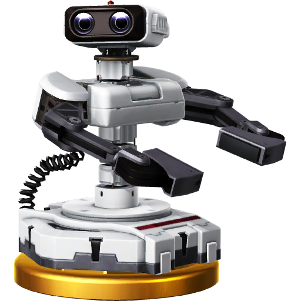</a>   </th>
    <th><b>R.O.B.</b></th>
    <th>This NES accessory was released in 1985, a groundbreaking system that controlled the robot via a game on the screen. In Smash Bros., R.O.B. has two projectile weapons and can use his rocket base to fly through the air. If you let his Robo Beam charge over time, it'll make for a powerful blast.</th>
  </tr>
  <tr>
    <th></th>
    <th><b>R.O.B. (Alt.)</b></th>
    <th>R.O.B.'s side smash, S3, fires a laser beam that does more damage up close. You can also aim it slightly up or down before firing. His down special Gyro sends a spinning top hurtling forward and can be charged for more damage. You can even dodge while charging!</th>
  </tr>
  <tr>
    <th></th>
    <th><b>Super Diffusion Beam</b></th>
    <th>For R.O.B.'s Final Smash, he folds his arms down, transforms into an invincible cannon, and fires a huge beam that can be panned slowly up and down. The beam splits up partway through into smaller beams that drags foes to the center, where they'll be hit continuously. The assault finishes off with a single wide beam just for good measure.</th>
  </tr>
</table>



<table class="fixed" border="1">
    <col width="150px" />
    <col width="100px" />
    <col width="600px" />
  <tr>
    <th><a href="Amy.png" >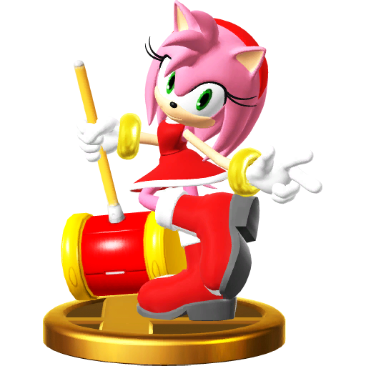</a></th>
    <th><b>Amy</b></th>
    <th>Amy has two favorite things in this world: Sonic...and soft-serve ice cream. She might not seem tough–what with her love of ice cream and addiction to fortune-telling–but don't be taken in! The business end of her Piko Piko Hammer will give anyone who underestimates her a massive headache.</th>
  </tr>
  <tr>
    <th><a href="Blaze.png" >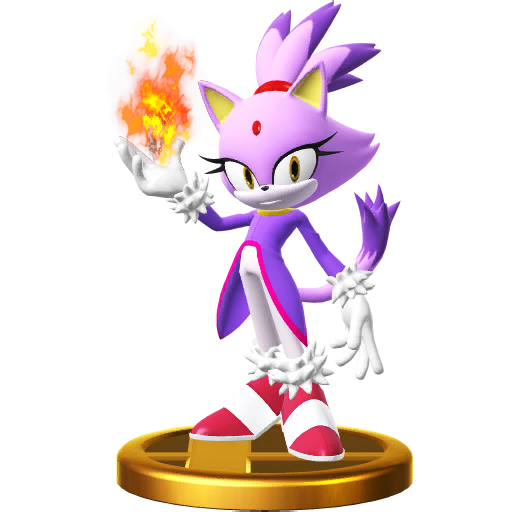</a></th>
    <th><b>Blaze</b></th>
    <th>A princess charged with guarding the Sol Emeralds, Blaze comes from another dimension. She used to be a bit of a withdrawn loner–it wasn't until she met Sonic and co. that she really opened up. She can brandish fire at will, and she can use the Sol Emeralds to change into Burning Blaze.</th>
  </tr>
  <tr>
    <th><a href="Chao.png" >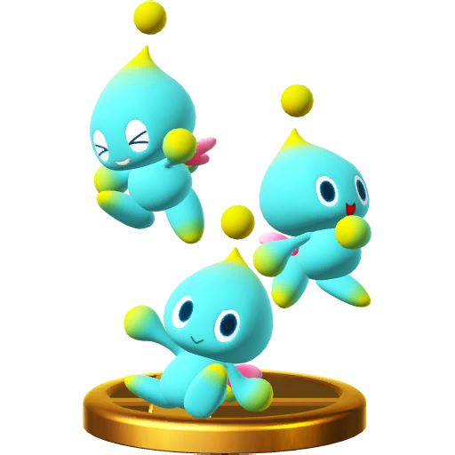</a></th>
    <th><b>Chao</b></th>
    <th>How can you resist the cute charm of these little guys? Don't you just want to hold them tight and protect them from the dangers of the world? Well, they'd like that too. Since ancient times, if they can't find a safe place to live, they find someone to look after them.</th>
  </tr>
  <tr>
    <th></th>
    <th><b>Cream & Cheese</b></th>
    <th>Sidekick to Amy Rose, Cream the Rabbit is a cute, hardworking friend. She has a Chao named Cheese, and they make a great team. She probably wants to cream the next person who makes a joke about their names, but I can't help but want a cream-cheese bagel when I talk about them...</th>
  </tr>
  <tr>
    <th></th>
    <th><b>Dr. Eggman</b></th>
    <th>Dr. Eggman knows a great deal about robots, which is neat. He also knows how to turn animals INTO robots, which isn't so neat. You'd think a man with an IQ of 300 would stop going up against Sonic, but he keeps on trying, all to build a world around his Eggman Empire.</th>
  </tr>
  <tr>
    <th></th>
    <th><b>Fauna of Windy Hill Zone</b></th>
    <th>Windy Hill, a plain on the floating Lost Hex continent, is the first area in Sonic Lost World. It has giant windmills and mysterious caves and is home to a wide variety of animals...that Dr. Eggman has gone and used as a power source for his robot collection. Typical... Just destroy the robots and set those animals free!</th>
  </tr>
  <tr>
    <th><a href="Jet.png" >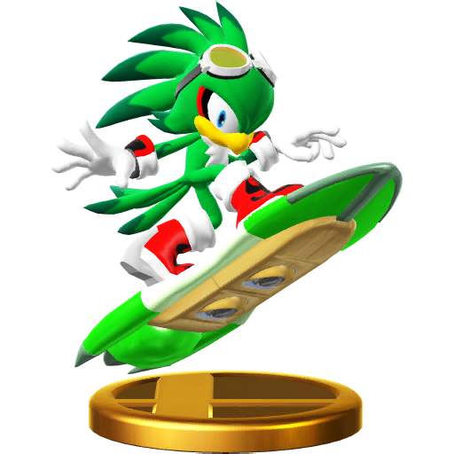</a></th>
    <th><b>Jet</b></th>
    <th>Jet the Hawk, a.k.a. the Legendary Wind Master, has a lot of cool stuff going for him besides his name. He's amazing on his Extreme Gear, a flying skateboard. Unfortunately, he's no hero–he leads thieves called the Babylon Rogues, and he can't stand losing to Sonic in anything.</th>
  </tr>
  <tr>
    <th><a href="Knuckles.png" >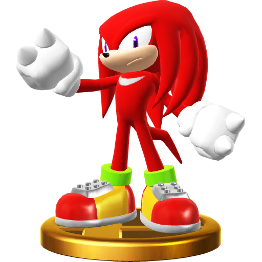</a></th>
    <th><b>Knuckles</b></th>
    <th>Knuckles the Echidna is the dedicated guardian of the Master Emerald, rarely leaving his post on the floating Angel Island. His serious, one-track-minded approach puts him at odds with his rival, Sonic, but the two somehow manage to be friends all the same.</th>
  </tr>
  <tr>
    <th><a href="Shadow.png" >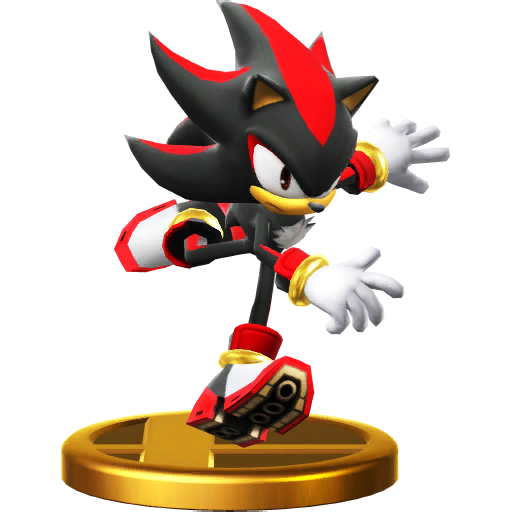</a></th>
    <th><b>Shadow</b></th>
    <th>Engineered to be the ultimate life-form by the brilliant Professor Gerald Robotnik, this black hedgehog appears very much like Sonic. He has a dark side, however. In Smash Bros., he uses Chaos Control to warp space-time, slowing every fighter down except the player who summoned him.</th>
  </tr>
  <tr>
    <th><a href="Silver.png" >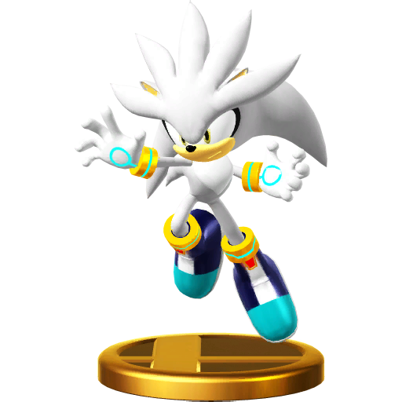</a></th>
    <th><b>Silver</b></th>
    <th>Silver the Hedgehog comes from the future–from a world that seems to have been laid to waste. He manipulated space-time to travel to the present where he meets Sonic and friends, and now he's putting his telekinetic talents to use in an effort to save the future world he calls home.</th>
  </tr>
  <tr>
    <th><a href="Sonic the Hedgehog.png" >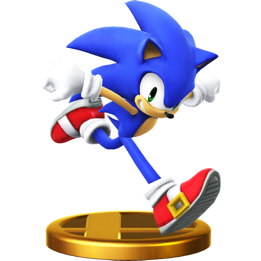</a></th>
    <th><b>Sonic the Hedgehog</b></th>
    <th>The star of the Sonic The Hedgehog series. He's an easygoing hedgehog who blows past the competition with his speed. Seriously, on the ground he's faster than anyone else in Smash Bros. Use this to your advantage, avoiding blows while landing lightning-fast attacks.</th>
  </tr>
  <tr>
    <th></th>
    <th><b>Sonic the Hedgehog (Alt.)</b></th>
    <th>Sonic's up special Spring Jump lets him reach great heights by jumping on a spring, becoming invincible for a moment. He can't use any other specials during the jump, but he can attack or dodge. This move's great for returning from a long launch. Other fighters can use the spring, though!</th>
  </tr>
  <tr>
    <th></th>
    <th><b>Super Sonic</b></th>
    <th>The Chaos Emeralds are said to hold enough power to control the whole world. It's that power that turns Sonic into Super Sonic. He turns a glorious golden color and can fly at nearly the speed of light. In his Final Smash, this high-speed flight damages anyone who gets in its way and can even launch them!</th>
  </tr>
  <tr>
    <th><a href="Tails.png" >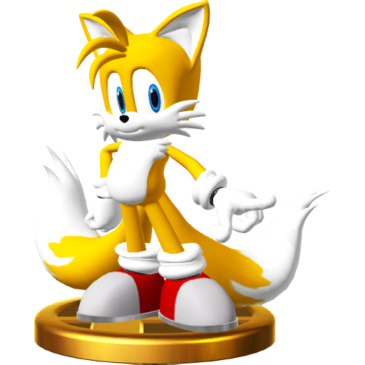</a></th>
    <th><b>Tails</b></th>
    <th>This gentle-hearted little fox used to get bullied because of his two tails. Then one day he saw Sonic on West Side Island and decided to join him on his adventures. Now he's an expert mechanic and a partner Sonic can really rely on–he's come a long way since his timid, quiet beginnings!</th>
  </tr>
  <tr>
    <th></th>
    <th><b>The Deadly Six</b></th>
    <th>The tough and intelligent red leader, Zavok! A feisty color to match her feisty personality, Zeena! A fan of the noms, Zomom! Sharp horns and a sharper tongue, Zazz! Brandishing both age and wisdom, Master Zik! And finally, the brooding spy, Zor! Give it up for the Deadly Six!</th>
  </tr>
</table>



<table class="fixed" border="1">
    <col width="150px" />
    <col width="100px" />
    <col width="600px" />
  <tr>
    <th></th>
    <th><b>Andrew Oikonny</b></th>
    <th>A former member of mercenary Wolf O'Donnell's commando unit, Star Wolf. As Andross's nephew, he's not shy about throwing his weight around despite being an inexperienced pilot. This chilled his relationship with the rest of the team, and eventually they gave him the boot.</th>
  </tr>
  <tr>
    <th><a href="Andross.png" >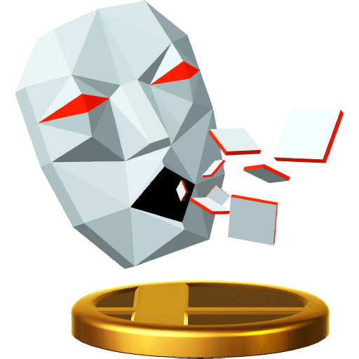</a></th>
    <th><b>Smart Bomb</b></th>
    <th>Attack or throw this bomb if you want to make a big impact on the battle. The explosion just grows and grows, and despite the "smart" name, this bomb will hurt the thrower too! Sometimes you may throw what turns out to be a dud, but don't go hitting it in anger—it'll still go off in your face!</th>
  </tr>
  <tr>
    <th></th>
    <th><b>Aparoid (Fortuna)</b></th>
    <th>The boss from the first mission in Star Fox: Assault. This aparoid shows up while Oikonny is singing his own praises, easily knocking Andross's nephew out of the sky. This same creature, its wings making it resemble a butterfly, apparently attacked a Cornerian fleet 17 years earlier.</th>
  </tr>
  <tr>
    <th></th>
    <th><b>Aparoid Queen</b></th>
    <th>The final boss of Star Fox: Assault. Aparoids are a race of alien life-forms with metallic and mechanical features, and the queen is the core that commands them all. In order to bring the universe and everything in it under control, she sends countless insectoid servants to invade the Lylat system.</th>
  </tr>
  <tr>
    <th></th>
    <th><b>Arwing (Assault)</b></th>
    <th>Star Fox's fighter crafts have the ability to regulate gravity, allowing them to adapt to all kinds of space environments, and have been tuned up to give them superb offensive performance. Mass-produced Arwings appear in Star Fox: Assault, but many get taken over by the invaders, forcing the Star Fox team to shoot them down.</th>
  </tr>
  <tr>
    <th><a href="Falco.png" >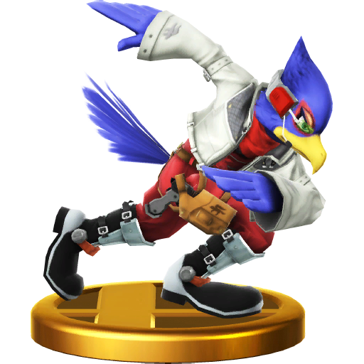</a></th>
    <th><b>Falco</b></th>
    <th>A talented pilot and part of the Star Fox team, Falco can be a bit rough around the edges. He once led his own galactic gang before joining up with Fox. In Smash Bros., his ability to jump high and deal damage in the air makes him a powerful threat, and his thrown Reflector can catch foes by surprise.</th>
  </tr>
  <tr>
    <th></th>
    <th><b>Falco (Alt.)</b></th>
    <th>Falco's Blaster looks identical to Fox's at first, but actually it's quite different! The beams Falco fires deal more damage and cause the victim to flinch, but at a slower rate of fire. Considering Falco's lineage, it's not all that surprising that he can fire faster while airborne.</th>
  </tr>
  <tr>
    <th></th>
    <th><b>Falco (Assault)</b></th>
    <th>Falco, the ace pilot on the Star Fox team, and Fox set out to deal with Oikonny's rebel army. However, they were shocked by something completely unexpected! Was it Oikonny's amazing, unmatched fighting prowess? Pfft! As if! They were surprised by a sudden attack by hive-minded alien invaders!</th>
  </tr>
  <tr>
    <th><a href="Fox.png" >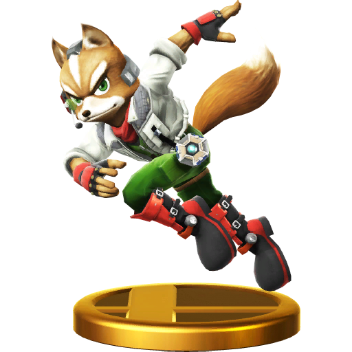</a></th>
    <th><b>Fox</b></th>
    <th>Fox McCloud is the leader of the mercenary flight team, Star Fox, often enlisted to defeat the evil Andross. His piloting skills are top notch, but in Smash Bros. his strength is sheer speed. His Reflector move allows him to turn projectile attacks against his foes, increasing their power for a punishing blow.</th>
  </tr>
  <tr>
    <th></th>
    <th><b>Fox (Alt.)</b></th>
    <th>Fox is at home in the air, and many of his moves, like his up smash, Flip Kick, will send foes up there. It's great for KO'ing a damaged opponent. Another handy move is his up special Fire Fox. The flames that surround Fox deal damage to nearby foes, and you can launch yourself in any direction once charged.</th>
  </tr>
  <tr>
    <th></th>
    <th><b>Fox (Assault)</b></th>
    <th>When Andrew Oikonny and the remnants of his uncle Andross's army use guerilla tactics to stage a rebellion, the Cornerian forces find themselves under a lot of pressure. Fox and his unit arrive to save the day, only to encounter an even greater threat. Can Fox handle the incoming assault from this mysterious new foe?</th>
  </tr>
  <tr>
    <th></th>
    <th><b>Great Fox (Assault)</b></th>
    <th>The Great Fox can be described as an assault carrier, or we should use any number of other jargon-heavy terms too complicated to list here (or remember). It's the Star Fox HQ and hold their Arwings, Landmasters, and more. Fox's father, James McCloud was the one who has built, and in Star Fox: Assault, it was fully renovated to give it a slick new look.</th>
  </tr>
  <tr>
    <th><a href="Krystal.png" >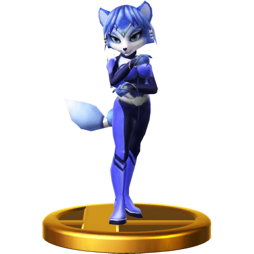</a></th>
    <th><b>Krystal</b></th>
    <th>As befitting her name, Krystal was once imprisoned in a giant crystal. After rescuing her, Fox welcomed her into the team, where her telepathic abilities proved invaluable. She and Fox also became romantically involved. Did her telepathic powers help or hinder that relationship?</th>
  </tr>
  <tr>
    <th></th>
    <th><b>Landmaster (Falco)</b></th>
    <th>Falco jumps aboard his Landmaster for his Final Smash, This powerful combat vehicle sports an explosive cannon and a heavily armored exterior. Falco can blast other fighters or simply drive into them with his tank. This Landmaster also flies higher than Fox's, letting Falco give his rivals a pick-me-up...off the stage!</th>
  </tr>
  <tr>
    <th></th>
    <th><b>Landmaster (Fox)</b></th>
    <th>Originally designed for exploration, the Landmaster in Fox's Final Smash has been converted into an ultra-high-performance, anti-air, rolling combat vehicle. When Fox hops aboard, he can drive or roll into foes and blast them with cannon fire. It can even fire in midair. And best of all, Fox is safe from damage inside this metal beast!</th>
  </tr>
  <tr>
    <th></th>
    <th><b>Leon Powalski</b></th>
    <th>Star Wolf's resident sniper. When he finds his mark, he takes them out with—what else?—his long chameleon tongue! ...OK, you got us; he uses a rifle. Maybe. We haven't watched him do it. Anyway, he's a merciless foe you don't want to cross, but if he's with you, he'll never let you down. He's Wolf's most trusted ally.</th>
  </tr>
  <tr>
    <th></th>
    <th><b>Orbital Gate</b></th>
    <th>The site of a battle in Star Fox: Assault. After locating the enemy homeworld, the Star Fox team was standing by at the Orbital Gate to begin the final attack, but the Aparoids suddenly mounted an offensive of their own! In the Smash Bros. stage, you fight atop the Arwings and enemy missiles as they battle it out.</th>
  </tr>
  <tr>
    <th></th>
    <th><b>Panther Caroso</b></th>
    <th>This Star Wolf pilot's flying skills are as stunning as you'd expect, but the cheesy lines are what you'll really remember. He's constantly flirting with women, and the rose he holds adds an extra touch of swagger. His feelings for Krystal seem genuine, but who knows where that will lead.</th>
  </tr>
  <tr>
    <th></th>
    <th><b>Peppy Hare</b></th>
    <th>A former army officer who's since become a navigator. The instructions he transmits to Fox and co. have proven invaluable time and again. Peppy was part of the team when it was led by Fox's late father, James, and Peppy supported Fox when he took over leadership of Star Fox. Perhaps he knew this was James's last wish.</th>
  </tr>
  <tr>
    <th></th>
    <th><b>Pigma Dengar</b></th>
    <th>Pigma is many things. He's a traitor who betrayed Star Fox and then convinced Wolf to form his own mercenary team, Star Wolf. He's greedy and cowardly, and eventually Wolf kicked him out of the team. He's also got some good traits, though! Like...um... How about...? No, that isn't...</th>
  </tr>
  <tr>
    <th></th>
    <th><b>Slippy Toad</b></th>
    <th>This mechanic is a valued team member, analyzing enemy shields and spotting mines. That might seem like a job for a calm, cool soldier, but Slippy's more of the frantic, panicky type. This behavior only annoys the Star Wolf team...right? He and Fox are old classmates and good friends.</th>
  </tr>
  <tr>
    <th></th>
    <th><b>Smart Bomb</b></th>
    <th>Attack or throw this bomb if you want to make a big impact on the battle. The explosion just grows and grows, and despite the "smart" name, this bomb will hurt the thrower too! Sometimes you may throw what turns out to be a dud, but don't go hitting it in anger—it'll still go off in your face!</th>
  </tr>
  <tr>
    <th><a href="Tricky.png" >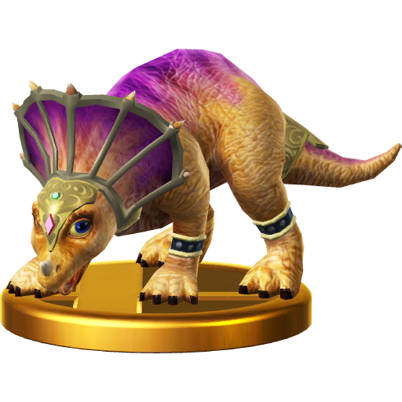</a></th>
    <th><b>Tricky</b></th>
    <th>When General Scales removes the four SpellStones from their rightful place, Dinosaur Planet literally starts falling apart. Fox goes to investigate, and rescues Tricky, the planet's reigning prince, from the SharpClaw Tribe. Together they go on a quest to restore Dinosaur Planet to its former state.</th>
  </tr>
  <tr>
    <th></th>
    <th><b>Wolfen (Assault)</b></th>
    <th>These all-range fighters are Star Wolf's pride and joy. They're considered to be on the same level as Star Fox's Arwings-maybe even better because of having two pairs of Gravity Blades. In Star Fox: Assault, you can actually earn a chance to fly a Wolfen yourself. Why not try out and see which is better?</th>
  </tr>
  <tr>
    <th></th>
    <th><b>Wolf O'Donnell</b></th>
    <th>Wolf used to fight in Andross's army, tangling with Star Fox in battle after battle. After Andross's exile, he went his own way and formed a mercenary team called Star Wolf. He and his eternal rival, Fox, have even fought on the same side from time to time...but inevitably, they always meet again as enemies.</th>
  </tr>
</table>



<table class="fixed" border="1">
    <col width="150px" />
    <col width="100px" />
    <col width="600px" />
  <tr>
    <th></th>
    <th><b>Ryu</b></th>
    <th>Ryu visits from the Street Fighter series! Ryu’s fighting style is based on karate, but he’s mixed in some other martial arts to make his own unique style. In Smash, he will perform either weak or strong attacks depending on if you press or hold down the buttons. His special attacks also have three power levels!</th>
  </tr>
  <tr>
    <th></th>
    <th><b>Ryu (Alt.)</b></th>
    <th>Ryu’s Focus Attack move lets him withstand a blow and then counterattack.The longer you hold it, the longer your enemies will be stunned if you hit them. If it hits a standing enemy, the enemy will become defenseless. When that happens, cancel your Focus Attack and unleash a sick combo!</th>
  </tr>
  <tr>
    <th></th>
    <th><b>Shin Shoryuken / Shinku Hadoken</b></th>
    <th>Use this attack when Ryu is far away from an enemy to unleash a Shinku Hadoken that penetrates through the stage. But if you use it when Ryu is close to an enemy, he’ll unleash a Shin Shoryuken uppercut attack. When it hits, Ryu will follow up with his other fist and launch the opponent up, up, and away!</th>
  </tr>
  <tr>
    <th><a href="Ken.png" >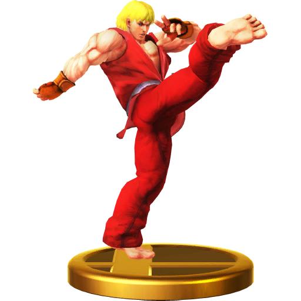</a></th>
    <th><b>Ken</b></th>
    <th>Ken has been Ryu’s number-one rival and best friend since they trained together as children under the same master. In fact, the headband Ryu wears was a gift from Ken! Along with being a very talented martial artist, Ken is also heir to his rich father’s Masters Foundation. But sorry, would-be suitors, Ken’s married and has a son!</th>
  </tr>
</table>



<table class="fixed" border="1">
    <col width="150px" />
    <col width="100px" />
    <col width="600px" />
  <tr>
    <th></th>
    <th><b>? Block</b></th>
    <th>How many times do you think you and Mario have punched ? Blocks? What if we added up the numbers for the entire world? If you were walking down the street and suddenly found a ? Block just floating there, would you jump up and punch it like Mario?</th>
  </tr>
  <tr>
    <th></th>
    <th><b>1-Up Mushroom</b></th>
    <th>Eating one of these mushrooms will add another you. "1-Up." Even just saying it aloud feels so right. "Was getting more 1-Ups and increasing the number of us the adventure's ultimate objective?" All the Marios got together and discussed this theory. The end.</th>
  </tr>
  <tr>
    <th></th>
    <th><b>Baby Daisy</b></th>
    <th>This cute toddler made her first appearance in Mario Kart Wii. If she looks familiar, that's because she's a baby version of Princess Daisy! Look at the determination in those baby eyes-even at such a young age, she was full of drive! Orange was her favorite color at that age too. Even her pacifier is orange!</th>
  </tr>
  <tr>
    <th></th>
    <th><b>Baby Luigi</b></th>
    <th>Despite missing the trademark mustache, the big nose and the L on his cap should be dead giveaways that this is Luigi! When he appeared in Mario Kart: Double Dash!!, Baby Luigi surprised the other racers with his Rattle Buggy driving skills. Adult Luigi probably still remembers those days of racing glory.</th>
  </tr>
  <tr>
    <th></th>
    <th><b>Baby Luma</b></th>
    <th>Once every hundred Years, stardust will rain down upon the land. Of course, this is a perfect time for Peach to get kidnapped. In order to save her, Mario sets off across the galaxies with the aid of a lost, little star child. Named Little Luma, this star child uses its star powers to help Mario.</th>
  </tr>
  <tr>
    <th></th>
    <th><b>Banana Peel</b></th>
    <th>Looks like someone had a nice snack and didn't bother to clean up afterward... As you may suspect, stepping on a banana peel sends you falling to the ground and exposes you to attacks. You can throw these at your opponents too, but please clean up when you're done, all right?</th>
  </tr>
  <tr>
    <th></th>
    <th><b>Banzai Bill</b></th>
    <th>This giant bullety menace from the Mario series might look tough, but one jump is typically all it takes to deal with it! In Smash Tour, a Banzai Bill will sometimes charge into a space and explode, destroying any items there. Players caught in the blast will be launched to another space.</th>
  </tr>
  <tr>
    <th></th>
    <th><b>Bee Mario</b></th>
    <th>Do you hear that buzzing? Whatever could it...bee? Bee Mario! Finding a Bee Mushroom allows Mario to buzz around in the air, land on flowers, and stick to walls covered in honey. Oh, this is the bee's knees! However, Bee Mario can't sting his foes. But that's fine--you don't really want to be that kind of bee, do you?</th>
  </tr>
  <tr>
    <th></th>
    <th><b>Big Goomba</b></th>
    <th>These giant-sized Goombas make quite an impression. Some will net you a coin when you jump on them, and others will split up into smaller Goombas. They're often much stronger than normal Goombas, but jumping on them a few times usually does the trick. There's also an even bigger one out there: the Megasparkle Goomba. So shiny!</th>
  </tr>
  <tr>
    <th></th>
    <th><b>Big Urchin</b></th>
    <th>Many fancy restaurants serve sea urchins as a delicacy, but they're more of an obstacle in Mario's world. And the friendly looking Big Urchins have the sharpest spikes! They're also, you know, huge. They probably have to be careful not to poke each other while they wait for Mario.</th>
  </tr>
  <tr>
    <th><a href="Birdo.png" >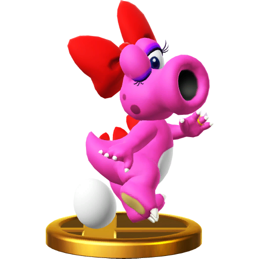</a></th>
    <th><b>Birdo</b></th>
    <th>Birdo's debut wasn't in a Mario game at all but in a game called Doki Doki Panic. Originally released in Japan, a version of that game made it to the West under a different name. Mario and friends replaced the main characters, and the game was called Super Mario Bros. 2. That's how Birdo joined the Mario Bros. family!</th>
  </tr>
  <tr>
    <th><a href="Bob-omb.png" >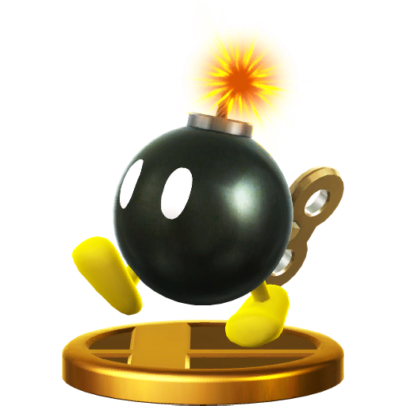</a></th>
    <th><b>Bob-omb</b></th>
    <th>This enemy lacks any kind of subtlety— a fuse on its head, a slowly turning key in the back, and two short legs to carry its little bomb body. You can figure out what happens next. When a Bob-omb starts flashing, you better start running!</th>
  </tr>
  <tr>
    <th><a href="Boo.png" >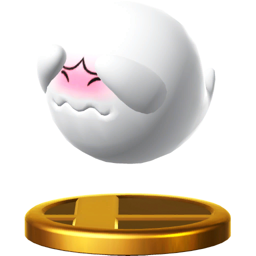</a></th>
    <th><b>Boo</b></th>
    <th>Don't look so surprised—even some ghosts are shy! It's like a game of Red Light Green Light: your face means stop, and the back of your head means go. So be very careful if you turn your back. Boo also shows up in the Mario Kart series, making your kart invisible to other racers.</th>
  </tr>
  <tr>
    <th></th>
    <th><b>Boo Mario</b></th>
    <th>Are you afraid of ghosts? Maybe it will help to see the world as they do. Become Boo Mario with a Boo Mushroom, and then explore their world! Shake your Wii Remote to make Boo Mario go through walls. Boo Mario blends in OK, but even as a ghost he keeps his trademark hat. The other Boos don't seem to mind, thankfully.</th>
  </tr>
  <tr>
    <th><a href="Boomerang.png" >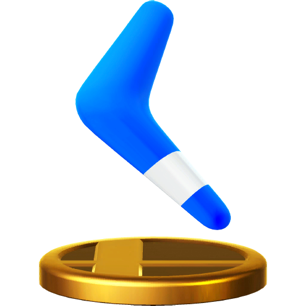</a></th>
    <th><b>Boomerang</b></th>
    <th>Boomerang Mario would use this item to collect faraway items and defeat distant enemies. In Smash Bros., it can be thrown up, down, left, or right. If you throw it, you can catch it again on the return trip. The boomerang gains power with each throw, so try to keep catching it!</th>
  </tr>
  <tr>
    <th><a href="Bowser.png" >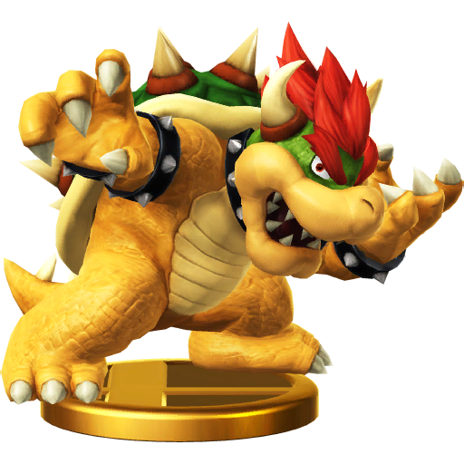</a></th>
    <th><b>Bowser</b></th>
    <th>Mario's archnemesis and the reason Peach spends more time in "another castle" than in her own. His plans almost never work out, and occasionally he even finds himself on Mario's side. In Smash Bros., he's a serious heavyweight who laughs off weaker attacks. Hit him hard to send him flying!</th>
  </tr>
  <tr>
    <th></th>
    <th><b>Bowser (Alt.)</b></th>
    <th>Bowser makes good use of his heavy physique with his down special Bowser Bomb, slamming down with his backside. If he's on the ground, he'll jump into the air before crashing down. Also, he can gain a bit of altitude if you press the special button repeatedly while executing his up special Whirling Fortress.</th>
  </tr>
  <tr>
    <th></th>
    <th><b>Bowser + Flame Runner</b></th>
    <th>Now THIS is a monster of a bike! It was obviously designed with Bowser in mind, since they both weigh a ton and both have trouble accelerating. Once you get up to top speed, though, these two really come into their own! Incidentally, Bowser is known as Koopa in Japan, but the Japanese name for this bike is Super Bowser. How rare.</th>
  </tr>
  <tr>
    <th></th>
    <th><b>Bowser Jr.</b></th>
    <th>Bowser's beloved, spoiled son sports a bandanna with a large mouth drawn on it. Like his father, Bowser Jr. longs to take Mario down. In Smash Bros., he'll fight from inside his heavily armed Junior Clown Car. The Clown Car takes less damage than Bowser Jr., so mind your positioning.</th>
  </tr>
  <tr>
    <th></th>
    <th><b>Bowser Jr. (Alt.)</b></th>
    <th>The Clown Kart Dash special move turns the Junior Clown Car into a kart. If you change direction while driving it, it'll spin and do more damage. When you use his up special, Bowser Jr. leaps from his Junior Clown Car, dropping it on the foes below.</th>
  </tr>
  <tr>
    <th></th>
    <th><b>Bullet Bill</b></th>
    <th>When you try to throw this item, you'll instead transform into a Bullet Bill and fly in the direction you were throwing. Anyone in your path will be knocked away. Be careful, though, since you fly fast and can barely steer—not to mention that foes can deflect you. KO them, not yourself!</th>
  </tr>
  <tr>
    <th></th>
    <th><b>Chain Chomp</b></th>
    <th>This beast frequently appears in the Super Mario series, and it is definitely equal parts bark and bite. No surprise it's often chained to something. In Smash Bros., it's connected to a stump in the ground and will lash out at anyone who gets close. Don't even bother trying to teach it manners.</th>
  </tr>
  <tr>
    <th></th>
    <th><b>Cloud Mario</b></th>
    <th>Guess what happens when Mario collects a Cloud Flower! Oh, wait. You can already see exactly what happens... That's right, Mario dons a fluffy hat, overalls, and a scarf and gets a whole lot lighter. He can jump farther, stay in the air longer, walk on clouds, and even make cloud platforms. This outfit is all silver lining!</th>
  </tr>
  <tr>
    <th></th>
    <th><b>Count Bleck</b></th>
    <th>Peach has been kidnapped by Bowser so many times, it seemed like a good idea to mix things up--instead she gets kidnapped by this guy, Count Bleck! He then obtains the Chaos Heart by forcing Peach and Bowser to marry. All of this was predicted by the Dark Prognosticus, which Count Bleck carries with him.</th>
  </tr>
  <tr>
    <th><a href="Daisy.png" >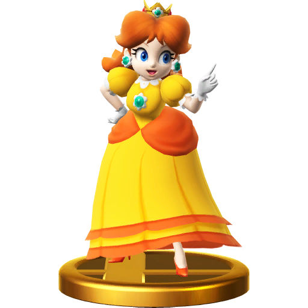</a></th>
    <th><b>Daisy</b></th>
    <th>She may be the princess of Sarasaland, but she doesn't exactly have the poise you might expect from royalty. Daisy is more of a headstrong, active type. That's all part of her charm, though, and rumor has it Luigi is quite smitten with her. Unlike Peach, she's only really been kidnapped once - in Super Mario Land.</th>
  </tr>
  <tr>
    <th></th>
    <th><b>Daisy (Baseball)</b></th>
    <th>The captain of the Daisy Flowers, Daisy is great both when at bat and when defending. Her fastballs especially are a thing to be feared. Her Star Swing, Flower Swing, will cause a garden to bloom where the ball lands. Fielders will have to wait for the flowers to clear away. What a pretty delay of the game!</th>
  </tr>
  <tr>
    <th></th>
    <th><b>Doctor Finale</b></th>
    <th>In Dr. Mario's Final Smash, he spreads his arms wide and then lets loose a pair of giant vitamin capsules that spiral through the air, taking out any pesky "viruses" in their path. The wide range makes it tough for foes to avoid, and opponents they strike will take multiple hits, possibly even being pushed right off the screen!</th>
  </tr>
  <tr>
    <th></th>
    <th><b>Dr. Mario</b></th>
    <th>In the 1990 puzzle game Dr. Mario, Mario threw on a white coat and decided to take a shot at that whole "medicine" thing. In this game, he's a balanced fighter who can throw Megavitamin capsules and nimbly deflect blows with his Super Sheet. He's not quite as quick as normal Mario, but his attacks deal a bit more damage.</th>
  </tr>
  <tr>
    <th></th>
    <th><b>Dr. Mario (Alt.)</b></th>
    <th>Mario and Dr. Mario are only slightly different. Basically, Dr. Mario is stronger, but his MD slows his speed and lowers his jump. He also has a move Mario doesn't: Dr. Tornado, a down special that can trap opponents before launching them. You can move left and right while doing it and press the button repeatedly to rise into the air.</th>
  </tr>
  <tr>
    <th></th>
    <th><b>Fighter Fly</b></th>
    <th>An enemy from the original Mario Bros. Just as the name implies, they are flies that gracefully move across the stage. They jump to move around, so hit them from below when they land. Unlike other enemies, these pests get faster after recovering from being flipped, rather than when only one is left. Be careful!</th>
  </tr>
  <tr>
    <th></th>
    <th><b>Fire Bar</b></th>
    <th>A rotating row of fireballs found in the Mario series, most often as a fiery obstacle in Bowser's Castle. In this game, you can swing the fire bar at your enemies! It's a powerful weapon, but as you hit people with it, the fireballs go out, one at a time. And no fire means no fun.</th>
  </tr>
  <tr>
    <th></th>
    <th><b>Fire Flower</b></th>
    <th>This Fire Flower won't transform you like in the Mario series, but it will still let you unleash some fiery damage! Holding down the attack button lets you spew fire at your opponents, dealing constant damage to them. You can also throw it at them, but it just doesn't look as cool that way.</th>
  </tr>
  <tr>
    <th></th>
    <th><b>Flint Cragley</b></th>
    <th>Who would use "Cragley Ho!" as a catchphrase, you say? Flint Cragley, of course! He comes from an advanced Stone Age civilization called the Land of the Cragnons. There they broadcast a program, "Flint Cragley's Cragtrotter," which stars Flint Cragley, is directed by Flint Cragley, and was made possible by producer...Flint Cragley.</th>
  </tr>
  <tr>
    <th><a href="F.L.U.D.D..png" >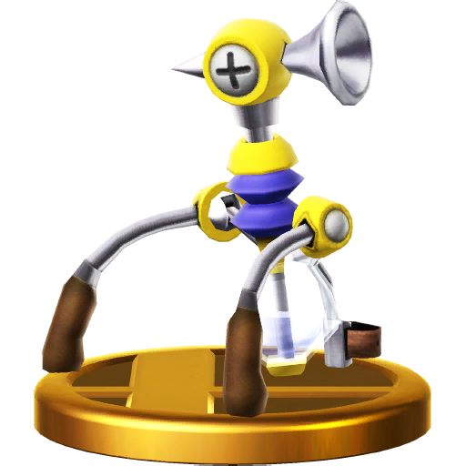</a></th>
    <th><b>F.L.U.D.D.</b></th>
    <th>When Mario straps this fine accessory to his back, he takes to it like a fish to water! He can use F.L.U.D.D.'s high-powered water jets to blast himself high into the air or do a high-speed dash... Oh yeah, and he can defeat enemies and wash away graffiti. The built-in tutorial function makes anyone a pro F.L.U.D.D. user in just minutes!</th>
  </tr>
  <tr>
    <th></th>
    <th><b>Flying Squirrel Mario</b></th>
    <th>When Mario grabs a Super Acorn, he turns into Flying Squirrel Mario! Like a real flying squirrel, he can hold out his arms and glide through the air. That must feel really, really awesome! This power isn't just for fun, though—it has practical uses, too, like helping him grab the coins in midair. Da-ding! Da-ding! Da-ding!</th>
  </tr>
  <tr>
    <th><a href="Fracktail.png" >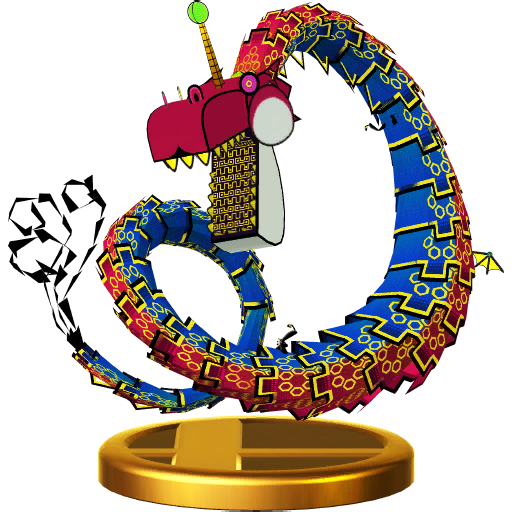</a></th>
    <th><b>Fracktail</b></th>
    <th>A guardian robot created by an ancient civilization. Realizing that Mario is the hero foretold in the prophecy, he tries to hand over the Pure Heart gracefully... until Dimentio casts a spell through the antenna on his head that sends his programming berserk. That's right--the antenna is Fracktail's weak point!</th>
  </tr>
  <tr>
    <th><a href="Freezie.png" >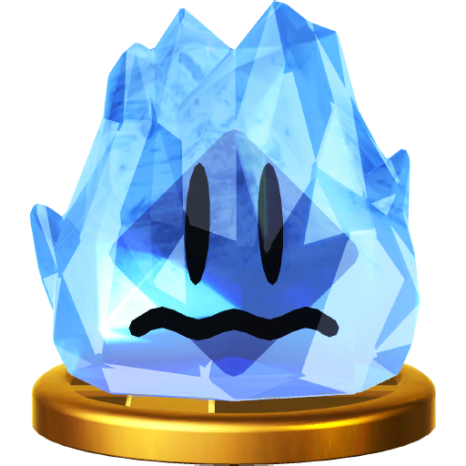</a></th>
    <th><b>Freezie</b></th>
    <th>Use this item to make a game of freeze tag chillingly literal. Once thrown, the first character to touch the Freezie will be frozen solid, turning into an easy target for a beating. If you happen to be on the receiving end, it's time to try and move around quickly to warm yourself up!</th>
  </tr>
  <tr>
    <th></th>
    <th><b>Funky Kong + Offroader</b></th>
    <th>You may wonder why this kart is called the Offroader when its off-road ability is so average. But a true off-roader is a kart that can take on the world and survive--and this kart fits that description to a tee. It handles like a king, and if other karts try to ram into it, they'll be the ones crying. It has just one big weakness...drifting.</th>
  </tr>
  <tr>
    <th><a href="Ghosts.png" >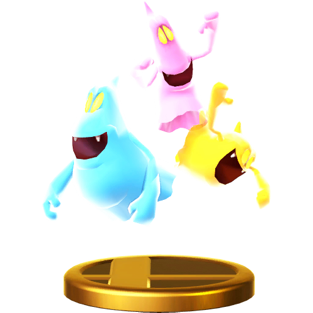</a></th>
    <th><b>Ghosts</b></th>
    <th>These mischievous ghosts haunt an old, old mansion. Suck them all up with your Poltergust 3000, but watch out for their attacks while you do! The gold ones' short punches might not be too hard to dodge, but the pink ones have much greater reach. The blue ones will smack the floor to hit you with shock waves!</th>
  </tr>
  <tr>
    <th></th>
    <th><b>Giga Bowser</b></th>
    <th>Prepare to behold Bowser in all his Koopa glory. This fearsome form first appeared all the way back in Melee. While transformed, Bowser deals extra damage, is better at launching foes, and even gains special effects on some of his attacks. He won't flinch and can't be thrown, but he does still take damage.</th>
  </tr>
  <tr>
    <th></th>
    <th><b>Golden Hammer</b></th>
    <th>This special hammer is several times stronger than the regular hammer. While wielding it, jumping repeatedly will let you float in the air. It doesn't appear often, so grab it when it does! However, watch out for the squeaky version. It looks like the normal one but is really useless.</th>
  </tr>
  <tr>
    <th><a href="Goomba.png" >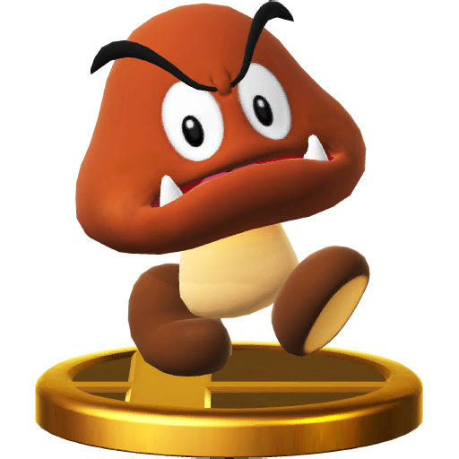</a></th>
    <th><b>Goomba</b></th>
    <th>The Goombas' grumpy little faces aren't scaring anyone. In fact, if Mario found himself in front of a sea of Goombas, he'd just get right to stomping! They were once loyal to the Mushroom Kingdom, but they turned traitor when Bowser invaded. One jump's usually enough to take them out. Foes don't come much weaker than this!</th>
  </tr>
  <tr>
    <th><a href="Goombella.png" >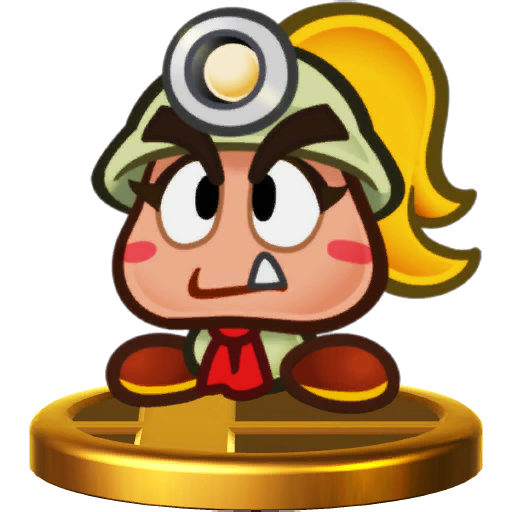</a></th>
    <th><b>Goombella</b></th>
    <th>Goombella, an archaeology student at the University of Goom, is significantly smarter (and sassier) than your average Goomba. In Paper Mario: The Thousand-Year Door, she'll gladly give Mario a bit of background info about pretty much anything they come across. She's the perfect guide...when she's not being startled by monsters and spiders.</th>
  </tr>
  <tr>
    <th><a href="Grass.png" >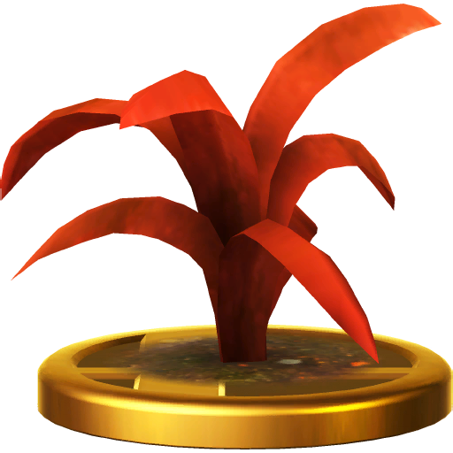</a></th>
    <th><b>Grass</b></th>
    <th>This special grass first appeared in Super Mario Bros. 2, where plucking it revealed hidden items. It works exactly the same way in Smash Bros.—if you pluck the grass, maybe you'll find a game-changing object! If only cleaning an unkempt lawn would reveal such neat things...</th>
  </tr>
  <tr>
    <th></th>
    <th><b>Green Shell</b></th>
    <th>The green shell of the Koopa Troopas. The launching power of this weapon is incredible in the right hands, but you should be careful; if it hits a wall, it may bounce back toward whoever threw it. If you see it coming back at you, just jump on it to stop it. It's like playing Super Mario Bros.!</th>
  </tr>
  <tr>
    <th></th>
    <th><b>Hammer Bro</b></th>
    <th>These elite trooper turtles usually appeared in pairs in Super Mario Bros., wearing helmets and chucking hammers at Mario. When summoned, they'll advance on the nearest opponent and lob hammers in a graceful arc. Sometimes they'll throw in a jump to mix things up.</th>
  </tr>
  <tr>
    <th><a href="Hothead.png" >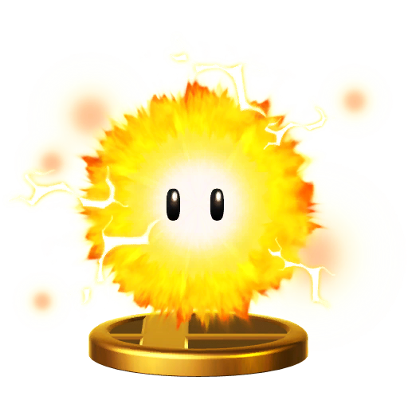</a></th>
    <th><b>Hothead</b></th>
    <th>Once thrown, this guy will move across the ground and damage anything—except you—in its path. You can make the Hothead bigger by hitting it with attacks, much to your opponents' dismay. If you make it really big and powerful, it may just carry you to victory!</th>
  </tr>
  <tr>
    <th><a href="Iggy.png" >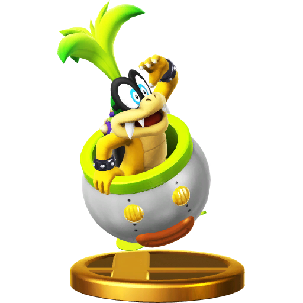</a></th>
    <th><b>Iggy</b></th>
    <th>One of the Koopalings. Iggy wears black-rimmed glasses, has hair that's sort of pineapplish, and is known for being a bit of a prankster. He talks in a cutesy way but laughs like a maniac. Also, he seems to like taming Chain Chomps, and in New Super Mario Bros. 2, he gets a rampaging Chain Chomp to help him take on Mario.</th>
  </tr>
  <tr>
    <th><a href="Kamek.png" >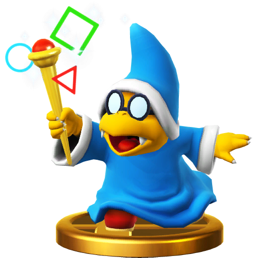</a></th>
    <th><b>Kamek</b></th>
    <th>This magical menace is one of Bowser's henchmen and shows his face in plenty of titles, even outside of the Mario series. In the Mushroom Kingdom U stage, he swoops onto the screen every so often to transform the stage with his magic. Now and then, though, he'll tease you by not casting any magic at all. He's a sly one, that Kamek.</th>
  </tr>
  <tr>
    <th></th>
    <th><b>Koopa Paratroopa</b></th>
    <th>These winged foes tend to fly right in front of high places Mario wants to reach, so it isn't all that surprising that he constantly uses them as stepping stones. Jumping on them knocks their wings off, turning them into regular Koopa Troopas. These guys are surprisingly adaptable: they play tennis and basketball, and they can even drive!</th>
  </tr>
  <tr>
    <th><a href="Koopa.png" >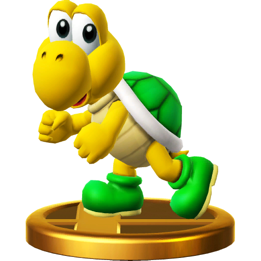</a></th>
    <th><b>Koopa Troopa</b></th>
    <th>These turtles are just as common as Goombas in Bowser's army. They may look meek, but they have the guts to leap off any cliff they come across. If you jump on one, its shell will be yours to kick or throw as you please. Many locations in Mario games are named after these enemies, such as Koopa Beach and Koopa Park.</th>
  </tr>
  <tr>
    <th></th>
    <th><b>Lakitu & Spinies</b></th>
    <th>Flying over the battlefield in a cloud, this member of Bowser's forces persistently chases after Mario. He takes a break from throwing Spiny Eggs to do some racing in Mario Kart 7. When summoned, he'll appear as a sprite and toss Spiny Eggs at those fighting below him.</th>
  </tr>
  <tr>
    <th><a href="Larry.png" >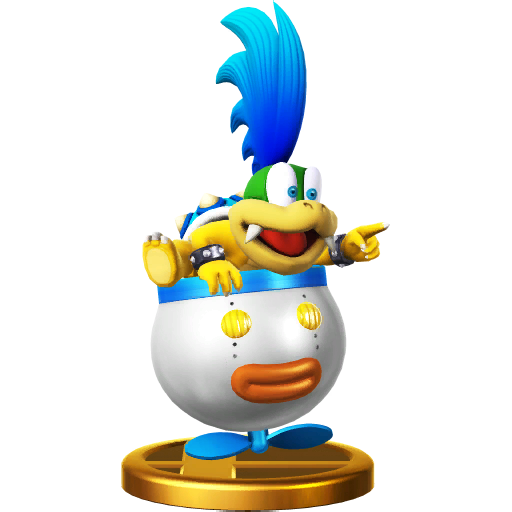</a></th>
    <th><b>Larry</b></th>
    <th>The youngest of the Koopalings, with a serious case of little-brother syndrome to match. He's easily recognized by his tall, blue hair. In New Super Mario Bros. Wii, he makes his appearance in World 1. You might think he's tough, with his blue fireballs and shell spins, but his patterns are actually pretty easy to read.</th>
  </tr>
  <tr>
    <th><a href="Lemmy.png" >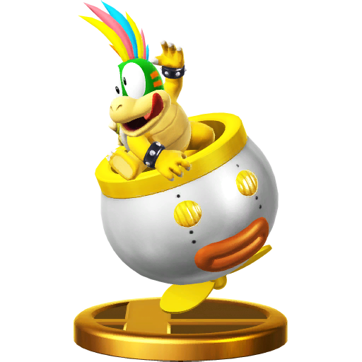</a></th>
    <th><b>Lemmy</b></th>
    <th>The smallest and nimblest of the Koopalings, Lemmy is a little rascal with a wacky, childlike look on his face. In New Super Mario Bros. U, he's the boss of World 1 and rides a giant ball while his colorful mohawk sways in the breeze. Don't underestimate him, though—his ball attacks are trickier than they look!</th>
  </tr>
  <tr>
    <th><a href="Lightning.png" >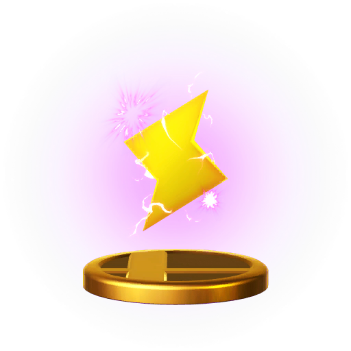</a></th>
    <th><b>Lightning</b></th>
    <th>If there is one thing I've learned from Mario Kart, it's that lightning can strike without a cloud in the sky. Picking this up will hit your foes with a character-shrinking blast of lightning, making them really easy to launch into the distance. If you get struck, you'd best run until the fight is fair again.</th>
  </tr>
  <tr>
    <th></th>
    <th><b>Li'l Oinks</b></th>
    <th>In Paper Mario, Mario stumbles across a farm in Toad Town where these little guys live a peaceful existence. In exchange for a few coins, you can get a Li'l Oink egg that will hatch into a random Li'l Oink. It could be silver or gold or have spots or tiger stripes... Just don't forget about the adventure you're on!</th>
  </tr>
  <tr>
    <th><a href="Lubba.png" >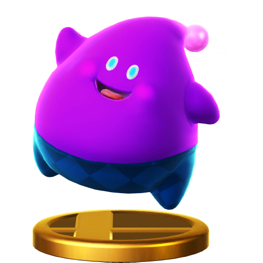</a></th>
    <th><b>Lubba</b></th>
    <th>This Luma offers Mario all kinds of spacefaring support aboard Starship Mario. And who better to do it? With his feet always floating a little bit off the ground, you know he's got his space legs! Lubba's cheerfully casual way with words makes him the perfect space buddy you didn't even know you needed.</th>
  </tr>
  <tr>
    <th><a href="Ludwig.png" >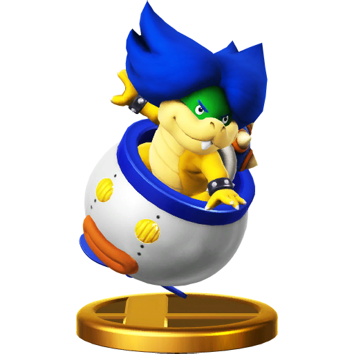</a></th>
    <th><b>Ludwig</b></th>
    <th>The cleverest of the Koopalings, easily recognized by his big tufts of hair. He's got a mature air about him, but he likes to show off and can sound a bit pompous. In New Super Mario Bros. Wii, he's the boss of World 7 and torments Mario by firing homing magic blasts and floating too high in the air to be jumped on.</th>
  </tr>
  <tr>
    <th><a href="Luigi.png" >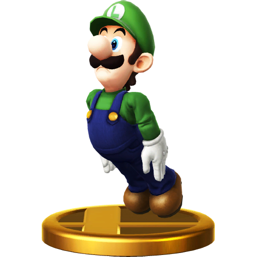</a></th>
    <th><b>Luigi</b></th>
    <th>Luigi recently celebrated his 30th anniversary with the Year of Luigi, but all that attention just made him even more shy and awkward. In Smash Bros. (as in life), Luigi tends to follow his brother's lead, but he adds his own flair to moves like Super Jump Punch. His taunts, however, are 100% Weegee.</th>
  </tr>
  <tr>
    <th></th>
    <th><b>Luigi (Alt.)</b></th>
    <th>Luigi may sulk when his down taunt is used, but his little dejected kick can actually hurt a nearby enemy fighter. It can even trigger a meteor smash! Notice an enemy leisurely hanging from the edge? Run over and pout on the edge—that foe will be the one with something to pout about!</th>
  </tr>
  <tr>
    <th><a href="Mario.png" >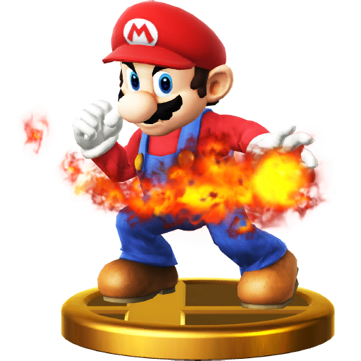</a></th>
    <th><b>Mario</b></th>
    <th>As iconic as iconic gets, this gaming celebrity is known for saving the world from Bowser. He's got amazing jumping skills and makes use of a wide range of transformations. In his free time, he plays too many sports to count. In Smash Bros., he's a well-rounded fighter you can rely on. Say it with me: "It's-a me, Mario!"</th>
  </tr>
  <tr>
    <th></th>
    <th><b>Mario + Standard Bike</b></th>
    <th>In Mario Kart Wii, bikes were the big, new thing. This Standard Bike M is, as you'd expect, a very standard bike--its speed, weight, acceleration, handling, off-road, drift, and mini-turbo stats are all decidedly middle of the road. This makes it a great choice for Mario Kart beginners or for series veterans trying out bikes for the first time.</th>
  </tr>
  <tr>
    <th></th>
    <th><b>Mario (Alt.)</b></th>
    <th>Super Jump Punch is an up-special move that lets you leap high into the air, carrying any fighters you strike along with you. You'll be invincible for a moment after you launch this attack. The default side-special move, Cape, will flip a fighter around, making it easy to send a foe who's trying to grab the edge of the stage to their doom!</th>
  </tr>
  <tr>
    <th></th>
    <th><b>Mario Finale</b></th>
    <th>Break the Smash Ball and unleash Mario's Final Smash. Mario will fire a devastating blast of fire in the direction he's facing. The attack covers a wide range and travels far, so it's best to fire this from one side of the stage to the other. The damage is impressive, and it can actually carry foes right off the screen!</th>
  </tr>
  <tr>
    <th></th>
    <th><b>Metal Box</b></th>
    <th>This green box will make you the ultimate defensive character, turning you into solid metal for a short time. You won't flinch from enemy attacks, even in midair, and it is much harder to launch you. On the other hand, you fall like a brick. Getting hit will reduce the duration of this item.</th>
  </tr>
  <tr>
    <th><a href="Mini-Yoshi.png" >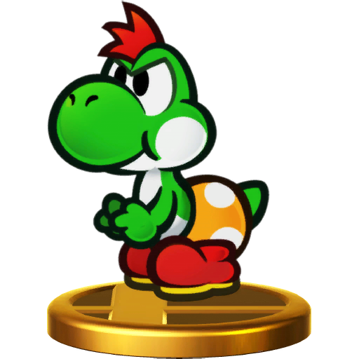</a></th>
    <th><b>Mini-Yoshi</b></th>
    <th>In Paper Mario: The Thousand-Year Door, this young Yoshi first appears as just an egg. After breaking out of his shell, though, the rascal's cheek and ultra-competitive nature run rampant. He's strong for a little lad and can even carry Mario, who he calls Gonzales. There's a funny reason for that, and it's--oh, we've run out of space. Sorry.</th>
  </tr>
  <tr>
    <th><a href="Morton.png" >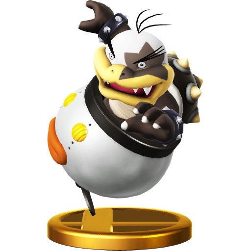</a></th>
    <th><b>Morton</b></th>
    <th>The biggest of the Koopalings. Morton stands out due to the three strands of hair on his head and...oh, the big star on his face. He's more brawn than brains, and in New Super Mario Bros. 2, he appears in World 4, where he'll stay glued to the spot until you attack him. Maybe he just can't be bothered to move!</th>
  </tr>
  <tr>
    <th></th>
    <th><b>Mr. L</b></th>
    <th>He calls himself the Green Thunder, but Mr. L's true identity is a mystery, forever concealed beneath his stylish green hat. With his incredible skill of jumping really high, he makes a valuable addition to Count Bleck's evil forces. Coincidentally, for the whole of Mr. L's reign of terror, Luigi is nowhere to be seen. How odd...</th>
  </tr>
  <tr>
    <th><a href="Nabbit.png" >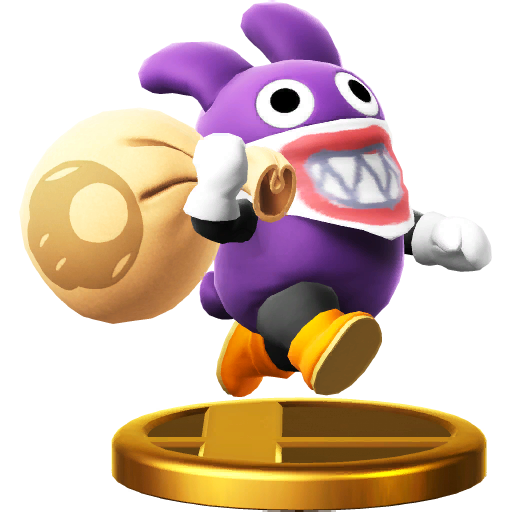</a></th>
    <th><b>Nabbit</b></th>
    <th>An underhanded little rascal who steals items from the Toad Houses and runs away with them. If you can catch him, Toad might repay you with a nice present. In New Super Luigi U, he even manages to nab a position as a playable character! From burglar to hero in the blink of an eye... Not bad work, all things considered.</th>
  </tr>
  <tr>
    <th><a href="Peach.png" >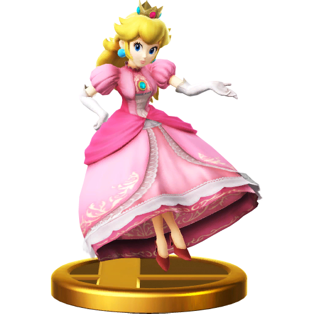</a></th>
    <th><b>Peach</b></th>
    <th>Princess of the Mushroom Kingdom, Peach continues to prove that "powerful" and "cute" are not mutually exclusive. In Smash Bros., Peach uses her dress to float above the fray, suddenly descending and attacking with numerous weapons. A frying pan? Umbrella? TOAD?! Where does she keep it all?</th>
  </tr>
  <tr>
    <th></th>
    <th><b>Peach (Baseball)</b></th>
    <th>The thought of yet another kidnapping is never far from Peach's mind, but in Mario Super Sluggers, she gets a nice break to just focus on the game. As the leader of the Peach Monarchs, she shows off her skills with her Star Swing, Heart Swing, drawing a heart in the air to distract the fielders.</th>
  </tr>
  <tr>
    <th></th>
    <th><b>Peach + Daytripper</b></th>
    <th>You may think it doesn't look like a racer. You may think it would look more at home on a carousel. But Peach will have the last laugh as she sails past the finish line, leaving you in the dust. The Daytripper's great handling lets it breeze through even the trickiest of courses--and what it lacks in speed, it makes up for in acceleration.</th>
  </tr>
  <tr>
    <th></th>
    <th><b>Peach (Alt.)</b></th>
    <th>Peach may be a princess, but that doesn't mean she shies away from an honest day's work. Her down special Vegetable is basically farm labor, and the fruits...er, vegetables of her work can be thrown. An angry-looking vegetable will do extra damage, too! She can also pull up Bob-ombs, or even a Mr. Saturn!</th>
  </tr>
  <tr>
    <th></th>
    <th><b>Peach Blossom</b></th>
    <th>Peach's Final Smash is quite a spectacle to behold. Giant illustrations of Peach herself frame the screen, giant peaches rain down, and all the other fighters fall asleep. The closer they are to Peach, the longer they'll stay snoozing, giving Peach plenty of time to send foes flying or to recover her health with the peaches.</th>
  </tr>
  <tr>
    <th><a href="Penguin Mario.png" >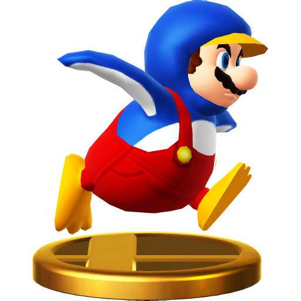</a></th>
    <th><b>Penguin Mario</b></th>
    <th>Ahh, the life of a penguin... So carefree. At last, Mario too can enjoy the feeling of gliding across the ice by donning the Penguin Suit. Not only that, but this suit unlocks other penguin abilities too! Mario can swim gracefully and, just like a penguin, dream of a day when he can fly.</th>
  </tr>
  <tr>
    <th><a href="Pipes.png" >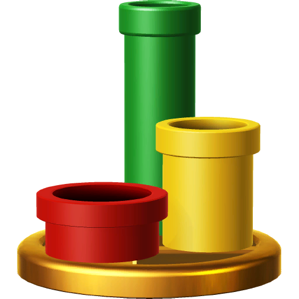</a></th>
    <th><b>Pipes</b></th>
    <th>Sometimes Piranha Plants live in them... That's right! I'm talking about those iconic green pipes. World 7 of Super Mario Bros. 3 was actually called Pipe Land. Jump over pipes! Run along pipes! Enter and exit pipes! ...I'm saying there are a lot of pipes.</th>
  </tr>
  <tr>
    <th></th>
    <th><b>Piranha Plant</b></th>
    <th>These guys aren't so much carnivorous as Mario...nivorous. Ahem. There are lots of varieties, like Frost, Wild Ptooie, Ghost, Prickly, Dino, Bone, Elasto-Piranhas, Stalking, Naval... A helpful mnemonic is "Fireballs with Ground Pounds defeat baddies, even super nasties."</th>
  </tr>
  <tr>
    <th></th>
    <th><b>Poison Mushroom</b></th>
    <th>Becoming giant and looming over your foes is pretty great, yeah? Well, that won't happen if you get this mushroom. It looks a lot like the Super Mushroom, but it's a slightly different color and its face is... unhappy. If you use this mushroom, you'll shrink down and be easy to send flying.</th>
  </tr>
  <tr>
    <th></th>
    <th><b>Poltergust 5000</b></th>
    <th>A ghost-sucking vacuum cleaner created by Professor E. Gadd. In Luigi's ghostly adventures, it's the only thing standing between him and complete terror. In this game, it sucks in enemies, damages them, and then fires them diagonally upward. If it's used in an area with no ceilings, you might send them soaring right off the screen!</th>
  </tr>
  <tr>
    <th></th>
    <th><b>POW Block</b></th>
    <th>This special block first appeared way back in Mario Bros. Hitting it will send enemies flying into the air. You can avoid the shock waves by shielding at the right time or jumping into the air. After being triggered three times, a POW Block will vanish into thin air—don't waste it!</th>
  </tr>
  <tr>
    <th></th>
    <th><b>Power Star</b></th>
    <th>In Rosalina's Final Smash, she summons a Power Star above her head. It launches fighters who touch it and also fires a barrage of smaller stars in all directions, all the while growing bigger and bigger. Even if Rosalina falls off the stage right after activating it, the Power Star will keep attacking her foes until it finally explodes.</th>
  </tr>
  <tr>
    <th></th>
    <th><b>Propeller Mario</b></th>
    <th>You can tell just by the sound that there's something different about the propeller on Mario's head. It must be because it's made of rubber! In any case, Propeller Mushrooms transform Mario into Propeller Mario. Shake the Wii Remote to send Mario zooming up into the air!</th>
  </tr>
  <tr>
    <th></th>
    <th><b>Rainbow Mario</b></th>
    <th>What would you get if you combined Mario with a bouncing, rainbow-colored star? An amazing, invincible Rainbow Mario, of course! Plus, Mario will glow with twinkling stars and have and an energetic song play for the duration. Doesn't that make you want to run out and grab a Rainbow Star right now?</th>
  </tr>
  <tr>
    <th></th>
    <th><b>Rock Mario</b></th>
    <th>If you're a fan of rock and roll, try picking up a Rock Mushroom. When Mario's transformed into Rock Mario, a simple shake of the Wii Remote can turn him into a big, rolling boulder, allowing him to plow through crystals and tough foes. The most amazing thing about Rock Mario, though, is that he can still jump.</th>
  </tr>
  <tr>
    <th></th>
    <th><b>Rosalina & Luma</b></th>
    <th>The mysterious Rosalina lives in the Comet Observatory with the Lumas. In Smash Bros., Rosalina and Luma can fight in different places at the same time. If you can trap someone between Rosalina and Luma, you'll be able to unleash incredible damage with their joined attacks!</th>
  </tr>
  <tr>
    <th></th>
    <th><b>Rosalina & Luma (Alt.)</b></th>
    <th>Rosalina can pull in items and projectiles around her with her Gravitational Pull move. Her up special Launch Star is a diagonal jump and, though harmless, it has exceptional range. You also have some control over Rosalina's trajectory when she uses it.</th>
  </tr>
  <tr>
    <th><a href="Roy.png" >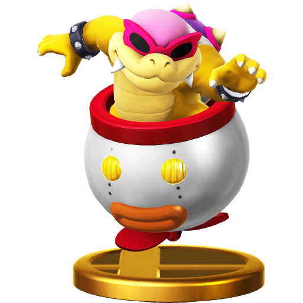</a></th>
    <th><b>Roy</b></th>
    <th>This heavy guy is one of the Koopalings and likes throwing his weight around. His pink sunglasses might not make him seem evil, but the speed he can go from slacker to soldier certainly does. In Super Mario Bros. 3, he causes earthquakes to stop Mario in his tracks, all while attacking with blasts of magic. Nasty stuff!</th>
  </tr>
  <tr>
    <th></th>
    <th><b>Shadow Mario Paint</b></th>
    <th>In Super Mario Sunshine, someone went around causing havoc disguised as Mario. It turned out not to be the brawny Bowser, but his brainier son, Bowser Jr. Now he becomes Shadow Mario again for his Final Smash, painting a giant X on the screen. It sticks around after Bowser Jr. transforms back, letting him gleefully knock foes into it.</th>
  </tr>
  <tr>
    <th><a href="Shellcreepers.png" >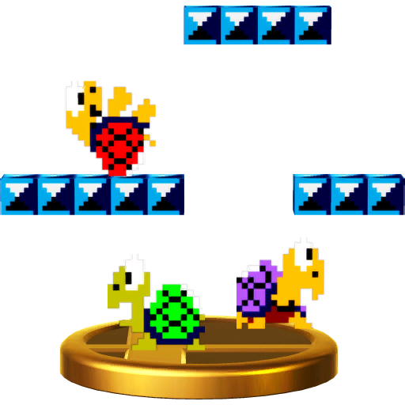</a></th>
    <th><b>Shellcreepers</b></th>
    <th>With a name that implies silently sneaking up on its prey, the Shellcreeper might be considered cooler than your average turtle. The Koopa is apparently an evolved form of this veteran of Mario Bros. We'd recommend not jumping on this one like you would a Koopa, though...</th>
  </tr>
  <tr>
    <th></th>
    <th><b>Shy Guy</b></th>
    <th>These bashful baddies are so shy that no one's ever seen their real faces. They debuted in Doki Doki Panic before becoming a Mario series mainstay when that game was reworked into Super Mario Bros. 2. They come in different colors, each with unique characteristics. Some can walk on stilts; others are always on fire!</th>
  </tr>
  <tr>
    <th></th>
    <th><b>Sidesteppers</b></th>
    <th>Can you guess how this crab-like enemy moves? The name might give you a clue. But Mario could be in for a surprise when he punches one from below--instead of flipping over, it starts sidestepping even faster! Oh, Mario, did you make it angry? Don't worry--a second punch should calm it down...or at least knock it on its head.</th>
  </tr>
  <tr>
    <th></th>
    <th><b>Soccer Ball</b></th>
    <th>A strong attack on a soccer ball will set it on fire, and any enemies hit will go flying from the impact. Depending on how you hit it, the ball will fly in different directions. Luckily, no one has to retrieve it if you send it off the stage—this ball will return to the battlefield for some time.</th>
  </tr>
  <tr>
    <th></th>
    <th><b>Spiny Shell</b></th>
    <th>The devastating blue Spiny Shell that normally appears in the Mario Kart series. This shell seeks out the lead racer and ruins his or her day. In Smash Bros., it will hover above one of the fighters before crashing down and exploding. Avoiding the impact can be challenging.</th>
  </tr>
  <tr>
    <th></th>
    <th><b>Spring Mario</b></th>
    <th>Boingee boingee boingee... It's Spring Mario, bouncing along and having a grand time! Just get a Spring Mushroom, and then press the A Button right when you land for a super-high jump! If you have a fear of heights, though, there's nothing wrong with staying in place and just bouncing a little.</th>
  </tr>
  <tr>
    <th></th>
    <th><b>Starship Mario</b></th>
    <th>This ship was made for Mario by Lubba, head honcho of the Luma crew. It's fueled by Power Stars, so the more Mario collects, the deeper he can go into space. Also, as he continues his adventure, the ship will fill up with new friends and items from all over the universe. At some point, a Yoshi's Egg will even appear on the ship's nose!</th>
  </tr>
  <tr>
    <th></th>
    <th><b>Super Leaf</b></th>
    <th>Transform into an adorable version of your normal self thanks to some raccoon ears and a fluffy tail. Unfortunately, you won't be able to fly through the air like Tanooki Mario—but you can hover for a bit by wiggling that tail. Hold the jump button while airborne to pull off this cute tactic.</th>
  </tr>
  <tr>
    <th></th>
    <th><b>Super Mushroom</b></th>
    <th>This mysterious mushroom will cause you to grow several times your normal size. Once you've grown, the power of your attacks and your ability to launch your opponents will increase. However, being so large— and such an easy target—may not be so great in a fight with lots of enemies...</th>
  </tr>
  <tr>
    <th></th>
    <th><b>Super Star</b></th>
    <th>You may recognize these star-shaped items as they bounce across the stage. Picking one up will grant you a short period of invincibility. You can't wipe out enemies just by walking into them—like in Mario games—but you can still attack without fear. Your foes will be running scared!</th>
  </tr>
  <tr>
    <th><a href="Tippi.png" >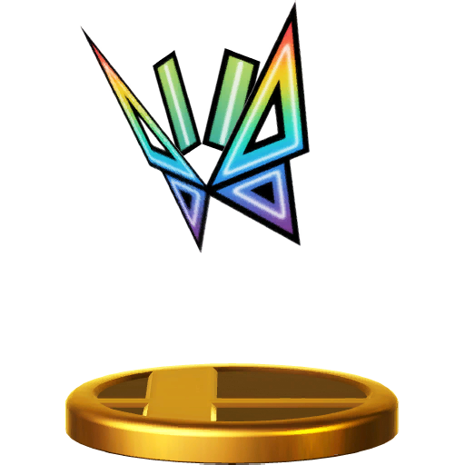</a></th>
    <th><b>Tippi</b></th>
    <th>In Super Paper Mario, Mario and his buddies use a special kind of tool--no, wait. That's rude. Pixis have feelings, you know! This one here is named Tippi, and she looks a bit like a math teacher's drawing of a butterfly. She's very helpful, but she also has her own motives, it seems...</th>
  </tr>
  <tr>
    <th><a href="Toad.png" >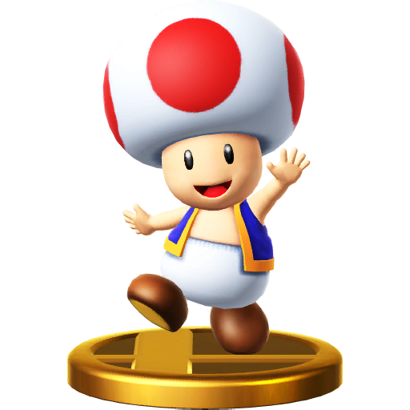</a></th>
    <th><b>Toad</b></th>
    <th>A race of charming mushrooms that dwell in the Mushroom Kingdom, they prefer to be called Toads... Come to think of it, that's an odd name. It's not like they're very good jumpers. Captain Toad can't jump at all! What's that? ToadSTOOLS? ...That makes more sense.</th>
  </tr>
  <tr>
    <th></th>
    <th><b>Toad Brigade</b></th>
    <th>As Mario travels to the unknown reaches of space, he can always rely on the trusty Toad Brigade. They're a colorful bunch--the captain sports red spots while others have green, yellow, blue, or purple ones. The yellow Toad is known for dozing off on the job, but his sleepy musings can be quite handy!</th>
  </tr>
  <tr>
    <th></th>
    <th><b>Toad + Quacker</b></th>
    <th>Though its appearance calls to mind an infant's toy, the Quacker is really a fully functional motorbike with some serious acceleration. That's because its frame is so light, you might expect it to float on water like a swan boat! But that lightness also makes it easy for other karts to push around, so try to stay out of trouble.</th>
  </tr>
  <tr>
    <th><a href="Toadette.png" >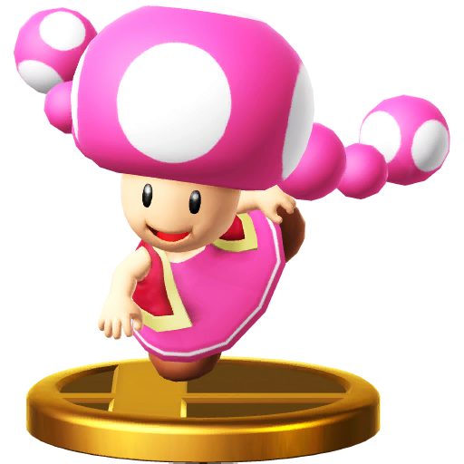</a></th>
    <th><b>Toadette</b></th>
    <th>This lady made her debut in Mario Kart: Double Dash!! Since then, she's shown up to help in several other games. She loves animals and listening to music, and she's quite good at sports. She's also shown to be helpful in explaining Mario's weapons. There is definitely more to Toadette than there seems to be.</th>
  </tr>
  <tr>
    <th><a href="Toadsworth.png" >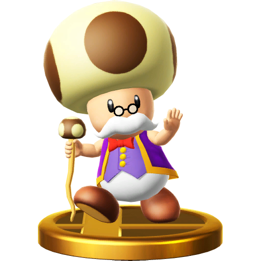</a></th>
    <th><b>Toadsworth</b></th>
    <th>This faithful aide to Princess Peach made his debut in Super Mario Sunshine. His name is perfect for a personal aide too! All the years of service seem to have given him some leeway when it comes to rules-whenever he steps up to the plate in baseball, he uses his walking stick instead of a bat!</th>
  </tr>
  <tr>
    <th><a href="Waluigi.png" >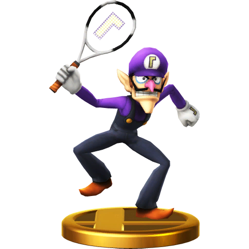</a></th>
    <th><b>Waluigi</b></th>
    <th>A crooked mustache and a long, red nose— Waluigi has "villain" written all over him. He considers himself Luigi's rival. He's cunning and quick. When summoned into battle, he'll rush the nearest fighters and stomp them into the ground—then thwack them with his foot or tennis racket!</th>
  </tr>
  <tr>
    <th><a href="Wendy.png" >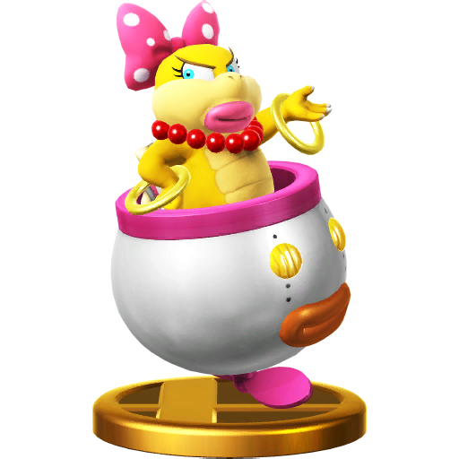</a></th>
    <th><b>Wendy</b></th>
    <th>Of all the Koopalings, Wendy's the only girl. She's bold, bossy, big headed, and sees Peach and Daisy as her rivals. Despite her tomboyish nature, she's not afraid to show off her feminine side with a pink bow and heels. In New Super Mario Bros. U, she shows off her graceful ice-skating skills with a spin or two.</th>
  </tr>
  <tr>
    <th><a href="Whomp.png" >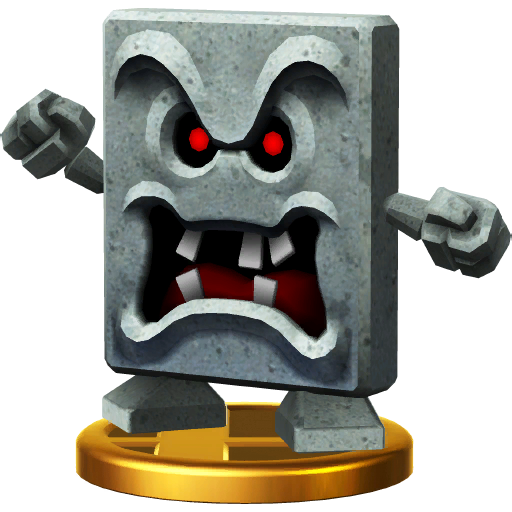</a></th>
    <th><b>Whomp</b></th>
    <th>Is it really all that surprising that a creature named Whomp would want to dish out some pain? Another unsurprising fact: Whomps are actually good friends with Thwomps, who are also made of stone. Oh! We had a joke for this... What do you get when you cross a Whomp with a Thwomp? A headache! Ha!</th>
  </tr>
</table>



<table class="fixed" border="1">
    <col width="150px" />
    <col width="100px" />
    <col width="600px" />
  <tr>
    <th></th>
    <th><b>Assist Trophy</b></th>
    <th>This strange capsule contains a guest character who will aid you in your battle. Who will emerge? Grab it to find out! Maybe it'll be a famous character from a popular game, or perhaps a goofy sidekick here to prove his or her worth. Too bad you can't choose who shows up or control them...</th>
  </tr>
  <tr>
    <th><a href="Barrels.png" >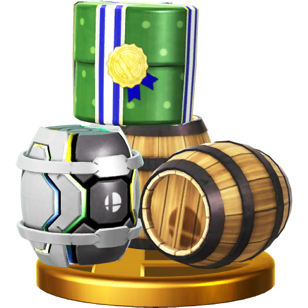</a></th>
    <th><b>Barrels</b></th>
    <th>These barrels are crammed full of items, but they're also incredibly tough to break. No baby hits here—attacking too lightly will just send the barrel rolling away, making it a dangerous obstacle for both you and your foes. And if others break the barrel, they'll get the items you wanted!</th>
  </tr>
  <tr>
    <th></th>
    <th><b>Beam Sword</b></th>
    <th>A powerful sword with a blade of pure energy. It isn't the strongest weapon to land on the battlefield, but its shape can change based on how it is used to attack. A forward smash will make the blade especially long. Lash out at your foes from a distance—they can't hit back!</th>
  </tr>
  <tr>
    <th></th>
    <th><b>Blast Box</b></th>
    <th>A highly flammable box packed full of gunpowder. The player who last threw the box will get credit for any KOs it causes. Setting off the box will result in a massive explosion, and you've only yourself to blame if you blow yourself up. It says DANGER right on the front.</th>
  </tr>
  <tr>
    <th><a href="Bumper.png" >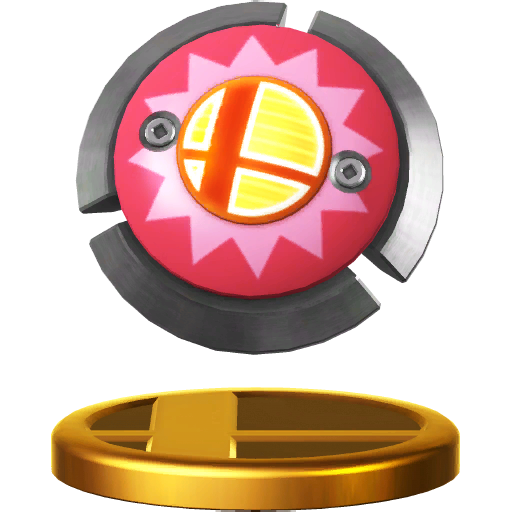</a></th>
    <th><b>Bumper</b></th>
    <th>Ah, pinball... What a fun game. And with this item, you can add a bit of pinball wham to the battlefield. Once thrown, this item will bounce anything that comes near it violently away. Just don't get careless and walk into a deployed one yourself, or you'll get bounced too!</th>
  </tr>
  <tr>
    <th><a href="Capsule.png" >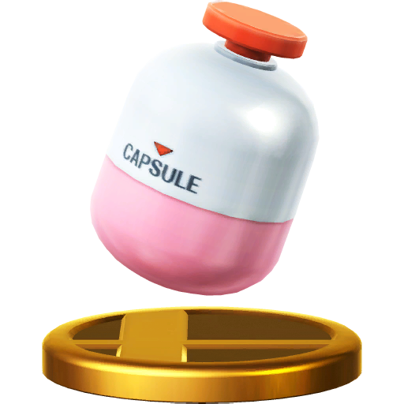</a></th>
    <th><b>Capsule</b></th>
    <th>This tiny capsule can hold one item inside it, no matter how massive that one item may be. How does it do that? No idea! But all you have to do to get the prize is break the capsule. It's possible for these things to explode, so it's best to break it against walls or opponents. They won't be upset. Maybe.</th>
  </tr>
  <tr>
    <th><a href="CD.png" >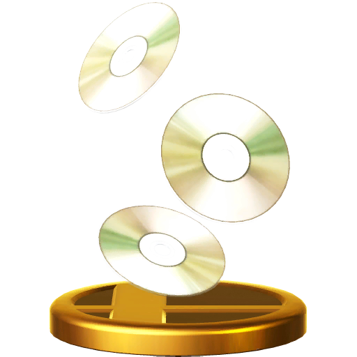</a></th>
    <th><b>CD</b></th>
    <th>These elusive items are no good to you at all during battle, but picking up one adds a new song to your growing music collection. You can then give it a listen in Sounds and use My Music to set how often you'll hear it in battles. Yes, it IS a shame you can't also throw a CD at a foe, but not everything in your life is for throwing at people.</th>
  </tr>
  <tr>
    <th><a href="Coin.png" >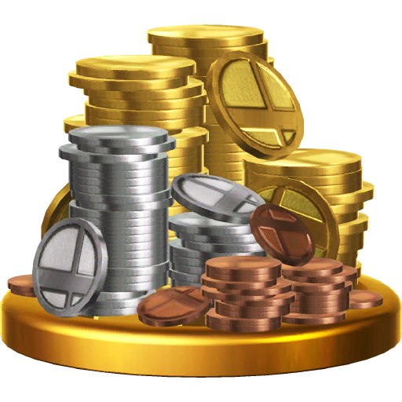</a></th>
    <th><b>Coin (Coin Smash)</b></th>
    <th>Coin battles see which player can collect the most coins. Beating up your opponents will send coins flying, and then you must collect them! There are three types of coins: Gold (6 points), Silver (3 points), and Bronze (1 point). Deal more damage to your opponent to make the more valuable coins fly free.</th>
  </tr>
  <tr>
    <th><a href="Crates.png" >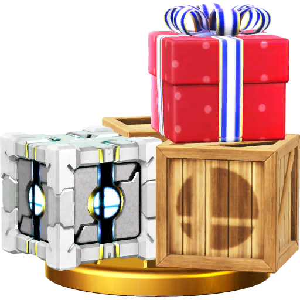</a></th>
    <th><b>Crates</b></th>
    <th>Throw or attack this crate to bust it open and get the goodies hidden inside. The crate may look different based on the stage you're battling on, but the items inside won't change. Sometimes these things can explode, however, so it's best to be very crateful around them...</th>
  </tr>
  <tr>
    <th></th>
    <th><b>Crazy Hand</b></th>
    <th>The erratic Crazy Hand embodies destruction in the Smash Bros. universe. You can see madness in the way he moves and the attacks he unleashes. Pairing up with Master Hand makes him an especially dangerous foe. Be ready for an intense battle when their laughter fills the air.</th>
  </tr>
  <tr>
    <th><a href="Drill.png" >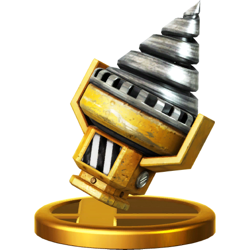</a></th>
    <th><b>Drill</b></th>
    <th>This may look like a handy hand-to-hand weapon, but the steel bit actually fires like a bullet. You only get one shot, but if that shot hits enemies, it will drill into them, doing continuous damage and carrying them back. Don't forget to throw the base at them afterward, adding insult to injury!</th>
  </tr>
  <tr>
    <th></th>
    <th><b>Fighting Mii Team</b></th>
    <th>These weak fighters show up in droves in Multi-Man Smash. There are Brawler, Swordfighter, and Gunner types. Since they're based on the Mii characters saved on your Nintendo 3DS system or Wii U console, you could end up battling friends and family! Don't get soft—just take them out! Almost any attack does the trick.</th>
  </tr>
  <tr>
    <th></th>
    <th><b>Final Edge</b></th>
    <th>The Mii Swordfighter will rise its sword, firing multiple shock waves forward in its Final Smash. The waves will expand outward and push foes off the screen. Walls and the ground can't stop this display of power, so this Final Smash is exceptional at taking out several rivals at the same time.</th>
  </tr>
  <tr>
    <th><a href="Food.png" >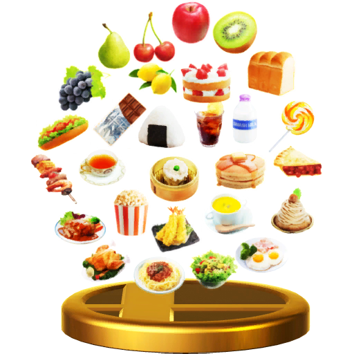</a></th>
    <th><b>Food</b></th>
    <th>Pick up food and eat it to restore health. There are 28 kinds of food in all, including bread, which heals 10 damage, roast chicken which heals 15, and so on. The fancier the food, the more damage it will heal. Keep and eye out for Party Balls-they may drop a whole buffet for you to nom.</th>
  </tr>
  <tr>
    <th></th>
    <th><b>Full Blast</b></th>
    <th>The Mii Gunner's Final Smash unleashes a wide, long-range beam of painful energy. The laser will hit several times, pushing back opponents before launching them with the last blow. You can adjust the laser beam's angle, so punish a foe who thought he or she was safe by trying to duck under the beam!</th>
  </tr>
  <tr>
    <th></th>
    <th><b>Gooey Bomb</b></th>
    <th>This one is incredibly sticky, clinging to anyone or anything it touches before exploding. If you happen to be the "anyone," you can hand it off by passing or touching one of your foes—time to get real friendly! If there isn't anyone around, you'd better spend the next few seconds wisely...</th>
  </tr>
  <tr>
    <th></th>
    <th><b>Home-Run Bat</b></th>
    <th>Combine this black bat with a forward smash to try for a home run, using an opponent as the ball! Unfortunately, the reach on the bat is not all that impressive, so it takes some real skill to line up a hit. Keep your chin up, though—the loud "KREEENG" of a hit makes it all worthwhile.</th>
  </tr>
  <tr>
    <th></th>
    <th><b>Master Core</b></th>
    <th>This sinister being will appear from Master Hand. A bunch of black objects, called "Swarm," will gather and mimic a variety of shapes, changing its attack pattern with each new form. After taking enough damage, it will reveal even more forms. Defeat the Swarm's forms to reveal its true core.</th>
  </tr>
  <tr>
    <th></th>
    <th><b>Master Hand</b></th>
    <th>The mysterious Master Hand is the source of creation in the Smash Bros. universe. He appears in Final Destination when all other rivals are defeated. He fights with a diverse move set and only grows stronger if you make him angry. If you know when to fight and when to dodge, you'll take him down!</th>
  </tr>
  <tr>
    <th></th>
    <th><b>Mii Brawler</b></th>
    <th>This fighter is based on a player's Mii. It excels at fighting with punches and kicks. This type of Mii is very agile, blending attacks with movement to get the battle flowing. It has superior dash and jump compared to other types. Stay close and keep whaling on foes—you'll KO them in no time!</th>
  </tr>
  <tr>
    <th></th>
    <th><b>Mii Brawler (Alt.)</b></th>
    <th>Shot Put is the only projectile attack a Mii Brawler can have. It drops quickly and only bounces a tiny bit. Try using it on foes hanging off an edge to knock them off. The down special Head-On Assault can bury enemies in the ground. It also sends the Mii Brawler downward—don't KO yourself, too!</th>
  </tr>
  <tr>
    <th></th>
    <th><b>Mii Gunner</b></th>
    <th>A Mii sporting a blaster arm, this fighter is a great choice for those who prefer to fight the battle from a distance. The Mii Gunner has a lot of special projectile moves available, so pick your favorites and use them when needed. Don't forget about standard and smash attacks!</th>
  </tr>
  <tr>
    <th></th>
    <th><b>Mii Gunner (Alt.)</b></th>
    <th>One of the Mii Gunner's side specials is Stealth Burst. The missile blends in, making it tough to see. Plus, you can control when it explodes, so it's handy for surprise attacks! You could also use Absorbing Vortex to absorb damage done to you by energy weapons. This is one fighter with a lot of tricks up its sleeve!</th>
  </tr>
  <tr>
    <th></th>
    <th><b>Mii Swordfighter</b></th>
    <th>This fighter is based on a player's Mii and favors a sword in battle. Enjoy the extra reach the sword offers, but remember that it takes a bit longer for strikes to reach your opponent as a result. Customize your Mii with chargeable moves, counters, or projectile attacks.</th>
  </tr>
  <tr>
    <th></th>
    <th><b>Mii Swordfighter (Alt.)</b></th>
    <th>One of the Mii Swordfighter side specials actually uses a throwing disc called a chakram! How quickly you press your desired direction controls how fast and far the chakram flies and how much damage it does. Several other moves, like Skyward Slash Dash, also work in this manner.</th>
  </tr>
  <tr>
    <th></th>
    <th><b>Motion-Sensor Bomb</b></th>
    <th>A tiny bomb that explodes in a big blast when it detects movement. Stick it to the walls, floor, or ceiling, and wait for it to arm. Long-range weapons can destroy it, but only if your opponents remember it's there. Don't forget yourself, though, or it'll be you caught in the explosion!</th>
  </tr>
  <tr>
    <th></th>
    <th><b>Omega Blitz</b></th>
    <th>Mii Brawler's Final Smash will strike opponents with a powerful uppercut and then deliver a rush of attacks in midair. If the uppercut misses, the rush of attacks will fail as well. However, there is no escaping this move once caught in it. The final blow consists of kicking opponents down and bouncing them off the stage.</th>
  </tr>
  <tr>
    <th></th>
    <th><b>Party Ball</b></th>
    <th>A celebratory ball, filled with irrisitible treasures just begging to be released. Once thrown, it floats into the air and releases its prizes. It could be a variety of awesome items, but you should be careful-sometimes the Party Ball is stuffed with Bob-ombs. How rude!</th>
  </tr>
  <tr>
    <th></th>
    <th><b>Ray Gun</b></th>
    <th>Grab one of these to instantly feel like you're fighting battles of the future! With the right timing, the rapid-fire green lasers can juggle fighters in the air, and they have the range to push foes off the stage. Unfortunately, even future weapons only have so much ammo. Make each shot count!</th>
  </tr>
  <tr>
    <th></th>
    <th><b>Rolling Crates</b></th>
    <th>A normal-looking box, this one actually has wheels on the bottom. Just give the box a little nudge—its own weight will turn it into a rolling weapon. It's possible to ride on top of it, but you certainly aren't traveling in style. Be sure to stop the box or jump off before it hits something!</th>
  </tr>
  <tr>
    <th><a href="Sandbag.png" >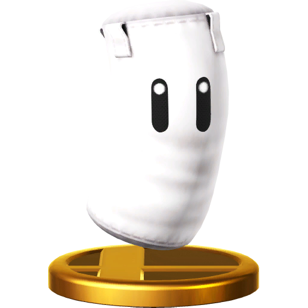</a></th>
    <th><b>Sandbag</b></th>
    <th>This little guy makes a great sparring partner. No, really! In Home-Run Contest you'll send it flying, and in normal battles it has a habit of dropping items when you lay into it. Sandbag seems pretty content with being your punching bag, so it'd almost be mean not to go all out on it.</th>
  </tr>
  <tr>
    <th></th>
    <th><b>Smash Ball</b></th>
    <th>This item can truly turn the tide of battle. Once broken open, a character's Final Smash will be unlocked. If your opponent collects this, you'd better brace yourself for a powerful special move. This item is pretty durable and floats around the stage, so timing and positioning are key.</th>
  </tr>
  <tr>
    <th></th>
    <th><b>Smoke Ball</b></th>
    <th>Ack! It's hard to see through all the smoke this ball lets off. You can throw this around a stage, obscuring the view, or stick it to opponents and really annoy them. The smoke itself doesn't do any damage, but there's definitely an advantage to concealing the battlefield.</th>
  </tr>
  <tr>
    <th></th>
    <th><b>Team Healer</b></th>
    <th>An item exclusive to team battles. If you throw it at injured teammates, it will reduce the damage they've taken so far. It can be used against your foes as well, dealing a little bit of damage, but it can sometimes heal them, too. That's the last thing you want!</th>
  </tr>
  <tr>
    <th><a href="Timer.png" >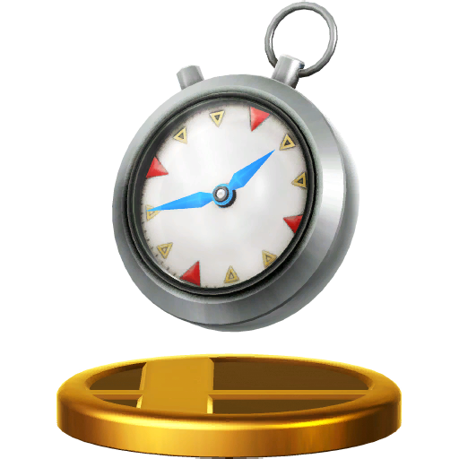</a></th>
    <th><b>Timer</b></th>
    <th>Grabbing this will make time flow at a different pace around you. Everyone else will slow down, letting you grab all the items and get in some blows. Sometimes, though, this item backfires and slows you down too. Worst case, it may actually slow ONLY you. That's not so great...</th>
  </tr>
</table>



<table class="fixed" border="1">
    <col width="150px" />
    <col width="100px" />
    <col width="600px" />
  <tr>
    <th></th>
    <th><b>9-Volt & His Mother</b></th>
    <th>Wario and friends' newest selection of minigames are all designed to be played with the Wii U GamePad. In Gamer, you take on the role of young 9-Volt, playing a selection of microgames in bed at night. When his mom pops her head in, you'd better pretend to be asleep. If she catches you playing, it's game over!</th>
  </tr>
  <tr>
    <th><a href="Ashley.png" >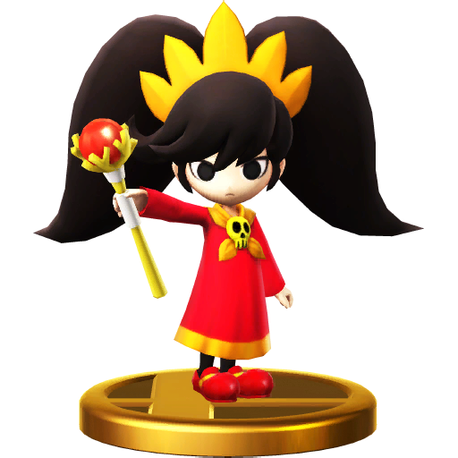</a></th>
    <th><b>Ashley</b></th>
    <th>This young witch-in-training lives in a haunted mansion in Diamond City. She's shy and quick to anger, but secretly she wants more friends. When she appears on the battlefield, she will summon a damaging zone of darkness around her. The zone causes a variety of effects, none of them good.</th>
  </tr>
  <tr>
    <th></th>
    <th><b>Dr. Crygor</b></th>
    <th>This technological genius (or perhaps mad scientist would be more accurate) has created many interesting inventions. Besides the life-support suit that Crygor himself wears, he's also made vehicles, such as the Wario Car. Rumor has it he's even working on a time machine. Quite the valuable employee of WarioWare, Inc.</th>
  </tr>
  <tr>
    <th></th>
    <th><b>Kat & Ana</b></th>
    <th>These ninja twin sisters of the Iga Clan attend Diamond City Kindergarten. The high-tech katanas they carry, made by Dr. Crygor, are like an extension of their own bodies. They strike at incredible speed with devastating attacks. By the way, Kat is the one with pink hair.</th>
  </tr>
  <tr>
    <th><a href="Mona.png" >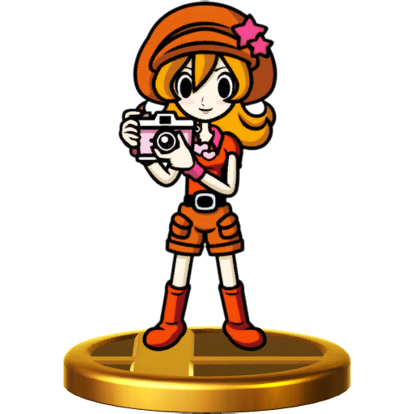</a></th>
    <th><b>Mona</b></th>
    <th>Normally she's an ordinary high schooler from Diamond City, but in Game & Wario, Mona is a roving photographer eager for the big scoop! In the solo game Shutter, you scour the city on the TV screen for your targets and then use the Wii U GamePad to snap pics of them! Get the perfect shot to make the front page of the papers!</th>
  </tr>
  <tr>
    <th><a href="Wario.png" >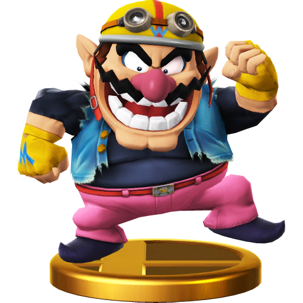</a></th>
    <th><b>Wario</b></th>
    <th>A living embodiment of gross, this villain hates Mario and loves money. He claims to have known Mario since childhood, but who can tell if that's true? In Smash Bros., he's a seriously agile heavyweight fighter. He can store up his trademark Wario Waft for explosive results. Did I mention he's gross?</th>
  </tr>
  <tr>
    <th></th>
    <th><b>Wario (Alt.)</b></th>
    <th>With his Chomp special, Wario can wolf down almost anything! If you use this to gobble up healing items, they'll work better! When using his Wario Bike side special, you can jump off, pick it up, and throw it. But please, for the love of all things garlicky, JUMP OFF BEFORE YOU RIDE OFF THE STAGE.</th>
  </tr>
  <tr>
    <th></th>
    <th><b>Wario Bike</b></th>
    <th>A ridiculously powerful motorcycle designed for Wario by Dr. Crygor, this mean machine sports wide handles and raised pedals to accommodate Wario's unique dimensions. Summoned into battle as his side special attack, even Wario can have trouble keeping this thing upright at times.</th>
  </tr>
  <tr>
    <th><a href="Wario-Man.png" >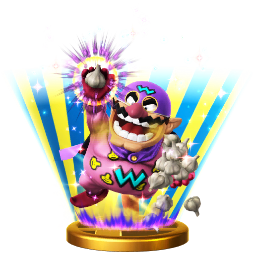</a></th>
    <th><b>Wario-Man</b></th>
    <th>With just a little nibble of garlic, humble everyman Wario transforms into the hero of justice, Wario-Man! He's...still not really all that strong, but he does get quite a bit faster, and he can launch foes farther too. And like any good hero, he has the ability to fly...by spamming attacks in midair. Just like they all do it, right?</th>
  </tr>
</table>



<table class="fixed" border="1">
    <col width="150px" />
    <col width="100px" />
    <col width="600px" />
  <tr>
    <th></th>
    <th><b>Arm & Leg Lift</b></th>
    <th>Starting from a crouched position, extend one leg back and the opposite arm forward, and hold. This is a strength exercise that firms up the abdominal and back muscles nicely. It's also the Wii Fit Trainer's down smash. Combine it with a lunge attack to send an opponent sailing sideways.</th>
  </tr>
  <tr>
    <th><a href="Bridge.png" >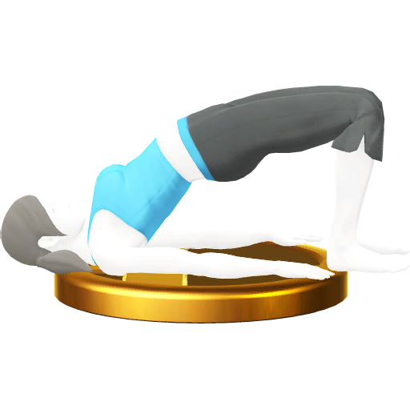</a></th>
    <th><b>Bridge</b></th>
    <th>A yoga pose where you lie supine on the floor, lifting your hips while keeping your shoulders and arms flat. This pose helps to strengthen your whole torso. The Wii Fit Trainer can perform this as a down tilt attack, using the knees to strike at opponents and send them flying.</th>
  </tr>
  <tr>
    <th><a href="Dancer.png" >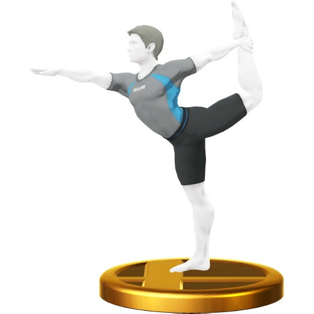</a></th>
    <th><b>Dancer</b></th>
    <th>Stand on your right leg and extend your right hand, all while grabbing your raised left leg with your left hand. Arch your back like a bow to correct your posture. This is the Wii Fit Trainer's forward tilt attack, sending rear opponents flying upward and those in front flying forward.</th>
  </tr>
  <tr>
    <th><a href="Gate.png" >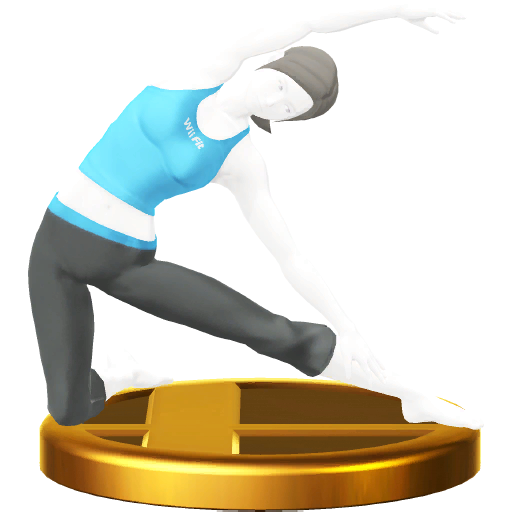</a></th>
    <th><b>Gate</b></th>
    <th>First, kneel on your right knee while raising your right arm above your head. Then extend your left arm and leg out to the left and lean in that direction. This pose will strengthen the abdomen and tighten the waist. The Wii Fit Trainer strikes both above and forward with this move, but it takes a while to recover from.</th>
  </tr>
  <tr>
    <th><a href="Jackknife.png" >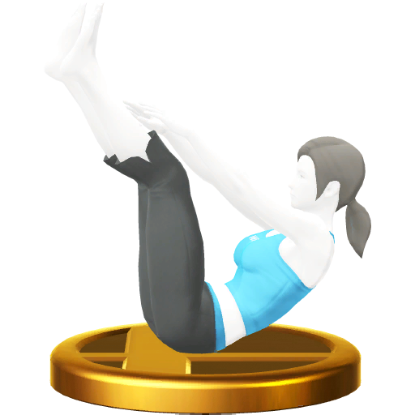</a></th>
    <th><b>Jackknife</b></th>
    <th>Lie flat on your back and raise your arms and legs to form a V. This exercise is more challenging than a regular sit-up, but it's great for maintaining flexibility and working the abdominal muscles. The Wii Fit Trainer uses this pose to attack in the air, hitting opponents twice before launching them upward.</th>
  </tr>
  <tr>
    <th></th>
    <th><b>Super Hoop</b></th>
    <th>In this aerobic exercise, you sway your hips to keep the hoops from hitting the ground. Multiple hoops ups the challenge! This exercise is a good workout and helps align the pelvis. The Wii Fit Trainer can recover well with this up special attack, but it doesn't do much to foes.</th>
  </tr>
  <tr>
    <th><a href="Tree.png" >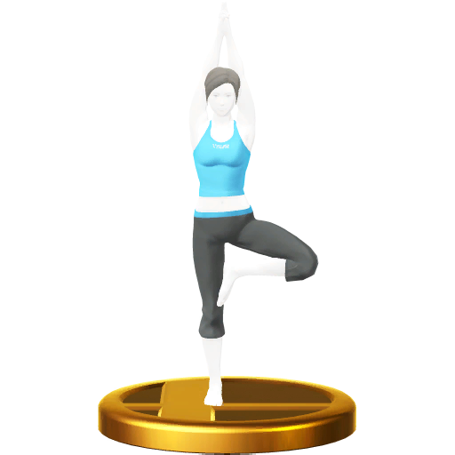</a></th>
    <th><b>Tree</b></th>
    <th>A simple yoga pose that is known to better your balance and posture, all it requires is standing on one leg and stretching your arms upward. Squatting low and then extending the arms will protect the Wii Fit Trainer from damage for a time and also increase the power of your yoga blows!</th>
  </tr>
  <tr>
    <th><a href="Warrior.png" >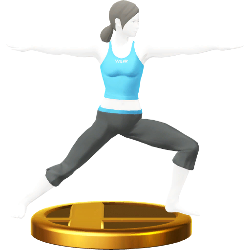</a></th>
    <th><b>Warrior</b></th>
    <th>The Wii Fit Trainer assumes a forward lunge, extending one arm forward and one back at shoulder level. This pose builds powerful thigh muscles and realigns the hips. With a devastating, strong forward smash, the Wii Fit Trainer can send opponents flying in both directions!</th>
  </tr>
  <tr>
    <th></th>
    <th><b>Wii Balance Board</b></th>
    <th>The Wii Balance Board is the smiling ace that guides you through Wii Fit. Well... maybe not the smiling face, since it doesn't actually have a face and all, but he's pretty cheery for someone who gets stood on a lot. When you see him in this game, take it as a reminder that good balance is always important, especially when launching foes.</th>
  </tr>
  <tr>
    <th></th>
    <th><b>Wii Fit</b></th>
    <th>Wii Fit Trainer strikes the Warrior pose, sending an army of silhouettes flying forth in a variety of poses (21 in all!). This Final Smash's individual hits don't hurt much, but they add up and can even push foes off the edge. Meanwhile, Wii Fit Trainer is invincible! Unleash it at a height to get the full range of the cone effect.</th>
  </tr>
  <tr>
    <th></th>
    <th><b>Wii Fit Trainer</b></th>
    <th>The female trainer who helps you in the Wii Fit series. She favors a fighting style composed of yoga poses. This makes her a capable close-quarters fighter, but she has ranged attacks as well. She also has a move called Deep Breathing, which can heal you and increase attack power if timed right.</th>
  </tr>
  <tr>
    <th></th>
    <th><b>Wii Fit Trainer (Alt.)</b></th>
    <th>The male trainer from the Wii Fit series, his neutral special Sun Salutation charges up a ball of light that, when launched, will heal him a bit. His Jackknife pose is excellent for toning the abdominal muscles, but in Smash Bros. the Wii Fit Trainer uses it as an air attack. Timed right, the attack can hit twice!</th>
  </tr>
  <tr>
    <th></th>
    <th><b>Wii Fit U Trainer</b></th>
    <th>The Wii Fit Trainer has the most impressive balancing skills we ever seen! Many people probably started yoga to achieve this perfection. However, these abilities aren't developed overnight; it takes lots and lots of yoga practice. We won't judge if you'd rather take it easy—we aren't exactly writing this from the gym.</th>
  </tr>
</table>



<table class="fixed" border="1">
    <col width="150px" />
    <col width="100px" />
    <col width="600px" />
  <tr>
    <th><a href="Bionis.png" >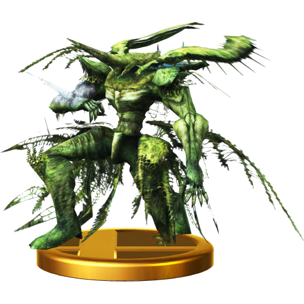</a></th>
    <th><b>Bionis</b></th>
    <th>The region known as Bionis' Leg is a vast landscape of lush fields, towering hills, and flowing rivers. But its name is no metaphor. No, it really is the leg of the titanic Bionis, a god whose body has become an entire world since it fell in the battle long ago. Whole races, such as Homs and High Entia, have lived and died on this great being.</th>
  </tr>
  <tr>
    <th></th>
    <th><b>Bronze Face</b></th>
    <th>Faced Mechon, or just Faces for short, are feared for their tremendous strength. Most are piloted by Homs who have been converted into the machines' Core Units, and each Face's design tends to reflect some aspect of its former self. In Bronze Face's case, his giant hammer recalls the old life of his Core Unit, Xord--blacksmith.</th>
  </tr>
  <tr>
    <th></th>
    <th><b>Chain Attack</b></th>
    <th>In Xenoblade Chronicles, building up the party's team spirit would let them unleash a chain attack, using multiple Arts in a row to deal massive damage. In this game, Shulk's Final Smash calls party members Dunban and Riki to help obliterate an unlucky target... or multiple targets if you catch more than one in the circle of light!</th>
  </tr>
  <tr>
    <th><a href="Dunban.png" >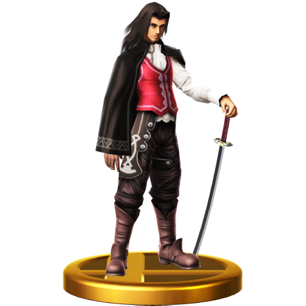</a></th>
    <th><b>Dunban</b></th>
    <th>Dunban was hailed as a hero when he stopped the Mechon invasion of Bionis with the Monado. However, it cost him the use of his right arm. He's always looking out for others, and Shulk sees him as an older brother. In Shulk's Final Smash, Dunban, Riki, and Shulk team up to overwhelm the enemy!</th>
  </tr>
  <tr>
    <th></th>
    <th><b>Face Nemesis</b></th>
    <th>A silvery faced Mechon that resembles a goddess. Created by Vanea, the sister of the Mechonis' ruler, Egil. She hoped this Mechon would be able to put a stop to her brother's mad quest for revenge, and to that end, she chose Fiora as its Core Unit. Thus Fiora came to host the soul of the Machina Goddess, Meyneth.</th>
  </tr>
  <tr>
    <th><a href="Fiora.png" >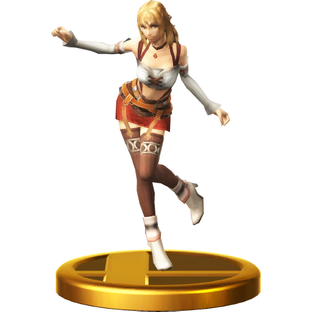</a></th>
    <th><b>Fiora</b></th>
    <th>Fiora is Dunban's younger sister and a childhood friend of Shulk and Reyn. In fact, her feelings for Shulk are more than friendly, but their relationship hasn't quite reached that next level, despite all the delicious food she makes him. Fiora's a skilled fighter and wields twin blades with ease, but when a Mechon attacks her...</th>
  </tr>
  <tr>
    <th></th>
    <th><b>Jade Face</b></th>
    <th>Sharla believed her fiance had died in the attack on her colony...but the truth was more heartbreaking than that. Gadolt had been converted into a Mechon's Core Unit and with no memory of his past self, he saw his former lover as an enemy. Jade Face's use of its shoulder-mounted rifle cannons reflect Gadolt's skill as a sniper.</th>
  </tr>
  <tr>
    <th><a href="Mecha-Fiora.png" >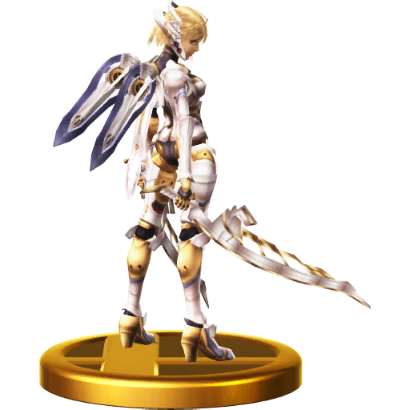</a></th>
    <th><b>Mecha-Fiora</b></th>
    <th>In the hand-fought battle to save Colony 9 from the Mechon, it looked very much like Fiora had sacrificed her life. When she finally appeared before Shulk again, she'd not only been taken to Mechonis and given a new mechanized form, she'd become a vessel for the Mechonis's soul. Only later does she regain her own personality.</th>
  </tr>
  <tr>
    <th><a href="Mechonis.png" >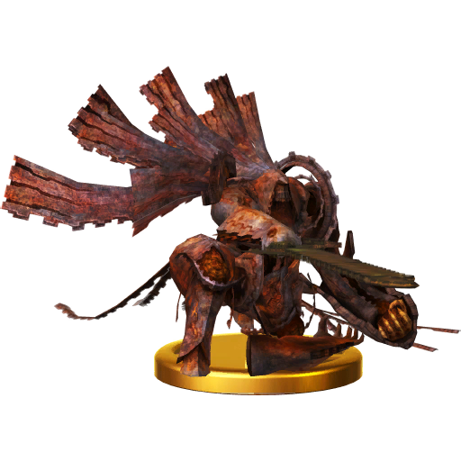</a></th>
    <th><b>Mechonis</b></th>
    <th>When the Mechon invaded, the lives of the peaceful inhabitants of Bionis were thrown into chaos. The ancient battle between the Bionis and the Mechonis had never truly ended at all, and for a time it seemed that the will of the Mechonis would succeed in wiping out all organic life. Until a hero appeared, wielding the legendary Monado...</th>
  </tr>
  <tr>
    <th><a href="Melia.png" >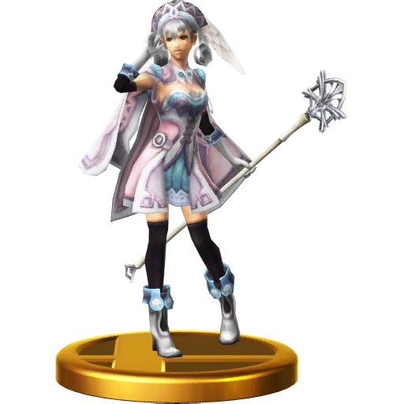</a></th>
    <th><b>Melia</b></th>
    <th>Time for a quick Melia-themed quiz! Take a look and try to guess how old she is. Eighty-eight! You're right! ...Wait-that's not what you guessed? OK, truth is, Melia's a High Entia, and they age MUCH more slowly than Homs. Still, if she's 88, maybe her old-fashioned turns of phrase aren't just because she's a princess!</th>
  </tr>
  <tr>
    <th></th>
    <th><b>Metal Face</b></th>
    <th>A faced Mechon who appears on the Gaur Plain stage. He swoops in from the sky when night falls and then leaves with the break of dawn. He doesn't actively pursue fighters, but if you get too close, you'll taste the deadly bite of his claws. Watch out for his laser attack too-it can destroy parts of the stage itself!</th>
  </tr>
  <tr>
    <th><a href="Reyn.png" >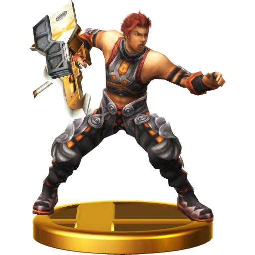</a></th>
    <th><b>Reyn</b></th>
    <th>A member of Colony 9's Defence Force and Shulk's longtime best friend. He and Shulk seem to understand each other better than anyone else. However, Reyn's mora of a "leap before you look" kind of guy. It's not the most strategic approach to things, but it usually works out OK!</th>
  </tr>
  <tr>
    <th><a href="Riki.png" >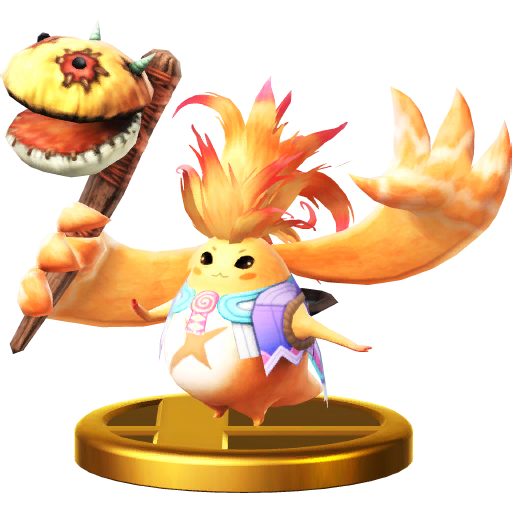</a></th>
    <th><b>Riki</b></th>
    <th>A Nopon from Frontier Village in Xenoblade Chronicles. Despite appearances, this year's legendary Heropon is actually a middle-aged father of 11. If you summon him in this game, he'll use Arts to knock over your foes, freeze them, and even send them to sleep. Riki can also heal you, but if he does, he'll heal everyone else too!</th>
  </tr>
  <tr>
    <th><a href="Sharla.png" >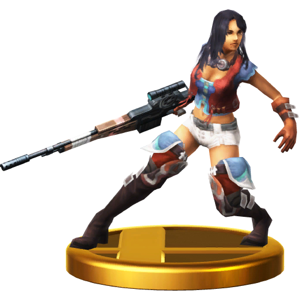</a></th>
    <th><b>Sharla</b></th>
    <th>Having saved countless lives, Sharla, a devoted combat medic from Colony 6 and a real source of hope on the battlefield. Though she longs to be reunited with her fiancé, Gadolt, who went missing after Colony 6 was attacked, she soldiers on, using her skills to take care of refugees before joining Shulk on his quest.</th>
  </tr>
  <tr>
    <th><a href="Shulk.png" >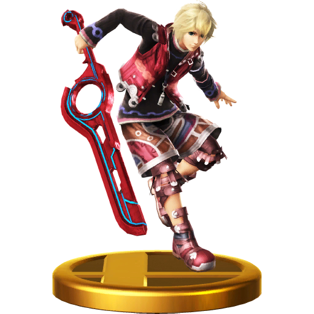</a></th>
    <th><b>Shulk</b></th>
    <th>In Xenoblade Chronicles, this young lad's colony is attacked by the Mechon, so he and his friends set off to take them down. In Smash Bros., his Monado Arts let him change his specialization during battle. You can choose to boost a stat—his jump or attack, for example—but other stats might drop as a result, so choose wisely.</th>
  </tr>
  <tr>
    <th></th>
    <th><b>Shulk (Alt.)</b></th>
    <th>Shulk's up special Air Slash is an upward slash done during a jump. Press the button again quickly to launch opponents sideways. His side special Back Slash, on the other hand, is a downward swing with a very wide range, though using it leaves Shulk wide open. Try hitting foes from behind with this!</th>
  </tr>
  <tr>
    <th><a href="Yaldabaoth" >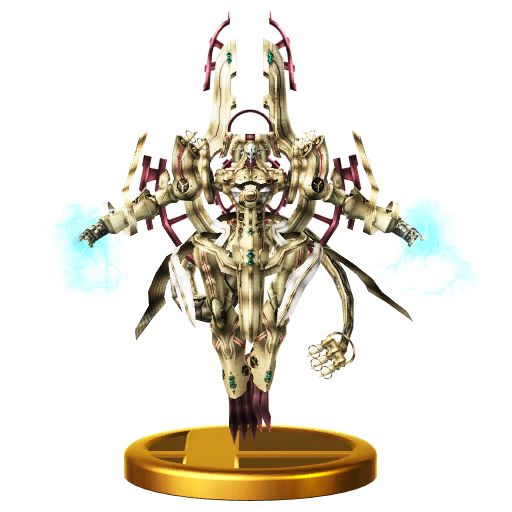</a></th>
    <th><b>Yaldabaoth</b></th>
    <th>The ultimate Mechon, also known as Gold Face. It's around twice the size of the other faced Mechon and piloted by Egil, ruler of Mechonis and leader of the assault on Bionis. Egil ultimately fuses Yaldabaoth with the Mechonis itself, becoming the great titan's core. The machine's name comes from a false god of legend.</th>
  </tr>
</table>



<table class="fixed" border="1">
    <col width="150px" />
    <col width="100px" />
    <col width="600px" />
  <tr>
    <th><a href="Yoshi.png" >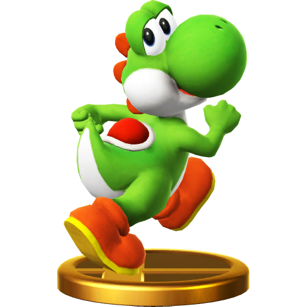</a></th>
    <th><b>Yoshi</b></th>
    <th>As dependable a partner as one could hope for, Yoshi often aids Mario in his adventures. Yoshi can swallow just about anything and make an egg of it instantly. He's got some serious airborne power, making launching opponents skyward and then following up with more attacks a wise choice.</th>
  </tr>
  <tr>
    <th></th>
    <th><b>Yoshi (Alt.)</b></th>
    <th>Yoshi's up-special move Egg Throw is a projectile attack that travels farther the longer the button is held. Yoshi will also rise a bit if this move is used in midair. The side special Egg Roll turns Yoshi into a rolling, damaging egg. Yoshi won't roll off an edge if no directions are pressed.</th>
  </tr>
  <tr>
    <th></th>
    <th><b>Super Dragon</b></th>
    <th>Wings sprout from Yoshi's back and he transforms into a super-cool dragon! While transformed, Yoshi is invincible and will constantly breathe fire. He can also ram into foes and shoot fireballs at them. The fireballs are great for launching foes and most powerful when used at close range.</th>
  </tr>
</table>



<table class="fixed" border="1">
    <col width="150px" />
    <col width="100px" />
    <col width="600px" />
  <tr>
    <th><a href="Barbara.png" >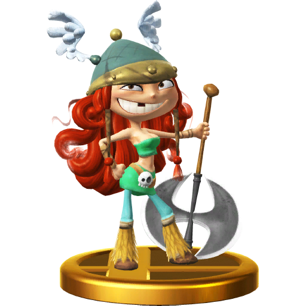</a></th>
    <th><b>Barbara</b></th>
    <th>If there's one thing any princess needs to complete her ensemble, it's her favorite battle-axe! Barbara is no average damsel in distress, but even a battle-axe doesn't make you invincible. She needs a little help from Rayman after being kidnapped, but she ends up being a lifesaver when she joins him after that!</th>
  </tr>
  <tr>
    <th></th>
    <th><b>Boss Galaga</b></th>
    <th>A boss enemy from Galaga. When thrown, it will spiral skyward and hang out for a time and then descend and pull in fighters with a tractor beam. If you get caught, try to escape by wiggling around as best you can. Unfortunately, there is no bonus fighter for defeating this enemy...</th>
  </tr>
  <tr>
    <th><a href="Calista.png" >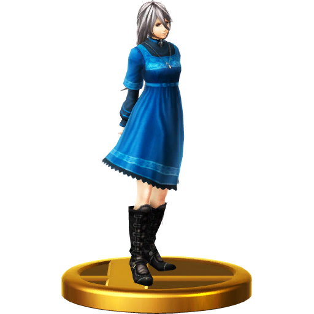</a></th>
    <th><b>Calista</b></th>
    <th>The lone heir to the House of Arganan. Count Arganan, her uncle and ruler of Lazulis Island, has always tried to keep her sheltered from the outside world, but craving adventure, she sneaks out to explore the city. When Zael gets captured and thrown in the castle's dungeon, she's the one who breaks him out.</th>
  </tr>
  <tr>
    <th><a href="CommanderVideo.png" >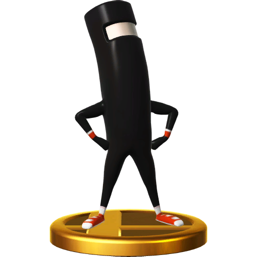</a></th>
    <th><b>CommanderVideo</b></th>
    <th>This is the hard-running character from the BIT.TRIP series, CommanderVideo. He runs, jumps, slides, and kicks his way through psychedelic works to funky beats. What makes this different from your average action game is that every move has to be in rhythm! Don't lose the beat!</th>
  </tr>
  <tr>
    <th></th>
    <th><b>Captain Rainbow</b></th>
    <th>Captain Rainbow used to be a household name, with everyone from grandparents to small children humming his theme song. Now a faded star, he's left Mameruca for Mimin Island. They say wishes come true there, but will our hero use the Mimin Bracelet to grant his own wishes or those of others?</th>
  </tr>
  <tr>
    <th></th>
    <th><b>Color TV-Game 15</b></th>
    <th>Nintendo released this video-game console way back in 1977. You could play 15 different games, inspired by sports like tennis and hockey. In Smash Bros., paddles will appear on the left and right sides of the stage. The ball can launch fighters on its own, but don't touch the paddles either!</th>
  </tr>
  <tr>
    <th><a href="Devil.png" >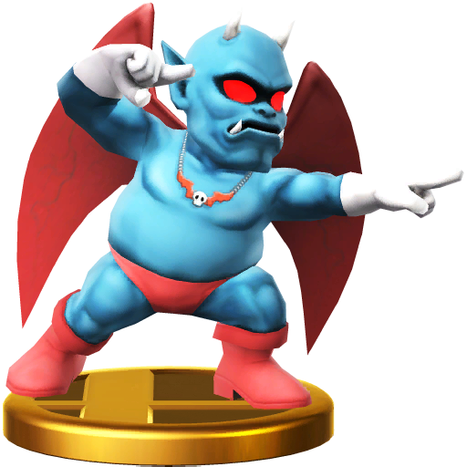</a></th>
    <th><b>Devil</b></th>
    <th>A devil who holds absolute authority in Devil World. When he appears, he'll fly into the sky as a bat and then transform into his devil form. He'll then begin to point frantically in different directions, scrolling the stage where he points. You're...not really helping things, buddy.</th>
  </tr>
  <tr>
    <th><a href="Dillon.png" >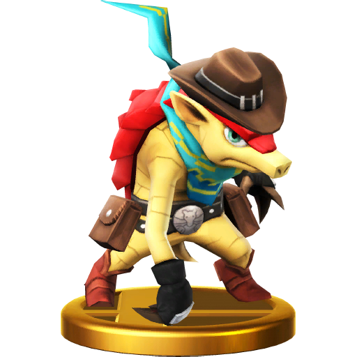</a></th>
    <th><b>Dillon</b></th>
    <th>Only one armadillo can save the village from a Grock invasion, and that's Dillon, a.k.a. the Red Flash. With his trusty claws and roll attacks, he'll take them out one by one. If you summon him to the battle, he'll launch a devastating roll attack and follow it up with his ultimate technique, Arma-Charge, to send foes flying!</th>
  </tr>
  <tr>
    <th></th>
    <th><b>Disc Dog</b></th>
    <th>Instead of a Wii Remote, imagine you're holding a throwing disc in your hand. Swing it just like you would a real disc, and watch it fly across the beautiful beach. In this disc-throwing game, a pup will play fetch! That adorable look on its face as it catches the disc is almost more than we can handle!</th>
  </tr>
  <tr>
    <th></th>
    <th><b>Dr. Kawashima</b></th>
    <th>Dr. Ryuta Kawashima is the neuroscientist behind the Brain Age series. In this game, he sends numbers from 1 to 9 flying onto the screen to crash into one another. If two colliding numbers add up to 10 or more, they'll explode. If the two numbers total 10 exactly, the explosion will be even more impressive!</th>
  </tr>
  <tr>
    <th></th>
    <th><b>Dr. Wright</b></th>
    <th>This hardworking assistant is the most trustworthy partner a mayor could ask for. If trouble strikes your city, he'll be right there to offer advice. In Smash Bros., he'll attack by constructing a building in the middle of the battlefield. It's tough to aim but can launch your foes.</th>
  </tr>
  <tr>
    <th></th>
    <th><b>Elena and Aeron</b></th>
    <th>The main characters of Pandora's Tower. Elena is a kind and spirited young lady who is subjected to a curse that will soon transform her into a terrible monster. Aeron, a young man whose life she once saved, is determined to seek out the only known cure–the flesh of the "masters" lurking within the Thirteen Towers...</th>
  </tr>
  <tr>
    <th><a href="Excitebike.png" >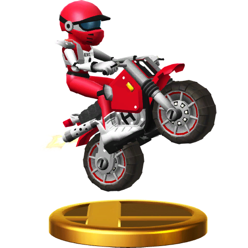</a></th>
    <th><b>Excitebike</b></th>
    <th>Released in 1985, Excitebike was one of the original launch titles for the NES in North America. A happy return to this racing classic, Excitebike: World Rally, was released in 2009 on the Wii. Racers use a variety of techniques in courses set all over the world. You can even make your own tracks!</th>
  </tr>
  <tr>
    <th><a href="Frey.png" >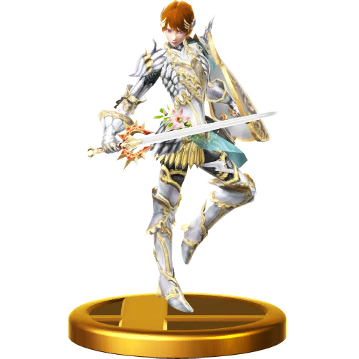</a></th>
    <th><b>Frey</b></th>
    <th>A young god who lives on Asgard, Frey is also a master of the sword. It only takes one look to knew that Frey is no mere mortal, his divinity clear in his appearance and presence. Frey and his sister travel together to Midgard to aid the humans in their battle against an invasion of giants.</th>
  </tr>
  <tr>
    <th><a href="Freya.png" >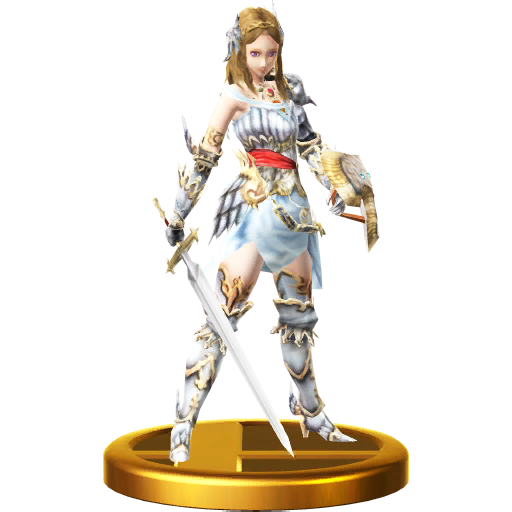</a></th>
    <th><b>Freya</b></th>
    <th>A young goddess from Asgard, she excels at sorcery and only really opens up to her brother, Frey. She joins Frey on his journey to aid the humans of Midgard. She'd always depended on her brother growing up, but after she sees the human race stand against evil forces, she grows into a strong, independent individual.</th>
  </tr>
  <tr>
    <th><a href="Globox.png" >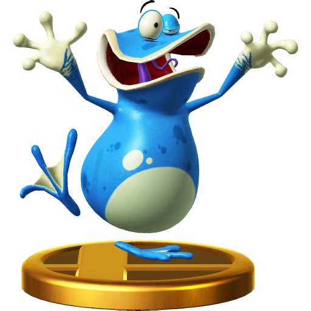</a></th>
    <th><b>Globox</b></th>
    <th>Globox is Rayman's best friend, but Globox's best friends might be food. He's always hungry, but still he tries his best to catch up by running and jumping through unknown terrain. He excels at jumping, probably thanks to his froggy likeness, but he can also fly by flapping his arms. I guess anything's possible in the Glade of Dreams.</th>
  </tr>
  <tr>
    <th></th>
    <th><b>Hang Glider</b></th>
    <th>In the mood to feel less like a pilot and more like a bird? Then forget planes–try hang gliding! Like a bird, you won't have any propellers or engines, so just ride the breeze and take photos from high in the sky. The wind might throw you around a bit, but if you stay calm, you can become one with the wind current.</th>
  </tr>
  <tr>
    <th></th>
    <th><b>Ice Climbers</b></th>
    <th>This pair of adventurers starred in an action game released in 1985. Popo wears blue, and Nana wears red. The goal of their adventure was to reach the top of the mountain, collecting vegetables and defeating animals along the way. Grabbing the condor earned them a nice bonus too!</th>
  </tr>
  <tr>
    <th></th>
    <th><b>Infantry & Tanks</b></th>
    <th>Two units from the Advance Wars series, infantry are best for capturing bases and tanks for fighting the enemy. If summoned, these two form up on the player who activated them. Don't underestimate them just 'cause they're pixels–the infantry's gun and tank's cannon are formidable.</th>
  </tr>
  <tr>
    <th><a href="Inkling.png" >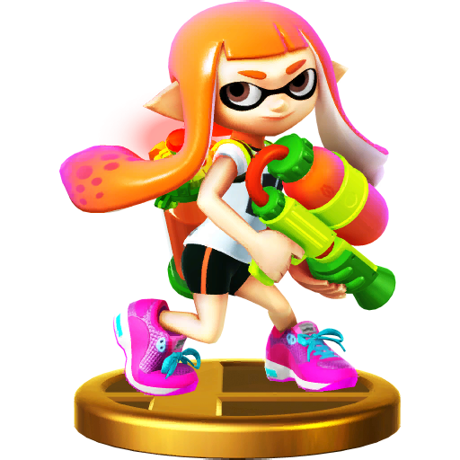</a></th>
    <th><b>Inkling</b></th>
    <th>Meet the Inklings, a mysterious race of beings that can transform into squid at will! They like to octopi their time with frantic, multicolored turf wars, and they won’t miss out on any oppor-tuna-ty to get to the top. And we wouldn’t go so far as to call them cod’s gift to fashion, but check out that fresh style!</th>
  </tr>
  <tr>
    <th></th>
    <th><b>Light Plane</b></th>
    <th>Back in the day when planes had fairly weak engines, two pairs of wings were used to increase the plane's lift. These planes weren't meant for crazy acrobatic tricks, though–they were best suited for learning the basics of flying. Ride these, and leave the complicated stuff for another day!</th>
  </tr>
  <tr>
    <th></th>
    <th><b>Lip's Stick</b></th>
    <th>With this wand in hand, a simple flick of the wrist will sprout a flower from a character's head. If you keep on flicking, the flower grows larger. The bigger the flower, the more nutrients it craves, dealing more and more damage to the host. Shake it off by running around real fast!</th>
  </tr>
  <tr>
    <th></th>
    <th><b>Little Mac (Captain Rainbow)</b></th>
    <th>Wait. Is...is that Little Mac from Punch-Out!!? We'd heard he went to Mimin Island to train to become a world champion again, but it looks like he went a few too many rounds in the ring with those island mangoes. If you don't help him get back in shape, we might need to come up with a new name for him...</th>
  </tr>
  <tr>
    <th></th>
    <th><b>Marshal, Cam, and Miss Ribbon</b></th>
    <th>From the right: Cam, Marshal, and Miss Ribbon. Cam is quiet and looks like a thinker, but his mind is actually a blank slate. Marshal looks cute and can be relied upon. Miss Ribbon looks innocent but is really quite stubborn. Some think these guys are related to the Chorus Kids from the previous Rhythm Heaven.</th>
  </tr>
  <tr>
    <th></th>
    <th><b>Mio & Mayu Amakura</b></th>
    <th>The twins Mayu and Mio are guided to a lost village in the woods by a red butterfly. They explore the village, fighting off the spirits that have been there since a tragic event took place. The unending night leads Mio closer and closer to the truth about the Crimson Sacrifice Ritual.</th>
  </tr>
  <tr>
    <th><a href="Monita.png" >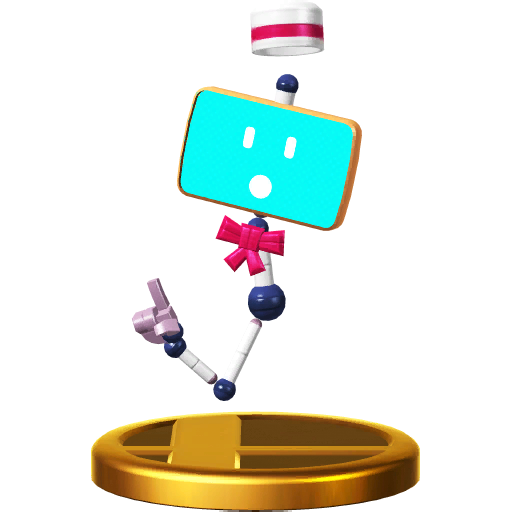</a></th>
    <th><b>Monita</b></th>
    <th>Ever wonder what a Nintendo theme park would be like? Well, there kind of already is one–the Wii U title Nintendo Land–and this robot is your friendly guide as you check out the park's many attractions. Not only does she have a bunch of helpful tips for you, but in Takamaru's Ninja Castle, she also plays the role of the princess!</th>
  </tr>
  <tr>
    <th><a href="nintendog.png" >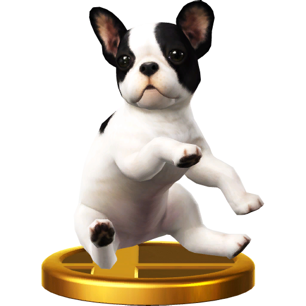</a></th>
    <th><b>nintendog</b></th>
    <th>This is one of the many adorable dogs you can care for in nintendogs + cats. It's hard for them to wag their little tails, but they make up for it with that cute face. In Smash Bros., they want to get right up in your face, blocking your view of the battle. They just want to be loved!</th>
  </tr>
  <tr>
    <th><a href="Plane.png" >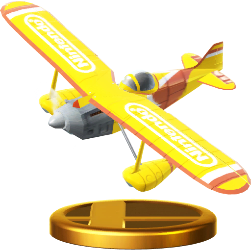</a></th>
    <th><b>Plane</b></th>
    <th>To get to fly a plane around a tropical resort, normally you'd need to study really hard, take a flying test, fail the test, retake the test, get your license, save up for ages, and then go to a tropical island. In Pilotwings Resort, you get to skip those boring parts and experience speeding, turning, and rolling high in the air right away! Woo!</th>
  </tr>
  <tr>
    <th></th>
    <th><b>Power Cruising</b></th>
    <th>A vehicle that speeds across the waves like a marine motorbike. The handlebars you use to control its direction and speed are a lot like a motorbike's too. In Wii Sports Resort, you use the Wii Remote and Nunchuk to mimic these handlebars. All that's missing are waves splashing against your face!</th>
  </tr>
  <tr>
    <th></th>
    <th><b>Prince of Sablé</b></th>
    <th>A naive but kind prince in the Game Boy title Kaeru no Tame ni Kane wa Naru. He sets off on a journey to the Mille-Feuille Kingdom to rescue the kidnapped Princess Tiramisu. If you summon him in this game, he'll turn into either a frog or a snake. When a foe gets close, he'll kick up a cloud of white smoke and go on the offensive.</th>
  </tr>
  <tr>
    <th><a href="Rayman.png" >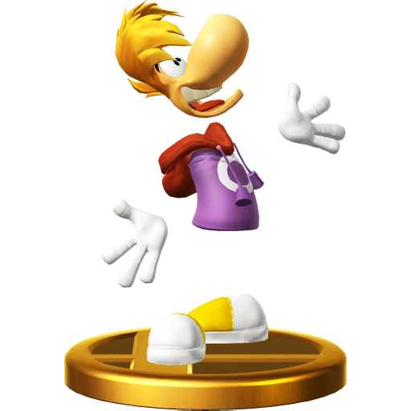</a></th>
    <th><b>Rayman</b></th>
    <th>Dashing and jumping are just the start–Rayman shows off all kinds of moves as he fights to save the Glade of Dreams! And no matter how many times he falls, he'll always get back up again. What? Always? That's right! This guy's got no time to waste on game overs. It's right back to resucing the Teensies, every time.</th>
  </tr>
  <tr>
    <th></th>
    <th><b>Rocket Belt</b></th>
    <th>This item is basically two jet engines with a belt connecting them. If you pick it up, you'll be able to soar through the air. It has a limited amount of fuel, but it can recharge when you're on the ground. It's especially helpful for returning to the stage when you've been launched.</th>
  </tr>
  <tr>
    <th></th>
    <th><b>Saki Amamiya</b></th>
    <th>The main character of Sin and Punishment, he is often mistaken for a girl because of his...interesting...hairstyle. Resurrected by the blood of Achi, he has gained superhuman powers. When summoned, he'll target the closest opponents and unleash his powerful gunsword.</th>
  </tr>
  <tr>
    <th><a href="Sheriff.png" >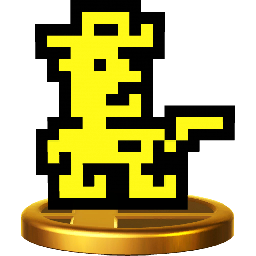</a></th>
    <th><b>Sheriff</b></th>
    <th>This arcade game was released in 1979 in Japan. The game used an eight-direction joystick and a switch to control the title character. In Smash Bros., the sheriff will appear in his original glory and fire in eight directions. The bullets are tough to dodge, and they pack a serious punch.</th>
  </tr>
  <tr>
    <th></th>
    <th><b>Special Flag</b></th>
    <th>This item appeared as a hidden object in the 1983 arcade game Xevious. Picking one up would give you an extra life. In Smash Bros., it shows up for you to grab during battles. It may seem like nothing is happening, but holding it high will earn you an extra stock in a stock battle or a KO in a timed battle.</th>
  </tr>
  <tr>
    <th><a href="Starfy.png" >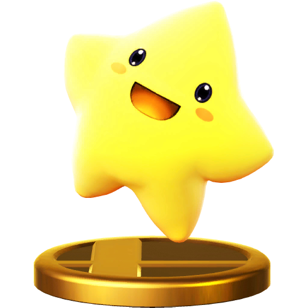</a></th>
    <th><b>Starfy</b></th>
    <th>Starfy is the absentminded prince of the Pufftop Kingdom, and the hero of The Legendary Starfy. Is he a star? A starfish? His commitment to helping you when summoned is obvious, even if his species isn't. He'll use a Star Spin attack, which isn't all that powerful. It's the thought that counts!</th>
  </tr>
  <tr>
    <th></th>
    <th><b>Steel Diver</b></th>
    <th>This weapon is modeled after the ND-03 Blue Shark, a balanced submarine that appears in Steel Diver. It fires small, torpedo-shaped projectiles that pick up speed as they travel horizontally. Don't dismiss them based on their size–these tiny shots pack a punch!</th>
  </tr>
  <tr>
    <th></th>
    <th><b>Super Scope</b></th>
    <th>This wireless weapon from the SNES era can be used kind of like a bazooka in battle. Press the attack button rapidly to spray shots, or hold it down to charge up a powerful blast. The weapon's ammo won't last forever, however, so try not to get caught without juice left in your batteries.</th>
  </tr>
  <tr>
    <th><a href="Takamaru.png" >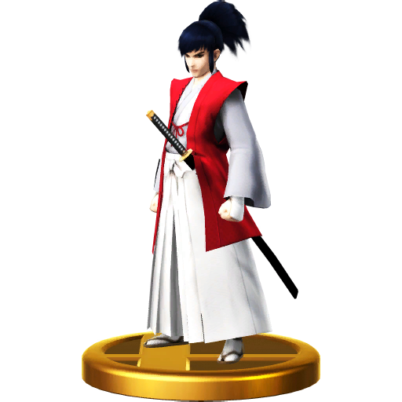</a></th>
    <th><b>Takamaru</b></th>
    <th>The main character of The Mysterious Murasame Castle. In this game, he dashes and jumps straight to the nearest opponent and shows off his swift sword skills. If he's got a bit of distance, he uses his special ninja techniques, based on the rook and the bishop in Japanese chess, to send projectiles spinning through the air.</th>
  </tr>
  <tr>
    <th></th>
    <th><b>Turbo Jet</b></th>
    <th>This is a special version of the plane you start with, and you can unlock it once you start Mission Mode. The really amazing feature is how it can take off and land on water. Don't take this plane for an aerial cruise–it's meant to soar on speedy, exciting flights.</th>
  </tr>
  <tr>
    <th><a href="Unira.png" >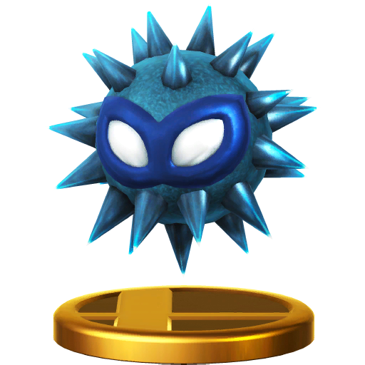</a></th>
    <th><b>Unira</b></th>
    <th>What a cute little creature! You just want to... Oh, wait–those spikes aren't just for show! Once thrown or attacked, its spikes extend out and hurt anyone but the character who threw it. Attacking it again can make the spikes retract, so you could even throw it back at the original owner.</th>
  </tr>
  <tr>
    <th><a href="Vince.png" >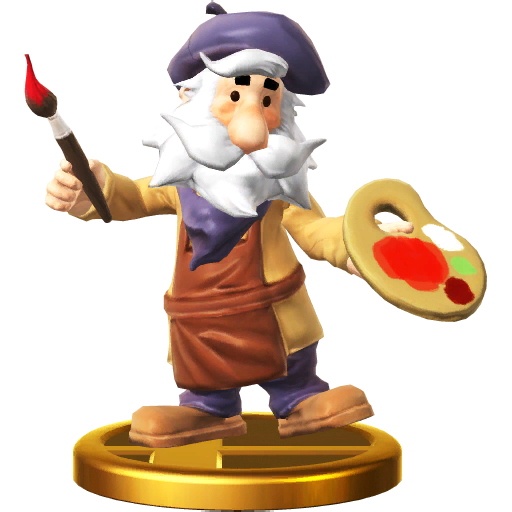</a></th>
    <th><b>Vince</b></th>
    <th>His real name is Vincent, but he prefers the shortened version. Maybe it's to help put you at ease. This great artist will teach you all sorts of techniques to help you produce a real masterpiece of your very own. Pretty nice of him, right? Once you get the hang of things, why not draw a portrait of Vince himself to say thanks?</th>
  </tr>
  <tr>
    <th><a href="Viruses.png" >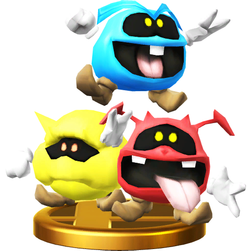</a></th>
    <th><b>Viruses</b></th>
    <th>At the forefront of medical science, you have to be equal to whatever nature throws your way–that's why Dr. Mario's medicine cabinet includes red, blue, and yellow capsules to combat these red, blue, and yellow viruses! Over 20 years after Mario first took up medicine, Luigi joined the fight with his new L-shaped vitamin.</th>
  </tr>
  <tr>
    <th><a href="Wonder-Black.png" >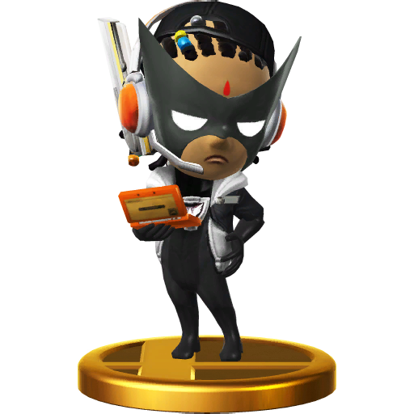</a></th>
    <th><b>Wonder-Black</b></th>
    <th>Wonder-Black, the 8-Bit Enchanter from India, has an IQ of over 300. He's only 11 years old, but he's already made countless contributions to the effort to protect the planet. His signature Time Bomb move is a great example. Instead of causing destruction, it slows time in the blast range. That's amazing–all we made at 11 was a baking-soda volcano...</th>
  </tr>
  <tr>
    <th><a href="Wonder-Blue.png" >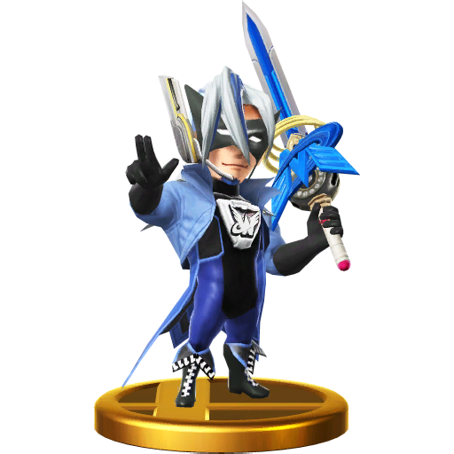</a></th>
    <th><b>Wonder-Blue</b></th>
    <th>A Wonderful One from the Los Angeles field office. Even off duty, he's a dashing police detective...but he can be a little clumsy at times. He resents Wonder-Red for taking the role of leader despite being new to the team, and the two have a caustic relationship. Still, his trademark Unite Sword attack is a valuable asset.</th>
  </tr>
  <tr>
    <th><a href="Wonder-Green.png" >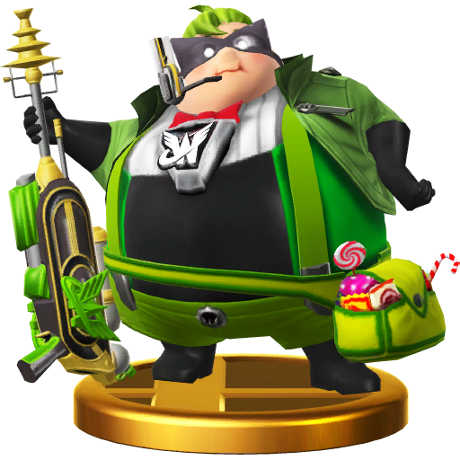</a></th>
    <th><b>Wonder-Green</b></th>
    <th>This Wonderful One from the Bordeaux field office in France isn't really one for escargot–he's all about the junk food. Despite still being in middle school, he's a superb sniper. His trademark Unite Gun technique needs no bullets... He's firing his fellow heroes instead. That's a scary level of teamwork!</th>
  </tr>
  <tr>
    <th><a href="Wonder-Pink.png" >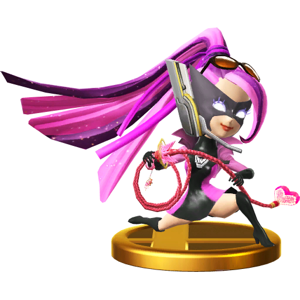</a></th>
    <th><b>Wonder-Pink</b></th>
    <th>A high schooler from Romania whose physical abilities are so impressive, she even represented her country as an Olympic gymnast. With her Unite Whip technique and her Queen of Rage moniker, you'd think she'd not be one to mess with, but Wonder-Green seems to enjoy provoking her. Well, to each his own...</th>
  </tr>
  <tr>
    <th><a href="Wonder-Red.png" >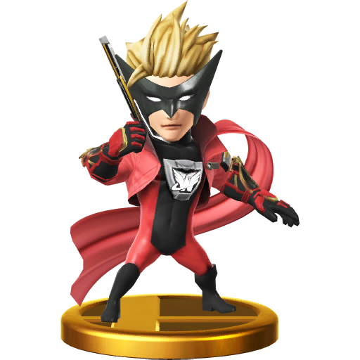</a></th>
    <th><b>Wonder-Red</b></th>
    <th>Usually a single hero is enough, right? But having more–like a team of seven–would be better. So wouldn't having 100 be REALLY good? That was Wonder Red's logic when he joined the planetary-protection team called the Wonderful 100. He also teaches when he isn't saving the world. Superheroes need day jobs too.</th>
  </tr>
  <tr>
    <th><a href="Wonder-White.png" >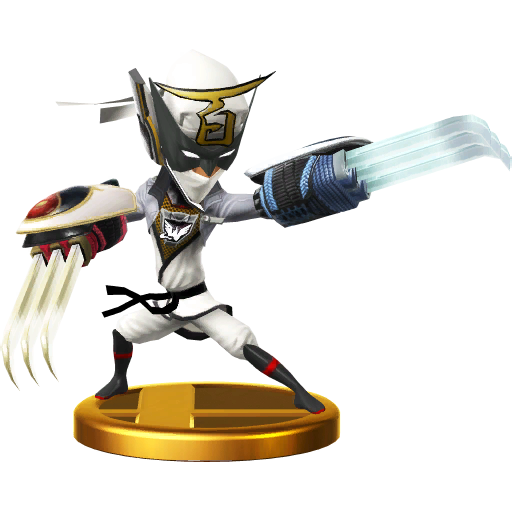</a></th>
    <th><b>Wonder-White</b></th>
    <th>Ichi: Do unto others! Ni: Home is where the heart is! ...No, we don't know what he's talking about either, but there's no doubting the potency of the claws he wields–apparently a family treasure–or his Wonderful Ryu ninja fighting style. He claims to have 100 proverbs in all, but there's no room to list them all here.</th>
  </tr>
  <tr>
    <th><a href="Wonder-Yellow.png" >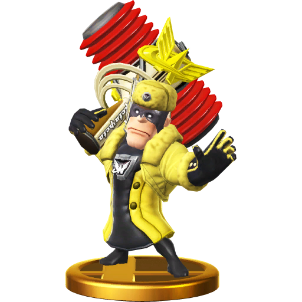</a></th>
    <th><b>Wonder-Yellow</b></th>
    <th>This Wonderful One brought his gigantic hammer all the way from Siberia. With his large stature and few words, many find him intimidating, but he's actually a kind and honest family man. And there's really no one better to have beside you in the field–his experience in the Russian military is invaluable in battle.</th>
  </tr>
  <tr>
    <th></th>
    <th><b>Wrestler & Reporter</b></th>
    <th>Live from the Rhythm Arena! When the reporter asks, "Wubbadubbadubba, 'zat true?" the wrestler will answer on the beat. When the reporter is amazed and says, "Whoa, you go, big guy!" the wrestler will flex and pose. Finally, when the other reporters request the wrestler to "pose for the fans!" he will do just that. Wubbadubbadubba, that's cool!</th>
  </tr>
  <tr>
    <th></th>
    <th><b>Wuhu Island</b></th>
    <th>The tropical island from Wii Sports Resort is the perfect place to enjoy a few sporting activities. Go on a close tour of it by selecting the Wuhu Island stage, or get a bird's-eye view of the island with the Pilotwings stage. Just don't get too awestruck–with the stage constantly changing under your feet, you can't afford to lose focus!</th>
  </tr>
  <tr>
    <th><a href="Zael.png" >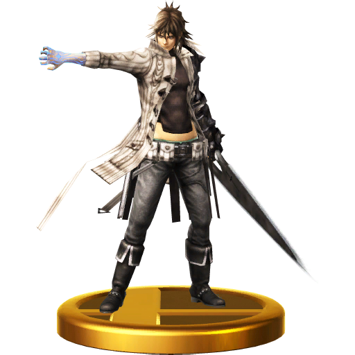</a></th>
    <th><b>Zael</b></th>
    <th>When Zael was orphaned, the closest thing he had to his family was Dagran, the leader of a mercenary team. Zael became a mercenary too but began to question whether it was the right path to follow. After a fateful meeting with Calista, however, he decided to pursue his dream–one he's always had: to become a knight.</th>
  </tr>
</table>

