

Listed below are all the trophies on the Wii U version of the 4th installment of Super Smash Bros. 
  
The trophies' names and descriptions are taken from the PAL release of the game.  To view the North American version's page, <a href="http://staff.starmen.net/ssb4/Trophies/index.php"><b>click here.</b></a>
  

<a href="#animalcrossing">Animal Crossing</a> / <a href="#bayonetta">Bayonetta</a> / <a href="#donkeykong">Donkey Kong</a> / <a href="#duckhunt">Duck Hunt</a> / <a href="#finalfantasy">Final Fantasy</a> / <a href="#fzero">F-Zero</a> / <a href="#kidicarus">Kid Icarus</a> / <a href="#kirby">Kirby</a> / <a href="#megaman">Mega Man</a> / <a href="#metroid">Metroid</a> / <a href="#mother">Mother</a> / <a href="#pacman">PAC-MAN</a> / <a href="#pikmin">Pikmin</a> / <a href="#pokemon">Pokemon</a> / <a href="#punchout">Punch-Out</a> / <a href="#sonicthehedgehog">Sonic the Hedgehog</a> / <a href="#starfox">Star Fox</a> / <a href="#supermario">Super Mario</a> / <a href="#supersmashbros">Super Smash Bros.</a> / <a href="#wario">Wario</a> / <a href="#wiifit">Wii Fit</a> / <a href="#xenobladechronicles">Xenoblade Chronicles</a> / <a href="#yoshisisland">Yoshi's Island</a> / <a href="#other">Other</a>




<table class="fixed" border="1">
    <col width="150px" />
    <col width="100px" />
    <col width="600px" />

  <tr>
    <th></th>
    <th><b>Able Sisters</b></th>
    <td>
The three Able sisters are like chalk and cheese...and thread, but running a clothes shop makes good use of their strengths: Sable works quietly at the sewing machine, Labelle sells accessories, and the cheerful Mabel welcomes people in. Despite their quirks, they get along well...usually.
</td>
  </tr>
  <tr>
    <th><a href="Beehive.png" >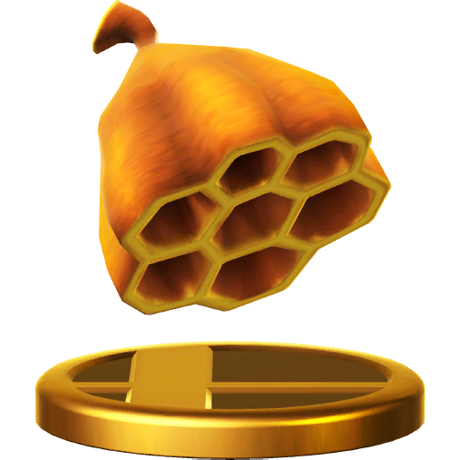</a></th>
    <th><b>Beehive</b></th>
    <td>
Bees don't like it when people destroy their home, so if you break a beehive, they'll come out looking for revenge. Even if you innocently had the beehive thrown at you, you'll be the target. You can dodge all you want, but they'll probably get you in the end, and their stings'll do a LOT of damage.
</td>
  </tr>
  <tr>
    <th><a href="Blathers.png" >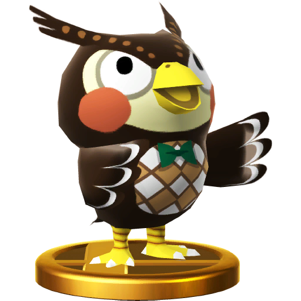</a></th>
    <th><b>Blathers</b></th>
    <td>
Blathers is the perfect owl to be in charge of the town museum. He knows all there is to know about fossils, fish, and art, but he's a little squeamish when it comes to bugs. Probably had a bad experience back when he was an owlet... Anyway, pop over to the museum during the day to catch him "resting his eyes".
</td>
  </tr>
  <tr>
    <th><a href="Brewster.png" >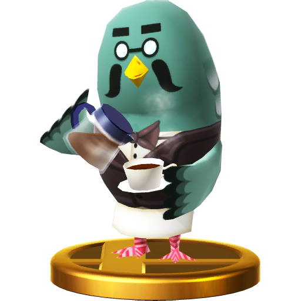</a></th>
    <th><b>Brewster</b></th>
    <td>
Stop in at the Roost to see Brewster behind the counter, ready to serve you a cup of his original blend. You know you've become a regular when he starts being a bit more chatty. He's never too aloof, never too "in your face" - he's just nice to be around whenever you feel like having a pigeon-milk latte.
</td>
  </tr>
  <tr>
    <th></th>
    <th><b>Bus to the City</b></th>
    <td>
The bus that takes you into the city in Animal Crossing: City Folk. It's free 24/7 and driven by a certain someone you might recognize (you might have also seen him driving a boat or a taxi). Take the bus anytime to see places like the theatre and the art gallery, and try visiting at night to see some places that are usually closed.
</td>
  </tr>
  <tr>
    <th><a href="Celeste.png" >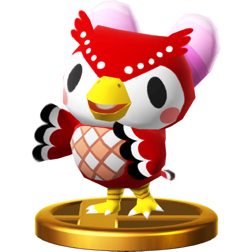</a></th>
    <th><b>Celeste</b></th>
    <td>
Go to the town museum during the day to see Celeste working there. Working...and snoozing. You can't really blame her, though - she is an owl! If you ever need her help with something, just talk to her and she'll wake right up. If you don't need her help, though, maybe you should be nice and let her keep dreaming!
</td>
  </tr>
  <tr>
    <th><a href="Don.png" >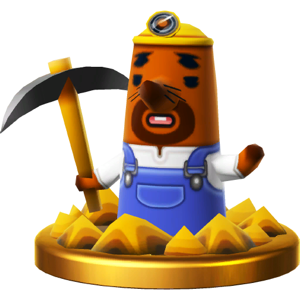</a></th>
    <th><b>Don Resetti</b></th>
    <td>
This chap runs the Reset Surveillance Center with his brother, the fabled scolder Mr. Resetti (first name: Sonny). Their job is to warn players who switch off without saving. Don's gentle about it, though. He'll say stuff like, "Resettin' ain't no good. So, um, don't do it!" If you get caught resetting, just hope it's Don's face you see.
</td>
  </tr>
  <tr>
    <th></th>
    <th><b>Dream Home</b></th>
    <td>
If you're wanting to buy a house in Animal Crossing, Tom Nook is always happy to help. And it looks like he's expanding his business to Smash Bros, too. If you activate the Villager's Final Smash, Nook will rush in and build a house for you right then and there! One small, very minor difference between this house and ones in the original game? This one explodes.
</td>
</tr>
  <tr>
    <th></th>
    <th><b>Dr. Shrunk</b></th>
    <td>
Dr. Shrunk used to be a comedian, and he looks the part. He doesn't do just any old jokes, though - he does Reaction Jokes, which are, erm...even funnier! Visit Club LOL before it opens and give him a yummy present to get a does of comedy, Shrunk style.
</td>
  </tr>
  <tr>
    <th><a href="Frillard.png" >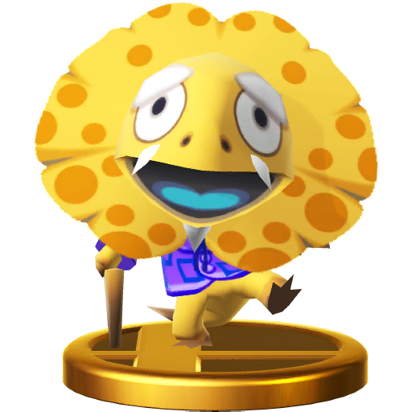</a></th>
    <th><b>Frillard</b></th>
    <td>
Ready for a thrill? Frillard's getting on a bit, so he doesn't appear in the theatre very often. If you're lucky enough to catch one of his shows, watch him spread that frill of his and prepare to see emotion in motion! Hard as his student Dr. Shrunk may try, that gag where he spreads his frill is one that only the master can pull off.
</td>
  </tr>
  <tr>
    <th><a href="Gracie.png" >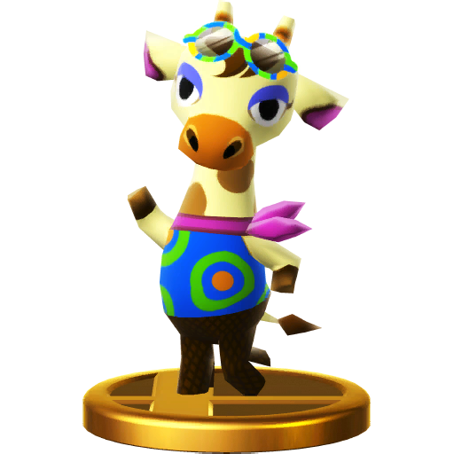</a></th>
    <th><b>Gracie</b></th>
    <td>
Gracie is a celebrity fashion designer and can be pretty blunt about what she thinks of other people's clothes. Want to know whether your outfit is hip or hippy? Then go and see her for one of her famous "fashion checks"! Gracie also runs her own little boutique, which she sees as a sanctuary from all the awful style choices.
</td>
  </tr>
  <tr>
    <th><a href="Harriet.png" >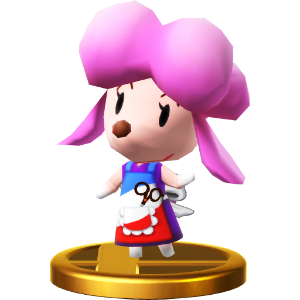</a></th>
    <th><b>Harriet</b></th>
    <td>
If you want a haircut that'll make you feel brand new, pay a visit to Harriet's salon. Shampoodle. She'll ask you a few quick questions, and before you can say "sugar", you'll have the hairdo of your dreams. And since Animal Crossing: Let's Go to the City, she's also been able to give special makeovers that leave you looking like a Mii!
</td>
  </tr>
  <tr>
    <th><a href="Isabelle.png" >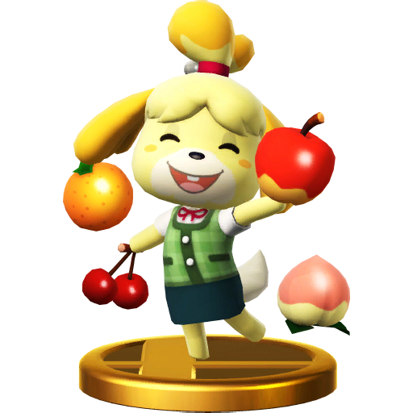</a></th>
    <th><b>Isabelle</b></th>
    <td>
Isabelle's the mayor's secretary, and you couldn't ask for someone more on the ball! Well...maybe you could, but she's still full of useful info about life in the town. With her fringe and tied-up hair, she looks just like a shih-tzu! That's because she is one. And so is her twin brother, Digby.
</td>
  </tr>
  <tr>
    <th><a href="Jingle.png" >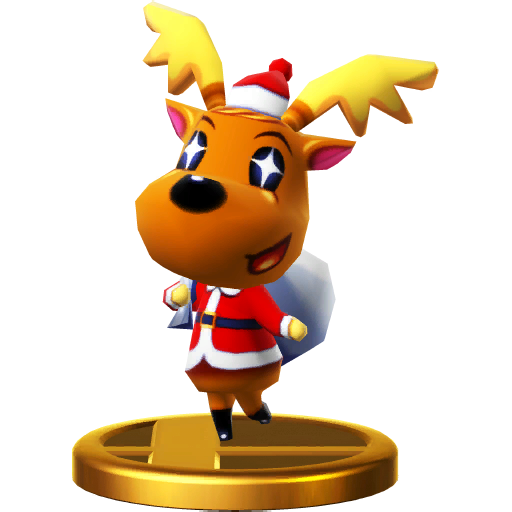</a></th>
    <th><b>Jingle</b></th>
    <td>
Happy Toy Day! (If it's not Toy Day, then... happy other-time-of-the-year!) Jingle's a festive reindeer who stops by once a year. If you happen to be dressed as Santa and have a bit of free time on your hands, why not help him out? Just imagine the looks on your neighbors' faces when they get a present personally delivered by Santa!
</td>
  </tr>
  <tr>
    <th><a href="Joan.png" >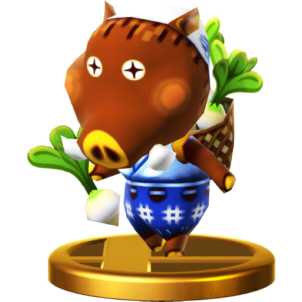</a></th>
    <th><b>Joan</b></th>
    <td>
Joan has been in the business of selling turnips for about 60 years now, and she'll happily explain the basics when you talk to her. It's entirely up to you if you want to take the risk, though. If you do decide to, you'll want to check prices often. And it doesn't hurt to ask your friends about their prices too.
</td>
  </tr>
  <tr>
    <th><a href="Katie.png" >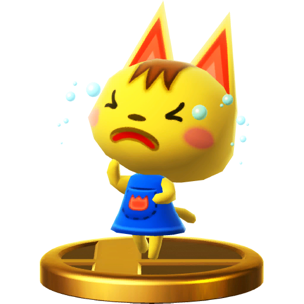</a></th>
    <th><b>Katie</b></th>
    <td>
After playing with a friend, you might spot a lost little kitten crying in your town. Thankfully, she knows where her mum should be waiting. If you offer to take her there, she'll toddle along behind as you lead the way. You'll help out this poor kitten, won't you? It's what any decent person would do! (Also, there's a reward.)
</td>
  </tr>
  <tr>
    <th><a href="Katrina.png" >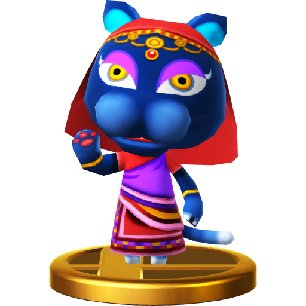</a></th>
    <th><b>Katrina</b></th>
    <td>
A panther in mystical clothes who tells fortunes. Once in a while she'll set up her tent in town. Visit her for a teaser of what's in store for you - including what item will bring you luck that day. She bases her predictions on your birthday, so make sure you enter it correctly! If you put it in wrong, that would be...un-fortune-ate!
</td>
  </tr>
  <tr>
    <th><a href="Kicks.png" >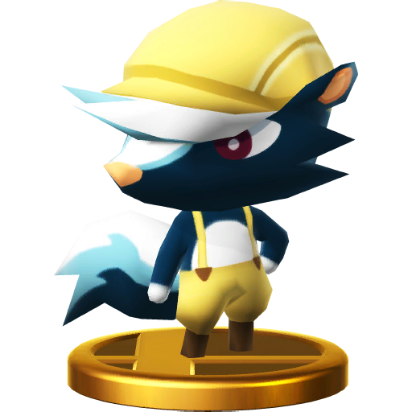</a></th>
    <th><b>Kicks</b></th>
    <td>
Hello, chum! This friendly shoe shop owner used to shine shoes in the city, but now he's managed to save up enough money for his own little shop in town. His outfit might make him look like he sweeps chimneys for a living, but don't worry - you definitely won't find any soot on his wares, awright?
</td>
  </tr>
  <tr>
    <th></th>
    <th><b>K.K. Slider</b></th>
    <td>
Fans of this groovy dog just can't wait for his live show every Saturday night. With his trusty acoustic guitar, he'll treat you to such delights as the K.K. Samba, the K.K. Waltz and the K.K. Stroll. He even takes requests! In Animal Crossing: New Leaf, you can also find him on other days of the week working as a DJ at Club LOL.
</td>
  </tr>
  <tr>
    <th><a href="Lloid.png" >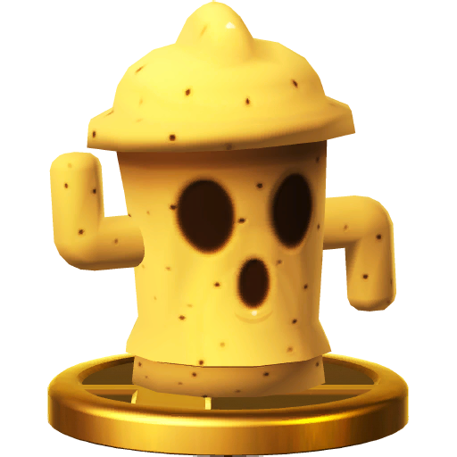</a></th>
    <th><b>Lloid</b></th>
    <td>
Gyroids are a common sight in the Animal Crossing series. In Animal Crossing: New Leaf, a Gyroid named Lloid dons a helmet and collects funds for public works. The Villager makes use of a rocket-powered Lloid for his side special. The further he flies, the more damage he'll do when he crashes into someone!
</td>
</tr>
  <tr>
    <th><a href="Lyle.png" >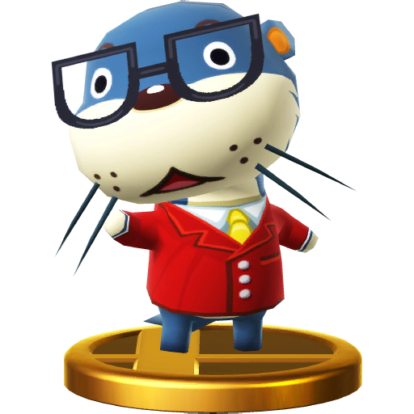</a></th>
    <th><b>Lyle</b></th>
    <td>
Lyle has played a few roles over the years, and in Animal Crossing: New Leaf, he's in charge of the Happy Home Academy. Feel free to drop by for a chat or to ask him how the HHA ranks your home. Lyle wasn't a big fan of this kind of work in the past, but he really seems to enjoy it this time. You could say he's turned over a new leaf!
</td>
  </tr>
  <tr>
    <th><a href="Resetti.png" >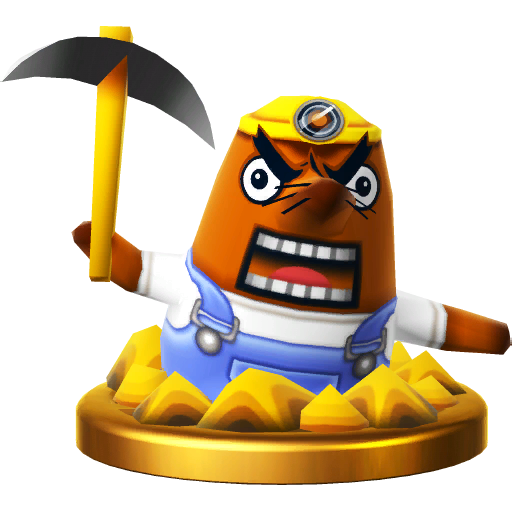</a></th>
    <th><b>Mr. Resetti</b></th>
    <td>
Forget to save your game before stopping for the day? "GRRAAAAH!" You're going to hear from Mr. Resetti! He and his brother, Don, keep an eye out for reckless resetting and give you a, er...gentle reminder not to. Tempted to "forget" so you can meet them again? Don't. Just don't.
</td>
  </tr>
  <tr>
    <th><a href="Pascal.png" >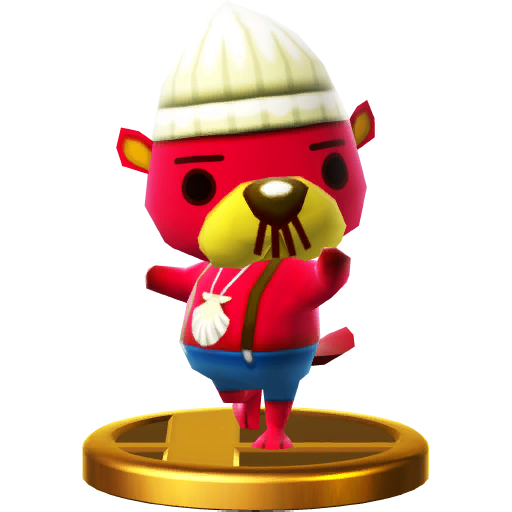</a></th>
    <th><b>Pascal</b></th>
    <td>
The philosophical wisdom of Pascal comes in all shapes and sizes. Some of his musings will leave you mildly puzzled: "You ever tried to play an oboe underwater, maaan? It ain't easy." Others will leave you flat-out baffled: "You can't fool physics, maaan. That guy knows EVERYTHING!" Give him a scallop and see what he says!
</td>
  </tr>
  <tr>
    <th><a href="Phineas.png" >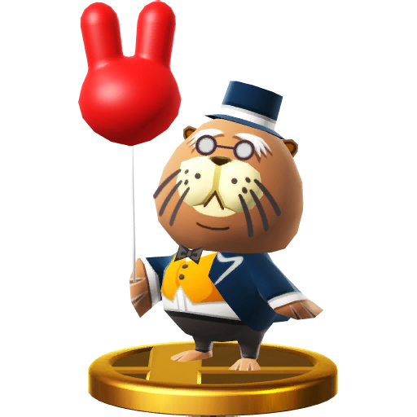</a></th>
    <th><b>Phineas</b></th>
    <td>
On sunny days near the fountain in the big city, you'll sometimes find a friendly fur seal called Phineas. He's also known as the prize man, and he's got fun things for everyone! He's got round balloons, bunny balloons, spinning pinwheels and bubble wands. How much, you ask? Why, all he wants in return is your smile.
</td>
  </tr>
  <tr>
    <th></th>
    <th><b>Phyllis & Pelly</b></th>
    <td>
The pelican sisters both work at the Post Office. Phyllis (the one with all the make-up on) handles the night shifts, and Pelly takes care of things during the day. Pelly fancies the delivery boy, Pete, but he actually has feelings for Phyllis. Awkwaaarrrd! At least they never let the drama distract them from doing their jobs!
</td>
  </tr>
  <tr>
    <th><a href="Pitfall.png" >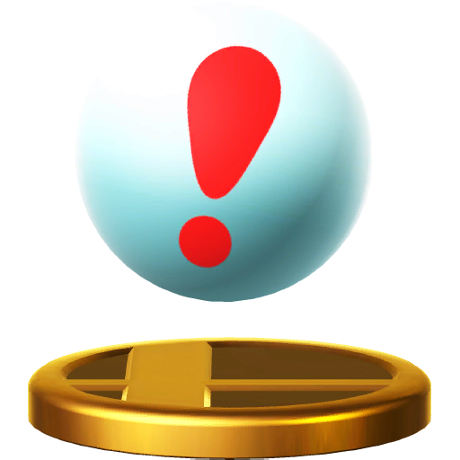</a></th>
    <th><b>Pitfall</b></th>
    <td>
Bury this item anywhere you like, then wait for an unsuspecting fighter to step on it. They'll drop into a hole and be stuck there, giving you the chance to practise your best smashes on them. If that's not for you, try hitting your opponent with it in mid-air for a devastating meteor smash!
</td>
</tr>
  <tr>
    <th><a href="Redd.png" >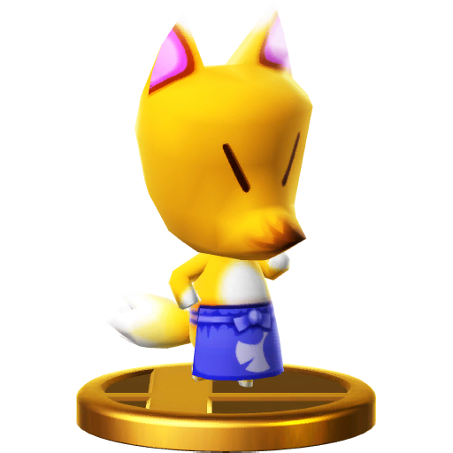</a></th>
    <th><b>Redd</b></th>
    <td>
The owner of a gallery selling fine art. He tends to butter up his customers, telling them whatever they look at is an amazing find. But beware! Sometimes fakes get mixed in with the genuine masterpieces. Whether he's aware of it or not, Redd is running one shady operation.
</td>
  </tr>
  <tr>
    <th><a href="Rover.png" >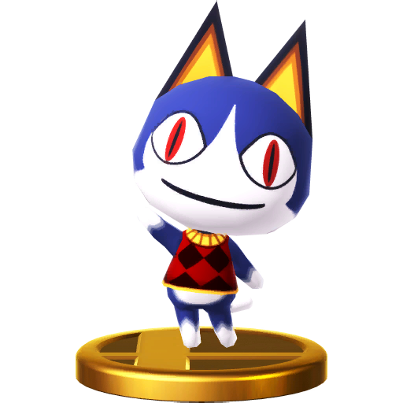</a></th>
    <th><b>Rover</b></th>
    <td>
Always thrilled to meet new people on the move, he'll ask you your name and where you're moving to. Don't just answer with random nonsense, though. After all, you'll be stuck with the answers you give, and who wants to live in a town called "AAAAAAAA"?!
</td>
  </tr>
  <tr>
    <th><a href="Saharah.png" >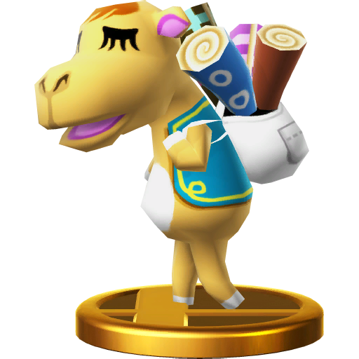</a></th>
    <th><b>Saharah</b></th>
    <td>
A trader from a faraway land who's big on interior design. She doesn't have her own store, instead carrying her wares around as a travelling merchant - it's hard to tell where you'll find her next! She claims to have many wallpapers for the papering of walls, and carpets for the...petting of cars? Nobody's quite sure if she's being serious.
</td>
  </tr>
  <tr>
    <th><a href="Serena.png" >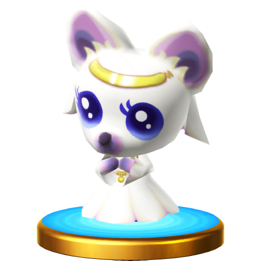</a></th>
    <th><b>Serena</b></th>
    <td>
If you throw an axe into the fountain, POOF, Serena appears. Ever hear that "Honesty is the best policy"? Well, with Serena, that's not always the case. In fact, if she's giving you a life lesson at all, it's that dealing with unpredictable people can be... unpredictable! Who knew throwing an axe into a fountain would turn out to be so educational?
</td>
  </tr>
  <tr>
    <th></th>
    <th><b>Timmy & Tommy</b></th>
    <td>
These twin brothers start off with the little shop Nookling Junction, but they seem to have learned a little something from Tom Nook, and it doesn't take long before the T&T Emporium is open for business! (So fancy.) But no matter how big and impressive their shops get, they've still got a lot to learn...
</td>
</tr>
  <tr>
    <th></th>
    <th><b>Tom Nook</b></th>
    <td>
The owner of Nookington's, yes, yes. ..."Yes, yes" is sort of a reassuring catchphrase of his that totally removes any lingering feeling that he might be trying to swindle you out of your hard-earned cash. What an upstanding businessman, yes, yes!
</td>
</tr>
  <tr>
    <th></th>
    <th><b>Town and City</b></th>
    <td>
Get a bird's-eye view of the town and city from Animal Crossing: City Folk as you fight on a platform overhead. Your Wii U console's clock dictates the time of day and which animals and places appear. Don't get too distracted by all that, though, because the platform itself is pretty simple-perfect for a battle of skill!
</td>
  </tr>
  <tr>
    <th><a href="Villager.png" >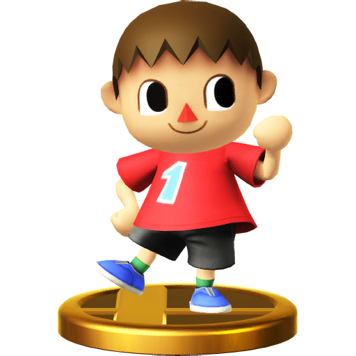</a></th>
    <th>Villager</th>
    <td>
This chipper chap came all the way from his quiet little village to do a bit of aerial sightseeing, take Lloid out for a spin, look after the trees and maybe do some bowling. If you're very lucky, he might even bring along Tom Nook and the Nooklings and throw everyone a party. Gosh, this all sounds like such fun!
</td></tr>

  <tr>
    <th></th>
    <th>Villager (Alt.)</th>
    <td>
This girl's special moves are very special indeed. The standard one lets you pocket items, projectiles and even laser beams, then use them by pressing the button again. Her down special plants a tree, which you can water and finally chop down to hurt other fighters. Or you can leave the tree alone and attack with the axe. Up to you.
</td></tr>

  <tr>
    <th><a href="Wendell.png" >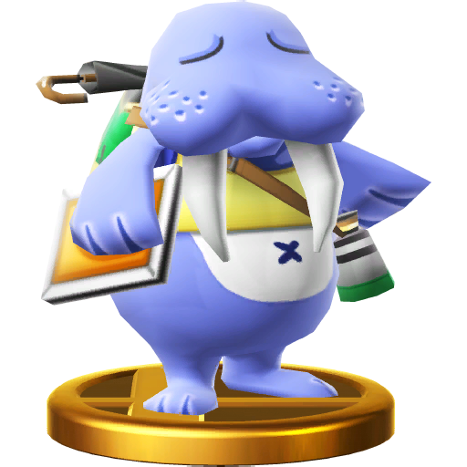</a></th>
    <th><b>Wendell</b></th>
    <td>
A travelling artist with a big appetite. Since he's a walrus, you might think he'd only eat fish, but he'll also gobble up fruit, nuts and...pretty much anything. You could say he's a fan of the "sea food diet". In Animal Crossing: New Leaf, he only appears in dreams, when you visit the Dream Suite. At least then he's not too hungry!
</td>
  </tr>
  <tr>
    <th><a href="Wisp.png" >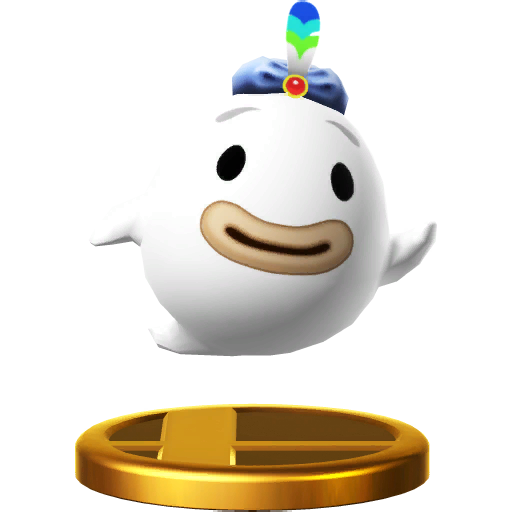</a></th>
    <th><b>Wisp</b></th>
    <td>
When cute lil Wisp shows up in the first Animal Crossing, he shyly asks players to help him collect five spirits before dawn. Surprisingly, you can just use any old bug net for the job! In Animal Crossing: Let's Go to the City, he appears as a lamp spirit with a fear of ghosts. Odd thing for a spirit to be scared of, don't you think?
</td>
  </tr>
</table>



<table class="fixed" border="1">
    <col width="150px" />
    <col width="100px" />
    <col width="600px" />
  <tr>
    <th><a href="Bayonetta.png" >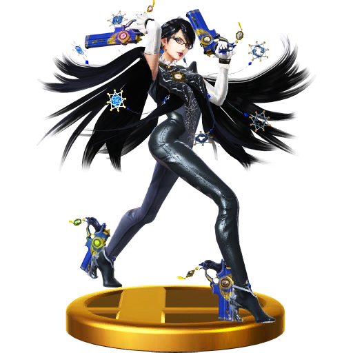</a></th>
    <th><b>Bayonetta</b></th>
    <th>Bayonetta is one of the last of the long-extinct Umbra Witches clan. She's a master of the Bullet Arts, and can use her hair as a conduit to bring forth Infernal Demons. She brings all these skills and more to Smash, where if you hold down the attack button, she'll fire bullets at the enemy. They don't just do damage; they even work as a feint!</th>
  </tr>
  <tr>
    <th></th>
    <th><b>Bayonetta (Alt.)</b></th>
    <th>If you use Bayonetta's side special in midair, she'll do a diagonal kick upward that goes through platforms. If you press down just before doing the move, it'll turn into a downward attack! Plus, if you hit an enemy in midair, you can use the attack again before you hit the ground–great for combos and recoveries!</th>
  </tr>
  <tr>
    <th></th>
    <th><b>Bayonetta (Original)</b></th>
    <th>This Umbra Witch awakens after hundreds of years without any memories of her past life. She spends her days with shenanigans like dressing as a nun to lure out angels to fight, until a witch with the same powers as her starts to slowly bring her memories back. As her memories return, she ends up embroiled in a battle to save the world!</th>
  </tr>
  <tr>
    <th><a href="Cereza.png" >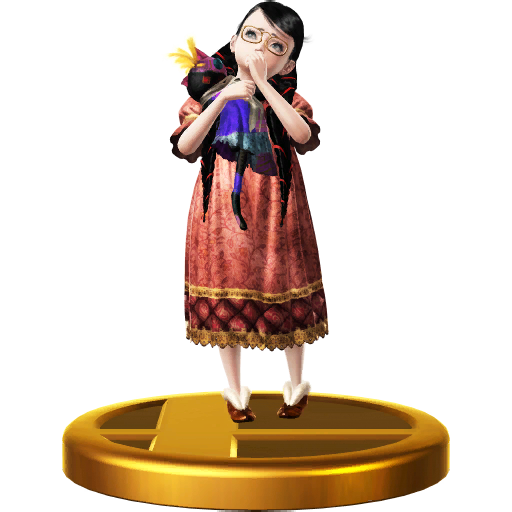</a></th>
    <th><b>Cereza</b></th>
    <th>A small girl Bayonetta finds wandering the stronghold city of Vigrid with her stuffed toy, Chesire. For some reason, Cereza is convinced Bayonetta is her "mummy" and wants to be just like her. No human should be able to see angels, but somehow Cereza can...</th>
  </tr>
  <tr>
    <th></th>
    <th><b>Infernal Climax</b></th>
    <th>Before her Final Smash, Bayonetta encounters Witch Time, during which she can attack the enemy to fill her magic gauge. If it fills up, she summons the demon Gomorrah, who chomps down on the unfortunate foe! Keep pressing the button during Gomorrah's attack to increase damage. If it hits 100% the enemy will be instantly KO'd!</th>
  </tr>
  <tr>
    <th><a href="Jeanne.png" >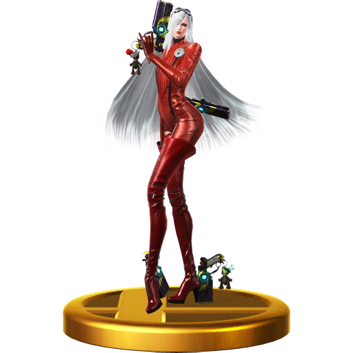</a></th>
    <th><b>Jeanne</b></th>
    <th>An Umbra Witch and old friend of Bayonetta, Jeanne wears a red bodysuit and uses the Bullet Arts fighting style to wield her four pistols, All 4 One. Jeanne saved Bayonetta from the demon Gomorrah but was mortally wounded and had her soul dragged down to Inferno. Bayonetta succeeded in rescuing her friend and returned her soul to its body.</th>
  </tr>
  <tr>
    <th></th>
    <th><b>Rodin</b></th>
    <th>This shady figure owns the Gates of Hell bar and runs a side business in mysterious objects and powerful weaponry made from the souls of demons. He's known for being a talented gunsmith and counts Bayonetta as a loyal customer, but it's said that if any human uses his wares, they'll suffer a terrible fate...</th>
  </tr>
</table>



<table class="fixed" border="1">
    <col width="150px" />
    <col width="100px" />
    <col width="600px" />
 <tr>
    <th></th>
    <th><b>Candy Kong</b></th>
    <th>You might remember Candy helping you save your game back in Donkey Kong Country. Both Donkey Kong and Funky Kong have just a little bit of a crush on her. Maybe one day, she'll notice one of them, and... Well, we're not writing a romantic novel here. Good luck to them both, though!</th>
  </tr>
 <tr>
    <th></th>
    <th><b>Colonel Pluck</b></th>
    <th>He stomps stolen bananas into mush with his giant stomping machine. Why does he do it? Because the Tiki Tak Tribe are controlling him - that's why! They're using the banana mush to create new tribe members. Who knew bananas were so magical?</th>
  </tr>
 <tr>
    <th></th>
    <th><b>Cranky Kong</b></th>
    <th>In Donkey Kong Country: Tropical Freeze, Cranky Kong's decided he's done with just giving the young 'uns helpful hints, so now he's taking things into his own hands by bringing some much-needed cane-swinging to the fray. You just can't keep an old ape down, can you?</th>
  </tr>
  <tr>
    <th></th>
    <th><b>Diddy Kong</b></th>
    <th>Red cap? Red T-shirt? Rocketbarrel Pack? Yep, it's Diddy Kong. His agility lets him get attacks in quickly in this game. Fire up his Rocketbarrel Pack and keep the button held down to fly further. You can even steer him in the air! Tip: If you don't mind fighting dirty, make you opponent slip on a Banana Peel, then hit 'em while they're down.</th>
  </tr>
  <tr>
    <th></th>
    <th><b>Diddy Kong (Alt.)</b></th>
    <th>The Banana Peel Diddy throws when you use his down special can be picked up and used against you, so be careful. His Monkey Flip side special is a rolling leap followed by a grab (or a kick if you press the button again midjump). If you grab someone, press the button again to attack or jump off them to go high into the air.</th>
  </tr>
 <tr>
    <th></th>
    <th><b>Dixie Kong</b></th>
    <th>Dixie Kong is all about style and substance. Just look at her ponytail. It's not just a fashion statement - she can spin it to fly up into the air, swim against strong currents, and even throw barrels with it, no problem! No wonder Diddy Kong likes her!</th>
  </tr>
 <tr>
    <th></th>
    <th><b>DK Barrel</b></th>
    <th>Did you know that the "DK" on a DK Barrel stands for "Donkey Kong"?... You did? Well then, maybe you also know what a beautiful and hopeful feeling it is to see one of these when you're toughing it out alone, all sad and forlorn. Break it and a partner will show up to lift you out of you doldrums and help you on your way.</th>
  </tr>
  <tr>
    <th></th>
    <th><b>Donkey Kong</b></th>
    <th>With help from Diddy Kong and his Animal Friends, this banana-loving king of the jungle will take on anyone causing trouble on his turf. The best things about him in this game are his colossal strength, his speed, his long reach and the fact that he can jump while holding heavy items. Make sure you use all that to your advantage!</th>
  </tr>
  <tr>
    <th></th>
    <th><b>Donkey Kong (Alt.)</b></th>
    <th>Donkey Kong's always been one to use his head. Anyone who's been on the receiving end of his Headbutt special will tell you that. If they're on the ground when it hits them, they'll get buried, leaving them open to a serious walloping. If they're in the air, though, they might find themselves being knocked down. Either way, it's going to hurt.</th>
  </tr>
 <tr>
    <th><a href="Enguarde.png" >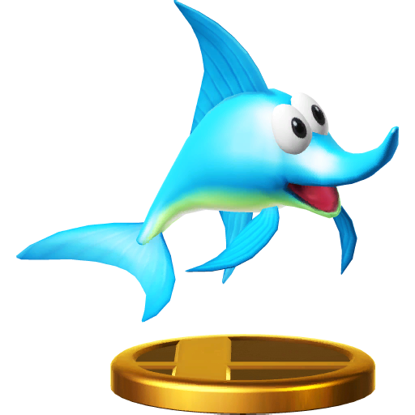</a></th>
    <th><b>Enguarde</b></th>
    <th>If you combine this swordsman of the sea with the king of the jungle, you'll get an aquatic duo no enemy can hope to overcome. Like Rambi the Rhinoceros, Enguarde can dash to blast through foes. Does that mean we should call him the Rhino of the Sea? Or maybe Rambi is the Swordfish of the Shores? Hmmm...</th>
  </tr>
 <tr>
    <th></th>
    <th><b>Fish Poker Pops</b></th>
    <th>These walrus-like foes from Donkey Kong Country: Tropical Freeze have horned helmets and puffer-fish-stick weapons that make it tough to even get close to them. Wait for them to lift their sticks, and then use rolling attacks. After three of those, they'll go down. Alternatively, use Cranky Kong's Cane Bounce to bash them in the head.</th>
  </tr>
 <tr>
    <th></th>
    <th><b>Funky Kong</b></th>
    <th>Funky Kong's turned his private plane into a shop, all in some kind of effort to make stuff "fly off the shelves".. Classic jokes like that and the way he says things like "tubular" might make you think you're back in the 80s, but that's all part of his charm, right?</th>
  </tr>
 <tr>
    <th><a href="Hammer.png" >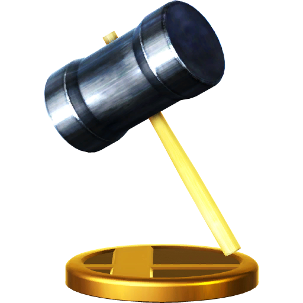</a></th>
    <th><b>Hammer</b></th>
    <th>This is something you just can't stop swinging. At all. You'll do a lot of damage with it, but... you won't be able to jump in mid-air or use special moves, so if you fall off the stage, good luck getting back on! Oh, and if the head pops off, you'll be left waving the handle around. If that happens... man, you are going to look ridiculous.</th>
  </tr>
 <tr>
    <th><a href="Hammerhead.png" >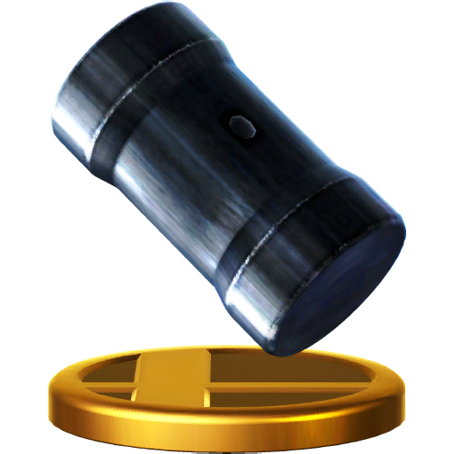</a></th>
    <th><b>Hammerhead</b></th>
    <th>If the head of a hammer should happen to fall off while someone's waving it around, don't let it go to waste! It's great for launching people, so pick it up and throw it at someone! How about that wally waving the hammer handle around? He's just asking for it!</th>
  </tr>
 <tr>
    <th></th>
    <th><b>King K. Rool</b></th>
    <th>This guy is to Donkey Kong what Bowser is to Mario. This crowned Kremling has a serious attitude problem. If only he could have been on of DK's Animal Friends instead... Maybe with just a little change of heart, he still could be! On second thoughts...nope. Never gonna happen.</th>
  </tr>
  <tr>
    <th></th>
    <th><b>Konga Beat</b></th>
    <th>In this Final Smash, DK drums on a set of bongos, just like in the Donkey Konga games. Press the attack button in rhythm with the circles to boost the attack's range and power. Enemy attacks won't affect you, but you can't move, either. Auto-scrolling stages will slow down, but be careful or you might still self-destruct!</th>
  </tr>
 <tr>
    <th></th>
    <th><b>Krazy Kalimba</b></th>
    <th>The Tiki Tak Tribe are the enemies shaped like musical instruments in Donkey Kong Country Returns. When Kalimba first turns up, he hypnotises the animals with his music. Incidentally, the top of his head looks just like a kalimba, an African instrument. Never seen one? Look it up!</th>
  </tr>
 <tr>
    <th><a href="Kritter.png" >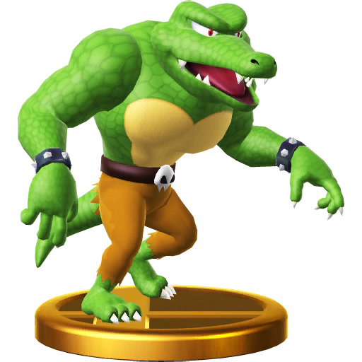</a></th>
    <th><b>Kritter</b></th>
    <th>These enemies are part of King K. Rool's Kremling gang in the Donkey Kong series. The green ones attack with their strong jaws, while the blue use their sharp claws in spinning attacks for powerful slashing. They don't have a lot of launching power, but their relentless assaults can easily wear you down.</th>
  </tr>
 <tr>
    <th></th>
    <th><b>Lanky Kong</b></th>
    <th>Debuting in Donkey Kong 64, this is one ape who loves to monkey around. His long orangutan arms stretch when he attacks, which is always fun to watch. He can even go upside-down and walk around on his hands using his Orangstand ability! With such a useful pair of arms, does he even need those tiny legs?</th>
  </tr>
 <tr>
    <th></th>
    <th><b>Mole Miner Max</b></th>
    <th>Hypnotised by Banjo Bottom, Mole Miner Max and his workers use the Mole Train and its carts to move massive amounts of bananas around. When a tie-wearing gorilla shows up to put a stop to the Tiki Tak Tribe's plans, though, Banjo Bottom uses the train to try and escape. Whack those moles and take out Banjo Bottom!</th>
  </tr>
 <tr>
    <th><a href="Pauline.png" >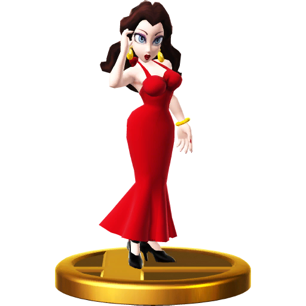</a></th>
    <th><b>Pauline</b></th>
    <th>One fine day in 1981, the world was introduced to a new action-packed arcade game - Donkey Kong! But back then, the girl Mario was trying to rescue from Donkey Kong wasn't Peach - it was Pauline. Also, did you know that in Japan, Pauline was originally just called "Lady"?</th>
  </tr>
 <tr>
    <th></th>
    <th><b>Peanut Popgun</b></th>
    <th>Diddy Kong's special wooden gun. Keep the trigger held to charge up the speed and power of the peanut ammo. Just don't get carried away or the gun might explode! How long you charge it for also affects the range of your projectile, so pay close attention to your intended target and make sure you time it just right!</th>
  </tr>
 <tr>
    <th></th>
    <th><b>Pointy Tuck</b></th>
    <th>When the Snowmad army invades DK Island in Donkey Kong Country: Tropical Freeze, there penguin-like foes make up just part of its troops. The big horns on their helmets will make you think twice about jumping on them, but in the original game, you can defeat them by rolling or throwing barrels.</th>
  </tr>
 <tr>
    <th></th>
    <th><b>Pompy, the Presumptuous</b></th>
    <th>This large sea lion from Donkey Kong Country: Tropical Freeze is one of the Snowmad higher-ups...not to mention the ringleader of his own circus! DK and friends tussle with him in Lost Mangroves, where he attacks by sliding along the ground, leaping through the air, and generally showing off his circus skills.</th>
  </tr>
 <tr>
    <th></th>
    <th><b>Rocketbarrel Barrage</b></th>
    <th>With a Peanut Popgun in each hand, Diddy showers his foes with a hail of explosive destruction. This Final Smash lets him fly freely through the air, dealing damage to anyone in his way. When his body starts to flash, that means the Final Smash is about to end, so try to catch your foes in the Rocketbarrel Pack's explosion!</th>
  </tr>
 <tr>
    <th></th>
    <th><b>Rocketbarrel Pack</b></th>
    <th>Two barrels equipped with jet engines. Strap them onto your back and the sky's the limit! Use this contraption to boost your jump and control where you land with pinpoint precision. Just try not to let yourself get attacked when you're charging the jets or in the air, or things'll go haywire!</th>
  </tr>
 <tr>
    <th></th>
    <th><b>Snowmad Ship</b></th>
    <th>While sailing the world in search of new lands, the Snowmads discover Donkey Kong Island. Viking-like thugs that they are, they freeze the whole island and take over. This small boat here is one of the vessels manned by minions. Lord Fredrik's ship, however, is MUCH bigger. Of course, it had to be--he's the Snowmad King, after all!</th>
  </tr>
 <tr>
    <th><a href="Spring.png" >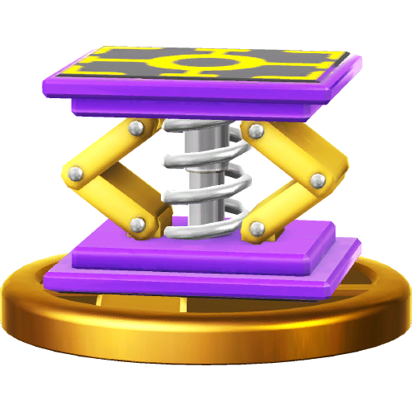</a></th>
    <th><b>Spring</b></th>
    <th>Jump onto this to jump higher than ever before! Throw it in the air, then land on it to jump even higher! Then use special attacks, or even do another jump in midair! If it's lying on its side, though, just bumping into it might be enough to launch you off the stage. You don't want that, so be careful!</th>
  </tr>
 <tr>
    <th><a href="Stu.png" >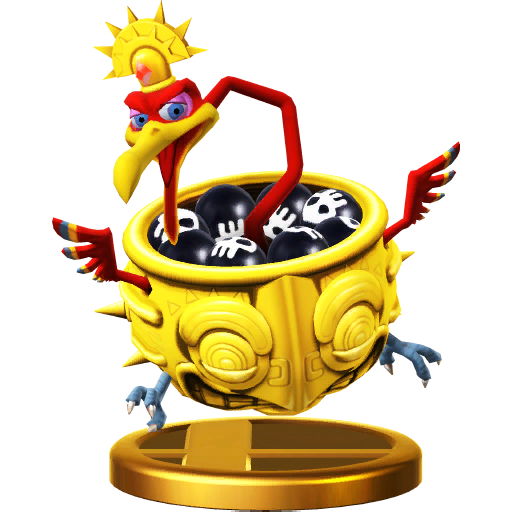</a></th>
    <th><b>Stu</b></th>
    <th>Deep within ancient ruins, Tiki shaman Gong Oh drops an egg into a golden cauldron, and magically causes it to hatch. Out of the egg pops Stu, his wings and talons busting through the cauldron. He's got bombs in there, and he loves to throw them. Chuck them back at him before they explode!</th>
  </tr>
 <tr>
    <th><a href="Thugly.png" >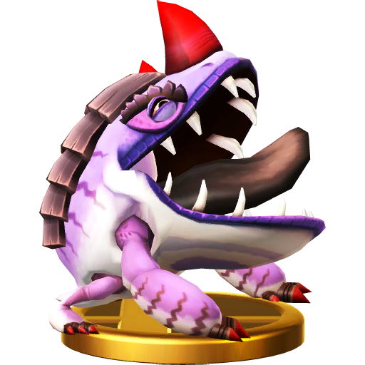</a></th>
    <th><b>Thugly</b></th>
    <th>A charging monster controlled by a Tiki called Xylobone. There's a weak point on his large back, but it's covered by a thick shell, so can it even be called a weakness at all? Well, it doesn't protect him all the time - when he brakes suddenly, the shell flips open! Someone should tell Thugly to glue that thing down...</th>
  </tr>
 <tr>
    <th></th>
    <th><b>Tiki Tong</b></th>
    <th>In the lava-filled Volcano region awaits Tiki Tong, the leader of the Tiki Tak Tribe. He liquefies a whole pile of bananas into goo, and then - instead of eating it - spits it all over his minions and fuses them to him! Ew! The Kongs'll have to hold off on complaining about how disgusting it all is - taking Tiki Tong out takes prioritiki.</th>
  </tr>
 <tr>
    <th></th>
    <th><b>Tiny Kong</b></th>
    <th>She isn't quite as small as when we first met her, but with her Mini-Monkey ability, Tiny Kong can still live up to her name! She can't fly with her ponytails like Dixie can, but she can still twirl to glide through the air. Remember: these Kongs are trained professionals. Do not try flying or gliding with your ponytails at home!</th>
  </tr>
 <tr>
    <th></th>
    <th><b>Tutorial Pig</b></th>
    <th>A little pig who appears in Donkey Kong Country Returns to show you the ropes. If you're really stuck, he'll even get Super Kong to finish the level for you. "Tutorial Pig" can't be his real name, though, can it? Of course not! It's actually...Professor Chops!</th>
  </tr>
 <tr>
    <th><a href="Winky.png" >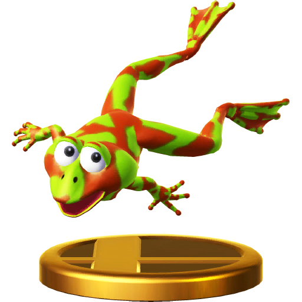</a></th>
    <th><b>Winky</b></th>
    <th>The Kongs' Animal Friends come in all shapes and sizes. There are mammals, fish, birds... There's even a frog! Winky's high-hopping abilities make him really useful when it comes to taking out those pesky Zingers. Best of all, you don't need to worry about accidentally falling off that slippery back of his - it just never happens!</th>
  </tr>
 <tr>
    <th></th>
    <th><b>Wrinkly Kong</b></th>
    <th>Wrinkly has been in the series since Donkey Kong Country 2, where she was the director of Kong Kollege. Even Kaptain K. Rool was one of her students once upon a time! She passed away at some point before Donkey Kong 64, but still shows up now and then as a ghost. Why should she let a little thing like death stop her?</th>
  </tr>
 <tr>
    <th><a href="Zinger.png" >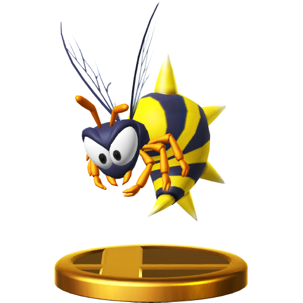</a></th>
    <th><b>Zinger</b></th>
    <th>It'd be great if you could fly through the sky on a Zinger - too bad they're covered in spikes and far too nasty to let you. The yellow ones fly up and down while the red ones go round in circles. Want to know more? Go and check them out yourself, then. No promises you'll come back in one piece, though!</th>
  </tr>
</table>



<table class="fixed" border="1">
    <col width="150px" />
    <col width="100px" />
    <col width="600px" />
  <tr>
    <th><a href="Can.png" >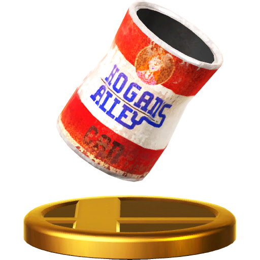</a></th>
    <th><b>Can</b></th>
    <th>Empty cans just like this appeared in the NES game Hogan's Alley. In the Trick Shot mode, you got points depending on which area you knocked them into. In Smash Bros., Duck Hunt's default standard special sends a can flying in an arc. It'll explode if it hits an opponent, or you can press the special button again to shoot at it.</th>
  </tr>
  <tr>
    <th></th>
    <th><b>Clay Pigeon</b></th>
    <th>A small, white disc used as a target in the Clay Shooting mode in Duck Hunt. In Smash Bros., Duck Hunt's default side special launches a clay pigeon through the air. It doesn't do much damage if it hits, but you can press the button again to shoot at it. The first two shots will narrowly miss, but you know what they say: "third time's a charm!"</th>
  </tr>
  <tr>
    <th><a href="Dog.png" >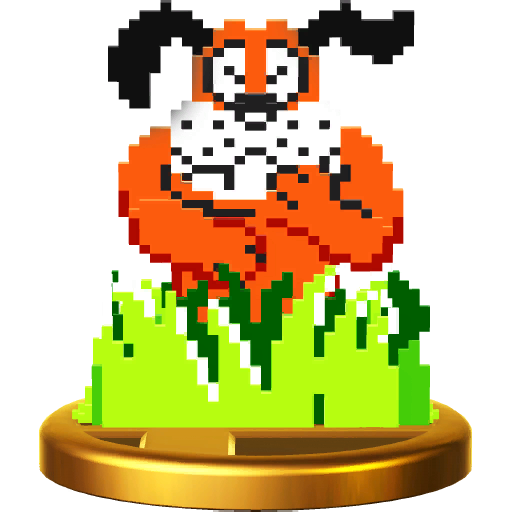</a></th>
    <th><b>Dog</b></th>
    <th>In the NES game Duck Hunt, the dog is your trusty hunting partner. He scares the ducks and then picks up the ones you hit. If you don't hit any, though, he'll laugh at you. So much for man's best friend... In the Duck Hunt stage in this game, he'll occasionally pop up in his 8-bit glory and let you use him as a platform!</th>
  </tr>
  <tr>
    <th><a href="Duck.png" >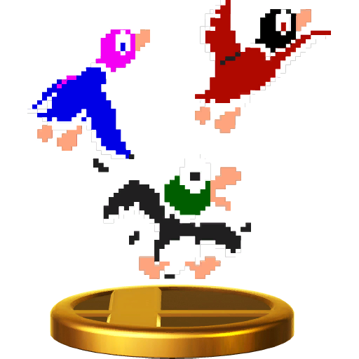</a></th>
    <th><b>Duck</b></th>
    <th>In the classic NES game Duck Hunt, you hunt, er...ducks. The dog flushes them into the air, and then you aim and fire. Taking down ducks gets you points in the Duck Hunt stage in this game too. It has no effect on the battle, but the alternative Duck Hunt action might be a refreshing change from constantly punching your friends in the face.</th>
  </tr>
  <tr>
    <th></th>
    <th><b>Duck Hunt Duo</b></th>
    <th>Back in 1987, when Duck Hunt came out, these two might not have had the best relationship. That all seems to have changed now, and this unlikely pair are here to fight together. After throwing a can or a clay pigeon, press the button again to have a little helper fire the NES Zapper for extra damage!</th>
  </tr>
  <tr>
    <th></th>
    <th><b>Duck Hunt Duo (Alt.)</b></th>
    <th>Duck Jump Duo, an up special, has the charming twosome float up in an adorable fashion. It also makes getting back to the stage much easier. Their side smash can hit up to three times at close range, depending on your shooting skills and by charging up the attack, you can increase the range even further!</th>
  </tr>
  <tr>
    <th></th>
    <th><b>NES Zapper Posse</b></th>
    <th>In this Final Smash, three games from the Light Gun Series team up: Duck Hunt, Hogan's Alley, and Wild Gunman. A flock of ducks fly by, warping anyone they hit to the Wild West. There, a posse of gunmen will use foes for target practice! If the ducks don't hit anyone, though, nothing happens besides some birds passing through.</th>
  </tr>
  <tr>
    <th></th>
    <th><b>Wild Gunmen</b></th>
    <th>A group of five quick-drawin' outlaws from the American frontier. The second they hear "FIRE!", they'll whip out their trusty pistols and start shooting. A member of the gang'll show up whenever the Duck Hunt Duo uses a down special move. Keep an eye out for the fastest of these rapscallions - that one's their boss!</th>
  </tr>
</table>



<table class="fixed" border="1">
    <col width="150px" />
    <col width="100px" />
    <col width="600px" />
  <tr>
    <th><a href="Cloud.png" >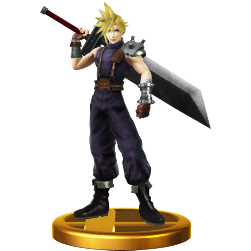</a></th>
    <th><b>Cloud</b></th>
    <th>The protagonist of FINAL FANTASY VII, Cloud wields the enormous Buster Sword, a memento from his comrad Zack. Once a SOLDIER of Shinra, he now fights as a mercenary against the corporation he originally served. His decision to join AVALANCHE's insurgence, however, will transform his destiny.</th>
  </tr>
  <tr>
    <th></th>
    <th><b>Cloud (Alt.)</b></th>
    <th>Filling the Limit Gauge allows Cloud to perform a Limit Break, supercharging his next special move. His down special becomes Finishing Touch. With a huge swing of his sword, Cloud summons a whirlwind that inflicts only 1% damage, but boasts brutal launch power. Go for a KO while foes' damage is still low!</th>
  </tr>

  <tr>
    <th><a href="Omnislash.png" >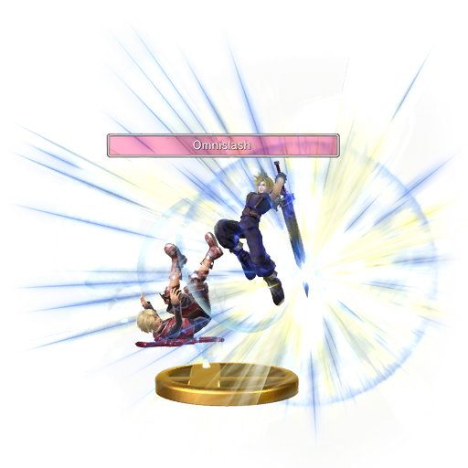</a>  </th>
    <th><b>Omnislash</b></th>
    <th>Filling the Limit Gauge allows Cloud to perform a Limit Break, supercharging his next special move. His down special becomes Finishing Touch. With a huge swing of his sword, Cloud summons a whirlwind that inflicts only 1% damage, but boasts brutal launch power. Go for a KO while foes' damage is still low!</th>
  </tr>
</table>



<table class="fixed" border="1">
    <col width="150px" />
    <col width="100px" />
    <col width="600px" />
  <tr>
    <th></th>
    <th><b>Black Knight</b></th>
    <th>It's said that the Black Knight's identity is a mystery even to the Daein army who he fights for. In Path of Radiance, he's Ike's mortal enemy, and this enmity continues into Radiant Dawn. His already fearsome strength is bolstered further by the skill Eclipse. He's so powerful that you might even expect him to be the final boss.</th>
  </tr>
  <tr>
    <th><a href="Chrom.png" >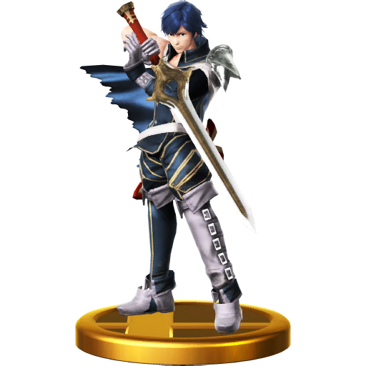</a></th>
    <th><b>Chrom</b></th>
    <th>The prince of the Halidom of Ylisse and a descendant of the Hero-King Marth. Chrom and his militia, the Shepherds, swear to protect the people of Ylisse. Despite being more than competent in battle, he's rather careless in training and always seems to be breaking things. He and Robin combine their skills in Robin's Final Smash.</th>
  </tr>
  <tr>
    <th><a href="Corrin.png" >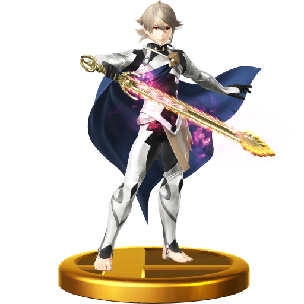</a></th>
    <th><b>Corrin</b></th>
    <th>Corrin from Fire Emblem Fates was born a Hoshido royal but kidnapped as a child and raised by the Nohr royal family. Descended from the First Dragons, Corrin has the power to transform into a dragon. In Smash this means lance-like hands and feet with a long reach whose tips deal the most damage. Use this reach to inflict high damage at a distance!</th>
  </tr>
  <tr>
    <th></th>
    <th><b>Corrin (Alt.)</b></th>
    <th>Corrin's side special Dragon Lunge is no normal attack–skewer a surface with a lance-like arm and it will suspend you in the air. Pin an enemy while doing this and you can keep them in place, then follow up with a flying kick forward or back, or just jump up. You can only thrust the lance once before landing.</th>
  </tr>
  <tr>
    <th></th>
    <th><b>Critical Hit (Lucina)</b></th>
    <th>In Lucina's Final Smash, she raises her sword high, then dashes swiftly forwards to deliver a deadly blow to whoever stands in her way. Even if their damage is low, this strike is powerful enough to take them out in a single hit. Just be careful not to dash off the stage if you use it in mid-air!</th>
  </tr>
  <tr>
    <th></th>
    <th><b>Critical Hit (Marth)</b></th>
    <th>Marth raises his Exalted Falchion to the sky, then rushes forwards to deal an incredibly powerful blow, almost certainly KOing anyone and everyone who gets hit! When used in the air, he'll fly forwards a set distance, but on the ground, he'll only dash up to the edge of the platform he's standing on.</th>
  </tr>
  <tr>
    <th></th>
    <th><b>Critical Hit (Roy)</b></th>
    <th>For Roy’s Final Smash, he traps enemies in a circular swing of the blade, brings it up behind him, and then, in a blast of fire, brings the blade down for a powerful finisher! The downward attack is powerful on its own but doesn’t have much range, so make sure you’re close enough to hit your enemies with the full combo and really seal their fate!</th>
  </tr>
  <tr>
    <th><a href="Elincia.png" >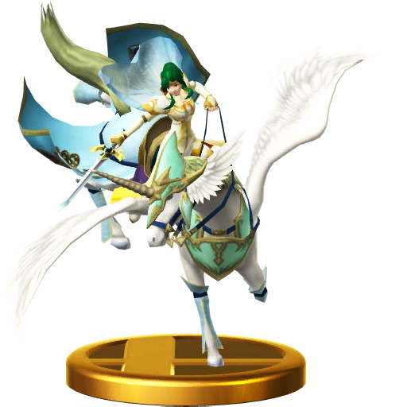</a></th>
    <th><b>Elincia</b></th>
    <th>A princess with a charming frankness to balance her courtly upbringing. Victorious over the forces of Daein that killed her parents, she takes her rightful place on the Crimean throne. As Queen, her sympathy for commoners over those of high status triggers a rebellion among some of the nobility, but also helps rebuild Crimea.</th>
  </tr>
  <tr>
    <th></th>
    <th><b>Great Aether</b></th>
    <th>Ike's Aether up special is combined with a relentless barrage of sword blows in this powerful Final Smash. He knocks his target into the air with an upward swing, and then they're stuck there as he strikes again and again. Finally, he slams them down to the ground and launches them. Just make sure that first strike hits!</th>
  </tr>
  <tr>
    <th><a href="Ike.png" >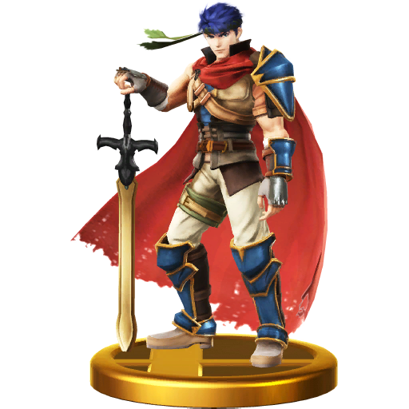</a></th>
    <th><b>Ike</b></th>
    <th>One of the main characters from the Fire Emblem series. Having fought in the Mad King's War, played a huge part in restoring the fallen nation of Crimea, and taken on the Begnion Empire, Ike is rightly called a hero. And he has the strength to go with that title. One good swing of his blade can launch even the heaviest of fighters.</th>
  </tr>
  <tr>
    <th></th>
    <th><b>Ike (Alt.)</b></th>
    <th>Ike's side smash is a powerful two-handed sword strike. It's one of the best launch attacks in the entire game, so even though it leaves you open, it's a real winner. For Eruption, one of his specials, you stab the ground and unleash a pillar of fire that hits anyone nearby. If you charge it too long, though, you'll hurt yourself, so be careful!</th>
  </tr>
  <tr>
    <th><a href="Lucina.png" >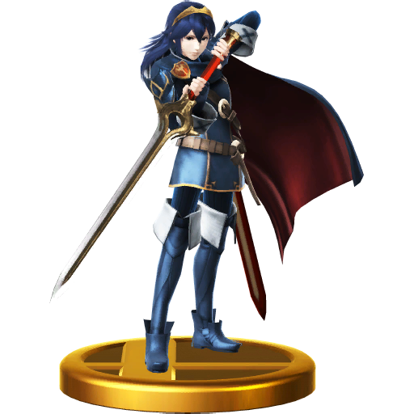</a></th>
    <th><b>Lucina</b></th>
    <th>Daughter of Chrom and future Princess of Ylisse. When she comes from the future to prevent a terrible future from unfolding, she goes by the name of Marth, but only until her true identity comes to light. She is a very similar fighter to Marth, except it doesn't actually matter which part of her sword she strikes with.</th>
  </tr>
  <tr>
    <th></th>
    <th><b>Lucina (Alt.)</b></th>
    <th>Lucina's moves are much like Marth's, but there are subtle differences. With Marth, you need to try to hit with the tip of his sword, but with Lucina, it doesn't matter, making her easier to use. Her Shield Breaker move lets her damage opponents and break their shields at the same time. Charge it fully to shatter shields in one hit.</th>
  </tr>
  <tr>
    <th><a href="Lyn.png" >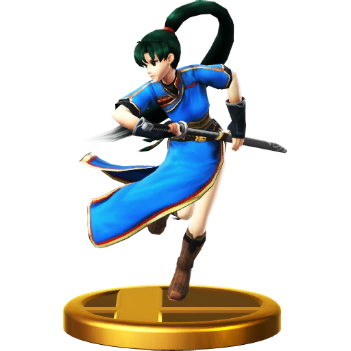</a></th>
    <th><b>Lyn</b></th>
    <th>Her real name is Lyndis, and she's the last survivor of one of the Sacaen tribes. She's strong and friendly, and her swordsmanship is epic. Summon her in this game and she'll charge herself up before laying a critical hit on your nearest opponent. Expect a solid strike from her to leave a mark!</th>
  </tr>
  <tr>
    <th><a href="Marth.png" >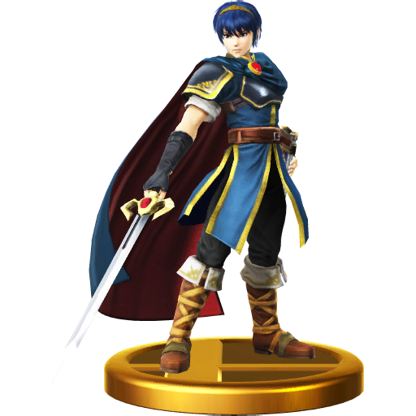</a></th>
    <th><b>Marth</b></th>
    <th>Marth, the prince of Altea, is the hero of the first ever Fire Emblem game and its remake, Fire Emblem: Shadow Dragon. In this game, his graceful sword skills are what set him apart. Strike with the tip of his blade to deal extra damage, and use his Counter skill to defend yourself, no matter which directions you're being attacked from.</th>
  </tr>
  <tr>
    <th></th>
    <th><b>Marth (Alt.)</b></th>
    <th>Marth's side special, Dancing Blade, is a four-stage attack. Aim and time your strikes carefully! As usual, the tip of his sword does the most damage. For his up smash, Justice Sword, he thrusts his blade into the air. You can use it to block attacks from above, and even to launch nearby enemies off the ground.</th>
  </tr>
  <tr>
    <th></th>
    <th><b>Pair Up</b></th>
    <th>Like the Pair Up feature in Fire Emblem: Awakening, which lets two characters attack a foe at once, Robin's Final Smash calls Chrom, the Prince of Ylisse, to the battlefield. First, Chrom dashes forwards, and if he lands a hit, Robin joins him for a flawless combination of attacks. It can even catch multiple opponents at once!</th>
  </tr>
  <tr>
    <th><a href="Robin.png" >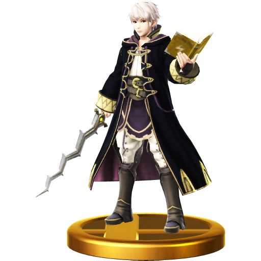</a></th>
    <th><b>Robin</b></th>
    <th>When Robin is found at the start of Fire Emblem: Awakening, he (or she!) discovers that, even without his memories, he is a master tactician. In this game, his attacks are powerful, but in true Fire Emblem style, how many times his magic can be used is limited. This also applies to the thunder magic his sword is imbued with.</th>
  </tr>
  <tr>
    <th></th>
    <th><b>Robin (Alt.)</b></th>
    <th>Robin's magic is powerful, but in return, its uses are limited. You can charge Thunder in steps, and when it's fully charged, it turns into Thoron, increasing its speed and dealing more damage. Arcfire creates a flame pillar when it hits something. Use it on an opponent who's clinging to an edge to stop them getting back on the stage.</th>
  </tr>
  <tr>
    <th></th>
    <th><b>Roy</b></th>
    <th>Flare Blade creates an explosion in front of Roy that can be charged by holding down the button. Take care, though, because at the highest levels of charge, Roy himself will catch fire and take damage! His side special, Double-Edge Dance, changes for each strike after the first depending on whether you hold up or down while attacking.</th>
  </tr>
  <tr>
    <th></th>
    <th><b>Roy (Alt.)</b></th>
    <th>His sword, the Sword of Seals, is uniquely powerful at the base of the blade. Flare Blade creates an explosion in front of Roy that can be charged by holding down the button. Take care, though, because at the highest levels of charge, Roy himself will catch fire and take damage! His side special, Double-Edge Dance, changes for each strike after the first depending on whether you hold up or down while attacking.</th>
  </tr>
  <tr>
    <th><a href="Sothe.png" >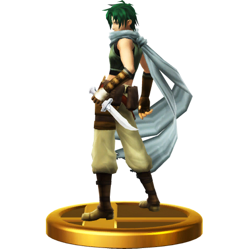</a></th>
    <th><b>Sothe</b></th>
    <th>Sothe is a member of the Dawn Brigade freedom fighters. With his well-honed dagger skills, he fights to free the people of Daein from the Begnion Empire. Though they aren't related by blood, he sees fellow Brigade member Micaiah as a sister, and is determined to protect her at all costs.</th>
  </tr>
  <tr>
    <th></th>
    <th><b>Torrential Roar</b></th>
    <th>Corrin blasts two columns of light on either side. If one hits an enemy, Corrin transforms into a fearsome dragon and unleashes a maelstrom that launches anyone unlucky enough to be caught. The light columns shoot straight up for a short moment, so using this move high up after knocking or throwing enemies overhead is very effective!</th>
  </tr>
</table>



<table class="fixed" border="1">
    <col width="150px" />
    <col width="100px" />
    <col width="600px" />
  <tr>
    <th></th>
    <th><b>Black Shadow</b></th>
    <th>When this guy sees other racers ahead, he doesn't think about overtaking them - he just wants to destroy them! In fact, his only goal in the F-Zero Grand Prix is to eliminate that pesky Captain Falcon once and for all. And once he's done with that, he plans to destroy the world. He should really talk to someone about these anger issues...</th>
  </tr>
  <tr>
    <th></th>
    <th><b>Blood Falcon</b></th>
    <th>Does this chap remind you of anyone? Well, he should - he's a Captain Falcon clone created by the evil Black Shadow as part of his plan to take over the world. As you might have guessed, this clone has a fierce rivalry with the original Captain Falcon. Perhaps he's not a fan of sharing his image or something.</th>
  </tr>
  <tr>
    <th></th>
    <th><b>Blue Falcon</b></th>
    <th>Captain Falcon's Final Smash lets him pull opponents into the middle of an F-Zero race-where competitors have been known to break the speed of sound-and run them over with his racing machine, the Blue Falcon. If he manages to grab you, there's no escape. The impact launches its victims diagonally upward.</th>
  </tr>
  <tr>
    <th></th>
    <th><b>Captain Falcon</b></th>
    <th>We love it when this F-Zero pilot from Port Town takes a break from racing the Blue Falcon to take on challengers in brawls. His balance of speed, power and weight is spot on, and his slow but mighty Falcon Punch is oh so sweet when it finally connects. Try starting the attack in mid-air and punching your way into a frantic fray!</th>
  </tr>
  <tr>
    <th></th>
    <th><b>Captain Falcon (Alt.)</b></th>
    <th>The captain's Falcon Kick isn't just any old kick - it blazes either to the side or diagonally down to terrorise the enemy. Its speed also makes it top-notch for surprise attacks! Another move to try out is his forward air attack, Knee Smash. If you get as close to someone as you can before using it, it can launch hem miles!</th>
  </tr>
  <tr>
    <th><a href="Deathborn.png" >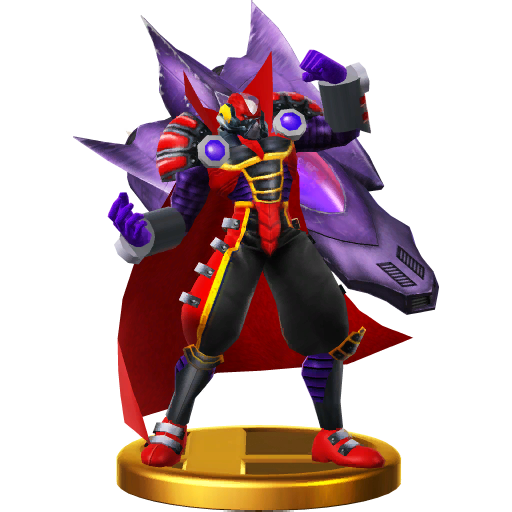</a></th>
    <th><b>Deathborn</b></th>
    <th>An F-Zero pilot feared even by the king of evil, Black Shadow. He has died and reconstructed himself three times, and his newest body is immortal. He can travel through space-time at will, casting his foes into far corners of the universe, and he aims to dominate the galaxy using the power of the two champions' belts.</th>
  </tr>
  <tr>
    <th></th>
    <th><b>Dr. Stewart</b></th>
    <th>When his father died, this brilliant and charismatic surgeon inherited the racing machine Golden Fox. It was then that he decided to become a pilot. He aspires to be a top racer, but occasionally finds that his other talents are still required. After one racing disaster in particular, his efforts kept the death toll at zero.</th>
  </tr>
  <tr>
    <th></th>
    <th><b>Falcon Flyer</b></th>
    <th>Captain Falcon's beloved ship. However, it isn't so much a racing machine as it is his personal base of operations, used for chasing down his targets as a bounty hunter. A ship with style and substance, it's the perfect fit for our intrepid hero as he scours the galaxy!</th>
  </tr>
  <tr>
    <th></th>
    <th><b>James McCloud</b></th>
    <th>An F-Zero racer, and also the leader of the mercenary unit Galaxy Dog. His machine, the Little Wyvern, is a modified fighter craft. Since times are peaceful and there aren't many military jobs, he's decided to take up racing in pursuit of the prize money. He shares his name (and shades) with Fox's father from the Star Fox series.</th>
  </tr>
  <tr>
    <th></th>
    <th><b>Jody Summer</b></th>
    <th>Though her aim in the Grand Prix is to arrest the dangerous criminals among the other racers, that doesn't stop her trying to win. As a fighter pilot for the Galactic Space Federation, her skills are clear despite her lack of racing experience, and she can take on even the most technical of courses in her sleek White Cat.</th>
  </tr>
  <tr>
    <th></th>
    <th><b>Mr. EAD</b></th>
    <th>This android was created by the evil organization EAD. He doesn't race for the glory, but as part of a final testing phase - victory in the Grand Prix will prove that he is the ultimate android. Incidentally, EAD also reflects his machine's stats - he has an E for Body, A for Boost, and D for Grip.</th>
  </tr>
  <tr>
    <th><a href="Pico.png" >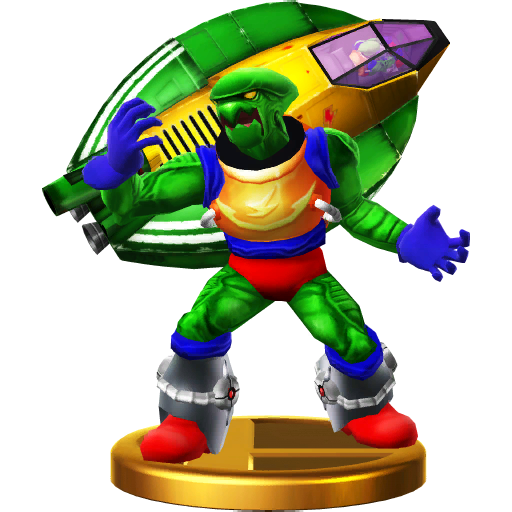</a></th>
    <th><b>Pico</b></th>
    <th>A former soldier of the Poripoto army from the planet Death Wind. It's not clear if his aggression in interviews is just the way he is or some kind of act. Considering the way he races, it's probably the former. Rumour has it he was the cause of a major accident some time ago.</th>
  </tr>
  <tr>
    <th></th>
    <th><b>Samurai Goroh</b></th>
    <th>An infamous F-Zero pilot who considers himself to be Captain Falcon's main rival. He races as number 5 with his speedy Fire Stingray. When released in this game, he'll head straight for the nearest opponent, swinging his sword with reckless abandon. Try not to get on his bad side.</th>
  </tr>
  <tr>
    <th></th>
    <th><b>The Skull</b></th>
    <th>That's no mask he's wearing - this racer's over 200 years old! At least, he would be if he wasn't dead. His records in F-Zero's predecessor, the F-MAX Grand Prix, are the stuff of legend, and thanks to a bit of science and black magic, he's back for more. Death hasn't slowed him down at all - he's still a truly fearsome opponent.</th>
  </tr>
  <tr>
    <th><a href="Zoda.png" >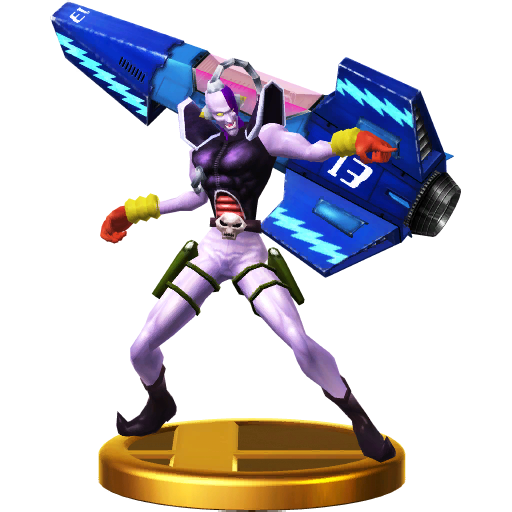</a></th>
    <th><b>Zoda</b></th>
    <th>With his body modified by the evil Black Shadow and his twisted adrenaline-based powers, he's the very picture of a vicious invader of the Earth. But every villain needs a heroic nemesis, and Zoda's plans tend to be foiled by the mighty Super Arrow. Since he has a bounty on his head, he clashes with Captain Falcon now and again too.</th>
  </tr>
</table>



<table class="fixed" border="1">
    <col width="150px" />
    <col width="100px" />
    <col width="600px" />
  <tr>
    <th><a href="Chef.png" >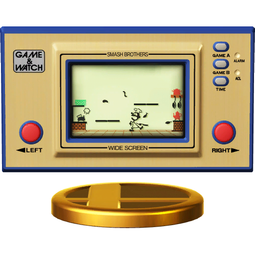</a></th>
    <th><b>Chef</b></th>
    <th>Back in the days of the Game & Watch and the early NES years, there were a lot of games with short and simple titles—and at just four letters and one syllable, Chef is a prime example. It's all about flipping food on a frying pan without dropping any on the floor. Whether any of that food ever actually gets served to customers is a mystery...</th>
  </tr>
  <tr>
    <th><a href="Fire.png" >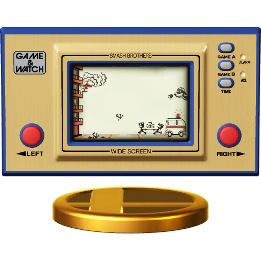</a></th>
    <th><b>Fire</b></th>
    <th>The Game & Watch series was a revolutionary experience in gaming when it first his shelves in 1980 with titles such as Fire. As people jump from the windows of a burning building, firemen run around underneath with a trampoline, bouncing them into the waiting ambulance.</th>
  </tr>
  <tr>
    <th><a href="Helmet.png" >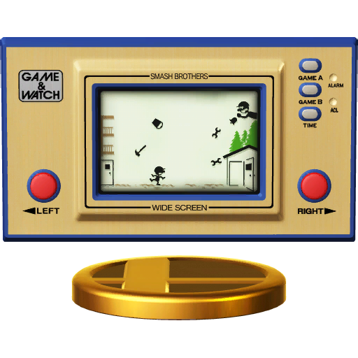</a></th>
    <th><b>Helmet</b></th>
    <th>Better than a regular ol' watch is Game & Watch. One of the classic titles is Helmet. Move from left to right, avoiding the falling tools. If you get hit, you'll fall down and lose your helmet. What kind of helmet falls off after only one hit?! Good thing this game is so fun you'll overlook that.</th>
  </tr>
  <tr>
    <th><a href="Lion.png" >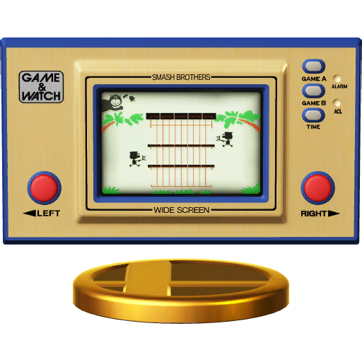</a></th>
    <th><b>Lion</b></th>
    <th>In an era before the Game Boy, countless children were enthralled by Game & Watch systems. And plenty of grown-ups, too! This game, Lion, is one such title that often proved hard to put down. The aim is to use two zoo keepers to stop the lions escaping their cage. At least the built-in clock can help you keep track of the hours you've lost!</th>
  </tr>
  <tr>
    <th><a href="Manhole.png" >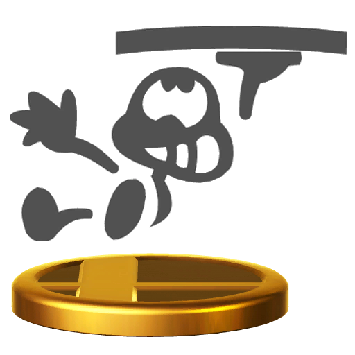</a></th>
    <th><b>Manhole</b></th>
    <th>No scrolling, only one stage, only a few sounds, and the age of 3D was nothing more than a twinkle in someone's eye. Nevertheless, this game was a blast at the time. In the Game & Watch title Manhole, you move a manhole cover back and forth so that the pedestrians can safely cross the road. What a simple yet fun game!</th>
  </tr>
  <tr>
    <th></th>
    <th><b>Mr. Game & Watch</b></th>
    <th>Game & Watch was a series of handheld video games that started in 1980, before even the Game Boy. In this game, you can play as the guy who starred in them, moving about in his quirky, oh-so-retro little way. He can string together some pretty powerful attacks but, unfortunately, being 2D makes him very easy to launch.</th>
  </tr>
  <tr>
    <th></th>
    <th><b>Mr. Game & Watch (Alt.)</b></th>
    <th>Mr. Game & Watch's Oil Panic special catches shots and turns them into oil. After catching three, the bucket will be full and you'll be able to throw oil all over your enemies. Some shots, like Samus's fully powered Charge Shot, will fill the bucket in one go! Throwing the oil you get from a shot like that can KO your foes in a flash!</th>
  </tr>
  <tr>
    <th><a href="Octopus.png" >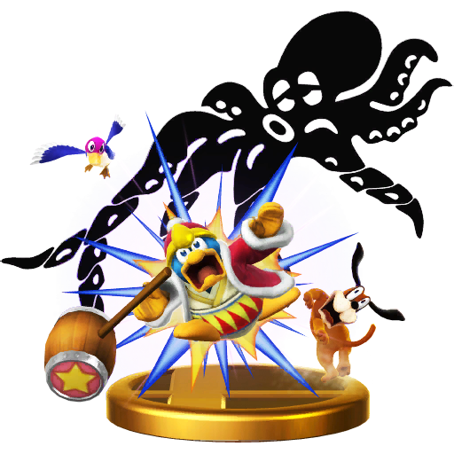</a></th>
    <th><b>Octopus</b></th>
    <th>The Game & Watch title Octopus featured a hero collecting treasure while avoiding a bothersome giant octopus's tentacles. Activate Mr. Game & Watch's Final Smash to transform into that octopus! Ram into opponents, and use the attack button to extend the tentacles. The only thing you can't do is change the direction you're facing.</th>
  </tr>
  <tr>
    <th></th>
    <th><b>Oil Panic</b></th>
    <th>The Game & Watch Multi Screen series is the big, big brother of the Nintendo DS. One classic title was Oil Panic, which puts you in charge of a petrol station that's sprung a leak. As oil drips down on the upper screen, you've got to catch it in buckets on the lower screen or risk an angry customer with a face full of oil!</th>
  </tr>
</table>



<table class="fixed" border="1">
    <col width="150px" />
    <col width="100px" />
    <col width="600px" />
  <tr>
    <th></th>
    <th><b>Back Shield</b></th>
    <th>A floating shield from Kid Icarus: Uprising. Pick it up and it'll protect you from attacks from behind. It's not perfect, though, as it can't block grabs or piercing attacks. Still, it'll block any standard attacks until it eventually disappears, so it's a pretty useful thing to get your hands on!</th>
  </tr>
  <tr>
    <th></th>
    <th><b>Black Hole Laser</b></th>
    <th>Palutena's Final Smash. After doing a divine twirl, she creates a black hole in front of her, drawing in her opponents. When she's got 'em where she wants 'em, the next step is a wide laser beam that reaches from one edge of the screen to the other. It even changes direction slightly, for that extra chance of taking out her foes.</th>
  </tr>
  <tr>
    <th></th>
    <th><b>Dark Pit</b></th>
    <th>Pit's black-winged doppelgänger. Dark Pit, aka Pittoo (although he's not exactly fond of being called that), looks like Pit, moves like Pit and uses very similar attacks. He's a lot more aggressive, though, and doesn't take orders from anyone. He also has his own weapons, like his Silver Bow.</th>
  </tr>
  <tr>
    <th></th>
    <th><b>Dark Pit (Alt.)</b></th>
    <th>Dark Pit's Guardian Orbitars special puts up shields of light on either side of you to block attacks, deflect projectiles, and push back any enemies who are too close. You can even use the shields to protect against attacks coming from slightly above or below you. If they take too many hits, though, they'll vanish and become unusable for a while.</th>
  </tr>
  <tr>
    <th></th>
    <th><b>Dark Pit Staff</b></th>
    <th>In Kid Icarus: Uprising, Dark Pit used this staff to snipe at Pit from a mountaintop. In that game, it did much more damage when used at a distance. In this game, Dark Pit uses it to launch a high-speed horizontal blast that goes straight through obstacles. It can hit multiple foes in a row, but only the first will feel its full force.</th>
  </tr>
  <tr>
    <th><a href="Daybreak.png" >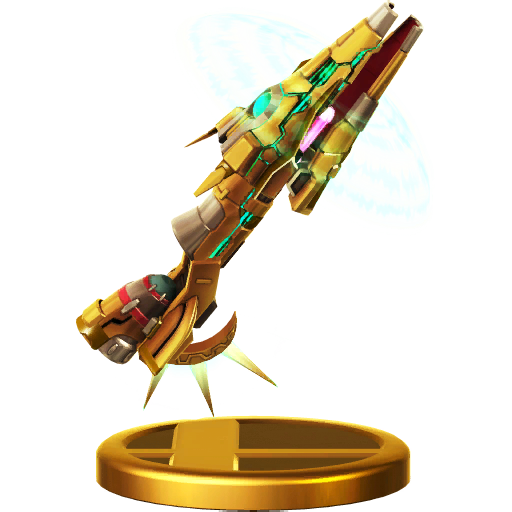</a></th>
    <th><b>Daybreak</b></th>
    <th>Its name might sound all bright and happy, but in truth this weapon is so destructive that it can plunge the whole world into darkness. Before you can use it, you have to assemble its three parts, but once you do, victory will be yours for the taking!</th>
  </tr>
  <tr>
    <th></th>
    <th><b>Killer Eye</b></th>
    <th>A portable, compact turret. Firing a hail of energy blasts from its eye, it's as dangerous as its name suggests. Hitting one while it's shooting at you can change the direction it's firing in. Sadly, though, that doesn't mean it'll be on your side - it'll still hurt you just the same.</th>
  </tr>
  <tr>
    <th><a href="Magnus.png" >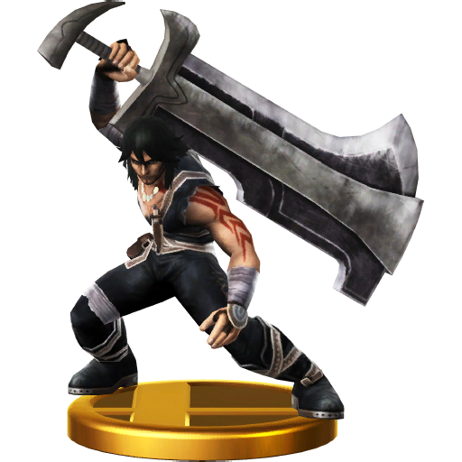</a></th>
    <th><b>Magnus</b></th>
    <th>With many years of battlefield experience and a tongue just as sharp as his sword, Magnus is an incredible warrior. Nightmares of his past have led him to become a bit of a lone wolf, but when he clashes with Dark Lord Gaol, it's clear there used to be a strong connection between the two.</th>
  </tr>
  <tr>
    <th></th>
    <th><b>Ore Club</b></th>
    <th>A weapon rough-hewn from minerals mined from the mountain of the gods. When complete, this weapon was imbued with a soul, which made a large glowing eye open in the centre. Not only is it immensely powerful, but it does wonders for your hand-eye coordination.</th>
  </tr>
  <tr>
    <th><a href="Palutena.png" >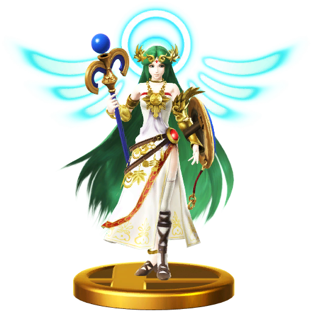</a></th>
    <th><b>Palutena</b></th>
    <th>Said to be able to perform miracles, this goddess supports Pit in battle, using telepathy to communicate with him. She's no slouch on her own, either. She has a huge variety of moves you can customise and use to your advantage. Short or long range, the sky's the limit! Or maybe not. After all, she can teleport.</th>
  </tr>
  <tr>
    <th></th>
    <th><b>Palutena (Alt.)</b></th>
    <th>Palutena's Reflect Barrier special deflects any attacks and projectiles that come at her from the front. Unlike other fighters' reflective moves, you can deploy this barrier and then leave it to its own devices. You can also push opponents with it, so use it on someone who's teetering on the edge of the stage to push them off.</th>
  </tr>
  <tr>
    <th></th>
    <th><b>Palutena's Temple</b></th>
    <th>In the Kid Icarus series, Skyworld is where gods and angels live in harmony. Late in the story of Kid Icarus: Uprising, however, it falls apart, and the ruins of Palutena's Temple have become a stage in this game. The bridge can be destroyed, splitting the stage in two, but you can still cross the gap using clouds or moving platforms.</th>
  </tr>
  <tr>
    <th><a href="Phosphora.png" >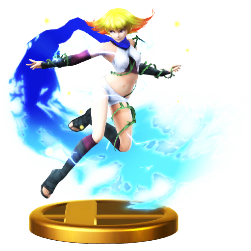</a></th>
    <th><b>Phosphora</b></th>
    <th>Some people are just too talented for their own good, and Phosphora is one of those people. A commander of the Forces of Nature, she has speed, strength and the power of electricity on her side. However, everybody has their flaws, and maybe - just maybe - her singing's not that great.</th>
  </tr>
  <tr>
    <th></th>
    <th><b>Pit</b></th>
    <th>Despite being an angel with wings and all that jazz, Pit can't fly without a little bit of help from his favourite goddess, Palutena. In this game, he's good at both close and ranged combat, and can even deflect projectiles. On top of that, with a high-flying up special and the ability to jump four times in mid-air. he's also got great recovery skills.</th>
  </tr>
  <tr>
    <th></th>
    <th><b>Pit (Alt.)</b></th>
    <th>Pit's Upperdash Arm special launches him forwards to strike with an uppercut. It's so powerful, it can deliver an instant KO! If you accidentally dash off the stage with it, one of his up special will get you back on easily. His Palutena Bow special can be charged up, shot straight up into the air, and you can even guide the arrows mid-flight!</th>
  </tr>
  <tr>
    <th><a href="Reaper.png" >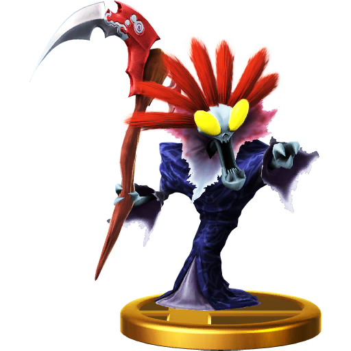</a></th>
    <th><b>Reaper & Reapette</b></th>
    <th>A foe that appears in Kid Icarus: Uprising, wielding a rather intimidating scythe. In that game, he'd go berserk if you entered his line of sight, calling in his Reapette minions to attack. In Smash Tour, bump into him with three or more fighters to get a Checkpoint Bonus. Be careful, though! With two or fewer, you'll just get launched!</th>
  </tr>
  <tr>
    <th><a href="Souflee.png" >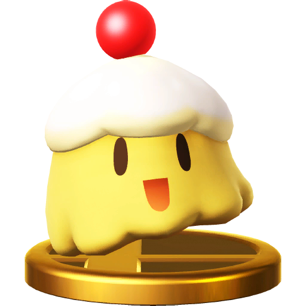</a></th>
    <th><b>Souflee</b></th>
    <th>This cute little cupcake comes from Kid Icarus: Uprising. See the little cherry on top? That's actually an eye! In Smash Tour, you can pick up a Checkpoint Bonus by launching one of these guys. They'll disappear if you leave them alone too long, though, so you'll have to be quick if you want the delicious goods!</th>
  </tr>
  <tr>
    <th></th>
    <th><b>Three Sacred Treasures</b></th>
    <th>The Arrow of Light, the Wings of Pegasus and the Mirror Shield - three legendary artifacts that Pit once used to defeat the evil Medusa. And when you activate his Final Smash, he can use them in this game too! After firing a medley of different bow attacks, his final shot makes powerful light pillars rain down on the battlefield.</th>
  </tr>
  <tr>
    <th></th>
    <th><b>X Bomb</b></th>
    <th>This grenade-like weapon explodes soon after being thrown, making an X-shaped blast that tears through anything in its way. It's a powerful weapon and a lot of fun, but don't make a habit of just blowing up everything in your path. You'll never get anywhere in life that way.</th>
  </tr>
</table>



<table class="fixed" border="1">
    <col width="150px" />
    <col width="100px" />
    <col width="600px" />

  <tr>
    <th><a href="Apples.png" >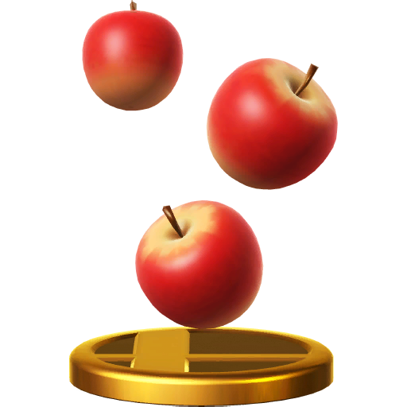</a></th>
    <th><b>Apples</b></th>
    <th>These aren't enemies at all. They're just apples. Still, they're something to watch out for - Whispy Woods will try to hit you on the head with them. Some enemies like to roll around on them too. Apples come in two varieties - one gives you health, and the other you can throw. And, needless to say, Kirby's favourite food is... Oh, it's tomatoes.</th>
  </tr> 
  <tr>
    <th></th>
    <th><b>Beam Kirby</b></th>
    <th>Ever felt jealous of a Waddle Doo's ability to fire beams from its eye? Well, if you're Kirby, there's really no need - swallow one and you, too, can swing energy beams to your heart's content! Charge them up to plough through multiple enemies at once, use them to grab and throw enemies, and even press switches through walls! Yeah!</th>
  </tr>
  <tr>
    <th></th>
    <th><b>Blade Knight</b></th>
    <th>A knight enemy from Dream Land who often gets in Kirby's way. There's an old saying, though, that you should keep your friends close and your enemies closer. Well, nothing will get your enemies closer than inhaling them! And when Kirby copies the Sword ability in Kirby Super Star Ultra, he can summon Blade Knight as a Helper!</th>
  </tr>
  <tr>
    <th></th>
    <th><b>Bomb Kirby</b></th>
    <th>When he copies the Bomb ability, Kirby gets to don a stylish hat just like Poppy Bros. Jr. The hat's appearance varies a little from game to game, but the ability itself is always pretty much the same: pull out a bomb, throw it, BOOM! Careful, though--if you hang on to the bomb for too long, you'll go BOOM yourself!</th>
  </tr>
  <tr>
    <th></th>
    <th><b>Broom Hatter</b></th>
    <th>Broom Hatter is an apprentice witch with the hat to match. She uses her trademark broom to fly through the-- Wait. No, she just sweeps the floor with it. Maybe she's just a bit of a clean freak. Or maybe she hasn't learned to fly yet. After all, she's only an apprentice. Except...in Kirby Air Ride, she DOES fly, so there goes that theory...</th>
  </tr>  
<tr>
    <th><a href="Cappy.png" >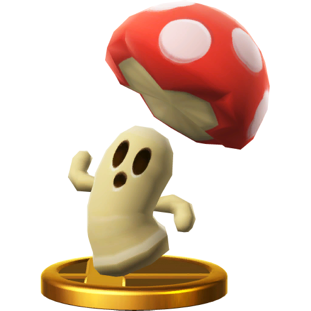</a></th>
    <th><b>Cappy</b></th>
    <th>This enemy looks rather like a mushroom...until Kirby tries to inhale him, that is--then his cap comes off and reveals the true form he's so cunningly been concealing. It might not be much of a surprise these days, though--Cappy's been around since the very first Kirby game. He's more like an old friend than an enemy at this point.</th>
  </tr>
  <tr>
    <th></th>
    <th><b>Dedede Burst</b></th>
    <th>For Dedede's Final Smash, he inhales fiercely to pull foes towards him. Once he's got them right where he wants them, he thrashes them with a giant burning hammer. Then, to top it off, he fires an explosive from his hammer, sending them blasting off. Could it get any worse? Well... yes - Dedede's invincible the entire time.</th>
  </tr>
  <tr>
    <th><a href="Dragoon.png" >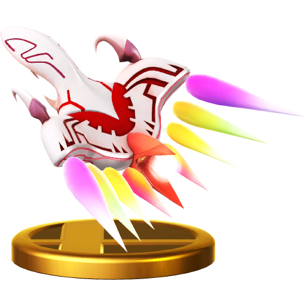</a></th>
    <th><b>Dragoon</b></th>
    <th>Collect parts A, B and C to assemble the legendary Air Ride machine Dragoon, which you can use to fly into an opponent. Aim well and they'll be long gone. If you're the one being aimed at, though, get out of the way, stat! By the way, if another player has one of the parts, attack them to steal it!</th>
  </tr>
  <tr>
    <th></th>
    <th><b>Fighter Kirby</b></th>
    <th>With his red headband and fierce attitude, Fighter Kirby is ready to take on anything. Like a real martial artist, he can kick and throw his foes into submission. And like a...not-so-real martial artist, he can fire his fighting spirit as an energy blast to hit faraway enemies. The only weapon this Kirby needs is his burning heart!</th>
  </tr>
  <tr>
    <th></th>
    <th><b>Fire Kirby</b></th>
    <th>Once upon a time, all Fire Kirby could do was shoot flames from his mouth, but he's come a long way since then. Now he can roll along the ground as a blazing fireball, burn up grass, light fuses, melt ice and so on. That's great and all, but what we really want to know is...can he help us get a barbecue going?</th>
  </tr>
  <tr>
    <th></th>
    <th><b>Galacta Knight</b></th>
    <th>With a theme song called "The Greatest Warrior in the Galaxy," Galacta Knight is not a foe to be taken lightly. Meta Knight challenges him to a duel in Kirby Super Star Ultra, and Kirby can face him in the True Arena of Kirby's Adventure Wii. In both cases, he's the formidable fighter you'd expect him to be.</th>
  </tr>
  <tr>
    <th></th>
    <th><b>Galaxia Darkness</b></th>
    <th>Meta Knight swings his cape to ensnare foes. Darkness falls, enveloping them in an empty void, and then a giant sword slash cleaves the blackness. If the cape doesn't capture anyone, the Final Smash will fail. It has more range than you might think, though, and as long as it catches at least one foe, everyone will take damage!</th>
  </tr>
  <tr>
    <th></th>
    <th><b>Ice Kirby</b></th>
    <th>When Kirby has the Ice ability, he can blast enemies with glacial gales to freeze them. He can then kick them into other enemies to take them all out at once! It's the perfect ability for a tough fight...or for when you need some ice to keep a glass of fruit juice nicely chilled. Not everything has to be about saving Dream Land, you know!</th>
  </tr>
  <tr>
    <th></th>
    <th><b>King Dedede</b></th>
    <th>Being a self-proclaimed king, Dedede clearly doesn't care too much about the whole "politics" things. He's just a bit greedy. In this game, his weight and hefty hammer make him slow, but he can still jump four times in mid-air anyway, making it easy for him to get back to the stage. Fully charge his Jet Hammer for ultimate destruction.</th>
  </tr>
  <tr>
    <th></th>
    <th><b>King Dedede (Alt.)</b></th>
    <th>For the Gordo Throw side special, King Dedede hits a Gordo with his hammer, sending it bouncing along the stage. It'll bounce off walls, or sometimes get stuck in them. Then, after a while, it'll disappear. If an enemy hits the Gordo with an attack, it'll fly back towards you. Use the special again to whack it back at them!</th>
  </tr>
  <tr>
    <th><a href="Kirby.png" >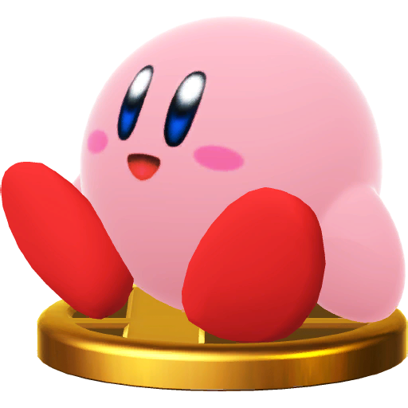</a></th>
    <th><b>Kirby</b></th>
    <th>A roly-poly little fella from Dream Land on Planet Popstar. He can inhale pretty much anyone or anything with that big gob of his, then spit them out or copy their abilities. He can copy opponents' standard specials in this game, too! His light weight means he gets launched easily, but with a series of mid-air jumps, recovering's not too tricky.</th>
  </tr>
  <tr>
    <th></th>
    <th><b>Kirby (Alt.)</b></th>
    <th>Charge up Kirby's Hammer side special to unleash Hammer Flip, a move with serious launch power. Charge it too much, though, and you'll get hurt! The move hits twice in mid-air, but does more damage on the ground. Final Cutter slices up and down before sending out an energy wave. Move Kirby mid-jump to change where he lands.</th>
  </tr>
  <tr>
    <th></th>
    <th><b>Knuckle Joe</b></th>
    <th>When Kirby copies this expert in all martial arts, he becomes a pro at hand-to-hand combat. Release Knuckle Joe in this game, and he'll jump towards the enemy nearest to you and unleash his mighty Vulcan Jab, then finish them off with a devastating Smash Punch or Rising Break!</th>
  </tr>
  <tr>
    <th></th>
    <th><b>Lor Starcutter</b></th>
    <th>A spacefaring vessel that travels among the stars. Though its parts got scattered all across Dream Land, they were safely reassembled thanks to Kirby and friends. It's actually more powerful than it looks - the emblem fires star-shaped projectiles, the mast can create tornadoes, and even its oars and wings can be fired as weapons.</th>
  </tr>
  <tr>
    <th><a href="Magolor" >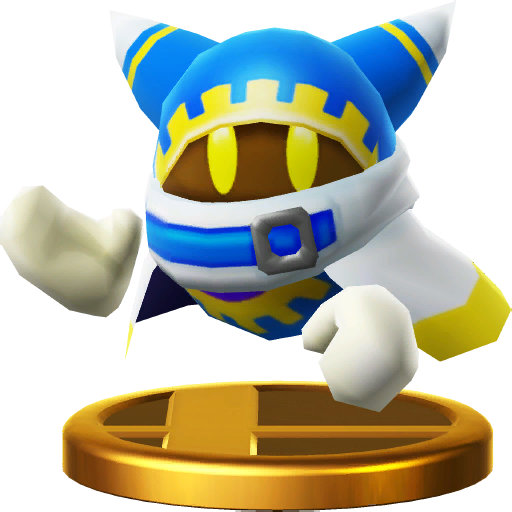</a></th>
    <th><b>Magolor</b></th>
    <th>One day, a rift appeared in the sky above Dream Land, and the Lor Starcutter came crashing through it. The captain, Magolor, was safe, but his ship's pieces got blasted far and wide. Kirby and friends help him put them back together, and to thank them, Magolor takes them on a trip to Halcandra. A lovely story! If only it ended there...</th>
  </tr>
  <tr>
    <th></th>
    <th><b>Maxim Tomato</b></th>
    <th>A big, juicy tomato with the letter M on it. In the Kirby series, it's Kirby's favourite treat, and it heals damage completely. Sadly, in this game, it only takes 50 off your damage, but it's still a hot item among badly hurt players...and players who just want to stop others from getting it!</th>
  </tr>
  <tr>
    <th></th>
    <th><b>Meta Knight</b></th>
    <th>A mysterious masked swordsman from the Kirby series. His cape can turn into wings, which gives him the ability to fly. His swift swordplay and ability to stay in the air give him an edge in this game. He can combine five mid-air jumps with a special move to make recovering a cinch. If you use him, try to keep battle airborne!</th>
  </tr>
  <tr>
    <th></th>
    <th><b>Meta Knight (Alt.)</b></th>
    <th>Meta Knight's Dimensional Cape lets you teleport. After vanishing, you can move to reappear somewhere else. You can also keep holding the button to turn it into an attack! His Mach Tornado special can mix up multiple opponents in the fray. Press the button repeatedly to rise up, and move left and right to create extra havoc.</th>
  </tr>
  <tr>
    <th></th>
    <th><b>Mike Kirby</b></th>
    <th>Kirby isn't much of a talker, but if you ever do want to hear his voice, here's a simple solution: swallow a Walky or Mr. Tick-Tock, and you'll be rewarded with an ability called Mike! Watch in awe as Kirby pulls out a microphone (or a megaphone) and shakes your soul with his dulcet tones. For some reason, his enemies can't stand the sound!</th>
  </tr>
  <tr>
    <th></th>
    <th><b>Needle Kirby</b></th>
    <th>Kirby's soft, fluffy and just...so huggable! Except when he's got the Needle ability, that is - then it's like there's a hug-free zone all around him. Being covered in spikes comes in handy, though, for rolling into enemies, and even shooting at them! However, whether that really makes up for his loss of huggableness is hard to say...</th>
  </tr>
  <tr>
    <th><a href="Nightmare.png" >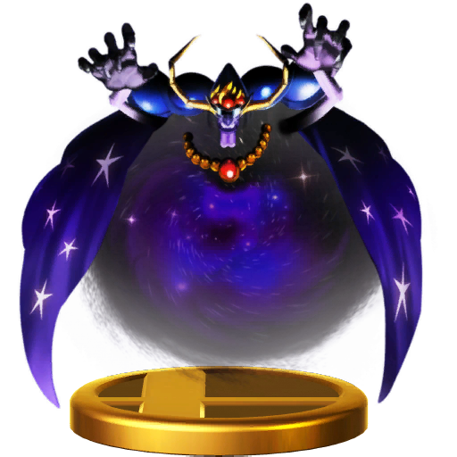</a></th>
    <th><b>Nightmare</b></th>
    <th>This terrible being came from the Fountain of Dreams, bringing bad dreams to all of Dream Land. King Dedede sealed him away by shattering the Star Rod, but when Kirby restored it, Nightmare was able to come back. In this game, he shrouds the stage in darkness, making it impossible for the fighters to see.</th>
  </tr>
  <tr>
    <th></th>
    <th><b>Ninja Kirby</b></th>
    <th>Making its debut in Kirby's Adventure Wii, the Moonja enemy looks about as ninja as you can get. Swallow one, and Kirby will become a master of the ninja arts too! Knife Throw, Wall Cling, Smoke Screen and Blossom Storm - with such a variety of useful skills, you might never want to let this Copy Ability go!</th>
  </tr>
  <tr>
    <th></th>
    <th><b>Poppy Bros. Jr.</b></th>
    <th>Sometimes riding on Grizzos, other times balancing on apples or Maxim Tomatoes, this little clown clearly has some skills. Unfortunately, his job isn't to make people laugh--it's to get in Kirby's way. As you might expect from the "Jr." in his name, there's also a Poppy Bros. Sr., and he's a slightly bigger nuisance.</th>
  </tr>
  <tr>
    <th><a href="Scarfy.png" >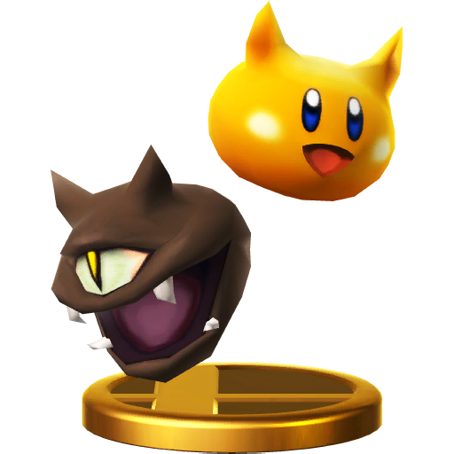</a></th>
    <th><b>Scarfy</b></th>
    <th>He looks almost as cute as Kirby himself, lazily floating in the air... but you shouldn't judge a book by its cover. Try to inhale him, and Scarfy will instantly turn into a terrifying one-eyed monster, ruthlessly chase you down and explode! In Kirby's Adventure Wii, some kinds of Scarfy only chase you if you're holding a key.</th>
  </tr> 
  <tr>
    <th></th>
    <th><b>Sir Kibble</b></th>
    <th>Wearing a suit of armour that looks like a helmet (or is it a helmet that looks like a suit of armour?), little round Sir Kibble doesn't seem all that different from Kirby in stature. But if you peer under his visor, hoping to catch a glimpse of a pair of cute little eyes, you might be unnerved to find nothing but an empty blackness...</th>
  </tr>
  <tr>
    <th></th>
    <th><b>Sleep Kirby</b></th>
    <th>You don't get to see sleeping heroes very often. They're so busy rescuing princesses or saving the world, they just don't have time for a little nap. Not so with Kirby! The moment he inhales the snooze-prone enemy Noddy, he pops on his sleeping cap and dozes right off. Ah, Kirby, what dreams might you be having today?</th>
  </tr>
  <tr>
    <th></th>
    <th><b>Starman (Kirby)</b></th>
    <th>Considering his name, and that cape on his back, you'd be forgiven for thinking that Starman is the hero. But he's not. That's Kirby. Starman is just another enemy to be swallowed. Still, he seems to have the courage of a hero, showing no fear when Kirby arrives on the scene, and sometimes even jumping right at him!</th>
  </tr>
  <tr>
    <th></th>
    <th><b>Star Rod</b></th>
    <th>Attack normally and you may as well just be swinging any old stick around, but if you deliver a hefty blow with it, this magic wand will launch a shooting star! The Star Rod powers the Fountain of Dreams, and Kirby once used it to defeat the evil Nightmare when he appeared from the fountain in Kirby's Adventure.</th>
  </tr>
  <tr>
    <th></th>
    <th><b>Superspicy Curry</b></th>
    <th>You think you know spicy curries? Think again! One taste of this one and your mouth will literally be on fire. Not even diving into water will help! Your opponents might laugh, but they'll soon stop when you start breathing fire in their direction, now won't they?</th>
  </tr>
  <tr>
    <th></th>
    <th><b>Sword Kirby</b></th>
    <th>Kirby looks like a pretty courageous hero in that green cap, doesn't he? Indeed, this Kirby is a master of sword-swishing, fending off enemies with the powerful Spin Slash, the rapid Multisword Attack and the stylish Sword Dive. If that wasn't impressive enough, he can also use these moves on land, in mid-air AND underwater. Beautiful!</th>
  </tr>
  <tr>
    <th></th>
    <th><b>Tac</b></th>
    <th>This speedy little guy is from the Kirby series. In those games, he steals the ability Kirby's in the middle of using and bolts. If you want it back, you have to chase him down and take it. In Smash Tour, Tacs appear randomly on the board, and you'll be rewarded with multiple stat boosts if you're quick enough to catch one!</th>
  </tr>
  <tr>
    <th></th>
    <th><b>Tornado Kirby</b></th>
    <th>Who needs hats when you can have an actual tornado coming out of your head? That's our Kirby - always the trendsetter. And with the Tornado ability, he can go one step further, turning his whole body into a cyclone to go on a wild rampage. His rapid spinning isn't exactly easy to control, but that's all part of the fun!</th>
  </tr>
  <tr>
    <th></th>
    <th><b>Ultra Sword</b></th>
    <th>For Kirby's Final Smash, he swings around a sword that's waaay bigger than he is. If the first swing hits, he'll keep going with a combo of lightning-fast slices, dealing tons of damage. For the last swing, the sword grows even larger and launches its target. It's great, so make sure that first swing hits, or none of the rest will happen!</th>
  </tr>
  <tr>
    <th><a href="Walky" >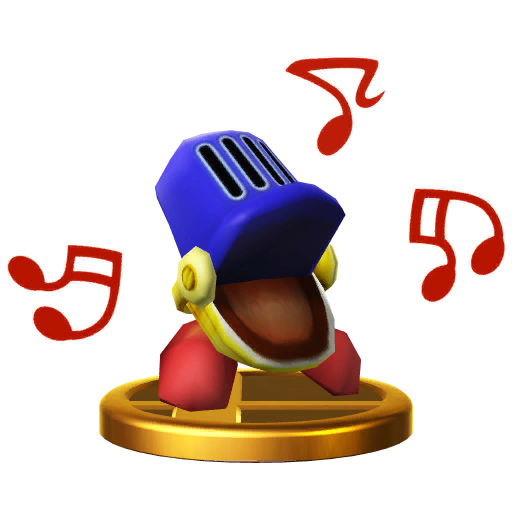</a></th>
    <th><b>Walky</b></th>
    <th>Walky is really just a microphone...that can walk. He's a retro sort of microphone that would look at home in a radio studio. His musical notes are more harmful than tuneful, so be sure to stay out of their way! If you manage to inhale Walky, you'll get the Mike ability, letting you destroy enemies all around with just the power of your voice!</th>
  </tr>
  <tr>
    <th></th>
    <th><b>Warp Star</b></th>
    <th>In the Kirby games, Warp Stars carry Kirby from one spot in a stage to another. In this game, pick it up to shoot high into the air and then slam back down to bowl over your opponents. You can control where you land by shifting left or right while in the air, but it takes some practice!</th>
  </tr>
  <tr>
    <th></th>
    <th><b>Whispy Woods</b></th>
    <th>In the heart of a beautiful green forest, Whispy Woods is waiting to give Kirby some juicy red apples. Isn't that nice? Well...not really, since he drops them on Kirby's head like bombs. If that wasn't bad enough, he'll also suck up the pink puffball and blast him with air. Note to self: be more wary of trees with faces.</th>
  </tr>
  <tr>
    <th></th>
    <th><b>Wing Kirby</b></th>
    <th>Kirby doesn't need to copy abilities to bop through the air, but actually having wings gives his aerial skills a definite boost. They even let him use some extra attacks, like the acrobatic Shuttle Loop and the mighty Condor Head. He can also fire at foes with his Feather Gun! Thought Kirby was just a squishy puffball? Think again!</th>
  </tr>
</table>



<table class="fixed" border="1">
    <col width="150px" />
    <col width="100px" />
    <col width="600px" />
  <tr>
    <th><a href="Aryll.png" >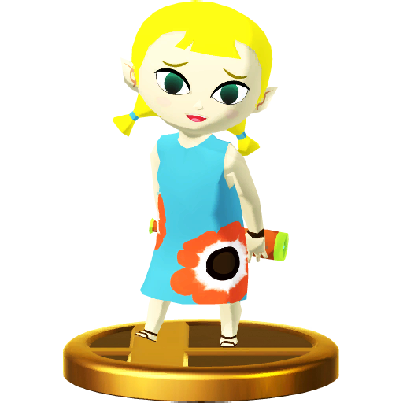</a></th>
    <th><b>Aryll</b></th>
    <th>Link's adorable little sister. She has the misfortune to be kidnapped and carried away from her home on Outset Island by a monstrous bird--and all on her big brother's birthday too! With his sister's prized telescope in hand (she lent it to him as a birthday treat), Link sets out on a grand voyage to rescue her.</th>
  </tr>
  <tr>
    <th></th>
    <th><b>Beast Ganon</b></th>
    <th>For Ganondorf's Final Smash, he morphs into a beast and attacks. As soon as he's transformed, he buries fighters nearby in the ground, then stuns them with his roar. Finally, he charges forward, dealing heavy damage and launching anyone in his way. Any foes who are buried by the first strike are guaranteed to be hit by the rest.</th>
  </tr>
  <tr>
    <th><a href="Beetle.png" >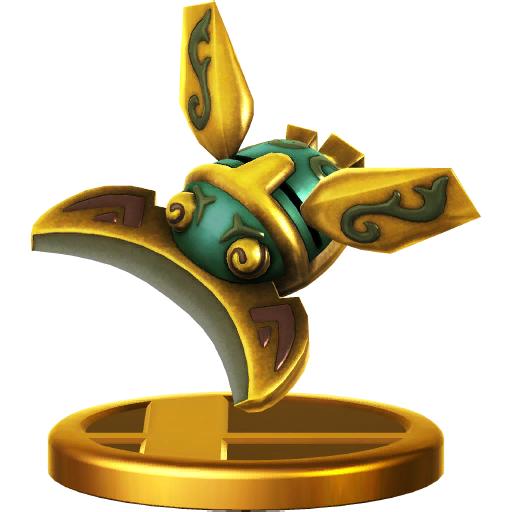</a></th>
    <th><b>Beetle</b></th>
    <th>A small, automated insect-like item. Throw it and it'll fly straight ahead, grab whichever opponent it finds, and carry them high into the air. If one flies at you, try to dodge it - your shield won't help. If that doesn't work, just wriggle around as much as you can to try to free yourself.</th>
  </tr>
  <tr>
    <th><a href="Bombchu.png" >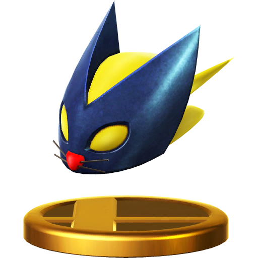</a></th>
    <th><b>Bombchu</b></th>
    <th>These little mouse-shaped explosives run along floors, walls, even ceilings. Throw one and it'll start running as soon as it hits the floor, getting faster and faster. As soon as it touches an opponent, it'll explode. It'll also blow up if you attack it, so be careful if your own Bombchu's passing by.</th>
  </tr>
  <tr>
    <th></th>
    <th><b>Bunny Hood</b></th>
    <th>A hood beloved by a man who longed to be...a bunny. It gave him unrivaled leg strength, allowing him to run at top speed all day and night. In this game, it boosts your speed and jumping ability, so you can get behind enemies easily and recover quickly if anyone launched you!</th>
  </tr>
  <tr>
    <th></th>
    <th><b>Crimson Loftwing</b></th>
    <th>The red guardian bird that carries Link through the skies. Given that this rare crimson breed was thought to be extinct, the people of Skyloft were quite surprised when this bird showed up and became Link's partner. In the real world, there's a type of bird called a shoebill that has a face almost identical to a Loftwing's.</th>
  </tr>
  <tr>
    <th><a href="Cucco.png" >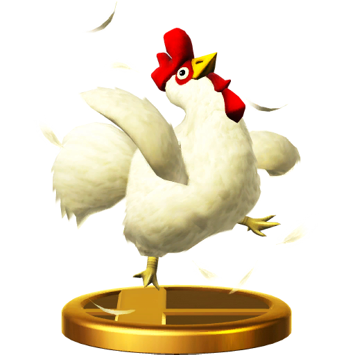</a></th>
    <th><b>Cucco</b></th>
    <th>These chicken-like birds don't seem to be aware that there's a fight going on, and if they get hit too often, they'll explode with rage! They'll call in a bunch of their mates to relentlessly peck whoever touched them last. Of course, that could be the person they were thrown at - not just the thrower!</th>
  </tr>
  <tr>
    <th></th>
    <th><b>Deku Nuts</b></th>
    <th>When Deku Nuts explode, they emit a light so bright that any fighter caught in the blast area - even ones with their shield up - will be stunned. If that's not enough, any foes in mid-air will be launched by the blast. Just try not to drop one by accident, or you'll definitely regret it!</th>
  </tr>
  <tr>
    <th><a href="Demise.png" >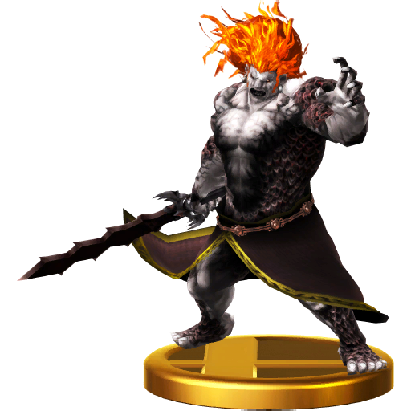</a></th>
    <th><b>Demise</b></th>
    <th>This abomination has hair of scorching flames and a blade as black as night. He doesn't even have a name as such - instead, he's known by the destruction he brings. In an ancient war for the Triforce, he was sealed away by the goddess Hylia. However, he has now awoken from 1,000 years of slumber, ready to battle again.</th>
  </tr>
  <tr>
    <th></th>
    <th><b>Fairy Bottle</b></th>
    <th>A bottle containing a Fairy with healing powers. If your damage is 100% or more, it'll heal you by 100. If not, then the Fairy won't do a thing. On the plus side, if someone else needs its, you can take it instead and have the smug satisfaction of stealing their precious hope away.</th>
  </tr>
  <tr>
    <th><a href="Fi.png" >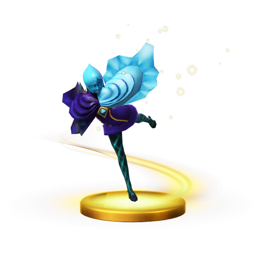</a></th>
    <th><b>Fi</b></th>
    <th>Even the most seasoned adventurer gets lost at times, but fear not! Within Link's Goddess Sword lives Fi, a spirit who is always ready to give Link a little push in the right direction. Created by the goddess Hylia, Fi is said to have no emotions or even gender, but the spirit is still able to perform some breathtaking dances.</th>
  </tr>
  <tr>
    <th><a href="Gaepora.png" >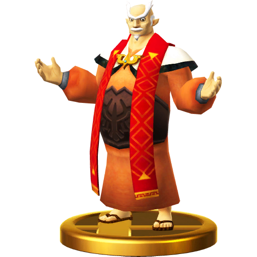</a></th>
    <th><b>Gaepora</b></th>
    <th>Headmaster of the Knight Academy and Zelda's father. His majestic presence can seem imposing, but he is a kindly soul, loved by all the students and even animals. His knowledge of the ancient legends proves useful in Link's quest. If his face seems somehow familiar, perhaps it reminds you of a certain owl.</th>
  </tr>
  <tr>
    <th><a href="Ganondorf.png" >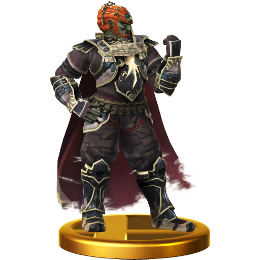</a></th>
    <th><b>Ganondorf</b></th>
    <th>The King of Evil is Link's arch-nemesis in most games in the Legend of Zelda series. With the Triforce of Power at his disposal, he's a fearsome opponent. In this game, his mighty attacks have so much impact, they easily make up for his slow speed, and his launching ability is extra impressive! Rush in when the enemy's open and strike hard.</th>
  </tr>
  <tr>
    <th></th>
    <th><b>Ganondorf (Alt.)</b></th>
    <th>Being the powerhouse that he is, the King of Evil is a great choice for free-for-alls. His Warlock Punch focuses dark energy into his left hand to deliver a thunderous back-hander. Unfortunately, focusing all that energy takes time. If someone sneaks behind you just as you start the move, quickly try to turn around.</th>
  </tr>
  <tr>
    <th></th>
    <th><b>Ganondorf (Wind Waker)</b></th>
    <th>Long ago, in accordance with the prayers of the King of Hyrule, the gods sealed the King of Evil, Ganondorf, beneath a vast ocean, along with the land of Hyrule itself. But this was not the end. In the Forsaken Fortress, Link discovers that Ganondorf has returned, and the legend must go on with Link himself as the new hero!</th>
  </tr>
  <tr>
    <th><a href="Ghirahim.png" >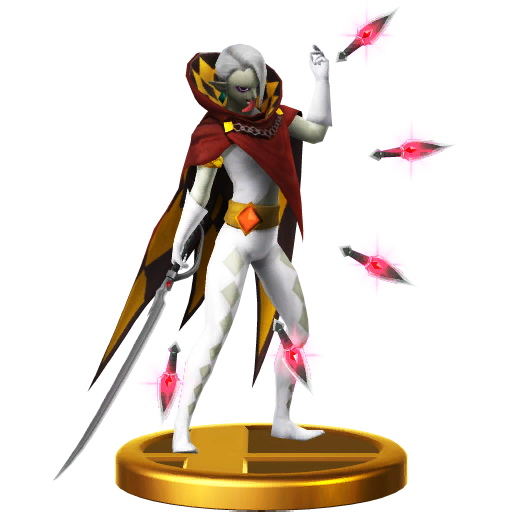</a></th>
    <th><b>Ghirahim</b></th>
    <th>No one has a higher opinion of Ghirahim than Ghirahim himself. You may call him Lord Ghirahim, by the way. Link is the thorn in this Demon Lord's otherwise flawless side, and though he might seem calm and collected, he'll start to lose his cool if he doesn't get his own way.</th>
  </tr>
  <tr>
    <th><a href="Groose.png" >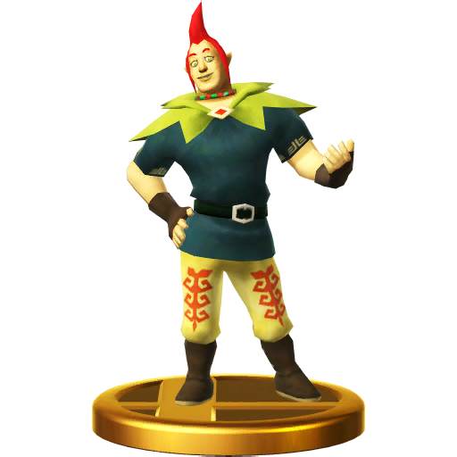</a></th>
    <th><b>Groose</b></th>
    <th>One of Link's classmates from the Knight Academy. Groose is a born troublemaker and loves to tease Link and play tricks on him with his cronies, Cawlin and Strich. He's got a soft spot for Zelda, though, and it's clear he's jealous of Link's close friendship with her. Ahh... teenagers, eh?</th>
  </tr>
  <tr>
    <th></th>
    <th><b>Gust Bellows</b></th>
    <th>Point this at an opponent and unleash a strong blast of wind at them. It won't do any damage - it's just wind - but it'll give them a pretty big push. If someone knocks it out of your hands, though, it'll roll around, blowing wind every which way, so be careful or you might get blown away yourself!</th>
  </tr>
  <tr>
    <th></th>
    <th><b>Heart Container</b></th>
    <th>A quintessential item from the Legend of Zelda series that raises your max health. In those games, you have to defeat bosses to get them, but in this one, they'll just fall from the sky, which makes things a whole lot easier. If you see one, grab it quick - in mid-air if you can! Why? To take 100 off your damage - that's why!</th>
  </tr>
  <tr>
    <th></th>
    <th><b>Hooded Zelda</b></th>
    <th>After failing to protect Hyrule from the encroaching Twilight, Zelda lays down her sword and shield and hides behind a dark robe, mourning those who were lost due to her failure. In the end, Link's brave acts inspire her to cast the robe aside and take her bow in hand, but she never forgets the dark times when all hope seemed lost.</th>
  </tr>
  <tr>
    <th><a href="Impa (Skyward Sword).png" >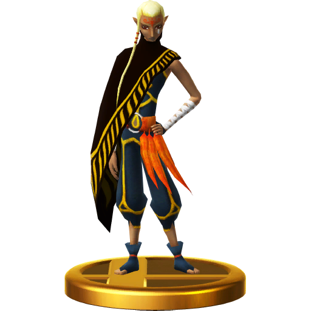</a></th>
    <th><b>Impa (Skyward Sword)</b></th>
    <th>When Zelda falls from Skyloft to the world below, this mysterious warrior protects and guides her. If you can tear your eyes away from her remarkable Sheikah garb, you'll see a powerful resolve in her eyes. Her combat skills are on a level with Ghirahim's swordsmanship and magic. It seems Impa actually hails from an age long past...</th>
  </tr>
  <tr>
    <th></th>
    <th><b>King of Red Lions</b></th>
    <th>The world may be a big place, but you probably won't find any talking boats besides the King of Red Lions. He is well-versed in ancient traditions, seems to know an awful lot about Link's destiny, and was even the one who gave Link the legendary Wind Waker. There's definitely more to this boat than meets the eye.</th>
  </tr>
  <tr>
    <th><a href="Levias.png" >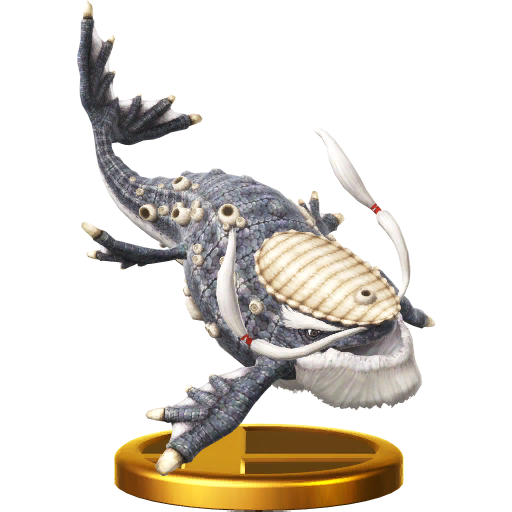</a></th>
    <th><b>Levias</b></th>
    <th>An ancient Sky Spirit who swims among the clouds. When he's possessed by a parasitic Bilocyte, this wise spirit turns into a violent beast. Link is forced to land on his colossal back and battle the fiends infesting him. Should our hero emerge victorious, Levias will once again be able to enjoy the sweet taste of pumpkin soup.</th>
  </tr>
  <tr>
    <th></th>
    <th><b>Light Arrow (Sheik)</b></th>
    <th>Sheik's Final Smash uses a gigantic bow to fire a Light Arrow across the screen. If multiple foes are in its path, it will strike them all, even penetrating straight through their shields. Sheik's Light Arrow is more powerful than Zelda's and it launches its targets at a more shallow angle.</th>
  </tr>
  <tr>
    <th></th>
    <th><b>Light Arrow (Zelda)</b></th>
    <th>In many of the Legend of Zelda games, the sacred Light Arrows are required to defeat the final boss. In this game, Zelda fires one straight across the screen for her Final Smash. If it passes through multiple foes, the ones hit first will take the most damage. The Light Arrow has a lot of launching power, making it great for getting KOs!</th>
  </tr>
  <tr>
    <th><a href="Link.png" >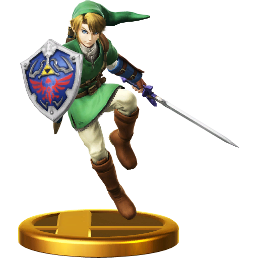</a></th>
    <th><b>Link</b></th>
    <th>Green clothes? Pointy hat? Yep, it's Link, all right! In this game, his sword and shield make for effective attacking and blocking, and his bow, bombs, and boomerang will spice up any battle. He's even brought his Clawshot for grabbing enemies and edges. The hero of Hyrule is really kitted out for a brawl!</th>
  </tr>
  <tr>
    <th></th>
    <th><b>Link (Alt.)</b></th>
    <th>Of all of his weapons, Link's sword may be the most lethal. His down air attack has incredible launching power. What's more, he'll bounce up afterwards, allowing for a follow-up strike. His side smash can also be followed up with a more powerful second blow that sends foes flying - just press the button again straight away.</th>
  </tr>
  <tr>
    <th></th>
    <th><b>Majora's Mask</b></th>
    <th>Created for use in ancient hexing rituals, this mask was infused with such dark magic that it became an evil creature in its own right. In a separate dimension called Termina, it tries to cause the end of the world by making the moon fall from the sky. And if you think the mask looks creepy, wait till you see its other forms!</th>
  </tr>
  <tr>
    <th><a href="Medli.png" >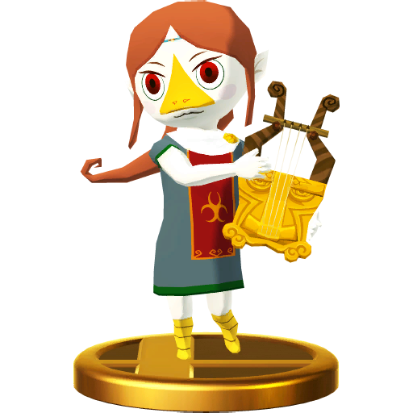</a></th>
    <th><b>Medli</b></th>
    <th>A polite young girl from the winged Rito tribe. As the attendant to Valoo, the Sky Spirit who serves as their island's guardian deity, she's the only one able to understand the dragon's words. But one night, when Link conducts an ancient tune for her to play on the harp, she remembers another duty she must fulfill...</th>
  </tr>
  <tr>
    <th><a href="Midna.png" >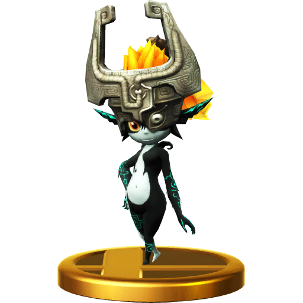</a></th>
    <th><b>Midna</b></th>
    <th>A girl from the Twilight Realm who seems to look down on the world from a very high horse. She helps Link while he's a wolf, but it's clear she has some kind of ulterior motive. Still, there's more to her than meets the eye, and she and Link eventually come to understand one another.</th>
  </tr>
  <tr>
    <th></th>
    <th><b>Old Woman</b></th>
    <th>Link meets this old woman int the Sealed Temple and finds her advice invaluable. She also took care of Zelda after her fall from Skyloft, and advised her how to proceed on her own journey. Link later discovers that this Sheikah elder was a proud warrior in a bygone age. You might even recognise her from another trophy...</th>
  </tr>
  <tr>
    <th><a href="Owlan.png" >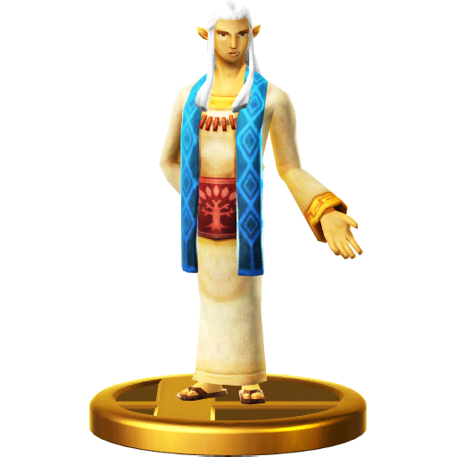</a></th>
    <th><b>Owlan</b></th>
    <th>An instructor at the Knight Academy and a keen botanist. He teaches Link how to Spiral Charge with Loftwing, and Link finds him a rare and unusual plant to study. Not as payment, though - as teacher and student, they simply share a bond of trust and goodwill. Incidentally, Owlan's room is more like a garden - it's full of plants!</th>
  </tr>
  <tr>
    <th><a href="ReDead.png" >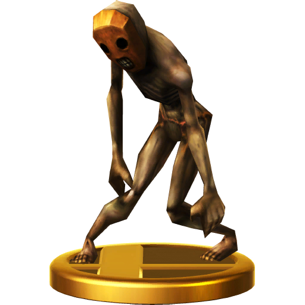</a></th>
    <th><b>ReDead</b></th>
    <th>These creatures may look like zombies, but unlike the walking dead, ReDeads have never been human. They just seem to be clay monsters fashioned in the shape of humans. They attack Link when he gets too close, making spine-chilling noises that are hard to describe with words alone. Best not to try - just get rid of them!</th>
  </tr>
  <tr>
    <th><a href="Sheik.png" >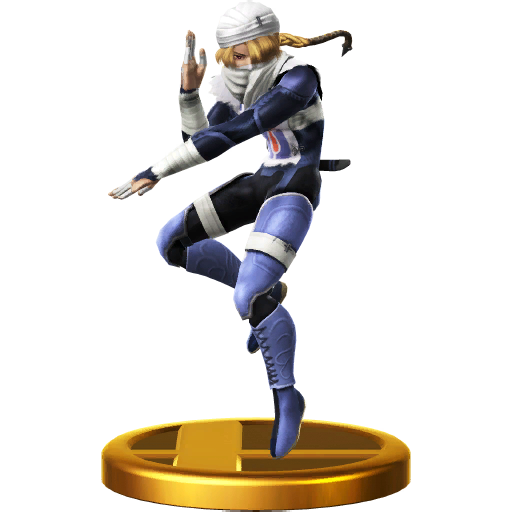</a></th>
    <th><b>Sheik</b></th>
    <th>Sheik is introduced in The Legend of Zelda: Ocarina of Time as the "survivor of the Sheikah", although it turns out to be Zelda, who took on the disguise to hide from Ganondorf. Sheik's ninja-like speed is a real contrast with Zelda's, and it allows for sneaky, fast-paced attacks that overwhelm opponents before they can even react.</th>
  </tr>
  <tr>
    <th></th>
    <th><b>Sheik (Alt.)</b></th>
    <th>Sheik's Burst Grenade side special throws a small grenade that draws in nearby fighters, then explodes. Hold the button longer to thrown it further. The down special Bouncing Fish is a fish-like flop forwards that has Sheik attack with both heels on the way down. If the move connects, Sheik will bounce back up into the air.</th>
  </tr>
  <tr>
    <th></th>
    <th><b>Skull Kid</b></th>
    <th>It's said that children who get lost in the forest are turned into these music-loving little monsters. You can summon one in Super Smash Bros. Wearing Majora's Mask, it'll move into the background and bring down a world of chaos on the whole stage. Even the fighter who summoned him will be affected, so try to keep a level head!</th>
  </tr>
  <tr>
    <th><a href="Skyloft.png" >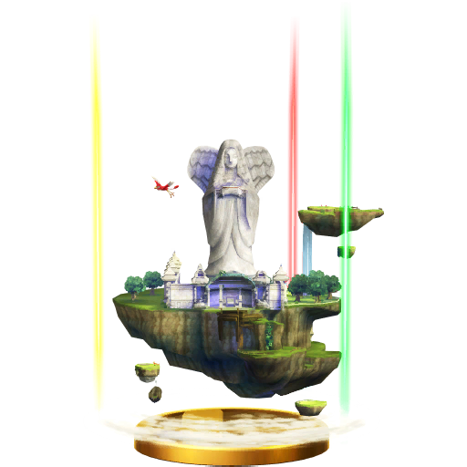</a></th>
    <th><b>Skyloft</b></th>
    <th>In The Legend of Zelda: Skyward Sword, Skyloft is a series of floating islands where Link and Zelda grew up. When you play this stage here, you'll get to fight in various areas seen in Skyward Sword, including the Knight Academy and around the Statue of the Goddess. It's a pretty fast-moving tour, though, so don't get left behind!</th>
  </tr>
  <tr>
    <th><a href="Tetra.png" >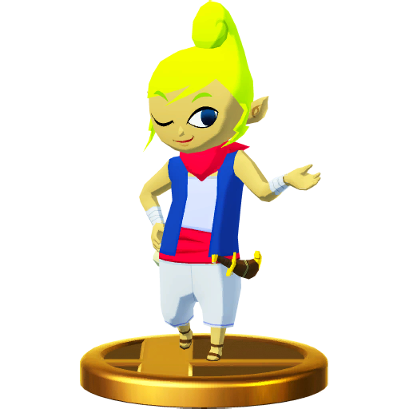</a></th>
    <th><b>Tetra</b></th>
    <th>A wild young girl who leads a pirate crew. She meets Link in the forest of Outset Island and, at first, isn't very impressed. But, witnessing his determination to save his sister, she slowly grows more inclined to help him. In the end, they travel together to a ruined land beneath the sea, where Tetra discovers an incredible secret...</th>
  </tr>
  <tr>
    <th></th>
    <th><b>The Imprisoned</b></th>
    <th>Long ago, the demonic king Demise was sealed away by the goddess Hylia, but with the appearance of the Gate of Time, he awakens once more. Perhaps due to the incomplete nature of his awakening, he takes this nightmarish form, sprouting more limbs and appendages every time he breaks through the seal that binds him.</th>
  </tr>
  <tr>
    <th><a href="Tingle.png" >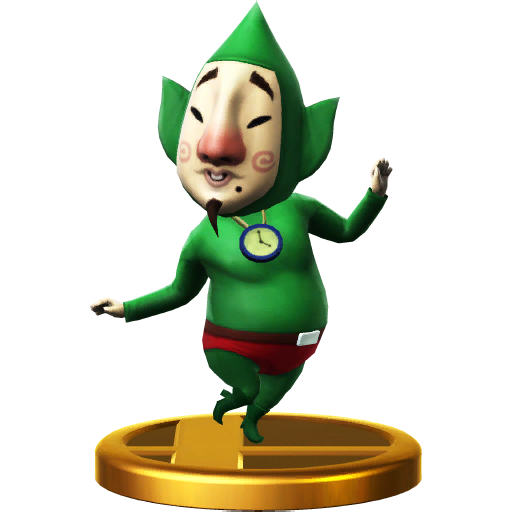</a></th>
    <th><b>Tingle</b></th>
    <th>Single. 35 years old. Dressed head-to-toe in green. In The Legend of Zelda: The Wind Waker, this wannabe fairy gets locked up for being a "troublemaker". And he's one in this game, too! His magic incantation, "Kooloo-limpah!", causes all sorts of madness that'll really shake up your battle.</th>
  </tr>
  <tr>
    <th></th>
    <th><b>Toon Link</b></th>
    <th>This cartoonish version of young Link is how he appears in The Legend of Zelda: The Wind Waker and a few other titles. While he shares some moves with his older counterpart, he's a very different fighter. Take advantage of his size and speed to whirl past enemies and bombard them with long-range attacks.</th>
  </tr>
  <tr>
    <th></th>
    <th><b>Toon Link (Alt.)</b></th>
    <th>Toon Link's Bomb move doesn't deal much damage, but the blast radius is pretty big. His bombs can be thrown in all directions, damaging or distracting your foes. Also, his up special Spin Attack keeps him airborne longer than Link's version. For some launching power, use the side smash attack.</th>
  </tr>
  <tr>
    <th></th>
    <th><b>Triforce Slash (Link)</b></th>
    <th>Toon Link's bombs don't do much damage, but their large blast radius makes it easy to hit foes with them. You can also throw them in any directions, making them a great diversionary tactic. His Spin Attack gives him more air-time than Link. His side smash may seem weak, but press the button again for a second hit that'll really send 'em flying!</th>
  </tr>
  <tr>
    <th></th>
    <th><b>Triforce Slash (Toon Link)</b></th>
    <th>For Toon Link's Final Smash, a ray of light emanates from his hand, and whoever the light touches gets trapped in the Triforce. While they're defenceless, Toon Link strikes them repeatedly, then launches them a great distance. Just be sure to time the Final Smash well - if the ray of light doesn't touch anyone, nothing happens. At all.</th>
  </tr>
  <tr>
    <th></th>
    <th><b>Wolf Link</b></th>
    <th>Hold on a sec! Where's our dashing young swordsman? Oh... This IS him, just...in wolf form. When he steps into the eerie Twilight world, Link becomes this rough-looking beast! Luckily, he turns back into normal Link eventually, but with the Master Sword letting him transform at will, he might feel like going wolf again from time to time.</th>
  </tr>
  <tr>
    <th><a href="Zant.png" >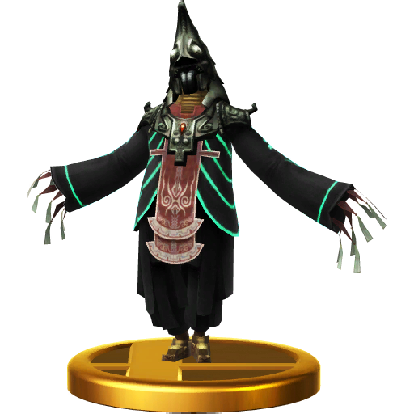</a></th>
    <th><b>Zant</b></th>
    <th>Empowered by Ganondorf's dark magic, Zant becomes the de facto ruler of the Twilight Realm. With his deranged screeches, freakish movements and eccentric attacks, Zant is certainly an unnerving opponent to battle. He plans to cover the world of light in darkness. If only Link would just stay out of his way...</th>
  </tr>
  <tr>
    <th><a href="Zelda.png" >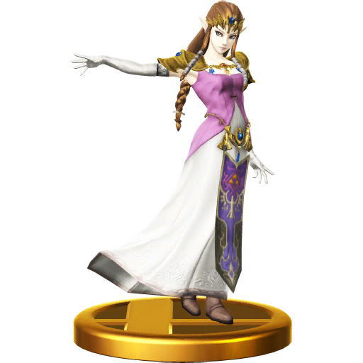</a></th>
    <th><b>Zelda</b></th>
    <th>This is the Zelda they're talking about in the titles of all the Legend of Zelda games. Though her appearance can change from game to game, her importance in the story usually doesn't. In this game, she's a bit slow, but her impressive magic skills make up for it. Power up her brand new special, Phantom Slash, by holding down the button.</th>
  </tr>
  <tr>
    <th></th>
    <th><b>Zelda (Alt.)</b></th>
    <th>Zelda's forward air attack, Lightning Kick, is a single-footed, electrically charged strike. Hit your opponent with just the glowing spot to deal heavy damage and launch them. Her Din's Fire side special can be guided up and down, and makes a bigger blast the longer you hold the button. It'll explode as soon as you let go.</th>
  </tr>
  <tr>
    <th></th>
    <th><b>Zelda (Wind Waker)</b></th>
    <th>Princess Zelda has had quite a variety of incarnations, but this one doesn't even know she's a princess! When Link meets her, she's a wild and fearless pirate. In a certain sealed land, this Zelda discovers her true identity, but doesn't act like a princess for very long, and even fights alongside Link in the final showdown!</th>
  </tr>
</table>



<table class="fixed" border="1">
    <col width="150px" />
    <col width="100px" />
    <col width="600px" />
  <tr>
    <th><a href="Bass.png" >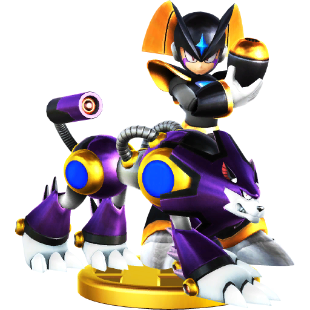</a></th>
    <th><b>Bass</b></th>
    <th>This combat robot created by Dr. Wily first appeared in Mega Man 7. He sees Mega Man as his rival and will stop at nothing to defeat him. This strong sense of pride often leads to him disobeying his creator's orders, too. Fusing with Treble, his support robot, powers him up and even allows him to fly.</th>
  </tr>
  <tr>
    <th><a href="Beat.png" >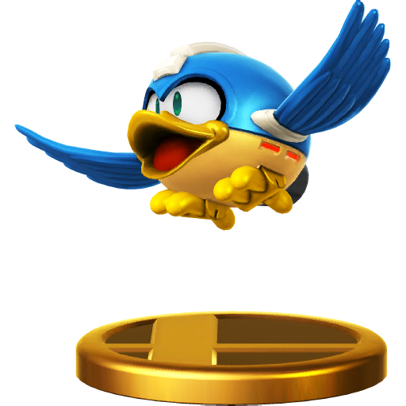</a></th>
    <th><b>Beat</b></th>
    <th>A bird-shaped support robot created by the genius scientist Dr. Cossack. Beat first appeared in Mega Man 5, where he was available to use only after Mega Man collected all eight plates hidden throughout the game. He flies toward enemies and attacks, making him a trusted ally when facing both regular enemies and bosses.</th>
  </tr>
  <tr>
    <th></th>
    <th><b>Dr. Light</b></th>
    <th>The genius scientist Dr. Thomas Light developed a variety of robots for peaceful purposes. Sadly, most of them were then reprogrammed by Dr. Wily and became warlike bringers of chaos. In order to combat them, Dr. Light saw no option but to convert his own robot assistant, Rock, into the heroic warrior Mega Man.</th>
  </tr>
  <tr>
    <th></th>
    <th><b>Dr. Wily</b></th>
    <th>A mad scientist from the Mega Man series who develops deadly robots to help him take over the world. He's also not above taking robots made by other scientists and modifying them for his own evil ends. Dr. Wily has a tendency to beg for forgiveness when Mega Man inevitably defeats him, but somehow he never learns.</th>
  </tr>
  <tr>
    <th><a href="Eddie.png" >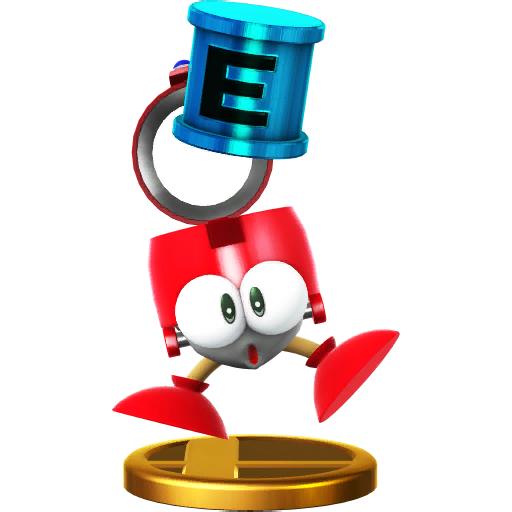</a></th>
    <th><b>Eddie</b></th>
    <th>This support robot first appeared in Mega Man 4. He'd pop up every now and then, flip his head open, and reveal a helpful item. The item is picked by random, but... hey, at least he's offering to help! In Mega Man 7, there's a giant spaceship modeled after him named Big Eddie, where Mega Man can trade for items.</th>
  </tr>
  <tr>
    <th></th>
    <th><b>Elec Man</b></th>
    <th>A robot created to control the voltage of nuclear power plants. He's sharp, speedy, and excels at commanding electrical currents (an unexpected forte for a robot). When you call on him in this game, he'll zip around, firing his Thunder Beam up, down and straight ahead. Anyone hit by the beam will be in for a shock!</th>
  </tr>
  <tr>
    <th></th>
    <th><b>Energy Tank</b></th>
    <th>These are filled with simulated solar power that restores Mega Man's health. You can keep any you find and use them from the menu at any time. They first appeared in Mega Man 2. Later titles added items like Mystery Tanks, which also restore weapon power, and Mini e Tanks, which grant you an Energy Tank when you collect four.</th>
  </tr>
  <tr>
    <th></th>
    <th><b>Mega Legends</b></th>
    <th>For Mega Man's Final Smash, he teams up with all-stars X, MegaMan Volnutt, MegaMan.EXE, and Star Force Mega Man, and they fire their Mega Busters in unision. The Black Hole Bomb fired at the start draws enemies in, and as long as that hits, the Mega Busters will follow. Make your foes see stars!</th>
  </tr>
  <tr>
    <th></th>
    <th><b>Mega Man</b></th>
    <th>In 1989, Capcom's new action hero, Mega Man, arrived in Europe! He made his way through levels, defeated bosses and took their weapons. He's got plenty of weapons in this game, too. His Metal Blade, for example, can be thrown in eight directions and goes right through foes! If it sticks in the ground, though, anyone can pick it up.</th>
  </tr>
  <tr>
    <th></th>
    <th><b>Mega Man (Alt.)</b></th>
    <th>Mega Man has more than ten different weapons at his disposal. His forward air attack, Flame Sword, affects a wide area and doesn't leave much of an opening, making it useful in a variety of situations. His Leaf Shield special spins four leaves around him to block attacks projectiles. He can also fire the leaves forwards.</th>
  </tr>
  <tr>
    <th><a href="MegaMan.EXE.png" >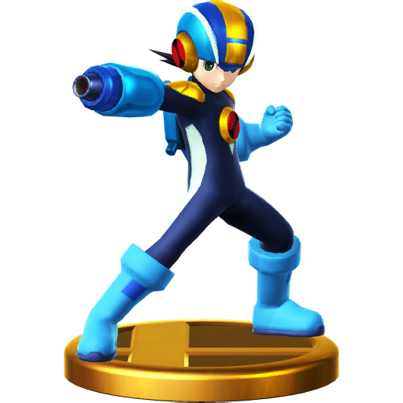</a></th>
    <th><b>MegaMan.EXE</b></th>
    <th>One of the main characters of the Mega Man Battle Network series. He's a NetNavi—a program with a unique personality stored in his real-world operator Lan Hikari's PET (Personal Terminal). He busts viruses in the virtual world and helps Lan deal with day-to-day issues. He's in Mega Man's Final Smash.</th>
  </tr>
  <tr>
    <th><a href="MegaMan Volnutt.png" >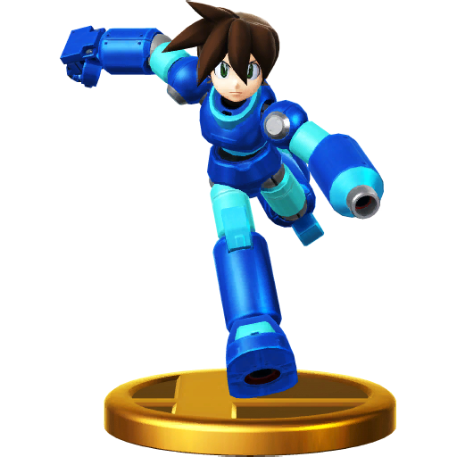</a></th>
    <th><b>MegaMan Volnutt</b></th>
    <th>The 14-year-old star of the Mega Man Legends series was found as a baby by Barrell Caskett, a Digger (someone who explores ancient ruins), who then took him in and raised him. He uses a wide array of weapons to fight his foes, the Reaverbots. In this game, he appears in Mega Man's Final Smash.</th>
  </tr>
  <tr>
    <th><a href="Mettaur.png" >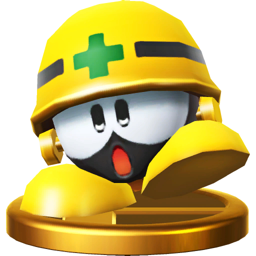</a></th>
    <th><b>Mettaur</b></th>
    <th>A familiar foe in the Mega Man series, noteworthy for the yellow helmet covering its whole body, which looks rather like the hard hats you see on construction sites. You can't hurt it until its face emerges from under the helmet, so watch for your chance to strike. Similar foes include the Cactuspy and the slippery New Met.</th>
  </tr>
  <tr>
    <th></th>
    <th><b>Proto Man</b></th>
    <th>A prototype robot developed by Dr. Light. After his completion, a critical problem was found in his energy core. He fled Dr. Light's care to die alone, but was then recovered by Dr. Wily and converted into a fighting machine. Since then, he's been both friend and foe to Mega Man and always something of a lone wolf.</th>
  </tr>
  <tr>
    <th><a href="Roll.png" >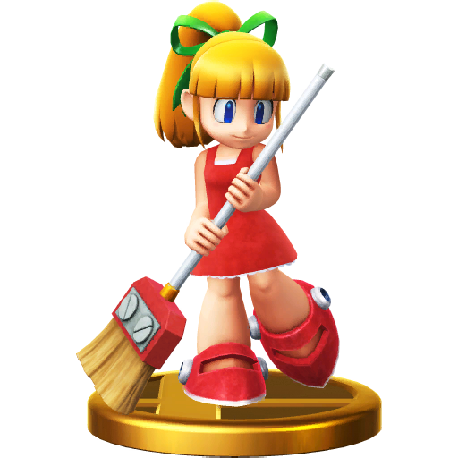</a></th>
    <th><b>Roll</b></th>
    <th>A household robot that Mega Man thinks of as a sister. This trophy is based on the original Roll from Mega Man games 1 to 7. Her appearance and backstory may differ somewhat between titles, but she always has long, blonde hair, a red outfit and a kind, reliable personality. In some games, you can even play as her!</th>
  </tr>
  <tr>
    <th></th>
    <th><b>Rush Coil</b></th>
    <th>Mega Man's robotic dog Rush has many talents. He can transform into vehicles and even fuse with Mega Man, which is both cool and slightly weird. Even cooler is his Rush Coil function. Use Mega Man's up special to call Rush, jump on his back, and enjoy the extra boost you only get from a bouncy, robotic-dog back spring.</th>
  </tr>
  <tr>
    <th></th>
    <th><b>Star Force Mega Man</b></th>
    <th>In the Mega Man Star Force series, young Geo Stelar and his alien partner merge to become the powerful fighter Mega Man. They've saved the planet on many occasions, but very few people know this Mega Man's true identity. He appears as part of Mega Man's Final Smash.</th>
  </tr>
  <tr>
    <th><a href="X.png" >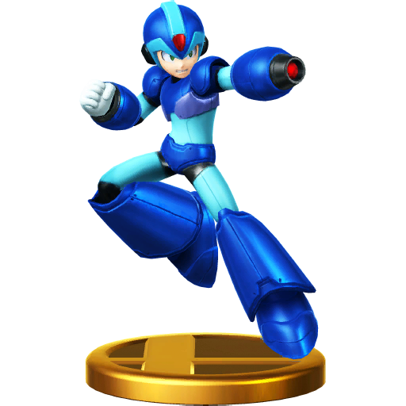</a></th>
    <th><b>X</b></th>
    <th>The hero of the Mega Man X series is a Reploid - a type of robot with the same thought patterns as a human. Built for combat, he's equipped with the X-Buster, a weapon capable of Charge Shots. He also upgrades himself with parts he finds. In this game, he appears as part of Mega Man's Final Smash.</th>
  </tr>
  <tr>
    <th></th>
    <th><b>Yellow Devil</b></th>
    <th>This towering foe splits himself into small bits to move across the stage and wreak havoc. If you can get behind him, you can use him as a shield and also hit his eye more easily. Hit his eye enough and he'll explode! Try to get your opponents caught in the explosion to do some real damage!</th>
  </tr>
  <tr>
    <th><a href="Zero.png" >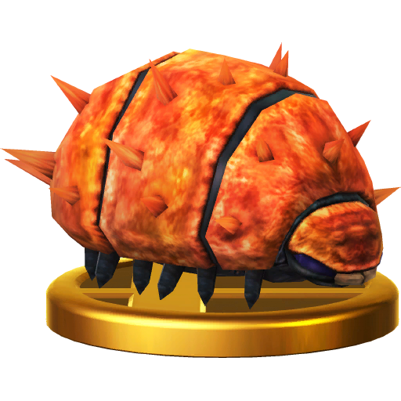</a></th>
    <th><b>Zero</b></th>
    <th>A powerful SA-rank Maverick Hunter who can instantly learn new moves from his enemies. Zero first made an appearance in Mega Man X, and is a close friend and mentor of X, that game's protagonist. He believes in X's hidden potential, and together they fight to take down Sigma and his renegade forces.</th>
  </tr>
</table>



<table class="fixed" border="1">
    <col width="150px" />
    <col width="100px" />
    <col width="600px" />
  <tr>
    <th></th>
    <th><b>Adam Malkovich</b></th>
    <th>Adam Malkovich, commander of the 07th Platoon of the Galactic Federation Army, was Samus's former superior. He was a man of few words, but would crack jokes from time to time to lift his team's spirits. Samus had great respect for him, seeing him as sort of a father figure. He died in the line of duty after saving her life.</th>
  </tr>
  <tr>
    <th></th>
    <th><b>Dark Samus</b></th>
    <th>An exceptionally strong and terrifying being made of Phazon. She's able to regenerate, brainwash her victims and even clone herself. When summoned in this game, she'll either fire rapid blasts from her Arm Cannon, launch homing missiles, or unleash Phazon across the surrounding area, depending on where her target is.</th>
  </tr>
  <tr>
    <th></th>
    <th><b>FG II-Graham</b></th>
    <th>In Metroid: Other M, Samus usually has to face these mobile turrets two at a time. They change speed as they fly around, and fire laser beams from their large guns. In this game's Pyrosphere stage, they fly in from above and fire lasers straight ahead when you attack them. Use those lasers to hit the other fighters and Ridley!</th>
  </tr>
  <tr>
    <th><a href="Gunship.png" >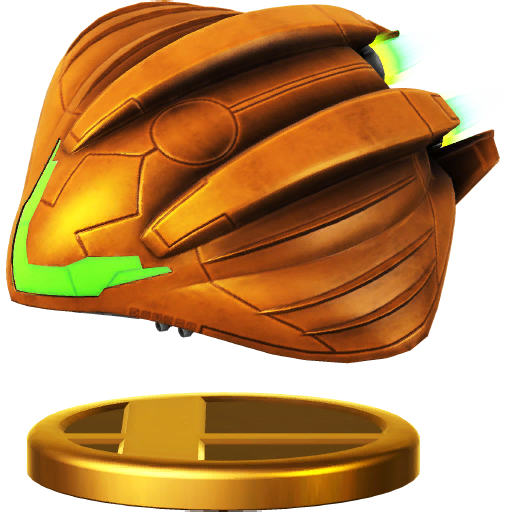</a></th>
    <th><b>Gunship</b></th>
    <th>The one partner Samus can rely on in almost all of her missions. In the wide unknown of outer space, she can always return to the Gunship for save haven. It allows her to replenish all of her energy and ammunition, and even serves as a resting spot for the player. In other words...it's a save point.</th>
  </tr>
  <tr>
    <th></th>
    <th><b>Gunship (Zero Suit Samus)</b></th>
    <th>Samus's Gunship is her way of travelling through space and her base of operations when exploring hostile planets. In Zero Suit Samus's Final Smash, she can use her Gunship to fire powerful beams at other fighters, hitting them multiple times, even if they're hiding off-screen! At least they can be thankful it doesn't go on forever.</th>
   </tr>  
  <tr>
    <th><a href="Joulion.png" >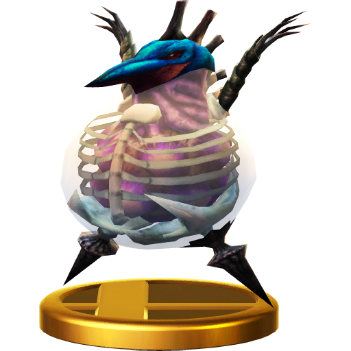</a></th>
    <th><b>Joulion</b></th>
    <th>These enemies from Metroid: Other M look a bit like electrified water fleas. They inflate as they take damage, and eventually blow up. They also appear in the Pyrosphere stage in this game. There, they explode even when they don't take damage, but you can make the blast even deadlier by hitting them with combos, so attack them anyway!</th>
  </tr>
  <tr>
    <th></th>
    <th><b>King Kihunter</b></th>
    <th>Like social insects in real life, Kihunters work as a colony, with a hierarchy and roles to play. Basically, they're like bees. They kind of look like bees too... This gigantic insect seems to be the leader of the cloned Kihunter colony that appears in Metroid: Other M. In bee terms, that would make it the queen.</th>
  </tr>
  <tr>
    <th></th>
    <th><b>Little Birdie</b></th>
    <th>Everyone knows Ridley as a terrifying evil space dragon, but would you have guessed he looked like this as a baby? He's kind of cute and creepy at the same time. Don't let his innocent act fool you into thinking he'd make a nice pet, though - once he sheds his skin and enters his reptile phase, you'll just become his next meal!</th>
  </tr>
  <tr>
    <th></th>
    <th><b>Madeline Bergman</b></th>
    <th>Madeline is the woman responsible for giving the intelligent android MB a human name: Melissa Bergman. The family name of Bergman is Madeline's own, and it seems Melissa saw Madeline as something of a mother. However, due to a terrible misunderstanding, Melissa believed Madeline had betrayed her.</th>
  </tr>
  <tr>
    <th></th>
    <th><b>Melissa Bergman</b></th>
    <th>When Samus first encountered her on the Bottle Ship, she introduced herself as Madeline. Only later did Samus discover that she was actually an android called Melissa, host to the artificial intelligence known as MB, and that she bore a grudge against humans for trying to reprogram her after she developed emotions.</th>
  </tr>
  <tr>
    <th><a href="Metroid.png" >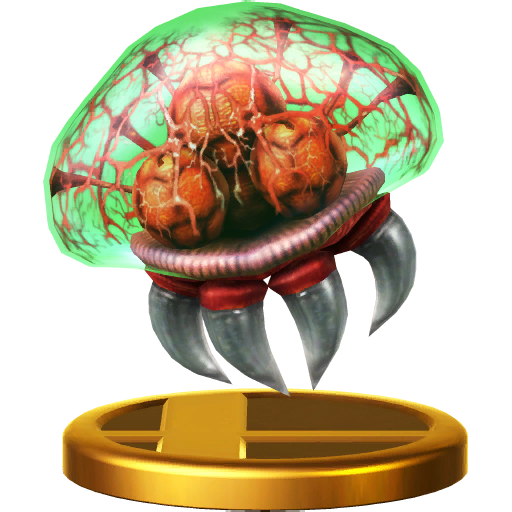</a></th>
    <th><b>Metroid</b></th>
    <th>Mysterious floating life-forms, discovered on the planet SR388, that absorb energy from other living beings. They're tough, except when they're cold. In this game, they'll try to attach themselves to fighters' heads and drain their energy. Press all the buttons you can to shake them off!</th>
  </tr>
   <tr>
    <th></th>
    <th><b>Morph Ball</b></th>
    <th>One of the numerous modules integrated into Samus's Power Suit. This one allows her to transform into a compact mobile sphere and explore tight spaces. In the very first Metroid game, it was known as Maru Mari, which is just Japanese for "roll up," but it was later changed to the much-cooler-sounding Morph Ball.</th>
  </tr>
  <tr>
    <th></th>
    <th><b>Mother Brain</b></th>
    <th>A mainstay of the Metroid series and the final boss Samus faces on Planet Zebes. In this game, she grows to a gargantuan size and fires all sorts of energy blasts at you. Good news: you can beat her! Better news: doing so won't trigger a self-destruct sequence forcing you to make your escape!</th>
  </tr>
  <tr>
    <th></th>
    <th><b>Mystery Creature</b></th>
    <th>If Little Birdie is Ridley's cute baby years, this must be his awkward teenage phase. The feathers on his back are the only real clue that it's the same creature. Is there something in Ridley's genes that make him hate Samus so much? The original Ridley killed her parents, and now this one is out to get her too!</th>
  </tr>
  <tr>
    <th></th>
    <th><b>Nightmare (Metroid)</b></th>
    <th>A biological weapon developed in secret by a radical group within Galactic Federation Army. Though its grotesque, six-eyed face could certainly give anyone nightmares, looking away is not a wise thing to do. The only way to eradicate this fearsome creature once and for all is to expose the face and attack it head-on.</th>
  </tr>
  <tr>
    <th><a href="Phantoon.png" >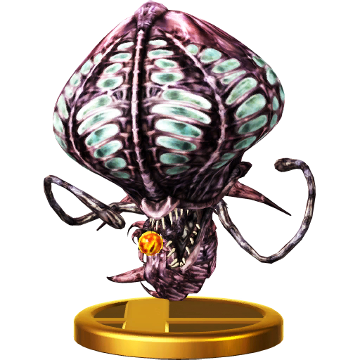</a></th>
    <th><b>Phantoon</b></th>
    <th>Samus originally faced this life form in Super Metroid, but it appears again as a secret boss in Metroid: Other M after finishing the main story. Although the mysterious ethereal creature can only materialise its head in the physical world, its true form is said to have the full body of a giant.</th>
  </tr>
  <tr>
    <th></th>
    <th><b>Queen Metroid</b></th>
    <th>Have you ever met people who thought "Metroid" was the name of the game's heroine? Putting "Queen" in front might just make it worse. But if you show them what a Queen Metroid REALLY looks like, they won't make that mistake again in a hurry. Metroids are fearsome creatures, and the Queen is the nastiest of the lot.</th>
  </tr>
  <tr>
    <th></th>
    <th><b>RB176 Ferrocrusher</b></th>
    <th>As you might guess from the colouring, this is an industrial machine. Of course, it ends up attacking Samus anyway... It's covered in tools that were probably meant for less violent purposes, but they work very effectively as weapons. To defeat it, just stay calm and freeze its moving parts, then dismantle it...with extreme force.</th>
  </tr>
  <tr>
    <th><a href="Ridley.png" >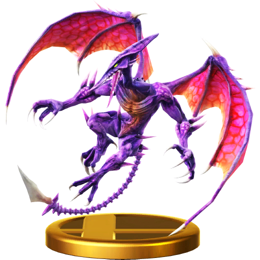</a></th>
    <th><b>Ridley</b></th>
    <th>Samus's long-standing rival in battle. In this game, he's a common foe to all the fighters in the Pyrosphere stage. However, if you manage to launch him or knock him over, he'll become an ally to whoever dealt the last blow. If you can defeat him during a timed battle, you'll get +1 KO out of it!</th>
  </tr>
  <tr>
    <th><a href="Samus.png" >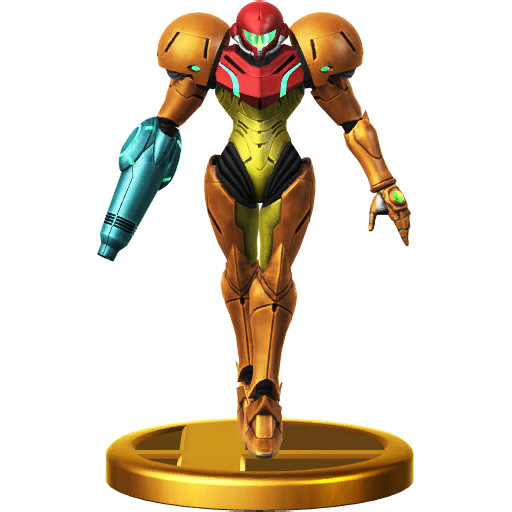</a></th>
    <th><b>Samus</b></th>
    <th>The heroine of the Metroid series, Samus Aran. Her missions take her across the reaches of space, and her Power Suit gives her immeasurable fighting prowess. In this game, she uses a variety of ranged attacks based around beams and missiles. When her Charge Shot is fully charged, it can launch foes with devastating force.</th>
  </tr>
  <tr>
    <th></th>
    <th><b>Samus (Alt.)</b></th>
    <th>Samus's up smash attack, Cover Fire, fires five small blasts overhead, making it great for countering incoming aerial attacks. Her Missile attack fires a homing missile if you hold sideways and then press the special button, but if you do those things at the same time, you'll fire a Super Missile.</th>
  </tr>
  <tr>
    <th></th>
    <th><b>Samus (Dark Suit)</b></th>
    <th>No, not what you might wear to a formal party - this is one of the Power Suit types in Samus's arsenal. The Varia Suit might have the most iconic look, but sadly its defensive abilities are a bit lacking. This suit is much more useful on Dark Aether. The Luminoth created it to neutralise the deadly substances in the planet's air.</th>
  </tr>
  <tr>
    <th></th>
    <th><b>Screw Attack</b></th>
    <th>A badge-type item that lets you use Samus's powerful Screw Attack technique when you jump. If you use it at the right moment, you might even be able to pull off deadly combos with other mid-air strikes. But watch out - some characters' jumps might not be as high while using this.</th>
  </tr>
  <tr>
    <th><a href="Vorash.png" >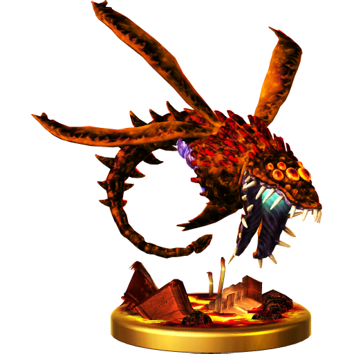</a></th>
    <th><b>Vorash</b></th>
    <th>A large, fish-like monster that's more at home in an ocean of lava than underwater. Defeating it may seem like an impossible task at first, but Samus Aran knows how to persevere. By firing her Grapple Beam into its mouth, she pulls it out of the lava like a master fisherman, leaving it writhing helplessly on solid ground.</th>
  </tr>
  <tr>
    <th><a href="Zebesian.png" >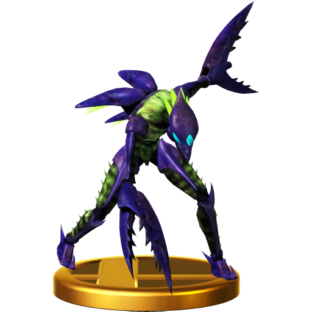</a></th>
    <th><b>Zebesian</b></th>
    <th>This race forms the backbone of the evil Space Pirates, an organization plotting to take over the galaxy. Metroid: Other M features Cyborg Zebesians, bioweapons created through cloning and genetic manipulation of Zebesian DNA. These emotionless soldiers have none of the intelligence of the natural Zebesian race.</th>
  </tr>
  <tr>
    <th></th>
    <th><b>Zero</b></th>
    <th>These arthropods with hard exoskeletons are the larval form of Kihunters, a type of enemy from the Metroid series. In this game, they appear in the Pyrosphere stage, where they fall from above, then just move around slowly. Throw them to attack your opponents or Ridley, or keep hold of one to make yourself harder to launch.</th>
  </tr>
  <tr>
    <th></th>
    <th><b>Zero Laser</b></th>
    <th>In Samus's Final Smash, she unleashes a huge laser beam from her Arm Cannon that draws opponents to the centre of the beam. Quite handy, since the closer they are to the centre, the more damage they'll take! You can also angle it up and down (albeit slowly), letting you catch more of your enemies and create more havoc.</th>
  </tr>
  <tr>
    <th></th>
    <th><b>Zero Suit Samus</b></th>
    <th>Without her Power Suit, Samus Aran may not have her usual strength, specials moves or over-powered arm cannon, but her Jet Boots definitely kick things up a notch in their own way. The Paralyzer, her gun, does just what you'd expect it to, but it can also turn into a whip for attacking and grabbing onto edges while falling.</th>
  </tr>
  <tr>
    <th></th>
    <th><b>Zero Suit Samus (Alt.)</b></th>
    <th>Zero Suit Samus's Boost Kick up special finishes with a swift sideways kick. If you start the move close to an opponent, you can hit them up to eight times and launch them sideways! Her main down special, Flip Jump, buries opponents if you land on them at the end of it. Alternatively, press the button again mid-flip for a drop kick.</th>
  </tr>
</table>



<table class="fixed" border="1">
    <col width="150px" />
    <col width="100px" />
    <col width="600px" />
  <tr>
    <th></th>
    <th><b>Flying Man</b></th>
    <th>The Flying Men from EarthBound are five kind brothers with a cruel fate. They live together in a house on the outskirts of Magicant. The brothers gladly join Ness on his journey, but if they fall in battle, they return home to be buried. In Smash Tour, they'll ally themselves with the first player to touch them.</th>
  </tr>
  <tr>
    <th></th>
    <th><b>Franklin Badge</b></th>
    <th>The Franklin Badge might not be flashy, but it's an impressive piece of kit. This tiny thing acts as a reflector shield for any projectiles fired your way. With no particular drawbacks to consider either, it's a real boon if you can snag it. It will run out, though, so don't get careless!</th>
  </tr>
  <tr>
    <th></th>
    <th><b>Jeff</b></th>
    <th>This boy from EarthBound is the same age as Ness and goes to Snow Wood Boarding School. His dad, the genius scientist Dr. Andonuts, was the brain behind Jeff's weapon: the big bottle rocket. It's made up of four small missiles and one large one. And...who knows? Maybe you'll even get some extra firepower out of it!</th>
  </tr>
  <tr>
    <th></th>
    <th><b>Lucas</b></th>
    <th>Lucas, the younger of the twin brothers from Tazmily, comes originally from the Japan-only game, Mother 3, and now makes his triumphant return to Super Smash Bros.! Here he makes great use of his PSI powers with lots of projectile attacks, and can use his faster attacks on anybody who gets too close.</th>
  </tr>
  <tr>
    <th></th>
    <th><b>Lucas (Alt.)</b></th>
    <th>Lucas's up special, PK Thunder, can either hot enemies multiple times, or hit Lucas himself to push him into a powerful charge attack. Meanwhile, his up smash attack is the most powerful launching move in the entire game, so make good use of it! It's a wide-range attack that is most effective right after Lucas unleashes it.</th>
  </tr>
  <tr>
    <th></th>
    <th><b>Lucas (Original)</b></th>
    <th>Once upon a time, Lucas was a bit of a cry-baby. You might even say he was a wimp. But then, well...he had more than his fair share of rough times and toughened up a bit. Who knows what he's up to now? Whatever he's doing, his story - much like Ness's - lives on in the hearts of all Mother series fans.</th>
  </tr>
  <tr>
    <th></th>
    <th><b>Mr. Saturn</b></th>
    <th>Mr. Saturns are curious beings that speak their own language. They might not look it, but they're scientific geniuses! In this game, they tend to just do their own thing, but you can throw them to deal...a bit of damage. They're good at breaking shields, though, and make adorable noises when they do!</th>
  </tr>
  <tr>
    <th><a href="Ness.png" >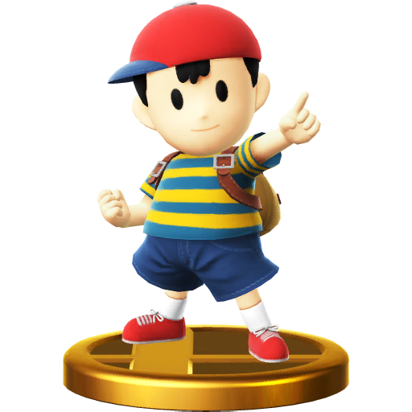</a></th>
    <th><b>Ness</b></th>
    <th>From Onett in Eageland comes this young lad. He may not look like much, but he has powerful psychic abilities, and they really come in handy in EarthBound. They come in handy in this game, too. Did you know you can control his PK Thunder bolt? Aim it at Ness himself to send him flying, absolutely clobbering anyone in his path!</th>
  </tr>
  <tr>
    <th></th>
    <th><b>Ness (Alt.)</b></th>
    <th>Ness may have psychic powers, but that doesn't mean he shies away from getting physical. His side smash packs a real punch if you hit enemies with the end of his bat, and it can even reflect projectiles! His up and down smashes have a lot of range, meaning when you play as Ness, it's always easy to land hits on your foes!</th>
  </tr>
  <tr>
    <th></th>
    <th><b>PK Starstorm (Lucas)</b></th>
    <th>You can adjust the direction of the shooting stars in this attack! Rain stars down on multiple fighters at once, or be mean and pick on a single fighter. The choice is yours! If a star connects, it will deal ongoing fire damage, making it hard for opponents to return to the stage.</th>
  </tr>
  <tr>
    <th></th>
    <th><b>PK Starstorm (Ness)</b></th>
    <th>In EarthBound, this PSI ability belonged to Poo, the Crown Prince of Dalaam and one of Ness's friends. Ness must have learned it especially for Smash Bros.! The attack makes a shower of meteors fall onto the stage, damaging any foes it hits. While the attack's in progress, Ness is invincible and can adjust the meteors' trajectory.</th>
  </tr>
  <tr>
    <th><a href="Porky.png" >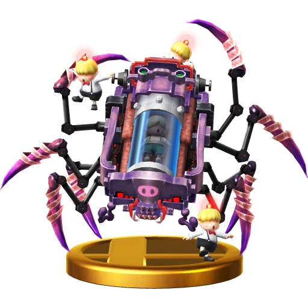</a></th>
    <th><b>Porky</b></th>
    <th>In Earthbound, Porky was just a chubby, selfish little boy. But by the time Mother 3 comes around... well, just look at what he's become. It would probably take another two full games just to explain how this remarkable transformation came to pass. Oh, Porky, where in the world did you go wrong...?</th>
  </tr>
  <tr>
    <th><a href="Starman.png" >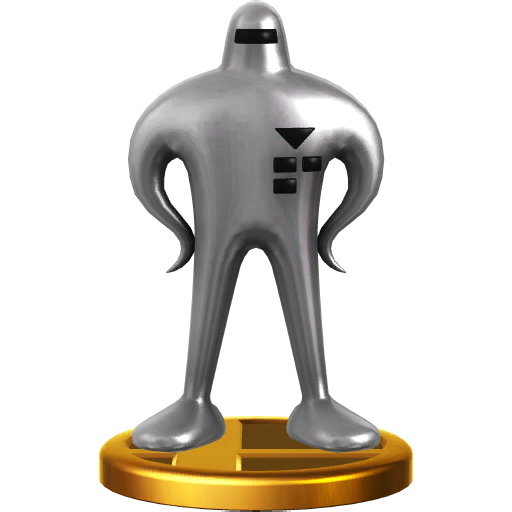</a></th>
    <th><b>Starman</b></th>
    <th>Starmen, the evil Giygas's henchman in the Mother series, are renowned alien space assassins. Summon one in this game, and it'll teleport about, firing off attacks like PK Beam γ, which targets a foe, and PK Beam Ω, which fires across the whole stage in up to four directions. Starmen can be taken out, but...not easily.</th>
  </tr>
  <tr>
    <th></th>
    <th><b>Ultimate Chimera</b></th>
    <th>If you ever find yourself faced with this thing, run! Don't even stop to ask yourself, "which two species were mashed up to to create THIS?!", or you'll be the one getting mashed up. It's so insanely out of control, even the people at the Chimera Laboratory wish they'd never even made it. Eek!</th>
  </tr>
</table>



<table class="fixed" border="1">
    <col width="150px" />
    <col width="100px" />
    <col width="600px" />
  <tr>
    <th><a href="Blinky.png" >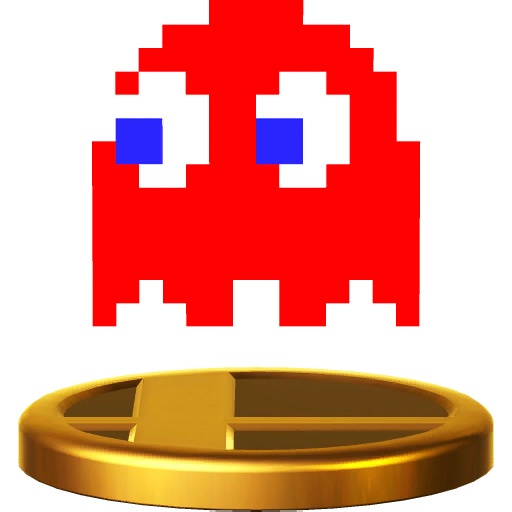</a></th>
    <th><b>Blinky</b></th>
    <th>A red ghost that chases after PAC-MAN in the PAC-MAN series, noted for the way incessantly follows PAC-MAN. When you get further in the stage, he also gets a speed boost, which can be quite terrifying! In this game, he appears in PAC-MAN's side smash and as part of an Assist Trophy.</th>
  </tr>
  <tr>
    <th></th>
    <th><b>Bonus Fruit</b></th>
    <th>All kinds of fruits appear in the original PAC-MAN—along with some other items in later rounds—and they're a great way to rack up a high score. Here, PAC-MAN's standard special lets him throw one of these. Different ones have different movement patterns and launching ability. Press the button again to pick!</th>
  </tr>
  <tr>
    <th><a href="Clyde.png" >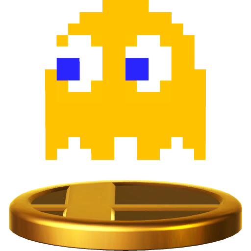</a></th>
    <th><b>Clyde</b></th>
    <th>An orange ghost that doesn't really chase after PAC-MAN all that much in the PAC-MAN series. Instead, he chooses to just wander around, doing his own thing. In PAC-LAND he appears as a tough and speedy enemy. In this game, he shows up in PAC-MAN's down smash and as part of an Assist Trophy.</th>
  </tr>
  <tr>
    <th></th>
    <th><b>Fire Hydrant</b></th>
    <th>Fire hydrants appear as obstacles in the game PAC-LAND. Some of them shoot water, and some even reveal items when pushed. In this game, PAC-MAN's down special puts a fire hydrant under him that shoots water to push back foes. Try using it as a wall or dropping it on someone who's off the stage!</th>
  </tr>
  <tr>
    <th></th>
    <th><b>Ghosts (PAC-MAN)</b></th>
    <th>Each of the four types of ghost in PAC-MAN behaves a bit differently. In this game, they appear in 8-bit form and move around the stage in their own quirky way to torment the fighters. The longer they chase you, the faster they move - and even if you get a Power Pellet and defeat them, they'll be back soon enough!</th>
  </tr>
  <tr>
    <th><a href="Inky.png" >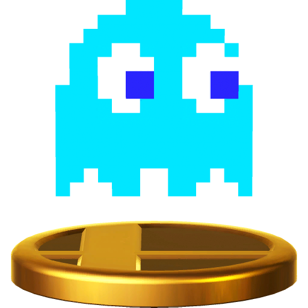</a></th>
    <th><b>Inky</b></th>
    <th>A blue ghost that chases after PAC-MAN in the PAC-MAN series...some of the time. He has a tendency to move around indecisively depending on whether or not PAC-MAN is nearby. In this game, he appears in PAC-MAN's up smash and as part of an Assist Trophy.</th>
  </tr>
  <tr>
    <th></th>
    <th><b>Mother Fairy</b></th>
    <th>In PAC-LAND, PAC-MAN's quest to help a lost fairy get home to the Mother Fairy takes him through all sorts of places. As always, though, ghosts do their best to get in PAC-MAN's way. When he finally gets the fairy home safe and sound, the Mother Fairy gives him a pair of magic boots so that he can quickly fly back to his family.</th>
  </tr>
  <tr>
    <th><a href="PAC-MAN.png" >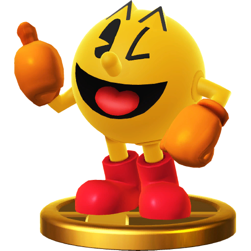</a></th>
    <th><b>PAC-MAN</b></th>
    <th>The yellow, circular hero of the game PAC-MAN, which is recognised as the "Most Successful Coin-Operated Arcade Game" by Guinness World Records. In this game, some of his attacks are based on the original PAC-MAN. Charge up his Power Pellet move, then aim it right at an opponent to wakawaka them extra hard.</th>
  </tr>
  <tr>
    <th></th>
    <th><b>PAC-MAN (Alt.)</b></th>
    <th>PAC-MAN's Fire Hydrant down special pushes opponents away with blasts of water. You can drop the hydrant on top of your opponents to damage them, but they can also attack it and hit you with it to cause damage! His Pac-Jump up special spawns a trampoline he can jump on three times, and the third jump is especially high!</th>
  </tr>
  <tr>
    <th></th>
    <th><b>PAC-MAN's House</b></th>
    <th>PAC-MAN must have always dreamed of raising a family in a house that looks like a face. Well, after spending ages eating power pellets and taking out ghosts, his dream came true! In another game - one which marked his 20th anniversary - he has a bigger house with more rooms. Moving up in the world, eh, PAC-MAN?</th>
  </tr>
  <tr>
    <th><a href="Pinky.png" >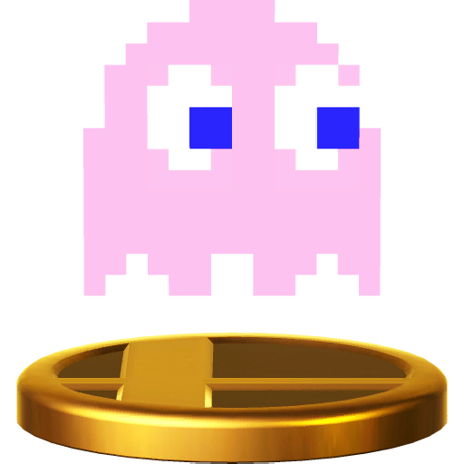</a></th>
    <th><b>Pinky</b></th>
    <th>A pink ghost that strategically targets PAC-MAN in the PAC-MAN series. She can anticipate PAC-MAN's moves and get ahead of him quick enough to ambush him with a pincer attack. In this game, she appears in PAC-MAN's down smash and as part of an Assist Trophy.</th>
  </tr>
  <tr>
    <th></th>
    <th><b>Power Pellet</b></th>
    <th>These round, flashing items are found in all four corners of the stage. When PAC-MAN eats one, the normally fearsome ghosts turn blue and run off, which is the sign that PAC-MAN can take them out. In this game, PAC-MAN eats a Power Pellet in his side special, sending him rushing in the direction he was facing when he ate it.</th>
  </tr>
  <tr>
    <th></th>
    <th><b>SUPER PAC-MAN</b></th>
    <th>PAC-MAN's Final Smash turns him into this huge form that appeared in the arcade game also called Super PAC-MAN. In this form, PAC-MAN can eat his foes to deal damage to them and reduce them just a pair of eyes. He can move freely in all four directions, loop around the screen, and... obtain a score of up to 7,650 points!</th>
  </tr>
</table>



<table class="fixed" border="1">
    <col width="150px" />
    <col width="100px" />
    <col width="600px" />
  <tr>
    <th><a href="Alph.png" >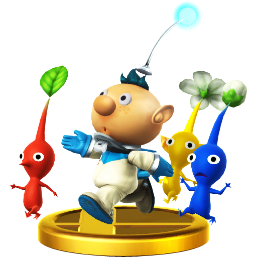</a></th>
    <th><b>Alph</b></th>
    <th>A member of the crew that crash-landed on PNF-404. This young engineer is separated from the rest of his team during landing, but as an engineer, he's just as worried about their ship, the SS Drake. While looking for his crewmates and ship, Alph encounters some strange yet helpful little creatures...</th>
  </tr>
  <tr>
    <th></th>
    <th><b>Blue Pikmin</b></th>
    <th>The things that make blue Pikmin different from all the other Pikmin are that they have mouths and that they're pretty good swimmers. They're slightly hardier than most other Pikmin, and they do more damage when you throw them. So, as soon as you get one of these, make sure to throw it right at someone straight away!</th>
  </tr>
  <tr>
    <th><a href="Brittany.png" >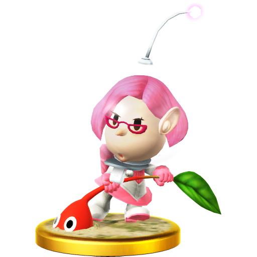</a></th>
    <th><b>Brittany</b></th>
    <th>Brittany is part of the crew that crash-lands on PNF-404. She calls for help using her KopPad, and when Alph finally reaches her, he's got a bunch of Pikmin with him. The biologist in her is deeply fascinated with these creatures, but unfortunately for Alph, that fascination isn't enough to keep her from bossing him around.</th>
  </tr>
  <tr>
    <th><a href="Bulborb.png" >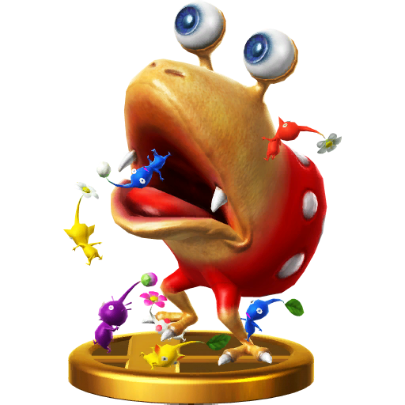</a></th>
    <th><b>Bulborb</b></th>
    <th>These creatures from the Pikmin series have snaillike protruding eyes, huge mouths, and really bad tempers. Despite their cute appearance, they'll happily gobble up Pikmin! In Smash Bros., they appear on the Garden of Hope stage, wandering around or chasing the poor Pikmin. Thankfully, they don't seem interested in the fighters duking it out.</th>
  </tr>
  <tr>
    <th></th>
    <th><b>Burrowing Snagret</b></th>
    <th>A strange creature that looks like it's part bird and part snake. At 35cm in length, it's fairly small by our standards, but for Pikmin, it's a towering monster! Another thing that makes it monstrous is that it sees Pikmin as a nutritious meal. If you're not careful, it'll pop out of the ground and gobble them up before you know it!</th>
  </tr>
  <tr>
    <th><a href="Charlie.png" >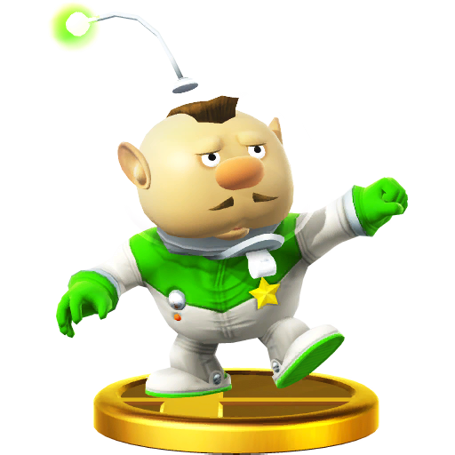</a></th>
    <th><b>Charlie</b></th>
    <th>Charlie is the leader of the group that crash-lands on PNF-404. After the crash, he wakes up alone in snowy surroundings, and then uses his KopPad to try to make contact with the rest of his crew. When he gets no response, he decides to start walking and spots some small creatures. Hurray! Some helpful yellow Pikmin!</th>
  </tr>
  <tr>
    <th></th>
    <th><b>End of Day</b></th>
    <th>On the planet of the Pikmin, the native creatures get quite violent come nightfall, so Olimar retreats into orbit every evening. That's how his Final Smash works, too: Olimar takes off in his trusty Dolphin[sic], then in comes the beasties to take care of the other fighters. When Olimar returns, make sure he touches down, er...safely!</th>
  </tr>
  <tr>
    <th></th>
    <th><b>Hocotate Bomb</b></th>
    <th>The flagship of Hocotate Freight has been reinvented as...a bomb! To arm it, throw it, then wait. Or give it a nudge - up to you. It'll shoot up in the air, then after a bit, fall back down to its starting point and go off. Try to remember where it was set off - you really don't want to get caught in the blast.</th>
  </tr>
  <tr>
    <th></th>
    <th><b>Iridescent Flint Beetle</b></th>
    <th>These guys appear in the Pikmin series, dropping rare items and fleeing nearby Pikmin. Purple Pikmin can flip them over, making the whole "getting rare items" process a lot easier. According to Louie, cooking one of these guys yields a meal with a distinct and delicious flavor.</th>
  </tr>
  <tr>
    <th></th>
    <th><b>Iridescent Glint Beetle</b></th>
    <th>A golden creature from Pikmin 2. They don't pop up very often at all, but when they do, they scuttle around speedily. When you flip them over, they drop nectar and rare treasures. In Smash Bros., they appear in Smash Tour, where you can bump into them to make them drop extra fighters!</th>
  </tr>
  <tr>
    <th><a href="Louie.png" >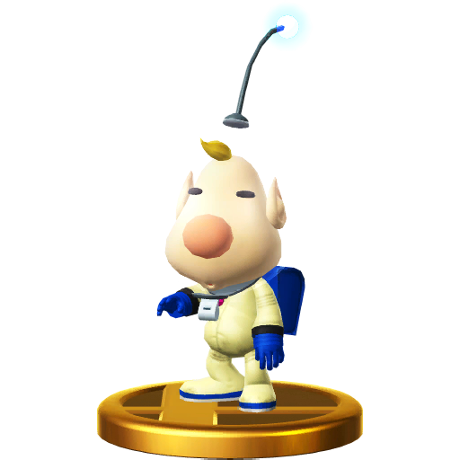</a></th>
    <th><b>Louie</b></th>
    <th>Louie was one of the main characters from Hocotate in Pikmin 2. In Pikmin 3, he's got a super appetite, to say the least. Alph and crew saved him from a swarm of Scornets, only for him to run off with all their food the very next day! It seems like someone should think a little less about food, and a little more about apologising.</th>
  </tr>
  <tr>
    <th><a href="Olimar.png" >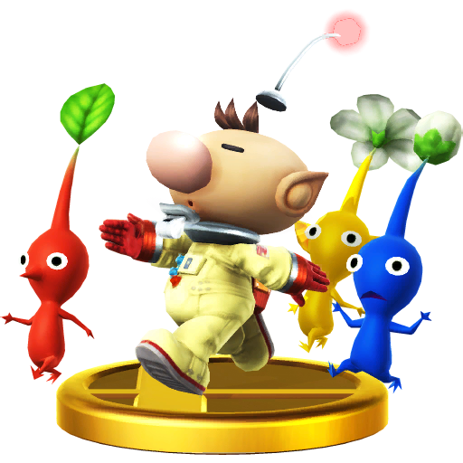</a></th>
    <th><b>Olimar</b></th>
    <th>Captain Olimar, veteran Hocotate Freight astronaut, joins forces with Pikmin again in this game to take on the world. Olimar isn't much of an attacker without Pikmin by his side, so you should always keep some ready. Pikmin have different abilities depending on their colour, so learn how they work to use them effectively!</th>
  </tr>
  <tr>
    <th></th>
    <th><b>Olimar (Alt.)</b></th>
    <th>Pikmin aren't just good for attacking, you know. For example, when you throw them, they can pick up items on their way back. Only items that aren't very heavy, but still! Also, if there's someone charging or shooting at you, a well-timed Pikmin throw can stop them. Just don't forget to replace your Pikmin when they're gone!</th>
  </tr>
  <tr>
    <th></th>
    <th><b>Peckish Aristocrab</b></th>
    <th>This crab-like life form from Pikmin 3 traps Pikmin in its bubbles. When it appears in the Garden of Hope stage, it creates a path of destruction from one end of the stage to the other, but if the central bridge isn't there, it'll just fall right down. You can tell where it'll appear from by the telltale appearance of bubbles, so watch out!</th>
  </tr>
  <tr>
    <th><a href="Pellets.png" >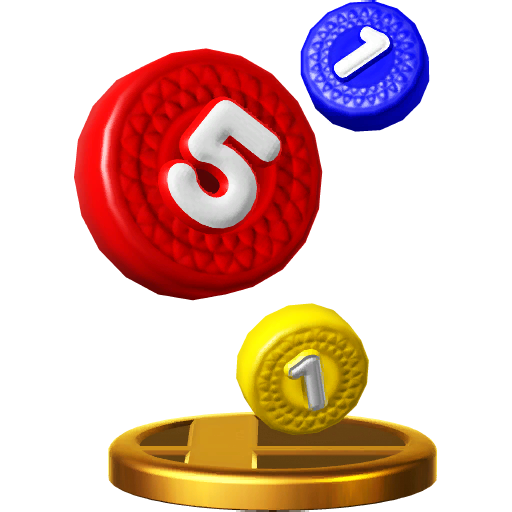</a></th>
    <th><b>Pellets</b></th>
    <th>The crystallised essence of the Pikmin's home planet. You'll need these things if you want more Pikmin, so harvest them by attacking the Pellet Posy they come from. By the way, keep an eye on the number on the front - it goes up little by little, and the higher it goes, the more items you'll get when you lob the pellet at an Onion!</th>
  </tr>
  <tr>
    <th></th>
    <th><b>Plasm Wraith</b></th>
    <th>A mysterious life-form in the Formidable Oak, the final area of Pikmin 3. Formed from a gelatinous substance, it normally can't be damaged at all...but with Olimar newly rescued, maybe he holds the key. When it takes humanoid form, it unleashes some terrifying attacks! You'll need all your skills to take it down and finish the game!</th>
  </tr>
  <tr>
    <th><a href="Purple Pikmin.png" >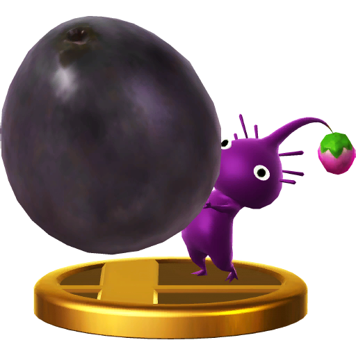</a></th>
    <th><b>Purple Pikmin</b></th>
    <th>These purple Pikmin are much stronger than their colourful counterparts, but they're also slower and heavier. In Pikmin, they can be thrown at animals to stun them! In this game, they're good at both attacking and launching, but since they haven't got good reach, you'll need to get up close and personal with your foes first!</th>
  </tr>
  <tr>
    <th></th>
    <th><b>Quaggled Mireclops</b></th>
    <th>A gigantic creature that appears in Pikmin 3. It's so large that it has often been mistaken for a forest. It's pretty docile until its crystal head is attacked, at which point it goes on a rampage! It'll lose its balance if the hooves are attacked. Be careful though—it likes to slurp up Pikmin with its tongue.</th>
  </tr>
  <tr>
    <th></th>
    <th><b>Red Pikmin</b></th>
    <th>Telling Red Pikmin apart from the other Pikmin is easy: these ones have long, pointy noises. Also, they're red. They're the very first kind of Pikmin Olimar finds on their planet, and their high attack power makes them very useful. In this game, they can deal powerful attacks, and they're very resistant to fire damage.</th>
  </tr>
  <tr>
    <th></th>
    <th><b>Rock Pikmin</b></th>
    <th>These Pikmin are made of solid rock, so they can stand up to a lot of attacks and won't get hurt when they get stepped on. They specialize in body blows, dealing a lot of damage when thrown, and they can also break right through glass and crystal. They can't latch on to other creatures, though. But that's OK—nobody's perfect!</th>
  </tr>
  <tr>
    <th></th>
    <th><b>S.S. Drake</b></th>
    <th>While its name might remind you of the famous explorer Sir Francis Drake, this ship is actually named after Alph's grandfather. After the S.S. Drake crash-lands, Alph finds his way back to it and soon gets it working. However, the crew must locate the cosmic-drive key before the vessel can return to Koppai.</th>
  </tr>
  <tr>
    <th></th>
    <th><b>Swooping Snitchbug</b></th>
    <th>A strange flying insectoid creature from the Pikmin series. Much like a fly rubbing its legs together, the Swooping Snitchbug has a habit of rubbing its hands. When it swoops down and snatches Pikmin from the ground, it doesn't eat them. Instead, it just throws them back to the ground after a few seconds. Why? Who knows?!</th>
  </tr>
  <tr>
    <th></th>
    <th><b>White Pikmin</b></th>
    <th>These small, fast-footed Pikmin are white with red eyes. That ominous look they have might give you the chills, and you'd be right to be scared - the little blighters are poisonous! In this game, they'll hang on to any enemy you throw them at and generously share their venom with them.</th>
  </tr>
  <tr>
    <th></th>
    <th><b>Winged Pikmin</b></th>
    <th>This particular type of Pikmin has a pink body, blue eyes and...wings? Yep, they can fly, and in this game, they can even give Olimar a lift. The only thing is they'll get tired very easily, especially if they're carrying lots of other Pikmin at the same time. Go easy on them, OK?</th>
  </tr>
  <tr>
    <th></th>
    <th><b>Yellow Pikmin</b></th>
    <th>Yellow Pikmin have big, sharp ears and conduct electricity very well. These two facts are most likely unrelated. Olimar's side special can throw this Pikmin high into the air and cause electrical damage to all fighters who stray too close!</th>
  </tr>
  <tr>
    <th></th>
    <th><b>Yellow Wollywog</b></th>
    <th>A frog-like creature from the Pikmin series with a strangely egg-shaped body. Though its legs are short and stubby, it is nevertheless capable of gigantic leaps, which prove deadly to any unfortunate Pikmin that happen to be nearby when it lands. Despite typically being found near water, it's not much of a swimmer.</th>
  </tr>
</table>



<table class="fixed" border="1">
    <col width="150px" />
    <col width="100px" />
    <col width="600px" />
  <tr>
    <th><a href="Abomasnow.png" >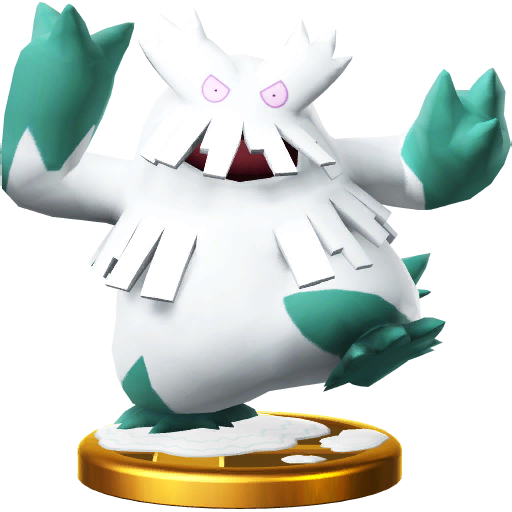</a></th>
    <th><b>Abomasnow</b></th>
    <th>Abomasnow is a Grass- and Ice-type Pokémon said to live the quiet life in snowy mountains, but it's been known to mingle with humans too. It can whip up blizzards to attack anyone who strays too close, and it can throw a powerful Ice Punch either straight in front of back over its shoulder, so there's nowhere to hide!</th>
  </tr>
  <tr>
    <th><a href="Arceus.png" >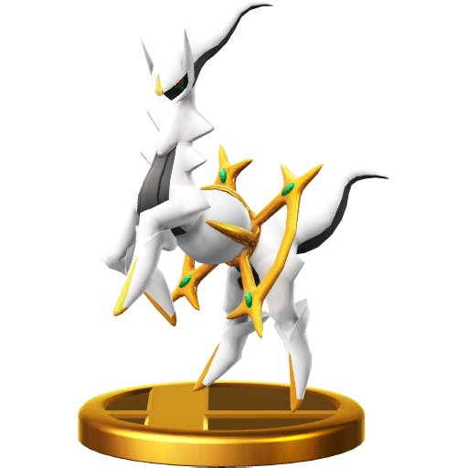</a></th>
    <th><b>Arceus</b></th>
    <th>A Pokémon said to have hatched from an egg that appeared from nothing. Newly hatched, it created the world and the sky. Its Gravity attack will bring any fighter in midair crashing down to earth. No ground below you? Looks like you're going to go plummeting off the stage as if you'd been hit by a Meteor Smash!</th>
  </tr>
  <tr>
    <th><a href="Axew.png" >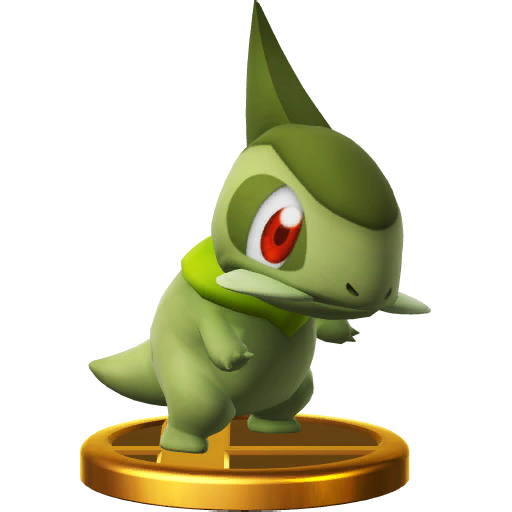</a></th>
    <th><b>Axew</b></th>
    <th>No, that's not some delicious snack poking out either side of its mouth - those are tusks. Axew uses them to break through the hard outer shells of its favourite fruits and to carve territorial markings on trees. Occasionally, its tusks can break, but they just grow back stronger than before.</th>
  </tr>
  <tr>
    <th><a href="Bellossom.png" >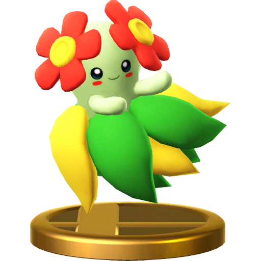</a></th>
    <th><b>Bellossom</b></th>
    <th>Two unusual things happen when Gloom evolves into Bellossom: it gets smaller, and it loses its secondary type, Poison, becoming a purely Grass-type Pokémon. These Pokémon are most commonly found in groups in the tropics. Here, the more damage fighters have taken, the longer Sweet Scent keeps them asleep!</th>
  </tr>
  <tr>
    <th><a href="Blastoise.png" >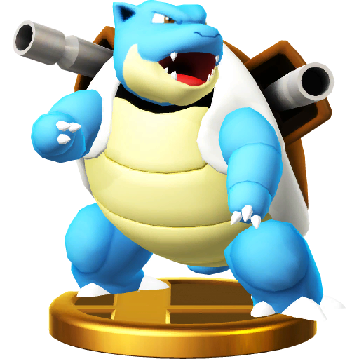</a></th>
    <th><b>Blastoise</b></th>
    <th>Tempted to have a Blastoise hose the mud off your bike? Well, don't. The water jets from its rocket cannons might look perfect for that, but they'd just blast your bike into oblivion. In fact, the reason Blastoise grow so big and heavy is so they don't get blown away themselves. If your house is on fire, though, feel free to get a Blastoise to help!</th>
  </tr>
  <tr>
    <th><a href="Blaziken.png" >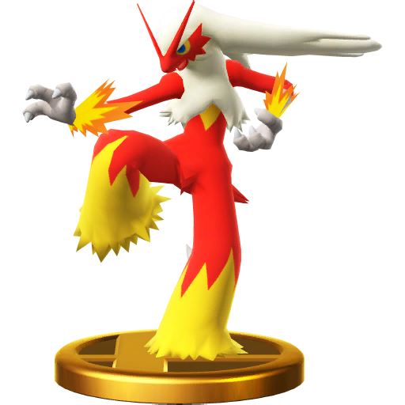</a></th>
    <th><b>Blaziken</b></th>
    <th>We should make an action film starring Blaziken. With its fiery fists and ability to spring over 30-storey buildings effortlessly, we'd save a ton of money on CGI! Let's call it... Red Renegade! Or, better yet, Red Renegade 3 - then people will think it's part of a popular series!</th>
  </tr>
  <tr>
    <th><a href="Charizard.png" >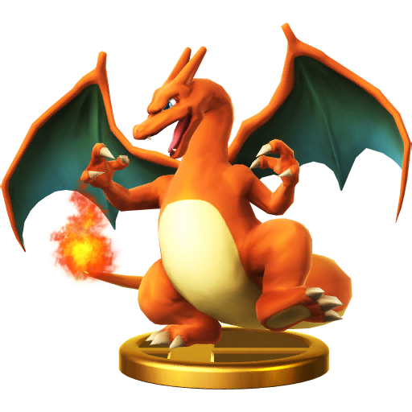</a></th>
    <th><b>Charizard</b></th>
    <th>Charizard, a Fire- and Flying-type Pokémon, can burn through anything with the flames it breathes. It is constantly on the lookout for powerful opponents. And where better to find them than in this game? Its huge build and special moves mean it can inflict massive damage, and its Flare Blitz is so powerful, it even hurts Charizard itself!</th>
  </tr>
  <tr>
    <th></th>
    <th><b>Charizard (Alt.)</b></th>
    <th>When using Charizard's Flamethrower move, hold the button to keep breathing fire. The flames gradually die down, but you just need to rest for a bit before doing it again. If you get hit while you're using the down special Rock Smash, you won't flinch, but someone else can break the rock instead, making your attack fail.</th>
  </tr>
  <tr>
    <th><a href="Chespin.png" >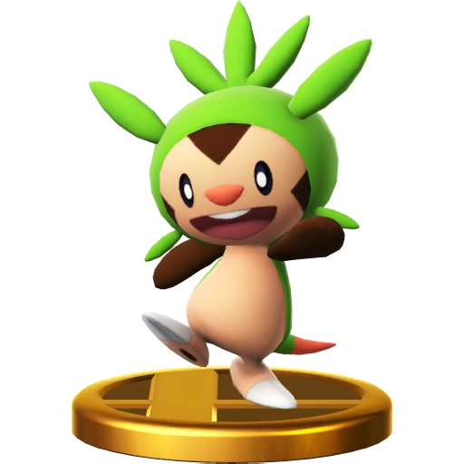</a></th>
    <th><b>Chespin</b></th>
    <th>Chespin, the Spiny Nut Pokémon. This Grass-type Pokémon is one of the ones you can choose at the start of Pokémon X and Y. The thick shell covering its head and back is so strong, it can protect Chespin's body from almost any impact. Its Seed Bomb attack will scatter bombs around it that instantly explode.</th>
  </tr>
  <tr>
    <th><a href="Clawitzer.png" >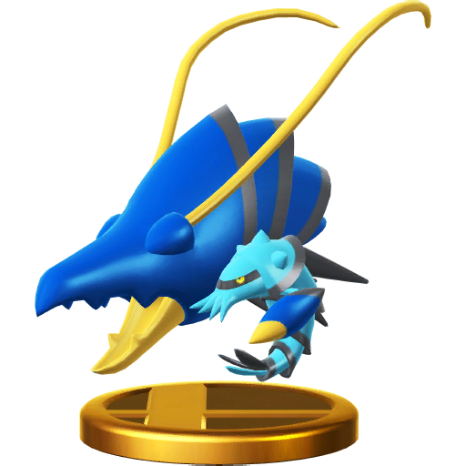</a></th>
    <th><b>Clawitzer</b></th>
    <th>Clawitzer's right claw is so enormous, you might mistake that for its body. As implied by the fact that it's the Howitzer Pokémon, that giant claw launches cannonballs (albeit water ones) with terrifying force. If you come at it with a water pistol, you'll find yourself more than a little outmatched. Clawitzer's blasts can pierce tanker hulls!</th>
  </tr>
  <tr>
    <th><a href="Darkrai.png" >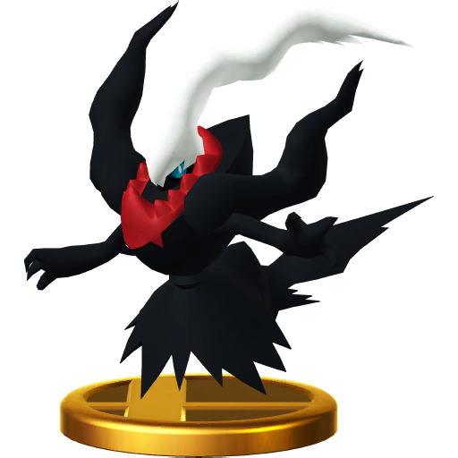</a></th>
    <th><b>Darkrai</b></th>
    <th>A Pokémon shrouded in mystery, Darkrai has the ability to implant nightmares into the minds of both humans and Pokémon. It has legs, but seems to prefer to float in the air. Its favourite move in this game is Dark Void. When this attack hits something, it creates a vortex that sucks in fighters and puts them to sleep.</th>
  </tr>
  <tr>
    <th><a href="Dedenne.png" >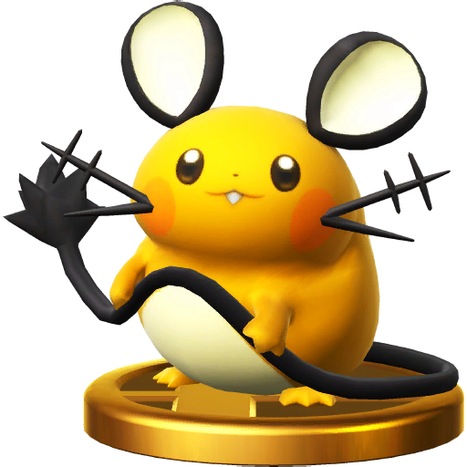</a></th>
    <th><b>Dedenne</b></th>
    <th>This Electric- and Fairy-type Pokémon's round shape and antennae-like whiskers make it very distinctive. It has a habit of sticking its tail into sockets to absorb electricity that it fires from its whiskers. Its Discharge attack shoots off in four directions, passing through obstacles and stunning any fighters it hits along the way.</th>
  </tr>
  <tr>
    <th><a href="Deoxys.png" >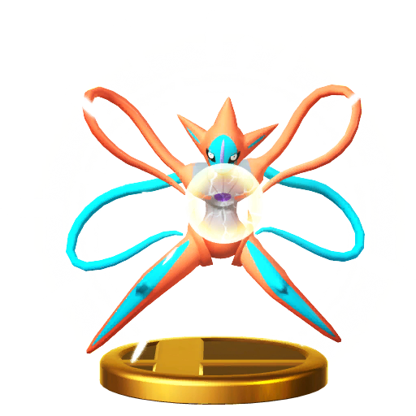</a></th>
    <th><b>Deoxys</b></th>
    <th>Deoxys was formed from a mutated virus that came to Earth on a meteorite. It comes in four different Formes, but in this game, it appears in Attack Forme. When summoned, it heads skywards before firing its Hyper Beam attack straight downwards from the crystal in its chest.</th>
  </tr>
  <tr>
    <th><a href="Dialga.png" >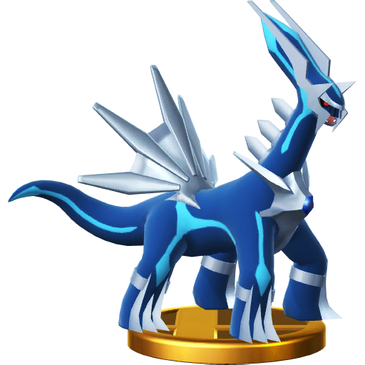</a></th>
    <th><b>Dialga</b></th>
    <th>The concept of time has always been one of the world's great mysteries, but Dialga might hold the answer. Legend has it that Dialga's birth caused time to begin moving! It's no surprise that the people of Sinnoh see this Pokémon as a deity. If you're ever running late, maybe you could ask Dialga to do you a favour and turn back the clock.</th>
  </tr>
  <tr>
    <th><a href="Dragonite.png" >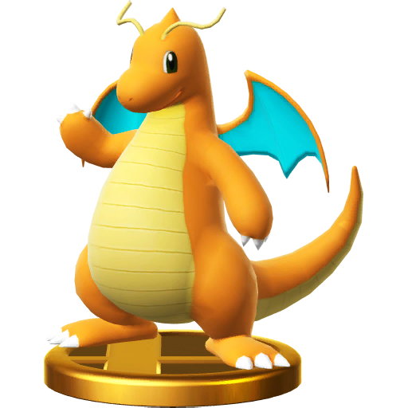</a></th>
    <th><b>Dragonite</b></th>
    <th>A benevolent Pokémon said to search the ocean for drowning swimmers and guide damaged ships to shore. Because of this, many people venerate Dragonite as a guardian of the sea. In battle, on the other hand, it's a fearsome foe, soaring rapidly through the air to deliver incredible attacks. Let's be thankful it's usually friendly.</th>
  </tr>
  <tr>
    <th><a href="Eevee.png" >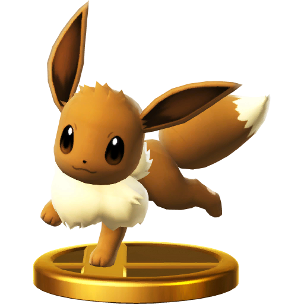</a></th>
    <th><b>Eevee</b></th>
    <th>This adorable Normal-type Pokémon's ability to evolve in so many different ways makes it a popular choice with trainers. When brought out in battle, Eevee uses Take Down on the first opponent it sees, but...it's not very effective. Never mind. Eevee may not be the toughest Pokémon, but it'll always be one of the cutest.</th>
  </tr>
  <tr>
    <th><a href="Electrode.png" >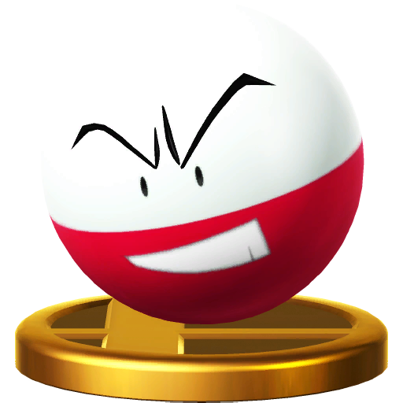</a></th>
    <th><b>Electrode</b></th>
    <th>This Electric-type Pokémon stores huge amounts of electricity in its body. It is also known as the Bomb Ball due to the fact that even the lightest touch can make it blow up. Sometimes it takes a little while for Electrode to use its Explosion attack, so you might have enough time to throw it in someone else's direction! Feeling brave?</th>
  </tr>
  <tr>
    <th><a href="Entei.png" >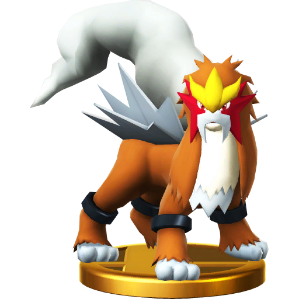</a></th>
    <th><b>Entei</b></th>
    <th>One of the three Legendary Pokémon to rise from the ashes of the Burned Tower. It has a distinctive white mane running along its back. Its powerful Fire Spin attack will suck in any fighters nearby and trap them, dealing damage all the while. When the fire burns itself out, any fighters within are blasted off the stage.</th>
  </tr>
  <tr>
    <th><a href="Fennekin.png" >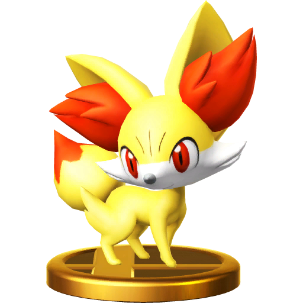</a></th>
    <th><b>Fennekin</b></th>
    <th>Want to start your journey with a Fire-type Pokémon? Then Fennekin is for you! It enjoys eating twigs as snacks, and while it's munching on them, hot air pours from its ears. Its Incinerate attack might start off looking like tiny embers, but on impact with another fighter, they'll burst into a giant pillar of flame that just keeps burning.</th>
  </tr>
  <tr>
    <th><a href="Fletchling.png" >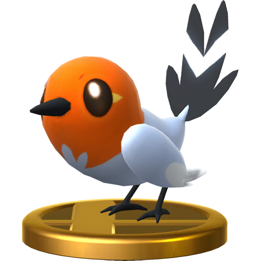</a></th>
    <th><b>Fletchling</b></th>
    <th>Fletchling, the Tiny Robin Pokémon. This Normal- and Flying- Pokémon is often seen in cities in the Kalos region. It's popular with trainers due to its friendly personality and beautiful voice. However, they can be very territorial, and if you bring one out in battle, it won't hesitate to use Peck on one of your opponents.</th>
  </tr>
  <tr>
    <th><a href="Garchomp.png" >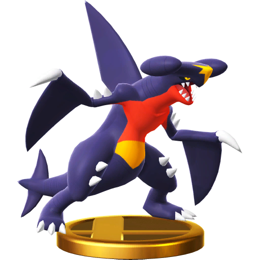</a></th>
    <th><b>Garchomp</b></th>
    <th>There's something about Garchomp that appeals to the kid in all of us. It's basically a mach-speed flying dinosaur with spikes. What's not to love? When it folds up its body and extends its wings for flight, you might mistake it for a jet plane. And with a little Garchompite, it can Mega Evolve for extra firepower!</th>
  </tr>
  <tr>
    <th><a href="Gardevoir.png" >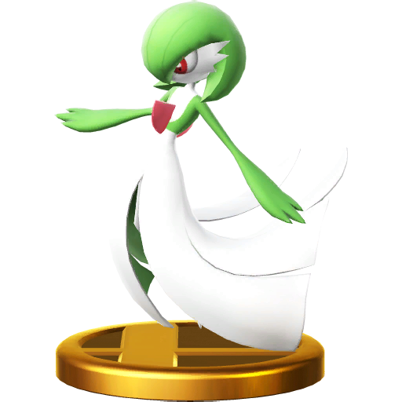</a></th>
    <th><b>Gardevoir</b></th>
    <th>This Psychic- and Fairy-type may look like a woman in a long dress, but there are both male and female Gardevoir out there! If you get one in battle, it'll use Reflect, creating a barrier that stops projectiles from hitting you and your allies. It won't block any of your shots, though, so feel free to fire all the projectiles you like!</th>
  </tr>
  <tr>
    <th><a href="Genesect.png" >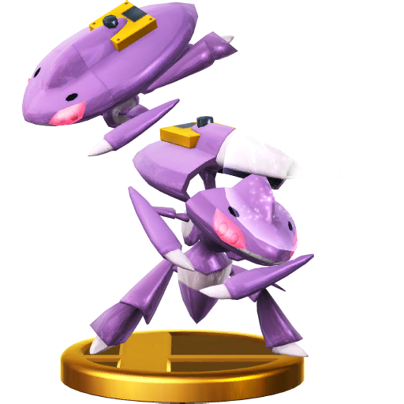</a></th>
    <th><b>Genesect</b></th>
    <th>A Bug- and Steel-type Pokémon revived from a 300-million-year-old fossil, then modified to carry a giant cannon on its back. The type of Drive inserted into the cannon affects the attack type of its Techno Blast. After using this attack mid-jump, it attacks its taarget with a long-range laser than passes through obstacles.</th>
  </tr>
  <tr>
    <th><a href="Giratina.png" >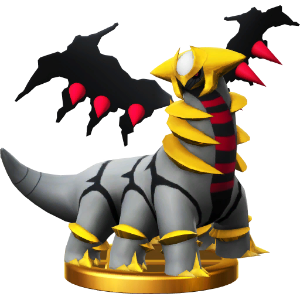</a></th>
    <th><b>Giratina</b></th>
    <th>Also called the Renegade Pokémon, Giratina lives in a dimension known as the Distortion World. It has two forms, and will only be seen in its Origin Forme in out world if it's holding a Griseous Orb. Its Dragon Breath attack creates a powerful tornado that not only damages you, but can carry you off the stage!</th>
  </tr>
  <tr>
    <th><a href="Gogoat.png" >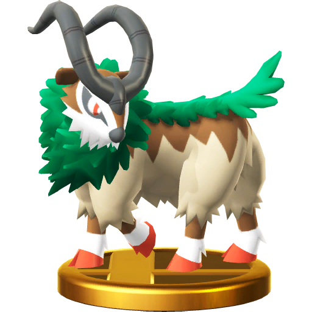</a></th>
    <th><b>Gogoat</b></th>
    <th>Lots of people in Lumiose City get around by riding on the backs of these Grass-type Pokémon. If you summon one during a fight, it'll run around the stage and charge at your opponents using Take Down. If you like, you can even jump on its back and get a lift around the stage from it!</th>
  </tr>
  <tr>
    <th><a href="Goldeen.png" >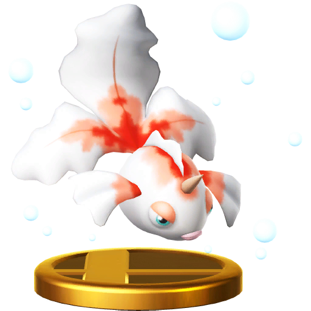</a></th>
    <th><b>Goldeen</b></th>
    <th>A Water-type Pokémon with a distinctive horn. Thanks to its powerful fins, Goldeen can swim comfortably through the most torrential waters and even up waterfalls. It's known for both its strength and grace. That said, don't expect it to make a big splash in this game - just a little one when it uses Splash... It's super ineffective!</th>
  </tr>
  <tr>
    <th><a href="Greninja.png" >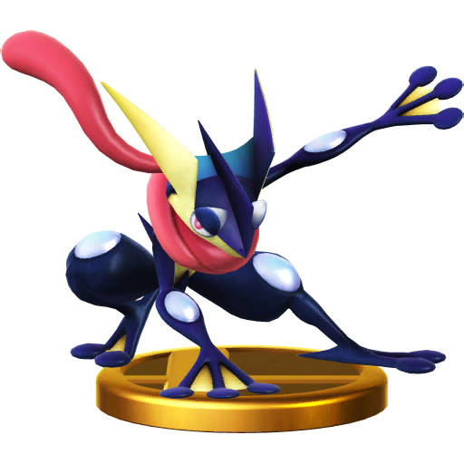</a></th>
    <th><b>Greninja</b></th>
    <th>This Water- and Dark-type Pokémon is the fully evolved form of Froakie. It is just as fast and dangerous as its name suggests, and the throwing stars it can make out of water can shear metal. In this game, as well as being a graceful, speedy fighter, it can also use moves like Hydro Pump to let it move through the air and avoid falling.</th>
  </tr>
  <tr>
    <th></th>
    <th><b>Greninja (Alt.)</b></th>
    <th>Greninja's Substitute down special lets you teleport to dodge attacks and then strike back, making it an effective and hard-to-predict way to counter-attack. You can also control where you reappear. When you vanish, sometimes you'll be replaced by a log, and other times by a Substitute doll.</th>
  </tr>
  <tr>
    <th><a href="Groudon.png" >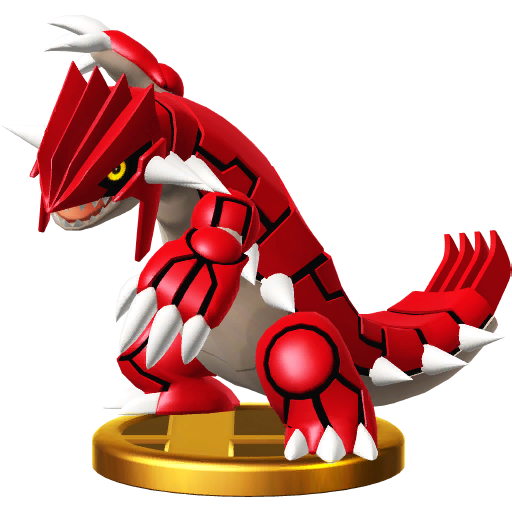</a></th>
    <th><b>Groudon</b></th>
    <th>Groudon is called the Continent Pokémon, and that's not just because it lives on them. Legend has it that Groudon actually created the continents. It has a rivalry with Kyogre, said to have created the oceans, and they apparently had an epic battle long ago. Perhaps it was this battle of land and sea that created the world as we know it.</th>
  </tr>
  <tr>
    <th><a href="Honedge.png" >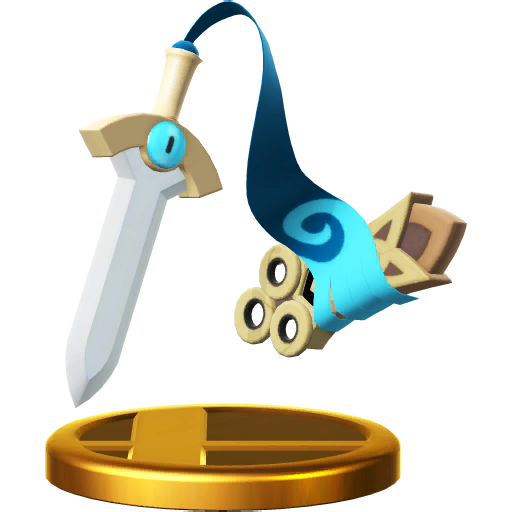</a></th>
    <th><b>Honedge</b></th>
    <th>There's a rather spooky tale behind this Pokémon's origins: apparently, it's an ancient sword possessed by a departed spirit. Honedge won't let anyone grip its hilt. If they try, it will attack them or wrap its sash around their arm and drain the life energy from their body! Yikes!</th>
  </tr>
  <tr>
    <th><a href="Ho-Oh.png" >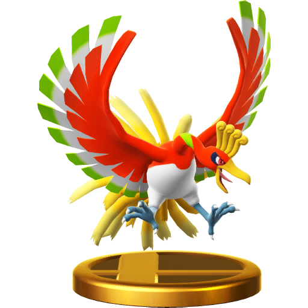</a></th>
    <th><b>Ho-Oh</b></th>
    <th>This Pokémon flies through the skies, trailing rainbows from its wings, and is said to promise eternal happiness to all who see it. Supposedly, it appears every once in a while in the Fire-type Elite Four Trainer's room in the Kalos Pokémon League stage. Its screams cause pillars of fire to rise all the way to the ceiling.</th>
  </tr>
  <tr>
    <th><a href="Hydreigon.png" >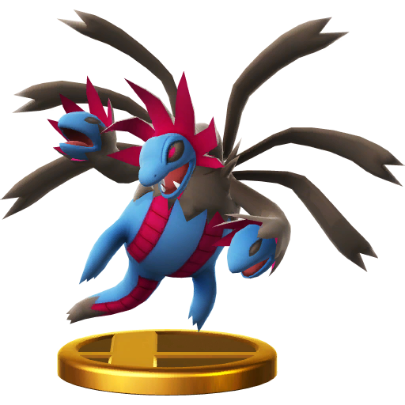</a></th>
    <th><b>Hydreigon</b></th>
    <th>Unlike Scizor's head-like claws, the heads at the end of Hydreigon's arms are the real deal. Only the head in the middle does any thinking - the other two are just for gobbling up anything in sight. If you think about it, Hydreigon would probably win any eating contest hands down, but... maybe having three mouths is against the rules...</th>
  </tr>
  <tr>
    <th><a href="Infernape.png" >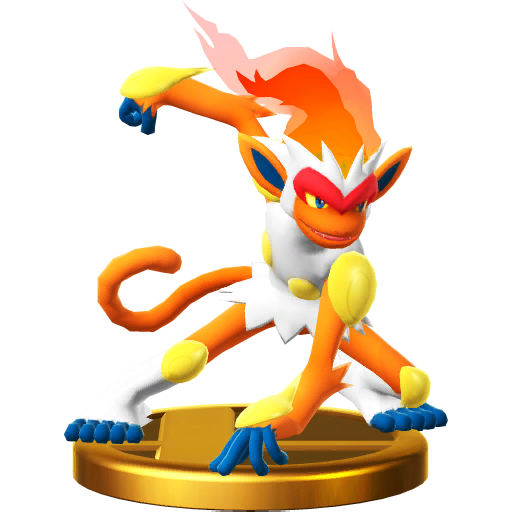</a></th>
    <th><b>Infernape</b></th>
    <th>Doesn't the name just conjure up images of this fair creature living a peaceful life in a forest of ferns? You know, In-fern-ape. ...What, you think it's actually to do with "inferno"? Hmm... Well, maybe... Anyway, it has a crown of fire that never goes out, and combines flames and fighting in a way that looks like some kind of fire dance.</th>
  </tr>
  <tr>
    <th><a href="Inkay.png" >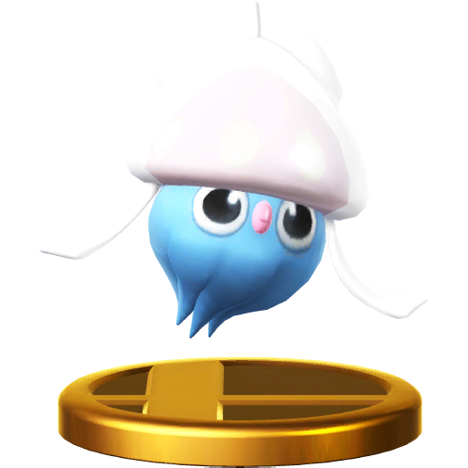</a></th>
    <th><b>Inkay</b></th>
    <th>A Pokémon that looks this much like a squid MUST be a Water-type, right? Wrong! It's a Dark- and Psychic-type. If you're struggling to get it to evolve, try holding your system upside down. In this game, Inkay's Topsy-Turvy move can knock you over, and you won't be much use like that, so watch out!</th>
  </tr>
  <tr>
    <th><a href="Ivysaur.png" >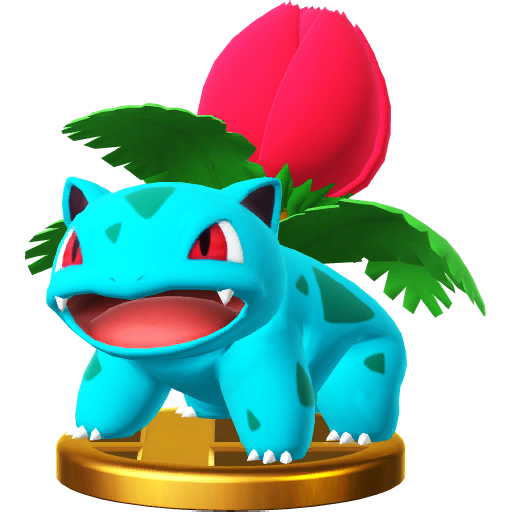</a></th>
    <th><b>Ivysaur</b></th>
    <th>Watching your starter Pokémon evolve is an unforgettable experience. For many trainers, that first happens when watching Bulbasaur become Ivysaur. It might be difficult for them to say goodbye to cute little Bulbasaur, but before they know it, they'll be saying bye to Ivysaur, to, when it turns into a fully-grown Venusaur!</th>
  </tr>
  <tr>
    <th></th>
    <th><b>Jigglypuff</b></th>
    <th>This Normal- and Fairy-type Pokémon is best known for its soothing singing, which quite often puts foes to sleep. In this game, Jigglypuff fights best in the air, and can even jump six times in a row. The downside, though, is that Jigglypuff's so light, just about any opponent could launch it in their sleep!</th>
  </tr>
  <tr>
    <th></th>
    <th><b>Jigglypuff (Alt.)</b></th>
    <th>When you use the Rest down special, you go into a deep sleep, as you'd expect. But if anyone is touching you when you do it, you'll inflict a lot of damage and launch them directly upwards. They even continue to take damage afterwards. It's not easy to pull off, though, and falling asleep leaves you open to attacks, so be careful.</th>
  </tr>
  <tr>
    <th><a href="Jirachi.png" >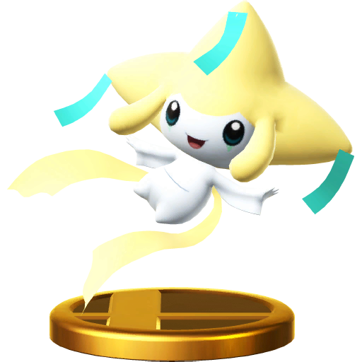</a></th>
    <th><b>Jirachi</b></th>
    <th>Since Jirachi is only awake for seven days every one thousand years, it's an even bigger sleeper than Snorlax! It can't just be sleeping the whole time, though. It's probably hard at work deep in the land of dreams, strengthening its ability to grant people's wishes. If it detects danger while asleep, it can fight without even waking up!</th>
  </tr>
  <tr>
    <th><a href="Keldeo.png" >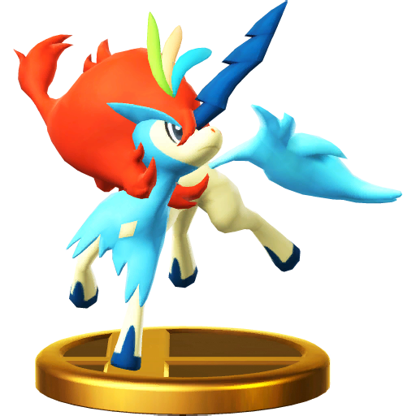</a></th>
    <th><b>Keldeo</b></th>
    <th>The Mythical Pokémon Keldeo looks a lot like a multicoloured unicorn. in its Resolute form, its horn grows longer and its vision improves. It can also use Secret Sword in that Form, and that's what it will do in this game. If Keldeo starts charging after you, watch out - that huge horn will send you flying!</th>
  </tr>
  <tr>
    <th><a href="Klinklang.png" >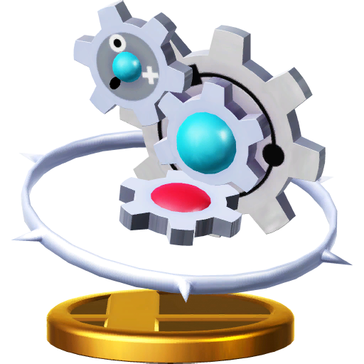</a></th>
    <th><b>Klinklang</b></th>
    <th>From Kling to Klang to Klinklang, this Pokémon gets noisier with each evolution! It has a nice ring to it, though. Maybe all Pokémon should be named this way! Abra, Kadabra, Abrakadabra? Gible, Gabite...Gigabite? Err...Moving on! When it charges up energy, Klinklang spins the small cog with the red core at very high speeds.</th>
  </tr>
  <tr>
    <th><a href="Koffing.png" >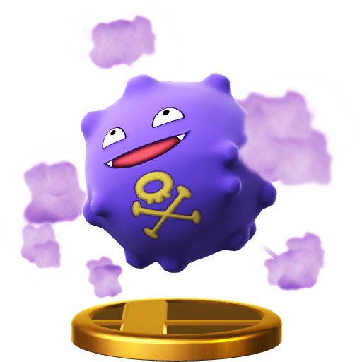</a></th>
    <th><b>Koffing</b></th>
    <th>A Poison-type Pokémon that looks somewhat like a blown-up balloon. As you might be able to guess, though, it's not filled with fresh air - that's poison gas, and this Pokémon isn't shy about sharing. In Smash Tour, the gas it spews will hide spaces and any items that may be on them. The smoke should disappear by the end of the turn.</th>
  </tr>
  <tr>
    <th><a href="Kyogre.png" >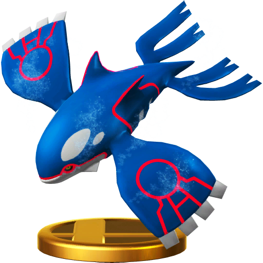</a></th>
    <th><b>Kyogre</b></th>
    <th>This orca-like Water-type Pokémon is known for the distinctive shape of its fins ad the red markings along its body. It will use Hydro Pump to send fighters flying off the stage, and then proceed to chase after them to make recovering from the attack a nightmare.</th>
  </tr>
  <tr>
    <th><a href="Kyurem.png" >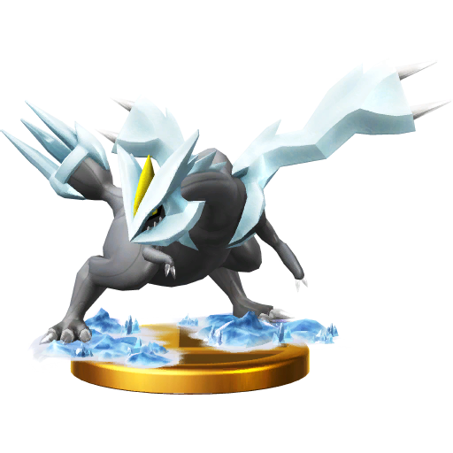</a></th>
    <th><b>Kyurem</b></th>
    <th>Kyurem is thought to be an empty shell left behind when Reshiram and Zekrom split into two. Its icy energy is so powerful that it can freeze its own body. When Kyurem has built up enough energy, it can unleash Icy Wind, shooting spirals of cold left and right. After damaging fighters, this attack with leave them frozen.</th>
  </tr>
  <tr>
    <th></th>
    <th><b>Latias & Latios</b></th>
    <th>Latias and Latios are Eon Pokémon. Both are Dragon- and Psychic-types. The red Latias is female, while the blue Latios is male. Be folding their arms in, they become super aerodynamic and can fly faster then fighter jets. They combine speed and teamwork when they cross paths to attack fighters with Steel Wing.</th>
  </tr>
  <tr>
    <th><a href="Lucario.png" >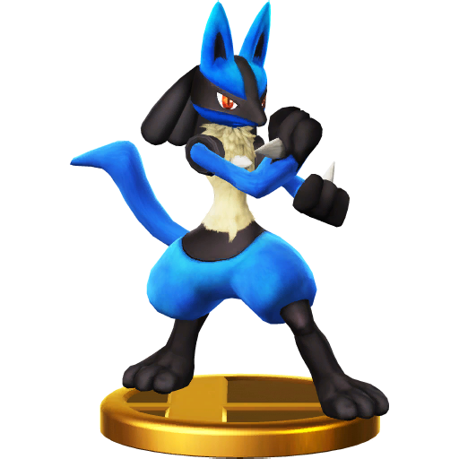</a></th>
    <th><b>Lucario</b></th>
    <th>This Fighting- and Steel-type Pokémon can sense the movements of its enemies using its Aura abilities, and is even said to be able to see enemies when they're invisible. As it takes damage, its attacks grow in strength. At maximum power, its deals triple damage, which can make its Aura Sphere attack a real force to be reckoned with!</th>
  </tr>
  <tr>
    <th></th>
    <th><b>Lucario (Alt.)</b></th>
    <th>The Extreme Speed up special sends Lucario rushing in your chosen direction, and you can adjust the flight path mid-air. Also, the more damage Lucario takes, the further it will go. For the Force Palm side special, Lucario attacks with its Aura. Using it while close to an enemy adds a grab to the move and deals extra damage.</th>
  </tr>
  <tr>
    <th><a href="Lugia.png" >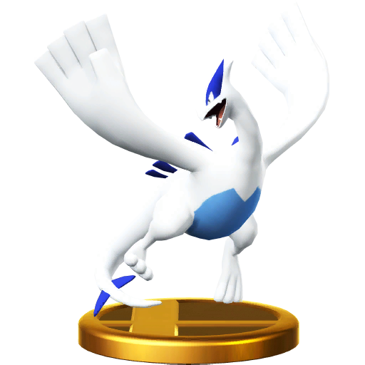</a></th>
    <th><b>Lugia</b></th>
    <th>Despite being a Psychic- and Flying-type, Lugia sleeps on the ocean floor. It's said that if it were to flap its wings on waking up, it could cause a storm lasting 40 days. No one can say whether that's true or not, but Lugia's attacks certainly make it seem so. It flies behind the stage and creates a mighty gust of wind with its Aeroblast attack.</th>
  </tr>
  <tr>
    <th><a href="Manaphy.png" >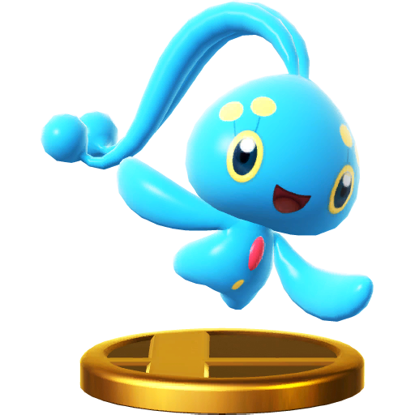</a></th>
    <th><b>Manaphy</b></th>
    <th>This Water-type Pokémon is said to have the mysterious ability to bond with any other Pokémon. It's also said to appear occasionally in the Water-type Elite Four Trainer's room in the Kalos Pokémon League stage. When it appears on the stage, it'll use its Whirlpool move to drag fighters into the middle of the swirling waters.</th>
  </tr>
  <tr>
    <th></th>
    <th><b>Master Ball</b></th>
    <th>A rare type of Poké Ball that never fails to catch a Pokémon. Throw one in this game, and the Mythical or Legendary Pokémon inside will come to your aid. Master Balls are easy to identify due to their purple colour and the large M on them. Use one to quickly turn the tide of any battle!</th>
  </tr>
  <tr>
    <th></th>
    <th><b>Mega Evolution (Charizard)</b></th>
    <th>For this powerful Final Smash, Charizard Mega Evolves into Mega Charizard X and takes to the air. In this form, it can charge violently in any direction and shoot horizontal blasts of fire that launch foes. Mega Charizard X isn't invulnerable, though - taking attacks will reduce the length of time it stays transformed.</th>
  </tr>
  <tr>
    <th></th>
    <th><b>Mega Evolution (Lucario)</b></th>
    <th>For Lucario's Final Smash, it Mega Evolves into Mega Lucario. The attacks it can use don't change, but its Aura abilities become more powerful than ever, letting it deal even more damage and launch opponents even further. It can also resist being launched by other fighters, but the more attacks it takes, the less time the Final Smash lasts.</th>
  </tr>
  <tr>
    <th></th>
    <th><b>Mega Blastoise</b></th>
    <th>Some species of Pokémon living in Kalos have the ability to Mega Evolve, and here's one! Mega Blastoise is a bit bigger than Blastoise, and instead of two cannons on its shell, it has one huge cannon. This may seem like a downgrade, but wait - there are two on its arms, too! Basic arithmetic: three is better than two.</th>
  </tr>
  <tr>
    <th></th>
    <th><b>Mega Blaziken</b></th>
    <th>If you're lucky enough to get your hands on a rare Blazikenite stone, your Blaziken can Mega Evolve into this magnificent Pokémon. Ablaze with fighting spirit, Mega Blaziken has honed its skills to the highest possible degree. With its Blaze Kick, it can deliver a fierce impact that will leave opponents charred!</th>
  </tr>
  <tr>
    <th></th>
    <th><b>Mega Kangaskhan</b></th>
    <th>You may feel underwhelmed the first time you see the Parent Pokémon Mega Evolve. "What, the kid just jumped out of the pouch? Is that it?" But take a closer look at its face - the child's brimming with a fierce determination to protect its mother. With this brave new partner, Mega Kangaskhan gains the ability to attack twice in one turn!</th>
  </tr>
  <tr>
    <th></th>
    <th><b>Mega Mewtwo X & Y</b></th>
    <th>Mega Mewtwo comes in two forms rather than just one. Mega Mewtwo X has visibly strengthened limbs, which greatly boost its physical abilities in battle. Mega Mewtwo Y, on the other hand, has a whip-like tendril extending from the back of its head, which augments its psychic powers.</th>
  </tr>
  <tr>
    <th></th>
    <th><b>Mega Venusaur</b></th>
    <th>With a special type of Mega Stone called Venusaurite, Venusaur can Mega Evolve into Mega Venusaur in the middle of a battle. Not only does Venusaur get a large defense boost when it Mega Evolves, but the plants on its back grow so much, it looks like you're being attacked by a walking jungle. Now, that's got to be intimidating!</th>
  </tr>
  <tr>
    <th><a href="Meloetta.png" >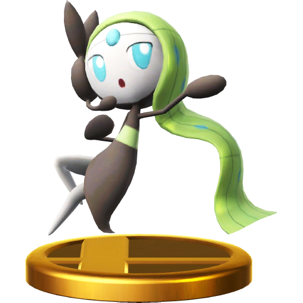</a></th>
    <th><b>Meloetta</b></th>
    <th>This Normal- and Psychic-type Pokémon has the ability to change Forme mid-battle by using Relic Song. Appearing this game in its Aria Forme, it uses Echoed Voice to send echoes shooting up and down the stage, reflecting off walls and platforms. The more obstacles there are on a stage, the harder it is to avoid!</th>
  </tr>
  <tr>
    <th><a href="Meowth.png" >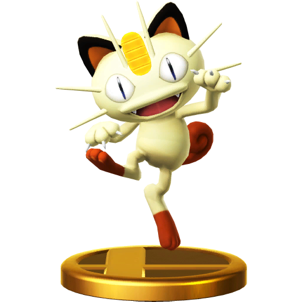</a></th>
    <th><b>Meowth</b></th>
    <th>Meowth, a Normal-type Pokémon, loves round, shiny things. It runs around at night, hunting for little treasures and trinkets, but often ends up getting into fights with Murkrow about who'll get to keep them. Watch out for Meowth's Pay Day attack. If it catches you from behind, it can be purralysingly pawerful!</th>
  </tr>
  <tr>
    <th><a href="Metagross.png" >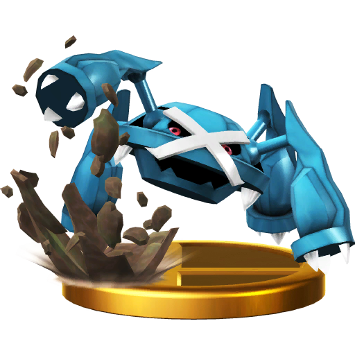</a></th>
    <th><b>Metagross</b></th>
    <th>A Steel- and Psychic-type Pokémon known as the Iron Leg Pokémon. At 550kg in weight, it's heavier than your average Snorlax. When its Earthquake hits, you'd better hope your far away (or at least in mid-air), because the tremors can launch anybody on the ground.. And watch out for its legs! They can stomp you right into the ground!</th>
  </tr>
  <tr>
    <th><a href="Mew.png" >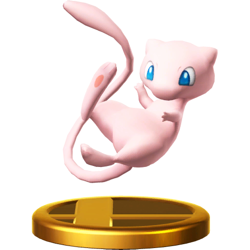</a></th>
    <th><b>Mew</b></th>
    <th>Mew was thought to be extinct until it was rediscovered by Dr Fuji in Guyana. This Mythical Pokémon doesn't often show itself to humans, so it's considered very lucky to see one. In this game, it will float upwards and leave a present behind. If only Mew would turn up more often, eh?</th>
  </tr>
  <tr>
    <th><a href="Mewtwo.png" >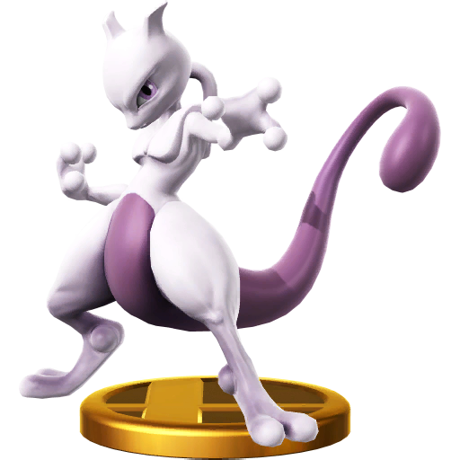</a></th>
    <th><b>Mewtwo</b></th>
    <th>Mewtwo puts its psychic powers to great use in this game. Not only can it float in midair, but its telekinesis gives its attacks extra reach and its throws added power. However, its light body makes it easy to launch, so if you're willing to take the risk of getting in close, it might just be worth it!</th>
  </tr>
  <tr>
    <th></th>
    <th><b>Mewtwo (Alt.)</b></th>
    <th>Mewtwo's Confusion Side Special not only lets you repel projectiles, it also reflects the damage back on your opponent. Its Down Special, Disable, stuns an enemy for longer the higher its damage is. As it works by having Mewtwo glare at its foe, this only works if they make eye contact.</th>
  </tr>
  <tr>
    <th></th>
    <th><b>Mewtwo (Original)</b></th>
    <th>Created from modified Mew DNA, Mewtwo was designed to be the ultimate Pokémon. It didn't take on any of Mew's kinder traits and only uses its intelligence to destroy its enemies. Or...so it seems. Perhaps it just feels frightened or even tormented, and that's why it lashes out. Whatever the reason, Mewtwo is not to be messed with.</th>
  </tr>
  <tr>
    <th><a href="Moltres.png" >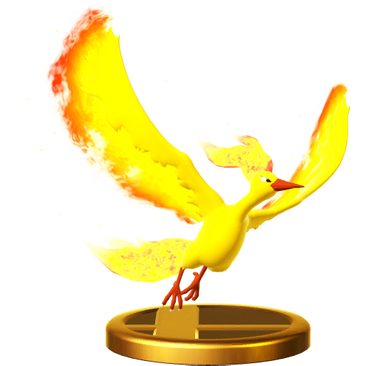</a></th>
    <th><b>Moltres</b></th>
    <th>Moltres is one of the three Legendary Bird Pokémon of the Kanto region, along with Articuno and Zapdos. When spreading its huge wings and taking flight, it can make the flames all over its body burn even brighter. If you get hit by those flames during its Fly attack, you might go flying even further than Moltres!</th>
  </tr>
  <tr>
    <th><a href="Oshawott.png" >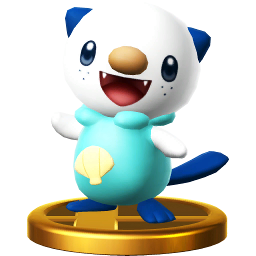</a></th>
    <th><b>Oshawott</b></th>
    <th>Oshawott carries a little shell on its stomach known as a scalchop, which can either be used as a weapon or to defend against attacks. Its Surf move can knock you right off the stage, but if you reflect it just at the right moment, that could really turn the tide back in your favour.</th>
  </tr>
  <tr>
    <th><a href="Palkia.png" >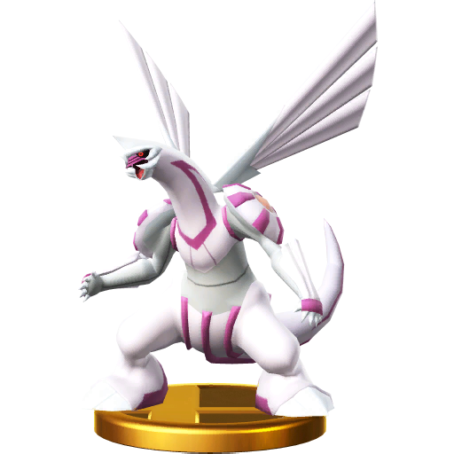</a></th>
    <th><b>Palkia</b></th>
    <th>Stories of this Legendary Pokémon say that Palkia is a god that controls all of space. When it uses its Spacial Rend attack in Super Smash Bros., it causes the screen to flip upside down. If that wasn't confusing enough, it also flips the left and right controls!</th>
  </tr>
  <tr>
    <th><a href="Pikachu.png" >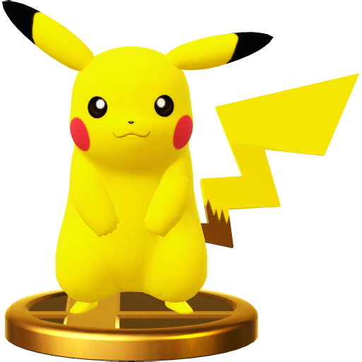</a></th>
    <th><b>Pikachu</b></th>
    <th>Pikachu is famous worldwide as the face of the Pokémon series. There's a lot of electricity stored in those rosy cheeks, and in this game, that allows for some devastating attacks, like Thunder Jolt. Tip: Input another direction after using Quick Attack to get a second burst. It's top-notch for recoveries!</th>
  </tr>
  <tr>
    <th></th>
    <th><b>Pikachu (Alt.)</b></th>
    <th>Pikachu's Thunder Jolt fires off a ball of electricity that bounces across the stage, getting weaker as it travels. Airborne enemies will take extra damage from it and get launched further. The default down special, Thunder, causes a lightning strike that both shocks opponents and turns Pikachu invincible for a split second.</th>
  </tr>
  <tr>
    <th><a href="Piplup.png" >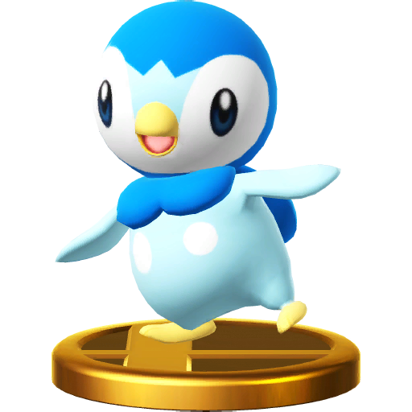</a></th>
    <th><b>Piplup</b></th>
    <th>You wouldn't think it from its adorable exterior, but this Pokémon is very proud and often won't listen to its Trainer. When it walks on land, it waddles and even falls over sometimes, all in a suitably cute way, but once it's in the water you'll see its true potential. It's a skilled swimmer and can dive for over ten minutes at a time to hunt.</th>
  </tr>
  <tr>
    <th></th>
    <th><b>Poké Ball</b></th>
    <th>A ball holding one of any number of Pokémon just waiting to burst out and help you in battle. Which kind will it be? Well, that's a surprise, but whichever one it is, it'll definitely up the intensity of the battle! If you see one, make sure you're the one to grab it!</th>
  </tr>
  <tr>
    <th></th>
    <th><b>Pokémon Trainer</b></th>
    <th>Quiz time! What do Misty, Brock, Cynthia, Iris and Ash all have in common? That's right - they're all Pokémon Trainers! This Pokémon Master in the making is just the same. He fought to be the very best - like no one ever was - back in Super Smash Bros. Brawl. To smash them was his real test - to launch them was his cause.</th>
  </tr>
  <tr>
    <th><a href="Psystrike.png" >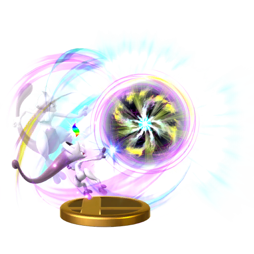</a></th>
    <th><b>Psystrike</b></th>
    <th>Mewtwo's Final Smash starts as Mewtwo Mega Evolves into Mega Mewtwo Y. It then fires a huge psychic projectile that penetrates enemies and obstacles. This projectile doesn't do any damage, but it freezes every foe it hits in place. They can even be frozen midjump! Afterward, every foe hit with the projectile will take a powerful psychic hit to the head.</th>
  </tr>
  <tr>
    <th></th>
    <th><b>Puff Up</b></th>
    <th>It doesn't deal a lot of damage or launch opponents a long way. No, when Jigglypuff uses its Final Smash, it gets...bigger. And bigger. And bigger. Before you know it, Jigglypuff will have completely taken over the screen - and there's no way to make it stop. On smaller stages, fighters may find there's nowhere left to stand!</th>
  </tr>
  <tr>
    <th><a href="Pyroar.png" >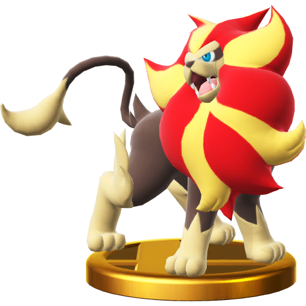</a></th>
    <th><b>Pyroar</b></th>
    <th>Litleo, that adorable little Pokémon with a red tuft of fur, evolves into the majestic Pyroar. Males have huge fiery manes, and the one has the biggest mane is the leader of the pride. Females, on the other hand, have long, flowing manes and play the vital role of protecting the pride's cubs.</th>
  </tr>
  <tr>
    <th><a href="Raikou.png" >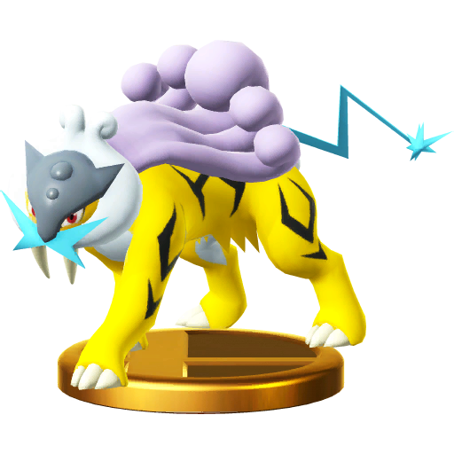</a></th>
    <th><b>Raikou</b></th>
    <th>If you see a bolt of lightning flash across the ground instead of from the sky, you may have just caught a glimpse of Raikou. And if you hear a peal of thunder that lasts longer than it should, that may be Raikou's roar. It's said that this wild yet majestic Pokémon once perished in the Johto region, but Ho-Oh, filled with sorrow, resurrected it.</th>
  </tr>
  <tr>
    <th><a href="Rayquaza.png" >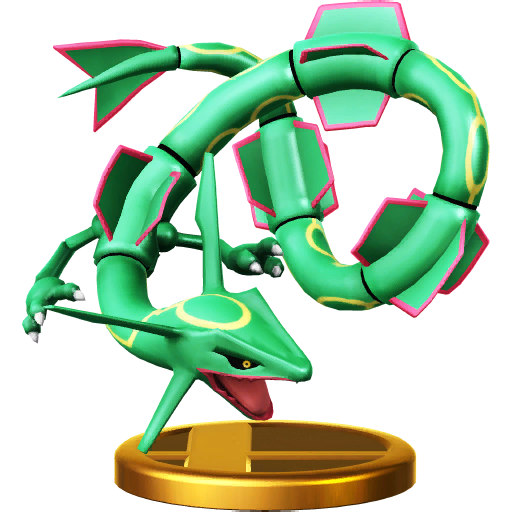</a></th>
    <th><b>Rayquaza</b></th>
    <th>This Dragon/Flying-type Pokémon usually dwells high in the ozone layer, so it can't be seen from the ground. In the Kalos Pokémon League stage, it occasionally flies at great speed through the Elite Four's Dragon-type chamber, where any fighters in its path will be damaged and launched with great force.</th>
  </tr>
  <tr>
    <th><a href="Registeel.png" >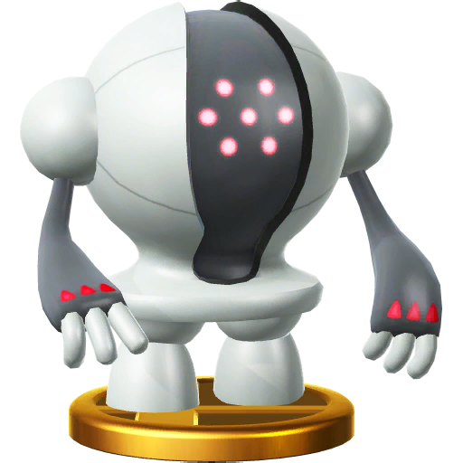</a></th>
    <th><b>Registeel</b></th>
    <th>This Steel-type Pokemon's hollow body is made out of an ultra-hard metal, forged under pressure over thousands of years underground. It can appear in the Kalos Pokemon League stage, in the Elite Four's Steel-type chamber. Its Stomp attack will launch fighters on the ground, and even the giant swords mounted on the stage!</th>
  </tr>
  <tr>
    <th><a href="Scizor.png" >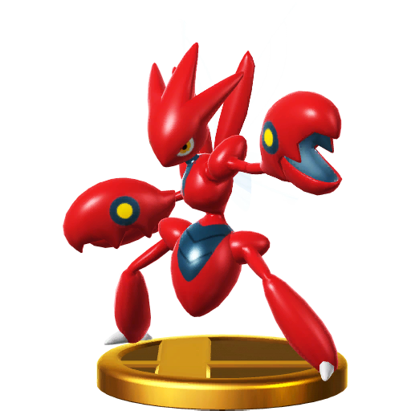</a></th>
    <th><b>Scizor</b></th>
    <th>It may look like this Pokémon has three heads, but that's just what it wants you to think. Look closer and you'll see that two of them are actually claws. Most creatures with face-like markings use them to scare predators to give themselves a chance to run away, but Scizor seems more likely to attack while its foe is stunned!</th>
  </tr>
  <tr>
    <th></th>
    <th><b>Secret Ninja Attack</b></th>
    <th>In Greninja's Final Smash, it uses its Mat Block move to flip an opponent into the air. It then slices them repeatedly in front of the shining moon, before smacking them down to the ground so hard they get launched. The inital Mat Block flip doesn't have much range, but if it hits home, there's no evading the rest of the attack.</th>
  </tr>
  <tr>
    <th><a href="Snivy.png" >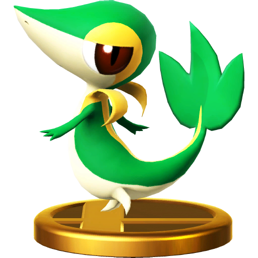</a></th>
    <th><b>Snivy</b></th>
    <th>Like Ekans and Onix, Snivy is known as a snake Pokémon. Unlike those Pokémon, it has two legs. When it eventually evolves into Serperior, though, it loses them. It attacks using Razor Leaf, which sends super sharp leaves flying into fighters in front of it, potentially hitting them over and over again.</th>
  </tr>
  <tr>
    <th><a href="Snorlax.png" >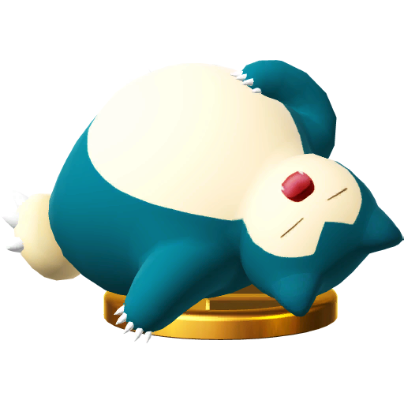</a></th>
    <th><b>Snorlax</b></th>
    <th>Snorlax is often referred to as the Sleeping Pokémon, and there's a good reason for that! This giant loafer spends almost all its time snoozing, getting up for just long enough each day to scoff up a tidy 400kg of food. In this game, it soars into the air and uses its Body Slam attack, smacking into fighters like a giant wrecking ball.</th>
  </tr>
  <tr>
    <th><a href="Spewpa.png" >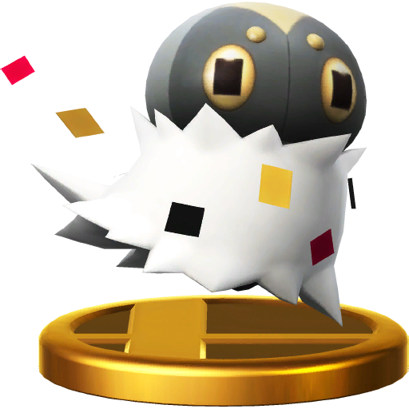</a></th>
    <th><b>Spewpa</b></th>
    <th>Spewpa, the Scatterdust Pokémon. This Bug-type Pokémon can harden its body to protect against attacks. In this game, it might bristle up and paralyse you with Stun Spore. "How ever can I avoid such a terrible fate?", you ask? Just leave it alone. Don't mess with Spewpa, and Spewpa won't mess with you.</th>
  </tr>
  <tr>
    <th><a href="Squirtle.png" >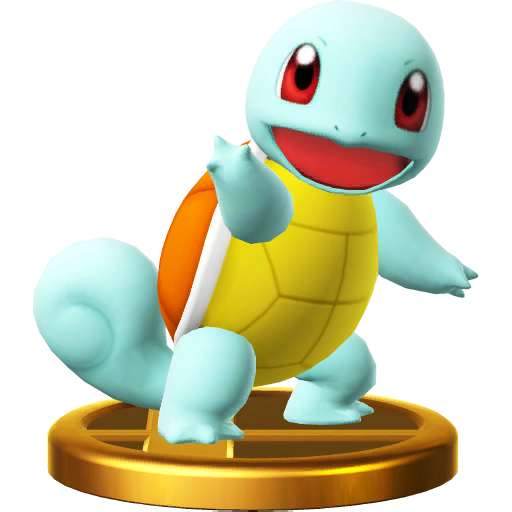</a></th>
    <th><b>Squirtle</b></th>
    <th>At the start of their Pokémon adventures, many aspiring trainers visit Professor Oak to choose one of three starter Pokémon. Squirtle's always a popular choice, what with him being so flipping adorable. When it's in danger, though, it withdraws into its shell and spits a high-pressure burst of water, which isn't quite so adorable.</th>
  </tr>
  <tr>
    <th><a href="Staryu.png" >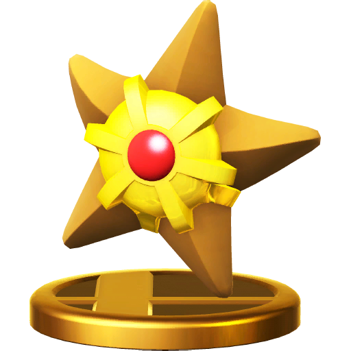</a></th>
    <th><b>Staryu</b></th>
    <th>This Water-type Pokémon evolves into Starmie when you use a Water Stone. Its star shape makes it rather cute, but that doesn't mean Staryu's not a threat. Its Swift attack will pummel fighters with a flurry of stars. If you notice Staryu's aiming at you, quickly move up or down to get out of the line of fire.</th>
  </tr>
  <tr>
    <th><a href="Steelix.png" >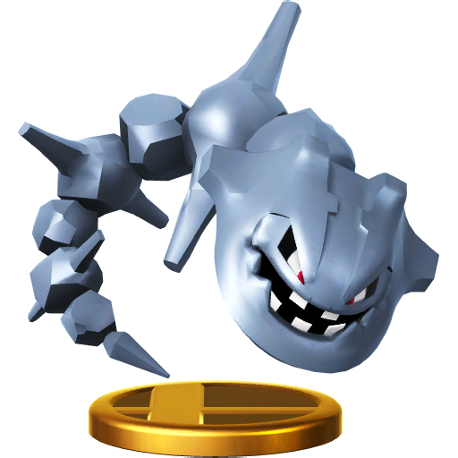</a></th>
    <th><b>Steelix</b></th>
    <th>Being harder than diamond, Steelix can crush any rock with its jaw. It can also see in pitch darkness. Its territory lies deeper than its pre-evolution, Onix, a full 1000m below the surface. Does it consider its Onix brethren to be "below" it, even though they're higher up? It's hard to say. We may have to dig a little deeper into the matter.</th>
  </tr>
  <tr>
    <th></th>
    <th><b>Substitute Doll</b></th>
    <th>If it looks like a Pokémon and it gets attacked like a Pokémon, it's probably a- Oh, no, it could also be a Substitute Doll. This cure plush figure appears out of nowhere when a Pokémon uses the move Substitute. Is that a smile on its face or a grimace of determination? Only the doll knows, and it's not telling.</th>
  </tr>
  <tr>
    <th><a href="Suicune.png" >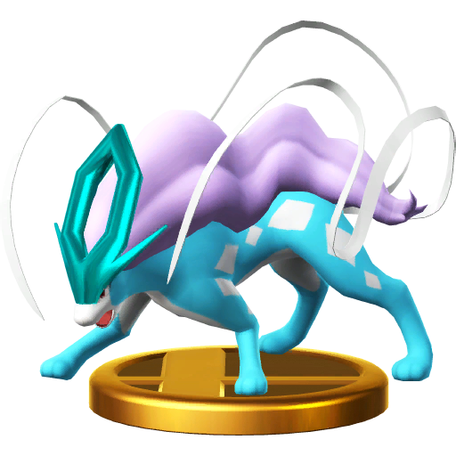</a></th>
    <th><b>Suicune</b></th>
    <th>Suicune is one of the Legendary Pokémon from the Burned Tower in Ecruteak City. Its mane is said to resemble an aurora floating over it. If summoned in battle, it'll make its way straight for a nearby fighter and unleash its Aurora Beam. The target, frozen in place, is unable to resist as it's blown off the stage.</th>
  </tr>
  <tr>
    <th></th>
    <th><b>Swirlix</b></th>
    <th>Swirlix has a serious sweet tooth - it eats so many sweets that even its fur is sticky and sweet. Not that you should try eating its fur. In this game, it'll use Cotton Spore to slow down all of the other fighters. See? Definitely not edible. Fun fact: if you trade Swirlix while it's holding a Whipped Dream, it'll evolve!</th>
  </tr>
  <tr>
    <th></th>
    <th><b>Sylveon</b></th>
    <th>Sylveon is one of Eevee's various final evolutions. It has a lot of great attacks to use in battle, but it actually seems to be a peace-loving sort of Pokémon. Case in point, it can completely stop the flow of battle by moving its ribbonlike feelers in a way that charms its opponents into not wanting to fight anymore.</th>
  </tr>
  <tr>
    <th><a href="Tepig.png" >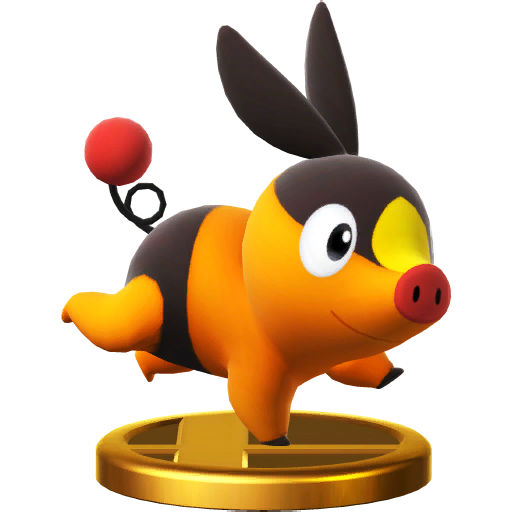</a></th>
    <th><b>Tepig</b></th>
    <th>Tepig is a Fire Pig Pokémon. It blows fire through...its mouth? Nope... Its ears? That's not right either... Oh, of course - its nose! That skill's not just handy in battle - it also lets Tepig roast its favourite food, berries! Sadly, it sometimes gets a little too excited about the idea and accidentally burns them to a crisp. Ahh, Tepig, you're too adorable!</th>
  </tr>
  <tr>
    <th><a href="Togepi.png" >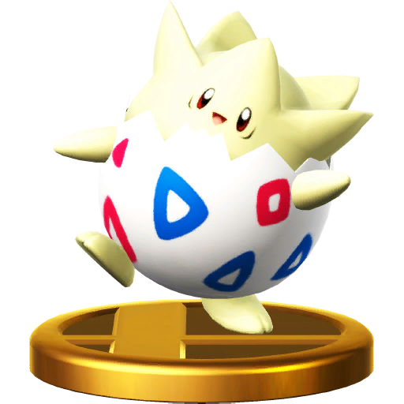</a></th>
    <th><b>Togepi</b></th>
    <th>A Fairy-type Pokémon that's always sunny side up! It can siphon positive energy from people and spread it across the world. Its Metronome attack can have a wide variety of effects. Maybe it'll plunge the stage into darkness. Maybe it'll plant damage-dealing seeds on fighters' heads. Whatever it does, Togepi will leave fighters scrambling.</th>
  </tr>
  <tr>
    <th><a href="Victini.png" >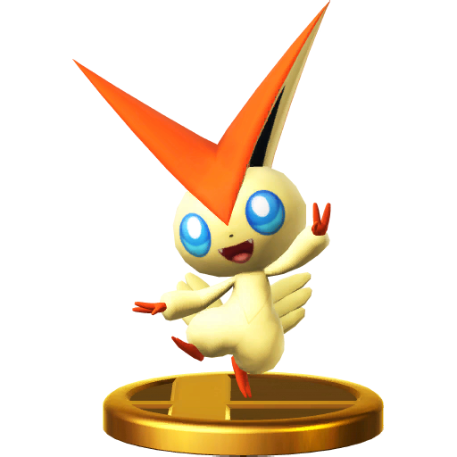</a></th>
    <th><b>Victini</b></th>
    <th>Victini can create an endless supply of energy and share it with others. Its Victory Star move makes the other fighter who summoned it glow with power from head to toe. As long as they're glowing, their launch ability will shoot up and they'll never flinch. That said, they're not invincible - Victini isn't a miracle-worker.</th>
  </tr>
  <tr>
    <th></th>
    <th><b>Volt Tackle</b></th>
    <th>For Pikachu's Final Smash, it surrounds itself with a ball of electricity and darts around at high speed, tackling opponents. While it's charging around, press the attack button to unleash powerful sparks. You can also use little ball of light that flies ahead of Pikachu as a guide if it seems out of control!</th>
  </tr>
  <tr>
    <th><a href="Wailord.png" >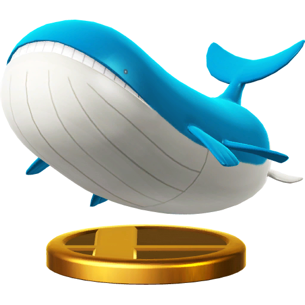</a></th>
    <th><b>Wailord</b></th>
    <th>With a height of 14.5 metres, Wailord is the largest Pokémon discovered thus far. 14.5 metres - that's roughly the size of a five-storey building! Also, Wailord can dive to a depth of 3,000 metres on only one breath. That's more than twice the height of Ben Nevis! Some remarkable stats for a remarkable Pokémon.</th>
  </tr>
  <tr>
    <th><a href="Xerneas.png" >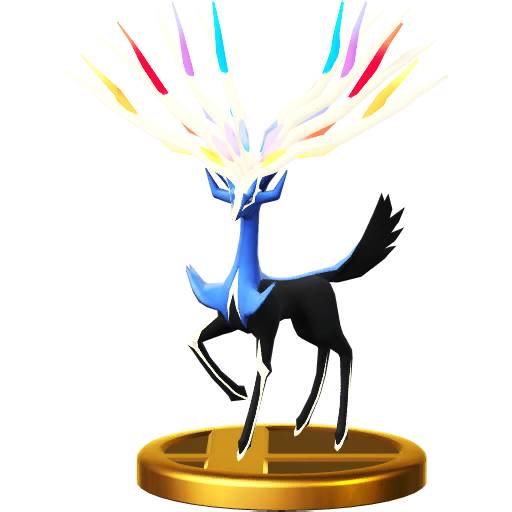</a></th>
    <th><b>Xerneas</b></th>
    <th>The horns on Xerneas's head give this Pokémon the power to bestow eternal life. When summoned in a match, energy will emanate from it and make all fighters glow. Pretty it may be, but this Geomancy move makes everyone much easier to launch. Knowing that, will you take advantage of the situation, or try to stay out of the way?</th>
  </tr>
  <tr>
    <th><a href="Zoroark.png" >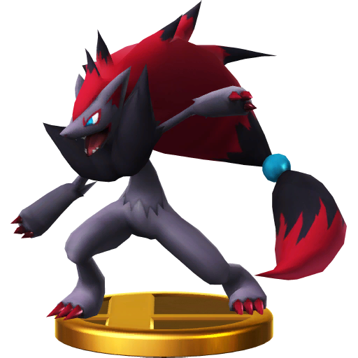</a></th>
    <th><b>Zoroark</b></th>
    <th>This Dark-type Pokémon is a powerful illusionist, and uses its power to confuse any that would threaten its home and loved ones. When it uses its Fury Swipes attack, it vanishes, then reappears next to an opponent and sends them flying into the air. It then slashes at them furiously before slamming them into the ground.</th>
  </tr>
</table>



<table class="fixed" border="1">
    <col width="150px" />
    <col width="100px" />
    <col width="600px" />

<tr>
    <th></th>
    <th><b>Bald Bull</b></th>
    <th>A 36-year-old Turkish boxer in the prime of his career. His name hints at his bullish nature. In the match itself, you'll see him snort through his nostrils before using his special move, the Bull Charge. Little Mac's going to need to keep all his wits about him to avoid being bowled over by that one.</th>
  </tr>

<tr>
    <th></th>
    <th><b>Doc Louis</b></th>
    <th>Behind every great boxer is a first-class coach, and energetic former heavy-weight champion Doc Louis is Little Mac's. Now and then, he'll put his chocolate bar down, his game face on, and spar with Little Mac, throwing punches just like in his glory days. No one's happier to take a knockout blow from Little Mac than Doc Louis!</th>
  </tr>  
<tr>
    <th></th>
    <th><b>Don Flamenco</b></th>
    <th>This passionate boxer from Madrid fights in a style reminiscent of a flamenco dancer. His special move Rose Flurry is a burst of hooks followed by a right-handed uppercut. You'll do more than just make his hair stand on end if you land a powerful blow, and the combination of anger and embarrassment will really get him worked up.</th>
  </tr>
<tr>
    <th></th>
    <th><b>Giga Mac</b></th>
    <th>This Final Smash turns Little Mac into a hulking monster of a man. In Punch-Out!! for Wii, Little Mac could take this form by building up the gauge with some well-timed blows. In this game, it seriously powers up his attacks and makes him even faster. He'll completely dominate on the ground, but air battles are outside his weight class.</th>
  </tr>  
<tr>
    <th></th>
    <th><b>Glass Joe</b></th>
    <th>Glass Joe might not sound exactly like 'glass jaw', but you've got to admit, it takes guts to go into the ring with a name that tells everyone your weak point. Knock him out and...it'll rain croissants. Weird things aside, there's one thing you can say about Glass Joe: he's a man who doesn't give up, no matter how many times he loses.</th>
  </tr>
<tr>
    <th></th>
    <th><b>Great Tiger</b></th>
    <th>Great Tiger is an Indian boxer and a skilled magician. He can float in the air, disappear, make copies of himself - it all seems just a little bit unfair. The audience might start to wonder whether they came to watch a magic show instead of a boxing match! Maybe they should just count themselves lucky that they can see both at once.</th>
  </tr>
<tr>
    <th></th>
    <th><b>King Hippo</b></th>
    <th>Do you think the spectators sitting behind King Hippo can even see Little Mac at all? This fighter's so heavy, he can't even get up onto his own two feet by himself! Knock him down once, and the fight's in the bag. You just need to wear him down, and before you know it, you'll have him on the floor dreaming of his South Pacific home.</th>
  </tr>
  <tr>
    <th></th>
    <th><b>Little Mac</b></th>
    <th>The little guy from Punch-Out!! has come a long way since his humble beginnings fighting the almost literal boxing giants. Above his damage display, you'll notice he has a little meter that fills up as he fights. When it's full, you'll see a flashing "KO" there. That means you can unleash a devastating uppercut!</th>
  </tr>
  <tr>
    <th></th>
    <th><b>Little Mac (Alt.)</b></th>
    <th>Little Mac always puts his best fist forward, especially when you use Straight Lunge! You start by charging, then unleash the punch whenever you press the button again. Charge it to the max and its launching power is formidable! Also, attacks won't make you flinch while you're charging or once you've fully charged the move.</th>
  </tr>
<tr>
    <th></th>
    <th><b>Mr. Sandman</b></th>
    <th>This American boxer from Philadelphia is known for his speedy punches and brash, straightforward style. His ring name comes from a German folk tale about a fairy who makes people fall asleep. When you face him in the ring, make sure he's the one who boards the express train to dreamland.</th>
  </tr>
<tr>
    <th></th>
    <th><b>Piston Hondo</b></th>
    <th>This passionate boxer from Madrid fights in a style reminiscent of - yep, you guessed it - flamenco dancing. His favorite move, Rose Flurry, is a combo of hooks followed by a lethal uppercut. He's at his most dangerous, thought, if you knock a certain something off his head. Ohhh, yes - that really gets him worked up!</th>
  </tr>
<tr>
    <th></th>
    <th><b>Soda Popinski</b></th>
    <th>A Russian boxer who loves the delicious taste of soda. He brings whole cases of it to the ringside to drink before each match. And, er...during matches as well. In fact, even after he's been knocked out, he still gropes around for his soda bottle! Try not to let him drink too much, though - that soda helps him recover from your blows!</th>
  </tr>
<tr>
    <th></th>
    <th><b>Von Kaiser</b></th>
    <th>At 42, this German boxer is the oldest on the circuit. He may have changed is haircut, but nothing's changed about his habit of shaking his head right before he throws a punch. If you knock him down he'll come back at you with a spinning punch as soon as he gets up again, so stay on your toes!</th>
  </tr>
</table>

