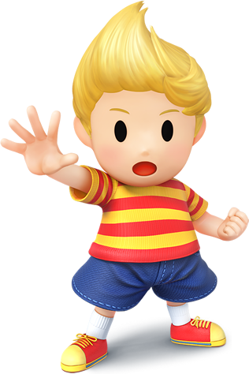



 
Lucas, the younger of the Tazmilly twins, joins the smash as a returning DLC fighter! He brings along a stick, as well as Rope Snake, he also has quite a few tricks of his own being able to use a vast amount of PSI abilities like PK Freeze, PK Fire, PK Thunder, and PSI Magnet. He also has a wide variety of Attacks that have been supercharged with his psychic energy such as his powerful up-smash which sends his foes off into oblivion, as well as his all mighty knee which will send all his opponents spiked straight to nowhere. Back in his home of the Nowhere islands he was tasked in pulling the seven needles that kept the dark dragon sealed underground and saving his world from the Pork Army, as well as crossing blades with the mysterious Masked Man. Remember, no crying until the end!





