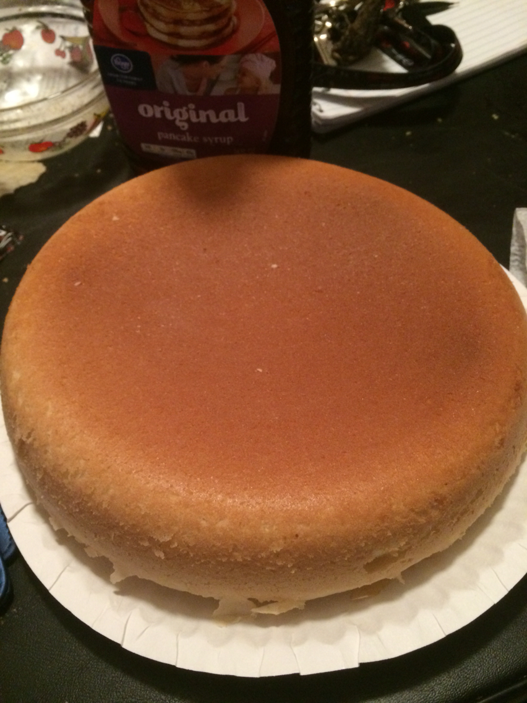



  

This page is located in the Smash Bros. 4 section of the site. Did you know a section for Smash for 3DS and Wii U existed? A surprising amount of work went into it, too! 
  
This history segment will cover the games portion of the site, so the M1, M2, M3, EB64, and Smash sections. A lot of these pages were mainly updated when the games first started making headlines, noteably with the Smash games, Mother 3, EB64, etc. A lot were left incomplete or other interesting information surfaced, but the staff at the time did not have access to here or other sections were being actively managed at the time. Thus began the start of Project Reconstructed Caribou!
  
PRC was the first more modern attempt to get these pages up-to-date and fill in the pages the previous staff could not. Though, that effort took place over ten years ago now, somehow... METC ran that project, but due to the vast amount of managing of effort it takes to get things implemented, it was incomplete by the time he drifted away from the site. So began Project Ultimate Chimera!
  
PUC was originally headed by NorthofOnett and he was someone who was very involved with PRC, so it was a fitting choice. The project was left undone and others would come to pick up the mantle, but a significant amount was done, in fact! So a massive thank you to all the staff and members who contributed their time to research and the implementation to the project! It is not as far from completion as you might think and I am sure it will be completed one day!
  

 
The next and last part of this game is located in the Newsroom Board. Locate the most recent edited posted on the 2018: Year of the Runaway Dog thread and you will find your final task.

  

(The picture this time is a giant pancake I made in a rice cooker way back when. Isn't that nuts!? Look how big it is! It tastes just like cake! You should definitely try it some time!)

