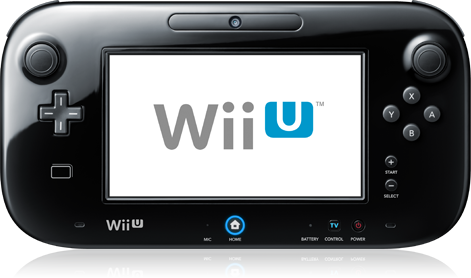
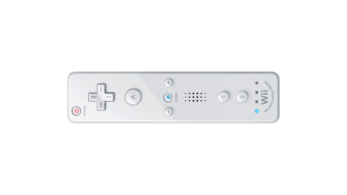
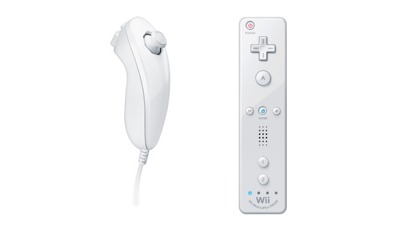
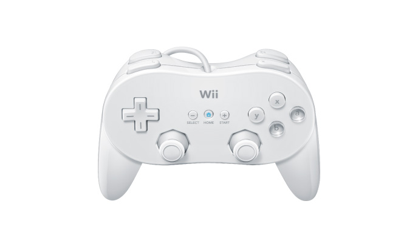
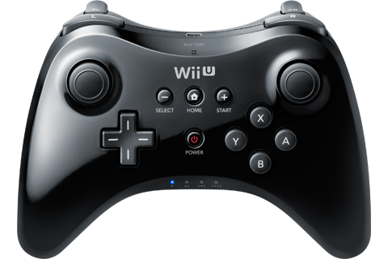
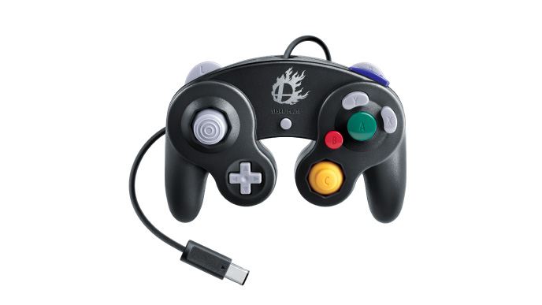
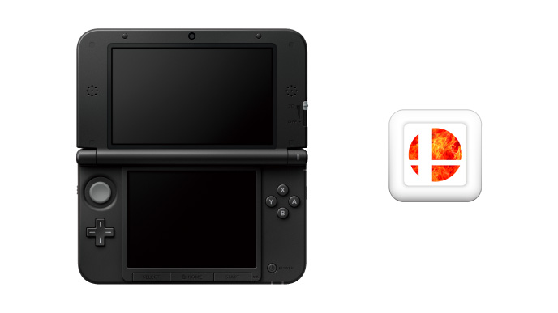
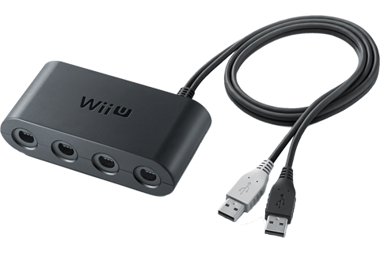
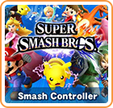


<table class="fixed" border="0">
    <col width="500px" />
    <col width="500px" />

  <tr>
    <th></th>
    <th><b>Wii U GamePad</b>
  
The Wii U GamePad can display the screen for off-TV play, or it can display characters and damage percentages.</th>
   </tr>

  <tr>
    <th></th>
    <th><b>Wii Remote</b>
  
The Wii Remote can be used, held sideways. Both regular Wii Remotes and Wii Remote Pluses work.
</th>
   </tr>

  <tr>
    <th></th>
    <th><b>Wii Remote and Nunchuck</b>
  
The Wii Remote can also be used with a Nunchuck; here, the Wii Remote is held upright.
</th>
   </tr>

  <tr>
    <th></th>
    <th><b>Wii Classic Controller</b>
  
The Classic Controller and Classic Controller Pro work.
</th>
   </tr>

  <tr>
    <th></th>
    <th><b>Wii U Pro Controller</b>
  
. . .
</th>
   </tr>

  <tr>
    <th></th>
    <th><b>Nintendo GameCube Controller</b>
  
You can use Nintendo GameCube Controllers if you have a GameCube Controller Adapter. You can use both controllers from the original GameCube, or controllers from a new set released specifically for Super Smash Bros. for Wii U.
</th>
   </tr>

  <tr>
    <th></th>
    <th><b>Nintendo 3DS</b>
  
A Nintendo 3DS can be used to control the Wii U version of Super Smash Bros. All systems in the family work (New Nintendo 3DS, Nintendo 3DS XL, etc.) To control the game, however, you will either need a copy of Super Smash Bros. for Nintendo 3DS, or the downloadable software, Smash Controller.
  
A Nintendo 3DS is the only way to control the 3DS version.
</th>
   </tr>

 <tr>
    <th></th>
    <th><b>GameCube Controller Adapter</b>
  
A GameCube Controller Adapter is required to use Nintendo GameCube Controllers with the Wii U version of Super Smash Bros. It is connected to the system via USB, and allows up to four controllers to be plugged in.
</th>
   </tr>

 <tr>
    <th></th>
    <th><b>Smash Controller</b>
  
An application for the Nintendo 3DS. With it, you can control the Wii U version using a 3DS even if you don’t own the 3DS version.
  
It is available from the Nintendo eShop: http://www.nintendo.com/games/detail/smash-controller-3ds
</th>
   </tr>
</table>


