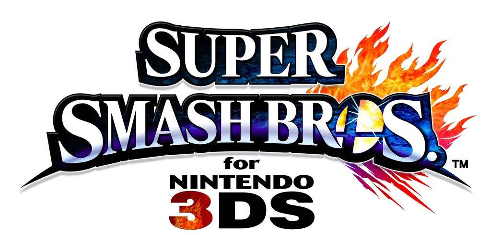
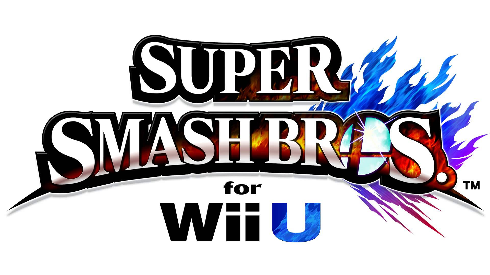



	
	<table valign="top">
		<tr>
			<td class="label">Title:</td>
			<td>Super Smash Bros. 3DS</td>
		</tr>
		<tr>
			<td class="label">System:</td>
			<td>3DS (Nintendo)</td>
		</tr>
		<tr>
			<td class="label">Genre:</td>
			<td>Fighting/Platformer</td>
		</tr>
		<tr>
			<td class="label">Release:</td>
                        <td>September 13, 2014(JP) October 3, 2014 (NA) October 3, 2014 (EU) October 4, 2014 (AUS)</td>
		</tr>
		<tr>
			<td class="label">Rating:</td>
			<td>ESRB: E10+</td>
		</tr>
		<tr>
			<td class="label">Price:</td>
			<td>$39.99 (US)</td>
		</tr>
		<tr>
			<td class="label">Players:</td>
			<td>1-4</td>
		</tr>
		<tr>
			<td class="label">Publisher:</td>
			<td>Nintendo</td>
		</tr>
		<tr>
			<td class="label">Developer:</td>
			<td>Sora Ltd.  Bandai Namco Games</td>
		</tr>
		<tr>
			<td class="label">Director:</td>
			<td>Masahiro Sakurai</td>
		</tr>
	</table>

The fourth installment of the ever popular Smash Bros. series and the first title to make its way to a handheld console... that's right, it's Super Smash Bros. 3DS! Of course, with another game, it means more Mother goodness!  
This title was released for the 3DS in late 2014, and there are 38 available characters at the start with 8 to unlock. With DLC, there are a total of a whole <b>58</b> whopping characters in the game at the current time! Once again, there are many collectibles to aim for, such as trophies, music, and unlockables for fighters. In addition, a Wii U version of the game was released a few months later. Both games are compatible, so you can always smash against your friends despite what system they own. Each title has its own unique levels and perks.
  
Once again, our dear Ness makes a return to the series, fired up to battle. Unfortunately, during the launch, our boy Lucas was nowhere to be found, but to everyone's delight, he made a return as DLC. Not only that, but Magicant is now an available stage, exclusive to the 3DS version and features our favorite bird-man, the Flying Man! The iconic Starman also makes a depute as an Assist Trophy!
  
This section of our site is devoted to both the 3DS and Wii U versions of the game, so if you may be looking for character art, want to listen to some tunes, have a hankering for detailed info about what content from the Mother-series appear in the games, this is the place for you! If you see something missing that you think is worthwhile, please send it to the Section Maintainer! We'd love to make this <i>the</i> place to get all that delicious EB goodness!

 





	
	<table valign="top">
		<tr>
			<td class="label">Title:</td>
			<td>Super Smash Bros. Wii U</td>
		</tr>
		<tr>
			<td class="label">System:</td>
			<td>Wii U (Nintendo)</td>
		</tr>
		<tr>
			<td class="label">Genre:</td>
			<td>Fighting/Platformer</td>
		</tr>
		<tr>
			<td class="label">Release:</td>
                        <td>November 21, 2014 (NA) November 28, 2014 (EU) November 29, 2014 (AUS) December 6, 2014(JP)</td>
		</tr>
		<tr>
			<td class="label">Rating:</td>
			<td>ESRB: E10+</td>
		</tr>
		<tr>
			<td class="label">Price:</td>
			<td>$59.99 (US)</td>
		</tr>
		<tr>
			<td class="label">Players:</td>
			<td>1-8</td>
		</tr>
		<tr>
			<td class="label">Publisher:</td>
			<td>Nintendo</td>
		</tr>
		<tr>
			<td class="label">Developer:</td>
			<td>Sora Ltd.  Bandai Namco Games</td>
		</tr>
		<tr>
			<td class="label">Director:</td>
			<td>Masahiro Sakurai</td>
		</tr>
	</table>

The fourth installment of the ever popular Smash Bros. series and again to appear on a console, that's right, it's Super Smash Bros. Wii U! Of course, with another game, it means more Mother galore!  
This title was released for the Wii U in late 2014, and there are 38 available characters at the start with 8 to unlock. With DLC, there are a total of a whole <b>58</b> whopping characters in the game at the current time! Once again, there are many collectibles to aim for, such as trophies, music, and unlockables for fighters. In addition, a 3DS version of the game was released a few months earlier. Both games are compatible, so you can always smash against your friends despite what system they own. Each title has its own unique levels and perks, but the Wii U definitely has far more game modes, exclusive for its version.
  
The famous protagonist of EarthBound, Ness, appears once more with his blonde-haired counterpart, Lucas, who is available as DLC! Though Magicant isn't available in this version, EarthBound does appear as a masterpiece! The infamous Devil's Car also makes a depute as a common enemy in the game!
  
This part of the site is devoted to Smash 4 and all systems it appeared on. If you want to find game info, content from the Mother-series found in the games, listen to some tunes, etc., this place is for you! We're still working on filling this page with content, but if you see something missing, please let the Section Maintainer know!

 




<b>June 14, 2018:</b>
<ul><li><a href="http://starmen.net/ssb4/images/" >Official Art page</a> was completed. Characters, alt. costumes, and thumbnails updated. Still missing DLC characters, however.</li></ul>

<b>June 14, 2018:</b>
<ul><li><a href="https://starmen.net/ssb4/music/" >Music page</a> was given a huge overhaul. Should be complete.</li></ul>




<table1 />
Section maintainer: 
<table2 />
<a href="https://forum.starmen.net/members/CerealQueen">CerealQueen</a> 
<table3 />

